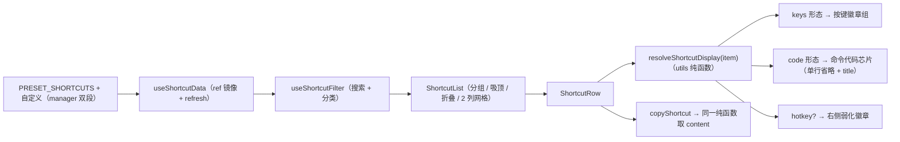

## 产品概述

对快捷键面板（右侧边栏 Dock）做一轮「内容展示 + UI 打磨 + 模块样式瘦身」的重构：卡片主内容不再固定显示快捷键，而是自适应地展示「要复制的内容」—— 它可能是一组快捷键、一条命令行，或一段其他待复制的文本。

## 核心功能

### 1. 卡片主内容自适应展示

- 主内容取「要复制的内容」（有 `copyContent` 用 `copyContent`，否则回退到 `keys`）。
- 自动识别形态（无需用户选择）：
- **按键组合**（如 `Ctrl+Alt+N`、`Ctrl+K, Ctrl+C`、`F5`、`Ctrl+\, E`）→ 渲染为按键徽章组（等宽字体、主色文字、浅主色底 + 描边），按序列逐个显示。
- **命令行 / 路径 / 参数 / 长文本**（如 `npm install -g`）→ 渲染为等宽「代码块」芯片（中性色文字、浅灰底 + 描边），单行省略号，悬停可看全文。
- 识别失败时偏保守：宁可把按键当文本渲染成代码块，也不把命令误渲染成徽章。

### 2. 快捷键次显

- 当条目的快捷键与主内容**不同**且快捷键本身是按键组合时，在内容行右侧以小号**弱化徽章**次显（次级色文字、透明底 + 中性描边）。
- 两者相同（如 Visual Studio 类条目）时不重复显示。

### 3. 复制行为

- 点击主内容区或行内复制按钮，均复制「要复制的内容」，成功给出短提示；主内容区需有意可读的可访问名称（不用命令原文当按钮名）。

### 4. 表单承载「内容 + 可选快捷键」

- 新增/编辑对话框字段调整：**内容（必填）**、**快捷键（可选）**，以及原有的名称、描述、分组。
- 快捷键留空时视为与内容相同（用于「内容即快捷键」的简单场景），避免出现空字段。

### 5. 搜索覆盖内容

- 搜索需同时命中名称、描述、以及主内容（否则用户按命令搜索会搜不到）。

### 6. UI 优化

- 卡片高度不随内容长短变化，2 列网格同行等高；窄卡片下主内容省略、次显徽章与操作按钮不挤压、悬停不抖动。
- 悬停 / 键盘聚焦反馈统一；不使用阴影，维持「边框分层 + 主色强调」的暖色 Codex 风格。

### 7. 样式审查（仅本模块）

- 审查模块 5 个样式文件：清理已删功能（收藏 / 最近使用 / 冲突）的残留选择器、已无模板对应的类、未被引用的局部变量，合并重复规则，并复核字号 / 字重 / 行高 / 圆角是否全部走设计 Token。

## 视觉要点

卡片为两行结构：上行「主内容芯片 +（可选）弱化快捷键徽章 + 悬停浮出的操作按钮」，下行「名称 + 平台/分类标签 + 描述（放不下时自动折行）」。主内容芯片与描述均单行省略、悬停看全文，卡片最小高度固定。

## 技术栈

- 视图：Vue 3 `<script setup>` + TypeScript + SCSS（项目自建设计 Token 与 52 个共享组件库，无第三方 UI 依赖）
- 宿主：思源笔记插件 Dock 面板（`RightTop`，宽 480px）
- 持久化：`PluginStorage` + `TypedStorage`（`@/utils/pluginStorage`、`@/utils/typedStorage`），单键 `plugin-shortcuts-custom`
- 复用共享组件：`Tag` / `Button` / `Toolbar` / `Select` / `Input` / `Dialog` / `ConfirmDialog` / `FileUpload` / `IconWrapper`（写前先查 `interface Props`，禁止猜 props）
- 提示与文件：`pushMsg`（`@/api`）、`triggerBlobDownload`（`@/utils/domUtils`）

## 实现方案

### 1. 把「显示形态」收敛为纯函数（单一事实来源）

新增显示模型纯函数，视图只消费结果，避免判定规则在卡片、复制逻辑、表单里各写一遍：

- `isKeyCombo(text)`：按 `,` 拆多序列 → 每段按 `+` 拆 → 逐段 token 白名单校验（修饰键 `Ctrl/Cmd/Alt/Shift/Win/Meta/Option/Command/Control`、`F1`–`F12`、方向键与命名键 `Enter/Esc/Tab/Space/Delete/Backspace/Home/End/PageUp/PageDown/Insert`、单字符符号 `\` `/` `[` `]` `-` `=` `.` `,` 等、单字母与单数字）。全部命中才判为按键组合。
- `resolveShortcutDisplay(item)`：返回 `{ content, kind, hotkey? }` —— `content = copyContent || keys`；`hotkey` 仅在「`copyContent` 存在且与 `keys` 不同且 `keys` 是按键组合」时给出；`kind = isKeyCombo(content) ? "keys" : "code"`。
- **先判定、再决定是否按 `,` 拆**：现有 `splitKeySequences` 只要遇到逗号就拆，对含逗号的命令行会误伤，因此拆序列仅对 `kind === "keys"` 调用。
- 复杂度：单遍字符串扫描 O(内容长度)，每张卡片一次，42 条预置规模下无性能压力，无需虚拟滚动。

### 2. 数据契约保持向后兼容（零迁移）

- `ShortcutInfo` **不改结构**：`keys` 仍为必填字符串，`copyContent` 仍可选。老数据（`keys` 里存的其实是命令）经自动判定即可正确渲染为代码块，无需迁移、无需改导入导出载荷。
- 表单映射：**内容 → `copyContent`**、**快捷键 → `keys`**；快捷键留空时把内容副本写入 `keys`，从而不破坏 `sanitizeShortcutArray` 既有的「`keys` 非空才保留」约束（该约束也是导入文件的校验基线）。
- 额外加一道防御：`sanitizeShortcutArray` 里 `keys` 为空时回退取 `copyContent`，保证外部导入的文件不会因缺 `keys` 被丢弃。
- `ShortcutFormData` 扩展为携带「内容 + 快捷键」（`content` / `keys`，其中 `keys` 允许为空）。

### 3. 复制逻辑与展示共用同一纯函数

`useShortcutData.copyShortcut` 改为消费 `resolveShortcutDisplay(item).content`，与卡片显示同源，杜绝「显示的是一套、复制的是另一套」的规则分叉（当前复制用 `copyContent || keys`、显示却是 `keys`，正是本轮要修的问题）。

### 4. 悬停看全文的实现选择

采用**原生 `title`** 而非共享 `Tooltip`，理由：① 本模块所有图标按钮与描述早已统一用 `title`（`Button` 本身提供 `title` prop），风格一致；② 共享 `Tooltip` 需要为每个锚点持有元素引用与受控状态，42+ 张卡片 × 内容/徽章会产生大量实例与引用，渲染成本与内存代价明显；③ `title` 同时充当可访问名，零额外 DOM。若后续需要统一的气泡质感，再单独评估接入共享 `Tooltip`。

### 5. 样式策略

- 只使用 `src/components/kit/variables.scss` 中真实存在的短名 Token（注意 `$s-px4` 不存在，可用 `$s-px1/2/3/5/6/7/10/14/18` 与 `$s-1..$s-16`）。
- 命令芯片底色取 `--b3-theme-surface-lighter`（`--b3-theme-surface` 与 `--b3-theme-background` 仅差约 3% 灰度，若用 surface 会在卡片悬停时与卡底融为一体），描边一律 `--b3-border-color`。
- 三处近似芯片（按键徽章 / 命令芯片 / 弱化快捷键徽章）在样式文件中按「同族规则块」组织，公共几何量用文件顶部局部变量集中声明，避免重复声明。

### 6. 兼容与风险控制

- 不改注册链（`config.ts` / `features/index.ts` / `settings.ts` / `icons.ts`），不改预置数据文件（42 条样本已覆盖纯热键、多序列热键、含 `\` 与空格的热键、命令四种形态）。
- 单例 `ShortcutManager` 数组非响应式 ⇒ 视图仍走 `useShortcutData` 的 `ref` 镜像 + 变更后 `refresh()`。
- 共享 `Select` / `Input` 为纯受控组件：`:model-value` + handler 时必须回写受控值；`v-if` 切换控件后须手动移交焦点（表单分组字段已有此处理，改造时保持）。
- 通知、日志与错误处理沿用现有做法：模块层不注入文案，视图出口用 i18n 拼接；失败走 `pushMsg` + `console.error`，不泄露数据内容。

## 架构设计

分层与数据流保持不变（本轮只在纯函数层与视图层扩展）：



## 实施要点（执行注意）

- ⛔ 禁止新建任何临时校验脚本（含临时 SCSS 编译脚本），也不允许用完即删；验证只走 `read_lints` / `pnpm typecheck` / `pnpm i18n:merge|verify` / `pnpm validate:icons`，SCSS 与 `pnpm lint` / `vite build` 由用户执行。
- 新增/修改的 `.ts` / `.vue` 顶部保留功能说明注释；`.scss` 无此要求。
- i18n 新增键带 `sc` 前缀（扁平命名空间防撞名），中英双侧同步；已废弃功能的旧键（`shortcutKeys` / `keysPlaceholder` / `filterRecent` / `scFilterConflict` 等）**保留不删**。
- `types/index.ts` 是显式导出清单（值 export / type export 两块），新增类型与常量须两处登记。
- 卡片仍是「纯展示的局部布局容器」例外（未复用共享 `Card`），README 已记录该决定，保持现状。
- 单文件不超过 500 行；`utils.ts` 已 200+ 行，新增纯函数后仍需留意阈值，必要时按「判定规则」与「数据变换」分组。

## 目录结构

```
src/features/shortcut/
├── types/
│   └── index.ts                 # [MODIFY] 新增显示模型类型 ShortcutDisplay 与表单数据扩展（content/keys）；更新导出清单
├── utils.ts                     # [MODIFY] 新增 isKeyCombo / resolveShortcutDisplay；searchShortcuts 覆盖 copyContent；buildCustomShortcut 支持内容+可选快捷键
├── components/
│   ├── ShortcutRow.vue          # [MODIFY] 主内容自适应渲染（徽章组 / 命令芯片）、右侧弱化快捷键徽章、复制触发区可访问名、单行省略 + title
│   └── ShortcutDialog.vue       # [MODIFY] 表单改为「内容（必填）+ 快捷键（可选）」，校验与错误态随之调整
├── composables/
│   └── useShortcutData.ts       # [MODIFY] copyShortcut 改走 resolveShortcutDisplay，与显示同源
└── styles/
    ├── ShortcutRow.scss         # [MODIFY] 新增命令芯片与弱化徽章样式，按同族规则块组织；清理残留/未使用选择器与变量
    ├── ShortcutList.scss        # [MODIFY] 审计清理：未使用类与局部变量、可合并规则
    ├── PanelHeader.scss         # [MODIFY] 审计清理：已删筛选组的残留、重复声明
    ├── ShortcutDialog.scss      # [MODIFY] 审计清理：分组新建态辅助类是否仍在用、间距是否可复用 Token
    └── index.scss               # [MODIFY] 审计清理：面板壳层是否有冗余声明

src/i18n/zh_CN/shortcuts.json    # [MODIFY] 新增 scContent / scContentPlaceholder / scHotkey / scHotkeyPlaceholder / scHotkeyTip 等
src/i18n/en_US/shortcuts.json    # [MODIFY] 同步英文
src/features/shortcut/README.md  # [MODIFY] 卡片示意改为「主内容 + 次显快捷键」，补表单字段说明与样式审计结论摘要
docs/shortcut-refactor-spec.md   # [MODIFY] 追加 CR-007（含验收点与边界）
```

不改动：`data/`（42 条预置足够覆盖各形态）、`manager.ts`、`dataTransfer.ts`、`types/storage.ts`、`index.ts`、`PanelHeader.vue`、`ShortcutList.vue`、注册链文件。

## 关键代码结构

```ts
// types/index.ts —— 显示模型（视图与复制逻辑共用的唯一契约）
export interface ShortcutDisplay {
  /** 主内容：要复制的内容（copyContent 优先，回退 keys） */
  content: string
  /** 形态："keys" 渲染为按键徽章组；"code" 渲染为等宽代码芯片 */
  kind: "keys" | "code"
  /** 次显快捷键：仅当存在 copyContent 且与 keys 不同、且 keys 本身是按键组合时给出 */
  hotkey?: string
}

// utils.ts —— 判定与解析（纯函数，不依赖 Vue）
export function isKeyCombo(text: string): boolean
export function resolveShortcutDisplay(item: ShortcutInfo): ShortcutDisplay

// types/index.ts —— 表单数据扩展（内容必填、快捷键可选）
export interface ShortcutFormData {
  id: string
  name: string
  description: string
  /** 内容：要复制的内容（写入 copyContent） */
  content: string
  /** 快捷键：可选，留空时回落为内容副本（写入 keys） */
  keys: string
  group: string
}
```

## 设计定位

延续现有 Codex 暖色风格与 2 列卡片网格的密度基线，只对卡片的**内容层级**做重构：把「要复制的内容」提升为主视觉，按键退为辅助信息；不引入新色板、不使用阴影，层级靠底色与边框表达。

## 卡片结构（宽约 200px/列）

```
┌──────────────────────────────────┐
│ [npm install...]        Ctrl+Alt+N  ⧉ │  ← 内容行：主内容 + 弱化快捷键徽章 + 悬停操作
│ 安装项目依赖                       │  ← 名称行：名称
│ 安装项目依赖到本项目的 node_modules  │  ← 描述行（可有可无，放不下自动折行）
└──────────────────────────────────┘
```

- **主内容芯片**：等宽字体、10px、单行省略；按键形态用主色文字 + 10% 主色底 + 20% 主色描边；命令形态用正文色文字 + `surface-lighter` 底 + 中性描边。整块是复制触发区，悬停描边加深，键盘聚焦显示焦点环。
- **弱化快捷键徽章**：10px 等宽、次级色文字、透明底 + 中性描边、`shape` 紧凑圆角；不参与压缩（`flex-shrink: 0`），空间不足时整枚折到第二行而非被压扁。
- **悬停操作按钮**：复制（自定义项另加编辑 / 删除），默认隐藏但恒定预留空间（`visibility`），悬停与键盘聚焦淡入，卡片尺寸零抖动。
- **卡片容器**：1px 中性描边 + 6px 圆角 + `background` 底色；悬停 / 聚焦转为 surface 底 + 主色浅描边；卡片最小高度固定，同行等高。

## 交互动效

- 悬停与聚焦的底色 / 描边过渡 120ms ease；操作按钮淡入 120ms。
- 点击主内容或复制按钮 → 复制 → 顶部短提示（2s）；不改变任何视觉状态残留。

## 响应式与可用性

- 两列网格在窄面板下仍保持 2 列；主内容 `min-width: 0` 省略、徽章与标签不压缩、操作按钮不换行。
- 全文通过 `title` 悬停查看（同时作为可访问名的一部分）；复制触发区的可访问名形如「复制：npm install」，包含可见文本以满足无障碍标签匹配。

## 字体与颜色

- 内容与快捷键统一等宽字体栈；名称与描述走中文优先字体栈；字号只用 12px 基准与 10px 辅助两级。
- 颜色全部取思源主题变量（`--b3-theme-*` / `--b3-border-color`）并提供 Token 兜底，命令芯片刻意避开与卡底仅差约 3% 灰度的 `surface`。

## Agent Extensions

### Skill

- **Feature Evolution**
- Purpose: 本需求是对已开发完成的快捷键模块做迭代（内容展示模型 + UI 打磨 + 样式审查），用它把变更落成规格：显示模型与判定规则、表单字段映射、卡片视觉规格、样式审查范围与验收点，并追加 CR-007 变更记录。
- Expected outcome: 一份可执行的变更规格与验收清单（含"不新增显示类型字段、零数据迁移、仅在模块内审查样式"等边界），作为后续实现与回归的依据。
- **universal-arch-skill**
- Purpose: 收尾时对本模块做架构规范校验，重点检查模块内三层分层（types / utils / composables / 视图）、样式外置与 Token 使用、显式导出清单、注册完整性、模块间零直接导入，以及纯函数是否真正无副作用。
- Expected outcome: 结构校验结论与需修正项清单，确保重构后模块与项目既有规范一致（校验脚本走 Skill 自带工具，不新建任何临时脚本）。

### SubAgent

- **code-explorer**
- Purpose: 样式审计需要把 5 个 SCSS 中的全部选择器 / 局部变量与 4 个组件模板（含插槽内容、`:deep()` 目标、动态类名绑定）做全量交叉比对，属于跨多文件的重复性检索，交给子代理批量完成。
- Expected outcome: 一份可执行的冗余清单——未使用类与选择器、未被引用的局部 Sass 变量、可合并的重复规则、已删功能残留、Token 违规点（含行号），作为清理任务的输入。