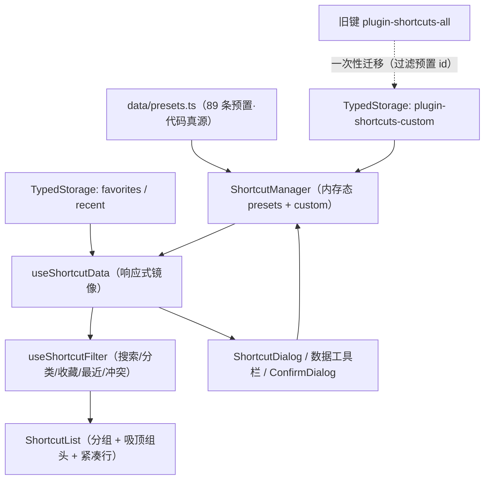

## 产品概述

对快捷键模块（`src/features/shortcut`）做一次完全重构，覆盖「UI 显示排版」与「数据持久化」两条主线，并补充数据备份与冲突提示能力。模块仍是右侧边栏 Dock 面板，功能入口与注册方式不变。

## 核心功能

### 1. 紧凑列表式排版（替换现有 2 列卡片网格）

- 单列行式布局：一行内依次为「按键徽章组 + 名称/描述 + 分类标签 + 操作按钮」，左右对齐整齐，一屏可见条目数显著提升。
- 按键徽章沿用等宽字体 + 主色浅底描边风格，固定宽度对齐；名称单行省略，描述作为次级小字紧随其后。
- 保留按「分组」聚合，组头吸顶显示组名与数量；组头可折叠/展开，折叠后仅留组头。
- 工具栏两行：第一行搜索框、分类下拉、新增按钮；第二行筛选（收藏/最近/冲突，互斥切换，带选中态与无障碍按下态）、条目总数、导入、导出、重置。
- 行内操作：收藏（星标切换）、复制（点击按键徽章或复制按钮，写入最近使用）、编辑与删除（仅自定义项出现）。
- 空态使用共享图标与提示文案，不再用原生 svg。

### 2. 数据持久化重构（三键分离 + 自动迁移）

- 预置快捷键不再落盘，代码即唯一真源，插件升级后新增预置立即可见。
- 自定义快捷键单独存一个键；收藏与最近使用保持各自独立的键。
- 首次加载时自动把历史遗留的「预置 + 自定义混存」数据中的自定义项迁出，迁移完成后清理旧键；迁移失败不得丢弃旧数据，下次启动重试。
- 加载时清洗收藏/最近记录中已不存在或非法的 id。
- 判定「预置 / 自定义」改为依据预置 id 集合，不再依赖分类名硬编码。

### 3. 导入导出与重置

- 导出：把自定义快捷键导出为 JSON 文件下载，结构含版本号、导出时间与自定义条目列表。
- 导入：选择 JSON 文件后解析校验，非法条目忽略并计数；与预置 id 冲突的条目忽略；同 id 已存在则覆盖，新 id 追加；结果以提示消息说明新增/覆盖/忽略数量。
- 重置为默认：二次确认后清空自定义快捷键与收藏、最近记录，预置数据不受影响。

### 4. 快捷键冲突检测

- 对按键组合做归一化（忽略大小写与空白、按键段排序、多序列排序）后分组，同一组合出现两项及以上即判定冲突。
- 冲突项在列表中高亮提示，并可查看与之冲突的条目名称；筛选区提供「冲突」筛选，可只看冲突项。

## 范围边界（本次不做）

不做预置项的隐藏与编辑；不做平台（Win/Mac）过滤；不引入分页与虚拟滚动。

## 技术栈

- 视图：Vue 3 `<script setup>` + TypeScript + SCSS（项目自带 52 个共享组件库，无第三方 UI 依赖）
- 运行宿主：思源笔记插件（Dock 面板，宽 480px，`RightTop`）
- 持久化：`PluginStorage` + `TypedStorage<T>`（`@/utils/pluginStorage`、`@/utils/typedStorage`）
- 提示与文件能力：`pushMsg`（`@/api`）、`triggerBlobDownload`（`@/utils/domUtils`）、共享 `FileUpload`（`mode="basic"`）读取 JSON
- 验证：`read_lints`、`pnpm typecheck`（vue-tsc）、`pnpm i18n:merge` + `pnpm i18n:verify`、`pnpm validate:icons`（`pnpm lint` / `vite build` 由用户执行）

## 实现方案

### 1. 分层与数据流

沿用 gitPush 模块已验证的分层范式：**纯函数 → 数据层（Storage/Manager）→ 响应式接线（composables）→ 视图组件**。



### 2. 关键决策与权衡

- **预置不落盘**：彻底消除「升级后拿不到新增预置」与「预置冗余落盘」两个历史问题；代价是预置不可被持久化覆盖 —— 与用户本次「不做预置隐藏/编辑」的范围一致。
- **预置判定用 id 集合**：`PRESET_ID_SET` 由 `PRESET_SHORTCUTS` 派生，替代 `category === "custom"` 的硬编码判定，且在 Manager 与 UI 双层设防（按钮不渲染 + Manager 拒绝写入/删除预置 id）。
- **视图层保留 `ref` 镜像**：单例 Manager 内部数组非响应式，computed 直接读 Manager 会被永久缓存（本模块刚踩过此坑）。镜像 + 变更后 `refresh()` 是本项目既有正确模式。
- **导入导出只覆盖自定义项**：预置来自代码，导出预置无意义且会引入版本漂移；导入时与预置 id 冲突的条目一律忽略，从数据层上保证预置不被污染。
- **冲突检测一次遍历建 Map**：`buildConflictMap(list) => Map<id, 冲突名称列表>`，O(n)；已在 89 条预置中确认 0 条使用 `platform` 字段，故冲突判定不区分平台与分类。
- **不引入虚拟滚动/分页**：现网规模为 89 条预置 + 少量自定义（上限约 200 行），单遍渲染与吸顶组头 + 折叠已足够；避免为一个面板引入额外复杂度。
- **折叠状态会话级**：不持久化，减少一个存储键与迁移面。

### 3. 存储契约与迁移算法

- 键位：`plugin-shortcuts-custom`（新增，`ShortcutInfo[]`）、`plugin-shortcuts-favorites`、`plugin-shortcuts-recent`（沿用，无需迁移）、`plugin-shortcuts-all`（旧键，仅作迁移源）。
- 迁移守卫用「新键是否已存在」而非「新键是否非空」，因此删除全部自定义项后不会被旧数据复活：

| 步骤 | 行为 |
| --- | --- |
| 1 | 读取新键 `custom`；已存在（含空数组）⇒ 迁移已完成，直接返回 |
| 2 | 读取旧键 `all`；不存在 ⇒ 首次安装，返回空数组且不写盘 |
| 3 | 过滤旧数据：仅保留 id 不在预置集合中的条目，并清洗字段（强制 `category: "custom"`） |
| 4 | 写入新键；写入成功才删除旧键；写入失败保留旧键，下次启动重试 |
| 5 | 收藏/最近记录按「存在的 id」剪枝，有变化则回写 |


### 4. 复杂度与性能

- 过滤/分组/冲突：均为单遍 O(n)，仅在数据或筛选条件变化时重算（computed 缓存）。
- 每次增删改只写自定义列表（不再全量写 89 条预置），写盘量下降约一个数量级。
- 行组件 `:key="shortcut.id"`，折叠用 `v-show`，避免反复创建/销毁行组件。

## 实施要点

- **必须复用共享组件**：`Toolbar`、`Input`、`Select`、`Button`、`ToggleButton`、`Tag`、`Dialog`、`ConfirmDialog`、`FileUpload`、`IconWrapper`、`Message`/`pushMsg`。写入前先查 `componentPreview/previewData/*.ts` 或组件源码 `interface Props`，禁止猜 props。
- **图标**只能取 `kit/icons.ts` 已注册 `IconKey`（已确认存在 `download`、`upload`、`refreshLeft`、`chevronDown`、`chevronRight`、`warning`、`filter`、`contentCopy`、`star`/`starOutline`、`timerOutline`、`add`、`close`、`edit`、`delete`、`search`）。
- **样式必须外置**：`styles/*.scss`，`.vue` 的 `<style scoped>` 只留一行 `@use`；仅用短名 Token（`$t-xs`/`$t-2xs`/`$s-2`/`$r-base`/`$fw-semibold`/`$lh-tight`/`$ff-mono`）；分隔线用 `--b3-border-color`（`--b3-theme-surface` 与 `--b3-theme-background` 只差约 3% 灰度）；半透明语义色写 `rgba($c-warning, 0.12)`。
- **一组合并项切换用 `Button` 分组 + `aria-pressed`**（当前筛选按钮只切 `.active` 类，本次顺带修正）；覆写共享 `Button` 尺寸须同时写 `min-height: 0`。
- **i18n 双侧同步**：`src/i18n/{zh_CN,en_US}/shortcuts.json` 新增键须带语义前缀（建议 `sc`，如 `scImportJson`/`scExportDone`/`scFilterConflict`/`scConflictWith`/`scResetConfirmMsg`），跑 `pnpm i18n:verify`；不动既有键名。
- **不改注册链**：`config.ts` / `features/index.ts` / `settings.ts` / `icons.ts` 均已登记本模块，重构不触及；`types/index.ts` 为显式导出清单，新增类型需在值与类型两块登记。
- **迁移安全**：任何写盘失败都不得删除旧键；迁移在 `index.ts` 初始化阶段一次完成，之后再挂载面板数据。
- **文件头注释**：新增/修改的 `.ts` 与 `.vue` 顶部保留一行功能说明（`.scss` 无此要求）。
- 禁用 `npx tsc --noEmit`；禁用直接 `plugin.saveData`（`src/config/settings.ts` 为唯一例外）。

## 目录结构

```
src/features/shortcut/
├── index.ts                        # [MODIFY] 初始化改为「迁移旧键 → 注入 presets+custom → 保存回调只写自定义」；Dock 注册与对外导出签名保持
├── index.vue                       # [MODIFY] 收敛为编排层：组合两个 composable、分发事件、挂载对话框；不再承载筛选与存储细节
├── manager.ts                      # [MODIFY] 双段模型（presets + custom）：loadFrom / isPreset / addOrUpdateCustom / removeCustom / replaceCustom / clearCustom / 保存回调载荷改为仅自定义列表
├── utils.ts                        # [MODIFY] 纯函数：搜索、字段清洗、按键归一化、冲突 Map、筛选管道、id 剪枝（不依赖 Vue 与实例）
├── dataTransfer.ts                 # [NEW] 导入导出纯逻辑：导出载荷构建、导入文本解析与合并结果统计（与存储、UI 解耦）
├── types/
│   ├── index.ts                    # [MODIFY] 新增筛选查询、冲突 Map、导入结果、导出载荷类型；导出清单两处登记；预置判定所需常量类型
│   └── storage.ts                  # [MODIFY] 槽位改为 custom + favorites + recent，旧键仅作只读迁移源；新增 loadCustom/saveCustom/migrateLegacy/clearUserData
├── composables/
│   ├── useShortcutData.ts          # [NEW] 数据层接线：响应式镜像 + refresh、增删改、收藏/最近、导入/导出/重置、迁移后初始化
│   └── useShortcutFilter.ts        # [NEW] 视图筛选管道：搜索/分类/收藏/最近/冲突开关与计数，调用 utils 纯函数
├── components/
│   ├── PanelHeader.vue             # [MODIFY] 两行工具栏：搜索/分类/新增 + 筛选（Button 组 + aria-pressed）/总数/导入/导出/重置
│   ├── ShortcutList.vue            # [NEW] 取代网格：分组渲染 + 吸顶组头（组名/数量 Tag/折叠按钮）+ 折叠 + 空态
│   ├── ShortcutRow.vue             # [NEW] 取代卡片：单行紧凑布局（按键徽章/名称+描述/分类 Tag/冲突警示/操作按钮）
│   ├── ShortcutDialog.vue          # [MODIFY] 改用共享 Dialog + Input（label/error），保留 close/confirm/error 事件契约
│   ├── ShortcutGrid.vue            # [DELETE] 被 ShortcutList 取代
│   └── ShortcutCard.vue            # [DELETE] 被 ShortcutRow 取代
├── styles/
│   ├── index.scss                  # [MODIFY] 面板壳层与滚动条按新排版微调
│   ├── PanelHeader.scss            # [MODIFY] 两行工具栏与新筛选/操作区
│   ├── ShortcutList.scss           # [NEW] 列表容器、吸顶组头、折叠态、空态
│   ├── ShortcutRow.scss            # [NEW] 行网格布局、按键徽章、冲突高亮、hover/收藏/最近标记
│   ├── ShortcutDialog.scss         # [MODIFY] 适配共享 Dialog（仅保留少量表单间距覆写）
│   ├── ShortcutGrid.scss           # [DELETE] 随网格组件移除
│   └── ShortcutCard.scss           # [DELETE] 随卡片组件移除
└── README.md                       # [MODIFY] 更新三键存储模型、迁移策略、紧凑列表 UI 结构、导入导出/重置/冲突检测说明
```

同时修改：`src/i18n/zh_CN/shortcuts.json`、`src/i18n/en_US/shortcuts.json`（新增约 12 至 14 个键，双侧对齐）。`data/` 下 89 条预置数据文件不改动。

## 关键代码结构

```ts
// types/storage.ts —— 键位与迁移契约
const SHORTCUTS_CUSTOM_KEY = "plugin-shortcuts-custom"
const SHORTCUTS_FAVORITES_KEY = "plugin-shortcuts-favorites"
const SHORTCUTS_RECENT_KEY = "plugin-shortcuts-recent"
const SHORTCUTS_LEGACY_ALL_KEY = "plugin-shortcuts-all" // 只读迁移源

class ShortcutStorage {
  loadCustom(): Promise<ShortcutInfo[]>
  saveCustom(list: ShortcutInfo[]): Promise<boolean>
  /** 幂等迁移：新键已存在则跳过；写入失败保留旧键 */
  migrateLegacy(presetIds: ReadonlySet<string>): Promise<ShortcutInfo[]>
  clearUserData(): Promise<boolean> // 重置：清理自定义 + 收藏 + 最近
}
```

```ts
// utils.ts / dataTransfer.ts —— 纯函数（统一在 utils 层，可独立验证）
export function sanitizeShortcutArray(data: unknown, forceCustom?: boolean): ShortcutInfo[]
export function normalizeShortcutKeys(keys: string): string
export function buildConflictMap(list: ShortcutInfo[]): Map<string, string[]>
export function filterShortcuts(list: ShortcutInfo[], query: ShortcutQuery): ShortcutInfo[]
export function pruneIds(ids: string[], validIds: ReadonlySet<string>): { ids: string[]; changed: boolean }
export function buildExportPayload(custom: ShortcutInfo[]): ShortcutExportPayload
export function parseImportPayload(text: string, presetIds: ReadonlySet<string>): ShortcutImportResult
```

```ts
// manager.ts —— 公开面（预置只读、自定义可写）
class ShortcutManager {
  loadFrom(input: { presets: ShortcutInfo[]; custom: ShortcutInfo[] }): void
  getAllShortcuts(): ShortcutInfo[]        // [...presets, ...custom]
  isPreset(id: string): boolean
  addOrUpdateCustom(item: ShortcutInfo): Promise<boolean> // 预置 id 直接拒绝
  removeCustom(id: string): Promise<boolean>              // 预置 id 返回 false
  replaceCustom(list: ShortcutInfo[]): Promise<boolean>   // 导入合并后整体写入
  setSaveCallback(cb: (custom: ShortcutInfo[]) => Promise<boolean>): void
}
```

## 设计定位

对现有 Dock 面板（右侧边栏，宽 480px）做**排版重构**：由「2 列卡片网格」改为「单列紧凑行式列表」，延续既有 Codex 风格（用边框与底色分层，不用阴影），信息密度优先、扫描路径呈 Z 字形稳定对齐。

## 布局与信息层级

- **工具栏（两行，吸顶于面板顶部）**
- 第一行：搜索输入框（前置放大镜图标，占满剩余宽度）+ 分类下拉（选项标注各分类条目数）+ 新增按钮（主色实底图标按钮）。
- 第二行：左侧筛选组（收藏 / 最近 / 冲突，描边按钮，「一组互斥选项」用同组按钮 + `aria-pressed` 表达按下态，按下时主色描边 + 主色浅底 + 主色文字）；右侧依次为条目总数（中等字重、次级色）、导入（描边图标按钮，内部由文件选择组件承载）、导出（描边图标按钮）、重置（描边警示色图标按钮），三者带气泡提示。
- 行高固定，两行之间以 `--b3-border-color` 细分隔线区分区段。
- **列表主体（可滚动区）**
- 按分组渲染；组头吸顶：左对齐组名（小字号、加粗、字符间距略增、左侧 3px 主色竖条）+ 数量胶囊标签 + 右侧折叠按钮（人字形图标，`aria-expanded` 表达状态）；折叠后仅保留组头。
- 单行结构（左右两段）：左侧为按键徽章组（等宽字体、主色文字、主色 10% 浅底、1px 主色 20% 描边、小圆角，整组占固定最小宽度以保证各行纵向对齐）；中部为名称（基准字号、加粗、单行省略，后附平台标记）与描述（辅助小字、次级色、单行省略）；右侧为分类标签（仅工具类分类显示，中性或主色浅底行内标签）与操作按钮组（收藏、复制、编辑、删除；编辑与删除仅自定义项出现）。
- 冲突行：整行淡琥珀底（警告色约 12% 透明度）+ 左侧 3px 警告色竖条 + 名称后警告图标（悬停气泡列出冲突条目名称）。
- 收藏行：星标点亮（琥珀色）；最近使用行：名称前置小圆点（主色），与冲突竖条错位、互不干扰。
- 悬停：行底色切换为浅表面色，操作按钮同时显现（默认低透明度、悬停/聚焦恢复全不透明，键盘聚焦可见轮廓）。
- **空态**：居中图标（已注册的搜索图标，低透明度）+ 提示文案，不出现原生 svg。
- **对话框**：新增/编辑沿用共享对话框（标题 + 四字段表单 + 底部「取消/确认」，字段带标签、必填校验与错误提示）；删除与重置沿用共享确认框（重置按钮为警示色，二次确认）。

## 交互与动效

- 组折叠/展开为 120ms 高度或透明度过渡；行悬停底色与按钮透明度过渡 120ms ease。
- 点击按键徽章或复制按钮即复制到剪贴板并计入最近使用，复制成功给出短提示。
- 冲突筛选按下后列表只保留冲突项并同步更新总数；搜索结果为空时展示空态。

## 响应式与可用性

- 面板宽度可变（480px 默认，最窄约 360px）：中部名称/描述弹性收缩并省略，按键徽章组设最小宽度不被压缩，操作按钮不换行；空间不足时优先隐藏描述行。
- 所有图标按钮均提供可访问名称（`title` 或 `aria-label`），筛选与折叠暴露 `aria-pressed` / `aria-expanded`；键盘可遍历行内操作。

## 信息密度

- 行高控制在 32 至 36px，一屏（约 600px 高）可见约 14 至 16 行，配合吸顶组头与折叠，可在 89 条预置 + 自定义条目中快速定位。

## Feature Evolution

- **名称**：`Feature Evolution`
- **用途**：本需求属于「已开发完成的功能做整体重构」，用它把「紧凑列表排版 + 三键分离持久化 + 导入导出/重置 + 冲突检测」落成变更规格（含范围边界、验收点、迁移要求）。
- **预期产出**：一份可执行的变更规格与验收清单，作为后续任务 2 至 5 的实现依据，并明确「不做预置隐藏/编辑、不做平台过滤」的边界。

## universal-arch-skill

- **名称**：`universal-arch-skill`
- **用途**：在重构收尾时对本模块做架构规范校验，重点检查模块内三层分层（types / utils / composables 与视图）、样式外置与 Token 使用、显式导出清单、注册完整性、模块间零直接导入。
- **预期产出**：模块结构校验结论与需修正项清单，确保重构后的 shortcut 模块与项目既有规范一致。