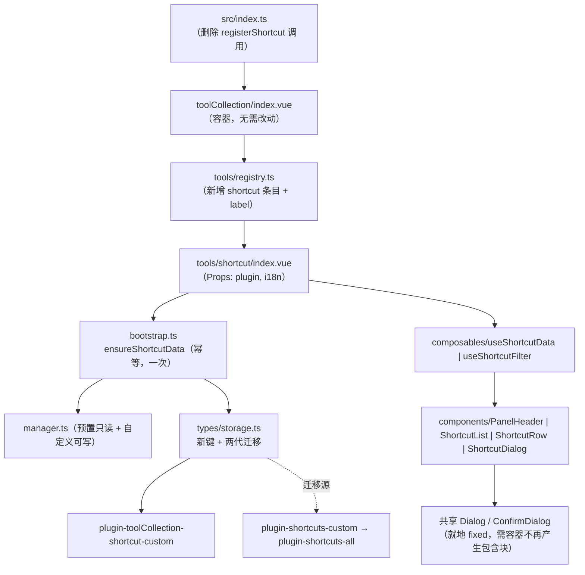

## 产品概述

将「快捷键」功能整体迁入工具合集（tool collection）：不再作为右侧边栏独立 Dock 呈现，而是成为工具合集左侧工具列表中的一项，与 JSON 格式化、正则测试器等工具并列；同时完成入口摘除、存储键改名与旧数据迁移、宽面板栅格适配。迁移与既有先例（`unitConverter` / `wordQuery` 迁移至 `tools/`）保持完全一致的做法。

## 核心功能

### 1. 整体搬迁并注册为工具

- 快捷键模块全部 23 个文件从 `src/features/shortcut/` 迁入 `src/features/toolCollection/tools/shortcut/`，保持原有分层（纯函数 / Manager / composables / 组件 / 样式 / 预置数据）与文件命名不变。
- 在 `tools/registry.ts` 注册一条工具项（id `shortcut`，标签取已有 i18n 键 `shortcuts`），左侧工具列表多出一项「快捷键」，点击即在右侧内容区渲染原面板。
- 删除独立 Dock 面板、`registerShortcut` 调用与导出、`enableShortcuts` 设置项及其文案键（与 unitConverter / wordQuery 迁移后的状态一致），并在原位置留下「已迁移至 …」注释占位。

### 2. 宽面板栅格自适应

- 卡片网格由固定 2 列改为自适应列数：窄容器仍 2 列，底部面板（默认约 1060px）与独立窗口下自动 4~6 列。仅调整栅格声明，卡片结构、字号、颜色、间距全部保持不变。

### 3. 存储键改名与两代旧数据迁移

- 唯一可写键改名为 `plugin-toolCollection-shortcut-custom`；用户已有的自定义快捷键在首次打开工具后自动迁移到新键，迁移成功后清理旧键。
- 需同时兼容两代旧键：现役 `plugin-shortcuts-custom`（本版本之前的用户都有）与更早的三键混存键 `plugin-shortcuts-all`（早期用户，需过滤预置条目）。迁移幂等：以「新键是否存在（含空数组）」为守卫，用户删光自定义项后不被旧数据复活；写新键成功才删旧键，失败保留待下次重试，不丢数据。

### 4. 迁入工具合集后的集成适配（不改变功能语义）

- 弹层（新增/编辑对话框、删除确认框、重置确认框）在工具合集面板内仍能相对视口正确居中，不被面板裁剪或错位。
- 工具合集的全局键盘导航（方向键切换工具、Home/End、Ctrl+数字、Esc 关面板）在弹层打开时让路，避免「在对话框里按 Esc 把整个面板关掉」。
- 面板高度与滚动收敛为单层滚动，不出现第二条滚动条，外层内边距叠加后观感可接受。

### 5. 功能与数据保持

- 快捷键的预置数据（NPM 10 / NVM 9 / Visual Studio 23）、搜索与分类筛选、分组折叠、导入导出 JSON、重置默认、冲突与收藏等既有取舍全部保持现状不变；导入导出载荷结构不变。

## 技术栈

- 视图：Vue 3 `<script setup>` + TypeScript + SCSS（项目自建设计 Token + 共享组件库，无第三方 UI 依赖）
- 宿主：思源笔记插件；迁移后承载方式为 toolCollection 的 `overlay`（底部面板）/ `tab`（独立页签或浮动窗口）双形态（由容器提供，工具本身无需关心）
- 持久化：`PluginStorage` + `TypedStorage`（`@/utils/pluginStorage`、`@/utils/typedStorage`）
- 复用：共享 `Dialog` / `ConfirmDialog` / `Input` / `Select` / `Tag` / `Button` / `Toolbar` / `FileUpload` / `IconWrapper`；提示 `pushMsg`（`@/api`）；文件下载 `triggerBlobDownload`（`@/utils/domUtils`）
- 验证链：`read_lints` / `pnpm typecheck` / `pnpm i18n:merge|verify` / `pnpm validate:icons`；`pnpm lint` 与 `vite build` 由用户执行

## 实施方式

### 1. 照搬既有先例，不发明新模式

仓库已有两次同型迁移（`0bddaf3e` / `d91fd92a` 单位换算、`cb360d2d` 速记恢复），迁移后 `src/features/{unitConverter,wordQuery}/` 目录已删除、`src/features/index.ts` 与 `src/index.ts` 用注释占位、i18n 分片仍保留。本次严格对齐，不引入新机制。

工具契约（已核实先例 `tools/wordQuery/index.vue:134-139`）：

```ts
interface Props {
  i18n: Record<string, any> & { [工具键]?: Record<string, string> }
  plugin?: Plugin
}
const props = defineProps<Props>()
```

容器侧渲染为 `<component :is="currentToolMeta.component" :key="currentTool" :plugin="plugin" :i18n="plugin.i18n" />`，因此切换工具即销毁重建、关闭面板即卸载。由此确定两点设计：

- `plugin` 在快捷键工具中是**必填**（存储、`pushMsg` 都要用），不像 wordQuery 那样可选。
- 数据初始化必须**幂等且与挂载次数无关**：不能每次挂载都重读存储覆盖内存态。方案是新增 `tools/shortcut/bootstrap.ts`，用模块级缓存的 Promise 保证「只初始化一次」，工具挂载时 `await ensureShortcutData(plugin)` 后再 `refresh()`。

`useToolReorder`（`composables/useToolReorder.ts:30-44`）在恢复 `toolCollection-tabOrder` 时会把不在持久化列表中的新工具追补到末尾，因此**新增第 10 个工具不会破坏用户已保存的工具顺序**。既有 `Ctrl+1~9` 导航只覆盖前 9 项（`useToolNavigation.ts:69-74`），本次不改代码，仅在文档注明该上限。

### 2. 目录搬迁与职责收敛

搬迁后删除模块入口中的「Dock 注册」职责，`tools/shortcut/index.ts` 收敛为「数据层 + 公共 API 再导出」：

- 删除：`registerShortcut()`、`addShortcutDock()`（`createVueDockApp` / `position: "RightTop"` / `width: 480` / `icon: "iconKeymap"` / `type: "shortcut-panel-dock"`）及其 `@/utils/vueAppHelper` 导入。
- 新增 `bootstrap.ts`：`ensureShortcutData(plugin)`（模块级 Promise 缓存）+ 内部 `initShortcutData` 逻辑（`storage.migrateLegacy(presetIds)` → `manager.loadFrom({ presets, custom })` → `manager.setSaveCallback`），错误处理沿用 `console.error`，不向模块层注入文案。
- `index.vue`：Props 对齐工具契约、`onMounted` 改为 `await ensureShortcutData(props.plugin)` 后 `init()`；面板根容器与列表滚动高度适配内容区。

### 3. 三个集成风险的处理（均已核到证据）

#### 风险 A：弹层在工具合集面板内会被裁剪/错位（必须前置修复）

证据链：

- 共享弹层**不使用 Teleport**、遮罩为就地 `position: fixed; inset: 0; z-index: 10000`（`src/components/styles/_overlay.scss:20-26`；`src/components/styles/Tooltip.scss:3`、`MegaMenu.scss:12`、`TieredMenu.scss:2` 均注明「不 Teleport」）。弹层面板带 `role="dialog"` / `aria-modal`（`src/components/Dialog.vue:19-20`）。
- 工具合集面板基础态**常驻** `transform: translateX(-50%) scaleY(1)` 且带 `contain: layout paint`（`src/features/toolCollection/styles/index.scss:35-37`）。

这两条合起来意味着：面板成为 fixed 后代的**包含块**，且 paint containment 会把后代绘制裁剪到面板内 ⇒ 遮罩的 `inset: 0` 不再等于视口、弹层被关进面板并被裁掉。

修复（改 `toolCollection/styles/index.scss`，不动共享组件库）：

- 移除 `contain: layout paint;`
- 删除基础态 `transform: translateX(-50%) scaleY(1);`，居中改为 `left: 0; right: 0; margin-inline: auto;`（保留 `width: 100%` + 内联 `max-width` 由 `usePanelResize` 控制；`transform-origin: bottom center` 保留）
- 过渡类中的 `transform: translateX(-50%) scaleY(0)` 改为 `transform: translateY(100%)`（去掉 `translateX(-50%)`，因不再靠 transform 居中）
- `tab-mode` 已有的 `transform: none` 覆盖保持不变；面板自身的 `z-index: 9998` 层叠上下文内，遮罩 `z-index: 10000` 仍高于面板内容，遮盖关系正确

对既有工具是净改善（同样的裁剪问题一并消除），回退面小。

#### 风险 B：全局键盘导航抢键

`useToolNavigation.handleKeydown`（`composables/useToolNavigation.ts:46-50`）已排除输入类元素，搜索框安全；残留问题是弹层打开时：`Escape` 会关掉整个工具合集面板，方向键 / Home / End / Ctrl+数字 仍会切换工具。

修复（改工具合集侧，不把工具特例写进 shortcut）：在 `handleKeydown` 的 `visible` 判定之后加一道「模态弹层让路」：

```ts
// 模态弹层打开时让路：优先由弹层自身处理 Esc / 方向键，避免连带关闭整个工具合集
if (document.querySelector('[role="dialog"][aria-modal], .si-dialog-mask, .si-confirmdialog-mask')) return
```

选择器用属性与类名双保险；`ConfirmDialog` 的遮罩类名需在实施阶段用 [subagent:code-explorer] 核实（若它复用同一 `overlay-mask` mixin 则类名同族，只需补一条选择器）。

#### 风险 C：双层滚动与内边距叠加

`.tool-collection-content` 自身是 `flex: 1; min-width: 0; min-height: 0; overflow-y: auto; padding: $s-3`（窄屏 `$s-2`，`toolCollection/styles/index.scss:255-260`、`:317-319`），而快捷键面板根是 `height: 100%; overflow: hidden` + 内部列表自己滚动。处理：面板根改为填满可用高度（`height: 100%` 相对内容区 content box，配合容器 `min-height: 0`），内部列表独占滚动；实测若出现第二条滚动条或内边距过挤，仅微调面板根的内边距（不改内容区全局 padding，避免影响其他工具）。

### 4. 存储键改名与两代迁移算法

| 键 | 角色 | 说明 |
| --- | --- | --- |
| `plugin-toolCollection-shortcut-custom` | 新键（唯一可写） | 迁移目标；`exists()` 含空数组即为迁移完成 |
| `plugin-shortcuts-custom` | 迁移源 1（现役旧键） | 本版本之前的用户都有；内容已是「仅自定义」段 |
| `plugin-shortcuts-all` | 迁移源 2（更老三键） | CR-001 之前的「预置 + 自定义」混存，需过滤预置 id；仅早期用户存在 |
| `plugin-shortcuts-favorites` / `-recent` | 不迁移 | 自 CR-003 / CR-006 已停用，旧数据留在用户目录不参与业务 |


`ShortcutStorage.migrateLegacy(presetIds)` 流程：

1. 新键 `exists()`（含空数组）⇒ 迁移已完成，直接 `loadCustom()` 返回（用户删光自定义项后不被复活）。
2. 依次读源：`plugin-shortcuts-custom`；为空再读 `plugin-shortcuts-all`。两者皆不存在 ⇒ 首次安装，返回空数组且**不写盘**。
3. `sanitizeShortcutArray(raw, true)`，并统一过滤预置 id（对源 1 是无操作，纯防御）。
4. `saveCustom(custom)` 成功 ⇒ 删除所有已读到的源键；失败 ⇒ `console.error` 记录并保留源键，下次启动重试（不丢数据）。
5. 返回 custom。

复杂度与风险：单次读 + 单次写、数据规模为「自定义条目数」（通常 < 100），无性能压力；失败路径只影响迁移时机，不影响已有数据。

### 5. 栅格自适应

`tools/shortcut/styles/ShortcutList.scss` 的分组内容区：

```
// 改前：grid-template-columns: repeat(2, minmax(0, 1fr));
// 改后
grid-template-columns: repeat(auto-fill, minmax(220px, 1fr));
```

保留 `align-items: stretch`（同行等高）。窄容器（Dock 时代 480px、工具合集窄屏）自然回落为 2 列；1060px 底部面板约 4 列，独立窗口更宽则为 5~6 列，卡片内部 `flex-basis: 120px` 的描述折行逻辑无需改动。

### 6. 架构设计



### 7. 目录结构

```
src/features/toolCollection/
├── index.vue                              # 不改动（容器按 registry 渲染，README 明确「无需修改 index.vue」）
├── README.md                              # [MODIFY] 「已集成工具」表新增「快捷键」行；补充迁移说明
├── composables/
│   └── useToolNavigation.ts               # [MODIFY] handleKeydown 增加「模态弹层打开时让路」判定
├── styles/
│   └── index.scss                         # [MODIFY] 移除 .tool-collection-panel 的 contain / 常驻 transform，改 margin 居中；过渡 transform 改 translateY
└── tools/
    ├── registry.ts                        # [MODIFY] 新增 shortcut 工具项 + TOOL_LABEL_KEYS 条目
    └── shortcut/                          # [NEW 目录，由 src/features/shortcut/** 整体迁移而来，23 文件]
        ├── index.ts                       # [MOVED+MODIFY] 删除 registerShortcut / addShortcutDock 与 vueAppHelper 依赖；保留公共 API 与再导出
        ├── bootstrap.ts                   # [NEW] ensureShortcutData(plugin)：模块级 Promise 缓存的幂等初始化
        ├── index.vue                      # [MOVED+MODIFY] Props 对齐 { plugin, i18n }；onMounted 走 ensureShortcutData 后 init()；面板高度适配内容区
        ├── manager.ts                     # [MOVED] 不变（预置只读 + 自定义可写，模块级单例）
        ├── utils.ts                       # [MOVED] 不变（显示模型 isKeyCombo / resolveShortcutDisplay、筛选、清洗、表单构建）
        ├── dataTransfer.ts                # [MOVED] 不变（导入导出载荷与合并）
        ├── types/index.ts                 # [MOVED] 不变（显式导出清单）
        ├── types/storage.ts               # [MOVED+MODIFY] 新键 plugin-toolCollection-shortcut-custom；migrateLegacy 扩为两代迁移源
        ├── composables/useShortcutData.ts # [MOVED] 不变（ref 镜像 + refresh）
        ├── composables/useShortcutFilter.ts # [MOVED] 不变
        ├── components/PanelHeader.vue     # [MOVED] 不变
        ├── components/ShortcutList.vue    # [MOVED] 不变
        ├── components/ShortcutRow.vue     # [MOVED] 不变
        ├── components/ShortcutDialog.vue  # [MOVED] 不变（内容必填 / 快捷键可选）
        ├── styles/index.scss              # [MOVED+MODIFY] 面板根高度适配（填满内容区、单层滚动）
        ├── styles/PanelHeader.scss        # [MOVED] 不变
        ├── styles/ShortcutList.scss       # [MOVED+MODIFY] 栅格改 repeat(auto-fill, minmax(220px, 1fr))
        ├── styles/ShortcutRow.scss        # [MOVED] 不变
        ├── styles/ShortcutDialog.scss     # [MOVED] 不变
        ├── data/presets.ts                # [MOVED] 不变（预置聚合）
        ├── data/npm.ts | nvm.ts | visualStudio.ts # [MOVED] 不变
        └── README.md                      # [MOVED+MODIFY] 入口由「右侧边栏 Dock」改为「工具合集工具」；公共 API 路径、目录树、Dock 段落全部更新

src/features/shortcut/                     # [DELETE] 整个目录（含 README，随迁）
src/features/index.ts                      # [MODIFY] 删除 registerShortcut 导出，加注释占位「已迁移至 toolCollection/tools/shortcut/」
src/index.ts                               # [MODIFY] 删除 import 与 if (s.enableShortcuts) registerShortcut(this)，加注释占位
src/config/settings.ts                     # [MODIFY] 删除 enableShortcuts（接口定义 + 默认值）
src/i18n/zh_CN/common.json                 # [MODIFY] 删除 enableShortcuts / enableShortcutsDesc
src/i18n/en_US/common.json                 # [MODIFY] 同上（英文）
src/i18n/{zh_CN,en_US}/shortcuts.json      # 保留不合并（工具通过全局扁平键读取）
docs/shortcut-refactor-spec.md             # [MODIFY] 就地更新 §一（入口）/§二（存储键表）+ 末尾追加 CR-009
AGENTS*.md / README.md                     # [MODIFY 视核实结果] 同步 shortcut 路径、Dock 入口、enableShortcuts、工具合集工具数（9 → 10）等引用
```

### 8. 关键代码结构

```ts
// tools/shortcut/bootstrap.ts —— 幂等初始化（挂载多次只跑一次）
export function ensureShortcutData(plugin: Plugin): Promise<void>

// tools/shortcut/types/storage.ts —— 两代迁移源
const SHORTCUTS_CUSTOM_KEY = "plugin-toolCollection-shortcut-custom" // 新键（唯一可写）
const LEGACY_CUSTOM_KEY = "plugin-shortcuts-custom"                  // 迁移源 1（现役旧键）
const LEGACY_ALL_KEY = "plugin-shortcuts-all"                        // 迁移源 2（更老三键，需过滤预置 id）

export class ShortcutStorage {
  readonly custom: TypedStorage<ShortcutInfo[]>
  async migrateLegacy(presetIds: ReadonlySet<string>): Promise<ShortcutInfo[]>
}

// tools/registry.ts
{ id: "shortcut", label: "", component: ShortcutTool }
TOOL_LABEL_KEYS.shortcut = (i18n) => i18n.shortcuts ?? "Shortcuts"
```

### 9. 实施注意

- 禁止新建任何临时校验脚本；验证只走 `read_lints`、`pnpm typecheck`、`pnpm i18n:merge` + `pnpm i18n:verify`、`pnpm validate:icons`。
- 搬迁后所有 `.ts` / `.vue` 顶部功能说明注释保留（并更新描述中「右侧边栏」等过期措辞）；`styles/*.scss` 无注释要求。
- 样式必须外置（`.vue` 的 `<style scoped>` 只留一行 `@use`）；只用短名 Token（注意 `$s-px4` 不存在）；分隔线用 `--b3-border-color`。
- 单文件 ≤ 500 行；`types/index.ts` 的显式导出清单（值 / 类型两块）在改名或新增导出时两处同步。
- i18n 是全局扁平命名空间：`shortcuts.json` 分片保留不合并；删除 `enableShortcuts*` 前必须全仓库（含 `src/features/**`、`AGENTS*.md`、`docs/**`、根 `README.md`）核实无动态拼接读取残留。
- 迁移前先确认当前工作区干净（`git status`），搬迁用 `git mv` 语义（保留文件历史）；`src/features/shortcut/` 为删除项，不要留下空目录。
- 弹层包含块修复会影响所有工具：实施后需回归 `colorPicker` / `jsonFormatter` 等任一工具的弹层与 toolCollection 面板展开动画。

## Agent Extensions

### Skill

- **Feature Evolution**
- Purpose: 把本次「迁移至工具合集」落成项目既有的增量变更规格：在 `docs/shortcut-refactor-spec.md` 末尾追加 CR-009（入口变更、存储键改名与两代迁移、栅格自适应、三个集成修复、验收点），并就地更新受影响的 §一 入口描述与 §二 存储键表。
- Expected outcome: 一份可执行的 CR-009 变更记录与验收清单，作为本次迁移与后续回归的依据，且与 CR-001 ~ CR-008 的格式保持一致。

- **universal-arch-skill**
- Purpose: 收尾对本模块做架构规范校验，重点检查搬迁后的目录结构完整性（tools/ 下的模块结构）、注册完整性（registry 与被摘除的注册链）、样式外置与 Token 使用、显式导出清单、模块间零直接导入，以及新模块入口 `bootstrap.ts` 是否真正无副作用。
- Expected outcome: 结构校验结论与需修正项清单（使用 Skill 自带校验脚本，不新建任何临时脚本），确保搬迁后模块与项目既有规范一致。

### SubAgent

- **code-explorer**
- Purpose: 两处跨多文件重复检索：一是核实共享弹层的定位与可判定信号（`Dialog` / `ConfirmDialog` / `overlay` 的遮罩类名与 `role` / `aria-modal` 属性），为「键盘让路判定」与「弹层包含块修复」提供确定的选择器；二是清点全仓库对 `features/shortcut` 路径、`registerShortcut`、`enableShortcuts`、Dock 入口的引用面（含 `AGENTS*.md`、`docs/**`、根 `README.md`、脚本与配置）。
- Expected outcome: 一份带 `文件:行号` 的清单——弹层判定信号的确定选择器；以及必须同步或清理的全部引用点，作为集成修复与文档同步任务的输入。