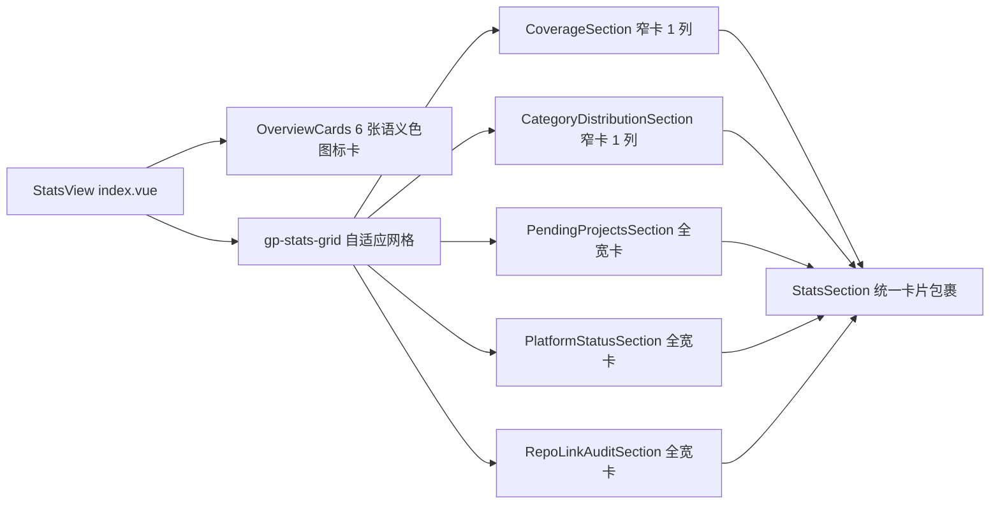

## 产品概述

对 gitPush 统计视图（StatsView）进行 UI 布局重构，解决当前 CSS 多列瀑布流带来的阅读顺序跳跃、区块无卡片感、间距密度不适、总览卡片单调四大痛点。

## 核心需求（已澄清确认）

1. **废弃瀑布流，改用自适应网格 + 区块卡片化**：移除 `column-count/column-width` 瀑布流，改为 2 列 CSS Grid；每个区块（远程覆盖率、分类分布、待处理项目、平台配置状态、仓库链接一致性）由 `StatsSection` 统一包裹为独立边框卡片（surface 底、border 描边），视觉分组清晰
2. **智能列宽分配**：窄内容区块（覆盖率条形、分类分布）各占一列并排；宽内容表格区块（待处理项目 6 列表格、平台矩阵、链接审计）跨全宽（`grid-column: 1 / -1`），阅读顺序从上到下自然流动；窄面板（约 <44rem）自动退化为单列（容器宽度驱动，项目惯例不用 @media）
3. **总览卡片区一并重做**：6 张指标卡（总项目/已配远程/待推送/未提交/收藏/已归档）加入 Iconify 图标 + 语义色（图标色块区分活跃数据与弱化数据），提升设计感
4. **间距密度统一调整**：区块卡片内边距、条目间距、表格行高、chips 间距统一梳理，消除“太挤/太空”

## 边界约束

- 纯 UI/样式重构：不改 props/emit/数据流、不触碰 8 步注册链、不新增 i18n 键（图标纯视觉）
- 严格遵守 Codex UI 硬规则：禁 box-shadow（用边框）、禁硬编码色值/字号/字重/行高（用 `$color-*`/`$font-size-*`/`$font-weight-*`/`$line-height-*` Token）、`$spacing-*`/`$radius-*`/`$vp-mono` 可用
- 弹窗/面板底色 `background` + 卡片 `surface` 凸出的 gitPush 范式；过渡统一 0.12s ease
- 验证由用户自行执行（pnpm lint / i18n:verify / validate:icons / tsc），AI 不构建

## 技术栈

- 现有项目：Vite + Vue 3 + TypeScript + SCSS（思源笔记插件），完全复用现有栈，零新依赖

## 实现方案

### 布局层（index.vue + StatsPanel.scss）

- 将 `.gp-stats-masonry`（CSS 多列瀑布）替换为 `.gp-stats-grid`：`display: grid; grid-template-columns: repeat(auto-fit, minmax(22rem, 1fr)); gap: $spacing-2`。容器宽度驱动列数：宽面板 2 列、窄 Dock 自动单列，与项目“不用 @media”惯例一致
- 在 `index.vue` 模板中为区块添加跨度修饰类：CoverageSection / CategoryDistributionSection 为窄卡（各占 1 列并排），PendingProjectsSection / PlatformStatusSection / RepoLinkAuditSection 为 `--full`（`grid-column: 1 / -1` 全宽），表格获得完整宽度不再挤压，阅读顺序自上而下

### 卡片化（StatsSection.vue + StatsPanel.scss）

- `StatsSection.vue` 是 5 个区块的唯一包裹器，在其根元素 `.gp-stats-section` 上直接赋予卡片样式：`border: 1px solid var(--b3-border-color)` + `background: var(--b3-theme-surface)` + `border-radius: $radius-base` + `padding: $spacing-3`，hover 时 border 过渡为主题色（0.12s ease，禁 box-shadow）
- 区块标题沿用 `_mixins.scss` 的 `gp-section-title-base` / `gp-section-count-base`，仅在卡片内调整 margin
- 移除 `.gp-stats-masonry` 及 `break-inside` 规则，原 `margin-bottom` 间距语义移交 grid gap

### 总览卡片重做（OverviewCards.vue + StatsPanel.scss）

- 配置驱动扩展：`overviewCards` 每项增加 `icon` 字段（mdi 图标：folder/云上传/警示/星标/归档箱等，`@iconify/vue` 直接引用，与 CoverageSection 用法一致，无需注册）
- 卡片结构升级为「语义色图标块 + 数值 + 大写标签」三段式：图标置于 `$radius-sm` 圆角色块内，色块底用各语义色 `-lightest` 变量、图标用语义色（primary/warning/accent/success/muted），活跃数据正常着色、归档卡整体弱化
- 样式与 `_mixins.scss` 的 `stat-card` / `stat-card-value` / `stat-card-label` 三个既有 mixin 合流（原注释已标注第 2 次重复，本次重构顺势消除复制粘贴）

### 间距密度梳理

- 卡片内区块标题 margin-bottom `$spacing-2`；表格行 padding 由 `5px` 调整为 Token 化间距；`.gp-table-wrap` 的 `max-height: 320px` 保留（全宽后表格更宽松）；chips 与条形列表 gap 统一 `$spacing-2`

## 架构影响

仅触达 `src/features/gitPush/components/StatsView/` 与 `src/features/gitPush/styles/StatsPanel.scss`，纯样式与模板修饰类变更，不涉及 composables/types/注册链，回归风险低。

## 设计风格

延续 gitPush 既有 Codex 范式（面板 background 底 + surface 卡片凸出 + 边框分层），在不动数据流的前提下做视觉升级：

- **区块卡片化**：5 个区块统一由 StatsSection 渲染为边框卡片（1px border + surface 底 + $radius-base 圆角 + $spacing-3 内边距），hover 边框过渡主题色，分组一目了然
- **自适应网格**：窄卡（覆盖率/分类分布）双列并排、宽卡（三张表格区块）全宽纵排，自上而下自然阅读，杜绝瀑布流列尾参差
- **总览卡片**：图标色块（语义色 lightest 底 + 语义色图标）+ 等宽字体大数值 + 大写小标签；待推送=警示色、未提交=accent、已配远程=primary、收藏=星标黄、归档=弱化灰
- **密度统一**：卡片间 $spacing-2、卡内 $spacing-3，标题/表格行/chips 间距 Token 化