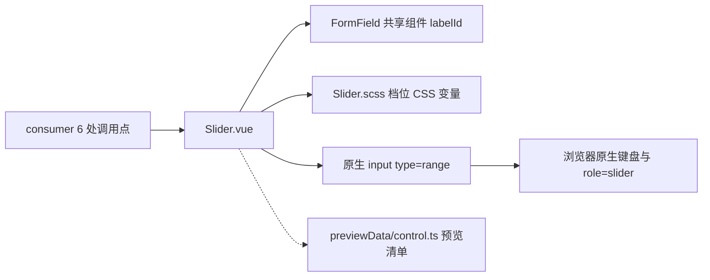

## 产品概述

对照 PrimeVue Slider 官方文档，对项目共享组件「滑块」做一次**缺陷修复**。不改变组件架构（继续使用原生 `input[type=range]`），不新增公开 props，仅让已有 API 真正生效、并修掉三处长期失效的实现。

## 核心功能

- **极值标签（`showMinMax`）**：该属性此前已声明但模板完全未渲染，等于死 prop。修复后开启即在轨道**下方一行**显示最小值（靠左）与最大值（靠右），支持与「当前值」同时开启。
- **只读真正生效（`readonly`）**：原生 `input[type=range]` 不支持 `readonly` 属性，此前只改了个鼠标指针，仍可拖动与用键盘改值。修复后拖拽与方向键/Home/End/PageUp/PageDown 均不能改值，数值保持受控值不变，并向读屏播报只读状态。
- **档位高度真正生效**：超小/小/中/大四档此前只作用于滑块拇指，轨道被伪元素写死为 6px，导致换档时轨道高度毫无变化。修复后轨道高度与拇指尺寸同步随档位缩放。
- **错误态配色修正**：错误态此前引用了本项目从未定义的变量，恒走兜底并在暗色主题下偏暗；改用项目实际定义的错误色变量。
- **标签无障碍关联**：有可见标签时，滑块的无障碍名称自动取自该标签文字（读到「音量，滑块，50，最小 0，最大 100」），此前标签与滑块毫无关联。

## 视觉与交互效果

- 常态外观、四档尺寸的拇指观感、当前值展示位置与配色、拖拽手感**全部保持原样**；唯一新增的可见元素是开启 `showMinMax` 时的极值标签行（次要色、小字号，随档位同步缩放）。
- 换档时（此前无变化的）轨道粗细现在会跟随变化：3 / 4 / 6 / 8px，与拇指 10 / 14 / 16 / 18px 成比例。
- 只读态：光标为默认箭头，拖动无反应，数值不回跳、不闪烁；焦点仍在滑块上（可被 Tab 到达），方向键按下无任何位移。
- 错误态：拇指与错误文案转为主题错误色，明暗主题下均清晰可辨。
- 键盘操作、`role="slider"` 与数值范围播报继续由浏览器原生提供，行为不变。

## 技术栈

- Vue 3.5 + TypeScript + SCSS，沿用项目既有栈，零新增依赖、零新增公开 props、零新增图标、零 i18n 改动。
- 复用现有共享组件 `FormField.vue`（本轮刚补齐的可选 `labelId`）与设计 Token（`src/_variables.scss`、`src/components/styles/_mixins.scss`）。
- 无障碍基线：原生 `input[type=range]` 已提供 `role="slider"`、`aria-valuemin/valuemax/valuenow` 与完整键盘支持，本次只补 `aria-labelledby`（标签关联）与 `aria-readonly`。

## 实现方案

### 总体策略

在不改架构的前提下做三类改动：① 修 3 处「声明了但没生效」的实现（极值标签、只读、档位高度）；② 修 1 处错误的 Token 引用；③ 补齐标签关联与文件头注释，并把控件从 `FormField` 的兄弟位置移进其默认插槽（与本轮 `Select.vue` 同款问题，属同文件同一缺陷类）。

### 关键决策与理由

1. **`showMinMax` 采用「轨道下方两侧」而非「轨道两端内嵌」**：不挤压轨道宽度、长数值不截断，也与当前值展示（轨道右侧）互不抢占空间。DOM 上把 `<input>` 包进一列容器 `__field-column`，极值标签作为其第二行，`__value` 仍留在轨道右侧，`space-between` 让极值精确对齐轨道左右端。
2. **`readonly` 必须自行实现**：原生 range 无 `readonly`。采用「输入/变更事件守卫 + 键盘拦截」双保险。守卫里必须**主动把 DOM 值写回受控值** —— 因为 `modelValue` 未变化时 Vue 不会重新 patch `value`，不写回就会与视觉漂移。键盘拦截沿用 `RadioButton.vue` 的 `READONLY_BLOCKED_KEYS` 先例，但**只拦会改值的键**（方向键 / Home / End / PageUp / PageDown），不拦 Tab。
3. **档位高度用 CSS 自定义属性单点驱动**（项目既有范式：`DatePicker` 的 `--dp-*`、`InputGroup` 的 `--ig-addon-*`）：根类按档位输出 `--si-slider-track-h` / `--si-slider-thumb-size`，基础规则与 4 个伪元素统一消费，一处即可修掉「轨道伪元素漏覆盖」并消除「基础块 + 4 档块」的重复声明。

- **必须带 fallback**（`var(--si-slider-thumb-size, #{$spacing-4})`）：自定义属性继承进 `::-webkit-slider-thumb` / `::-webkit-slider-runnable-track` 是标准行为，但若某环境不继承，fallback 会优雅退化为基础档尺寸，而**不会让拇指消失**。这一退化行为是本决策的风险兜底，需在预览面板目视确认。
- 档位数值与现状**逐一对应**，不改任何档位的观感：超小 3px/10px、小 `$spacing-1`(4px)/14px、中 6px/`$spacing-4`(16px)、大 `$spacing-2`(8px)/18px。

4. **`readonly` 的 DOM 值来源收敛为单一 computed `nativeValue`（`modelValue ?? min`）**：同时用于 `:value` 绑定与回滚函数，避免「绑定用 modelValue、回滚用 modelValue ?? min」两处不一致。
5. **标签关联不新增公开 props**：内部 `useId()` 生成 `labelId` 传给 `FormField`（打在 `<label>` 上），滑块用 `aria-labelledby` 指向它；无 `label` 时该属性不渲染，`aria-valuenow` 等仍由原生提供。
6. **极值文案复用 `formatValue`**：与当前值展示保持一致（`displayValue` 早已走 `formatValue`）。抽出 `formatDisplayValue(value)` 复用于当前值 / 最小值 / 最大值，并在 `formatValue` 的 JSDoc 中明确「当前值与极值共用」。无 `formatValue` 时直接显示数字。
7. **控件移入 `FormField` 默认插槽**：`FormField` 是多根组件（label → 默认插槽 → hint/计数），控件写成自闭合 sibling 会让 `hint`/`error` 排到控件**上方**（预览「错误状态」示例当前即为此错误排布）。`Input.vue` / `Select.vue` 均为插槽写法，本次对齐。全项目给 Slider 传 `hint`/`error` 的仅预览示例一处，改动属修正而非回归。

### 性能与可靠性

- 无新增 watcher / 定时器 / 事件监听；`nativeValue`、`displayValue`、极值文案均为 `computed`，O(1)。
- 只读守卫仅在 `readonly` 为真时短路，正常路径与现状逐行等价。
- CSS 变量方案让 `Slider.scss` 档位块从约 80 行重复声明压缩为 8 行变量赋值，净减文件体积且新增的 track 覆盖不会遗漏。
- 影响面极小：全项目仅 6 个文件引用 Slider（3 个 imageCreation、QRCodeDialog、bookmarkMarker/RuleItem、预览数据），且 **features 中 `si-slider` 样式覆写 0 命中**；无任何调用点传 `hint` / `error` / `readonly` / `showMinMax`。

## 实现细节与注意事项

### A. `src/components/Slider.vue`

1. **补文件头注释**（硬规则，当前缺失）：`<!-- 滑块：单值范围输入，四档尺寸、可显示当前值与极值、支持只读 -->`，置于 `<template>` 之前。
2. **模板结构调整**：

- `FormField` 由自闭合改为包裹式，新增 `:label-id="labelId"`，原 `.si-slider__wrapper` 移入其默认插槽（`Select.vue` / `Input.vue` 同款）。
- `__wrapper` 内新增 `__field-column`（列）包住 `<input class="si-slider__field">` 与 `v-if="showMinMax"` 的 `__minmax` 行；`v-if="showValue"` 的 `__value` 仍在 `__wrapper` 行内、轨道右侧。
- `<input>` 补 `:aria-labelledby="label ? labelId : undefined"`、`:aria-readonly="readonly ? 'true' : undefined"`、`@keydown="handleKeydown"`；`:value` 改绑 `nativeValue`。

3. **脚本要点**：

- 引入 `useId`，`const labelId = \`${useId()}-label\``。
- 新增 `nativeValue` computed（`props.modelValue ?? props.min`）与 `formatDisplayValue(value: number): string`（优先 `formatValue`）。
- `displayValue` = `formatDisplayValue(nativeValue.value ?? props.min)`（保持既有「null 时显示 min」语义），`minLabel` / `maxLabel` = `formatDisplayValue(props.min / props.max)`。
- 新增 `syncNativeValue()`：把 `inputRef.value.value` 写回 `String(nativeValue.value)`。
- `handleInput` / `handleChange` 开头加 `if (props.readonly) { syncNativeValue(); return }`（**同步回滚**，不 `nextTick`，避免只读态出现一帧位移）。
- 新增 `handleKeydown`：`readonly` 且 `key` 属于 `["ArrowUp","ArrowDown","ArrowLeft","ArrowRight","Home","End","PageUp","PageDown"]` 时 `preventDefault()`；其余（含 Tab）放行。
- 既有 `emits`、`defineExpose`、`disabled` 语义零改动。

4. **不要改动**：`showValue` 的 `min-width` 档位值、`formatValue` 的签名、现有 `emits` 名称与顺序。

### B. `src/components/styles/Slider.scss`

1. 根 `.si-slider` 声明基准变量并保留 `// 无对应 Token` 注释：`--si-slider-track-h: 6px`、`--si-slider-thumb-size: #{$spacing-4}`。
2. `&__field`：`height: var(--si-slider-track-h, 6px)`；**移除 `flex: 1`**（进入列布局后 `flex: 1` 会沿主轴纵向拉伸），保留 `width: 100%`；两个 `thumb` 伪元素用 `var(--si-slider-thumb-size, #{$spacing-4})`；两个 `track` 伪元素高度改 `var(--si-slider-track-h, 6px)`（**这是缺陷 ③ 的修复点**）。
3. `&__wrapper` 保持 `display: flex; align-items: center; gap: $spacing-3; position: relative`。
4. 新增 `&__field-column { display: flex; flex-direction: column; gap: $spacing-1; flex: 1; min-width: 0 }`。
5. 新增 `&__minmax { display: flex; justify-content: space-between; line-height: $line-height-tight; color: var(--b3-theme-secondary, $color-muted) }` + `&__minmax-value` 字号随档位（2xs / xs / sm / base，与 `__value` 同阶，四档不许同号）。
6. 4 个档位块压缩为仅赋值变量（`--si-slider-track-h` / `--si-slider-thumb-size`），数值与现状逐一对应；`&__value` 的 `min-width` 与字号**保持原样不动**。
7. `&--error` 的 `var(--b3-theme-destructive, $color-danger)` ×2 改为 `var(--b3-theme-error, $color-danger)`（**禁用 `--b3-theme-destructive`**：本项目从未定义，等于恒走 fallback 且暗色偏暗；`Label.scss` 已修过同类问题）。
8. 焦点环继续用 `box-shadow`（拇指是伪元素，`outline` 不可靠，不要改成 outline）；档位变体继续写 `.si-slider--xsmall &` 反向选择器形式。

### C. 文档与预览同步（硬规则）

- `previewData/control.ts` → `sliderGroup` 新增 3 个示例：「显示极值范围」（`modelValue: 30, showMinMax: true, label: "音量"`）、「只读」（`modelValue: 50, readonly: true, label: "固定比例", showValue: true`）、「极值 + 当前值」（`showValue` 与 `showMinMax` 同开，验证排版）。**每个示例的 `props` 与 `code` 必须严格一致**。
- `componentPreview/README.md`：补 Slider 能力说明（`showMinMax` 排在轨道下方两侧且与当前值共用 `formatValue`；`readonly` 拦截拖拽与方向键/Home/End/PageUp/PageDown 并向读屏播报；键盘与 `role="slider"`/`aria-valuemin|max|now` 由原生 `input[type=range]` 提供；档位由 `--si-slider-track-h`/`--si-slider-thumb-size` 单点驱动）。
- `AGENTS.md` 组件清单表 `Slider.vue` 行：关键 props 补 `disabled` / `readonly` / `label` / `hint` / `error`（现含 `v-model` / `size` / `min` / `max` / `step` / `showValue` / `showMinMax` / `formatValue`；职责描述「可显示数值与最小最大」在本次修复后才真正成立）。
- `.codebuddy/memory/`：当日日志追加本轮记录；`MEMORY.md` 新增 Slider 条目，并把「错误色 Token 残留 6 处」更新为 **4 处**（`Tag.scss`×3 / `Badge.scss`×1）。同时在记忆中记为**潜在问题但本次不改**：`Slider.scss` 焦点环的 fallback 写法 `rgba(hsl(...), 0.2)` 是非法 CSS，依赖运行时由 `themeColor` 写入的 `--b3-theme-primary-rgb`（全项目 60+ 处同样约定）。

## 架构设计

沿用现有分层，不新增目录、不新增文件：

- **视图层** `src/components/Slider.vue`：模板（`FormField` 插槽 + 轨道列 + 极值行）、受控值派生（`nativeValue` / `displayValue` / 极值文案）、只读守卫与键盘拦截。改动后预计约 200 行，仍在 300 警戒线内。
- **样式层** `src/components/styles/Slider.scss`：根类输出档位 CSS 变量，基础规则与 4 个伪元素统一消费；预计由 236 行降至约 180 行。
- **预览清单层** `previewData/control.ts` 的 `sliderGroup`：新增 3 个示例，作为唯一用法权威示例。
- 无新增 composable / 无新增共享组件 / 无跨 feature 导入，`FormField` 为唯一共享组件依赖。



## 目录结构

```
siyuanPluginVueSN/
├── src/
│   └── components/
│       ├── Slider.vue                        # [MODIFY] 补文件头注释；控件移入 FormField 默认插槽；新增 labelId + aria-labelledby 与 aria-readonly；实现 showMinMax（轨道下方两侧）；readonly 输入守卫 + 键盘拦截 + syncNativeValue；新增 nativeValue / formatDisplayValue
│       └── styles/
│           └── Slider.scss                   # [MODIFY] 档位改 CSS 变量单点驱动（--si-slider-track-h / --si-slider-thumb-size）；补 ::-webkit-slider-runnable-track 与 ::-moz-range-track 的档位高度（缺陷 ③）；新增 __field-column / __minmax / __minmax-value；__field 去掉 flex:1；错误色改 --b3-theme-error
├── src/features/componentPreview/
│   ├── previewData/control.ts                # [MODIFY] sliderGroup 新增「显示极值范围」「只读」「极值 + 当前值」三示例，props 与 code 严格一致
│   └── README.md                             # [MODIFY] 补 Slider 能力说明（showMinMax 排布与 formatValue 共用、readonly 拦截范围与 aria-readonly、原生键盘与 role=slider、档位 CSS 变量）
├── AGENTS.md                                 # [MODIFY] 组件清单表 Slider.vue 行关键 props 补 disabled / readonly / label / hint / error
└── .codebuddy/memory/
    ├── 2026-09-10.md                         # [MODIFY] 追加本轮实施与验证记录
    └── MEMORY.md                             # [MODIFY] 新增 Slider 条目；错误色 Token 残留 6→4 处
```

## 关键代码结构

档位单点驱动的 CSS 变量契约（本次核心修复，需精确定义）：

```
// src/components/styles/Slider.scss —— 档位变量契约（基础规则与 4 个伪元素统一消费）
.si-slider {
  --si-slider-track-h: 6px; // 无对应 Token（中档基准）
  --si-slider-thumb-size: #{$spacing-4}; // 16px

  &__field {
    height: var(--si-slider-track-h, 6px); // 无对应 Token
    &::-webkit-slider-thumb { width: var(--si-slider-thumb-size, #{$spacing-4}); }
    &::-webkit-slider-runnable-track { height: var(--si-slider-track-h, 6px); } // 缺陷 ③ 修复点
    &::-moz-range-thumb { width: var(--si-slider-thumb-size, #{$spacing-4}); }
    &::-moz-range-track { height: var(--si-slider-track-h, 6px); } // 缺陷 ③ 修复点
  }

  &--xsmall { --si-slider-track-h: 3px; --si-slider-thumb-size: 10px; }
  &--small { --si-slider-track-h: #{$spacing-1}; --si-slider-thumb-size: 14px; }
  &--medium { --si-slider-track-h: 6px; --si-slider-thumb-size: #{$spacing-4}; }
  &--large { --si-slider-track-h: #{$spacing-2}; --si-slider-thumb-size: 18px; }
}
```

## 验证方案

- 只读校验（允许执行）：`read_lints`（`Slider.vue` / `control.ts`）、`npx tsc --noEmit` 过滤 `Slider`（tsc 不解析 `.vue`，仅作回归）。
- **`@vue/compiler-sfc` 端到端编译 `Slider.vue`**：`parse` + `compileScript` + 取 `bindings` 喂 `compileTemplate`，这是 `.vue` 模板与脚本宏唯一可离线验证的一层（需从 `node_modules/.pnpm/@vue+compiler-sfc@<ver>/...` 绝对路径 require，根 `node_modules` 取不到）。
- SCSS 轻量校验：括号配平 + 关键声明存在性（`--si-slider-track-h` 已进两个 track 伪元素、`--b3-theme-destructive` 归零）；**sass 离线编译不可用**（自定义 importer 解析不了项目的 `@/variables.scss` 别名，判据是未改动的 SCSS 同样失败）。
- 结构校验：`universal-arch-skill` 模式 A 与模式 C；确认 features 中 `si-slider` 覆写仍为 0 命中、6 个调用点未受影响。
- 行数：`Slider.vue` 预计约 200、`Slider.scss` 预计约 180，均低于 300 警戒线。
- **禁止** `pnpm lint` / `pnpm vite build`（由用户自行验证）。
- 用户目视清单：预览面板 Slider 分区逐档确认**轨道粗细真的随档位变化**（本次核心修复，同时验证 CSS 变量确实继承进伪元素）、极值标签排布与「极值 + 当前值」组合排版、只读示例拖不动且方向键无位移、错误态配色在明暗主题下均清晰；再抽查 6 个调用点（`imageCreation` 3 处、`QRCodeDialog`、`RuleItem`）布局无变化。

## Agent Extensions

### MCP

- **Context7**
- Purpose: 在动手前拉取 PrimeVue Slider 的权威 API / 无障碍章节，交叉核对本次要落地的 `aria-*` 清单与键盘行为表（`aria-labelledby` / `aria-readonly` / `aria-valuemin|max|now` / 方向键与 Home、End、PageUp、PageDown 语义），确认「由原生 `input[type=range]` 承担键盘与 `role=slider`」这一对 PrimeVue 的有意偏离没有遗漏的无障碍项。
- Expected outcome: 一份经官方文档核对过的 ARIA 与键盘对照清单，明确哪些项由原生提供、哪些由本次补齐、哪些明确不做（`range` 双手柄、`orientation="vertical"`），作为实现与审查依据。

### Skill

- **universal-arch-skill**
- Purpose: 改动完成后执行模式 A（`validate-project-structure.py --lang vue --features componentPreview`）与模式 C 审查：核对 `Slider.scss` 是否零硬编码字号/权重/颜色、是否已彻底移除 `--b3-theme-destructive`、`.vue` 内 `<style>` 是否仅剩 `@use`、文件头注释是否补齐、档位变体是否仍为反向选择器、`Slider.vue` 与 `Slider.scss` 行数是否在阈值内、预览清单与文档同步是否齐全。
- Expected outcome: 一份架构合规审查结论（目标 0 错误 0 警告），若存在违规点则输出为修复清单并逐条闭环。