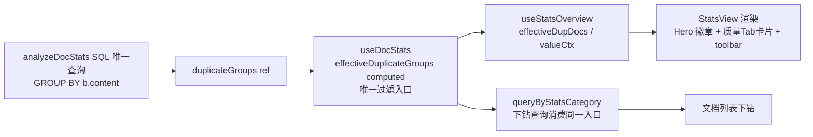

## 用户需求

审查 `src/features/docAnalysis/components/StatsView` 的重名（冗余文档）分析链路，确认是否存在重复分析/重复计算，并修复发现的全部 4 个冗余点：

1. **清理死配置**：`STAT_SECTIONS` 中 duplicate 卡片的 `statKey`/`suffixStatKey` 被 `useStatsOverview` 的 `id === "duplicate"` 硬编码分支短路，永不生效，破坏元数据驱动渲染统一性。
2. **统一过滤入口**：`filterDuplicateGroups` 在视图层（`useStatsOverview`）与下钻层（`useDocStats.queryByStatsCategory`）各调用一次，同一过滤逻辑跨 composable 重复。
3. **卡片语义归位**：重名卡片挂在"大小分布"分区语义不当（重名非大小指标），且与 Hero 问题速览重复展示；应移入质量 Tab 与孤文档并列。
4. **统一判断标准**：toolbar「名称排除」按钮用未过滤原始值 `stats.duplicateNameDocs > 0`，Hero 徽章用过滤值 `effectiveDupDocs > 0`，全部排除后按钮仍常驻、徽章消失，标准不一致。

## 产品概述

docAnalysis 是思源笔记插件的文档统计分析模块，StatsView 是其统计概览视图（Hero 汇总卡 + 概览/分布/质量三 Tab + 图表）。本次为纯逻辑重构：消除重名分析链路的冗余，SQL 查询保持唯一执行（`GROUP BY b.content` 不重复），UI 展示结构不变。

## 核心功能

- 重名卡片改为元数据驱动（`resolveValue` + `suffixValue`），删除硬编码特殊分支
- 过滤逻辑收敛为 `useDocStats` 单一入口 `effectiveDuplicateGroups`，视图层只消费结果
- 重名卡片从"大小分布"移入"质量"Tab，语义归位
- toolbar 名称排除按钮与 Hero 徽章统一使用过滤后值 `effectiveDupDocs`
- 删除 `DocStats.duplicateNameDocs/duplicateNameGroups` 冗余字段（可由 `duplicateGroups` 派生，删除后无消费方）

## 技术栈

沿用项目现有技术栈：Vue 3 + TypeScript + Composition API + SCSS（无新增依赖）。

## 实现方案

### 总体策略

以"元数据驱动渲染"为统一模式：将 duplicate 卡片从硬编码分支改造为标准 `StatCardDef` 配置（`resolveValue`/`suffixValue` 携带计算上下文），过滤逻辑收敛到 `useDocStats` 单一 computed 入口，视图层只做消费。SQL 层保持唯一查询不变。

### ① 元数据驱动化（types/index.ts）

- 新增 `CardValueContext` 接口：`{ effectiveDupDocs: number; effectiveDupGroupCount: number }`
- `StatCardDef` 改造：
- `statKey` 改为可选（`resolveValue` 存在时可不提供）
- `resolveValue` 签名扩展为 `(stats, ctx: CardValueContext) => number`（现有 noTag 卡片 `(s) => ...` 少参函数兼容，无需改动）
- 新增 `suffixValue?: (stats, ctx) => string | number`（优先级高于 `suffixStatKey`）
- `STAT_SECTIONS.size` 分区移除 duplicate 卡片
- `QUALITY_CARDS` 新增：

```ts
{ id: "duplicate", shortLabel: "重名", colorClass: "dup",
resolveValue: (_s, ctx) => ctx.effectiveDupDocs,
suffixValue: (_s, ctx) => `${ctx.effectiveDupGroupCount}组` }
```

- `DocStats` 删除 `duplicateNameDocs`/`duplicateNameGroups` 字段 + `DEFAULT_DOC_STATS` 同步删除（已确认全局仅 3 文件引用，可安全删除）

### ② 统一过滤入口（useDocStats.ts）

- 新增 computed `effectiveDuplicateGroups = filterDuplicateGroups(duplicateGroups.value, duplicateNameFilter.value)` 作为唯一过滤入口
- `queryByStatsCategory("duplicate")` 改用 `effectiveDuplicateGroups.value.map(g => g.title)`
- `analyzeDocStats` 移除对已删除字段的赋值（仅保留 `duplicateGroups.value` 填充）
- 从 return 中导出 `effectiveDuplicateGroups`

### ③ 卡片值计算重构（useStatsOverview.ts）

- `UseStatsOverviewProps` 由 `duplicateGroups + duplicateNameFilter` 改为单一 `effectiveDuplicateGroups`，移除自身 `filterDuplicateGroups` 调用
- `effectiveDupDocs`/`effectiveDupGroupCount` 改为从 `props.effectiveDuplicateGroups` 派生
- 新增 `valueCtx` computed 注入 `getCardValue`/`cardLabel`
- 删除 `getCardValue`/`cardLabel` 中的 `id === "duplicate"` 特殊分支，全部走元数据路径

### ④ 视图层更新（index.vue + StatsView/index.vue）

- 数据链路：`useDocStats` 导出 `effectiveDuplicateGroups` → `docAnalysis/index.vue` 解构并传递 `:effective-duplicate-groups` → `StatsView/index.vue` props 替换（移除 `duplicateGroups`）
- toolbar「名称排除」按钮 `v-if` 由 `stats.duplicateNameDocs > 0` 改为 `effectiveDupDocs > 0`，与 Hero 徽章统一

## 实现要点（防回归）

- **样式零改动**：`.card-value.dup` 颜色类已在 `StatCard.scss:35` 定义，质量 Tab 渲染自动生效
- **`duplicateNameFilter` prop 保留**：StatsView 中 toolbar badge 显示与 `DuplicateNameFilterModal` 弹窗初始化仍需使用
- **下钻链路不变**：质量 Tab duplicate 卡片 emit `selectCategory('duplicate')`，复用现有 `queryByStatsCategory` 分支，无需改动
- **类型兼容**：noTag 卡片现有 `resolveValue: (s) => s.totalDocs - s.taggedDocs` 少参函数在扩展签名下仍可赋值，TS 参数逆变允许
- **性能**：`effectiveDuplicateGroups` 为 computed 惰性求值，仅在下钻/展示时计算；过滤逻辑从两层收敛为一层，无额外开销

## 架构设计



修改前：过滤逻辑散落视图层（useStatsOverview）与下钻层（useDocStats）两处；修改后：`useDocStats` 单一入口派生，视图层纯消费。

## 目录结构

```
src/features/docAnalysis/
├── types/index.ts                          # [MODIFY] StatCardDef 扩展（statKey 可选 + resolveValue 上下文签名 + suffixValue + CardValueContext）；DocStats 删除 2 个冗余字段；STAT_SECTIONS 移除重名卡、QUALITY_CARDS 新增重名卡（resolveValue/suffixValue 驱动）
├── composables/useDocStats.ts              # [MODIFY] 新增 effectiveDuplicateGroups computed 唯一过滤入口；queryByStatsCategory/analyzeDocStats 适配；return 导出新入口
├── composables/useStatsOverview.ts         # [MODIFY] props 改为 effectiveDuplicateGroups；移除本地 filterDuplicateGroups；新增 valueCtx；getCardValue/cardLabel 删除硬编码分支全走元数据
├── index.vue                               # [MODIFY] 解构 effectiveDuplicateGroups，props 传递 :duplicate-groups 改 :effective-duplicate-groups
└── components/StatsView/index.vue          # [MODIFY] Props 接口替换（移除 duplicateGroups 新增 effectiveDuplicateGroups）；toolbar 名称排除按钮 v-if 改为 effectiveDupDocs > 0
```

## 验证

- 全局无残留引用：`duplicateNameDocs`/`duplicateNameGroups` 删除后搜索确认无引用
- 用户自行执行：`pnpm lint`、`pnpm i18n:verify`、`pnpm validate:icons`、`npx tsc --noEmit`（AI 不运行构建）