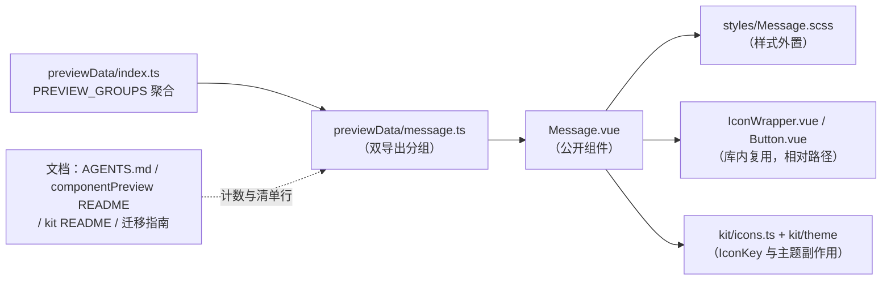

## 用户需求

参考 PrimeVue 官方 Message 组件文档（https://primevue.dev/message/ ，v5.0.1），为本项目共享组件库 `src/components/` 新增一个**内联消息提示**通用组件 `Message`。本次只新增组件，不顺带迁移 feature 内既有自建提示。

## 产品概述

一个内联在页面流中的消息条：左侧可选语义图标 + 中间文本 + 可选右侧关闭按钮；按语义类型着色（六档语义 + 不传时的主题色默认外观），支持四档字号档位、点击关闭、按毫秒自动消失。视觉为「同色系 10% 浅底 + 同色文字 + 1px 同色 20% 描边 + 6px 圆角、无阴影」，明暗主题随思源自动切换。新增后同步出现在「组件预览」面板中，可目视回归。

## 核心功能

- **severity 语义类型**：取值逐字对齐官方 `secondary | success | info | warn | error | contrast`；不传时为官方 Basic 外观（主题主色）。不自动附带图标（与官方一致）。
- **icon**：`icon` prop 传库内 `IconKey`，或用 `icon` 具名插槽自定义图标内容；两者都不传则不渲染图标。
- **size 四档**：`xsmall | small | medium | large`（默认 `small`），只驱动字号 10/12/14/16px、内边距与图标边长；圆角与 1px 描边恒定。
- **closable**：右侧关闭按钮，支持 Enter/Space 关闭，可访问名称走 `closeLabel`（中文默认「关闭」）；另提供 `closeicon` 插槽替换关闭图标。
- **life**：传毫秒数则到期自动派发 `close` 并清理定时器；组件卸载时清理。
- **不自动隐藏**：点击关闭与 `life` 到期都只派发 `close(event)`（到期时 `event` 为 `null`），是否移除由调用方 `v-if` 控制（官方示例即此范式）。
- **默认插槽**承载消息文本，支持多行换行；根元素 `role="alert"` + `aria-live="polite"` + `aria-atomic="true"`。

## 技术栈

- Vue 3 + TypeScript（`<script setup>`）+ SCSS，复用现有 Codex 共享组件库（`src/components/`）与其设计 Token，**零新增依赖**。
- 图标走库内 `IconWrapper` + `IconKey`（`src/components/kit/icons.ts`）；不引入官方 `pi pi-*` 图标字体，不引入 `dt` / `pt` / `ptOptions` / `unstyled` / `closeButtonProps` 等官方 PT 体系。

## 实现方案

### 总体策略

单文件组件 + 外置样式 + 预览清单数据的标准三件套，与 `Tag.vue` / `Divider.vue` / `Timeline.vue` 完全同构。组件本身是**纯展示 + 一个可关闭入口 + 一个可选定时器**，无网络、无 DOM 监听、无全局状态，因此不需要任何注册链改动（不是 feature，不进 8 步注册清单）。



### 关键决策与理由

1. **severity 照搬官方取值（用户确认）**：取值保留 `warn` / `error` / `contrast`，与库内 `Button.severity`（`primary|secondary|success|info|warning|danger`）**有意不统一**，属登记在案的「与官方逐字对齐」项，需在 `AGENTS.md` 清单行与 `componentPreview/README.md` 中说明，避免后续被当作笔误「修正」。
2. **size 改为四档（有意差异）**：官方仅 `small` / `large` + 默认档；本项目按库硬规范收敛为四档默认 `small`，预览分区标 `sizeable: true`，尺寸演示统一由面板头部 XS/S/M/L 切换承担（不单设尺寸示例卡）。
3. **severity → 颜色映射（复用 Tag.scss 的 `hsla(from var(...) h s l / α)` 相对颜色写法，明暗自适应）**：

| severity | 前景/文字 | 底色 | 描边 |
| --- | --- | --- | --- |
| 默认（未传） | `--b3-theme-primary`（`$c-primary` 兜底） | 主色 10% | 主色 20% |
| `secondary` | `--b3-theme-on-surface`（`$c-fg`） | `--b3-theme-surface-lighter`（`$c-surface`） | `--b3-border-color`（`$c-border`） |
| `success` | `--b3-theme-success`（`$c-success`） | 同左 10% | 同左 20% |
| `info` | `--b3-theme-info`（`$c-info`） | 同左 10% | 同左 20% |
| `warn` | `--b3-theme-warning`（`$c-warning`） | 同左 10% | 同左 20% |
| `error` | `--b3-theme-error`（`$c-danger`） | 同左 10% | 同左 20% |
| `contrast` | `--b3-theme-background`（反色文字） | `--b3-theme-on-background`（反色底） | `--b3-theme-on-background` |


⚠️ 库内**不存在** `--b3-theme-secondary` / `--b3-theme-contrast` / `--b3-theme-destructive`（后者从未定义，只有 `--b3-theme-error`），故 secondary 走中性色族、contrast 走前景/背景反色对，与 Tag 的 `--default` 取法同源。

4. **关闭按钮复用共享 `Button`（强制规则：需要按钮必须用共享组件）**：icon-only 形态（`text` + `rounded` + `icon="close"` + 必传 `ariaLabel="closeLabel"`）。⚠️ Button 的 icon-only 档位尺寸是 22/28/36/44px，**会成为消息行高的下限** ⇒ 按 `FileUpload.scss` 既有先例覆写 `--button-size` 为 **18/20/22/24px**，覆写选择器**类名重复一次**抬到 (0,3,0) 压过 Button 的 (0,2,0)（仅覆盖尺寸，不改外观与交互）。
5. **`life` 用组件内原生 `setTimeout`**：项目统一入口 `@/utils/timerRegistry` 属组件库外依赖，**禁用**（会破坏「`src/components/**` 零业务耦合、可整目录外迁」红线）；库内既有先例为 `MegaMenu` 的 120ms 关闭延迟与 `Tooltip` 的延迟/轮询定时器。用 `watch(() => props.life, ..., { immediate: true })` 装载，`onBeforeUnmount` 与手动关闭路径均 `clearTimeout`；仅当 `life` 为有限正数时装载。
6. **不做可见性（`visible`）受控**：官方亦无；`close` 仅作通报，与 `ConfirmDialog`「confirm 后不自动关闭」范式一致，避免多引入一条受控状态。
7. **无障碍按仓库既有约定**：官方文档写 `role="alert"` 隐式 assertive，但官方源码模板显式写了 `aria-live="polite"`；本项目为静态内联提示，取 `role="alert"` + 显式 `aria-live="polite"` + `aria-atomic="true"`（同 `everythingSearch/components/ServiceWarning.vue` 先例），避免读屏打断。
8. **文案零 i18n 改动**：不 import i18n（红线），全部走 props 中文默认值（`closeLabel`），与 `Panel.toggleLabel` / `Paginator.labels` / `FileUpload` 文案 props 同范式。

### 性能与可靠性

- 渲染与样式为纯 CSS 静态计算，复杂度 O(1)；唯一副作用是一个 `setTimeout`，无定时器泄漏（三条清理路径齐全：到期、手动关闭、组件卸载）。
- 无 DOM 监听、无 `ResizeObserver`、无网络请求，无 N+1/重复遍历问题；`life` 变更会重置而非叠加定时器（先 clear 后 set）。
- 文本区 `flex: 1; min-width: 0; word-break: break-word`，长文案换行不撑破容器（不会横向溢出挤压关闭按钮）。

## 实施要点

1. **零业务耦合红线**：组件库内 **0 处** i18n / `plugin` / `siyuan` / store / `@/features`；组件内一律用**相对路径**导入（`./IconWrapper.vue` / `./Button.vue` / `./kit/icons` / `./kit/theme`），**禁止 `@/` 别名**。
2. **文件头注释强制**：`Message.vue` 顶部加 `<!-- 职责说明 -->`（10~30 字）；`Message.scss` 加 `// ========== Message.scss ==========` 头。
3. **样式外置强制**：`<style scoped lang="scss">` 内只写一行 `@use './styles/Message.scss';`；`.scss` 首行按序 `@use './_mixins.scss' as m;` + `@use '../kit/variables.scss' as *;`。
4. **Token 短名优先**：只用 `$t-*` / `$s-*` / `$r-*` / `$c-*` / `$ff-zh` / `$fw-*` / `$lh-*`；无对应 Token 的像素值集中为文件顶部局部变量 + `// 无对应 Token` 注释（同 Tag.scss）。
5. **scoped 特异性**：覆写共享 Button 内部声明必须类名重复一次抬特异性；经插槽传入的子组件带调用方 scope，容器若需命中必须 `> :deep(...)`。
6. **预览清单写法**：`previewData/message.ts` **双导出**（`messageGroup` + `messagePreviewGroups`），`importCode: 'import Message from "@/components/Message.vue"'`，`sizeable: true`；`slots` 工厂**可能被多次调用，必须在工厂内新建 VNode**，第二参为注入档位后的实际渲染 props；`.ts` 内**禁止** `import type { X } from "@/components/X.vue"`（tsc 不解析 `.vue` → TS2614）。
7. **预览面板零改动**：`componentPreview/index.vue` 是通用遍历渲染，Message 非弹层/浮层 ⇒ **不需要**任何沙箱定位覆盖或专属舞台高度类。
8. **计数必须实测，禁止照抄**：并行会话已在同目录新增 `TieredMenu.vue` / `styles/TieredMenu.scss` / `previewData/tieredMenu.ts`，文档里的「45 个组件」已过期。实施时用目录实测（`src/components/*.vue`、`styles/*.scss`、`previewData/*.ts`、私有子目录），再统一写回。扫描计数时**不要只搜标题行**——表内单元格里也埋着过期数字（如 `AGENTS.md` 的 Sidebar 行有「与全库 43 个组件一致」），统一用 `\d+ 个组件` / `\d+ 个公开组件` / `组件清单（\d+ 个）` 这类模式全量搜。
9. **AI 不执行** `pnpm vite build` / `pnpm lint`（由用户自行验证）；可执行 `read_lints`、`npx tsc --noEmit`、`pnpm i18n:verify`、`pnpm validate:icons`。
10. **爆破半径控制**：不改任何既有组件、不改 `previewData/index.ts` 以外的框架代码、不动 feature；`PREVIEW_GROUPS` 只做「插入一行 import + 插入一行展开」的最小改动，保持既有分区顺序稳定。

## 目录结构

```
siyuanPluginVueSN/
├── src/
│   ├── components/
│   │   ├── Message.vue                    # [NEW] 内联消息提示组件。Props：severity（六档官方取值，不传为主题色默认外观）/ icon（IconKey）/ size（四档默认 small）/ closable / life / closeLabel；Slots：default（文本，可换行）/ icon（替换图标）/ closeicon（替换关闭图标）；Emits：close(event: Event | null)。根元素 role="alert" + aria-live="polite" + aria-atomic="true"；life 用组件内原生 setTimeout（watch immediate 装载、到期/手动关闭/onBeforeUnmount 三路 clearTimeout）；closable 关闭按钮复用共享 Button 的 icon-only 形态并覆写 --button-size 为 18/20/22/24。必须：相对路径导入、import "./kit/theme" 副作用、顶部文件功能注释、style 只 @use 外置 scss。
│   │   └── styles/
│   │       └── Message.scss               # [NEW] Message 样式。@use './_mixins.scss' as m 与 '../kit/variables.scss' as *；根类 .si-message + 修饰类 .si-message--{七态语义} / --{四档尺寸} / --closable，子元素 .si-message__content / __icon / __text / __close。severity 配色用 hsla(from var(--b3-theme-*) h s l / α) 相对颜色写法（secondary 走 surface/on-surface/border 中性族、contrast 走 on-background/background 反色对）；四档只改字号 10/12/14/16、内边距与图标 12/14/16/18，圆角 $r-base 与 1px 描边恒定；关闭按钮覆写选择器类名重复一次抬到 (0,3,0)，仅覆盖 --button-size。
│   └── features/
│       └── componentPreview/
│           └── previewData/
│               ├── message.ts             # [NEW] Message 预览分组（双导出 messageGroup + messagePreviewGroups）。sizeable: true；示例覆盖：默认（未传 severity）/ secondary / success / info / warn / error / contrast / 带 icon（checkCircle、alertCircle、info、alertCircleOutline）/ icon 插槽 / closable / closable + closeicon 插槽 / close 事件（code 展示 @close 与 v-if 组合）/ life 自动消失（code 展示 :life="3000" + v-if）。slots 工厂内新建 VNode，第二参取注入档位后的实际 props。
│               └── index.ts               # [MODIFY] 聚合入口：新增 import { messagePreviewGroups } from "./message"，并在 PREVIEW_GROUPS 数组中紧邻 displayPreviewGroups / tagAvatarPreviewGroups 处插入展开（最小改动，其余顺序不动）。
├── AGENTS.md                              # [MODIFY] 计数与清单：第 160/168/181/511 行的「45 个组件」按实测值更新；第 183~229 行组件清单表新增 Message.vue 行（职责含 severity 官方取值、life/closable 语义、与官方的有意差异）；第 473 行目录树注释的组件计数与举例；顺带修正表内过期数字（如 Sidebar 行的「43 个组件」）。⚠️ 不擅自执行构建/lint（由用户验证）。
├── src/features/componentPreview/README.md # [MODIFY] 第 3 行「全部 45 个组件」按实测更新；第 8 行「全组件覆盖」清单按字母序插入 Message；第 37 行 sizeable 组件清单追加 Message（并说明四档为有意差异）；「具名插槽」表追加 Message 的 icon / closeicon；「事件契约」表追加 Message 的 close（明确 payload 语义：点击为 MouseEvent、life 到期为 null，且组件不自动隐藏）。
├── src/components/kit/README.md            # [MODIFY] 第 22 行「由 39 个公开组件以 import "./kit/theme" 副作用导入触发」为历史欠账（数字已过期），按实测统一。
├── src/components/docs/components-vue3-migration-guide.md # [MODIFY] 第 3/6/62/146 行的「39 个组件」「39 个公开组件」与字母序组件清单，按实测统一并追加 Message。
└── README.md                               # [MODIFY] 实测确认是否存在组件计数（本次 grep 未命中「个组件」）；存在则同步，不存在则不改。
```

## 关键代码结构（公开契约）

```ts
/** 官方取值逐字对齐（与库内 Button.severity 有意不统一，勿"修正"） */
type MessageSeverity = "secondary" | "success" | "info" | "warn" | "error" | "contrast"
/** 库规范四档（官方仅 small/large + 默认档，属有意差异） */
type MessageSize = "xsmall" | "small" | "medium" | "large"

interface Props {
  severity?: MessageSeverity
  icon?: IconKey
  size?: MessageSize
  closable?: boolean
  /** 毫秒；仅有限正数生效，到期派发 close(null) */
  life?: number
  /** 关闭按钮可访问名称，中文默认「关闭」⇒ 零 i18n 改动 */
  closeLabel?: string
}

interface Emits {
  /** 点击关闭按钮为原生 MouseEvent；life 到期为 null。组件不自动隐藏，由调用方 v-if 控制 */
  (e: "close", event: Event | null): void
}
```

## 设计定位

本次**不新增任何独立页面**，交付物是一个共享组件（内联消息条）及其在「组件预览」面板中的分区快照卡。视觉与交互完全沿用现有 Codex 设计系统（消费思源 `--b3-theme-*` 变量，明暗自适应），不引入第三方 UI 框架或组件库（故 component 属性留空）。

## 组件视觉规格

- **结构**：根容器（1px 同色 20% 描边 + `$r-base` 6px 圆角 + 同色 10% 浅底，**无阴影**，边框优先）→ 内容行（图标 + 文本，8px 间距）→ 关闭按钮（透明底方钮，18/20/22/24px，悬停出现弱底色）。
- **七态配色**：默认走主题主色；`success` 绿 / `info` 蓝 / `warn` 琥珀 / `error` 红 走「同色系 10% 底 + 100% 文字 + 20% 描边」；`secondary` 中性灰（surface 底 + `--b3-border-color` 描边 + `--b3-theme-on-surface` 文字）；`contrast` 反色（前景色底 + 背景色文字）。
- **尺寸四档**：字号 10 / 12 / 14 / 16px，内边距 4×8 / 6×10 / 6×12 / 8×14px，图标边长 12 / 14 / 16 / 18px；**圆角与 1px 描边恒定**（切档不抖动）。
- **状态与交互**：消息条本体**无 hover/过渡动效**（纯展示）；仅关闭按钮有 hover / active / focus 反馈（复用共享 Button 的既有交互与焦点环）；`life` 到期为瞬时移除，不做退出动画（由调用方 `v-if` 决定）。
- **排版**：文本支持多行换行（`min-width: 0` + `word-break: break-word`），长文案不挤压关闭按钮；图标与文本垂直居中对齐。
- **无障碍**：根 `role="alert"` + `aria-live="polite"` + `aria-atomic="true"`；关闭按钮具名（`closeLabel`）+ Enter/Space 可关；文本即内容，无装饰性图标语义污染。

## 预览面板分区

一张分区卡（`sizeable: true`），示例依次为：默认外观 / 六档 severity / 带图标 / icon 插槽 / closable / closable + closeicon / close 事件用法（code）/ life 自动消失（code）。尺寸演示统一由面板头部 XS/S/M/L 档位切换承担，**不单设尺寸示例卡**、示例内不固定 `size`。Message 非弹层/浮层，**不需要**任何沙箱定位覆盖或专属舞台高度类。

## Agent Extensions

### SubAgent

- **code-explorer**
- Purpose: 全仓定位所有「组件总数 / 组件清单 / 具名插槽表 / 事件契约表」的引用点（含散落在表内单元格里的过期数字，如 `AGENTS.md` 的「43 个组件」），以及实测 `src/components/*.vue`、`styles/*.scss`、`previewData/*.ts` 与私有子目录的当前真实计数。
- Expected outcome: 一份精确的「文档待改清单（文件 + 行号 + 现值 + 目标值）」，保证计数同步无遗漏、无臆造，且在并行会话新增组件的情况下仍取到实测值。

### Skill

- **universal-arch-skill**
- Purpose: 校验新增共享组件的注册链完整性与规范符合度——组件样式外置（`.vue` 只 `@use` 一份 `.scss`）、设计 Token 短名使用、预览清单双导出与聚合接入、文档计数与清单行同步、无 `@/` 别名与零业务耦合。
- Expected outcome: 一份架构校验结论：注册链无断点、样式与 Token 合规、文档计数一致；发现的偏差在提交前修正。