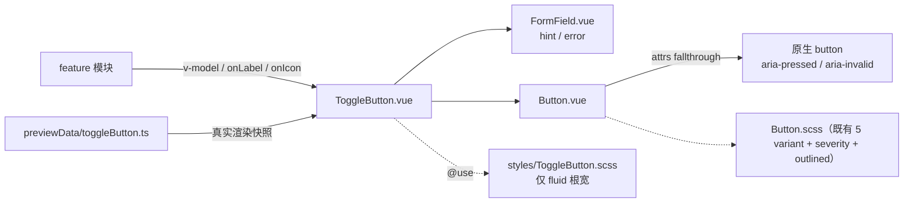

## Product Overview
在共享组件库中新增「按钮式开关」组件 ToggleButton：用一个按钮承载布尔值的选中/未选中切换，语义与 PrimeVue ToggleButton 对齐（"select a boolean value using a button"）。它是既有开关、复选框、分段按钮之外的补充形态。

## Core Features
- **布尔双向绑定**：点击在选中 / 未选中之间切换，受控值由外部持有
- **文案随状态切换**：选中显示 `onLabel`、未选中显示 `offLabel`（不传则该侧不渲染文案）
- **图标随状态切换**：选中显示 `onIcon`、未选中显示 `offIcon`
- **四档尺寸**：特小 / 小 / 中 / 大（默认小），内边距与字号随档位阶梯变化
- **宽度控制**：`fluid` 开启时占满容器宽度；默认按内容自适应宽度
- **状态**：禁用（不可点击、不可聚焦）、校验错误（错误文案 + 红色系外观）
- **无障碍播报**：向屏幕阅读器播报「已按下 / 未按下」；状态变化时提示提供不随状态改变的可访问名称
- **组件预览新增分区**：基础、文案切换、图标切换、尺寸、错误态、禁用、fluid 等快照

## 视觉呈现
- **未选中**：透明底 + 中性描边 + 中性文字，视觉权重低
- **选中**：主色实底 + 反色文字，视觉权重高，形成强对比的「已开启」观感
- **错误态**：整体转向红色系 —— 未选中为红字红框透明底，选中为红色实底
- **聚焦**：仅键盘导航时显示外扩焦点环，鼠标点击不显示
- **尺寸**：四档影响内边距、字号与图标边长
- **与既有「分段互斥组」的视觉区分**：分段组是弱对比的文字色切换（透明底），本组件是强对比的实底切换，用户可一眼区分「多选一的档位」与「单一开关」


## Tech Stack
- **框架**：Vue 3.5.42（`<script setup lang="ts">` + `defineProps` / `defineEmits` / `defineExpose`）+ TypeScript + SCSS；**不引入任何新依赖**
- **复用**：`src/components/Button.vue`（外观与交互全部继承，**零样式复制**）、`src/components/FormField.vue`（`hint` / `error` 行）
- **样式**：外置 `src/components/styles/ToggleButton.scss`，仅承载根容器宽度（`fluid`），不写任何按钮外观规则

## Implementation Approach

### 核心策略：薄语义包装器
ToggleButton 不重绘按钮，而是把「布尔状态」**翻译为 Button 既有外观轴 + ARIA 属性**：



### 外观映射（推导自 Button.scss 源码顺序：颜色块 → severity 块 → 外观修饰，同特异性后者胜）

| 状态 | 传给 Button 的轴 | 渲染结果 |
|---|---|---|
| 未选中 | `variant="ghost"` + `:outlined="true"` | 透明底 + `--b3-border-color` 中性描边 + `--b3-theme-on-surface` 文字（`--ghost` 刻意不设 `--btn-color`，`--outlined` 因此回退中性色） |
| 选中 | `:severity="error ? 'danger' : 'primary'"` | `--severity-*` 强制填充外观：`background: var(--btn-color)` + 边框透明 ⇒ 主色实底 + 反色文字 |
| 错误 · 未选中 | 同上 + `:outlined="true"` | 红字红框透明底 |
| 错误 · 选中 | `:severity="'danger'"` | 红色实底 |

`fluid` 直接映射 Button 既有的 `block`（`display: flex; width: 100%`），仅需根容器同时 100% 宽。

### 关键决策与取舍

| 决策 | 内容与理由 |
|---|---|
| **独立组件 + 内部复用 Button** | 用户已选定。既保留 PrimeVue 的「Button / ToggleButton 双组件」结构，又不复制 Button 的四档尺寸、图标尺寸表、`focus-visible`、loading 保宽、无障碍命名等既有约定 |
| **`error` 而非 `invalid`** | 项目校验态统一用 `error: string`（先例 Input / Select / Checkbox / RadioButton / Slider / Listbox / Textarea），一个 prop 同时负责红色外观与错误文案 |
| **`onLabel` / `offLabel` 不设默认文案** | PrimeVue 默认 `"yes"` / `"no"`，但本项目为中文优先且禁止组件内硬编码 UI 文案 ⇒ 不传即不渲染文案节点，由调用方传 i18n 串 |
| **`fluid` 默认 `false`** | 按钮天然按内容定宽，对齐 PrimeVue 与 `Button.block` 的默认值。⚠️ 与同轮的 `Textarea.fluid`（默认 `true`）**默认值相反**，因输入框天然占满宽、按钮天然内容宽，需在两份文档分别注明 |
| **根节点为 `<div class="si-togglebutton">`** | `FormField` 需要容器承接 `hint` / `error` 行，Button 位于 FormField 的**默认插槽**（FormField 是多根组件，控件写成自闭合 sibling 会让提示排到控件上方） |
| **无 `label` prop** | 按钮自身的 `onLabel` / `offLabel` 即标签；因而不需要 `useId()` / `labelId` 关联 |
| **不实现 `readonly`** | 用户未勾选（PrimeVue 有该项） |
| **不开放 `variant` / `severity` / `outlined` / `text` / `rounded` 等外观透传 props** | PrimeVue ToggleButton 无这些轴；避免 scope creep。后续若需「选中=成功绿」等定制再考虑开放可选 `severity` |
| **不迁移现有 6 处 `Button` + `:aria-pressed`** | 用户已选定。那 6 处是「多选项互斥分段组」（`modelValue === opt.value`），与本组件的「单按钮布尔开关」语义不同，保留为既定范式 |

### 性能与可靠性
- 纯函数式渲染：**无 watcher / 定时器 / DOM 查询 / 深监听**；单次点击为 O(1) 的布尔取反 + 两次 emit
- 无额外重渲染触发源；主题色全部走 `--b3-theme-*`，明暗自动跟随
- 零 blast radius：**不修改 `Button.vue` / `Button.scss` / `Switch.vue` 一行代码**，既有 180+ 处调用与 5 个 variant 语义不变

## Implementation Notes

- **ARIA 全靠 attrs fallthrough**：Button 未声明 `aria-pressed` / `aria-labelledby` / `aria-invalid` / `tabindex`，而 Button 的模板根是**单个原生 `<button>`** ⇒ 这些属性会自动落到它上面（现有 6 处 `:aria-pressed` 正是靠此机制）。注意 Button 声明的是 camelCase `ariaLabel`，模板写 `aria-label` 会被 Vue 解析为该 prop，二者不冲突
- **键盘不自实现**：原生 `<button>` 自带 Tab 移入 + Space/Enter 触发 click，与 PrimeVue「Tab + Space」一致，**不要**再绑 `keydown`
- **点击守卫**：仅 `!disabled` 时翻转并派发，避免绕过 Button 的 `pointer-events: none` 的程序化路径漏翻
- **DEV 告警（对齐 Button.vue 既有做法）**：`import.meta.env.DEV` 下 ①解析后文案与图标**同时为空**时告警（按钮退化为空内容）；②可见文案或图标**随状态变化**却未提供 `ariaLabel` / `ariaLabelledby` / `title` 时告警 —— 落实 PrimeVue 无障碍章节「始终提供不随状态变化的 aria 标签」的强制建议
- **Token 纪律**：错误色只允许 `--b3-theme-error`（`--b3-theme-destructive` **从未定义，禁止使用**）；需要看得见的细线用 `--b3-border-color`
- **文档计数必须一次性全量对齐**：当前实测 `src/components/` 为 **23** 个 `.vue`，新增后 **24**；遗漏任一处会造成规范漂移
- **验证边界**：AI 不得执行 `pnpm vite build` / `pnpm lint`；可执行 `read_lints`、`npx tsc --noEmit`、`@vue/compiler-sfc` 离线编译、`pnpm i18n:merge`

## Architecture Design

组件位于共享组件层，仅依赖同层 `FormField` 与 `Button`，无业务耦合、不跨 feature 导入：

- **数据流**：点击 → `handleClick` 守卫 → `emit("update:modelValue", !pressed)` + `emit("change", next)` + `emit("click", event)` → 父级回写 `modelValue` → `pressed` 派生 `label` / `icon` / 外观轴 → 重渲染
- **状态派生三件套**（全部 `computed`，单一数据源均为 `props.modelValue`）：`pressed`（布尔真值）、`currentLabel`、`currentIcon`，以及外观三元组 `variant` / `severity` / `outlined`
- **与既有组件的关系**：`Switch`（原生 `<button role="switch">`，无 FormField）是本项目唯一的「单布尔控件」先例，本组件沿用其 **`update:modelValue` + `change` 双事件**约定；`Checkbox` / `RadioButton` 提供 `hint` / `error` 经 `FormField` 的写法先例

## Directory Structure

```
siyuanPluginVueSN/
├── src/
│   ├── components/
│   │   ├── ToggleButton.vue                 # [NEW] 按钮式开关（公开平铺，保持 @/components/X.vue 导入约定）
│   │   └── styles/
│   │       └── ToggleButton.scss            # [NEW] 仅根容器（inline-flex 列布局 + fluid 占满宽），无按钮外观规则
│   └── features/
│       └── componentPreview/
│           ├── previewData/
│           │   ├── toggleButton.ts          # [NEW] 预览清单（双导出）
│           │   └── index.ts                 # [MODIFY] 追加 import 与 ...toggleButtonPreviewGroups
│           └── README.md                    # [MODIFY] 计数 + 覆盖枚举 + sizeable 列表 + 能力条目 + 事件契约表
├── AGENTS.md                                # [MODIFY] 5 处计数 + 组件清单表行 + 复用枚举
└── README.md                                # [MODIFY] 共享组件计数
```

### 文件明细

- **`src/components/ToggleButton.vue`** [NEW]
  - **职责**：单按钮布尔开关的唯一入口，把状态翻译为 Button 的外观轴与 ARIA
  - **功能**：`defineProps` / `withDefaults` / `defineEmits` / `useSlots`（判断是否有可访问名称用不到，仅需 `props`）、`computed` 派生状态与外观、`handleClick`、DEV 两项告警、`defineExpose({ focus, blur })`
  - **实现要求**：
    - 第 1 行文件头注释：`<!-- 按钮式开关：布尔状态切换、on/off 文案与图标、四档尺寸、错误态 -->`
    - 模板层级：`div.si-togglebutton`（`--fluid`）→ `FormField`（`:hint` / `:error` / `:size`，**不传 `label`**）→ 默认插槽内 `Button`
    - 传给 Button：`:variant="'ghost'"`、`:severity="error ? 'danger' : 'primary'"`、`:outlined="!pressed"`、`:size`、`:icon="currentIcon"`、`:block="fluid"`、`:disabled`、`:type`、`:title`、`:aria-label="ariaLabel"`、`:aria-pressed="pressed"`、`:aria-labelledby="ariaLabelledby"`、`:aria-invalid="error ? 'true' : undefined"`、`:name`、`@click="handleClick"`；默认插槽内为 `{{ currentLabel }}`（空串时不渲染文本节点）
    - **行数预期远低于 300 警戒线**（逻辑极薄，主体是 props 与模板）
- **`src/components/styles/ToggleButton.scss`** [NEW]
  - **职责**：仅根容器布局，**不复制任何按钮样式**
  - **实现要求**：顶部 `@use './_mixins.scss' as m;` + `@use '@/variables.scss' as *;`；`.si-togglebutton { display: inline-flex; flex-direction: column; font-family: $font-zh; }`；`&--fluid { width: 100%; }`；非 fluid 时保持内容宽（不写 `width`）；**不得出现 `font-size` / `border-radius` / 颜色声明**（全部由 Button 承担）
- **`src/features/componentPreview/previewData/toggleButton.ts`** [NEW]
  - **职责**：预览清单（`props` 与 `code` 同源）
  - **实现要求**：文件头注释；`export const toggleButtonGroup: PreviewGroup`（`id: "toggleButton"` / `name: "ToggleButton"` / `summary` 概括能力 / `importCode: 'import ToggleButton from "@/components/ToggleButton.vue"'` / `sizeable: true`）+ `export const toggleButtonPreviewGroups: PreviewGroup[] = [toggleButtonGroup]`
  - **示例至少覆盖**：基础（未选中 / 选中各一，`onLabel`/`offLabel`）/ 图标切换（`onIcon`/`offIcon` + `ariaLabel`）/ 图标 + 文案组合 / `size="large"` 尺寸对比 / 错误态（`error`）/ 禁用 / `fluid`（配 `fluid: true`）/ 仅图标（无文案）
  - **注意**：本组件无默认插槽与具名插槽，示例只用 `props` + `code`，**不要传 `slotText`**（会渲染多余文本）；声明了 `modelValue` ⇒ 预览内可点击交互
- **`src/features/componentPreview/previewData/index.ts`** [MODIFY]
  - import 区按现有风格追加 `import { toggleButtonPreviewGroups } from "./toggleButton"`（置于 `textarea` 之后）
  - `PREVIEW_GROUPS` 中紧随 `...textareaPreviewGroups` 插入 `...toggleButtonPreviewGroups`
- **`AGENTS.md`** [MODIFY]
  - 计数 23 → 24：第 **160** / **168** / **181** / **451** / **489** 行
  - 组件清单表：**在 `Button.vue` 行（185 行）之后**插入 `ToggleButton.vue` 行（职责「按钮式开关：布尔切换、on/off 文案与图标、四档尺寸、错误态，内部复用 `Button`」+ 关键 props）
  - 第 **177** 行「优先复用」枚举补「按钮式开关」
- **`README.md`** [MODIFY]：第 **148** 行计数 23 → 24
- **`src/features/componentPreview/README.md`** [MODIFY]
  - 第 **3** 行计数 23 → 24；第 **8** 行「全组件覆盖」按字母序在 `Tag / Textarea` 一带插入 `ToggleButton`；第 **20** 行 `sizeable` 列表补 `ToggleButton`
  - 第 **12** 行「多行文本域」条目之后新增一条「按钮式开关」能力说明：按下/未选中视觉映射、`onLabel`/`offLabel` 与 `onIcon`/`offIcon`、`fluid` 默认 `false`、`error` 转红色系、**与分段互斥组的区别**（单按钮布尔开关用本组件；多选项互斥档位继续用 `Button` 分组 + `aria-pressed`）
  - 事件契约表新增 `ToggleButton` 行：`update:modelValue`（实时跟随）+ `change`（一次性落盘）
  - 「具名插槽」表**无需新增行**（本组件无插槽）

## Key Code Structures

```ts
type ToggleButtonSize = "xsmall" | "small" | "medium" | "large"

interface Props {
  /** 是否选中 */
  modelValue?: boolean
  /** 尺寸档位 */
  size?: ToggleButtonSize
  /** 选中时文案（不传则该状态不渲染文案） */
  onLabel?: string
  /** 未选中时文案 */
  offLabel?: string
  /** 选中时图标 */
  onIcon?: IconKey
  /** 未选中时图标 */
  offIcon?: IconKey
  /** 禁用状态 */
  disabled?: boolean
  /** 占满容器宽度（默认 false，按内容自适应） */
  fluid?: boolean
  /** 提示文本 */
  hint?: string
  /** 错误文本（同时把外观转红色系并输出 aria-invalid） */
  error?: string
  /** 原生 name */
  name?: string
  /** 原生 type（表单内提交需传 submit） */
  type?: "button" | "submit" | "reset"
  /** 鼠标悬停提示 */
  title?: string
  /** 可访问名称（状态无关，强烈建议提供） */
  ariaLabel?: string
  /** 外部标签元素 id */
  ariaLabelledby?: string
}

interface Emits {
  (e: "update:modelValue", value: boolean): void
  (e: "change", value: boolean): void
  (e: "click", event: MouseEvent): void
}
```


## Agent Extensions

### Skill
- **universal-arch-skill**
  - **Purpose**：对新增共享组件执行架构合规审查（模式 C），逐条核对 6 大原则与 Vue/TS 适配清单：样式分离（`.vue` 内仅 `@use`）、设计 Token（禁止硬编码字号/颜色/圆角，禁用 `--b3-theme-destructive`）、命名一致性（四档尺寸、`error` 而非 `invalid`）、文件头注释齐备、单文件行数上限、无跨 feature 导入、无绕过统一入口
  - **Expected outcome**：产出 `ToggleButton.vue` / `ToggleButton.scss` / `previewData/toggleButton.ts` 的合规结论与待修项清单（并对「薄包装器复用 Button、零样式复制」这一决策确认无重复实现违规），待修项当场修复至零违规

### MCP
- **Context7**
  - **Purpose**：核对 PrimeVue ToggleButton 的权威 API 与无障碍语义（`onLabel`/`offLabel`/`onIcon`/`offIcon`/`invalid`/`fluid`/`size` 的取值与默认值、`role="button"` + `aria-pressed`、键盘契约、是否存在 `variant`/`severity`），确保本项目的字段映射与排除项有据可依
  - **Expected outcome**：已产出「PrimeVue ToggleButton API → 项目命名」字段对照结论（`invalid`→`error`、`size` 双档→四档扩档、`fluid`→`block`、`onIcon`/`offIcon`→`IconKey`、无 `variant`/`severity` 故不开放外观透传 props），用于校验 props 全集完整且无遗漏项
