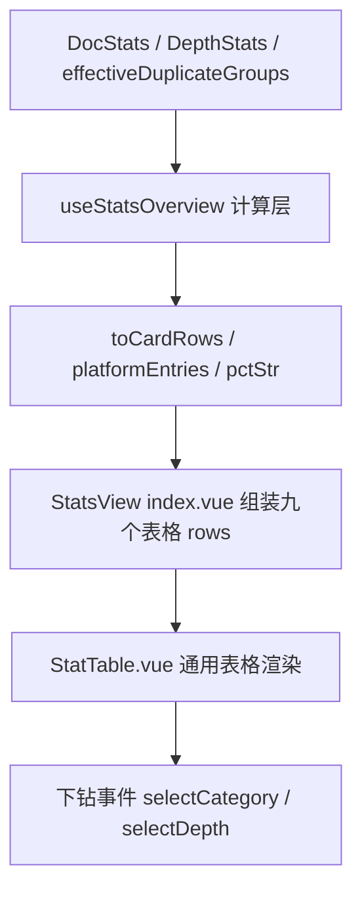

## 用户需求

完全重构 `docAnalysis` 的 StatsView 统计概览 UI：移除「概览/分布/质量」三个 Tab，改为单页平铺的表格化布局；所有统计内容（含原柱状图）统一转为「名称 | 数量 | 占比」三列表格。

## 核心功能

- **去 Tab 化**：删除 Tab 切换，九个统计维度（大小分布/更新时间/书签/发布状态/文档质量/平台分布/字数分布/深度分布/书签分类）纵向平铺为九个表格区块。
- **保留 Hero 汇总卡**：总文档数、健康度进度条、问题速览徽章（0B空/重名/待发布/孤文档）保留，视觉风格与表格卡片统一。
- **表格化柱状图**：平台分布、字数分布、深度分布、书签分类四个原柱状图全部改为三列表格。
- **保留下钻交互**：可下钻的表格行（大小/时间/书签/发布/质量/深度）点击跳转文档列表分类筛选；平台/字数/书签分类保持纯展示。
- **保留工具栏能力**：名称排除（重名过滤）、隐藏零值开关继续可用，仅移除 Tab 按钮。

## 视觉与交互

- 每个表格区块 = 标题（图标 + 名称 + 可选 headerExtra）+ 表头（名称/数量/占比）+ 数据行。
- 「数量」列沿用原卡片的语义色（`colorClass`）着色，保持维度辨识度。
- 可点击行 hover 高亮，选中行（`activeFilter` 命中）边框/背景高亮。
- 隐藏零值开关开启后，数量为 0 的行从所有表格中隐藏。

## 技术栈

沿用现有技术栈：Vue 3 + TypeScript + Composition API + SCSS（Codex 风格 + 设计 Token），无新增依赖。

## 实现方案

### 总体策略

以「元数据驱动渲染」为核心：卡片类表格直接复用 `STAT_SECTIONS`（4 分区）与 `QUALITY_CARDS`（10 卡片）元数据，经 `getCardValue`/`cardLabel`/`pctStr` 映射为统一表格行；分布类表格由既有 computed（`platformEntries` 及 `stats`/`depthStats` 中的分布数组）映射。新增一个通用 `StatTable.vue` 展示组件统一渲染，彻底替换 `StatCard`/`StatSection`/`BarRow` 三组件。

### 核心改动

1. **统一占比口径**：所有表格「占比」列 = `Math.round(count / totalDocs * 100)%`。改造 `pctStr` 去掉 `Math.min(100, ...)` 上限（平台分布一文档可发布多平台，覆盖占比可超 100%，截断会失真）。删除原柱状图的 `barPct`/`maxCount`/`maxWordCount`/`maxCustomBm`/`maxDepthCount`。
2. **表格行契约**：新增 `StatTableRow { id, label, count, pct, colorClass?, clickable? }`，作为 `StatTable` 与 `index.vue` 的桥梁。
3. **toCardRows 映射**：在 `useStatsOverview` 新增 `toCardRows(cards: StatCardDef[]): StatTableRow[]`，把元数据卡片映射为表格行（`label = cardLabel(card)`、`count = getCardValue(card)`、`pct = pctStr(count)`、`clickable = true`）。
4. **下钻映射**：卡片类行点击 `selectCategory(row.id)`；深度分布行点击 `selectDepth(Number(row.id))`；平台/字数/书签分类行 `clickable=false`。
5. **隐藏零值**：`filterVisibleCards` 弃用，改为 `hideZero ? rows.filter(r => r.count > 0) : rows`，作用于全部表格。
6. **样式层**：`StatsOverview.scss` 删除 `section-cards`/`bar-chart`/`stats-tab-btn` 相关样式，保留并微调 Hero/工具栏/issue-item/toolbar-btn/placeholder/bookmark-detail-btn；新增 `StatTable.scss` 承载表格区块样式。

### 架构设计



修改前渲染层依赖 StatCard（卡片网格）+ StatSection（分区容器）+ BarRow（柱状图）三套组件；修改后统一为单一 StatTable 组件，渲染层大幅简化。

## 目录结构

```
src/features/docAnalysis/
├── types/index.ts                          # [MODIFY] 新增 StatTableRow 接口
├── composables/useStatsOverview.ts         # [MODIFY] 删柱状图计算、统一占比、新增 toCardRows、platformEntries 去 pct
├── components/StatsView/
│   ├── index.vue                           # [MODIFY] 重写模板：去 Tab，渲染 Hero + 工具栏 + 九个 StatTable
│   ├── StatTable.vue                       # [NEW] 通用表格区块组件（标题 + 三列表格 + 行点击）
│   ├── BookmarkDetailModal.vue             # 不变
│   ├── DuplicateNameFilterModal.vue        # 不变
│   ├── StatCard.vue                        # [DELETE]
│   ├── StatSection.vue                     # [DELETE]
│   └── BarRow.vue                          # [DELETE]
└── styles/
    ├── StatsOverview.scss                  # [MODIFY] 重写：删卡片/柱状图样式，保留 Hero/工具栏
    ├── StatTable.scss                      # [NEW] 表格区块样式
    ├── StatCard.scss                       # [DELETE]
    ├── StatSection.scss                    # [DELETE]
    └── BarRow.scss                         # [DELETE]
```

## 关键代码结构

```ts
// types/index.ts 新增
export interface StatTableRow {
  id: string
  label: string
  count: number
  pct: string
  colorClass?: string
  clickable?: boolean
}

// StatTable.vue Props / Emits 契约
interface Props {
  title: string
  icon: string
  rows: StatTableRow[]
  activeId?: string
}
// emit: (e: "select", id: string): void

// useStatsOverview.ts 新增
function toCardRows(cards: StatCardDef[]): StatTableRow[]
function pctStr(count: number): string  // 去掉 Math.min 上限
```

## 实现要点（防回归）

- **数据源不变**：`analyzeDocStats` SQL 层零改动，仅渲染层重构。
- **下钻能力完整保留**：`selectCategory`/`selectDepth` 事件签名不变，父组件 `docAnalysis/index.vue` 零改动。
- **颜色语义保留**：表格「数量」列继续使用 `colorClass` 上色（`.card-value.zero/.dup/.pending-color` 等现有颜色类迁移到表格单元格）。
- **书签详情按钮保留**：书签表 `headerExtra` 槽位继续放置「详情」按钮（触发 `showBookmarkDetails`）。
- **样式合规**：全部使用 `$font-size-*`/`$font-weight-*`/`$line-height-*`/`$color-*`/`$spacing-*` Token，禁硬编码、禁 `box-shadow`（用 border）。
- **单文件行数**：`index.vue` 目标 ≤400 行（九个表格行由 computed 紧凑组装），`StatTable.vue` ≤120 行，均低于 500 硬阈值。
- **性能**：表格行通过 `computed` 惰性构建，隐藏零值仅做一次数组过滤，无额外开销。

## 设计风格

采用项目既有 Codex 设计语言，打造紧凑、信息密度高的「数据报表」式统计面板。整体为单列纵向流：顶部 Hero 汇总卡，中部工具栏，下方九个表格区块依次平铺。

- **Hero 汇总卡**：保持总文档数（大号等宽数字）与健康度进度条，问题速览徽章改为与表格一致的边框卡片样式，弱化装饰、强化数据可读性。
- **表格区块**：每个区块使用统一边框卡片容器，标题区含图标 + 大写标签 + 可选右侧提示；表格三列等宽对齐，数量列右对齐等宽字体、占比列灰色弱化。
- **交互**：可点击行 hover 边框高亮 + 选中行主色背景；不可点击行无 hover 效果。
- **响应式**：容器宽度自适应，表格固定三列布局不换行，窄屏下占比列宽度收缩。

整体氛围：克制、理性、数据优先，无多余阴影与渐变，通过边框与间距建立层次。