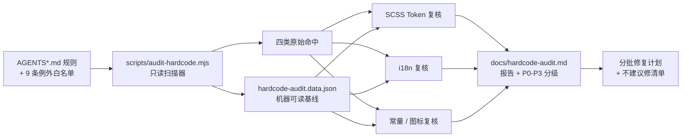

## 产品概述

对 `siyuanPluginVueSN` 全项目源码执行一次**规则驱动的硬编码合规审查**，产出审计报告与分批修复计划。本轮只交付报告，不修改任何源码。

## 核心功能

- **全量覆盖**：扫描 `src/` 下 40+ 功能模块与共享组件库（约 596 个源文件），产出全景清单而非抽样。
- **四类审查维度**：

1. SCSS 设计 Token —— 字号 / 字重 / 行高 / 色值 / 圆角 / 间距 / 字体族 / `box-shadow` / 过渡时长 / z-index 的硬编码字面量
2. i18n 文案 —— `{{ i18n.xxx || '中文兜底' }}` 模式、模板与 TS 中未走 i18n 的中文文案
3. 业务常量 —— 硬编码 API Key / 端点 URL / 模型名、魔法数字（超时、上限、分页大小）
4. 图标与 emoji —— emoji 当图标、未注册图标名、feature 内裸写 IconKey 字面量

- **务实判定口径**：内置 9 类既知例外白名单（Token 定义源 `_variables.scss`、组件 `size` 档位字号、带 `// 无对应 Token` 注释的 14/18px、`--b3-theme-primary` 的 `$color-danger` fallback、`Slider` 焦点环 fallback、`ColorField` 无 fallback 变量、组件内部 15 个 IconKey、3 处宿主耦合），不计入违规。
- **报告结构**：审查依据（规则文件 + 章节锚点）→ 口径与例外清单 → 四类分章「汇总表（文件 × 命中数）+ 明细表（`文件:行` / 违规字面量 / 应替换 Token / 严重度）」→ **P0~P3 分级**（P0 安全风险 / P1 明令禁止 / P2 Token 化收益 / P3 历史约定仅登记）。
- **修复计划**：按「低风险大批量先行 → 中风险需同步 i18n 分片 → 高风险统一入口改造」排序，每批标注涉及文件数、预估规模、验证命令，并明确列出**不建议修**的项及原因。
- **交付物**：`docs/hardcode-audit.md`，体例对齐既有 `docs/ai-content-generator-component-audit.md` 与 `docs/bookmark-marker-component-audit.md`。

## 关键边界

- 不修改任何 `src/**` 文件；不执行 `pnpm lint` 与 `pnpm vite build`（由用户自行验证）。
- 报告中不出现 emoji（项目全局禁 emoji）。
- 所有行号均在本次审查时点复核，明确标注为快照口径。

## 技术栈选择

- **扫描引擎**：Node.js ESM 脚本 `scripts/audit-hardcode.mjs`，复用项目已有 devDependency `fast-glob`（`package.json` 已存在，无需新增依赖）+ Node 内置 `fs`。风格对齐既有 `scripts/validate-icons.mjs`、`scripts/verify-i18n.mjs`。
- **证据格式**：JSON 基线快照（机器可读、可复跑 diff）+ Markdown 报告（人读）。
- **报告体例**：沿用 `docs/ai-content-generator-component-audit.md`（汇总表 + 分章明细 + 修复清单）与 `docs/bookmark-marker-component-audit.md`（编号条目「问题 / 位置 `文件:行` / 建议」三段式）。
- **验证命令**（用户执行）：`pnpm i18n:verify`（i18n 批次后）、`pnpm validate:icons`（图标批次后）、`npx tsc --noEmit`、`pnpm lint`。

## 实现方案

### 策略

**单一只读扫描器产出机器可读基线 → 规则矩阵对齐 → 分类复核归类 → 报告 + 修复批次计划**。四条并行证据链（规则、SCSS、i18n、常量与图标）最终汇聚为一份报告。

### 关键决策与理由

1. **用脚本而非纯正则手搜**：596 文件 × 约 25 条规则手工不可复现，且并行会话频繁改动会让行号漂移；脚本内建白名单与去重，可复跑比对（修复后跑一次即得「已消除 / 新增」清单），同时成为后续回归守卫。
2. **不做 AST / 全量 sass 编译**：SCSS 需编译期语义（`#{$var}` 插值、mixin），全量编译成本高且部分文件依赖思源运行时变量；「行级正则 + 上下文窗口」已足以定位违规，符合 KISS。
3. **白名单代码化**：9 条例外逐条写成 `excludes` 规则，避免人工剔除导致口径漂移，也让报告可直接引用「已排除项」。
4. **核心判据：区分「裸字面量」与「合法 fallback」**。`var(--b3-*, #xxx)` 中的 fallback 属防御性兜底，**不报**；只有直接书写 `#xxx` / `Npx` / `N` 的裸字面量才计入。这条区分决定了色值类 148+ 命中的真实违规量，是本次审查质量的关键。
5. **`box-shadow` 逐条人工判定**：需区分「卡片 / 弹窗主样式（违规）」与「focus 环 / 内阴影（可能合规）」，不整批判违规。

### 性能与可靠性

- 单次全量扫描复杂度 O(文件数 × 规则数) ≈ 596 × 25 ≈ 1.5 万次行匹配，秒级完成；无网络、无编译、无副作用。
- 行号漂移对策：JSON 记录 `file + line + text + ruleId`，落表前用 `read_file` 复核关键条目，报告显式标注「审查时点快照」。

## 实施要点

1. **只读约束**：脚本不写 `src/**`，输出仅落 `docs/`；不调用 sass 编译；不执行 `pnpm lint` / `pnpm vite build`。
2. **不新增依赖**：`fast-glob` 已在 devDependencies 中验证存在。
3. **i18n 违规必须给出落点**：每条 i18n 类违规需指明「该键应落在哪个分片」。已确认 `src/i18n/zh_CN/` 有 58 个分片（含 `wordQuery.json`、`compactMode.json` 等），与 feature 目录一一对应，`en_US/` 结构对称。
4. **图标交叉比对**：以 `src/config/icons.ts` 的 `FEATURE_ICONS` / `COMMON_ICONS` 为唯一注册表基准，检测 feature 内裸写 `"mdi:xxx"` 字面量与 emoji 码点（需区分「emoji 作 UI 图标」与「emoji 作为用户可编辑的书签图标内容」这类合法场景）。
5. **业务常量需分类**：`src/api.ts`、`src/utils/aiApi.ts` 中的 provider 端点表属**合法集中定义**；feature 内绕过统一入口直连第三方才是真违规（P0）。
6. **严重度定级**：P0 硬编码 Key / token / 绕过统一入口；P1 明令禁止项（i18n 兜底、emoji 图标、字号硬编码、`--b3-theme-destructive` 残留 4 处）；P2 Token 化收益（色值、圆角、间距、`box-shadow`）；P3 历史约定与既知例外（仅登记）。
7. **已知真违规线索保留**：`--b3-theme-destructive` 从未定义（应为 `--b3-theme-error`），残留于 `src/components/styles/Tag.scss`(3) / `Badge.scss`(1)，计入 P1 而非例外。

## 架构设计



## 目录结构

本次新增 3 个产物，**不修改任何 `src/**` 文件**。

```
siyuanPluginVueSN/
├── scripts/
│   └── audit-hardcode.mjs        # [NEW] 只读硬编码扫描器。职责：fast-glob 遍历 src/**，按四类规则（scss/i18n/const/icon）行级扫描；内建 9 条例外白名单（excludes）与去重；判定「裸字面量 vs 合法 var fallback」；输出 JSON 基线到 docs/ 并打印分类汇总到 stdout。要求：纯读、无网络、不编译 sass、不写 src/**、不新增依赖（复用 fast-glob）、规则 ID 可读（如 scss/font-size、i18n/fallback-cn）。
│
└── docs/
    ├── hardcode-audit.md         # [NEW] 审查报告。结构：①审查依据（AGENTS.md / AGENTS_STYLE.md / AGENTS_I18N.md / AGENTS_API.md 章节锚点）②审查口径与 9 条排除例外清单 ③四类分章：汇总表（文件 × 命中数）+ 明细表（文件:行 / 违规字面量 / 应替换 Token / 严重度）④P0-P3 严重度分级 ⑤分批修复计划（顺序、文件数、预估规模、验证命令）⑥不建议修清单及原因。体例对齐既有两份 component-audit 文档；禁 emoji；行号标注为审查时点快照。
    └── hardcode-audit.data.json  # [NEW] 机器可读基线。内容：generatedAt + rules 数 + findings[]（ruleId/category/file/line/text/literal/suggestion）+ excludes 命中记录。用途：修复后复跑 diff，作为回归守卫与「已消除/新增」比对依据。
```

**只读参考（依据与事实来源，不修改）**

| 路径 | 用途 |
| --- | --- |
| `AGENTS.md`（§ 硬规则 / § 统一入口原则） | 图标规则、i18n 中文注释、AI 调用禁硬编码 Key/端点、统一入口清单 |
| `AGENTS_STYLE.md`（§ UI 风格 Codex / § 字号层级 / § 背景与过渡 / § Dock 侧边栏间距） | 设计 Token 全表、两级字号制、审查检查点 1-5、`backdrop-filter`/过渡时长/z-index 禁令 |
| `AGENTS_I18N.md`（§ 禁止 i18n 硬编码兜底值） | `\ | \ | '中文兜底'` 禁令的正误示例 |
| `AGENTS_API.md`（§ AI 调用） | 禁硬编码 API Key / 模型名 / 端点 URL |
| `src/_variables.scss` | Token 权威定义源（扫描时整体排除，但作为 `suggestion` 的映射依据） |
| `src/config/icons.ts` | `FEATURE_ICONS` / `COMMON_ICONS` / `IconKey`，图标类违规的比对基准 |
| `src/i18n/zh_CN/*.json`、`src/i18n/en_US/*.json` | 58 个分片，i18n 类违规的键落点依据 |
| `docs/ai-content-generator-component-audit.md`、`docs/bookmark-marker-component-audit.md` | 报告体例范例 |


## 关键代码结构

以下为扫描器与报告之间的数据契约（唯一需要精确约定的部分）。

```ts
/** 单条违规记录（扫描器 → 报告的传输契约） */
interface HardcodeFinding {
  ruleId: string          // 规则标识，如 "scss/font-size"、"i18n/fallback-cn"、"const/url"
  category: "scss" | "i18n" | "const" | "icon"
  file: string            // 仓库相对路径，统一正斜杠
  line: number            // 1-based，审查时点快照
  text: string            // 命中行原文（trim 后）
  literal: string         // 命中的具体字面量
  suggestion: string      // 应替换的 Token / 处置方式（如 "$font-size-xs"）
}

/** 规则描述符；excludes 命中即跳过（9 条例外代码化于此） */
interface HardcodeRule {
  id: string
  glob: string            // 如 "src/**/*.scss"、"src/**/*.vue"
  pattern: RegExp
  excludes?: Array<{ filePattern?: string; lineIncludes?: string; textIncludes?: string }>
}

interface AuditBaseline {
  generatedAt: string
  ruleCount: number
  findings: HardcodeFinding[]
  excluded: Array<{ ruleId: string; file: string; line: number; reason: string }>
}
```

## Agent Extensions

### Skill

- **universal-arch-skill**
- Purpose: 提取并交叉校验 `AGENTS*.md` 中与硬编码相关的判定条款（设计 Token、样式分离、统一入口、注册完整性），把散落在 5 个规则文件里的禁止项整理成一张可逐条勾选的判定矩阵，并核对本次「务实口径」的 9 条例外是否与规范条文一致、有无遗漏或过度放宽。
- Expected outcome: 一份规则判定矩阵（条款 → 检索模式 → 例外 → 严重度），作为扫描器 `rules` 与报告「审查依据」章节的共同来源，避免报告口径与项目规范脱节。

### SubAgent

- **code-explorer**
- Purpose: 承担 ~596 文件规模下的两轮大范围分类复核——SCSS 违规明细归类（需读入命中行上下文区分「裸字面量」与「合法 `var(--b3-*, fallback)`」，并剔除组件 `size` 档位等例外），以及业务常量与图标 / emoji 违规排查（需跨 `src/utils/`、`src/features/**`、`src/config/icons.ts` 多点比对，区分合法集中定义与绕过统一入口）。
- Expected outcome: 两组经上下文核对的分类型违规清单（含 `文件:行`、违规字面量、建议替换 Token、严重度），直接可落入报告明细表，并标注复核时点以对冲并行会话的行号漂移。