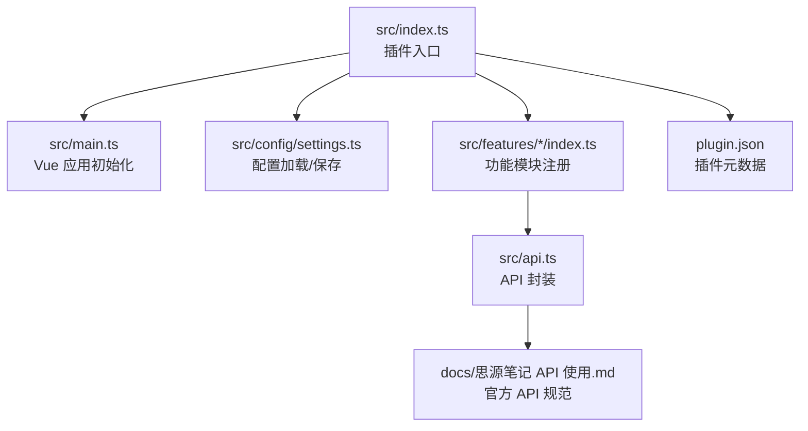
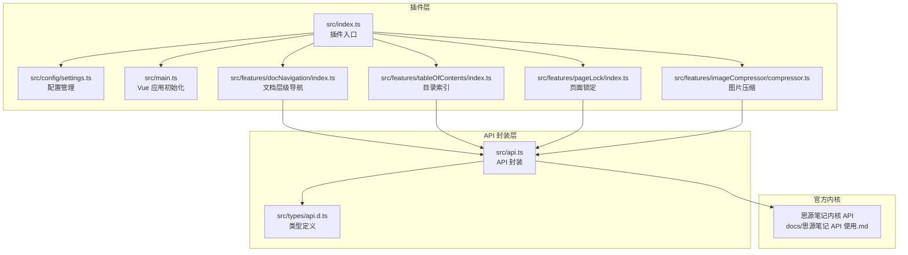
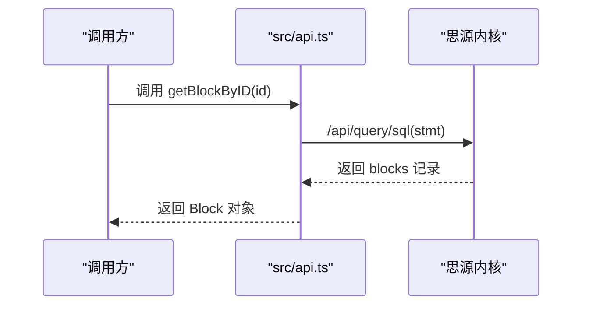
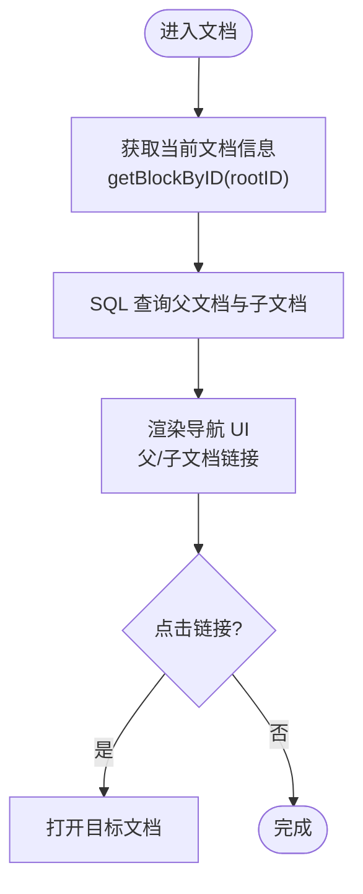
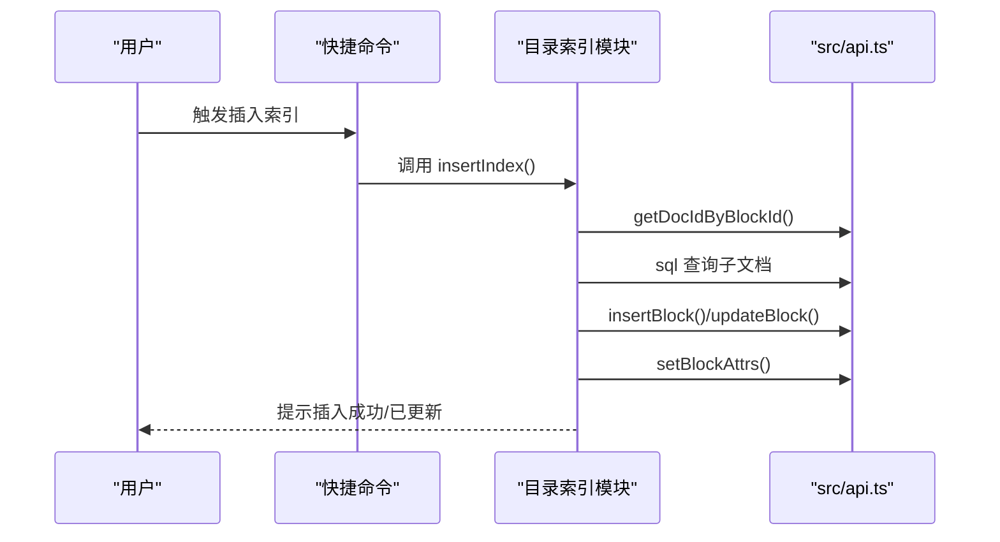
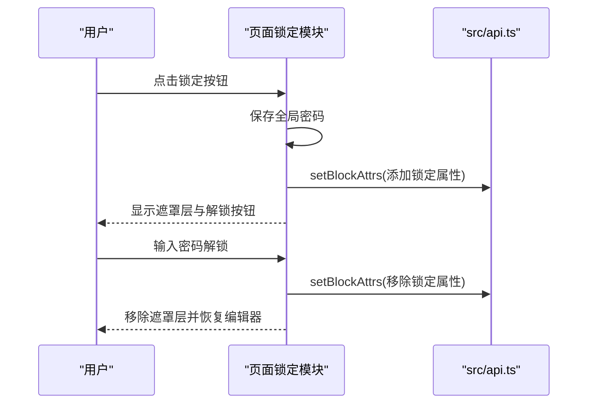
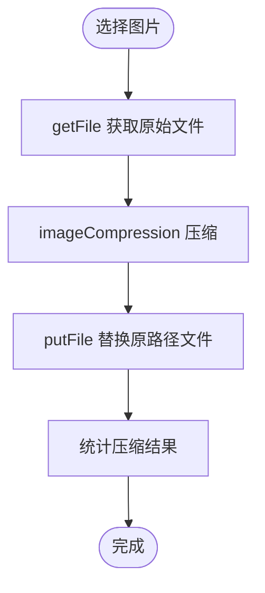
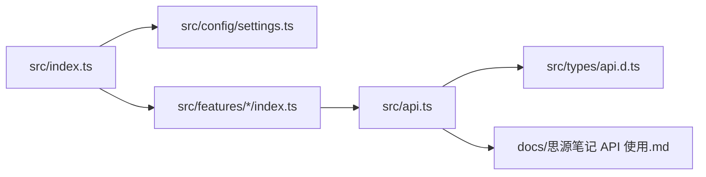

# 使用思源笔记API

<cite>
**本文引用的文件**
- [README.md](file://README.md)
- [plugin.json](file://plugin.json)
- [src/api.ts](file://src/api.ts)
- [src/types/api.d.ts](file://src/types/api.d.ts)
- [docs/思源笔记 API 使用.md](file://docs/思源笔记 API 使用.md)
- [src/index.ts](file://src/index.ts)
- [src/main.ts](file://src/main.ts)
- [src/config/settings.ts](file://src/config/settings.ts)
- [src/features/docNavigation/index.ts](file://src/features/docNavigation/index.ts)
- [src/features/tableOfContents/index.ts](file://src/features/tableOfContents/index.ts)
- [src/features/pageLock/index.ts](file://src/features/pageLock/index.ts)
- [src/features/imageCompressor/compressor.ts](file://src/features/imageCompressor/compressor.ts)
</cite>

## 目录
1. [简介](#简介)
2. [项目结构](#项目结构)
3. [核心组件](#核心组件)
4. [架构总览](#架构总览)
5. [详细组件分析](#详细组件分析)
6. [依赖关系分析](#依赖关系分析)
7. [性能考量](#性能考量)
8. [故障排查指南](#故障排查指南)
9. [结论](#结论)
10. [附录](#附录)

## 简介
本文件面向希望在思源笔记插件中使用官方 API 的开发者，系统梳理了仓库中对 API 的封装、调用与集成方式，帮助快速理解如何在插件中安全、稳定地访问思源笔记内核提供的能力。文档重点覆盖：
- API 封装与类型定义
- 常用 API 的调用场景与流程
- 与插件生命周期、功能模块的集成方式
- 性能与错误处理建议
- 常见问题与排障思路

## 项目结构
该项目采用 Vue3 + Vite 的插件开发模板，围绕“功能模块 + API 封装”的架构组织代码。核心入口负责加载配置、注册功能模块；各功能模块按需调用 API 实现业务逻辑；API 封装统一在 src/api.ts 中，类型定义在 src/types/api.d.ts 中。

图表来源
- [src/index.ts](file://src/index.ts#L1-L165)
- [src/main.ts](file://src/main.ts#L1-L45)
- [src/config/settings.ts](file://src/config/settings.ts#L1-L161)
- [src/api.ts](file://src/api.ts#L1-L120)
- [docs/思源笔记 API 使用.md](file://docs/思源笔记 API 使用.md#L1-L120)
- [plugin.json](file://plugin.json#L1-L34)

章节来源
- [README.md](file://README.md#L1-L120)
- [plugin.json](file://plugin.json#L1-L34)

## 核心组件
- API 封装层：集中封装了笔记本、文件树、块、属性、SQL、模板、文件、导出、转换、通知、网络、系统等 API，统一返回结构与错误处理策略。
- 类型定义层：提供 IResXxx 等接口，明确各 API 的响应结构，便于 IDE 提示与静态校验。
- 功能模块：如文档层级导航、目录索引、页面锁定、图片压缩等，均通过 API 封装完成对内核的读写与交互。
- 插件入口与生命周期：在 onload 中加载配置、注册功能模块、初始化 UI；在 onunload 中清理资源。

章节来源
- [src/api.ts](file://src/api.ts#L1-L120)
- [src/types/api.d.ts](file://src/types/api.d.ts#L1-L65)
- [src/index.ts](file://src/index.ts#L1-L165)
- [src/main.ts](file://src/main.ts#L1-L45)

## 架构总览
下图展示了插件如何通过 API 封装与官方内核交互，以及功能模块如何组合使用这些能力。

图表来源
- [src/index.ts](file://src/index.ts#L1-L165)
- [src/config/settings.ts](file://src/config/settings.ts#L1-L161)
- [src/main.ts](file://src/main.ts#L1-L45)
- [src/features/docNavigation/index.ts](file://src/features/docNavigation/index.ts#L1-L120)
- [src/features/tableOfContents/index.ts](file://src/features/tableOfContents/index.ts#L1-L120)
- [src/features/pageLock/index.ts](file://src/features/pageLock/index.ts#L1-L120)
- [src/features/imageCompressor/compressor.ts](file://src/features/imageCompressor/compressor.ts#L1-L120)
- [src/api.ts](file://src/api.ts#L1-L120)
- [src/types/api.d.ts](file://src/types/api.d.ts#L1-L65)
- [docs/思源笔记 API 使用.md](file://docs/思源笔记 API 使用.md#L1-L120)

## 详细组件分析

### API 封装层（src/api.ts）
- 设计要点
  - 统一封装 fetchSyncPost 与原生 fetch，分别用于 JSON 响应与二进制文件下载。
  - 统一错误处理：当 response.code 非 0 时返回 null，调用方需自行判断空值并处理异常。
  - 按功能域分组：笔记本、文件树、块、属性、SQL、模板、文件、导出、转换、通知、网络、系统等。
  - 便捷函数：如 reloadUI 使用原生 fetch 直接调用系统 API 重载界面。
- 典型调用流程（以“获取块信息”为例）

图表来源
- [src/api.ts](file://src/api.ts#L313-L326)

章节来源
- [src/api.ts](file://src/api.ts#L1-L120)
- [src/api.ts](file://src/api.ts#L313-L326)

### 类型定义层（src/types/api.d.ts）
- 作用：为 API 响应提供强类型约束，降低调用方心智负担。
- 示例：IResGetChildBlock、IResGetBlockKramdown、IResExportMdContent 等接口，明确字段含义与类型。

章节来源
- [src/types/api.d.ts](file://src/types/api.d.ts#L1-L65)

### 功能模块与 API 集成

#### 文档层级导航（src/features/docNavigation/index.ts）
- 目标：在文档标题下方展示父文档与子文档的导航链接，提升文档间跳转效率。
- 关键 API 使用
  - 通过 sql 查询当前文档的父文档与直接子文档，一次性查询避免多次往返。
  - 通过 getBlockByID 获取当前文档基础信息，结合 hpath 与 box 进行路径过滤。
  - 通过 setBlockAttrs 为文档添加自定义属性，便于后续识别与样式控制。
- 性能与体验
  - 使用防抖与去重集合，避免重复渲染与内存泄漏。
  - 通过注入样式与展开按钮，优化长列表展示。

图表来源
- [src/features/docNavigation/index.ts](file://src/features/docNavigation/index.ts#L1-L120)
- [src/features/docNavigation/index.ts](file://src/features/docNavigation/index.ts#L120-L220)

章节来源
- [src/features/docNavigation/index.ts](file://src/features/docNavigation/index.ts#L1-L220)

#### 目录索引（src/features/tableOfContents/index.ts）
- 目标：提供快捷命令，一键插入当前文档的子文档索引、子文档引用列表或子文档大纲。
- 关键 API 使用
  - 通过 getCurrentBlockId 与 getDocIdByBlockId 精确定位光标所在文档。
  - 通过 sql 查询子文档与标题块，生成 Markdown 内容。
  - 通过 insertBlock/appendBlock/updateBlock 等块操作 API 插入或更新索引块。
  - 通过 setBlockAttrs 为索引块添加自定义属性，便于后续识别与更新。
- 错误处理
  - 对“无活动文档”“无子文档”等情况给出提示。
  - 对内容无变化的情况避免重复更新。

图表来源
- [src/features/tableOfContents/index.ts](file://src/features/tableOfContents/index.ts#L1-L120)
- [src/features/tableOfContents/index.ts](file://src/features/tableOfContents/index.ts#L120-L220)

章节来源
- [src/features/tableOfContents/index.ts](file://src/features/tableOfContents/index.ts#L1-L220)

#### 页面锁定（src/features/pageLock/index.ts）
- 目标：为文档添加全局密码锁定，拦截未解锁文档内容显示，解锁后恢复编辑器可见性。
- 关键 API 使用
  - 通过 setBlockAttrs 为文档添加/移除自定义属性，标记锁定状态与图标。
  - 通过 storage 模块持久化密码与解锁会话状态。
- 安全与体验
  - 支持全局密码与“超级密码”重置机制。
  - 动态注入遮罩层与按钮，提供一键解锁入口。

图表来源
- [src/features/pageLock/index.ts](file://src/features/pageLock/index.ts#L1-L120)
- [src/features/pageLock/index.ts](file://src/features/pageLock/index.ts#L120-L220)

章节来源
- [src/features/pageLock/index.ts](file://src/features/pageLock/index.ts#L1-L220)

#### 图片压缩（src/features/imageCompressor/compressor.ts）
- 目标：对工作空间中的图片进行压缩，支持批量处理与进度反馈。
- 关键 API 使用
  - 通过 getFile 获取原始图片 Blob。
  - 通过 imageCompression 执行压缩。
  - 通过 putFile 将压缩后的 Blob 写回原路径，实现原地替换。
- 性能与可靠性
  - 使用 Web Worker 与合理质量参数，平衡压缩比与耗时。
  - 提供统计信息与失败重试策略。

图表来源
- [src/features/imageCompressor/compressor.ts](file://src/features/imageCompressor/compressor.ts#L1-L120)

章节来源
- [src/features/imageCompressor/compressor.ts](file://src/features/imageCompressor/compressor.ts#L1-L120)

## 依赖关系分析
- 插件入口依赖配置管理与功能模块注册，功能模块再依赖 API 封装。
- API 封装依赖官方内核提供的 HTTP 端点与响应格式。
- 类型定义为 API 封装与功能模块提供类型保障。

图表来源
- [src/index.ts](file://src/index.ts#L1-L165)
- [src/config/settings.ts](file://src/config/settings.ts#L1-L161)
- [src/api.ts](file://src/api.ts#L1-L120)
- [src/types/api.d.ts](file://src/types/api.d.ts#L1-L65)
- [docs/思源笔记 API 使用.md](file://docs/思源笔记 API 使用.md#L1-L120)

章节来源
- [src/index.ts](file://src/index.ts#L1-L165)
- [src/config/settings.ts](file://src/config/settings.ts#L1-L161)
- [src/api.ts](file://src/api.ts#L1-L120)

## 性能考量
- API 调用频率控制
  - 使用防抖与去重集合（如文档层级导航），避免短时间内重复渲染。
  - 合理合并查询（如一次性查询父文档与子文档），减少往返次数。
- I/O 与网络
  - 图片压缩使用 Web Worker，避免阻塞主线程。
  - 文件读写采用二进制 Blob，减少中间转换成本。
- 错误与回退
  - API 封装统一返回 null，调用方需显式判断并降级处理。
  - 对网络/文件异常进行日志记录与用户提示。

[本节为通用指导，不直接分析具体文件]

## 故障排查指南
- 环境与配置
  - 确认 .env 中 VITE_SIYUAN_WORKSPACE_PATH 配置正确，且思源笔记正在运行。
  - 检查 plugin.json 中 minAppVersion 与当前思源版本匹配。
- API 访问
  - 若出现“code 非 0”，检查请求参数与权限；必要时在浏览器中使用 ApiFox 调试。
  - 对二进制文件读取失败，检查路径是否在工作空间内、是否为文件而非目录。
- 功能异常
  - 文档层级导航不显示：确认当前文档具备 hpath 与 box，且 SQL 查询返回有效结果。
  - 目录索引未更新：检查自定义属性标记是否正确，避免重复插入。
  - 页面锁定无效：确认 setBlockAttrs 成功写入，且 DOM 已刷新文档树图标。

章节来源
- [README.md](file://README.md#L396-L436)
- [plugin.json](file://plugin.json#L1-L34)

## 结论
本项目通过清晰的 API 封装与类型定义，将复杂内核能力抽象为易用的函数与接口；功能模块围绕 API 进行组合，形成可扩展的插件体系。遵循本文档的调用流程、性能与排障建议，可在保证稳定性的同时高效实现各类业务需求。

[本节为总结性内容，不直接分析具体文件]

## 附录

### 常用 API 调用清单（基于封装）
- 笔记本：lsNotebooks、openNotebook、closeNotebook、renameNotebook、createNotebook、removeNotebook、getNotebookConf、setNotebookConf
- 文件树：createDocWithMd、renameDoc、removeDoc、moveDocs、getHPathByPath、getHPathByID、getIDsByHPath
- 块：insertBlock、prependBlock、appendBlock、updateBlock、deleteBlock、moveBlock、getBlockKramdown、getChildBlocks、transferBlockRef
- 属性：setBlockAttrs、getBlockAttrs
- SQL：sql、getBlockByID
- 模板：render、renderSprig
- 文件：getFile（二进制）、putFile、removeFile、readDir
- 导出：exportMdContent、exportResources
- 转换：pandoc
- 通知：pushMsg、pushErrMsg
- 网络：forwardProxy
- 系统：bootProgress、version、currentTime、reloadUI

章节来源
- [src/api.ts](file://src/api.ts#L1-L519)
- [docs/思源笔记 API 使用.md](file://docs/思源笔记 API 使用.md#L1-L120)