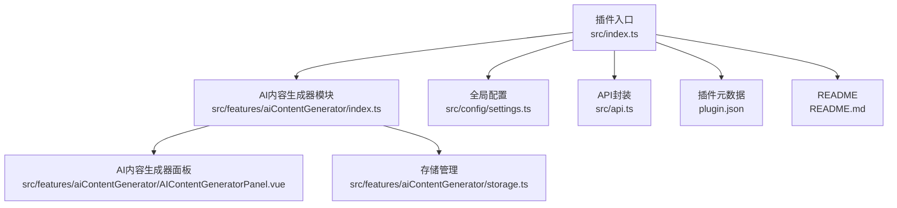
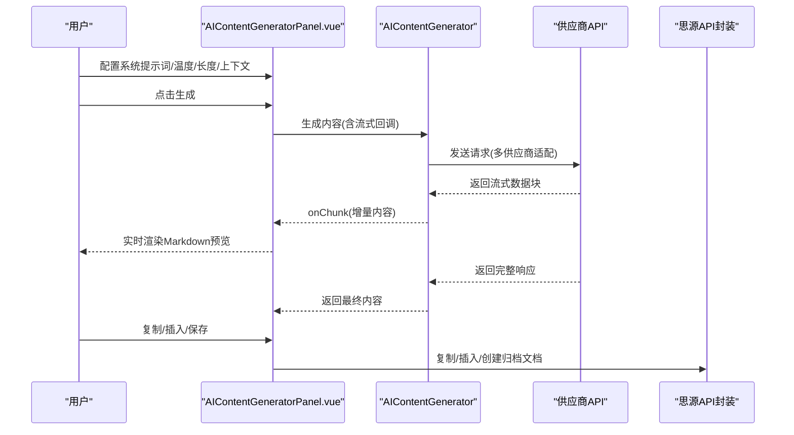
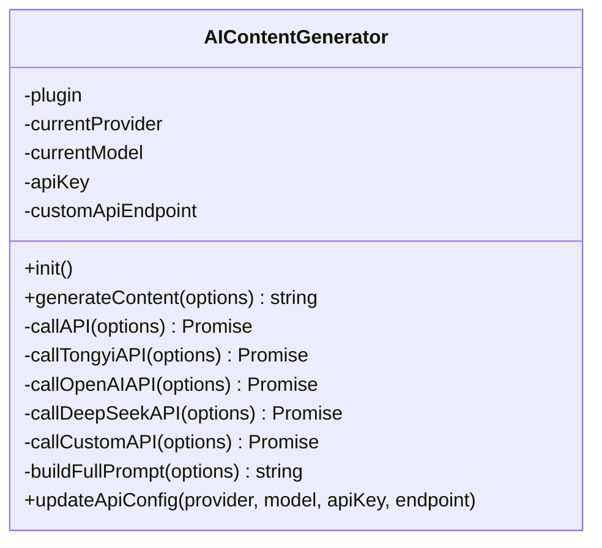
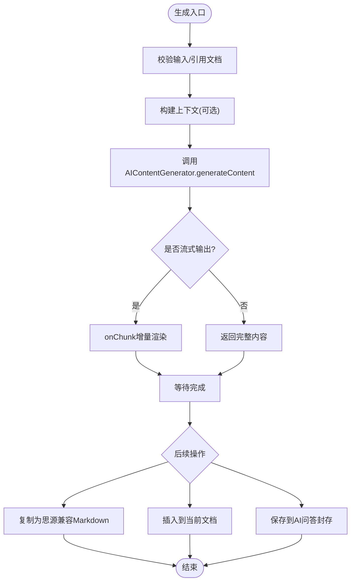
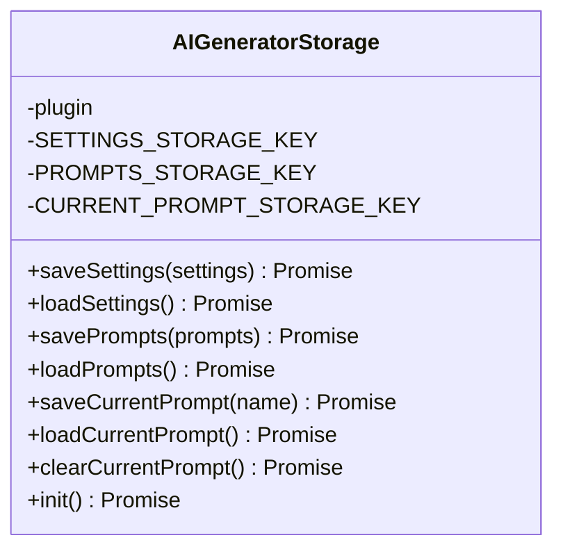
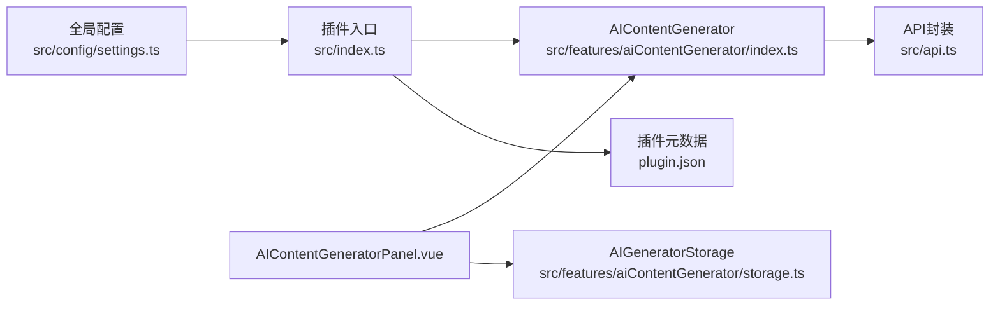

# AI内容生成器

<cite>
**本文引用的文件**
- [README.md](file://README.md)
- [plugin.json](file://plugin.json)
- [src/index.ts](file://src/index.ts)
- [src/config/settings.ts](file://src/config/settings.ts)
- [src/api.ts](file://src/api.ts)
- [src/features/aiContentGenerator/index.ts](file://src/features/aiContentGenerator/index.ts)
- [src/features/aiContentGenerator/AIContentGeneratorPanel.vue](file://src/features/aiContentGenerator/AIContentGeneratorPanel.vue)
- [src/features/aiContentGenerator/storage.ts](file://src/features/aiContentGenerator/storage.ts)
</cite>

## 目录
1. [简介](#简介)
2. [项目结构](#项目结构)
3. [核心组件](#核心组件)
4. [架构总览](#架构总览)
5. [详细组件分析](#详细组件分析)
6. [依赖关系分析](#依赖关系分析)
7. [性能考量](#性能考量)
8. [故障排查指南](#故障排查指南)
9. [结论](#结论)
10. [附录](#附录)

## 简介
本插件为“AI内容生成器”，提供在思源笔记内进行智能内容生成、编辑与管理的能力。其核心能力包括：
- 支持多大模型供应商（通义、OpenAI、DeepSeek、自定义）与流式输出，提供“打字机”式实时预览体验
- 提供“对话设置”与“提示词模板”管理，支持上下文消息数量控制
- 支持“普通模式”与“编辑模式”两种工作流：前者用于问答与生成，后者用于对现有文档进行润色、扩写、精简、纠错、翻译、改写与智能分析
- 支持将生成内容保存至“AI问答封存”笔记本，按类别自动归档
- 支持将生成内容复制为思源兼容的 Markdown，或将内容直接插入到当前文档

该功能模块位于 features/aiContentGenerator 目录，通过插件入口按配置动态注册，并通过 Dock 面板与右键菜单集成。

## 项目结构
AI内容生成器属于插件的功能模块之一，整体项目采用模块化架构，功能按目录划分，插件入口负责加载配置并按开关注册各功能模块。

图表来源
- [src/index.ts](file://src/index.ts#L81-L151)
- [src/features/aiContentGenerator/index.ts](file://src/features/aiContentGenerator/index.ts#L983-L993)
- [src/features/aiContentGenerator/AIContentGeneratorPanel.vue](file://src/features/aiContentGenerator/AIContentGeneratorPanel.vue#L1-L120)
- [src/features/aiContentGenerator/storage.ts](file://src/features/aiContentGenerator/storage.ts#L1-L162)
- [src/config/settings.ts](file://src/config/settings.ts#L9-L34)
- [src/api.ts](file://src/api.ts#L1-L120)
- [plugin.json](file://plugin.json#L1-L34)
- [README.md](file://README.md#L1-L120)

章节来源
- [src/index.ts](file://src/index.ts#L81-L151)
- [README.md](file://README.md#L1-L120)

## 核心组件
- AIContentGenerator 类：负责与外部大模型服务交互，支持多供应商、流式输出、停止生成、对话上下文构建与错误处理
- AIContentGeneratorPanel.vue：提供图形化界面，包含对话设置、提示词模板、引用文档、生成/停止、插入/复制/保存、编辑模式下的智能编辑与分析等功能
- AIGeneratorStorage：负责插件内设置、提示词与当前提示词的选择持久化
- 插件入口与配置：通过插件入口按开关注册模块，并从全局配置读取大模型供应商、API密钥、自定义端点等

章节来源
- [src/features/aiContentGenerator/index.ts](file://src/features/aiContentGenerator/index.ts#L27-L120)
- [src/features/aiContentGenerator/AIContentGeneratorPanel.vue](file://src/features/aiContentGenerator/AIContentGeneratorPanel.vue#L1-L120)
- [src/features/aiContentGenerator/storage.ts](file://src/features/aiContentGenerator/storage.ts#L1-L162)
- [src/config/settings.ts](file://src/config/settings.ts#L9-L34)

## 架构总览
AI内容生成器的运行流程如下：
- 插件入口加载配置并注册AI内容生成器模块
- 模块初始化时创建 Dock 面板并挂载 Vue 组件
- 用户在面板中配置系统提示词、温度、最大长度、上下文消息数量等
- 生成内容时，根据所选供应商调用相应 API；若启用流式输出，则逐块推送并在面板中实时渲染
- 生成完成后，支持复制为思源兼容 Markdown、插入到当前文档、或保存到“AI问答封存”笔记本

图表来源
- [src/features/aiContentGenerator/AIContentGeneratorPanel.vue](file://src/features/aiContentGenerator/AIContentGeneratorPanel.vue#L740-L845)
- [src/features/aiContentGenerator/index.ts](file://src/features/aiContentGenerator/index.ts#L328-L469)
- [src/api.ts](file://src/api.ts#L71-L120)

## 详细组件分析

### AIContentGenerator 类
职责与特性：
- 从插件配置读取当前供应商、模型、API Key、自定义端点
- 提供 updateApiConfig 以在超级面板更新配置
- 提供 init，注册 Dock 与右键菜单
- 提供 generateContent，统一生成入口，内部根据供应商分派调用
- 支持构建完整提示词（可带上下文）
- 支持多供应商 API 调用与流式输出解析（通义、OpenAI、DeepSeek、自定义）

图表来源
- [src/features/aiContentGenerator/index.ts](file://src/features/aiContentGenerator/index.ts#L27-L120)
- [src/features/aiContentGenerator/index.ts](file://src/features/aiContentGenerator/index.ts#L328-L469)
- [src/features/aiContentGenerator/index.ts](file://src/features/aiContentGenerator/index.ts#L470-L993)

章节来源
- [src/features/aiContentGenerator/index.ts](file://src/features/aiContentGenerator/index.ts#L27-L120)
- [src/features/aiContentGenerator/index.ts](file://src/features/aiContentGenerator/index.ts#L328-L469)
- [src/features/aiContentGenerator/index.ts](file://src/features/aiContentGenerator/index.ts#L470-L993)

### AIContentGeneratorPanel.vue 面板组件
职责与特性：
- 对话设置：系统提示词、温度、最大长度、上下文消息数量、保存当前配置
- 提示词模板：保存/加载/编辑/删除，支持持久化当前选中提示词
- 引用当前文档：自动移除 Frontmatter 并注入到生成上下文中
- 生成流程：支持 Ctrl+Enter 快捷键触发；支持停止生成；支持流式渲染
- 编辑模式：支持对目标文档进行润色、扩写、精简、纠错、翻译、改写；支持智能分析并应用建议
- 归档与插入：自动保存到“AI问答封存”笔记本（按类别），支持复制为思源兼容 Markdown，支持插入到当前文档
- UI 适配：移动端折叠/展开输入区；代码高亮渲染

图表来源
- [src/features/aiContentGenerator/AIContentGeneratorPanel.vue](file://src/features/aiContentGenerator/AIContentGeneratorPanel.vue#L740-L845)
- [src/features/aiContentGenerator/AIContentGeneratorPanel.vue](file://src/features/aiContentGenerator/AIContentGeneratorPanel.vue#L846-L1177)
- [src/features/aiContentGenerator/AIContentGeneratorPanel.vue](file://src/features/aiContentGenerator/AIContentGeneratorPanel.vue#L1178-L1567)

章节来源
- [src/features/aiContentGenerator/AIContentGeneratorPanel.vue](file://src/features/aiContentGenerator/AIContentGeneratorPanel.vue#L1-L120)
- [src/features/aiContentGenerator/AIContentGeneratorPanel.vue](file://src/features/aiContentGenerator/AIContentGeneratorPanel.vue#L740-L845)
- [src/features/aiContentGenerator/AIContentGeneratorPanel.vue](file://src/features/aiContentGenerator/AIContentGeneratorPanel.vue#L846-L1177)
- [src/features/aiContentGenerator/AIContentGeneratorPanel.vue](file://src/features/aiContentGenerator/AIContentGeneratorPanel.vue#L1178-L1567)

### 存储管理 AIGeneratorStorage
职责与特性：
- 负责插件内设置、提示词列表与当前提示词选择的持久化
- 提供初始化：若无设置/提示词则写入默认值
- 提供保存/加载设置、保存/加载提示词、保存/加载当前提示词、清除当前提示词

图表来源
- [src/features/aiContentGenerator/storage.ts](file://src/features/aiContentGenerator/storage.ts#L1-L162)

章节来源
- [src/features/aiContentGenerator/storage.ts](file://src/features/aiContentGenerator/storage.ts#L1-L162)

### 插件入口与配置集成
- 插件入口按配置开关注册 AI 内容生成器模块
- 全局配置包含统一的大模型供应商、API 密钥、自定义端点等字段
- AIContentGenerator 从插件 settings 读取供应商与密钥

章节来源
- [src/index.ts](file://src/index.ts#L81-L151)
- [src/config/settings.ts](file://src/config/settings.ts#L9-L34)
- [src/features/aiContentGenerator/index.ts](file://src/features/aiContentGenerator/index.ts#L34-L53)

## 依赖关系分析
- 模块耦合
  - AIContentGenerator 依赖插件配置与全局 API 封装
  - AIContentGeneratorPanel.vue 依赖 AIContentGenerator 生成接口与 AIGeneratorStorage
  - 插件入口负责注册与配置加载
- 外部依赖
  - 思源 API 封装：笔记本/文档/块操作、SQL 查询、通知等
  - 第三方大模型供应商：通义、OpenAI、DeepSeek、自定义
- 潜在循环依赖
  - 无直接循环依赖；模块间通过接口与回调解耦

图表来源
- [src/config/settings.ts](file://src/config/settings.ts#L9-L34)
- [src/index.ts](file://src/index.ts#L81-L151)
- [src/features/aiContentGenerator/index.ts](file://src/features/aiContentGenerator/index.ts#L983-L993)
- [src/features/aiContentGenerator/AIContentGeneratorPanel.vue](file://src/features/aiContentGenerator/AIContentGeneratorPanel.vue#L1-L120)
- [src/features/aiContentGenerator/storage.ts](file://src/features/aiContentGenerator/storage.ts#L1-L162)
- [src/api.ts](file://src/api.ts#L1-L120)
- [plugin.json](file://plugin.json#L1-L34)

章节来源
- [src/index.ts](file://src/index.ts#L81-L151)
- [src/config/settings.ts](file://src/config/settings.ts#L9-L34)
- [src/features/aiContentGenerator/index.ts](file://src/features/aiContentGenerator/index.ts#L983-L993)
- [src/features/aiContentGenerator/AIContentGeneratorPanel.vue](file://src/features/aiContentGenerator/AIContentGeneratorPanel.vue#L1-L120)
- [src/features/aiContentGenerator/storage.ts](file://src/features/aiContentGenerator/storage.ts#L1-L162)
- [src/api.ts](file://src/api.ts#L1-L120)
- [plugin.json](file://plugin.json#L1-L34)

## 性能考量
- 流式输出
  - 通过 onChunk 逐步渲染，避免一次性渲染大段内容导致卡顿
  - 建议合理设置 maxTokens，避免过长响应造成内存压力
- 上下文控制
  - 通过上下文消息数量限制减少上下文长度，提高响应速度与稳定性
- 渲染优化
  - 使用 marked 渲染 Markdown，配合代码高亮，注意在大量代码块场景下的渲染开销
- 网络与超时
  - 建议为不同供应商设置合理的超时与重试策略（当前实现主要依赖 AbortController 停止）
- 存储与持久化
  - 设置与提示词采用异步持久化，避免阻塞 UI；同时提供 localStorage 降级方案

[本节为通用指导，无需列出具体文件来源]

## 故障排查指南
- 无法生成内容
  - 检查供应商与 API Key 配置是否正确
  - 若启用流式输出，确认网络与供应商端支持 SSE
- 生成卡住或无响应
  - 使用停止按钮中断生成；检查 AbortController 是否正常释放
- 复制/插入失败
  - 确认当前光标所在文档或块 ID 可获取；检查权限与网络
- 归档失败
  - 确认“AI问答封存”笔记本存在或可创建；检查 SQL 查询与文档创建权限
- Markdown 显示异常
  - 使用“复制为思源兼容 Markdown”以规避粗体等显示问题

章节来源
- [src/features/aiContentGenerator/AIContentGeneratorPanel.vue](file://src/features/aiContentGenerator/AIContentGeneratorPanel.vue#L1076-L1177)
- [src/features/aiContentGenerator/AIContentGeneratorPanel.vue](file://src/features/aiContentGenerator/AIContentGeneratorPanel.vue#L1178-L1567)
- [src/features/aiContentGenerator/index.ts](file://src/features/aiContentGenerator/index.ts#L328-L469)

## 结论
AI内容生成器模块通过清晰的职责划分与良好的解耦设计，实现了在思源笔记内的高效内容生成与编辑体验。其多供应商适配、流式输出、提示词模板与归档能力，满足了从问答到文档编辑的多样化需求。建议在实际使用中结合上下文控制与合理的 maxTokens 设置，以获得更稳定与高效的体验。

[本节为总结性内容，无需列出具体文件来源]

## 附录

### 快速使用指引
- 打开“AI信息生成” Dock 面板，配置系统提示词、温度、最大长度与上下文数量
- 在普通模式下输入问题或引用当前文档，点击生成；在编辑模式下选择目标文档进行智能编辑
- 生成完成后可复制为思源兼容 Markdown、插入到当前文档或保存到“AI问答封存”笔记本

章节来源
- [src/features/aiContentGenerator/AIContentGeneratorPanel.vue](file://src/features/aiContentGenerator/AIContentGeneratorPanel.vue#L1-L120)
- [src/features/aiContentGenerator/AIContentGeneratorPanel.vue](file://src/features/aiContentGenerator/AIContentGeneratorPanel.vue#L740-L845)
- [src/features/aiContentGenerator/AIContentGeneratorPanel.vue](file://src/features/aiContentGenerator/AIContentGeneratorPanel.vue#L1178-L1567)