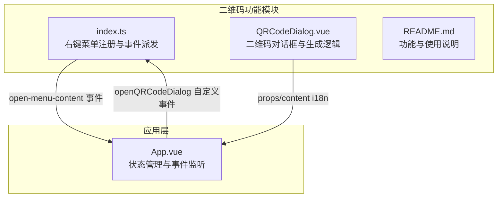
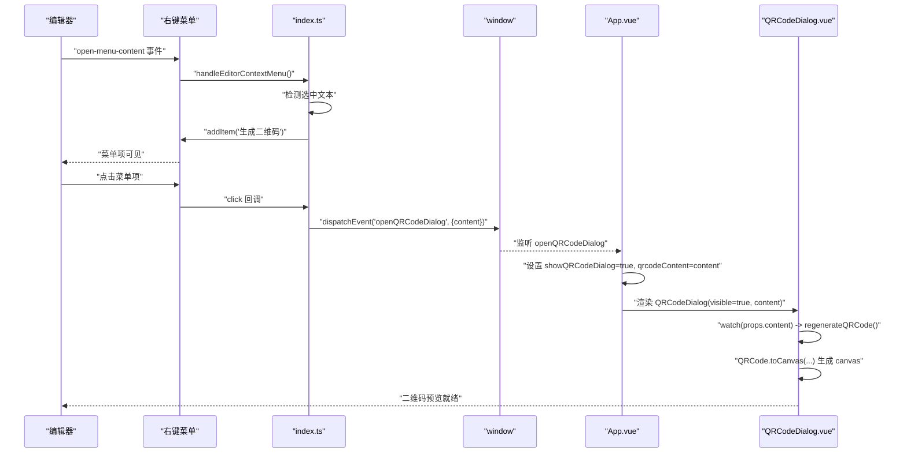
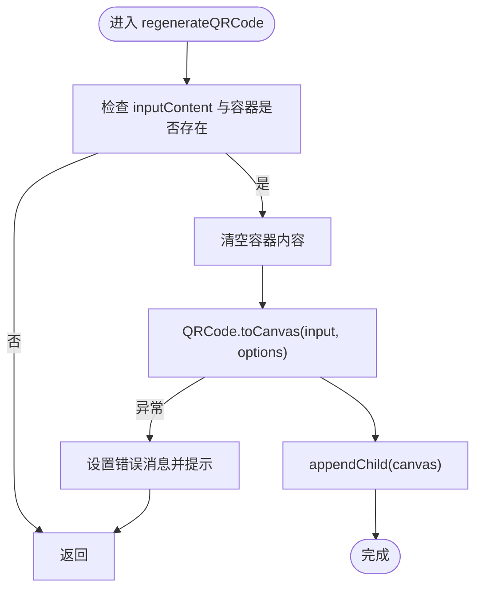
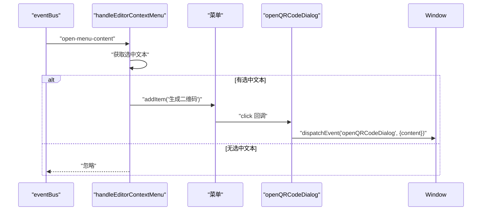
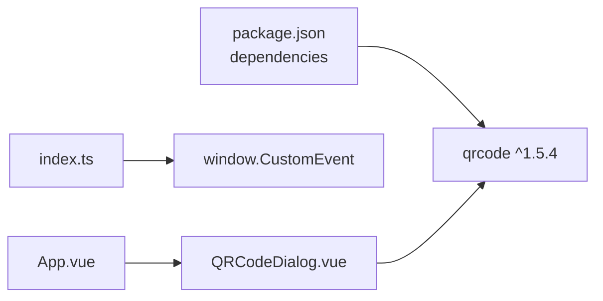

# 二维码生成

<cite>
**本文引用的文件**
- [QRCodeDialog.vue](file://src/features/qrCode/QRCodeDialog.vue)
- [index.ts](file://src/features/qrCode/index.ts)
- [README.md](file://src/features/qrCode/README.md)
- [App.vue](file://src/App.vue)
- [settings.ts](file://src/config/settings.ts)
- [zh_CN.json](file://src/i18n/zh_CN.json)
- [en_US.json](file://src/i18n/en_US.json)
- [package.json](file://package.json)
</cite>

## 目录
1. [简介](#简介)
2. [项目结构](#项目结构)
3. [核心组件](#核心组件)
4. [架构总览](#架构总览)
5. [组件详解](#组件详解)
6. [依赖关系分析](#依赖关系分析)
7. [性能与可用性](#性能与可用性)
8. [故障排查](#故障排查)
9. [结论](#结论)
10. [附录](#附录)

## 简介
本技术文档围绕“二维码生成”功能展开，重点说明其与思源笔记编辑器右键菜单的集成方式，以及 QRCodeDialog.vue 如何接收选中文本或链接并生成可扫描的二维码图像。文档还分析了所使用的二维码生成库（qrcode.js）的配置参数，给出右键菜单项注册与事件处理流程的代码示例路径，解释响应式设计如何确保二维码在不同设备上清晰可读，并提供常见应用场景与问题排查建议。

## 项目结构
二维码功能位于 features/qrCode 目录，由三部分组成：
- index.ts：负责监听编辑器右键菜单事件，检测选中文本并在菜单中注入“生成二维码”项，随后通过自定义事件通知 App.vue 打开对话框。
- QRCodeDialog.vue：Vue 组件，提供二维码生成、复制、下载、尺寸与纠错级别调节的 UI 与交互逻辑。
- README.md：功能说明、使用方式、技术实现、配置与故障排查等文档。

图表来源
- [index.ts](file://src/features/qrCode/index.ts#L1-L69)
- [QRCodeDialog.vue](file://src/features/qrCode/QRCodeDialog.vue#L1-L233)
- [README.md](file://src/features/qrCode/README.md#L37-L189)
- [App.vue](file://src/App.vue#L1-L150)

章节来源
- [index.ts](file://src/features/qrCode/index.ts#L1-L69)
- [QRCodeDialog.vue](file://src/features/qrCode/QRCodeDialog.vue#L1-L233)
- [README.md](file://src/features/qrCode/README.md#L37-L189)
- [App.vue](file://src/App.vue#L1-L150)

## 核心组件
- 右键菜单集成模块（index.ts）
  - 监听编辑器右键菜单事件，提取选中文本，仅在存在选中文本时向菜单注入“生成二维码”项。
  - 点击菜单项后，通过自定义事件 openQRCodeDialog 通知 App.vue 打开对话框，并传入选中文本作为初始内容。
- 二维码对话框组件（QRCodeDialog.vue）
  - 接收 visible、content、i18n 三个 props；内部维护输入内容、二维码尺寸、纠错级别等状态。
  - 使用 qrcode 库生成二维码 canvas 并渲染到预览区域；支持复制到剪贴板与下载 PNG。
  - 提供尺寸滑块与纠错级别下拉选择，实时更新二维码。
- 应用层桥接（App.vue）
  - 监听 openQRCodeDialog 自定义事件，设置 showQRCodeDialog 与 qrcodeContent，驱动 QRCodeDialog.vue 显示与初始化。
  - 通过事件回调 onQRCodeDialogVisibleChange 与 onCloseQRCodeDialog 控制对话框显隐。

章节来源
- [index.ts](file://src/features/qrCode/index.ts#L1-L69)
- [QRCodeDialog.vue](file://src/features/qrCode/QRCodeDialog.vue#L1-L233)
- [App.vue](file://src/App.vue#L1-L150)

## 架构总览
二维码功能的端到端流程如下：

图表来源
- [index.ts](file://src/features/qrCode/index.ts#L16-L67)
- [App.vue](file://src/App.vue#L133-L149)
- [QRCodeDialog.vue](file://src/features/qrCode/QRCodeDialog.vue#L113-L154)

## 组件详解

### QRCodeDialog.vue：对话框与二维码生成
- 接收参数与状态
  - props：visible（是否显示）、content（初始内容）、i18n（多语言文案）。
  - 内部状态：inputContent（输入内容）、qrcodeSize（像素宽度）、errorCorrection（纠错级别 L/M/Q/H）、qrcodeContainer（预览容器）、isGenerating（生成中）、errorMessage（错误提示）。
- 生成逻辑
  - 当 inputContent 或 qrcodeContainer 变化时触发 regenerateQRCode。
  - 调用 QRCode.toCanvas(input, options) 生成 canvas 并插入预览容器。
  - options 关键参数：
    - width：二维码像素宽度（范围 100-500，滑块控制）。
    - errorCorrectionLevel：纠错级别（L/M/Q/H）。
    - margin：边距。
    - color.dark/light：前景色与背景色。
- 交互能力
  - 复制到剪贴板：将 canvas 转为 Blob，使用 ClipboardItem 写入剪贴板。
  - 下载为 PNG：将 canvas 转为 dataURL，创建 a 标签触发下载。
  - 关闭对话框：发出 update:visible 与 close 事件。
- 错误处理
  - 生成异常时记录日志、设置错误消息并通过 showMessage 提示。
  - 复制/下载前校验 canvas 是否存在，避免空操作。

图表来源
- [QRCodeDialog.vue](file://src/features/qrCode/QRCodeDialog.vue#L124-L154)

章节来源
- [QRCodeDialog.vue](file://src/features/qrCode/QRCodeDialog.vue#L1-L233)

### index.ts：右键菜单注册与事件派发
- 监听编辑器事件 open-menu-content，提取选中文本。
- 仅当存在选中文本时，向菜单注入“生成二维码”项。
- 点击菜单项后，通过 window.dispatchEvent('openQRCodeDialog', { content }) 通知 App.vue 打开对话框。

图表来源
- [index.ts](file://src/features/qrCode/index.ts#L16-L67)

章节来源
- [index.ts](file://src/features/qrCode/index.ts#L1-L69)

### App.vue：状态管理与事件监听
- 监听 window 的 openQRCodeDialog 事件，设置 showQRCodeDialog 与 qrcodeContent，从而驱动 QRCodeDialog.vue 显示并填充初始内容。
- 提供 onQRCodeDialogVisibleChange 与 onCloseQRCodeDialog 以响应对话框状态变更。

章节来源
- [App.vue](file://src/App.vue#L80-L149)

### 多语言与配置
- 多语言：中文与英文 i18n 文案覆盖“生成二维码”、“内容”、“二维码预览”、“大小”、“纠错级别”、“复制图片”、“下载”、“关闭”等关键文案。
- 插件设置：DEFAULT_SETTINGS 中包含 enableQRCode 字段，默认启用；可通过通用设置面板开关控制。

章节来源
- [zh_CN.json](file://src/i18n/zh_CN.json#L238-L256)
- [en_US.json](file://src/i18n/en_US.json#L233-L251)
- [settings.ts](file://src/config/settings.ts#L37-L50)

## 依赖关系分析
- 外部库依赖
  - qrcode：^1.5.4，用于生成二维码 canvas。
- 内部依赖
  - index.ts 依赖 siyuan 的 eventBus 与 window 自定义事件。
  - QRCodeDialog.vue 依赖 qrcode 库与 siyuan 的 showMessage。
  - App.vue 依赖 QRCodeDialog.vue 并通过事件与 props 进行桥接。

图表来源
- [package.json](file://package.json#L19-L24)
- [index.ts](file://src/features/qrCode/index.ts#L59-L67)
- [App.vue](file://src/App.vue#L1-L150)
- [QRCodeDialog.vue](file://src/features/qrCode/QRCodeDialog.vue#L82-L90)

章节来源
- [package.json](file://package.json#L19-L24)
- [index.ts](file://src/features/qrCode/index.ts#L59-L67)
- [App.vue](file://src/App.vue#L1-L150)
- [QRCodeDialog.vue](file://src/features/qrCode/QRCodeDialog.vue#L82-L90)

## 性能与可用性
- 生成性能
  - QRCode.toCanvas 会在主线程执行，内容较长或尺寸较大时可能产生一定延迟。建议：
    - 合理设置 qrcodeSize（默认 180px，范围 100-500）。
    - 优先选择较低纠错级别（M/L）以减少计算量；仅在需要更高鲁棒性时提升至 Q/H。
- 用户体验
  - 实时预览：输入框与滑块、下拉框变更时即时触发 regenerateQRCode。
  - 复制/下载：使用 Clipboard API 与 a 标签下载，避免额外网络请求。
  - 错误提示：统一通过 showMessage 提示，便于用户理解问题原因。
- 响应式设计
  - 对话框采用固定最大宽度与最大高度，配合滚动区域，保证在小屏设备上可完整显示。
  - 预览区域使用 max-width: 100% 与 height: auto，确保二维码在不同设备上清晰可读且不溢出。
  - 滑块与下拉框在移动端具备良好触控体验。

章节来源
- [QRCodeDialog.vue](file://src/features/qrCode/QRCodeDialog.vue#L124-L154)
- [QRCodeDialog.vue](file://src/features/qrCode/QRCodeDialog.vue#L371-L387)
- [QRCodeDialog.vue](file://src/features/qrCode/QRCodeDialog.vue#L251-L261)

## 故障排查
- 右键菜单中找不到“生成二维码”
  - 检查是否已选中文本。
  - 确认插件设置中 enableQRCode 已启用。
  - 重启思源笔记应用后重试。
- 复制按钮不工作
  - 确保浏览器支持 Clipboard API。
  - 确保二维码已成功生成后再复制。
  - 在 https 或 localhost 环境使用。
- 下载的二维码图片为空
  - 确保输入内容非空。
  - 等待二维码生成完成后下载。
  - 尝试在 Chrome/Firefox 等主流浏览器中使用。
- 二维码生成失败
  - 查看控制台错误日志。
  - 减小二维码尺寸或降低纠错级别以减少生成压力。
  - 检查输入内容长度是否超出 qrcode 库限制（不同纠错级别与数据类型容量不同）。

章节来源
- [README.md](file://src/features/qrCode/README.md#L134-L189)
- [QRCodeDialog.vue](file://src/features/qrCode/QRCodeDialog.vue#L146-L154)

## 结论
二维码生成功能通过“右键菜单注入 + 自定义事件桥接 + Vue 对话框”的方式，实现了从选中文本到二维码生成与导出的完整闭环。QRCodeDialog.vue 使用 qrcode 库提供高质量的二维码生成能力，并结合复制与下载功能满足多种使用场景。响应式设计确保在不同设备上都能清晰阅读与操作。通过合理的配置与错误处理，该功能在实际使用中具备良好的稳定性与可用性。

## 附录
- 使用场景示例
  - 快速分享笔记链接：在编辑器中选中链接，右键选择“生成二维码”，复制或下载后分享给他人。
  - 生成支付码：在编辑器中输入支付相关信息，生成二维码后下载保存，用于线下扫码支付。
  - 笔记内跳转：生成文档标题或锚点链接的二维码，便于移动设备快速访问。
- 二维码生成库配置要点
  - 宽度：qrcodeSize（100-500px）。
  - 纠错级别：errorCorrection（L/M/Q/H），影响可扫描性与容错能力。
  - 边距与颜色：margin、color.dark/light，优化对比度与可读性。
- 右键菜单项注册与事件处理流程（代码路径）
  - 右键菜单注册与注入：[index.ts](file://src/features/qrCode/index.ts#L16-L49)
  - 菜单项点击事件派发：[index.ts](file://src/features/qrCode/index.ts#L36-L43)
  - 自定义事件监听与对话框打开：[App.vue](file://src/App.vue#L133-L149)
  - 对话框 props 接收与初始化：[App.vue](file://src/App.vue#L1-L150)
  - 二维码生成与 UI 交互：[QRCodeDialog.vue](file://src/features/qrCode/QRCodeDialog.vue#L1-L233)