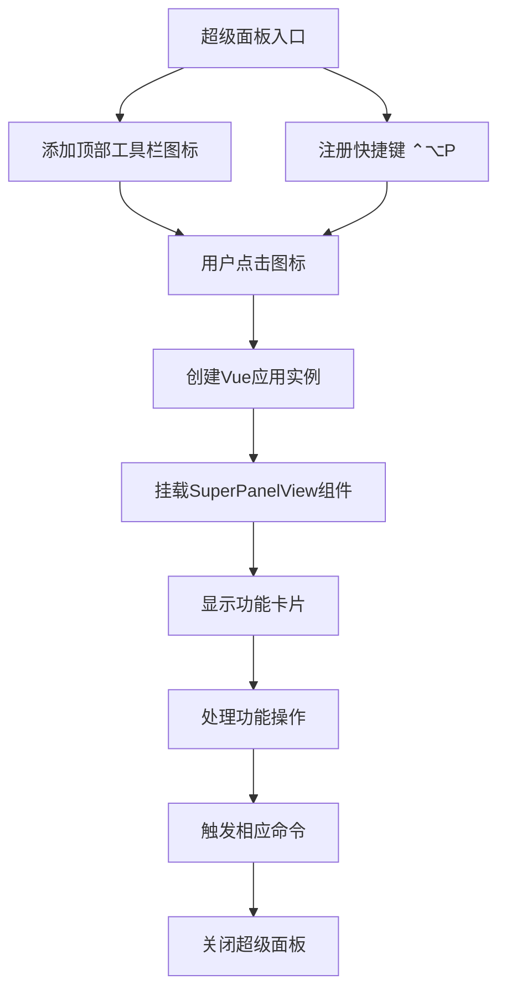
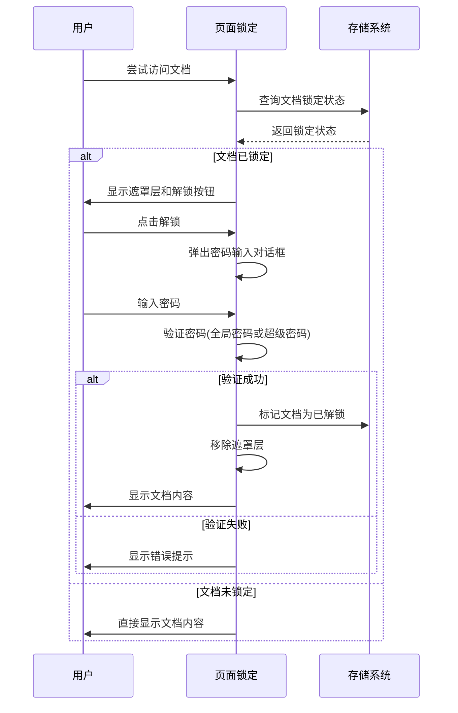
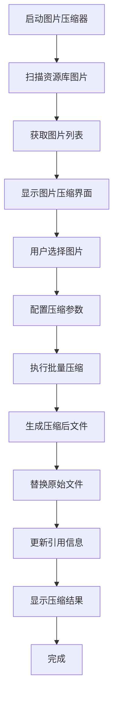
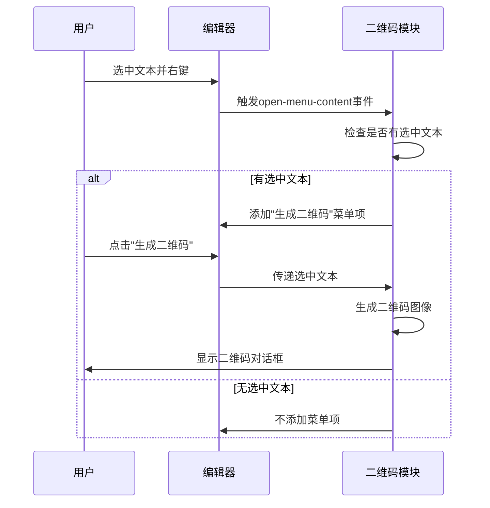
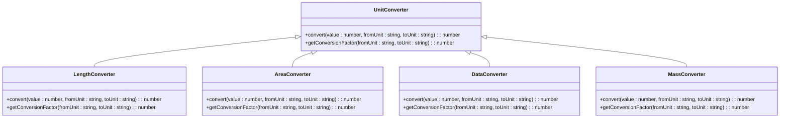
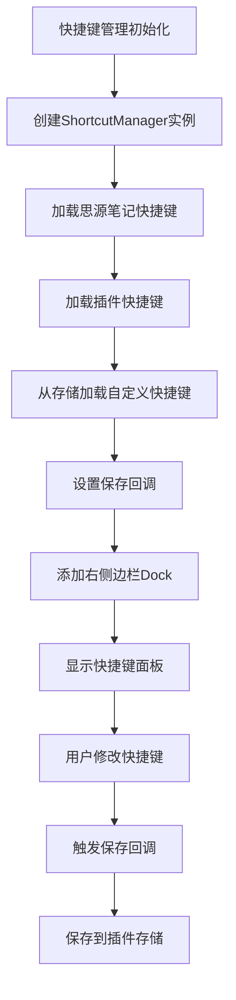
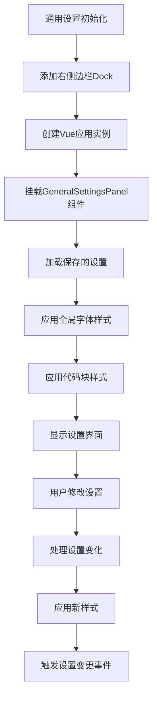
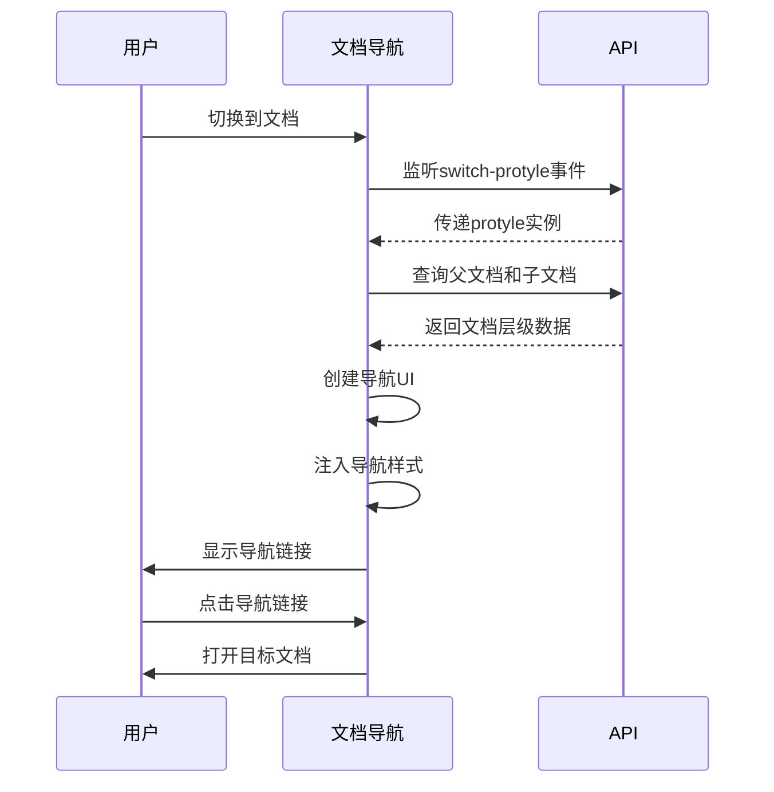
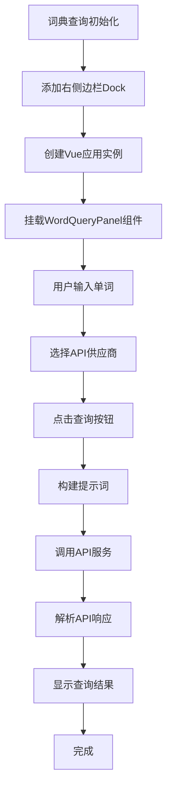
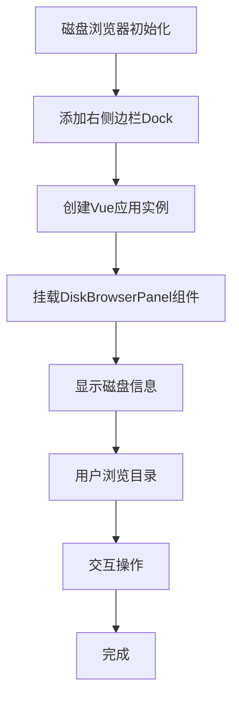

# 功能模块详解

<cite>
**本文档引用的文件**   
- [plugin.json](file://plugin.json)
- [README.md](file://README.md)
- [src/features/index.ts](file://src/features/index.ts)
- [src/main.ts](file://src/main.ts)
- [src/App.vue](file://src/App.vue)
- [src/features/superPanel/index.ts](file://src/features/superPanel/index.ts)
- [src/features/pageLock/index.ts](file://src/features/pageLock/index.ts)
- [src/features/pageLock/storage.ts](file://src/features/pageLock/storage.ts)
- [src/features/pageLock/crypto.ts](file://src/features/pageLock/crypto.ts)
- [src/features/imageCompressor/index.ts](file://src/features/imageCompressor/index.ts)
- [src/features/imageCompressor/scanner.ts](file://src/features/imageCompressor/scanner.ts)
- [src/features/imageCompressor/compressor.ts](file://src/features/imageCompressor/compressor.ts)
- [src/features/qrCode/index.ts](file://src/features/qrCode/index.ts)
- [src/features/unitConverter/index.ts](file://src/features/unitConverter/index.ts)
- [src/features/unitConverter/converters/LengthConverter.vue](file://src/features/unitConverter/converters/LengthConverter.vue)
- [src/features/shortcut/index.ts](file://src/features/shortcut/index.ts)
- [src/features/shortcut/manager.ts](file://src/features/shortcut/manager.ts)
- [src/features/shortcut/storage.ts](file://src/features/shortcut/storage.ts)
- [src/features/generalSettings/index.ts](file://src/features/generalSettings/index.ts)
- [src/features/generalSettings/components/AppearanceSettings.vue](file://src/features/generalSettings/components/AppearanceSettings.vue)
- [src/features/generalSettings/components/FontSettings.vue](file://src/features/generalSettings/components/FontSettings.vue)
- [src/features/generalSettings/components/CodeBlockSettings.vue](file://src/features/generalSettings/components/CodeBlockSettings.vue)
- [src/features/generalSettings/components/PasswordSettings.vue](file://src/features/generalSettings/components/PasswordSettings.vue)
- [src/features/docNavigation/index.ts](file://src/features/docNavigation/index.ts)
- [src/features/wordQuery/index.ts](file://src/features/wordQuery/index.ts)
- [src/features/diskBrowser/index.ts](file://src/features/diskBrowser/index.ts)
</cite>

## 目录

1. [超级面板](#超级面板)
2. [页面锁定](#页面锁定)
3. [图片压缩](#图片压缩)
4. [二维码生成](#二维码生成)
5. [单位转换](#单位转换)
6. [快捷键管理](#快捷键管理)
7. [通用设置](#通用设置)
8. [文档导航](#文档导航)
9. [词典查询](#词典查询)
10. [磁盘浏览器](#磁盘浏览器)

## 超级面板

超级面板作为插件的统一功能入口，提供了一个集中的界面来访问所有功能模块。它通过在思源笔记的右侧边栏添加一个图标来实现，用户可以通过点击该图标或使用快捷键 `⌃⌥P` 来打开超级面板。

超级面板的核心实现位于 `src/features/superPanel/index.ts` 文件中，通过 `registerSuperPanel` 函数注册功能。该函数使用 `plugin.addTopBar` 方法在顶部工具栏添加一个图标，并通过 `plugin.addCommand` 注册快捷键。当用户触发打开超级面板时，系统会动态创建一个 Vue 应用实例并挂载到页面上，显示 `SuperPanelView.vue` 组件。

`FeatureCard` 组件是超级面板中的核心UI元素，用于展示各个功能模块的卡片式入口。每个功能卡片都包含图标、标题和描述，用户点击卡片即可执行相应的功能操作。这些操作通过事件总线机制触发，例如插入索引、插入大纲、插入引用或打开图片压缩器等。

**图示来源**
- [src/features/superPanel/index.ts](file://src/features/superPanel/index.ts#L17-L138)
- [src/features/superPanel/SuperPanelView.vue](file://src/features/superPanel/SuperPanelView.vue)

## 页面锁定

页面锁定功能为用户提供了一种加密保护文档内容的安全机制。该功能通过全局预设密码对文档进行加锁和解锁操作，确保敏感信息不被未授权访问。

加密机制基于AES-256算法实现，核心逻辑位于 `src/features/pageLock/crypto.ts` 文件中。当用户锁定页面时，系统会使用全局密码对文档ID进行加密，并将加密结果存储在 `src/features/pageLock/storage.ts` 中。解锁时则进行相应的解密验证。

密码验证流程如下：当用户尝试访问已锁定的文档时，系统会拦截内容显示并弹出解锁对话框。用户需要输入正确的全局密码或使用超级密码 "kaiouyang" 才能解锁文档。验证通过后，系统会移除遮罩层并显示文档内容，同时将该文档标记为当前会话已解锁状态。

数据存储策略采用思源笔记的插件数据存储系统，通过 `plugin.saveData` 和 `plugin.loadData` 方法保存和读取加密数据。全局密码存储在 `global-password` 键下，而每个文档的锁定状态则以文档ID为键进行存储。这种设计既保证了数据的安全性，又实现了跨会话的持久化存储。

**图示来源**
- [src/features/pageLock/index.ts](file://src/features/pageLock/index.ts#L74-L573)
- [src/features/pageLock/storage.ts](file://src/features/pageLock/storage.ts)
- [src/features/pageLock/crypto.ts](file://src/features/pageLock/crypto.ts)

## 图片压缩

图片压缩功能旨在帮助用户优化资源库中的图片文件大小，提高系统性能和存储效率。该功能通过扫描、压缩和替换三个主要步骤来实现。

扫描机制由 `src/features/imageCompressor/scanner.ts` 文件中的 `scanImages` 函数实现。系统会遍历资源库目录，识别所有支持的图片格式（如JPG、PNG等），并收集图片的元数据信息，包括文件路径、原始大小和分辨率等。扫描结果会以列表形式展示在图片压缩器界面中，供用户选择需要压缩的图片。

压缩算法基于现代图像处理技术，核心逻辑位于 `src/features/imageCompressor/compressor.ts` 文件中。系统使用高效的图像编码库对选中的图片进行有损或无损压缩。用户可以在压缩对话框中调整质量参数，平衡文件大小和图像质量。压缩过程支持批量处理，能够同时处理多张图片。

文件替换流程在压缩完成后自动执行。系统会将压缩后的图片文件保存到原位置，替换原始文件，并更新相关的引用信息。整个过程确保了数据的一致性和完整性，同时提供了操作进度和结果反馈，让用户清楚了解压缩任务的执行情况。

**图示来源**
- [src/features/imageCompressor/index.ts](file://src/features/imageCompressor/index.ts#L9-L31)
- [src/features/imageCompressor/scanner.ts](file://src/features/imageCompressor/scanner.ts)
- [src/features/imageCompressor/compressor.ts](file://src/features/imageCompressor/compressor.ts)

## 二维码生成

二维码生成功能通过集成到编辑器的右键菜单中，为用户提供了一种便捷的内容分享方式。用户只需选中文本内容并右键选择"生成二维码"选项，即可快速创建对应的二维码图像。

右键菜单集成是通过监听 `open-menu-content` 事件实现的，核心代码位于 `src/features/qrCode/index.ts` 文件中。当编辑器右键菜单即将打开时，系统会检查是否有文本被选中。如果有选中内容，则动态向菜单中添加"生成二维码"的选项。这个选项包含一个图标和点击事件处理器，确保功能的无缝集成。

图像生成技术基于QR Code标准算法，系统将选中的文本内容编码为二维码数据矩阵。生成的二维码图像具有适当的纠错等级和尺寸，确保在各种设备上都能被准确扫描。二维码对话框提供了图像预览功能，用户可以查看生成的二维码并选择下载或分享。

**图示来源**
- [src/features/qrCode/index.ts](file://src/features/qrCode/index.ts#L12-L69)
- [src/features/qrCode/QRCodeDialog.vue](file://src/features/qrCode/QRCodeDialog.vue)

## 单位转换

单位转换功能提供了全面的数值转换能力，支持多种类型的单位换算。该功能通过一系列专用转换器组件实现，每个转换器负责特定类型的单位转换。

支持的转换器包括：
- **ASCII转换器**：在字符和ASCII码之间进行转换
- **面积转换器**：支持平方米、平方英尺、公顷等面积单位的换算
- **进制转换器**：实现二进制、八进制、十进制和十六进制之间的转换
- **数据大小转换器**：在字节、千字节、兆字节等数据存储单位间转换
- **长度转换器**：支持米、英尺、英寸、千米等长度单位的换算
- **质量转换器**：实现千克、磅、盎司等质量单位的转换
- **功率转换器**：在瓦特、马力等功率单位间进行换算
- **速度转换器**：支持米/秒、千米/小时、英里/小时等速度单位的转换
- **时间转换器**：实现秒、分钟、小时、天等时间单位的换算
- **体积转换器**：支持升、加仑、立方米等体积单位的转换

每个转换器的数学原理基于精确的换算系数。例如，长度转换器使用国际标准换算系数：1米=3.28084英尺，1千米=0.621371英里。系统采用高精度浮点运算，确保转换结果的准确性。用户界面提供了直观的双向转换功能，用户可以在输入框中输入数值，系统会实时计算并显示所有相关单位的换算结果。

**图示来源**
- [src/features/unitConverter/index.ts](file://src/features/unitConverter/index.ts#L8-L43)
- [src/features/unitConverter/converters/LengthConverter.vue](file://src/features/unitConverter/converters/LengthConverter.vue)

## 快捷键管理

快捷键管理功能为用户提供了一个集中的界面来查看和管理思源笔记及插件的各种快捷键。该功能通过 `src/features/shortcut/index.ts` 文件中的 `registerShortcut` 函数实现。

快捷键配置包括三个主要部分：思源笔记原生快捷键、插件功能快捷键和用户自定义快捷键。系统在初始化时会加载所有预定义的快捷键，并通过 `ShortcutManager` 类进行统一管理。用户可以在右侧边栏的快捷键面板中查看这些快捷键，按功能分组显示。

存储机制采用分层设计，核心代码位于 `src/features/shortcut/storage.ts` 文件中。预定义快捷键存储在内存中，而用户自定义的快捷键则通过 `plugin.saveData` 和 `plugin.loadData` 方法持久化存储。系统设置了保存回调函数，确保当用户修改自定义快捷键时能够自动保存到插件数据存储中。

**图示来源**
- [src/features/shortcut/index.ts](file://src/features/shortcut/index.ts#L16-L326)
- [src/features/shortcut/manager.ts](file://src/features/shortcut/manager.ts)
- [src/features/shortcut/storage.ts](file://src/features/shortcut/storage.ts)

## 通用设置

通用设置功能提供了模块化的配置界面，允许用户自定义插件的外观和行为。该功能通过 `src/features/generalSettings/index.ts` 文件中的 `registerGeneralSettings` 函数注册。

外观设置包括主题颜色、界面元素样式等，用户可以通过 `AppearanceSettings.vue` 组件进行调整。这些设置通过CSS变量和类名动态应用到界面元素上，实现实时预览效果。

字体设置允许用户自定义编辑器的字体家族、大小、粗细和行高等属性。这些设置通过 `FontSettings.vue` 组件实现，并应用到思源笔记的主要文本元素上，包括编辑器内容区域和阅读模式内容。

代码块设置提供了多种预设样式（默认、GitHub、Mac），用户可以通过 `CodeBlockSettings.vue` 组件选择喜欢的代码块外观。系统通过切换body元素的CSS类名来应用不同的样式主题。

密码设置管理全局密码，用于页面锁定功能。用户可以通过 `PasswordSettings.vue` 组件设置、更新或重置全局密码。系统支持使用超级密码 "kaiouyang" 作为恢复选项，确保用户不会因忘记密码而永久锁定文档。

**图示来源**
- [src/features/generalSettings/index.ts](file://src/features/generalSettings/index.ts#L277-L414)
- [src/features/generalSettings/components/AppearanceSettings.vue](file://src/features/generalSettings/components/AppearanceSettings.vue)
- [src/features/generalSettings/components/FontSettings.vue](file://src/features/generalSettings/components/FontSettings.vue)
- [src/features/generalSettings/components/CodeBlockSettings.vue](file://src/features/generalSettings/components/CodeBlockSettings.vue)
- [src/features/generalSettings/components/PasswordSettings.vue](file://src/features/generalSettings/components/PasswordSettings.vue)

## 文档导航

文档导航功能在文档标题下方自动显示父文档和子文档的导航链接，帮助用户快速理解和浏览文档的层级结构。该功能通过 `src/features/docNavigation/index.ts` 文件中的 `registerDocNavigation` 函数实现。

功能实现基于思源笔记的块查询API，系统通过SQL查询获取当前文档的父文档和直接子文档信息。查询使用UNION操作符一次性获取所有相关文档，优化了性能。获取到文档信息后，系统会动态创建导航UI元素并插入到编辑器标题下方。

用户交互模式包括：点击父文档链接可以跳转到上级文档，点击子文档链接可以跳转到下级文档。对于包含大量子文档的情况，系统会默认显示前5个子文档，并提供展开按钮查看剩余文档。展开/收起动画提供了流畅的用户体验。

**图示来源**
- [src/features/docNavigation/index.ts](file://src/features/docNavigation/index.ts#L16-L470)

## 词典查询

词典查询功能利用大模型API为用户提供单词释义、音标、谐音等详细信息。该功能通过 `src/features/wordQuery/index.ts` 文件中的 `registerWordQuery` 函数注册。

功能实现支持多种API供应商，包括通义千问、OpenAI、DeepSeek等，用户可以根据需要选择不同的服务提供商。系统通过 `WordQuery` 类封装了所有查询逻辑，包括API调用、响应解析和错误处理。

用户交互模式为：用户在单词查询面板中输入要查询的单词，点击查询按钮后，系统会根据输入内容的类型（英文或中文）构建相应的提示词，然后调用选定的API服务。查询结果以格式化的Markdown内容显示在面板中，包含单词、音标、释义、谐音、发音要点和例句等信息。

**图示来源**
- [src/features/wordQuery/index.ts](file://src/features/wordQuery/index.ts#L563-L573)

## 磁盘浏览器

磁盘浏览器功能在右侧边栏显示本地磁盘信息，允许用户查看和访问本地文件系统。该功能通过 `src/features/diskBrowser/index.ts` 文件中的 `registerDiskBrowser` 函数实现。

功能实现通过添加一个右侧边栏Dock来展示磁盘信息。系统使用 `DiskBrowserPanel.vue` 组件作为UI界面，该组件可以显示本地磁盘的根目录和文件夹结构。用户可以通过点击磁盘图标或文件夹来浏览不同层级的目录。

用户交互模式简单直观：用户点击磁盘浏览器图标打开面板，然后通过树状结构浏览本地文件系统。虽然当前实现主要提供了界面框架，但为未来扩展文件操作功能（如打开、创建、删除文件等）奠定了基础。

**图示来源**
- [src/features/diskBrowser/index.ts](file://src/features/diskBrowser/index.ts#L12-L51)
- [src/features/diskBrowser/DiskBrowserPanel.vue](file://src/features/diskBrowser/DiskBrowserPanel.vue)