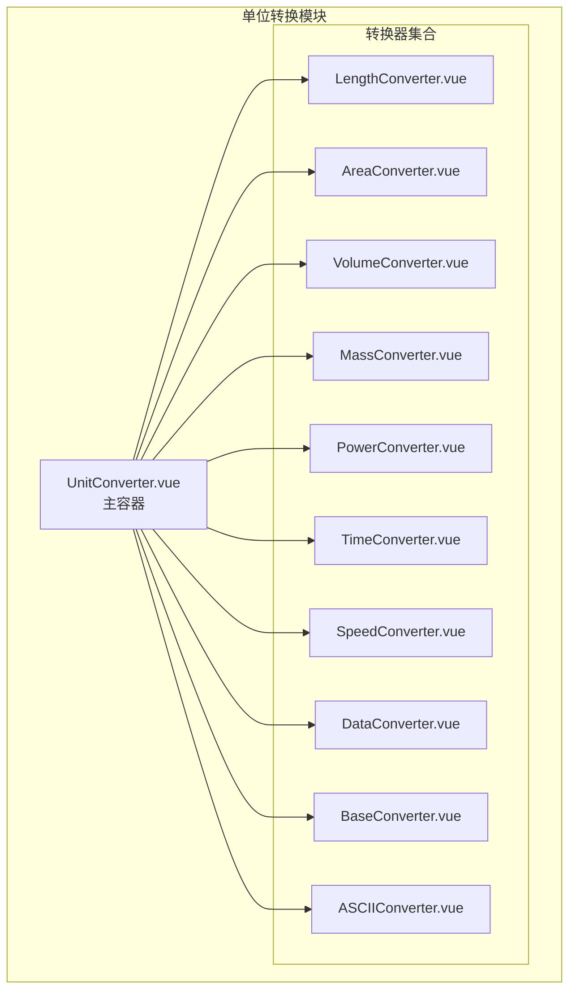
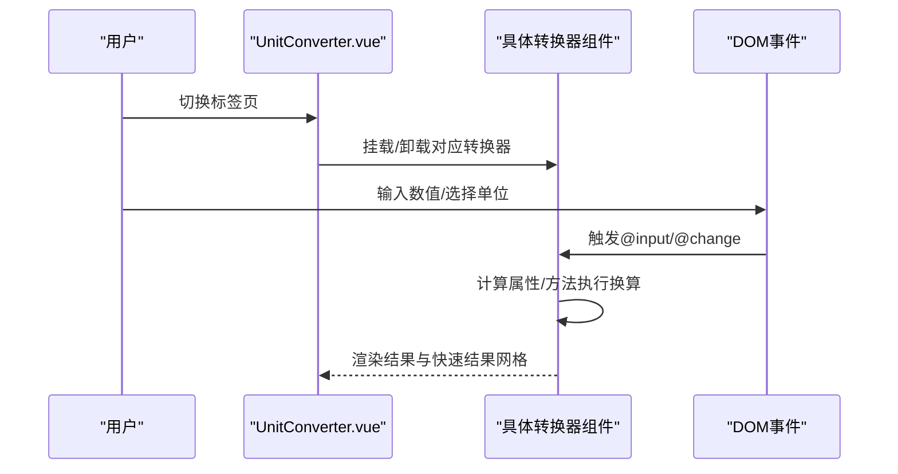
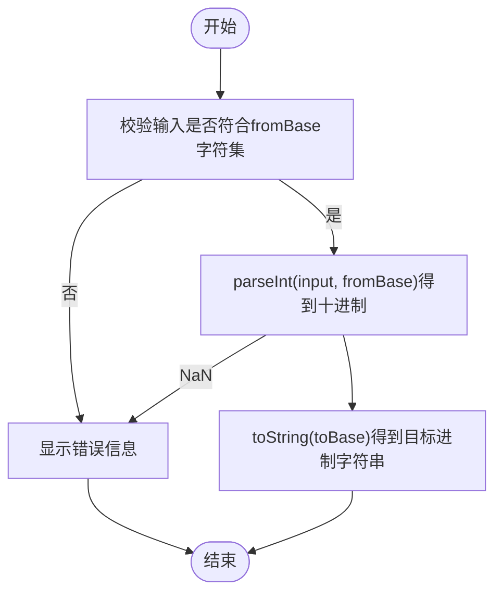
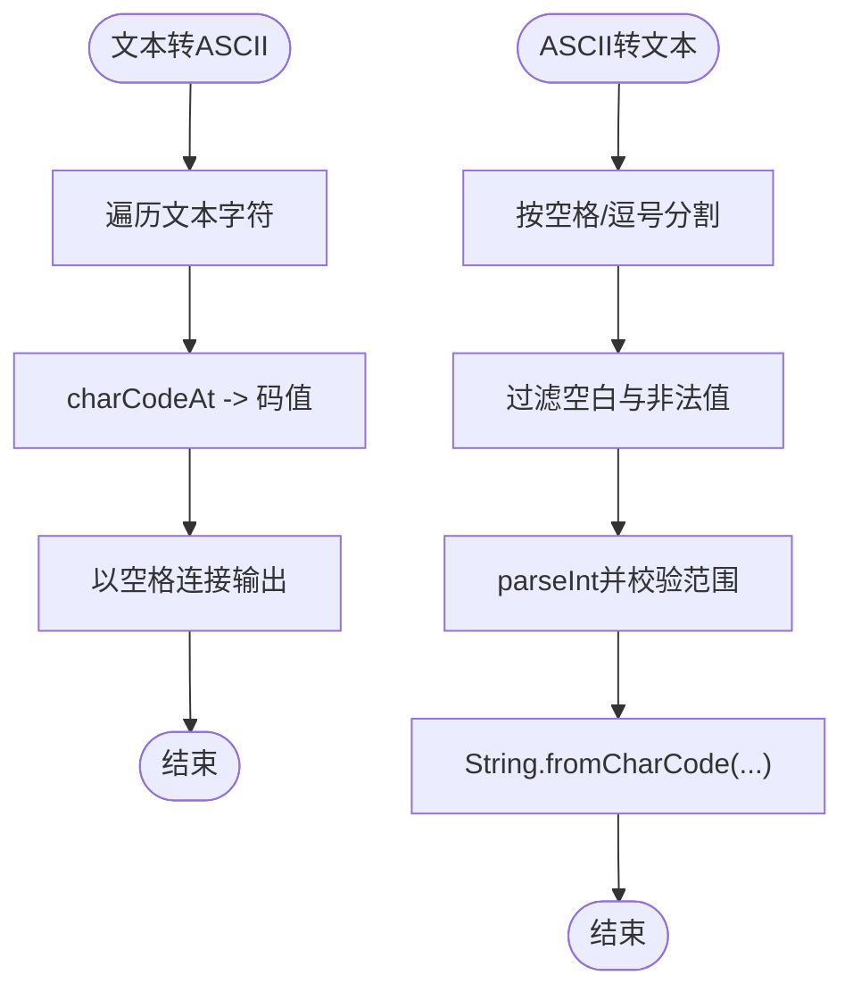
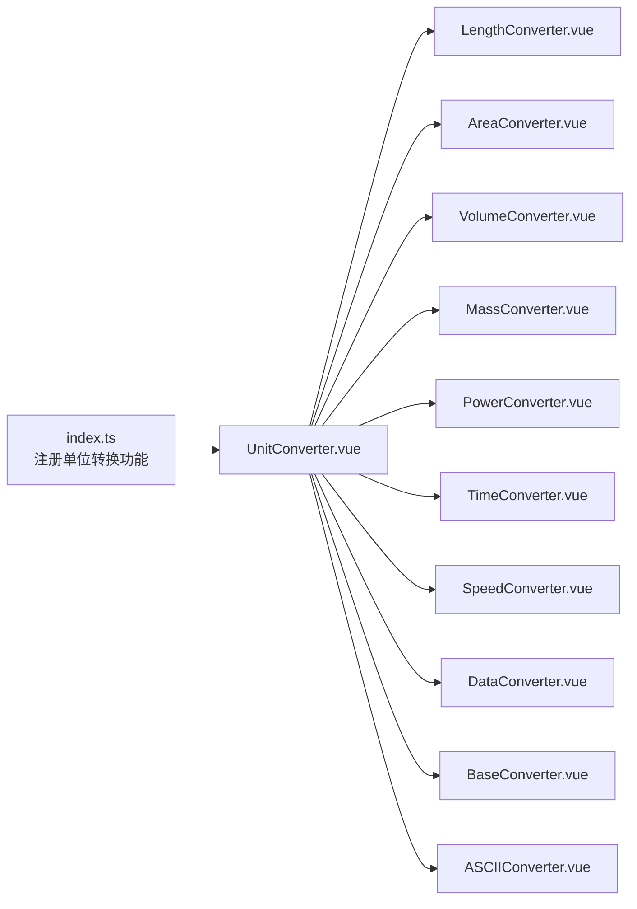

# 单位转换

<cite>
**本文引用的文件**
- [index.ts](file://src/features/unitConverter/index.ts)
- [UnitConverter.vue](file://src/features/unitConverter/UnitConverter.vue)
- [BaseConverter.vue](file://src/features/unitConverter/converters/BaseConverter.vue)
- [LengthConverter.vue](file://src/features/unitConverter/converters/LengthConverter.vue)
- [AreaConverter.vue](file://src/features/unitConverter/converters/AreaConverter.vue)
- [VolumeConverter.vue](file://src/features/unitConverter/converters/VolumeConverter.vue)
- [MassConverter.vue](file://src/features/unitConverter/converters/MassConverter.vue)
- [PowerConverter.vue](file://src/features/unitConverter/converters/PowerConverter.vue)
- [TimeConverter.vue](file://src/features/unitConverter/converters/TimeConverter.vue)
- [SpeedConverter.vue](file://src/features/unitConverter/converters/SpeedConverter.vue)
- [DataConverter.vue](file://src/features/unitConverter/converters/DataConverter.vue)
- [ASCIIConverter.vue](file://src/features/unitConverter/converters/ASCIIConverter.vue)
- [zh_CN.json](file://src/i18n/zh_CN.json)
- [settings.ts](file://src/config/settings.ts)
</cite>

## 目录
1. [简介](#简介)
2. [项目结构](#项目结构)
3. [核心组件](#核心组件)
4. [架构总览](#架构总览)
5. [详细组件分析](#详细组件分析)
6. [依赖关系分析](#依赖关系分析)
7. [性能与精度考量](#性能与精度考量)
8. [扩展新转换器指南](#扩展新转换器指南)
9. [常见问题与排障](#常见问题与排障)
10. [结论](#结论)

## 简介
本文件系统性梳理“单位转换”功能的设计与实现，覆盖以下目标：
- 列出并解释10个转换器及其换算原理
- 分析UnitConverter.vue作为主容器如何动态加载各专用转换器
- 解释输入验证、实时计算与单位选择逻辑
- 提供扩展新转换器的开发指南与UI集成步骤
- 讨论精度处理、浮点误差与用户体验优化（如输入防抖）
- 解决常见问题（如转换结果不准确、特定转换器无法加载）

## 项目结构
单位转换功能位于 src/features/unitConverter 目录下，采用“主容器 + 多个专用转换器”的分层设计：
- 主容器：UnitConverter.vue
- 专用转换器：LengthConverter.vue、AreaConverter.vue、VolumeConverter.vue、MassConverter.vue、PowerConverter.vue、TimeConverter.vue、SpeedConverter.vue、DataConverter.vue、BaseConverter.vue、ASCIIConverter.vue
- 注册入口：index.ts 将转换器以侧边栏 Dock 的形式挂载到插件系统

图表来源
- [UnitConverter.vue](file://src/features/unitConverter/UnitConverter.vue#L1-L167)
- [LengthConverter.vue](file://src/features/unitConverter/converters/LengthConverter.vue#L1-L221)
- [AreaConverter.vue](file://src/features/unitConverter/converters/AreaConverter.vue#L1-L221)
- [VolumeConverter.vue](file://src/features/unitConverter/converters/VolumeConverter.vue#L1-L229)
- [MassConverter.vue](file://src/features/unitConverter/converters/MassConverter.vue#L1-L226)
- [PowerConverter.vue](file://src/features/unitConverter/converters/PowerConverter.vue#L1-L227)
- [TimeConverter.vue](file://src/features/unitConverter/converters/TimeConverter.vue#L1-L226)
- [SpeedConverter.vue](file://src/features/unitConverter/converters/SpeedConverter.vue#L1-L226)
- [DataConverter.vue](file://src/features/unitConverter/converters/DataConverter.vue#L1-L229)
- [BaseConverter.vue](file://src/features/unitConverter/converters/BaseConverter.vue#L1-L294)
- [ASCIIConverter.vue](file://src/features/unitConverter/converters/ASCIIConverter.vue#L1-L377)

章节来源
- [index.ts](file://src/features/unitConverter/index.ts#L1-L43)
- [UnitConverter.vue](file://src/features/unitConverter/UnitConverter.vue#L1-L167)

## 核心组件
- UnitConverter.vue：提供标签页切换，按需渲染对应转换器；维护活动标签与国际化文案。
- 各转换器：统一采用“输入值 + 从单位 + 到单位 + 实时结果 + 快速结果网格”的UI模式，内部通过单位因子进行换算。
- BaseConverter.vue：提供多进制互转（2/8/10/16/32/36）与快速结果展示。
- ASCIIConverter.vue：提供文本与ASCII码双向转换、ASCII码表展示。

章节来源
- [UnitConverter.vue](file://src/features/unitConverter/UnitConverter.vue#L1-L167)
- [BaseConverter.vue](file://src/features/unitConverter/converters/BaseConverter.vue#L1-L294)
- [ASCIIConverter.vue](file://src/features/unitConverter/converters/ASCIIConverter.vue#L1-L377)

## 架构总览
UnitConverter.vue 作为主容器，通过标签页控制渲染不同的转换器组件。每个转换器内部使用单位因子（factor）进行换算，并通过计算属性实时输出结果。BaseConverter.vue 使用输入校验函数确保输入符合目标进制字符集；ASCIIConverter.vue 对文本与ASCII码进行双向解析与格式化。

图表来源
- [UnitConverter.vue](file://src/features/unitConverter/UnitConverter.vue#L1-L167)
- [LengthConverter.vue](file://src/features/unitConverter/converters/LengthConverter.vue#L1-L221)
- [BaseConverter.vue](file://src/features/unitConverter/converters/BaseConverter.vue#L1-L294)
- [ASCIIConverter.vue](file://src/features/unitConverter/converters/ASCIIConverter.vue#L1-L377)

## 详细组件分析

### 主容器：UnitConverter.vue
- 标签页管理：维护 tabs 数组与 activeTab，点击切换即渲染对应转换器。
- 国际化：接收 i18n 属性，用于标题与部分文案。
- 布局：头部标题 + 标签页区域 + 内容区域（按需渲染）。

章节来源
- [UnitConverter.vue](file://src/features/unitConverter/UnitConverter.vue#L1-L167)

### 转换器通用模式
- 输入：v-model 绑定输入值，@input 触发换算。
- 单位选择：两个 select 分别绑定 fromUnit 与 toUnit。
- 结果展示：实时计算属性 result 输出最终结果；快速结果网格展示其余单位的换算值。
- 单位因子：每个转换器内部维护 units 数组，包含 key、name、symbol、factor；换算采用“value × fromFactor ÷ toFactor”。

章节来源
- [LengthConverter.vue](file://src/features/unitConverter/converters/LengthConverter.vue#L1-L221)
- [AreaConverter.vue](file://src/features/unitConverter/converters/AreaConverter.vue#L1-L221)
- [VolumeConverter.vue](file://src/features/unitConverter/converters/VolumeConverter.vue#L1-L229)
- [MassConverter.vue](file://src/features/unitConverter/converters/MassConverter.vue#L1-L226)
- [PowerConverter.vue](file://src/features/unitConverter/converters/PowerConverter.vue#L1-L227)
- [TimeConverter.vue](file://src/features/unitConverter/converters/TimeConverter.vue#L1-L226)
- [SpeedConverter.vue](file://src/features/unitConverter/converters/SpeedConverter.vue#L1-L226)
- [DataConverter.vue](file://src/features/unitConverter/converters/DataConverter.vue#L1-L229)

### 进制转换：BaseConverter.vue
- 输入校验：isValidInput(value, base) 检查输入字符串是否仅由目标进制字符组成。
- 转换流程：先将输入按 fromBase 解析为十进制，再转为目标 toBase；异常时返回错误提示。
- 快速结果：遍历所有不同进制，展示转换后的结果。

图表来源
- [BaseConverter.vue](file://src/features/unitConverter/converters/BaseConverter.vue#L110-L161)

章节来源
- [BaseConverter.vue](file://src/features/unitConverter/converters/BaseConverter.vue#L1-L294)

### ASCII转换：ASCIIConverter.vue
- 文本转ASCII：遍历输入文本，逐字符调用 charCodeAt 获取十进制码，以空格拼接输出。
- ASCII转文本：按空格或逗号分割，过滤非数字与越界值，再用 String.fromCharCode 组合文本。
- ASCII码表：支持起止范围输入，计算十进制/十六进制/二进制/字符映射，特殊控制字符做友好显示。

图表来源
- [ASCIIConverter.vue](file://src/features/unitConverter/converters/ASCIIConverter.vue#L130-L162)

章节来源
- [ASCIIConverter.vue](file://src/features/unitConverter/converters/ASCIIConverter.vue#L1-L377)

### 各转换器的数学换算公式
以下为通用换算公式，适用于长度、面积、体积、质量、功率、时间、速度、数据存储等类型转换器：
- 通用公式：结果 = 输入值 × 从单位因子 ÷ 目标单位因子
- 单位因子由各转换器内部 units 数组提供，key 为单位标识，factor 为相对于基准单位的换算系数。

章节来源
- [LengthConverter.vue](file://src/features/unitConverter/converters/LengthConverter.vue#L90-L111)
- [AreaConverter.vue](file://src/features/unitConverter/converters/AreaConverter.vue#L90-L111)
- [VolumeConverter.vue](file://src/features/unitConverter/converters/VolumeConverter.vue#L108-L118)
- [MassConverter.vue](file://src/features/unitConverter/converters/MassConverter.vue#L105-L115)
- [PowerConverter.vue](file://src/features/unitConverter/converters/PowerConverter.vue#L106-L116)
- [TimeConverter.vue](file://src/features/unitConverter/converters/TimeConverter.vue#L105-L115)
- [SpeedConverter.vue](file://src/features/unitConverter/converters/SpeedConverter.vue#L105-L115)
- [DataConverter.vue](file://src/features/unitConverter/converters/DataConverter.vue#L108-L118)

## 依赖关系分析
- UnitConverter.vue 依赖各转换器组件并在标签页切换时动态渲染。
- 各转换器组件共享相同的输入/选择/结果/快速结果布局与换算逻辑。
- BaseConverter.vue 与 ASCIIConverter.vue 采用独立的校验与转换策略。
- 注册入口 index.ts 将 UnitConverter 作为插件的右侧停靠面板，注入 i18n 与容器。

图表来源
- [index.ts](file://src/features/unitConverter/index.ts#L1-L43)
- [UnitConverter.vue](file://src/features/unitConverter/UnitConverter.vue#L1-L167)

章节来源
- [index.ts](file://src/features/unitConverter/index.ts#L1-L43)
- [UnitConverter.vue](file://src/features/unitConverter/UnitConverter.vue#L1-L167)

## 性能与精度考量
- 浮点精度：各转换器在 formatResult 中对极小/极大/常规数值采用不同格式化策略，避免科学计数法与多余尾随零，提升可读性。
- 计算开销：换算为纯数值运算，复杂度 O(1)，对大多数场景足够高效。
- UI响应：使用 v-model + 计算属性，输入变更即时触发换算，无需额外防抖；若未来需要优化，可在输入事件上增加节流/防抖策略。

章节来源
- [LengthConverter.vue](file://src/features/unitConverter/converters/LengthConverter.vue#L112-L120)
- [AreaConverter.vue](file://src/features/unitConverter/converters/AreaConverter.vue#L112-L120)
- [VolumeConverter.vue](file://src/features/unitConverter/converters/VolumeConverter.vue#L120-L128)
- [MassConverter.vue](file://src/features/unitConverter/converters/MassConverter.vue#L117-L125)
- [PowerConverter.vue](file://src/features/unitConverter/converters/PowerConverter.vue#L118-L126)
- [TimeConverter.vue](file://src/features/unitConverter/converters/TimeConverter.vue#L118-L124)
- [SpeedConverter.vue](file://src/features/unitConverter/converters/SpeedConverter.vue#L117-L125)
- [DataConverter.vue](file://src/features/unitConverter/converters/DataConverter.vue#L120-L128)

## 扩展新转换器指南
- 新建组件：在 converters 目录新增 MyConverter.vue，遵循现有模式（输入 + 选择 + 结果 + 快速结果网格）。
- 定义单位数组：units 数组包含 key、name、symbol、factor；factor 以某个基准单位为参考。
- 实现换算：实现 convertToUnit(targetUnit) 与 getUnitFactor(key)；在 result 计算属性中调用 convertToUnit(toUnit)。
- 格式化结果：formatResult(value) 可复用现有策略，或根据业务需求定制。
- 注册到主容器：在 UnitConverter.vue 的 tabs 中添加新标签项，并在内容区域添加 v-if 条件渲染。
- 国际化：在 zh_CN.json 中补充相关 i18n 键值，或复用现有键名。
- 注册到插件：在 index.ts 中导入新组件并在主容器中按需渲染。

章节来源
- [UnitConverter.vue](file://src/features/unitConverter/UnitConverter.vue#L1-L167)
- [zh_CN.json](file://src/i18n/zh_CN.json#L152-L166)
- [index.ts](file://src/features/unitConverter/index.ts#L1-L43)

## 常见问题与排障
- 转换结果不准确
  - 检查单位因子是否正确；确认 fromUnit 与 toUnit 选择无误。
  - 注意浮点误差：对极小/极大数值采用 formatResult 的格式化策略，避免直接比较相等。
- 特定转换器无法加载
  - 确认 index.ts 已将 UnitConverter 注册为右侧停靠面板。
  - 确认 UnitConverter.vue 已导入并按需渲染对应组件。
- BaseConverter 进制输入错误
  - 确保输入字符串仅包含目标进制允许的字符；非法字符会触发错误提示。
- ASCII 转换异常
  - ASCII 转文本时，确保输入为十进制码且在 0-127 范围内；逗号/空格分隔均可。
- 国际化文案缺失
  - 在 zh_CN.json 中补充相应 i18n 键值，或复用现有键名。

章节来源
- [BaseConverter.vue](file://src/features/unitConverter/converters/BaseConverter.vue#L110-L161)
- [ASCIIConverter.vue](file://src/features/unitConverter/converters/ASCIIConverter.vue#L145-L162)
- [UnitConverter.vue](file://src/features/unitConverter/UnitConverter.vue#L1-L167)
- [index.ts](file://src/features/unitConverter/index.ts#L1-L43)
- [zh_CN.json](file://src/i18n/zh_CN.json#L152-L166)

## 结论
单位转换模块以清晰的主容器 + 多转换器模式组织，具备良好的可扩展性与一致性。通过单位因子驱动的换算机制、统一的UI与格式化策略，实现了跨长度、面积、体积、质量、功率、时间、速度、数据存储、进制与ASCII的完整覆盖。建议后续引入输入防抖、更完善的错误边界提示与单元测试，以进一步提升稳定性与用户体验。