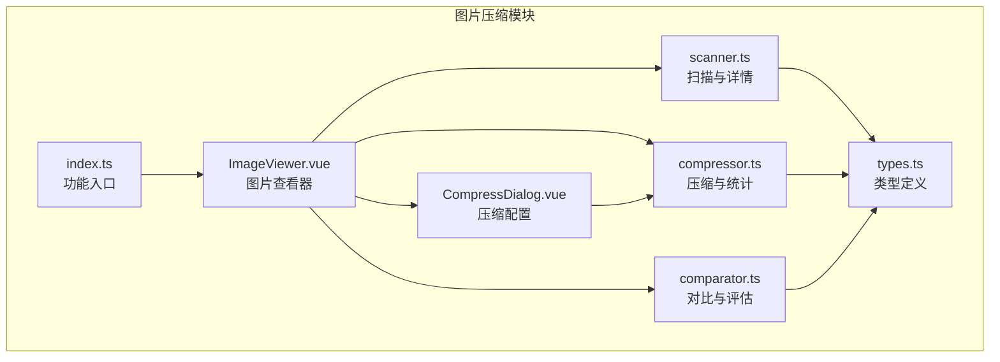
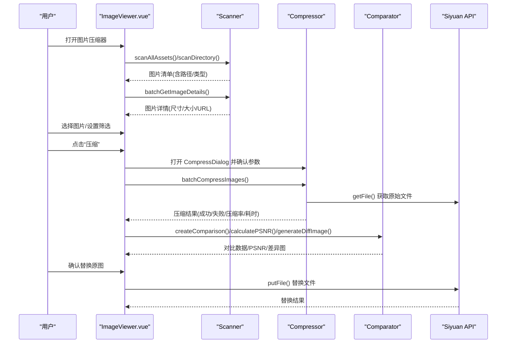
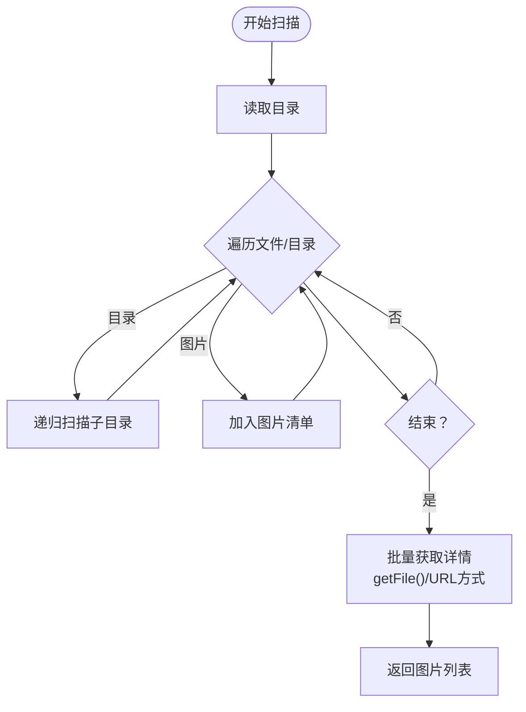
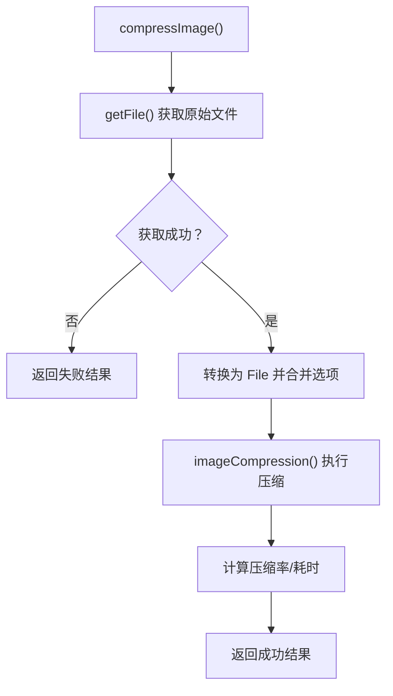
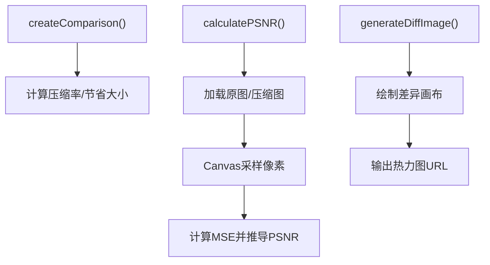
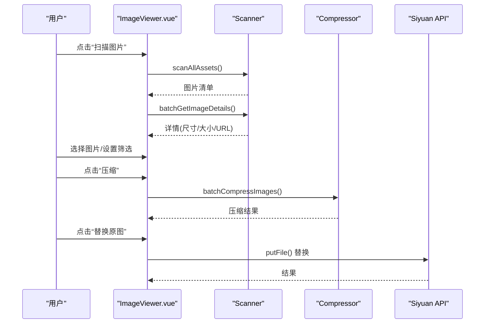
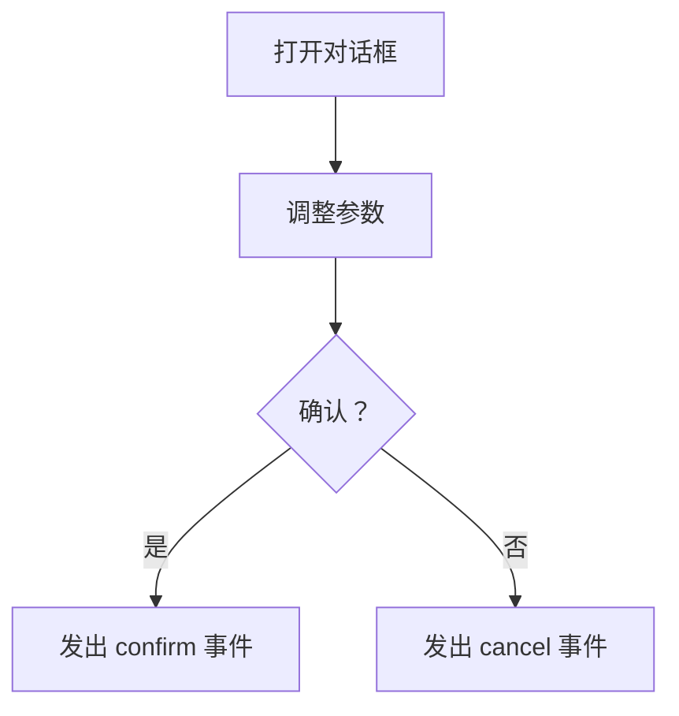
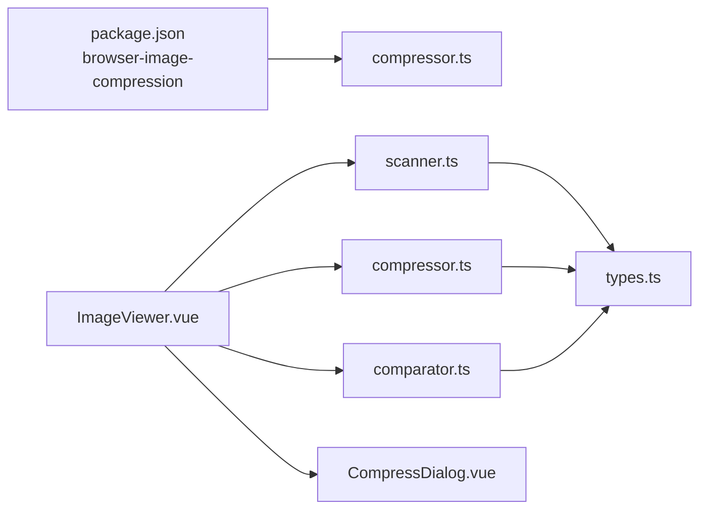

# 图片压缩

<cite>
**本文引用的文件**
- [scanner.ts](file://src/features/imageCompressor/scanner.ts)
- [compressor.ts](file://src/features/imageCompressor/compressor.ts)
- [comparator.ts](file://src/features/imageCompressor/comparator.ts)
- [ImageViewer.vue](file://src/features/imageCompressor/ImageViewer.vue)
- [CompressDialog.vue](file://src/features/imageCompressor/CompressDialog.vue)
- [types.ts](file://src/features/imageCompressor/types.ts)
- [index.ts](file://src/features/imageCompressor/index.ts)
- [README.md](file://src/features/imageCompressor/README.md)
- [TESTING.md](file://src/features/imageCompressor/TESTING.md)
- [package.json](file://package.json)
</cite>

## 目录
1. [简介](#简介)
2. [项目结构](#项目结构)
3. [核心组件](#核心组件)
4. [架构总览](#架构总览)
5. [详细组件分析](#详细组件分析)
6. [依赖关系分析](#依赖关系分析)
7. [性能与基准](#性能与基准)
8. [故障排查](#故障排查)
9. [结论](#结论)
10. [附录](#附录)

## 简介
本文件面向“图片压缩”功能，覆盖从文件扫描、压缩执行、对比评估到批量操作与预览的完整流程。重点说明：
- scanner.ts 如何递归遍历思源笔记 data/assets 目录，识别待压缩图片并获取尺寸与大小；
- compressor.ts 采用的压缩算法与质量控制参数（基于 browser-image-compression），以及替换原图的实现；
- comparator.ts 提供的压缩前后对比能力（压缩率、PSNR、差异热力图）；
- CompressDialog.vue 的批量操作界面与 ImageViewer.vue 的预览与管理功能；
- 性能基准与最佳实践建议；
- 常见问题与排错指引。

## 项目结构
图片压缩功能位于 src/features/imageCompressor 目录，包含以下关键文件：
- scanner.ts：扫描与详情获取
- compressor.ts：压缩引擎与统计
- comparator.ts：对比与评估
- ImageViewer.vue：图片查看器与批量操作
- CompressDialog.vue：压缩参数配置对话框
- types.ts：类型定义
- index.ts：功能入口（注册命令）
- README.md / TESTING.md：功能说明与测试指南
- package.json：依赖 browser-image-compression

图表来源
- [scanner.ts](file://src/features/imageCompressor/scanner.ts#L1-L228)
- [compressor.ts](file://src/features/imageCompressor/compressor.ts#L1-L227)
- [comparator.ts](file://src/features/imageCompressor/comparator.ts#L1-L254)
- [ImageViewer.vue](file://src/features/imageCompressor/ImageViewer.vue#L1-L1218)
- [CompressDialog.vue](file://src/features/imageCompressor/CompressDialog.vue#L1-L349)
- [types.ts](file://src/features/imageCompressor/types.ts#L1-L75)
- [index.ts](file://src/features/imageCompressor/index.ts#L1-L31)

章节来源
- [README.md](file://src/features/imageCompressor/README.md#L1-L169)
- [package.json](file://package.json#L1-L46)

## 核心组件
- 扫描器（scanner.ts）
  - 递归扫描 data/assets 目录，识别图片并收集基础元信息；
  - 通过 API 获取文件 Blob 或直接 URL 方式获取尺寸与大小；
  - 支持批量获取详情并提供进度回调。
- 压缩引擎（compressor.ts）
  - 基于 browser-image-compression 库进行压缩；
  - 默认配置：最大 1MB、最大宽高 1920px、质量 0.8、使用 Web Worker；
  - 提供单张/批量压缩、替换原图、统计汇总。
- 对比器（comparator.ts）
  - 计算压缩率、节省空间；
  - 基于 Canvas 的 PSNR 评估与差异热力图生成。
- 界面（ImageViewer.vue / CompressDialog.vue）
  - ImageViewer 提供扫描、筛选、分页、选择、压缩、结果统计、替换原图；
  - CompressDialog 提供压缩质量、最大文件大小、最大宽高等参数配置与预估耗时。
- 类型（types.ts）
  - ImageInfo、CompressOptions、CompressResult、ImageComparison、ScanProgress 等。
- 入口（index.ts）
  - 注册快捷命令打开图片压缩器。

章节来源
- [scanner.ts](file://src/features/imageCompressor/scanner.ts#L1-L228)
- [compressor.ts](file://src/features/imageCompressor/compressor.ts#L1-L227)
- [comparator.ts](file://src/features/imageCompressor/comparator.ts#L1-L254)
- [ImageViewer.vue](file://src/features/imageCompressor/ImageViewer.vue#L1-L1218)
- [CompressDialog.vue](file://src/features/imageCompressor/CompressDialog.vue#L1-L349)
- [types.ts](file://src/features/imageCompressor/types.ts#L1-L75)
- [index.ts](file://src/features/imageCompressor/index.ts#L1-L31)

## 架构总览
整体流程：扫描资产目录 → 获取图片详情 → 用户选择 → 配置压缩参数 → 批量压缩 → 结果统计 → 替换原图。

图表来源
- [ImageViewer.vue](file://src/features/imageCompressor/ImageViewer.vue#L346-L508)
- [scanner.ts](file://src/features/imageCompressor/scanner.ts#L36-L109)
- [compressor.ts](file://src/features/imageCompressor/compressor.ts#L81-L162)
- [comparator.ts](file://src/features/imageCompressor/comparator.ts#L1-L166)

## 详细组件分析

### 扫描器（scanner.ts）
- 支持的图片扩展名与 MIME 类型判断；
- 递归扫描目录，对子目录递归调用，对图片文件构造 ImageInfo；
- 两套详情获取策略：
  - 通过 API 获取 Blob，再转为对象 URL，使用 Image 加载获取尺寸；
  - 若失败则尝试直接 URL（/assets/...）方式，同样获取尺寸；
- 批量获取详情，带进度回调；
- 提供按路径获取尺寸的内部方法，支持可选释放 URL。

图表来源
- [scanner.ts](file://src/features/imageCompressor/scanner.ts#L36-L109)
- [scanner.ts](file://src/features/imageCompressor/scanner.ts#L111-L228)

章节来源
- [scanner.ts](file://src/features/imageCompressor/scanner.ts#L1-L228)

### 压缩引擎（compressor.ts）
- 默认压缩参数：最大 1MB、最大宽高 1920px、质量 0.8、使用 Web Worker；
- 单张压缩流程：
  - 通过 API 获取原始 Blob，转换为 File；
  - 合并默认与用户选项；
  - 调用 browser-image-compression 执行压缩；
  - 计算压缩率、耗时，返回结果对象；
- 批量压缩：逐张压缩并提供进度回调；
- 替换原图：putFile 原地写入，保持文件名不变；
- 批量替换：统计成功/失败；
- 统计汇总：计算总数、成功数、失败数、总原始/压缩大小、节省大小、平均压缩率。

图表来源
- [compressor.ts](file://src/features/imageCompressor/compressor.ts#L22-L79)
- [compressor.ts](file://src/features/imageCompressor/compressor.ts#L81-L162)
- [compressor.ts](file://src/features/imageCompressor/compressor.ts#L164-L227)

章节来源
- [compressor.ts](file://src/features/imageCompressor/compressor.ts#L1-L227)

### 对比器（comparator.ts）
- 压缩率与节省空间计算；
- PSNR 评估：
  - 使用两个 Image 异步加载原图与压缩图；
  - 通过 Canvas 绘制并采样像素，计算 MSE，再推导 PSNR；
  - 限定采样尺寸上限以提升性能；
- 差异热力图：
  - 生成差异画布，按 RGB 差异阈值映射为绿色/黄色/红色；
  - 输出 PNG 数据 URL；
- 质量评级：根据 PSNR 数值给出等级。

图表来源
- [comparator.ts](file://src/features/imageCompressor/comparator.ts#L1-L166)
- [comparator.ts](file://src/features/imageCompressor/comparator.ts#L167-L254)

章节来源
- [comparator.ts](file://src/features/imageCompressor/comparator.ts#L1-L254)

### ImageViewer.vue（图片查看器与批量操作）
- 扫描与详情：scanAllAssets + batchGetImageDetails，双阶段进度；
- 列表与筛选：按最小文件大小过滤；分页与全选/取消全选；
- 压缩流程：打开 CompressDialog，确认参数后批量压缩，显示统计；
- 替换原图：确认后批量 putFile，清理结果并更新列表；
- 预览：点击图片卡片弹出预览对话框；
- 文档定位：从图片名提取 docId 或通过 SQL 查询引用文档。

图表来源
- [ImageViewer.vue](file://src/features/imageCompressor/ImageViewer.vue#L346-L508)
- [scanner.ts](file://src/features/imageCompressor/scanner.ts#L36-L109)
- [compressor.ts](file://src/features/imageCompressor/compressor.ts#L81-L162)

章节来源
- [ImageViewer.vue](file://src/features/imageCompressor/ImageViewer.vue#L1-L1218)

### CompressDialog.vue（压缩参数配置）
- 参数项：压缩质量、最大文件大小、最大宽高、Web Worker；
- 预估耗时：基于选中数量粗略估算；
- 发出 confirm/cancel 事件，由父组件接收并执行压缩。

图表来源
- [CompressDialog.vue](file://src/features/imageCompressor/CompressDialog.vue#L1-L143)

章节来源
- [CompressDialog.vue](file://src/features/imageCompressor/CompressDialog.vue#L1-L349)

### 类型定义（types.ts）
- ImageInfo：路径、名称、大小、尺寸、类型、最后修改时间、预览 URL；
- CompressOptions：最大文件大小、最大宽高、质量、Web Worker、输出类型；
- CompressResult：成功标志、原始文件、压缩后 Blob/大小、错误、压缩率、耗时；
- ImageComparison：原图、压缩后信息、压缩率、节省大小；
- ScanProgress/CompressProgress：扫描/压缩进度。

章节来源
- [types.ts](file://src/features/imageCompressor/types.ts#L1-L75)

### 功能入口（index.ts）
- 注册快捷命令，打开图片压缩器并通过自定义事件触发 UI。

章节来源
- [index.ts](file://src/features/imageCompressor/index.ts#L1-L31)

## 依赖关系分析
- 外部库：browser-image-compression（压缩核心）、SiYuan 插件 API（文件读写）；
- 内部模块：scanner/compressor/comparator/ImageViewer/CompressDialog/types；
- 依赖关系图：

图表来源
- [package.json](file://package.json#L1-L46)
- [compressor.ts](file://src/features/imageCompressor/compressor.ts#L1-L20)
- [ImageViewer.vue](file://src/features/imageCompressor/ImageViewer.vue#L1-L120)
- [scanner.ts](file://src/features/imageCompressor/scanner.ts#L1-L20)
- [comparator.ts](file://src/features/imageCompressor/comparator.ts#L1-L10)
- [types.ts](file://src/features/imageCompressor/types.ts#L1-L20)

章节来源
- [package.json](file://package.json#L1-L46)

## 性能与基准
- 压缩算法与并行：
  - 使用 browser-image-compression，默认启用 Web Worker，避免阻塞主线程；
  - 批量处理提供进度回调，便于 UI 响应。
- 性能基准（来自测试文档）：
  - 10 张：约 12–18 秒；
  - 50 张：约 1–2 分钟；
  - 100 张：约 2.5–4 分钟。
- 压缩效果参考（来自测试文档）：
  - 高清照片：原始 5MB → 压缩后 1.2MB（压缩率 76%，质量 优秀）；
  - 截图：原始 800KB → 压缩后 250KB（压缩率 69%，质量 良好）；
  - 图标：原始 100KB → 压缩后 30KB（压缩率 70%，质量 优秀）。
- 最佳实践（来自测试文档）：
  - 定期压缩（建议每月）；
  - 重要图片使用 85–90% 质量；
  - 分类处理（按大小/用途）；
  - 压缩前备份重要图片；
  - 验证结果后再替换原图；
  - 分批处理（建议每次不超过 100 张），开启 Web Worker。

章节来源
- [TESTING.md](file://src/features/imageCompressor/TESTING.md#L289-L320)
- [compressor.ts](file://src/features/imageCompressor/compressor.ts#L1-L20)
- [ImageViewer.vue](file://src/features/imageCompressor/ImageViewer.vue#L418-L508)

## 故障排查
- 扫描不到图片
  - 检查 data/assets 目录是否存在、权限是否足够、思源笔记是否正常运行；
  - 查看控制台错误日志。
- 压缩失败
  - 图片损坏、格式不支持、内存不足；
  - 单张测试定位问题，降低批处理数量。
- 替换失败
  - 文件被占用、权限不足、磁盘空间不足；
  - 关闭占用程序、检查磁盘空间、查看错误提示。
- 界面卡顿
  - 图片数量过多、未开启 Web Worker、浏览器性能限制；
  - 分批处理、开启 Web Worker、减少同时处理数量。
- 压缩后图片失真
  - 调整压缩质量（建议 80% 作为平衡点），必要时提高最大宽高；
  - 注意 GIF 动图会被转为静态图，透明 PNG 转 JPEG 会丢失透明度。
- 文件路径错误
  - 确保使用 /data/assets/... 路径扫描，URL 方案会自动转换为 /assets/...；
  - 若跨域导致加载失败，注意 crossOrigin 设置。

章节来源
- [TESTING.md](file://src/features/imageCompressor/TESTING.md#L239-L320)
- [scanner.ts](file://src/features/imageCompressor/scanner.ts#L111-L178)
- [comparator.ts](file://src/features/imageCompressor/comparator.ts#L43-L101)

## 结论
图片压缩功能以清晰的模块划分实现了从扫描、压缩、对比到批量替换的完整闭环。通过 browser-image-compression 与 Web Worker 的结合，兼顾了性能与用户体验；通过 PSNR 与差异热力图提供了可视化的质量评估手段；UI 层提供直观的筛选、分页与预览能力。建议在生产环境中遵循“先备份、后替换”的原则，并根据图片类型与用途合理设置压缩参数。

## 附录
- 快捷键：Ctrl+Alt+C 打开图片压缩器；
- 压缩参数默认值：最大 1MB、最大宽高 1920px、质量 0.8、启用 Web Worker；
- 已知限制：GIF 动图转静态、透明 PNG 转 JPEG 丢失透明度、大批量处理可能内存压力较大。

章节来源
- [README.md](file://src/features/imageCompressor/README.md#L118-L169)
- [index.ts](file://src/features/imageCompressor/index.ts#L1-L31)
- [compressor.ts](file://src/features/imageCompressor/compressor.ts#L1-L20)