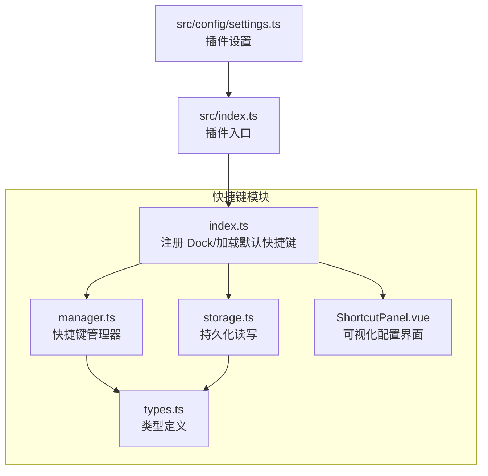
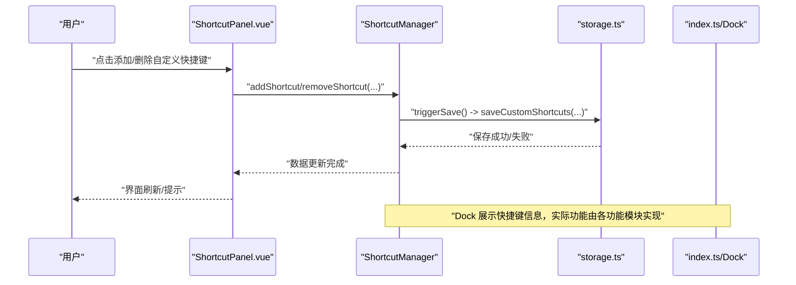
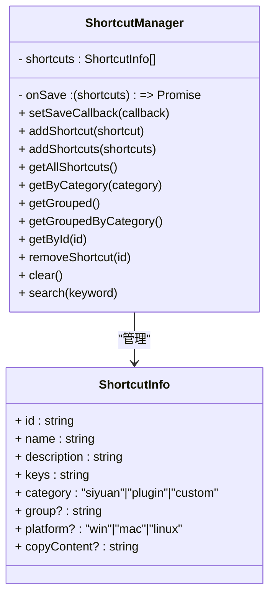
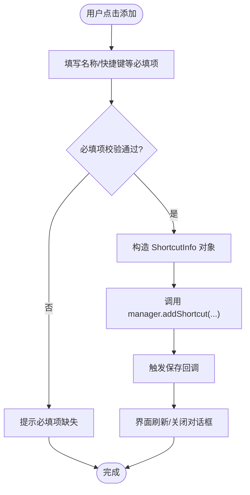
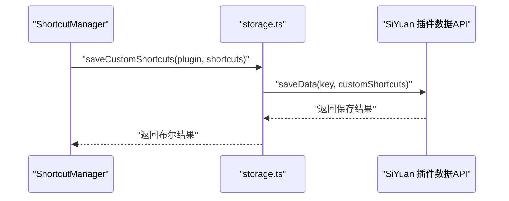
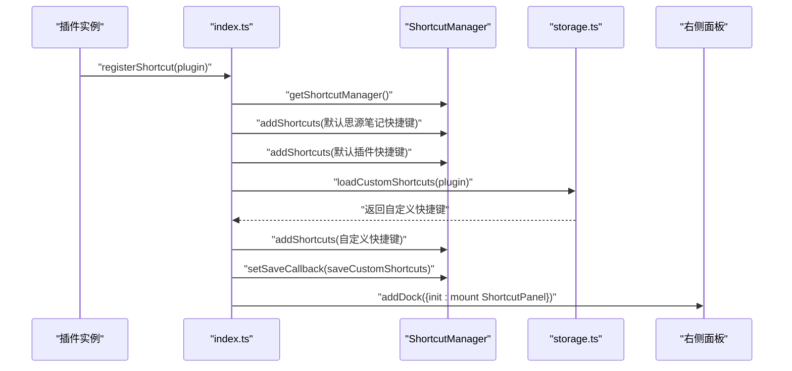
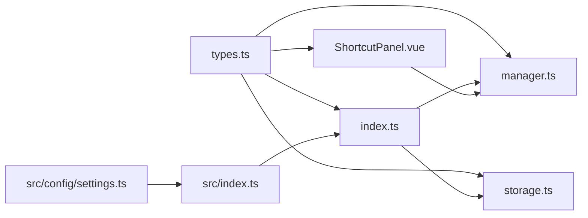
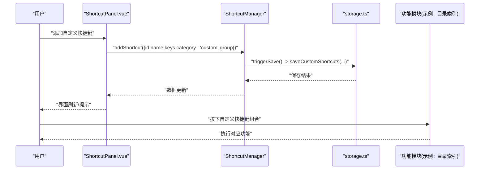

# 快捷键管理

<cite>
**本文引用的文件**
- [manager.ts](file://src/features/shortcut/manager.ts)
- [storage.ts](file://src/features/shortcut/storage.ts)
- [ShortcutPanel.vue](file://src/features/shortcut/ShortcutPanel.vue)
- [types.ts](file://src/features/shortcut/types.ts)
- [index.ts](file://src/features/shortcut/index.ts)
- [README.md](file://src/features/shortcut/README.md)
- [USAGE_GUIDE.md](file://src/features/shortcut/USAGE_GUIDE.md)
- [src/index.ts](file://src/index.ts)
- [src/config/settings.ts](file://src/config/settings.ts)
- [spec.md](file://openspec/changes/archive/2025-12-07-add-tool-shortcut-copy/specs/shortcut-copy/spec.md)
</cite>

## 更新摘要
**变更内容**
- 更新了快捷键面板的界面功能，新增网格布局、三列视图和列表视图切换
- 添加了统计信息栏，显示快捷键总数、收藏数和自定义数量
- 增强了过滤功能，支持分类搜索、快捷筛选（全部/收藏/最近使用）
- 新增导入导出功能，支持JSON和Markdown格式
- 扩展了复制功能，支持工具特定内容复制（如npm、vscode等命令）
- 添加了Claude Code快捷键分类支持
- 更新了相关架构图和组件分析以反映最新变更

## 目录
1. [简介](#简介)
2. [项目结构](#项目结构)
3. [核心组件](#核心组件)
4. [架构总览](#架构总览)
5. [详细组件分析](#详细组件分析)
6. [依赖关系分析](#依赖关系分析)
7. [性能考量](#性能考量)
8. [故障排查指南](#故障排查指南)
9. [结论](#结论)
10. [附录](#附录)

## 简介
本文件围绕“快捷键管理”功能，系统梳理从用户绑定自定义快捷键到触发对应功能的完整链路，重点解析以下方面：
- manager.ts 中的快捷键注册、查询与持久化回调机制
- storage.ts 如何持久化保存用户自定义快捷键配置
- ShortcutPanel.vue 提供的可视化配置界面实现
- 从用户绑定快捷键到触发对应功能的事件流示例
- 浏览器快捷键冲突的处理策略与跨平台兼容性考虑
- 高级用例：组合键支持与上下文敏感快捷键
- 常见问题与调试方法

本次更新重点优化快捷键面板功能与界面，新增网格布局、统计栏、过滤功能、导入导出和Claude Code快捷键支持。

## 项目结构
快捷键模块位于 features/shortcut 目录，核心文件包括：
- types.ts：定义快捷键数据结构与分类
- manager.ts：快捷键管理器，负责增删查改、分组、搜索与保存回调
- storage.ts：基于插件数据 API 的持久化读写
- index.ts：模块入口，注册 Dock、加载默认快捷键、设置保存回调
- ShortcutPanel.vue：可视化配置界面，支持搜索、分类、分组、添加/删除自定义快捷键
- README.md/USAGE_GUIDE.md：模块说明与使用指南

图表来源
- [index.ts](file://src/features/shortcut/index.ts#L1-L41)
- [manager.ts](file://src/features/shortcut/manager.ts#L1-L197)
- [storage.ts](file://src/features/shortcut/storage.ts#L1-L67)
- [ShortcutPanel.vue](file://src/features/shortcut/ShortcutPanel.vue#L1-L120)
- [types.ts](file://src/features/shortcut/types.ts#L1-L44)
- [src/index.ts](file://src/index.ts#L80-L106)
- [src/config/settings.ts](file://src/config/settings.ts#L1-L50)

章节来源
- [README.md](file://src/features/shortcut/README.md#L1-L363)
- [USAGE_GUIDE.md](file://src/features/shortcut/USAGE_GUIDE.md#L1-L329)

## 核心组件
- 类型定义（types.ts）
  - 定义快捷键分类、快捷键信息、分组结构与管理器配置
  - 支持平台限制字段，便于跨平台兼容
  - 新增 copyContent 字段，支持工具特定内容复制
- 快捷键管理器（manager.ts）
  - 提供添加、批量添加、查询、分组、搜索、删除、清空、重置等能力
  - 内置保存回调触发机制，便于与持久化层解耦
- 持久化存储（storage.ts）
  - 基于插件数据 API 的读写，仅保存 category 为 custom 的快捷键
  - 提供加载、保存、清空接口
- 模块入口（index.ts）
  - 初始化管理器、加载默认快捷键（思源笔记与插件）、注册 Dock
  - 设置保存回调，将变更写入存储
- 可视化界面（ShortcutPanel.vue）
  - 支持搜索、分类切换、分组显示、添加/删除自定义快捷键
  - 新增网格布局、统计栏、过滤功能、导入导出
  - 支持工具特定内容复制（npm、vscode等）
  - 与管理器交互，实时反映数据变化

章节来源
- [types.ts](file://src/features/shortcut/types.ts#L1-L44)
- [manager.ts](file://src/features/shortcut/manager.ts#L1-L197)
- [storage.ts](file://src/features/shortcut/storage.ts#L1-L67)
- [index.ts](file://src/features/shortcut/index.ts#L1-L41)
- [ShortcutPanel.vue](file://src/features/shortcut/ShortcutPanel.vue#L1-L120)

## 架构总览
快捷键模块采用“数据层-界面层-持久化层”的分层设计：
- 数据层：manager.ts 提供统一的数据访问与管理
- 界面层：ShortcutPanel.vue 提供用户交互与展示
- 持久化层：storage.ts 通过插件数据 API 实现自定义快捷键的保存与加载
- 入口层：index.ts 负责初始化、加载默认数据、注册 Dock、设置保存回调

图表来源
- [ShortcutPanel.vue](file://src/features/shortcut/ShortcutPanel.vue#L211-L236)
- [manager.ts](file://src/features/shortcut/manager.ts#L22-L37)
- [storage.ts](file://src/features/shortcut/storage.ts#L33-L67)
- [index.ts](file://src/features/shortcut/index.ts#L32-L41)

## 详细组件分析

### 快捷键管理器（manager.ts）
- 职责
  - 维护快捷键列表，提供增删查改、分组、搜索、清空等方法
  - 通过 setSaveCallback 注入保存回调，实现与持久化层解耦
- 关键点
  - addShortcut/addShortcuts：若 id 已存在则覆盖；完成后触发保存回调
  - search：大小写不敏感，按 name/description/keys 匹配
  - getGrouped/getGroupedByCategory：按 group/category 组织数据，便于 UI 展示
  - removeShortcut：删除后触发保存回调
  - getShortcutManager：全局单例，保证多处使用的一致性
- 复杂度
  - add/remove/search 基于数组遍历，时间复杂度 O(n)，n 为快捷键数量
  - 分组操作为 O(n) 遍历与 Map 操作
- 错误处理
  - 保存回调异常会记录错误日志，不影响 UI 交互

图表来源
- [manager.ts](file://src/features/shortcut/manager.ts#L1-L197)
- [types.ts](file://src/features/shortcut/types.ts#L1-L44)

章节来源
- [manager.ts](file://src/features/shortcut/manager.ts#L1-L197)

### 可视化配置界面（ShortcutPanel.vue）
- 功能
  - 顶部搜索框：实时过滤快捷键
  - 分类标签：全部/思源笔记/插件/自定义/Claude Code等
  - 分类搜索：支持搜索分类名称
  - 分组显示：按 group 组织
  - 视图模式：支持网格、三列、列表三种视图切换
  - 统计信息栏：显示总计、收藏、自定义数量
  - 快捷筛选：支持全部/收藏/最近使用筛选
  - 添加对话框：填写名称、描述、快捷键、分组，提交后调用 manager.addShortcut
  - 删除按钮：仅对 category 为 custom 的快捷键显示
  - 复制功能：优先复制 copyContent（如npm命令），否则复制快捷键组合
  - 导入导出：支持JSON和Markdown格式的导入导出
  - 收藏功能：支持收藏快捷键
  - 工具标签：对特定工具（npm、vscode等）显示工具标识
- 交互流程
  - 用户点击“添加”，填写必填项后提交
  - 调用 manager.addShortcut，随后关闭对话框
  - 若删除，调用 manager.removeShortcut，确认后删除

图表来源
- [ShortcutPanel.vue](file://src/features/shortcut/ShortcutPanel.vue#L196-L236)
- [manager.ts](file://src/features/shortcut/manager.ts#L22-L37)

章节来源
- [ShortcutPanel.vue](file://src/features/shortcut/ShortcutPanel.vue#L1-L297)

### 持久化存储（storage.ts）
- 设计
  - 仅保存 category 为 custom 的快捷键，避免污染默认数据
  - 使用插件数据 API 的 loadData/saveData 实现持久化
- 接口
  - loadCustomShortcuts：加载自定义快捷键
  - saveCustomShortcuts：保存自定义快捷键
  - clearCustomShortcuts：清空自定义快捷键
- 注意
  - 该模块仅处理自定义快捷键的持久化，不参与默认快捷键的存储

图表来源
- [storage.ts](file://src/features/shortcut/storage.ts#L33-L67)
- [manager.ts](file://src/features/shortcut/manager.ts#L22-L37)

章节来源
- [storage.ts](file://src/features/shortcut/storage.ts#L1-L67)

### 模块入口与 Dock（index.ts）
- 职责
  - 初始化管理器，加载默认快捷键（思源笔记与插件）
  - 设置保存回调，将变更写入 storage
  - 注册右侧边栏 Dock，挂载 ShortcutPanel.vue
- 默认快捷键
  - 思源笔记常用快捷键（编辑、格式化、块类型、导航等）
  - 插件快捷键（目录索引、页面锁定、图片压缩等）
  - 新增 Claude Code 快捷键支持

图表来源
- [index.ts](file://src/features/shortcut/index.ts#L16-L41)
- [README.md](file://src/features/shortcut/README.md#L186-L230)

章节来源
- [index.ts](file://src/features/shortcut/index.ts#L1-L41)
- [README.md](file://src/features/shortcut/README.md#L186-L230)

## 依赖关系分析
- types.ts 为 manager.ts、storage.ts、index.ts、ShortcutPanel.vue 的共同依赖
- manager.ts 依赖 types.ts；storage.ts 依赖 types.ts；index.ts 同时依赖 manager.ts 与 storage.ts；ShortcutPanel.vue 依赖 manager.ts
- src/index.ts 通过 settings 控制是否启用快捷键模块，并在启用时调用 registerShortcut

图表来源
- [types.ts](file://src/features/shortcut/types.ts#L1-L44)
- [manager.ts](file://src/features/shortcut/manager.ts#L1-L197)
- [storage.ts](file://src/features/shortcut/storage.ts#L1-L67)
- [index.ts](file://src/features/shortcut/index.ts#L1-L41)
- [ShortcutPanel.vue](file://src/features/shortcut/ShortcutPanel.vue#L1-L120)
- [src/index.ts](file://src/index.ts#L80-L106)
- [src/config/settings.ts](file://src/config/settings.ts#L1-L50)

章节来源
- [src/index.ts](file://src/index.ts#L80-L106)
- [src/config/settings.ts](file://src/config/settings.ts#L1-L50)

## 性能考量
- 管理器内部使用数组存储，查询与搜索为 O(n)，适合快捷键数量较小的场景
- 分组与分类组织为 O(n) 遍历，性能良好
- UI 使用 Vue3 Composition API，组件计算属性与响应式更新效率较高
- 建议：当快捷键数量增长时，可考虑引入 Map/索引结构优化查询性能

[本节为一般性指导，无需列出具体文件来源]

## 故障排查指南
- 自定义快捷键未持久化
  - 确认 category 是否为 custom，storage.ts 仅保存 custom 类别的快捷键
  - 检查保存回调是否被设置（index.ts 中已设置）
  - 查看控制台是否有保存失败的日志
- 自定义快捷键无法删除
  - 仅 category 为 custom 的快捷键才显示删除按钮
- 快捷键不生效
  - 快捷键面板仅展示信息，实际功能由各功能模块实现
  - 确认目标功能模块已启用且实现了对应的快捷键绑定逻辑
- 搜索不区分大小写
  - search 方法对关键字进行小写化处理，属于预期行为
- 平台差异
  - types.ts 支持 platform 字段，可在 UI 中按平台过滤显示
- 冲突检测
  - 管理器未内置冲突检测逻辑，建议使用 search() 检查是否存在重复组合
- 导入导出失败
  - 确认导入文件为合法JSON格式
  - 检查导出文件是否包含必需字段（id, name, keys等）
- 复制功能异常
  - 检查快捷键是否定义了 copyContent 字段
  - 确认浏览器是否支持 Clipboard API

章节来源
- [storage.ts](file://src/features/shortcut/storage.ts#L33-L67)
- [manager.ts](file://src/features/shortcut/manager.ts#L164-L175)
- [README.md](file://src/features/shortcut/README.md#L301-L313)
- [USAGE_GUIDE.md](file://src/features/shortcut/USAGE_GUIDE.md#L214-L246)
- [ShortcutPanel.vue](file://src/features/shortcut/ShortcutPanel.vue#L554-L564)

## 结论
本模块通过“管理器-界面-持久化”的清晰分层，提供了完善的快捷键信息展示与自定义能力。用户可通过可视化界面便捷地添加/删除自定义快捷键，管理器负责数据一致性与保存回调，storage.ts 负责持久化。新版本优化了界面功能，新增网格布局、统计栏、过滤功能、导入导出和Claude Code快捷键支持，提升了用户体验。尽管当前未内置冲突检测与浏览器事件绑定，但通过 search() 与 platform 字段，开发者可在上层实现更精细的冲突规避与跨平台适配。

[本节为总结性内容，无需列出具体文件来源]

## 附录

### 从用户绑定快捷键到触发功能的完整事件流示例
- 用户在快捷键面板添加自定义快捷键
  - 填写名称、快捷键、分组，点击确认
  - 调用 manager.addShortcut，触发保存回调
- 界面刷新后，用户可在面板中看到新增的自定义快捷键
- 实际功能触发
  - 快捷键面板仅展示信息；具体功能由各功能模块实现
  - 若某功能模块绑定了快捷键，用户按下对应组合键即可触发

图表来源
- [ShortcutPanel.vue](file://src/features/shortcut/ShortcutPanel.vue#L211-L236)
- [manager.ts](file://src/features/shortcut/manager.ts#L22-L37)
- [storage.ts](file://src/features/shortcut/storage.ts#L33-L67)
- [README.md](file://src/features/shortcut/README.md#L186-L230)

### 浏览器快捷键冲突的处理策略与跨平台兼容性
- 冲突处理策略
  - 使用 search() 检测是否存在相同 keys 的快捷键
  - 通过分组与分类减少视觉干扰，降低误触概率
  - 为自定义快捷键提供明确描述，便于用户识别
- 跨平台兼容性
  - types.ts 支持 platform 字段，可在 UI 中按平台过滤显示
  - 使用标准修饰符（Ctrl/Command），遵循平台习惯
  - 在 USAGE_GUIDE.md 中给出 Windows/Linux 与 macOS 的标准组合示例

章节来源
- [manager.ts](file://src/features/shortcut/manager.ts#L164-L175)
- [types.ts](file://src/features/shortcut/types.ts#L1-L44)
- [USAGE_GUIDE.md](file://src/features/shortcut/USAGE_GUIDE.md#L248-L329)

### 高级用例：组合键支持与上下文敏感快捷键
- 组合键支持
  - keys 字段使用 “+” 分隔多个键，支持 Ctrl/Shift/Alt/Cmd 等修饰键
  - 建议遵循“修饰键 + 主键”的顺序，提升可读性
- 上下文敏感快捷键
  - 可通过 platform 字段限制显示范围
  - 可结合功能模块的上下文状态（如当前文档类型）在上层实现条件绑定
  - 通过 category 字段区分不同工具上下文（如 npm、vscode、claude 等）

章节来源
- [types.ts](file://src/features/shortcut/types.ts#L1-L44)
- [USAGE_GUIDE.md](file://src/features/shortcut/USAGE_GUIDE.md#L109-L118)

### 常见问题与调试方法
- 问题：添加的快捷键会话结束后丢失
  - 当前版本自定义快捷键在会话期间有效，关闭后会丢失；未来版本将支持持久化
- 问题：如何修改现有快捷键
  - 使用相同 id 调用 addShortcut 会覆盖原记录
- 问题：快捷键是否真的生效
  - 快捷键面板仅展示信息；实际执行取决于各功能模块的实现
- 问题：如何导出/导入快捷键
  - 支持导出为 JSON 或 Markdown 格式
  - 支持从 JSON 文件导入快捷键配置
- 问题：复制功能不复制预期内容
  - 检查快捷键是否定义了 copyContent 字段
  - 若未定义，则默认复制 keys 字段内容
- 问题：无法找到特定工具快捷键
  - 使用分类搜索功能查找特定工具（如 npm、vscode、claude 等）
  - 检查是否启用了相关功能模块

章节来源
- [USAGE_GUIDE.md](file://src/features/shortcut/USAGE_GUIDE.md#L214-L246)
- [spec.md](file://openspec/changes/archive/2025-12-07-add-tool-shortcut-copy/specs/shortcut-copy/spec.md#L1-L31)
- [ShortcutPanel.vue](file://src/features/shortcut/ShortcutPanel.vue#L554-L564)