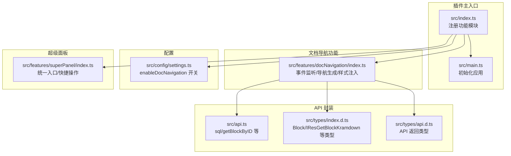
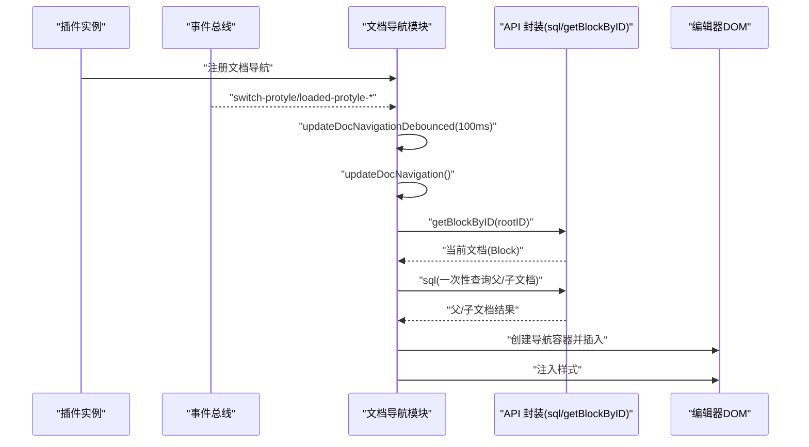
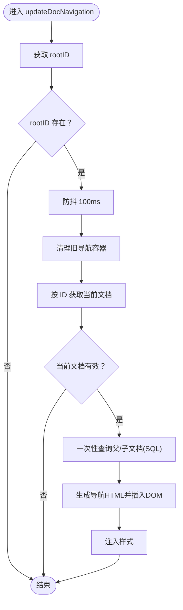
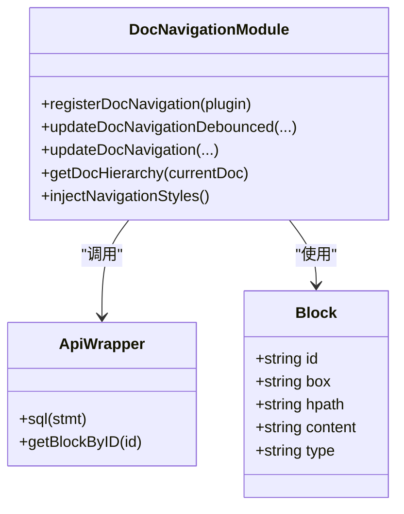
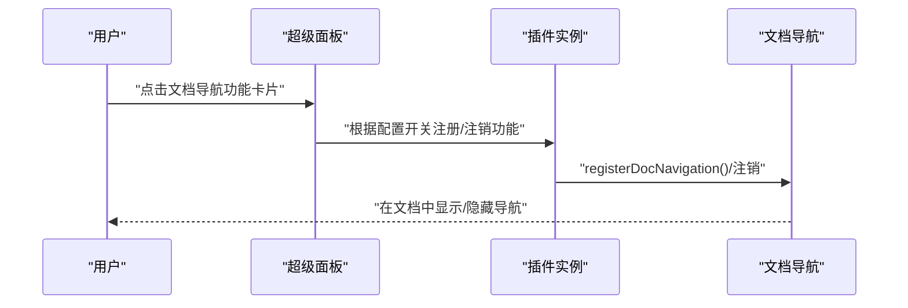
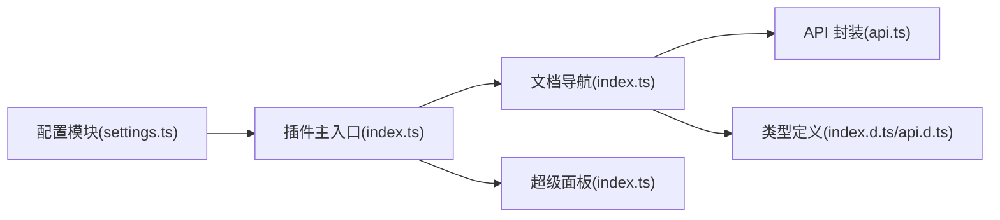

# 文档导航

<cite>
**本文引用的文件**
- [src/features/docNavigation/index.ts](file://src/features/docNavigation/index.ts)
- [src/api.ts](file://src/api.ts)
- [src/types/index.d.ts](file://src/types/index.d.ts)
- [src/types/api.d.ts](file://src/types/api.d.ts)
- [src/config/settings.ts](file://src/config/settings.ts)
- [src/index.ts](file://src/index.ts)
- [src/main.ts](file://src/main.ts)
- [src/features/superPanel/index.ts](file://src/features/superPanel/index.ts)
</cite>

## 目录
1. [简介](#简介)
2. [项目结构](#项目结构)
3. [核心组件](#核心组件)
4. [架构总览](#架构总览)
5. [详细组件分析](#详细组件分析)
6. [依赖关系分析](#依赖关系分析)
7. [性能考量](#性能考量)
8. [故障排查指南](#故障排查指南)
9. [结论](#结论)
10. [附录](#附录)

## 简介
本技术文档聚焦于“文档导航”功能，解释其如何通过解析文档层级结构并在编辑器中自动插入上下级文档的导航链接，从而显著提升在思源笔记中的文档浏览体验。文档将深入分析 index.ts 中的目录结构解析与导航逻辑、与思源 API 的交互方式、与超级面板等其他功能的集成思路，并给出性能优化策略与常见问题的解决方案。

## 项目结构
该功能位于 features/docNavigation/index.ts，围绕以下关键模块协作：
- 事件监听与 UI 注入：在文档切换、动态/静态加载时触发导航更新
- 思源 API 封装：通过 sql 查询与按 ID 获取块信息
- 类型定义：确保 Block、IResGetBlockKramdown 等类型安全
- 配置开关：通过插件设置控制是否启用该功能
- 主入口与注册：在插件主入口中按配置条件注册功能

图表来源
- [src/index.ts](file://src/index.ts#L80-L126)
- [src/features/docNavigation/index.ts](file://src/features/docNavigation/index.ts#L16-L33)
- [src/api.ts](file://src/api.ts#L307-L321)
- [src/types/index.d.ts](file://src/types/index.d.ts#L78-L103)
- [src/types/api.d.ts](file://src/types/api.d.ts#L21-L24)
- [src/config/settings.ts](file://src/config/settings.ts#L9-L22)
- [src/features/superPanel/index.ts](file://src/features/superPanel/index.ts#L17-L42)

章节来源
- [src/index.ts](file://src/index.ts#L80-L126)
- [src/features/docNavigation/index.ts](file://src/features/docNavigation/index.ts#L16-L33)
- [src/api.ts](file://src/api.ts#L307-L321)
- [src/types/index.d.ts](file://src/types/index.d.ts#L78-L103)
- [src/types/api.d.ts](file://src/types/api.d.ts#L21-L24)
- [src/config/settings.ts](file://src/config/settings.ts#L9-L22)
- [src/features/superPanel/index.ts](file://src/features/superPanel/index.ts#L17-L42)

## 核心组件
- 事件监听器：监听 switch-protyle、loaded-protyle-dynamic、loaded-protyle-static 事件，触发导航更新
- 导航生成器：根据当前文档的 hpath 与 box，一次性查询父文档与直接子文档
- UI 注入器：在编辑器标题下方插入导航容器，支持展开/折叠子文档
- 样式注入器：仅注入一次，避免重复样式污染
- 防抖与去重：防抖 100ms，Set 记录已处理文档，避免重复渲染

章节来源
- [src/features/docNavigation/index.ts](file://src/features/docNavigation/index.ts#L16-L33)
- [src/features/docNavigation/index.ts](file://src/features/docNavigation/index.ts#L96-L112)
- [src/features/docNavigation/index.ts](file://src/features/docNavigation/index.ts#L114-L290)
- [src/features/docNavigation/index.ts](file://src/features/docNavigation/index.ts#L292-L470)

## 架构总览
文档导航功能的运行流程如下：
- 插件启动时，根据配置决定是否注册文档导航
- 当用户切换文档或文档动态/静态加载完成时，触发防抖更新
- 更新函数先清理旧导航，再获取当前文档信息
- 通过 SQL 一次性查询父文档与直接子文档
- 生成导航 HTML 并注入到编辑器标题下方
- 注入样式以保证视觉一致性

图表来源
- [src/index.ts](file://src/index.ts#L80-L126)
- [src/features/docNavigation/index.ts](file://src/features/docNavigation/index.ts#L16-L33)
- [src/features/docNavigation/index.ts](file://src/features/docNavigation/index.ts#L96-L112)
- [src/features/docNavigation/index.ts](file://src/features/docNavigation/index.ts#L114-L290)
- [src/api.ts](file://src/api.ts#L307-L321)

## 详细组件分析

### 目录结构解析与导航逻辑
- 事件监听
  - 监听 switch-protyle、loaded-protyle-dynamic、loaded-protyle-static 三个事件，确保在文档切换与加载完成后及时更新导航
- 防抖更新
  - 使用 setTimeout 实现 100ms 防抖，避免频繁触发导致的性能问题
- 导航生成
  - 通过当前文档的 hpath 与 box，构造 SQL 查询一次性获取父文档与直接子文档
  - 对 hpath 进行分割判断是否存在父路径；对子文档使用前缀匹配与层级限制，确保只取直接子文档
- UI 注入
  - 在编辑器标题(.protyle-title)下方插入导航容器；若无标题则插入到 .protyle-wysiwyg 前
  - 支持点击跳转到目标文档（通过 siyuan://blocks/{id} 协议）
  - 子文档过多时提供展开/折叠按钮，默认仅展示前 5 个
- 样式注入
  - 仅注入一次，避免重复样式污染；使用 CSS 变量适配主题色

图表来源
- [src/features/docNavigation/index.ts](file://src/features/docNavigation/index.ts#L96-L112)
- [src/features/docNavigation/index.ts](file://src/features/docNavigation/index.ts#L114-L290)
- [src/features/docNavigation/index.ts](file://src/features/docNavigation/index.ts#L292-L470)

章节来源
- [src/features/docNavigation/index.ts](file://src/features/docNavigation/index.ts#L16-L33)
- [src/features/docNavigation/index.ts](file://src/features/docNavigation/index.ts#L96-L112)
- [src/features/docNavigation/index.ts](file://src/features/docNavigation/index.ts#L114-L290)
- [src/features/docNavigation/index.ts](file://src/features/docNavigation/index.ts#L292-L470)

### 与思源 API 的交互
- 获取当前文档信息
  - 通过 getBlockByID(rootID) 获取 Block，包含 box、hpath 等关键字段
- 一次性查询父/子文档
  - 使用 sql 接口执行包含 UNION ALL 的查询，同时获取父文档与直接子文档
  - 子文档查询通过 hpath 前缀匹配与层级限制，避免深层递归带来的性能问题
- 类型约束
  - Block 类型定义了 id、box、hpath、content、type 等字段，确保导航逻辑正确性
  - IResGetBlockKramdown 定义了返回结构，便于后续扩展

图表来源
- [src/features/docNavigation/index.ts](file://src/features/docNavigation/index.ts#L16-L33)
- [src/features/docNavigation/index.ts](file://src/features/docNavigation/index.ts#L43-L94)
- [src/api.ts](file://src/api.ts#L307-L321)
- [src/types/index.d.ts](file://src/types/index.d.ts#L78-L103)

章节来源
- [src/api.ts](file://src/api.ts#L307-L321)
- [src/types/index.d.ts](file://src/types/index.d.ts#L78-L103)
- [src/types/api.d.ts](file://src/types/api.d.ts#L21-L24)

### 与超级面板的集成示例
- 超级面板作为统一入口，提供一键打开/关闭各功能的快捷方式
- 文档导航可作为超级面板中的一个功能卡片，用户可通过超级面板快速启用/禁用该功能
- 超级面板还支持通过自定义事件触发插入索引、大纲、引用等命令，文档导航可与这些命令协同工作

图表来源
- [src/features/superPanel/index.ts](file://src/features/superPanel/index.ts#L17-L42)
- [src/index.ts](file://src/index.ts#L80-L126)
- [src/config/settings.ts](file://src/config/settings.ts#L9-L22)

章节来源
- [src/features/superPanel/index.ts](file://src/features/superPanel/index.ts#L17-L42)
- [src/index.ts](file://src/index.ts#L80-L126)
- [src/config/settings.ts](file://src/config/settings.ts#L9-L22)

## 依赖关系分析
- 插件主入口依赖配置模块与各功能模块注册器
- 文档导航模块依赖 API 封装与类型定义
- 超级面板模块独立于文档导航，但共同受插件配置影响

图表来源
- [src/config/settings.ts](file://src/config/settings.ts#L9-L22)
- [src/index.ts](file://src/index.ts#L80-L126)
- [src/features/docNavigation/index.ts](file://src/features/docNavigation/index.ts#L16-L33)
- [src/api.ts](file://src/api.ts#L307-L321)
- [src/types/index.d.ts](file://src/types/index.d.ts#L78-L103)
- [src/types/api.d.ts](file://src/types/api.d.ts#L21-L24)
- [src/features/superPanel/index.ts](file://src/features/superPanel/index.ts#L17-L42)

章节来源
- [src/config/settings.ts](file://src/config/settings.ts#L9-L22)
- [src/index.ts](file://src/index.ts#L80-L126)
- [src/features/docNavigation/index.ts](file://src/features/docNavigation/index.ts#L16-L33)
- [src/api.ts](file://src/api.ts#L307-L321)
- [src/types/index.d.ts](file://src/types/index.d.ts#L78-L103)
- [src/types/api.d.ts](file://src/types/api.d.ts#L21-L24)
- [src/features/superPanel/index.ts](file://src/features/superPanel/index.ts#L17-L42)

## 性能考量
- 异步加载与防抖
  - 使用 100ms 防抖减少频繁触发，避免 UI 闪烁与重复计算
- 一次性查询
  - 通过 UNION ALL 一次性查询父文档与直接子文档，降低数据库往返次数
- 展示优化
  - 子文档默认仅展示前 5 个，超出部分通过展开按钮加载，减少初始 DOM 节点数量
- 样式注入去重
  - 仅注入一次样式，避免重复注入造成的样式冲突与重绘
- 内存管理
  - 使用 Set 记录已处理文档，并在短暂延时后清理，避免长期持有导致的内存增长

章节来源
- [src/features/docNavigation/index.ts](file://src/features/docNavigation/index.ts#L96-L112)
- [src/features/docNavigation/index.ts](file://src/features/docNavigation/index.ts#L114-L290)
- [src/features/docNavigation/index.ts](file://src/features/docNavigation/index.ts#L292-L470)

## 故障排查指南
- 导航数据加载失败
  - 检查当前文档是否具备有效的 box 与 hpath；若为空则不会生成导航
  - 确认 SQL 查询是否返回结果；必要时在日志中输出查询语句进行验证
- 更新延迟
  - 确认防抖时间是否过长；可根据需要调整防抖间隔
  - 检查事件触发是否正常（switch-protyle、loaded-protyle-dynamic、loaded-protyle-static）
- UI 重复或样式异常
  - 确保旧导航容器被正确清理；检查 data-doc-id 属性是否匹配
  - 确认样式注入器仅注入一次，避免重复注入
- 点击无法跳转
  - 确认点击事件绑定是否生效；检查 siyuan://blocks/{id} 协议是否可用

章节来源
- [src/features/docNavigation/index.ts](file://src/features/docNavigation/index.ts#L114-L290)
- [src/features/docNavigation/index.ts](file://src/features/docNavigation/index.ts#L292-L470)

## 结论
文档导航功能通过解析文档层级结构与一次性查询父/子文档，结合防抖与 UI 展示优化，在不侵入编辑器核心的前提下显著提升了文档浏览效率。其与超级面板等统一入口功能协同，形成完整的插件生态。未来可在缓存、懒加载、主题适配等方面进一步优化，以满足更复杂场景下的性能与体验需求。

## 附录
- 配置项
  - enableDocNavigation：控制是否启用文档导航功能
- 典型使用场景
  - 在层级较深的文档中快速返回上级或查看下级文档
  - 与超级面板配合，统一管理多个功能的启停

章节来源
- [src/config/settings.ts](file://src/config/settings.ts#L9-L22)
- [src/index.ts](file://src/index.ts#L80-L126)