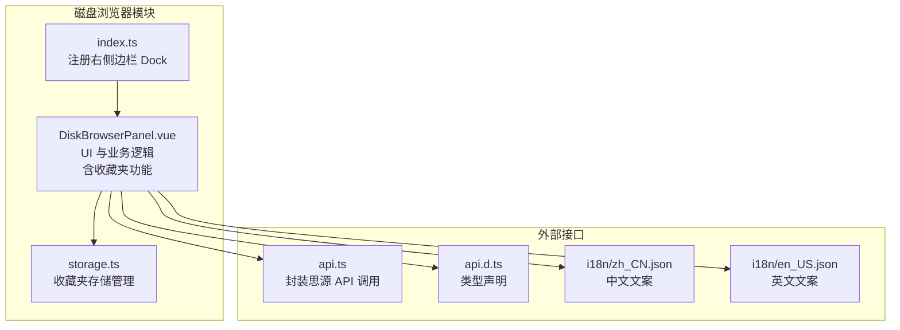
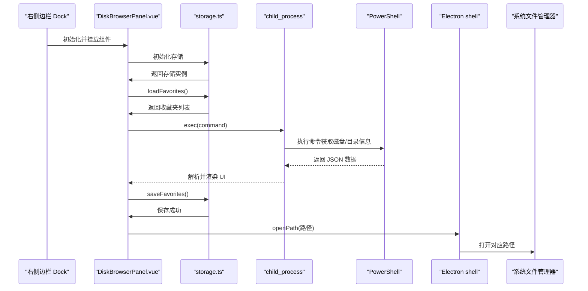
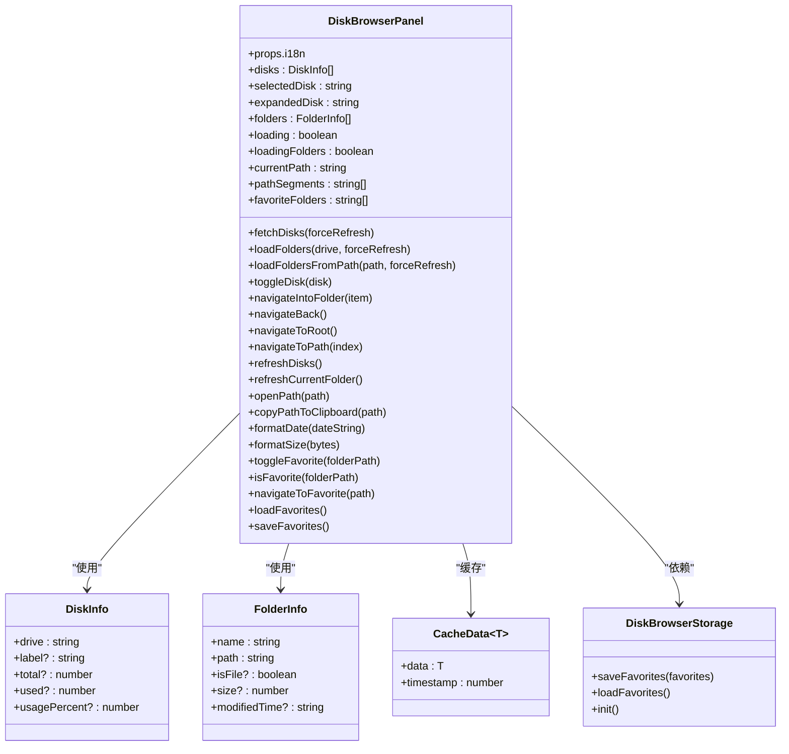
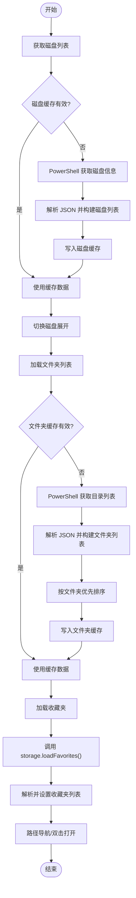
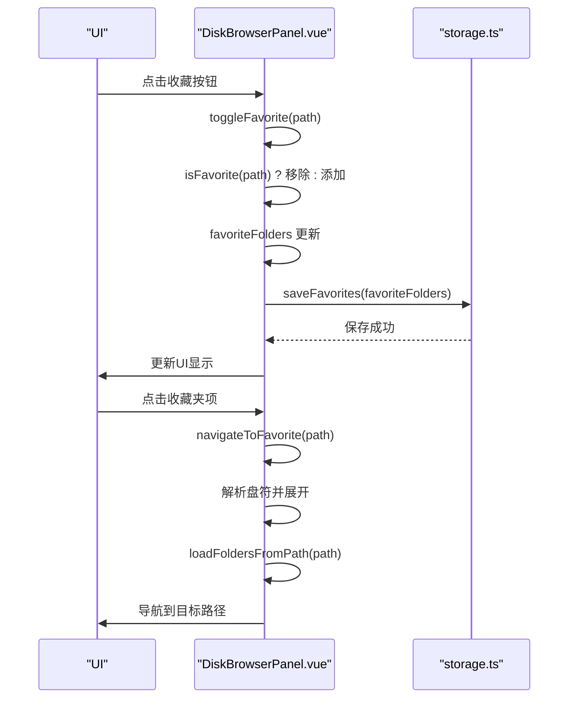
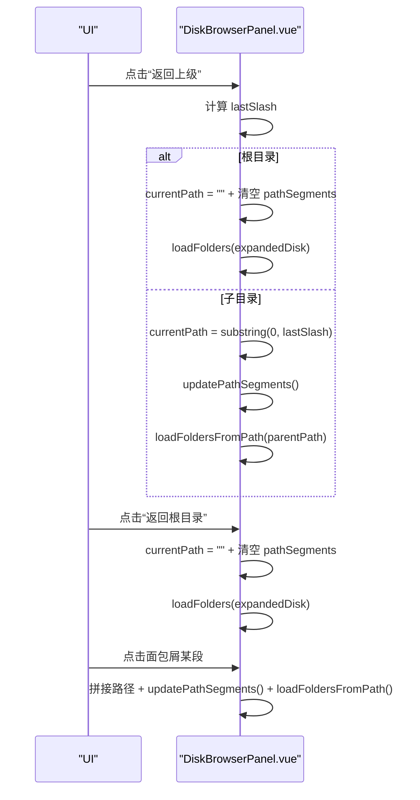
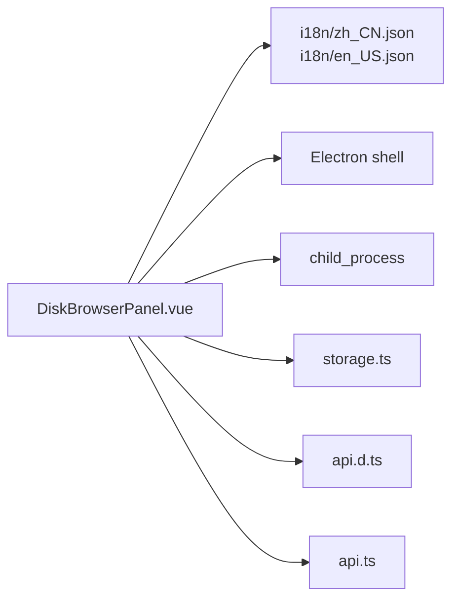

# 磁盘浏览器

<cite>
**本文引用的文件**
- [DiskBrowserPanel.vue](file://src/features/diskBrowser/DiskBrowserPanel.vue)
- [index.ts](file://src/features/diskBrowser/index.ts)
- [storage.ts](file://src/features/diskBrowser/storage.ts)
- [api.ts](file://src/api.ts)
- [api.d.ts](file://src/types/api.d.ts)
- [zh_CN.json](file://src/i18n/zh_CN.json)
- [en_US.json](file://src/i18n/en_US.json)
</cite>

## 更新摘要
**变更内容**
- 新增收藏夹系统功能，支持用户标记和快速访问常用文件夹
- 在磁盘浏览器界面中添加收藏夹区域，显示已收藏的文件夹
- 实现收藏夹的增删、持久化存储和快速导航功能
- 更新核心组件、架构总览和详细组件分析以反映新增功能
- 新增收藏夹管理流程图和组件关系图

## 目录
1. [简介](#简介)
2. [项目结构](#项目结构)
3. [核心组件](#核心组件)
4. [架构总览](#架构总览)
5. [详细组件分析](#详细组件分析)
6. [依赖关系分析](#依赖关系分析)
7. [性能考量](#性能考量)
8. [故障排查指南](#故障排查指南)
9. [结论](#结论)
10. [附录](#附录)

## 简介
本文件面向“磁盘浏览器”功能，围绕 DiskBrowserPanel.vue 的文件系统浏览界面实现进行系统化说明，重点覆盖：
- index.ts 如何通过思源 API 安全地访问本地文件系统并展示目录结构
- 文件过滤、排序与路径导航的技术细节
- 与系统文件管理器的集成方案与安全边界控制
- 大目录加载的性能优化建议（虚拟滚动与异步加载）
- **新增收藏夹系统，支持用户标记和快速访问常用文件夹**
- 常见问题处理策略（权限不足、文件路径编码错误）

## 项目结构
磁盘浏览器功能位于 features/diskBrowser 目录，包含三个关键文件：
- DiskBrowserPanel.vue：磁盘与文件夹浏览的前端界面与交互逻辑，**新增收藏夹功能**
- index.ts：将该功能注册为右侧边栏 Dock，并注入 i18n 国际化文案
- storage.ts：**新增收藏夹数据的持久化存储管理**

**图表来源**
- [index.ts](file://src/features/diskBrowser/index.ts#L1-L51)
- [DiskBrowserPanel.vue](file://src/features/diskBrowser/DiskBrowserPanel.vue#L1-L168)
- [storage.ts](file://src/features/diskBrowser/storage.ts#L1-L68)
- [api.ts](file://src/api.ts#L1-L120)
- [api.d.ts](file://src/types/api.d.ts#L1-L65)
- [zh_CN.json](file://src/i18n/zh_CN.json#L280-L317)
- [en_US.json](file://src/i18n/en_US.json#L275-L312)

**章节来源**
- [index.ts](file://src/features/diskBrowser/index.ts#L1-L51)
- [DiskBrowserPanel.vue](file://src/features/diskBrowser/DiskBrowserPanel.vue#L1-L168)
- [storage.ts](file://src/features/diskBrowser/storage.ts#L1-L68)

## 核心组件
- 磁盘列表与容量展示：支持横向滚动、磁盘标签与使用率条
- 文件夹列表与面包屑导航：支持返回上级、根目录跳转、路径段定位
- 文件项展示：文件名、大小、修改时间；文件夹与文件分别排序
- 缓存机制：磁盘列表与文件夹列表分别缓存，定时刷新
- 系统集成：在资源管理器中打开路径、复制路径到剪贴板
- 国际化：通过 i18n 对话框文案进行本地化
- **收藏夹系统：支持用户将常用文件夹添加到收藏夹，通过收藏夹区域快速访问**

**章节来源**
- [DiskBrowserPanel.vue](file://src/features/diskBrowser/DiskBrowserPanel.vue#L1-L168)
- [DiskBrowserPanel.vue](file://src/features/diskBrowser/DiskBrowserPanel.vue#L170-L771)
- [DiskBrowserPanel.vue](file://src/features/diskBrowser/DiskBrowserPanel.vue#L772-L1342)

## 架构总览
磁盘浏览器采用“注册 Dock + Vue 组件”的方式接入思源笔记侧边栏。组件内部通过 window.require(child_process) 调用 PowerShell 获取磁盘与目录信息，再通过 Electron shell.openPath 打开系统文件管理器。同时，组件内置缓存与国际化支持，保证用户体验与可维护性。**新增收藏夹功能，通过 storage.ts 模块实现收藏夹数据的持久化存储和管理。**

**图表来源**
- [index.ts](file://src/features/diskBrowser/index.ts#L12-L47)
- [DiskBrowserPanel.vue](file://src/features/diskBrowser/DiskBrowserPanel.vue#L229-L293)
- [DiskBrowserPanel.vue](file://src/features/diskBrowser/DiskBrowserPanel.vue#L338-L371)
- [DiskBrowserPanel.vue](file://src/features/diskBrowser/DiskBrowserPanel.vue#L524-L570)
- [DiskBrowserPanel.vue](file://src/features/diskBrowser/DiskBrowserPanel.vue#L383-L396)
- [storage.ts](file://src/features/diskBrowser/storage.ts#L16-L67)

## 详细组件分析

### 组件类图（核心类型与关系）

**图表来源**
- [DiskBrowserPanel.vue](file://src/features/diskBrowser/DiskBrowserPanel.vue#L170-L216)
- [DiskBrowserPanel.vue](file://src/features/diskBrowser/DiskBrowserPanel.vue#L229-L293)
- [DiskBrowserPanel.vue](file://src/features/diskBrowser/DiskBrowserPanel.vue#L326-L377)
- [DiskBrowserPanel.vue](file://src/features/diskBrowser/DiskBrowserPanel.vue#L514-L577)
- [storage.ts](file://src/features/diskBrowser/storage.ts#L16-L67)

**章节来源**
- [DiskBrowserPanel.vue](file://src/features/diskBrowser/DiskBrowserPanel.vue#L170-L216)
- [DiskBrowserPanel.vue](file://src/features/diskBrowser/DiskBrowserPanel.vue#L229-L293)
- [DiskBrowserPanel.vue](file://src/features/diskBrowser/DiskBrowserPanel.vue#L326-L377)
- [DiskBrowserPanel.vue](file://src/features/diskBrowser/DiskBrowserPanel.vue#L514-L577)
- [storage.ts](file://src/features/diskBrowser/storage.ts#L16-L67)

### 磁盘与文件夹加载流程
- 磁盘列表加载：优先使用 PowerShell 获取 Win32_LogicalDisk 信息，解析 UTF-8 输出，构建磁盘列表；若失败则回退到默认磁盘集合
- 文件夹列表加载：使用 PowerShell Get-ChildItem 获取目录，排除隐藏属性；支持按“文件夹在前、文件在后”排序
- 路径导航：支持返回上级、根目录跳转、面包屑逐级定位
- **收藏夹加载：组件挂载时从 storage.ts 加载持久化的收藏夹列表**

**图表来源**
- [DiskBrowserPanel.vue](file://src/features/diskBrowser/DiskBrowserPanel.vue#L229-L293)
- [DiskBrowserPanel.vue](file://src/features/diskBrowser/DiskBrowserPanel.vue#L326-L377)
- [DiskBrowserPanel.vue](file://src/features/diskBrowser/DiskBrowserPanel.vue#L514-L577)
- [DiskBrowserPanel.vue](file://src/features/diskBrowser/DiskBrowserPanel.vue#L1018-L1020)
- [storage.ts](file://src/features/diskBrowser/storage.ts#L41-L49)

**章节来源**
- [DiskBrowserPanel.vue](file://src/features/diskBrowser/DiskBrowserPanel.vue#L229-L293)
- [DiskBrowserPanel.vue](file://src/features/diskBrowser/DiskBrowserPanel.vue#L326-L377)
- [DiskBrowserPanel.vue](file://src/features/diskBrowser/DiskBrowserPanel.vue#L514-L577)
- [DiskBrowserPanel.vue](file://src/features/diskBrowser/DiskBrowserPanel.vue#L1018-L1020)
- [storage.ts](file://src/features/diskBrowser/storage.ts#L41-L49)

### 收藏夹管理流程
- **初始化**：组件挂载时调用 loadFavorites() 从 storage.ts 加载收藏夹
- **添加/移除**：点击文件夹的收藏按钮，调用 toggleFavorite() 切换状态并更新列表
- **持久化**：每次收藏夹变更后，自动调用 saveFavorites() 持久化到 storage.ts
- **导航**：点击收藏夹项，调用 navigateToFavorite() 导航到对应路径

**图表来源**
- [DiskBrowserPanel.vue](file://src/features/diskBrowser/DiskBrowserPanel.vue#L344-L353)
- [DiskBrowserPanel.vue](file://src/features/diskBrowser/DiskBrowserPanel.vue#L984-L1015)
- [DiskBrowserPanel.vue](file://src/features/diskBrowser/DiskBrowserPanel.vue#L1018-L1020)
- [storage.ts](file://src/features/diskBrowser/storage.ts#L27-L35)
- [storage.ts](file://src/features/diskBrowser/storage.ts#L41-L49)

**章节来源**
- [DiskBrowserPanel.vue](file://src/features/diskBrowser/DiskBrowserPanel.vue#L344-L353)
- [DiskBrowserPanel.vue](file://src/features/diskBrowser/DiskBrowserPanel.vue#L984-L1015)
- [DiskBrowserPanel.vue](file://src/features/diskBrowser/DiskBrowserPanel.vue#L1018-L1020)
- [storage.ts](file://src/features/diskBrowser/storage.ts#L27-L35)
- [storage.ts](file://src/features/diskBrowser/storage.ts#L41-L49)

### 路径导航与面包屑
- 当前路径 currentPath 与 pathSegments 保持同步
- 返回上级：根据最后反斜杠位置截取父路径；若回到盘符根目录则清空 currentPath 并刷新磁盘根
- 根目录跳转：清空 currentPath 与 pathSegments 并刷新磁盘根
- 面包屑点击：根据索引拼接路径并加载对应目录

**图表来源**
- [DiskBrowserPanel.vue](file://src/features/diskBrowser/DiskBrowserPanel.vue#L608-L651)
- [DiskBrowserPanel.vue](file://src/features/diskBrowser/DiskBrowserPanel.vue#L633-L651)
- [DiskBrowserPanel.vue](file://src/features/diskBrowser/DiskBrowserPanel.vue#L642-L651)

**章节来源**
- [DiskBrowserPanel.vue](file://src/features/diskBrowser/DiskBrowserPanel.vue#L608-L651)
- [DiskBrowserPanel.vue](file://src/features/diskBrowser/DiskBrowserPanel.vue#L633-L651)
- [DiskBrowserPanel.vue](file://src/features/diskBrowser/DiskBrowserPanel.vue#L642-L651)

### 文件过滤、排序与路径导航技术细节
- 过滤：PowerShell 查询时排除隐藏文件夹与文件，避免用户看到系统隐藏项
- 排序：先按 isFile（文件夹优先），再按名称 localeCompare(zh-CN)
- 路径导航：基于字符串路径分割与拼接，确保盘符根目录与子目录行为一致

**章节来源**
- [DiskBrowserPanel.vue](file://src/features/diskBrowser/DiskBrowserPanel.vue#L343-L345)
- [DiskBrowserPanel.vue](file://src/features/diskBrowser/DiskBrowserPanel.vue#L524-L531)
- [DiskBrowserPanel.vue](file://src/features/diskBrowser/DiskBrowserPanel.vue#L554-L560)

### 与系统文件管理器的集成与安全边界
- 集成方式：通过 Electron shell.openPath 打开系统文件管理器
- 安全边界：
  - 仅在 Electron 环境可用（window.require 存在）；非 Electron 环境提示不支持
  - 仅能打开本地路径，不暴露远程或受控路径
  - 打开失败时统一提示错误消息，避免异常泄露

**章节来源**
- [DiskBrowserPanel.vue](file://src/features/diskBrowser/DiskBrowserPanel.vue#L383-L396)
- [DiskBrowserPanel.vue](file://src/features/diskBrowser/DiskBrowserPanel.vue#L389-L395)

### 思源 API 的安全访问与数据流
- 本模块通过 window.require(child_process) 直接调用本地命令获取文件系统信息，不依赖思源 API
- 若需与思源笔记内部文件系统交互，可参考 api.ts 中的 readDir、getFile、putFile 等接口，但当前磁盘浏览器未使用这些接口

**章节来源**
- [DiskBrowserPanel.vue](file://src/features/diskBrowser/DiskBrowserPanel.vue#L240-L286)
- [DiskBrowserPanel.vue](file://src/features/diskBrowser/DiskBrowserPanel.vue#L338-L371)
- [DiskBrowserPanel.vue](file://src/features/diskBrowser/DiskBrowserPanel.vue#L524-L570)
- [api.ts](file://src/api.ts#L394-L401)
- [api.ts](file://src/api.ts#L342-L372)

## 依赖关系分析
- 组件依赖
  - i18n：通过 props.i18n 注入，支持中文与英文文案
  - Electron：通过 window.require('electron') 的 shell.openPath 实现系统集成
  - child_process：通过 window.require('child_process') 执行 PowerShell 命令
  - **storage.ts：新增依赖，用于收藏夹数据的持久化存储**
- 类型与接口
  - DiskInfo、FolderInfo、CacheData 作为核心数据结构
  - api.d.ts 提供部分类型声明（与磁盘浏览器功能无直接耦合）

**图表来源**
- [DiskBrowserPanel.vue](file://src/features/diskBrowser/DiskBrowserPanel.vue#L1-L168)
- [index.ts](file://src/features/diskBrowser/index.ts#L12-L47)
- [api.ts](file://src/api.ts#L1-L120)
- [api.d.ts](file://src/types/api.d.ts#L1-L65)
- [zh_CN.json](file://src/i18n/zh_CN.json#L280-L317)
- [en_US.json](file://src/i18n/en_US.json#L275-L312)
- [storage.ts](file://src/features/diskBrowser/storage.ts#L1-L68)

**章节来源**
- [DiskBrowserPanel.vue](file://src/features/diskBrowser/DiskBrowserPanel.vue#L1-L168)
- [index.ts](file://src/features/diskBrowser/index.ts#L12-L47)
- [api.ts](file://src/api.ts#L1-L120)
- [api.d.ts](file://src/types/api.d.ts#L1-L65)
- [zh_CN.json](file://src/i18n/zh_CN.json#L280-L317)
- [en_US.json](file://src/i18n/en_US.json#L275-L312)
- [storage.ts](file://src/features/diskBrowser/storage.ts#L1-L68)

## 性能考量
- 已有优化
  - 缓存：磁盘列表与文件夹列表分别缓存，缓存有效期 1 小时；每分钟更新缓存状态提示
  - 异步加载：磁盘与文件夹加载均采用异步 Promise，避免阻塞 UI
  - 排序：按文件夹优先与本地化排序，减少后续渲染复杂度
- 建议优化（针对大目录）
  - 虚拟滚动：对文件夹列表启用虚拟滚动，仅渲染可视区域内的项目
  - 分页加载：对超大目录采用分页或懒加载，按需请求下一页
  - 并行请求：对多磁盘场景并行获取磁盘信息，缩短首屏时间
  - 增量刷新：在用户操作时仅刷新受影响的节点，而非整表重绘

[本节为通用性能建议，不直接分析具体文件，故无章节来源]

## 故障排查指南
- 权限不足
  - 现象：无法列出某些磁盘或目录
  - 处理：提示用户提升权限或切换到可访问的路径；当前实现对隐藏项进行过滤，避免异常
- 文件路径编码错误
  - 现象：中文路径显示乱码
  - 处理：PowerShell 设置输出编码为 UTF-8，解析 JSON 后进行 trim 处理
- 打开系统文件管理器失败
  - 现象：调用 shell.openPath 报错
  - 处理：捕获异常并提示“打开失败”，非 Electron 环境提示“当前环境不支持打开文件夹”
- 磁盘信息获取失败
  - 现象：PowerShell 获取磁盘信息失败
  - 处理：回退到默认磁盘列表，避免 UI 崩溃
- **收藏夹功能异常**
  - 现象：收藏夹无法保存或加载
  - 处理：检查 storage.ts 的 saveData 和 loadData 调用是否成功，查看控制台错误日志

**章节来源**
- [DiskBrowserPanel.vue](file://src/features/diskBrowser/DiskBrowserPanel.vue#L240-L286)
- [DiskBrowserPanel.vue](file://src/features/diskBrowser/DiskBrowserPanel.vue#L278-L282)
- [DiskBrowserPanel.vue](file://src/features/diskBrowser/DiskBrowserPanel.vue#L338-L371)
- [DiskBrowserPanel.vue](file://src/features/diskBrowser/DiskBrowserPanel.vue#L383-L396)
- [DiskBrowserPanel.vue](file://src/features/diskBrowser/DiskBrowserPanel.vue#L524-L570)
- [storage.ts](file://src/features/diskBrowser/storage.ts#L27-L35)
- [storage.ts](file://src/features/diskBrowser/storage.ts#L41-L49)

## 结论
磁盘浏览器通过“右侧边栏 Dock + Vue 组件”的方式，结合 Electron 与 PowerShell 实现了本地文件系统的安全浏览与系统集成。其具备完善的缓存与国际化支持，路径导航清晰直观，错误处理稳健可靠。**新增收藏夹系统，允许用户标记常用文件夹并快速访问，提升了用户体验。** 对于大目录场景，建议引入虚拟滚动与分页加载以进一步提升性能体验。

[本节为总结性内容，不直接分析具体文件，故无章节来源]

## 附录
- 国际化键值（节选）
  - 磁盘浏览器标题、描述、启用开关文案
  - 加载失败、打开失败、复制失败等提示文案
  - 导航与操作按钮文案（刷新、返回、打开、复制路径等）
  - **收藏夹相关文案：收藏、取消收藏、收藏夹、已添加收藏、已取消收藏、已跳转到收藏夹**

**章节来源**
- [zh_CN.json](file://src/i18n/zh_CN.json#L280-L317)
- [en_US.json](file://src/i18n/en_US.json#L275-L312)