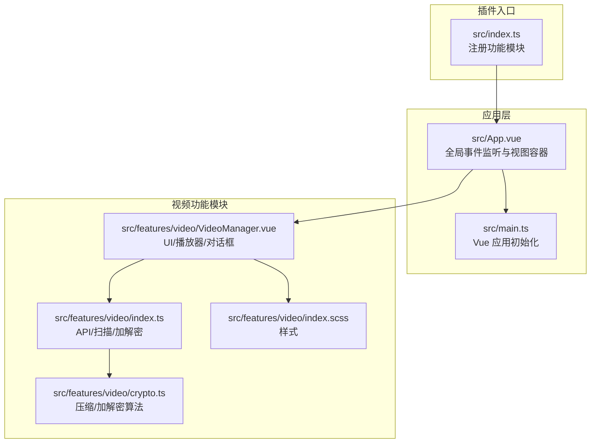
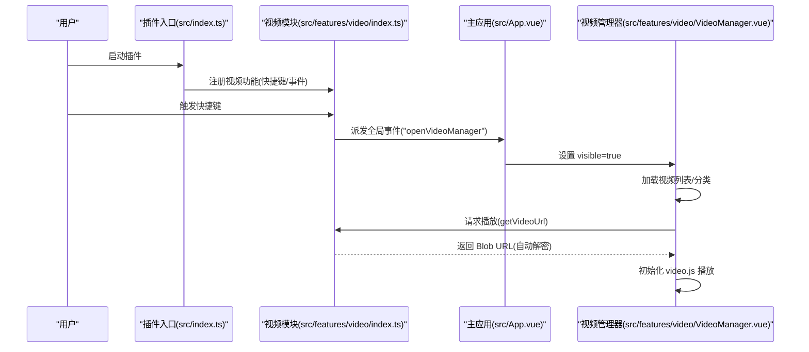
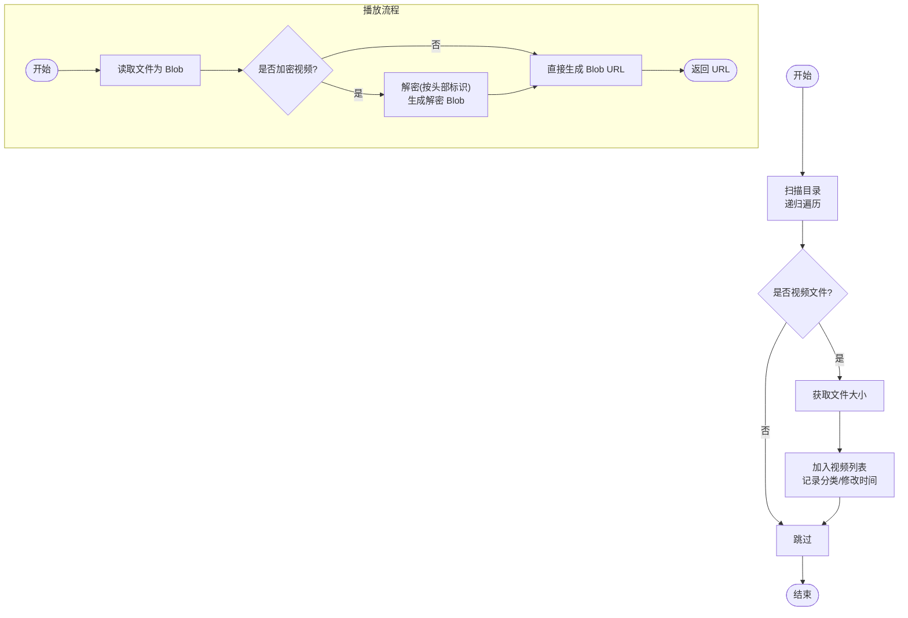
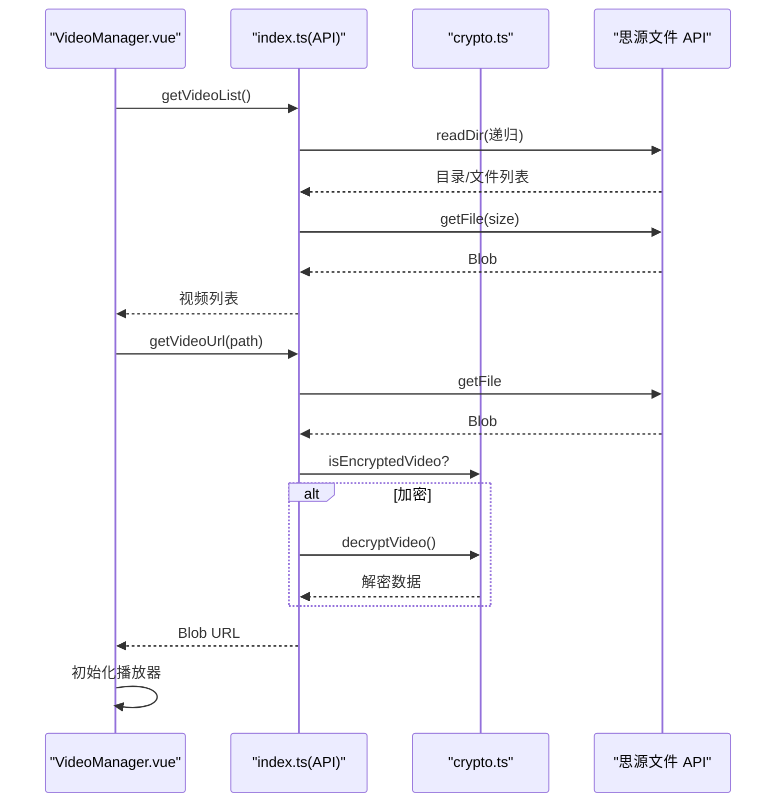
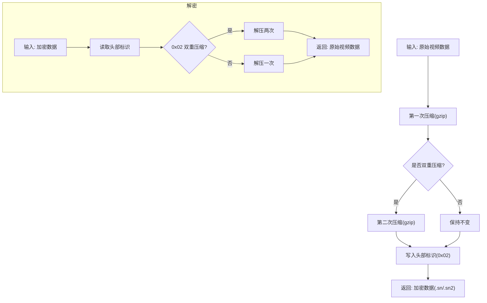
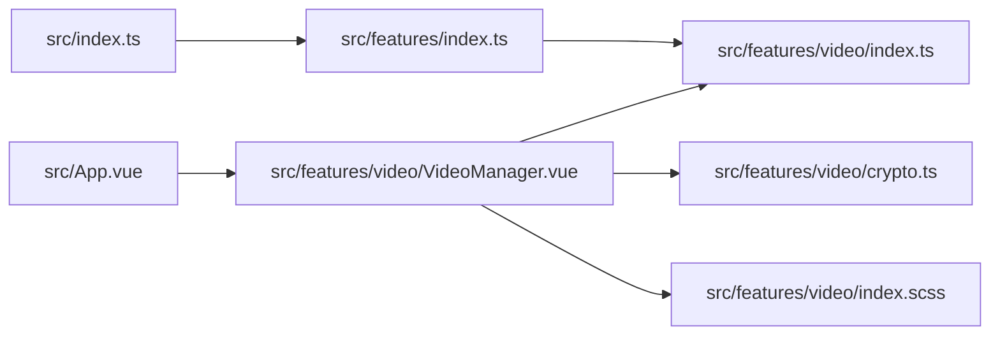

# 视频管理器

<cite>
**本文引用的文件**
- [src/index.ts](file://src/index.ts)
- [src/main.ts](file://src/main.ts)
- [src/App.vue](file://src/App.vue)
- [src/features/index.ts](file://src/features/index.ts)
- [src/features/video/index.ts](file://src/features/video/index.ts)
- [src/features/video/VideoManager.vue](file://src/features/video/VideoManager.vue)
- [src/features/video/crypto.ts](file://src/features/video/crypto.ts)
- [src/features/video/index.scss](file://src/features/video/index.scss)
- [plugin.json](file://plugin.json)
</cite>

## 目录
1. [简介](#简介)
2. [项目结构](#项目结构)
3. [核心组件](#核心组件)
4. [架构总览](#架构总览)
5. [详细组件分析](#详细组件分析)
6. [依赖关系分析](#依赖关系分析)
7. [性能考量](#性能考量)
8. [故障排查指南](#故障排查指南)
9. [结论](#结论)
10. [附录](#附录)

## 简介
本插件提供“视频管理器”能力，围绕思源笔记的数据目录进行视频文件的扫描、展示、播放以及加密/解密。其主要特性包括：
- 快捷键打开视频管理器
- 自动扫描 data/video 及子目录下的视频文件
- 分类筛选与文件大小、修改时间等元信息展示
- 内置播放器（video.js）播放视频
- 加密/解密视频文件（.sn/.sn2），支持双重压缩选项
- 批量加密/批量解密
- 一键打开视频所在文件夹（桌面端）

该功能模块通过统一的功能注册机制接入主插件，并通过全局事件与主应用交互，实现“按需启用”的设计。

## 项目结构
视频管理器相关代码集中在 features/video 目录，配合主应用 App.vue 与插件入口 src/index.ts 实现完整功能链路。

图表来源
- [src/index.ts](file://src/index.ts#L81-L151)
- [src/App.vue](file://src/App.vue#L113-L131)
- [src/main.ts](file://src/main.ts#L21-L38)
- [src/features/video/index.ts](file://src/features/video/index.ts#L1-L173)
- [src/features/video/VideoManager.vue](file://src/features/video/VideoManager.vue#L1-L120)
- [src/features/video/crypto.ts](file://src/features/video/crypto.ts#L1-L185)
- [src/features/video/index.scss](file://src/features/video/index.scss#L1-L120)

章节来源
- [src/index.ts](file://src/index.ts#L81-L151)
- [src/App.vue](file://src/App.vue#L113-L131)
- [src/main.ts](file://src/main.ts#L21-L38)
- [src/features/video/index.ts](file://src/features/video/index.ts#L1-L173)
- [src/features/video/VideoManager.vue](file://src/features/video/VideoManager.vue#L1-L120)
- [src/features/video/crypto.ts](file://src/features/video/crypto.ts#L1-L185)
- [src/features/video/index.scss](file://src/features/video/index.scss#L1-L120)

## 核心组件
- 功能注册与快捷键
  - 在功能模块中注册快捷键，触发全局事件以打开视频管理器。
  - 参考路径：[src/features/video/index.ts](file://src/features/video/index.ts#L1-L35)
- 视频列表与扫描
  - 自动扫描 data/video 及子目录，识别视频文件并计算大小、记录分类与修改时间。
  - 参考路径：[src/features/video/index.ts](file://src/features/video/index.ts#L84-L173)
- 视频播放与 Blob URL
  - 通过 API 读取文件，生成 Blob URL；若为加密视频则先解密再播放。
  - 参考路径：[src/features/video/index.ts](file://src/features/video/index.ts#L175-L212)
- 加密/解密流程
  - 支持单重/双重压缩加密（.sn/.sn2），自动识别并解密。
  - 参考路径：[src/features/video/crypto.ts](file://src/features/video/crypto.ts#L101-L185)
- UI 组件与交互
  - 视频管理器弹窗、工具栏、播放器、批量加密/解密对话框。
  - 参考路径：[src/features/video/VideoManager.vue](file://src/features/video/VideoManager.vue#L1-L266)
- 全局事件与主应用
  - 主应用监听全局事件，切换视频管理器可见状态。
  - 参考路径：[src/App.vue](file://src/App.vue#L113-L131)

章节来源
- [src/features/video/index.ts](file://src/features/video/index.ts#L1-L212)
- [src/features/video/crypto.ts](file://src/features/video/crypto.ts#L101-L185)
- [src/features/video/VideoManager.vue](file://src/features/video/VideoManager.vue#L1-L266)
- [src/App.vue](file://src/App.vue#L113-L131)

## 架构总览
视频管理器采用“模块化功能 + 全局事件 + 主应用容器”的架构：
- 插件入口负责加载配置并按开关注册各功能模块
- 视频模块提供 API（扫描、加解密、播放 URL）与 UI 组件
- 主应用通过全局事件接收打开请求，渲染视频管理器弹窗
- UI 组件调用模块 API 完成业务流程

图表来源
- [src/index.ts](file://src/index.ts#L81-L151)
- [src/features/video/index.ts](file://src/features/video/index.ts#L1-L35)
- [src/App.vue](file://src/App.vue#L113-L131)
- [src/features/video/VideoManager.vue](file://src/features/video/VideoManager.vue#L389-L496)

## 详细组件分析

### 视频模块 API 与数据流
- 快捷键与事件
  - 注册快捷键，回调中派发全局事件，交由主应用处理。
  - 参考路径：[src/features/video/index.ts](file://src/features/video/index.ts#L1-L35)
- 存储路径与扩展名
  - 默认存储路径 data/video；支持扩展名包括 mp4/webm/ogg/avi/mov/wmv/flv/mkv/m4v/sn/sn2。
  - 参考路径：[src/features/video/index.ts](file://src/features/video/index.ts#L37-L56)
- 目录扫描与视频收集
  - 递归读取目录，过滤视频文件，计算大小，提取分类与修改时间。
  - 参考路径：[src/features/video/index.ts](file://src/features/video/index.ts#L84-L173)
- 播放 URL 生成
  - 读取文件为 Blob，若为加密视频则解密后再生成 URL。
  - 参考路径：[src/features/video/index.ts](file://src/features/video/index.ts#L175-L212)
- 加密/解密
  - 单重/双重压缩，头部标识区分；解密时自动判断压缩级别。
  - 参考路径：[src/features/video/crypto.ts](file://src/features/video/crypto.ts#L101-L185)

图表来源
- [src/features/video/index.ts](file://src/features/video/index.ts#L84-L173)
- [src/features/video/index.ts](file://src/features/video/index.ts#L175-L212)
- [src/features/video/crypto.ts](file://src/features/video/crypto.ts#L101-L185)

章节来源
- [src/features/video/index.ts](file://src/features/video/index.ts#L37-L212)
- [src/features/video/crypto.ts](file://src/features/video/crypto.ts#L101-L185)

### 视频管理器 UI 组件
- 弹窗与工具栏
  - 提供刷新、打开文件夹、批量加密/解密按钮，分类筛选。
  - 参考路径：[src/features/video/VideoManager.vue](file://src/features/video/VideoManager.vue#L1-L98)
- 视频网格与动作
  - 每个视频项显示缩略图、名称、大小、分类与操作按钮（播放/解密）。
  - 参考路径：[src/features/video/VideoManager.vue](file://src/features/video/VideoManager.vue#L53-L96)
- 播放器
  - 使用 video.js 初始化播放器，设置源为 Blob URL，支持画中画与全屏。
  - 参考路径：[src/features/video/VideoManager.vue](file://src/features/video/VideoManager.vue#L436-L496)
- 批量加密/解密对话框
  - 显示待处理数量、双重压缩选项、进度条与提示信息。
  - 参考路径：[src/features/video/VideoManager.vue](file://src/features/video/VideoManager.vue#L130-L266)
- 打开文件夹
  - 桌面端通过 Electron 打开工作空间下的 data/video。
  - 参考路径：[src/features/video/VideoManager.vue](file://src/features/video/VideoManager.vue#L396-L434)

图表来源
- [src/features/video/VideoManager.vue](file://src/features/video/VideoManager.vue#L384-L496)
- [src/features/video/index.ts](file://src/features/video/index.ts#L144-L212)
- [src/features/video/crypto.ts](file://src/features/video/crypto.ts#L133-L185)

章节来源
- [src/features/video/VideoManager.vue](file://src/features/video/VideoManager.vue#L1-L266)

### 加密/解密算法与文件命名
- 文件头标识
  - 0x01 表示单重压缩，0x02 表示双重压缩；解密时依据头部决定解压次数。
- 密钥派生与对称加密
  - 使用 PBKDF2 派生密钥，AES-GCM 加解密；IV 与密文组合存储。
- 文件命名规则
  - 原始文件名 + .sn（单重）或 .sn2（双重）；解密时去除后缀还原原始名。

图表来源
- [src/features/video/crypto.ts](file://src/features/video/crypto.ts#L101-L185)

章节来源
- [src/features/video/crypto.ts](file://src/features/video/crypto.ts#L1-L185)

## 依赖关系分析
- 插件入口依赖
  - 通过 features/index.ts 统一导出各功能模块，插件入口按配置选择性注册。
  - 参考路径：[src/features/index.ts](file://src/features/index.ts#L1-L21)，[src/index.ts](file://src/index.ts#L81-L151)
- 主应用依赖
  - App.vue 监听全局事件，渲染 VideoManager 并注入可见状态。
  - 参考路径：[src/App.vue](file://src/App.vue#L113-L131)
- 视频模块内部依赖
  - VideoManager.vue 依赖 index.ts 的 API 与 crypto.ts 的加解密工具。
  - 参考路径：[src/features/video/VideoManager.vue](file://src/features/video/VideoManager.vue#L269-L286)，[src/features/video/index.ts](file://src/features/video/index.ts#L1-L21)，[src/features/video/crypto.ts](file://src/features/video/crypto.ts#L1-L20)
- 外部依赖
  - video.js 作为播放器；浏览器内置 CompressionStream/DecompressionStream 进行 gzip 压缩/解压。
  - 参考路径：[src/features/video/VideoManager.vue](file://src/features/video/VideoManager.vue#L271-L274)

图表来源
- [src/index.ts](file://src/index.ts#L81-L151)
- [src/features/index.ts](file://src/features/index.ts#L1-L21)
- [src/App.vue](file://src/App.vue#L113-L131)
- [src/features/video/VideoManager.vue](file://src/features/video/VideoManager.vue#L269-L286)
- [src/features/video/index.ts](file://src/features/video/index.ts#L1-L21)
- [src/features/video/crypto.ts](file://src/features/video/crypto.ts#L1-L20)
- [src/features/video/index.scss](file://src/features/video/index.scss#L1-L120)

章节来源
- [src/index.ts](file://src/index.ts#L81-L151)
- [src/features/index.ts](file://src/features/index.ts#L1-L21)
- [src/App.vue](file://src/App.vue#L113-L131)
- [src/features/video/VideoManager.vue](file://src/features/video/VideoManager.vue#L269-L286)
- [src/features/video/index.ts](file://src/features/video/index.ts#L1-L21)
- [src/features/video/crypto.ts](file://src/features/video/crypto.ts#L1-L20)
- [src/features/video/index.scss](file://src/features/video/index.scss#L1-L120)

## 性能考量
- 扫描策略
  - 递归扫描目录，建议将大量视频文件分目录存放，避免一次性读取过多文件导致卡顿。
- 播放性能
  - 播放前会将文件读入内存生成 Blob URL，大文件可能占用较多内存；建议在播放前确认文件大小。
- 加解密成本
  - 双重压缩体积更小但耗时更长；单重压缩更快但体积较大。根据需求选择。
- UI 响应
  - 批量操作时提供进度反馈；建议在后台任务完成后刷新列表，避免频繁重绘。

[本节为通用指导，不直接分析具体文件]

## 故障排查指南
- 快捷键无效
  - 检查插件是否启用视频功能开关；确认快捷键是否被系统或其他应用占用。
  - 参考路径：[src/features/video/index.ts](file://src/features/video/index.ts#L1-L35)
- 无法打开视频文件夹
  - 仅桌面端可用；若失败，检查工作空间路径获取是否成功。
  - 参考路径：[src/features/video/VideoManager.vue](file://src/features/video/VideoManager.vue#L396-L434)
- 播放失败
  - 确认文件存在且可读；若为加密视频，确认解密流程正常；注意 Blob URL 释放避免内存泄漏。
  - 参考路径：[src/features/video/VideoManager.vue](file://src/features/video/VideoManager.vue#L436-L514)，[src/features/video/index.ts](file://src/features/video/index.ts#L175-L212)
- 加密/解密失败
  - 检查文件是否损坏（解密时会抛出“文件损坏”错误）；确认双重压缩选项与文件后缀一致。
  - 参考路径：[src/features/video/crypto.ts](file://src/features/video/crypto.ts#L133-L185)
- 插件未加载
  - 确认插件入口已注册视频模块；检查插件设置中视频功能开关。
  - 参考路径：[src/index.ts](file://src/index.ts#L81-L151)

章节来源
- [src/features/video/index.ts](file://src/features/video/index.ts#L1-L35)
- [src/features/video/VideoManager.vue](file://src/features/video/VideoManager.vue#L396-L514)
- [src/features/video/index.ts](file://src/features/video/index.ts#L175-L212)
- [src/features/video/crypto.ts](file://src/features/video/crypto.ts#L133-L185)
- [src/index.ts](file://src/index.ts#L81-L151)

## 结论
视频管理器通过模块化设计与全局事件解耦，实现了“扫描—展示—播放—加解密”的完整闭环。其简洁的 UI 与实用的加解密能力，适合在思源笔记中集中管理视频资源。建议结合目录结构与压缩策略，平衡体积与性能，并在批量操作时关注进度反馈与错误日志。

[本节为总结，不直接分析具体文件]

## 附录
- 插件元数据
  - 插件名称、版本、兼容性等信息。
  - 参考路径：[plugin.json](file://plugin.json#L1-L34)

章节来源
- [plugin.json](file://plugin.json#L1-L34)