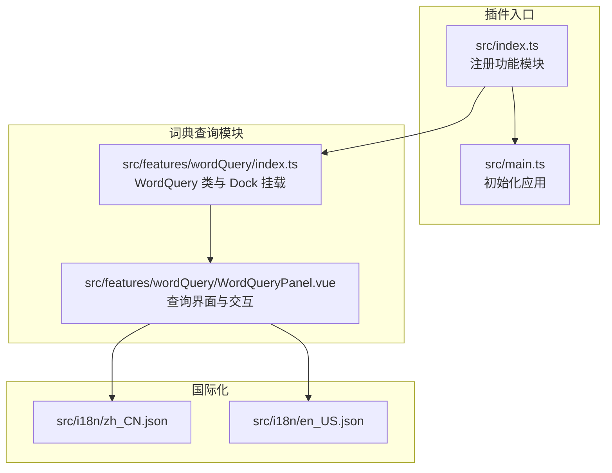
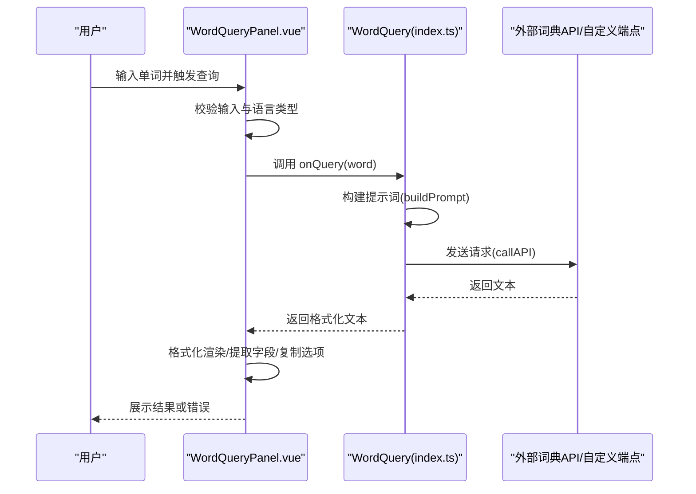
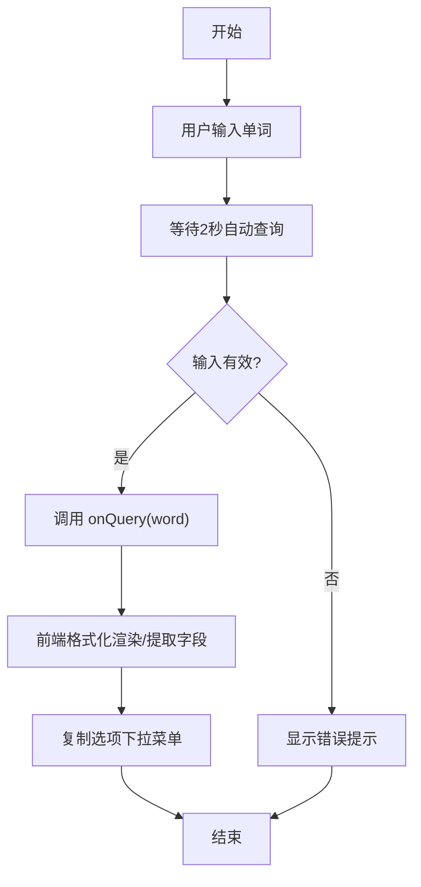
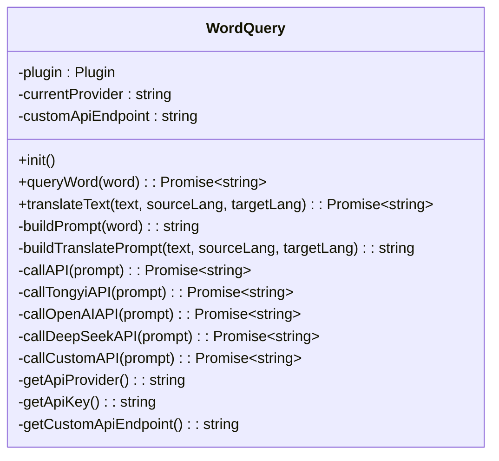
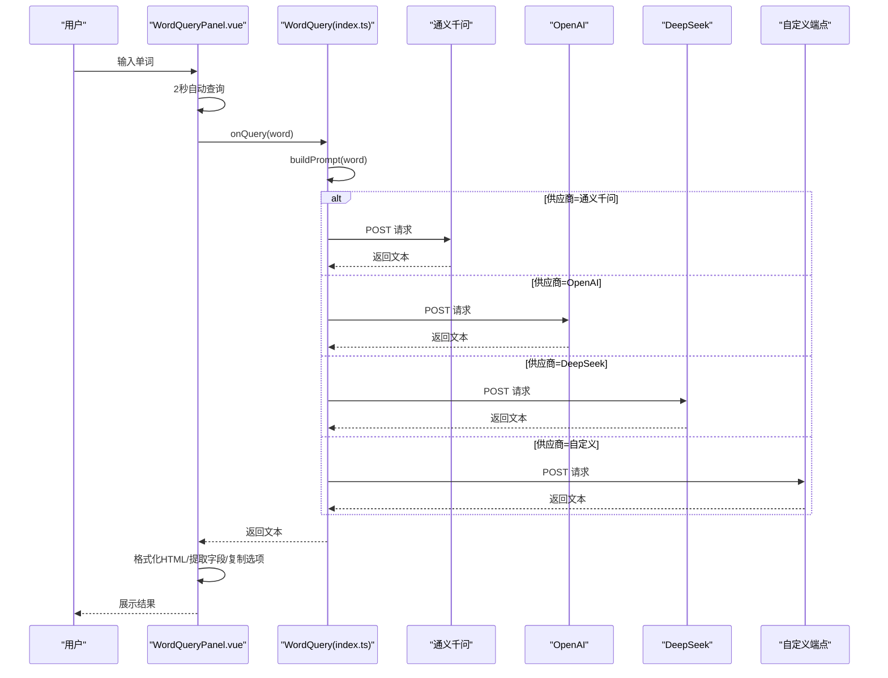
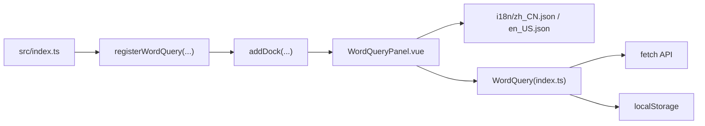

# 词典查询

<cite>
**本文引用的文件**
- [src/features/wordQuery/WordQueryPanel.vue](file://src/features/wordQuery/WordQueryPanel.vue)
- [src/features/wordQuery/index.ts](file://src/features/wordQuery/index.ts)
- [src/index.ts](file://src/index.ts)
- [src/main.ts](file://src/main.ts)
- [src/i18n/zh_CN.json](file://src/i18n/zh_CN.json)
- [src/i18n/en_US.json](file://src/i18n/en_US.json)
- [src/api.ts](file://src/api.ts)
- [plugin.json](file://plugin.json)
</cite>

## 更新摘要
**变更内容**
- 新增双模式界面（单词查询和长文翻译）
- 扩展支持七种语言（中文、英文、日文、韩文、法文、德文、西班牙文）
- 实现自动语言检测功能
- 更新用户界面以符合GitHub设计语言
- 增加历史记录、收藏和高级选项功能

## 目录
1. [简介](#简介)
2. [项目结构](#项目结构)
3. [核心组件](#核心组件)
4. [架构总览](#架构总览)
5. [详细组件分析](#详细组件分析)
6. [依赖关系分析](#依赖关系分析)
7. [性能与可用性考量](#性能与可用性考量)
8. [故障排查指南](#故障排查指南)
9. [结论](#结论)
10. [附录](#附录)

## 简介
本文件围绕“词典查询”功能，系统梳理 WordQueryPanel.vue 的界面设计与用户交互流程，解释 index.ts 如何集成外部词典 API（通义千问、OpenAI、DeepSeek、自定义）或本地词库实现单词查询和长文翻译，并给出从用户输入到结果显示的完整数据流分析，涵盖网络请求处理、错误状态管理、离线查询支持与缓存策略建议，以及扩展方向（多语言词典、发音功能）与常见问题处理方案。

## 项目结构
词典查询功能位于 src/features/wordQuery 目录，由两个核心文件组成：
- WordQueryPanel.vue：词典查询的前端界面与交互逻辑
- index.ts：后端集成与 API 调用封装，负责 Dock 面板挂载、提示词构建、API 调用与错误处理

此外，插件入口通过 src/index.ts 注册功能模块，确保在启用状态下挂载词典查询面板。

图表来源
- [src/index.ts](file://src/index.ts#L73-L126)
- [src/main.ts](file://src/main.ts#L21-L38)
- [src/features/wordQuery/index.ts](file://src/features/wordQuery/index.ts#L101-L147)
- [src/features/wordQuery/WordQueryPanel.vue](file://src/features/wordQuery/WordQueryPanel.vue#L1-L159)
- [src/i18n/zh_CN.json](file://src/i18n/zh_CN.json#L120-L151)
- [src/i18n/en_US.json](file://src/i18n/en_US.json#L120-L151)

章节来源
- [src/index.ts](file://src/index.ts#L73-L126)
- [src/main.ts](file://src/main.ts#L21-L38)
- [src/features/wordQuery/index.ts](file://src/features/wordQuery/index.ts#L101-L147)
- [src/features/wordQuery/WordQueryPanel.vue](file://src/features/wordQuery/WordQueryPanel.vue#L1-L159)
- [src/i18n/zh_CN.json](file://src/i18n/zh_CN.json#L120-L151)
- [src/i18n/en_US.json](file://src/i18n/en_US.json#L120-L151)

## 核心组件
- WordQueryPanel.vue
  - 双模式界面：支持单词查询和长文翻译两种模式，通过标签页切换
  - 语言选择：支持七种语言（中文、英文、日文、韩文、法文、德文、西班牙文）及自动语言检测
  - 输入框与查询按钮：支持回车触发查询，自动延时查询（2 秒），支持快捷键 Ctrl/Cmd+Enter
  - API 配置设置：支持供应商切换（通义千问、OpenAI、DeepSeek、自定义）、API 密钥输入与可见性切换、自定义端点
  - 结果展示：Markdown 风格格式化渲染，字段分区显示，复制选项下拉菜单（全部、音标/拼音、释义、英文、谐音、例句）
  - 错误与空态：加载中、错误提示、空状态提示
  - 本地存储：API 供应商、密钥、自定义端点持久化
- WordQuery（index.ts）
  - Dock 面板挂载：右侧边栏添加“单词查询”面板
  - 提示词构建：根据输入语言类型（英文/中文/混合）构造不同提示词模板
  - API 调用：支持通义千问、OpenAI、DeepSeek、自定义端点，统一返回格式化文本
  - 错误处理：网络异常、响应格式错误、消息提示
  - 本地存储：读取/写入 API 供应商、密钥、自定义端点
  - 翻译功能：支持多语言文本翻译，集成自动语言检测

章节来源
- [src/features/wordQuery/WordQueryPanel.vue](file://src/features/wordQuery/WordQueryPanel.vue#L1-L159)
- [src/features/wordQuery/WordQueryPanel.vue](file://src/features/wordQuery/WordQueryPanel.vue#L161-L548)
- [src/features/wordQuery/index.ts](file://src/features/wordQuery/index.ts#L1-L92)
- [src/features/wordQuery/index.ts](file://src/features/wordQuery/index.ts#L101-L147)
- [src/features/wordQuery/index.ts](file://src/features/wordQuery/index.ts#L163-L193)
- [src/features/wordQuery/index.ts](file://src/features/wordQuery/index.ts#L195-L325)
- [src/features/wordQuery/index.ts](file://src/features/wordQuery/index.ts#L327-L558)

## 架构总览
词典查询采用“前端界面 + 后端集成”的双层架构：
- 前端界面层：WordQueryPanel.vue 负责用户交互、结果渲染与本地配置
- 后端集成层：WordQuery 类负责 Dock 挂载、提示词构建、API 调用与错误处理
- 数据流：用户输入 -> 前端校验 -> 触发 onQuery 回调 -> 后端构建提示词 -> 调用外部 API -> 返回文本 -> 前端格式化渲染

图表来源
- [src/features/wordQuery/WordQueryPanel.vue](file://src/features/wordQuery/WordQueryPanel.vue#L287-L317)
- [src/features/wordQuery/index.ts](file://src/features/wordQuery/index.ts#L167-L193)
- [src/features/wordQuery/index.ts](file://src/features/wordQuery/index.ts#L195-L325)
- [src/features/wordQuery/index.ts](file://src/features/wordQuery/index.ts#L327-L558)

## 详细组件分析

### WordQueryPanel.vue 组件分析
- 界面布局
  - 顶部操作栏：包含模式标签页（单词查询/长文翻译）、历史记录、收藏和高级选项按钮
  - 单词查询模式：输入框、查询按钮、API 设置入口、结果展示区
  - 长文翻译模式：原文输入区（支持语言选择）、翻译方向交换按钮、译文输出区
  - 功能面板：历史记录面板、收藏面板、高级选项面板（发音设置、自动播放、相关词推荐）
- 交互逻辑
  - 模式切换：通过标签页在单词查询和长文翻译之间切换
  - 自动查询：监听输入变化，2 秒后自动触发查询
  - 快捷键：Ctrl/Cmd+Enter 执行查询或翻译；Esc 清除结果并关闭下拉菜单
  - 点击外部关闭下拉菜单
  - 复制：根据下拉菜单选择复制对应字段或全部
  - 清除：清空结果与错误
  - 语言交换：在翻译模式下交换源语言和目标语言
- 数据处理
  - 格式化：将 Markdown 风格标题、换行、加粗等转换为 HTML 并分区显示
  - 字段提取：从结果文本中提取音标/拼音、释义、英文、谐音、例句、全部
  - 本地存储：API 供应商、密钥、自定义端点、历史记录、收藏、高级选项持久化
- 错误与状态
  - 输入校验：空输入、非法字符
  - 加载状态：按钮禁用、旋转指示器
  - 错误提示：消息提示与错误区域

图表来源
- [src/features/wordQuery/WordQueryPanel.vue](file://src/features/wordQuery/WordQueryPanel.vue#L287-L317)
- [src/features/wordQuery/WordQueryPanel.vue](file://src/features/wordQuery/WordQueryPanel.vue#L189-L252)
- [src/features/wordQuery/WordQueryPanel.vue](file://src/features/wordQuery/WordQueryPanel.vue#L466-L497)

章节来源
- [src/features/wordQuery/WordQueryPanel.vue](file://src/features/wordQuery/WordQueryPanel.vue#L1-L159)
- [src/features/wordQuery/WordQueryPanel.vue](file://src/features/wordQuery/WordQueryPanel.vue#L161-L548)

### WordQuery（index.ts）组件分析
- Dock 挂载
  - 在右侧边栏添加“单词查询”面板，初始化时注入 i18n、onQuery、onTranslate、onApiKeyChange、onProviderChange
- 提示词构建
  - 英文单词：要求英式音标、中文谐音、释义、发音要点、例句
  - 中文词语：要求英文翻译、英式音标、中文谐音、释义、发音要点、例句
  - 混合/智能判断：根据中英文字符分布选择处理方式
- API 调用
  - 通义千问：dashscope aliyuncs.com
  - OpenAI：api.openai.com
  - DeepSeek：api.deepseek.com
  - 自定义：使用自定义端点，兼容 OpenAI 兼容格式
- 错误处理
  - 网络错误：HTTP 非 OK，读取响应文本并抛出错误
  - 响应格式错误：尝试多种可能的字段（choices/message/content/text）
  - 用户提示：消息提示组件反馈查询状态与错误信息
- 本地存储
  - API 供应商、密钥、自定义端点读取/写入
- 翻译功能
  - 支持七种语言（中文、英文、日文、韩文、法文、德文、西班牙文）
  - 自动语言检测：源语言可设置为自动检测
  - 构建翻译提示词：根据源语言和目标语言生成翻译请求

图表来源
- [src/features/wordQuery/index.ts](file://src/features/wordQuery/index.ts#L1-L92)
- [src/features/wordQuery/index.ts](file://src/features/wordQuery/index.ts#L163-L193)
- [src/features/wordQuery/index.ts](file://src/features/wordQuery/index.ts#L195-L325)
- [src/features/wordQuery/index.ts](file://src/features/wordQuery/index.ts#L327-L558)

章节来源
- [src/features/wordQuery/index.ts](file://src/features/wordQuery/index.ts#L1-L92)
- [src/features/wordQuery/index.ts](file://src/features/wordQuery/index.ts#L101-L147)
- [src/features/wordQuery/index.ts](file://src/features/wordQuery/index.ts#L163-L193)
- [src/features/wordQuery/index.ts](file://src/features/wordQuery/index.ts#L195-L325)
- [src/features/wordQuery/index.ts](file://src/features/wordQuery/index.ts#L327-L558)

### 从用户输入到结果显示的完整数据流
- 用户输入：WordQueryPanel.vue 监听输入变化，2 秒后触发 handleQuery
- 输入校验：空输入、非法字符校验，错误通过消息提示与错误区域展示
- 触发查询：调用 props.onQuery(word)，即 WordQuery.queryWord(word)
- 提示词构建：根据输入语言类型构建提示词模板
- API 调用：根据供应商选择对应接口，发送请求并处理响应
- 结果返回：返回格式化文本
- 前端渲染：WordQueryPanel.vue 格式化 HTML、提取字段、渲染结果与复制选项
- 错误处理：网络异常、响应格式错误、消息提示

图表来源
- [src/features/wordQuery/WordQueryPanel.vue](file://src/features/wordQuery/WordQueryPanel.vue#L287-L317)
- [src/features/wordQuery/index.ts](file://src/features/wordQuery/index.ts#L167-L193)
- [src/features/wordQuery/index.ts](file://src/features/wordQuery/index.ts#L327-L558)

章节来源
- [src/features/wordQuery/WordQueryPanel.vue](file://src/features/wordQuery/WordQueryPanel.vue#L287-L317)
- [src/features/wordQuery/index.ts](file://src/features/wordQuery/index.ts#L167-L193)
- [src/features/wordQuery/index.ts](file://src/features/wordQuery/index.ts#L327-L558)

## 依赖关系分析
- 插件入口依赖：src/index.ts 动态注册词典查询模块，依据配置决定是否启用
- 前端依赖：WordQueryPanel.vue 依赖 i18n 语言包与 siyuan 消息提示
- 后端依赖：WordQuery 类依赖 fetch 发起网络请求，兼容多种外部 API
- 存储依赖：localStorage 用于持久化 API 供应商、密钥、自定义端点、历史记录、收藏和高级选项

图表来源
- [src/index.ts](file://src/index.ts#L73-L126)
- [src/features/wordQuery/index.ts](file://src/features/wordQuery/index.ts#L101-L147)
- [src/features/wordQuery/WordQueryPanel.vue](file://src/features/wordQuery/WordQueryPanel.vue#L1-L159)
- [src/i18n/zh_CN.json](file://src/i18n/zh_CN.json#L120-L151)
- [src/i18n/en_US.json](file://src/i18n/en_US.json#L120-L151)

章节来源
- [src/index.ts](file://src/index.ts#L73-L126)
- [src/features/wordQuery/index.ts](file://src/features/wordQuery/index.ts#L101-L147)
- [src/features/wordQuery/WordQueryPanel.vue](file://src/features/wordQuery/WordQueryPanel.vue#L1-L159)
- [src/i18n/zh_CN.json](file://src/i18n/zh_CN.json#L120-L151)
- [src/i18n/en_US.json](file://src/i18n/en_US.json#L120-L151)

## 性能与可用性考量
- 自动查询延迟：2 秒自动查询减少频繁请求，提升用户体验
- 前端格式化：轻量正则替换实现 Markdown 到 HTML 的转换，避免复杂渲染
- 错误处理：网络错误与响应格式错误均有明确提示，降低用户困惑
- 本地存储：API 供应商、密钥、自定义端点、历史记录、收藏、高级选项持久化，减少重复配置成本
- 复制功能：支持按字段复制，提高信息复用效率
- 语言检测：自动语言检测减少用户手动选择语言的负担

[本节为通用性能讨论，无需列出具体文件来源]

## 故障排查指南
- 查询超时或网络错误
  - 现象：消息提示“查询失败”，错误区域显示错误信息
  - 排查：检查网络连通性、API 密钥有效性、供应商选择是否正确
  - 处理：切换供应商、重新输入密钥、检查自定义端点
- 结果格式错误
  - 现象：前端无法解析或渲染异常
  - 排查：确认外部 API 返回结构符合预期（choices/message/content/text）
  - 处理：在后端增加对返回字段的兼容判断或调整提示词
- 复制失败
  - 现象：复制到剪贴板失败
  - 排查：浏览器权限、HTTPS 环境、剪贴板 API 支持
  - 处理：使用备用复制方式或提示用户手动复制
- 输入无效
  - 现象：提示“请输入有效的单词或词语”
  - 排查：输入字符合法性校验
  - 处理：仅允许中英文、数字、常见标点与空格

章节来源
- [src/features/wordQuery/WordQueryPanel.vue](file://src/features/wordQuery/WordQueryPanel.vue#L287-L317)
- [src/features/wordQuery/index.ts](file://src/features/wordQuery/index.ts#L327-L558)

## 结论
词典查询功能通过清晰的前后端分离设计，实现了从用户输入到结果展示的完整闭环。前端负责交互与渲染，后端负责提示词构建与 API 调用，二者通过 props/onQuery 回调解耦协作。该设计具备良好的扩展性，可轻松接入更多外部词典 API 或本地词库，并支持多语言与发音增强等功能。

[本节为总结性内容，无需列出具体文件来源]

## 附录

### 离线查询支持与缓存策略建议
- 离线查询
  - 本地词库：可引入本地词典数据库（如 SQLite 或内存字典），在无网络时优先查询本地
  - 本地缓存：将最近查询结果缓存至 localStorage，减少重复请求
- 缓存策略
  - TTL 过期：为缓存条目设置过期时间，到期后自动刷新
  - 命中优先：优先命中缓存，再发起网络请求
  - 失败回退：网络失败时回退到本地缓存
- 交互优化
  - 显示缓存状态：在结果区显示“来自缓存”提示
  - 手动刷新：提供刷新按钮强制拉取最新数据

[本节为扩展建议，无需列出具体文件来源]

### 扩展建议
- 多语言词典
  - 支持多语种提示词模板，适配不同语言的音标、释义与例句格式
  - 引入多语言词典 API（如有道、欧路词典等）作为备选供应商
- 发音功能
  - 集成语音合成（TTS）或音频播放，支持英式音标发音
  - 提供“播放发音”按钮，点击后播放对应音标或例句
- 结果增强
  - 例句翻译：提供中英对照例句
  - 记忆技巧：添加谐音记忆法、词根词缀解析等辅助学习内容
- 个性化
  - 自定义提示词模板：允许用户自定义输出格式与字段
  - 查询历史：记录最近查询，支持快速回看

[本节为扩展建议，无需列出具体文件来源]