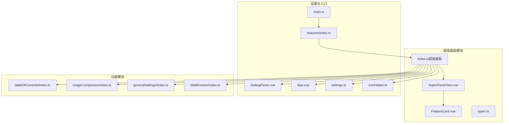
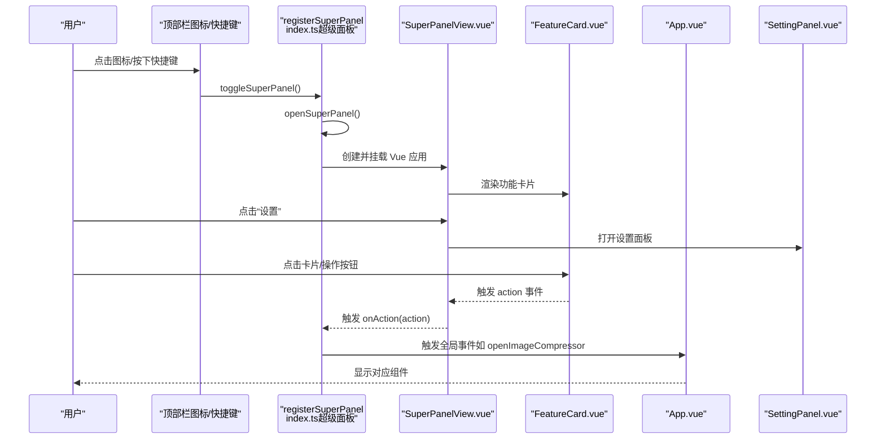
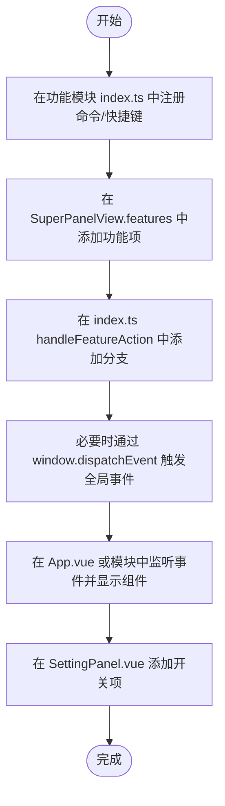
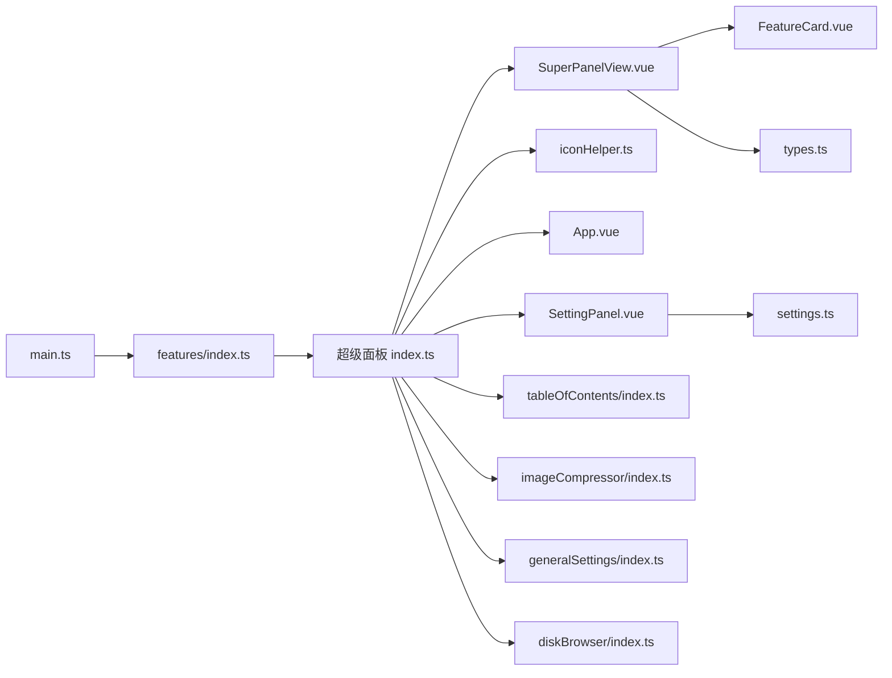

# 超级面板

<cite>
**本文引用的文件**
- [SuperPanelView.vue](file://src/features/superPanel/SuperPanelView.vue)
- [FeatureCard.vue](file://src/features/superPanel/components/FeatureCard.vue)
- [index.ts（超级面板）](file://src/features/superPanel/index.ts)
- [types.ts（超级面板）](file://src/features/superPanel/types.ts)
- [SettingPanel.vue](file://src/components/SettingPanel.vue)
- [index.ts（功能总入口）](file://src/features/index.ts)
- [index.ts（目录索引）](file://src/features/tableOfContents/index.ts)
- [index.ts（图片压缩）](file://src/features/imageCompressor/index.ts)
- [index.ts（通用设置）](file://src/features/generalSettings/index.ts)
- [index.ts（本地磁盘）](file://src/features/diskBrowser/index.ts)
- [App.vue](file://src/App.vue)
- [settings.ts（配置）](file://src/config/settings.ts)
- [iconHelper.ts（图标工具）](file://src/utils/iconHelper.ts)
- [main.ts（插件入口）](file://src/main.ts)
</cite>

## 更新摘要
**变更内容**
- 根据最新代码更新了超级面板的UI布局与样式细节，包括面板尺寸、动画效果、响应式适配等
- 优化了功能卡片（FeatureCard）的视觉样式，包括边框、阴影、悬停效果和布局间距
- 新增了AI配置面板的样式与交互说明
- 更新了性能优化建议，反映最新的懒加载与渲染策略
- 修正了故障排查指南中的部分描述以匹配当前实现

## 目录
1. [简介](#简介)
2. [项目结构](#项目结构)
3. [核心组件](#核心组件)
4. [架构总览](#架构总览)
5. [详细组件分析](#详细组件分析)
6. [依赖关系分析](#依赖关系分析)
7. [性能考虑](#性能考虑)
8. [故障排查指南](#故障排查指南)
9. [结论](#结论)
10. [附录](#附录)

## 简介
超级面板是插件的功能统一入口，位于右侧边栏，以卡片形式聚合所有功能模块，提供一键访问与快捷操作。其核心职责包括：
- 作为插件功能的“总控台”，集中展示各功能模块的状态与入口
- 通过 FeatureCard 组件实现可复用、可扩展的卡片式 UI 设计
- 通过 index.ts 实现模块化注册与事件驱动的交互流程
- 与 SettingPanel.vue 协作，实现“功能开关”与“设置面板”的联动

## 项目结构
超级面板位于 features/superPanel 目录下，采用“视图 + 组件 + 类型 + 注册入口”的分层组织方式；同时与 App.vue、SettingPanel.vue、各功能模块的 index.ts 文件协同工作，形成完整的插件生态。

**图表来源**
- [SuperPanelView.vue](file://src/features/superPanel/SuperPanelView.vue#L1-L866)
- [FeatureCard.vue](file://src/features/superPanel/components/FeatureCard.vue#L1-L174)
- [index.ts（超级面板）](file://src/features/superPanel/index.ts#L1-L257)
- [types.ts（超级面板）](file://src/features/superPanel/types.ts#L1-L35)
- [SettingPanel.vue](file://src/components/SettingPanel.vue#L1-L180)
- [index.ts（功能总入口）](file://src/features/index.ts#L1-L15)
- [index.ts（目录索引）](file://src/features/tableOfContents/index.ts#L1-L60)
- [index.ts（图片压缩）](file://src/features/imageCompressor/index.ts#L1-L31)
- [index.ts（通用设置）](file://src/features/generalSettings/index.ts#L1-L80)
- [index.ts（本地磁盘）](file://src/features/diskBrowser/index.ts#L1-L51)
- [App.vue](file://src/App.vue#L1-L100)
- [settings.ts（配置）](file://src/config/settings.ts#L1-L60)
- [iconHelper.ts（图标工具）](file://src/utils/iconHelper.ts#L1-L75)
- [main.ts（插件入口）](file://src/main.ts#L1-L45)

**章节来源**
- [SuperPanelView.vue](file://src/features/superPanel/SuperPanelView.vue#L1-L866)
- [index.ts（超级面板）](file://src/features/superPanel/index.ts#L1-L257)
- [index.ts（功能总入口）](file://src/features/index.ts#L1-L15)
- [main.ts（插件入口）](file://src/main.ts#L1-L45)

## 核心组件
- SuperPanelView.vue：超级面板的视图容器，负责渲染功能卡片、处理遮罩与面板动画、转发用户交互事件（关闭、打开设置、功能动作）
- FeatureCard.vue：功能卡片组件，封装卡片的标题、描述、状态、操作按钮与点击行为
- index.ts（超级面板）：注册入口，负责在顶部栏添加图标与快捷键、创建/卸载 Vue 面板、处理功能动作事件
- types.ts（超级面板）：定义 Feature 与 FeatureAction 的类型结构
- SettingPanel.vue：插件设置面板，用于控制各功能模块的开关与保存
- features/index.ts：统一导出各功能模块的注册函数，便于主入口按需引入
- App.vue：顶层应用容器，承载 SettingPanel、ImageViewer、QRCodeDialog 等全局组件，并监听全局事件（如打开图片压缩器）

**章节来源**
- [SuperPanelView.vue](file://src/features/superPanel/SuperPanelView.vue#L1-L866)
- [FeatureCard.vue](file://src/features/superPanel/components/FeatureCard.vue#L1-L174)
- [index.ts（超级面板）](file://src/features/superPanel/index.ts#L1-L257)
- [types.ts（超级面板）](file://src/features/superPanel/types.ts#L1-L35)
- [SettingPanel.vue](file://src/components/SettingPanel.vue#L1-L180)
- [index.ts（功能总入口）](file://src/features/index.ts#L1-L15)
- [App.vue](file://src/App.vue#L1-L100)

## 架构总览
超级面板的交互流程如下：
- 用户点击顶部栏图标或按下快捷键，触发 toggleSuperPanel，创建 Vue 应用并挂载 SuperPanelView
- SuperPanelView 根据插件设置动态生成功能卡片列表，渲染 FeatureCard
- 用户点击“设置”按钮，SuperPanelView 触发 openSettings 事件，插件打开 SettingPanel
- 用户点击某功能卡片或卡片上的操作按钮，SuperPanelView 触发 action 事件，index.ts 分发到对应功能模块
- 对于需要打开对话框/面板的功能（如图片压缩），App.vue 监听全局事件并显示对应组件

**图表来源**
- [index.ts（超级面板）](file://src/features/superPanel/index.ts#L44-L257)
- [SuperPanelView.vue](file://src/features/superPanel/SuperPanelView.vue#L1-L866)
- [FeatureCard.vue](file://src/features/superPanel/components/FeatureCard.vue#L1-L174)
- [App.vue](file://src/App.vue#L120-L150)
- [SettingPanel.vue](file://src/components/SettingPanel.vue#L1-L180)

## 详细组件分析

### SuperPanelView.vue（UI 布局与交互）
- 结构要点
  - 遮罩层与面板容器使用过渡动画，增强交互体验
  - 头部包含标题与关闭按钮，右侧包含“AI配置”、“刷新”和“关闭”按钮
  - 内容区通过 v-for 渲染功能卡片，每个卡片绑定 i18n 与功能配置
  - 新增AI配置面板，支持切换API供应商、模型选择、密钥输入等
- 数据与状态
  - features 计算属性根据插件设置动态生成各功能项（含启用状态与操作按钮）
  - 支持多语言标题与描述，来源于 i18n
  - 面板宽度固定为720px，支持响应式适配（768px和480px断点）
- 事件流
  - 关闭面板：触发 close 事件
  - 打开设置：触发 openSettings 与 close 事件
  - 功能动作：转发子组件的 action 事件给父级处理
  - 刷新：触发 onRefresh 事件，重新加载面板
  - AI配置更新：触发 onUpdateAiSettings 事件，保存AI相关设置

**章节来源**
- [SuperPanelView.vue](file://src/features/superPanel/SuperPanelView.vue#L1-L866)

### FeatureCard.vue（可复用卡片设计）
- 设计模式
  - 通过 props 接收 feature 与 i18n，emit action 事件，实现“低耦合、高内聚”的组件复用
  - 状态样式随 enabled/disabled 切换，视觉反馈明确
- 交互细节
  - 当卡片被点击且功能未启用时，提示用户前往设置开启
  - 操作按钮仅在 enabled 且 actions 非空时显示，避免无效交互
- 可扩展性
  - 通过 iconKey 与 i18n，可轻松适配新图标与文案
- 样式优化
  - 卡片采用圆角边框（border-radius: 10px），背景色为 `var(--b3-theme-surface)`
  - 启用状态下悬停时显示轻微阴影和上浮效果（transform: translateY(-1px)）
  - 禁用状态降低透明度（opacity: 0.6）并禁用光标

**章节来源**
- [FeatureCard.vue](file://src/features/superPanel/components/FeatureCard.vue#L1-L174)

### types.ts（类型定义）
- FeatureAction：定义操作键名、标签与快捷键
- Feature：定义功能 ID、图标键名、标题、描述、启用状态与操作列表
- 为 SuperPanelView 与 FeatureCard 提供强类型约束，降低运行时错误风险

**章节来源**
- [types.ts（超级面板）](file://src/features/superPanel/types.ts#L1-L35)

### index.ts（超级面板注册与事件分发）
- 注册入口
  - 在顶部栏添加图标与快捷键，回调切换面板显示
  - 使用 iconHelper 将图标替换为 Iconify 图标
- 面板生命周期
  - openSuperPanel：创建容器、创建 Vue 应用、挂载 SuperPanelView 并传入 visible/settings/i18n
  - closeSuperPanel：卸载 Vue 应用并移除容器
- 功能动作分发
  - handleFeatureAction：根据 action 分发到对应命令或全局事件（如插入索引、打开图片压缩器等）
  - 未匹配的动作统一提示“功能开发中”
- 新增AI配置处理
  - handleUpdateAiSettings：处理AI相关设置更新，并通知相关模块同步配置

**章节来源**
- [index.ts（超级面板）](file://src/features/superPanel/index.ts#L1-L257)
- [iconHelper.ts（图标工具）](file://src/utils/iconHelper.ts#L1-L75)

### 与 SettingPanel.vue 的交互关系
- SuperPanelView 触发 openSettings 事件后，index.ts 调用 plugin.openSetting 打开设置面板
- SettingPanel.vue 通过 v-model 控制各功能开关，保存后由 App.vue 的 onSaveSettings 更新插件设置
- 插件设置来源于 settings.ts 中的 PluginSettings 接口，默认值与持久化逻辑在此处定义

**章节来源**
- [SettingPanel.vue](file://src/components/SettingPanel.vue#L1-L180)
- [settings.ts（配置）](file://src/config/settings.ts#L1-L60)
- [App.vue](file://src/App.vue#L40-L90)
- [index.ts（超级面板）](file://src/features/superPanel/index.ts#L1-L80)

### 新功能注册到超级面板的实践步骤
以下为新增功能模块到超级面板的完整流程（以“目录索引”为例）：
1. 在功能模块的 index.ts 中注册命令或快捷键（例如目录索引模块注册了三个命令）
2. 在超级面板的 features 计算属性中添加该功能项，设置 iconKey、标题、描述、enabled 与 actions
3. 在 index.ts 的 handleFeatureAction 中增加对该 action 的分支处理，必要时通过 window.dispatchEvent 触发全局事件
4. 在 App.vue 或对应模块中监听该事件并显示相应组件
5. 在 SettingPanel.vue 中添加对应的开关项，确保用户可在设置中启用/禁用该功能

**图表来源**
- [index.ts（目录索引）](file://src/features/tableOfContents/index.ts#L1-L60)
- [SuperPanelView.vue](file://src/features/superPanel/SuperPanelView.vue#L303-L432)
- [index.ts（超级面板）](file://src/features/superPanel/index.ts#L181-L221)
- [App.vue](file://src/App.vue#L120-L150)
- [SettingPanel.vue](file://src/components/SettingPanel.vue#L1-L180)

**章节来源**
- [index.ts（目录索引）](file://src/features/tableOfContents/index.ts#L1-L60)
- [SuperPanelView.vue](file://src/features/superPanel/SuperPanelView.vue#L303-L432)
- [index.ts（超级面板）](file://src/features/superPanel/index.ts#L181-L221)
- [App.vue](file://src/App.vue#L120-L150)
- [SettingPanel.vue](file://src/components/SettingPanel.vue#L1-L180)

## 依赖关系分析
- SuperPanelView 依赖 FeatureCard、IconWrapper 与 types.ts
- index.ts（超级面板）依赖 iconHelper、App.vue、SettingPanel.vue 与各功能模块的 index.ts
- features/index.ts 统一导出各功能模块注册函数，main.ts 通过 features/index.ts 引入并初始化
- SettingPanel.vue 依赖 settings.ts 进行配置读写

**图表来源**
- [index.ts（超级面板）](file://src/features/superPanel/index.ts#L1-L257)
- [SuperPanelView.vue](file://src/features/superPanel/SuperPanelView.vue#L1-L866)
- [FeatureCard.vue](file://src/features/superPanel/components/FeatureCard.vue#L1-L174)
- [types.ts（超级面板）](file://src/features/superPanel/types.ts#L1-L35)
- [iconHelper.ts（图标工具）](file://src/utils/iconHelper.ts#L1-L75)
- [App.vue](file://src/App.vue#L1-L100)
- [SettingPanel.vue](file://src/components/SettingPanel.vue#L1-L180)
- [index.ts（功能总入口）](file://src/features/index.ts#L1-L15)
- [index.ts（目录索引）](file://src/features/tableOfContents/index.ts#L1-L60)
- [index.ts（图片压缩）](file://src/features/imageCompressor/index.ts#L1-L31)
- [index.ts（通用设置）](file://src/features/generalSettings/index.ts#L1-L80)
- [index.ts（本地磁盘）](file://src/features/diskBrowser/index.ts#L1-L51)
- [settings.ts（配置）](file://src/config/settings.ts#L1-L60)
- [main.ts（插件入口）](file://src/main.ts#L1-L45)

**章节来源**
- [index.ts（超级面板）](file://src/features/superPanel/index.ts#L1-L257)
- [index.ts（功能总入口）](file://src/features/index.ts#L1-L15)
- [main.ts（插件入口）](file://src/main.ts#L1-L45)

## 性能考虑
- 渲染效率
  - SuperPanelView 通过 computed 生成 features，避免重复计算；FeatureCard 使用 v-for + key，保证列表渲染稳定性
  - 面板容器与遮罩层使用过渡动画，建议保持动画时长与缓动函数简洁，避免复杂阴影或滤镜
- 懒加载策略
  - 对于需要额外组件的模块（如图片压缩器），建议采用动态导入（import()）在用户点击时再加载对应组件，减少初始包体与首屏渲染压力
  - 对于大量功能卡片的场景，可考虑虚拟滚动或分组折叠，降低 DOM 数量
- 事件与内存
  - closeSuperPanel 会卸载 Vue 应用并移除容器，避免内存泄漏
  - SettingPanel.vue 在 onMounted/onBeforeUnmount 中清理定时器，确保组件生命周期内资源释放

**章节来源**
- [SuperPanelView.vue](file://src/features/superPanel/SuperPanelView.vue#L1-L866)
- [index.ts（超级面板）](file://src/features/superPanel/index.ts#L85-L257)
- [SettingPanel.vue](file://src/components/SettingPanel.vue#L238-L274)

## 故障排查指南
- 功能卡片不显示
  - 检查插件设置中对应功能的开关是否开启（SettingPanel.vue 的开关项）
  - 确认 SuperPanelView.features 中该功能项的 enabled 字段与插件设置一致
  - 若使用 i18n，确认 i18n 对应键是否存在
- 点击无响应
  - 若卡片被禁用，FeatureCard 会在点击时提示“该功能未启用，请在设置中开启”
  - 若启用但点击无效，检查 index.ts 的 handleFeatureAction 是否包含对应 action 分支
  - 对于需要打开对话框的功能，确认 App.vue 是否监听到对应全局事件
- 图标显示异常
  - 确认 iconHelper 已正确替换顶部栏图标，检查 Iconify API 可用性
- 面板无法关闭
  - 检查 closeSuperPanel 是否被调用，确认 Vue 应用已卸载且容器已移除

**章节来源**
- [FeatureCard.vue](file://src/features/superPanel/components/FeatureCard.vue#L53-L60)
- [index.ts（超级面板）](file://src/features/superPanel/index.ts#L181-L221)
- [App.vue](file://src/App.vue#L120-L150)
- [SettingPanel.vue](file://src/components/SettingPanel.vue#L1-L180)
- [iconHelper.ts（图标工具）](file://src/utils/iconHelper.ts#L1-L75)

## 结论
超级面板通过统一的 UI 卡片与事件分发机制，实现了插件功能的模块化集成与便捷访问。其可复用的 FeatureCard 组件与清晰的注册流程，使得新增功能模块变得简单高效。配合 SettingPanel 的开关控制与 App.vue 的全局事件处理，形成了从“入口 -> 设置 -> 功能执行”的完整闭环。

## 附录
- 新增功能模块到超级面板的关键步骤
  - 在功能模块 index.ts 中注册命令/快捷键
  - 在 SuperPanelView.features 中添加功能项
  - 在 index.ts handleFeatureAction 中添加分支处理
  - 在 App.vue 或模块中监听事件并显示组件
  - 在 SettingPanel.vue 添加开关项

**章节来源**
- [index.ts（目录索引）](file://src/features/tableOfContents/index.ts#L1-L60)
- [SuperPanelView.vue](file://src/features/superPanel/SuperPanelView.vue#L303-L432)
- [index.ts（超级面板）](file://src/features/superPanel/index.ts#L181-L221)
- [App.vue](file://src/App.vue#L120-L150)
- [SettingPanel.vue](file://src/components/SettingPanel.vue#L1-L180)