# 通用设置

<cite>
**本文引用的文件**
- [GeneralSettingsPanel.vue](file://src/features/generalSettings/GeneralSettingsPanel.vue)
- [AppearanceSettings.vue](file://src/features/generalSettings/modules/AppearanceSettings.vue)
- [ModuleManager.ts](file://src/features/generalSettings/modules/ModuleManager.ts)
- [FontSettings.vue](file://src/features/generalSettings/components/FontSettings.vue)
- [CodeBlockSettings.vue](file://src/features/generalSettings/components/CodeBlockSettings.vue)
- [PasswordSettings.vue](file://src/features/generalSettings/components/PasswordSettings.vue)
- [GeneralActions.vue](file://src/features/generalSettings/components/GeneralActions.vue)
- [EncryptionSettings.vue](file://src/features/generalSettings/components/EncryptionSettings.vue)
- [HeadingSettings.vue](file://src/features/generalSettings/components/HeadingSettings.vue)
- [ListSettings.vue](file://src/features/generalSettings/components/ListSettings.vue)
- [settings.ts](file://src/config/settings.ts)
- [index.ts（通用设置）](file://src/features/generalSettings/index.ts)
- [main.ts](file://src/main.ts)
- [README.md（通用设置）](file://src/features/generalSettings/README.md)
- [zh_CN.json](file://src/i18n/zh_CN.json)
</cite>

## 更新摘要
**已修改内容**
- 更新了简介、项目结构、核心组件等章节，以反映新增的加密设置、标题设置、列表设置和代码块设置
- 新增了加密设置、标题设置、列表设置和代码块设置的详细分析
- 更新了架构总览和详细组件分析中的图表和内容
- 更新了配置持久化流程和用户体验设计部分

## 目录
1. [简介](#简介)
2. [项目结构](#项目结构)
3. [核心组件](#核心组件)
4. [架构总览](#架构总览)
5. [详细组件分析](#详细组件分析)
6. [依赖关系分析](#依赖关系分析)
7. [性能考量](#性能考量)
8. [故障排查指南](#故障排查指南)
9. [结论](#结论)
10. [附录](#附录)

## 简介
本文件面向“通用设置”功能，系统性阐述其作为插件配置中心的角色与实现方式。通用设置提供统一的右侧边栏 Dock，整合字体、代码块美化、密码、通用操作、加密设置、标题设置、列表设置等子模块；通过响应式系统实时更新 UI 主题与编辑器样式；并通过本地存储与插件配置实现设置持久化。同时，文档覆盖模块化设计、动态加载机制、用户体验设计（分组与默认值）、以及常见问题的诊断与恢复方案。

## 项目结构
通用设置位于 features/generalSettings 目录下，采用“主面板 + 子模块”的组织方式：
- 主面板：GeneralSettingsPanel.vue，负责聚合各子模块并向上游转发变更事件
- 子模块：
  - 字体设置：FontSettings.vue
  - 代码块美化：CodeBlockSettings.vue
  - 密码设置：PasswordSettings.vue
  - 通用操作：GeneralActions.vue
  - 加密设置：EncryptionSettings.vue
  - 标题设置：HeadingSettings.vue
  - 列表设置：ListSettings.vue
- 模块管理：AppearanceSettings.vue（外观设置示例）、ModuleManager.ts（模块注册与排序）
- 配置与持久化：settings.ts（插件配置与字体/代码块/标题/列表设置的本地存储）
- 注册与集成：index.ts（通用设置模块），index.ts（插件入口），main.ts（插件初始化）

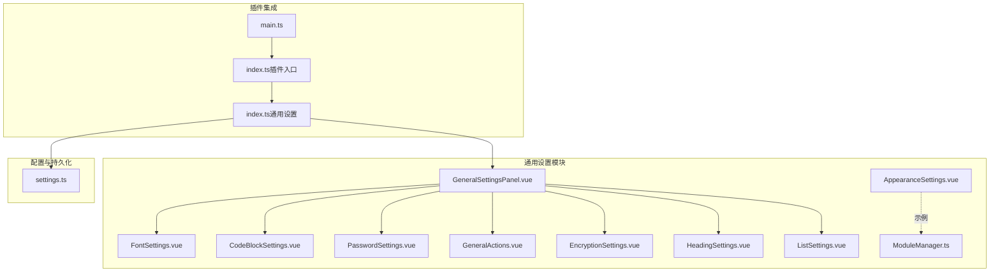

图表来源
- [GeneralSettingsPanel.vue](file://src/features/generalSettings/GeneralSettingsPanel.vue#L1-L120)
- [FontSettings.vue](file://src/features/generalSettings/components/FontSettings.vue#L1-L120)
- [CodeBlockSettings.vue](file://src/features/generalSettings/components/CodeBlockSettings.vue#L1-L120)
- [PasswordSettings.vue](file://src/features/generalSettings/components/PasswordSettings.vue#L1-L120)
- [GeneralActions.vue](file://src/features/generalSettings/components/GeneralActions.vue#L1-L120)
- [EncryptionSettings.vue](file://src/features/generalSettings/components/EncryptionSettings.vue#L1-L120)
- [HeadingSettings.vue](file://src/features/generalSettings/components/HeadingSettings.vue#L1-L120)
- [ListSettings.vue](file://src/features/generalSettings/components/ListSettings.vue#L1-L120)
- [AppearanceSettings.vue](file://src/features/generalSettings/modules/AppearanceSettings.vue#L1-L120)
- [ModuleManager.ts](file://src/features/generalSettings/modules/ModuleManager.ts#L1-L60)
- [settings.ts](file://src/config/settings.ts#L1-L141)
- [index.ts（通用设置）](file://src/features/generalSettings/index.ts#L1-L120)
- [index.ts（插件入口）](file://src/index.ts#L1-L139)
- [main.ts](file://src/main.ts#L1-L45)

章节来源
- [README.md（通用设置）](file://src/features/generalSettings/README.md#L1-L120)
- [GeneralSettingsPanel.vue](file://src/features/generalSettings/GeneralSettingsPanel.vue#L1-L120)
- [settings.ts](file://src/config/settings.ts#L1-L141)
- [index.ts（通用设置）](file://src/features/generalSettings/index.ts#L1-L120)
- [index.ts（插件入口）](file://src/index.ts#L1-L139)
- [main.ts](file://src/main.ts#L1-L45)

## 核心组件
- 通用设置面板（GeneralSettingsPanel.vue）
  - 聚合字体、代码块、密码、通用操作、加密设置、标题设置、列表设置七个子模块
  - 通过事件向父组件传递模块变更，包含模块标识与设置对象
- 通用设置类（GeneralSettings）
  - 注册右侧边栏 Dock，挂载 Vue 应用
  - 处理设置变更：应用字体样式、代码块样式、标题样式、列表样式
  - 提供重置字体设置、重置思源元素样式的辅助能力
- 模块管理器（ModuleManager.ts）
  - 定义 SettingsModule 接口，提供注册、排序、启用/禁用、查询、移除等能力
- 配置与持久化（settings.ts）
  - 插件配置接口与默认值
  - 字体设置、代码块设置、标题设置、列表设置的本地存储读写
- 子模块
  - FontSettings.vue：字体族、字号、粗细、行高、预览与保存/重置
  - CodeBlockSettings.vue：代码块风格、字号、内边距、预览与自动保存
  - PasswordSettings.vue：密码状态检测与触发密码对话框
  - GeneralActions.vue：刷新页面、打开工作区、关闭所有页签、系统信息
  - EncryptionSettings.vue：密码设置、密码状态显示、密码加密提示
  - HeadingSettings.vue：标题风格、字体大小、颜色、层级显示、居中对齐
  - ListSettings.vue：无序列表符号、有序列表格式、符号大小、左边距

章节来源
- [GeneralSettingsPanel.vue](file://src/features/generalSettings/GeneralSettingsPanel.vue#L1-L120)
- [index.ts（通用设置）](file://src/features/generalSettings/index.ts#L1-L120)
- [ModuleManager.ts](file://src/features/generalSettings/modules/ModuleManager.ts#L1-L99)
- [settings.ts](file://src/config/settings.ts#L1-L141)
- [FontSettings.vue](file://src/features/generalSettings/components/FontSettings.vue#L1-L200)
- [CodeBlockSettings.vue](file://src/features/generalSettings/components/CodeBlockSettings.vue#L1-L200)
- [PasswordSettings.vue](file://src/features/generalSettings/components/PasswordSettings.vue#L1-L120)
- [GeneralActions.vue](file://src/features/generalSettings/components/GeneralActions.vue#L1-L120)
- [EncryptionSettings.vue](file://src/features/generalSettings/components/EncryptionSettings.vue#L1-L120)
- [HeadingSettings.vue](file://src/features/generalSettings/components/HeadingSettings.vue#L1-L200)
- [ListSettings.vue](file://src/features/generalSettings/components/ListSettings.vue#L1-L200)

## 架构总览
通用设置采用“插件 Dock + 主面板 + 子模块”的分层架构：
- 插件入口在 onload 中加载配置并按开关注册通用设置模块
- 通用设置模块在 init 中创建 Dock 并挂载 Vue 应用
- 主面板负责子模块的组合与事件转发
- 子模块各自维护本地状态与默认值，并通过事件通知主面板
- 主面板根据模块标识调用相应样式应用逻辑
- settings.ts 提供插件配置与字体/代码块/标题/列表设置的持久化

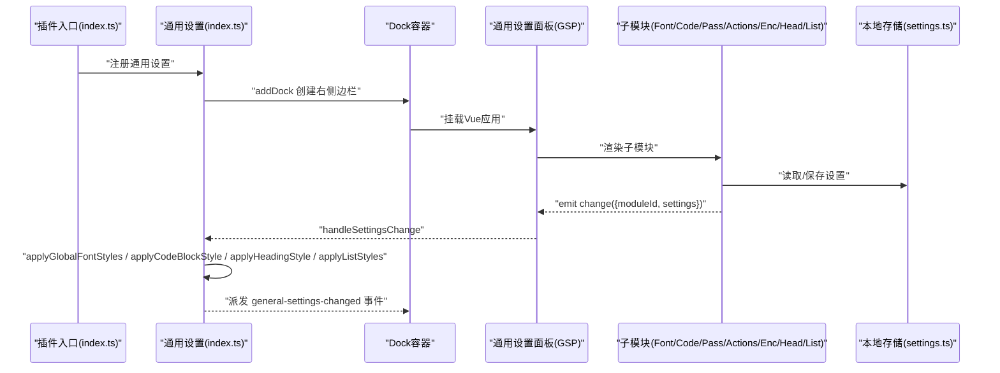

图表来源
- [index.ts（插件入口）](file://src/index.ts#L1-L139)
- [index.ts（通用设置）](file://src/features/generalSettings/index.ts#L1-L120)
- [GeneralSettingsPanel.vue](file://src/features/generalSettings/GeneralSettingsPanel.vue#L1-L120)
- [settings.ts](file://src/config/settings.ts#L1-L141)

章节来源
- [index.ts（插件入口）](file://src/index.ts#L1-L139)
- [index.ts（通用设置）](file://src/features/generalSettings/index.ts#L1-L120)
- [GeneralSettingsPanel.vue](file://src/features/generalSettings/GeneralSettingsPanel.vue#L1-L120)
- [settings.ts](file://src/config/settings.ts#L1-L141)

## 详细组件分析

### 通用设置面板（GeneralSettingsPanel.vue）
- 结构与分组
  - 将设置划分为“字体设置”、“代码块美化”、“标题配置”、“列表设置”、“密码设置”、“加密设置”、“通用操作”七大区块，每个区块包含标题与图标
  - 使用统一的容器与样式，保证视觉一致性与响应式布局
- 事件与数据流
  - 字体、代码块、标题、列表、通用操作分别通过事件回调将变更上报，携带模块标识与设置对象
  - 主面板暴露方法给父组件，便于外部调用
- 与子模块的关系
  - FontSettings、CodeBlockSettings、PasswordSettings、GeneralActions、EncryptionSettings、HeadingSettings、ListSettings 作为子组件被引入并传入 i18n
  - 通过 @change 事件接收子模块的设置变更

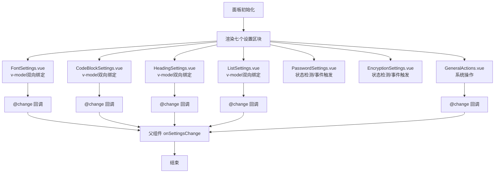

图表来源
- [GeneralSettingsPanel.vue](file://src/features/generalSettings/GeneralSettingsPanel.vue#L1-L120)
- [FontSettings.vue](file://src/features/generalSettings/components/FontSettings.vue#L1-L200)
- [CodeBlockSettings.vue](file://src/features/generalSettings/components/CodeBlockSettings.vue#L1-L200)
- [HeadingSettings.vue](file://src/features/generalSettings/components/HeadingSettings.vue#L1-L200)
- [ListSettings.vue](file://src/features/generalSettings/components/ListSettings.vue#L1-L200)
- [PasswordSettings.vue](file://src/features/generalSettings/components/PasswordSettings.vue#L1-L120)
- [EncryptionSettings.vue](file://src/features/generalSettings/components/EncryptionSettings.vue#L1-L120)
- [GeneralActions.vue](file://src/features/generalSettings/components/GeneralActions.vue#L1-L120)

章节来源
- [GeneralSettingsPanel.vue](file://src/features/generalSettings/GeneralSettingsPanel.vue#L1-L120)

### 字体设置（FontSettings.vue）
- 模块化设计
  - 使用 props/i18n 透传国际化文案
  - 通过 emit('change', settings) 将变更上抛
  - 暴露 loadSettings/save/reset 方法供外部调用
- 响应式与预览
  - 使用 v-model 双向绑定字体族、字号、粗细、行高
  - 通过 watch 监听设置变化，同步预览区域与滑块进度
  - 计算属性 previewStyle 实时预览效果
- 默认值与持久化
  - DEFAULT_SETTINGS 提供默认值
  - 本地存储键：general-font-settings
  - 保存/重置分别写入/移除 localStorage，并给出消息提示

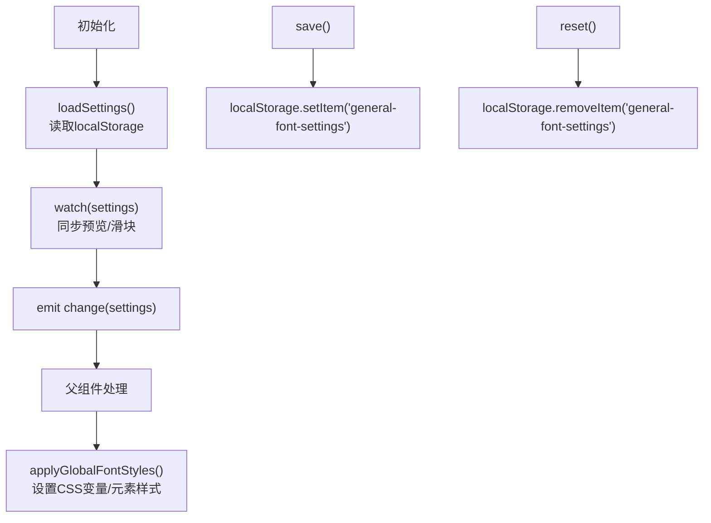

图表来源
- [FontSettings.vue](file://src/features/generalSettings/components/FontSettings.vue#L1-L200)
- [index.ts（通用设置）](file://src/features/generalSettings/index.ts#L120-L220)
- [settings.ts](file://src/config/settings.ts#L100-L141)

章节来源
- [FontSettings.vue](file://src/features/generalSettings/components/FontSettings.vue#L1-L200)
- [index.ts（通用设置）](file://src/features/generalSettings/index.ts#L120-L220)
- [settings.ts](file://src/config/settings.ts#L100-L141)

### 代码块美化（CodeBlockSettings.vue）
- 模块化设计
  - 通过 props/i18n 透传国际化文案
  - 通过 emit('change', settings) 上报变更
  - 暴露 loadSettings/settings 方法
- 样式应用
  - 支持多种风格（默认、GitHub、Mac、卡通）
  - 通过切换 body 的 class 实现风格切换
  - 通过 CSS 变量设置字号与内边距
- 自动保存与预览
  - watch 深度监听设置变化，自动保存至 localStorage
  - 预览区域展示不同风格的代码块头部与内容

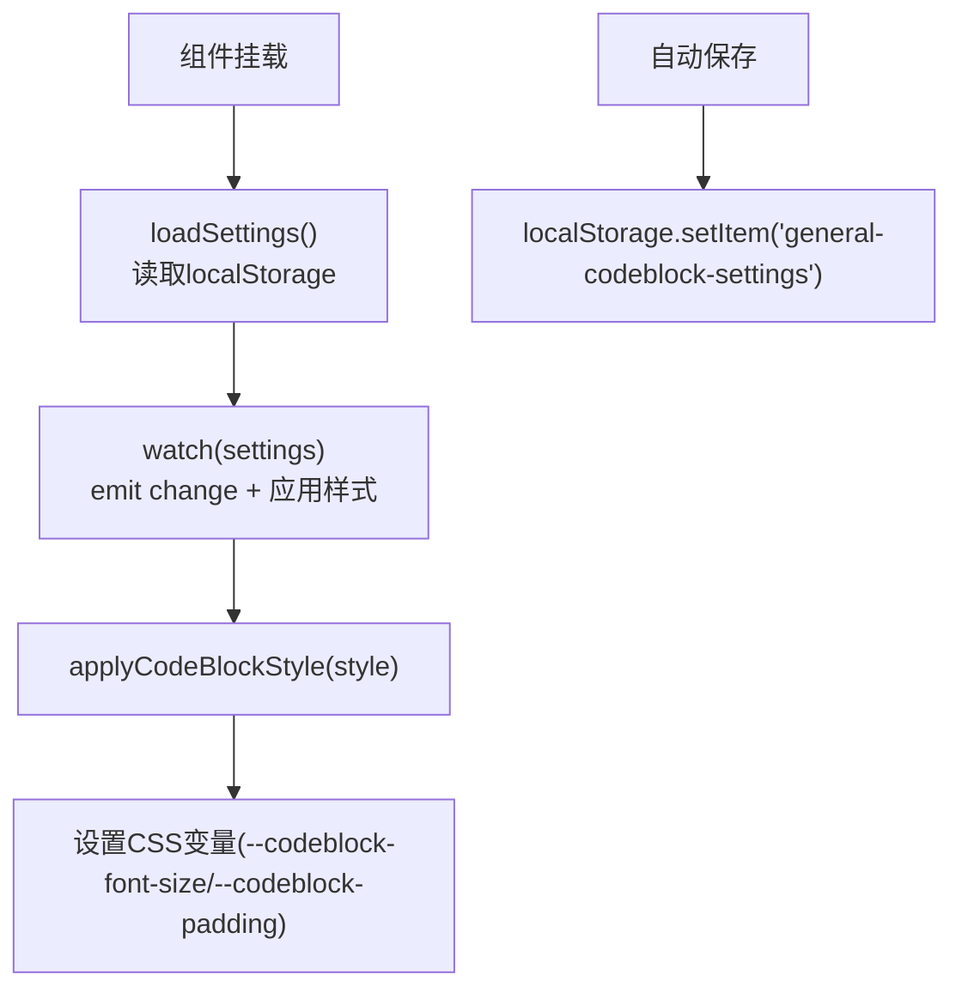

图表来源
- [CodeBlockSettings.vue](file://src/features/generalSettings/components/CodeBlockSettings.vue#L1-L200)
- [index.ts（通用设置）](file://src/features/generalSettings/index.ts#L180-L220)
- [settings.ts](file://src/config/settings.ts#L1-L141)

章节来源
- [CodeBlockSettings.vue](file://src/features/generalSettings/components/CodeBlockSettings.vue#L1-L200)
- [index.ts（通用设置）](file://src/features/generalSettings/index.ts#L180-L220)
- [settings.ts](file://src/config/settings.ts#L1-L141)

### 密码设置（PasswordSettings.vue）
- 交互设计
  - 展示密码状态（已设置/未设置）
  - 提供设置/更新密码按钮，触发自定义事件
- 事件驱动
  - 通过 window.dispatchEvent('open-password-dialog') 通知 pageLock 模块处理
  - 监听 window 事件 'password-updated' 更新状态

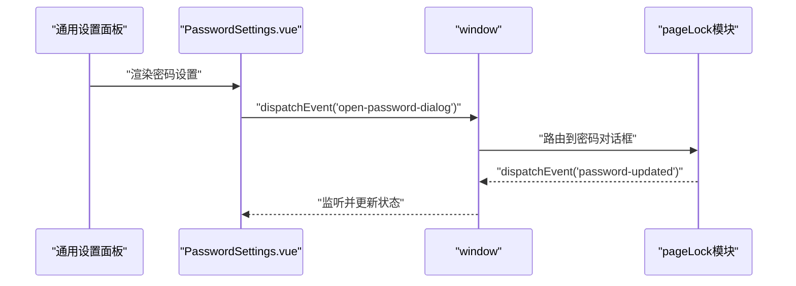

图表来源
- [PasswordSettings.vue](file://src/features/generalSettings/components/PasswordSettings.vue#L1-L120)
- [index.ts（插件入口）](file://src/index.ts#L1-L139)

章节来源
- [PasswordSettings.vue](file://src/features/generalSettings/components/PasswordSettings.vue#L1-L120)

### 通用操作（GeneralActions.vue）
- 页面操作
  - 刷新页面：保存动作记录到 localStorage，延时刷新
  - 打开工作区：派发自定义事件
  - 关闭所有页签：派发自定义事件，随后提示
- 系统信息
  - 通过 API 获取版本、当前时间，解析平台信息
- 交互与状态
  - isLoading 控制按钮禁用状态
  - 提供 loadSystemInfo 暴露方法

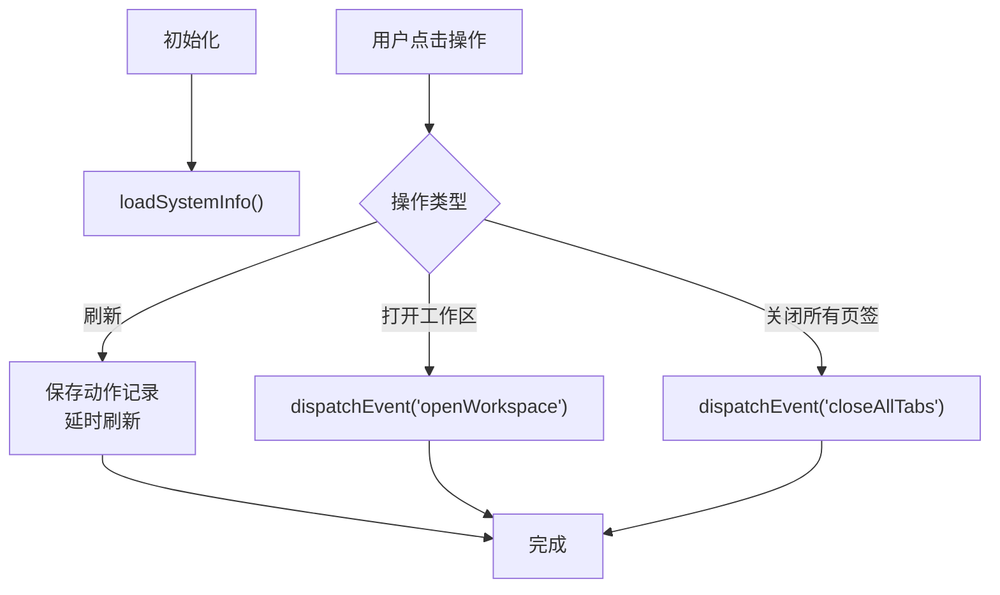

图表来源
- [GeneralActions.vue](file://src/features/generalSettings/components/GeneralActions.vue#L1-L200)
- [index.ts（通用设置）](file://src/features/generalSettings/index.ts#L280-L414)

章节来源
- [GeneralActions.vue](file://src/features/generalSettings/components/GeneralActions.vue#L1-L200)
- [index.ts（通用设置）](file://src/features/generalSettings/index.ts#L280-L414)

### 加密设置（EncryptionSettings.vue）
- 模块化设计
  - 通过 props/plugin 透传插件实例
  - 通过 getEncryptionInstance 获取加密实例
  - 支持密码设置、修改、状态检测
- 交互设计
  - 显示当前密码状态（已设置/未设置）
  - 提供新密码和确认密码输入框
  - 支持回车保存密码
- 状态管理
  - onMounted 和 onActivated 时检查密码状态
  - handleSavePassword 验证密码一致性并保存
  - checkPasswordStatus 更新 hasPassword 状态

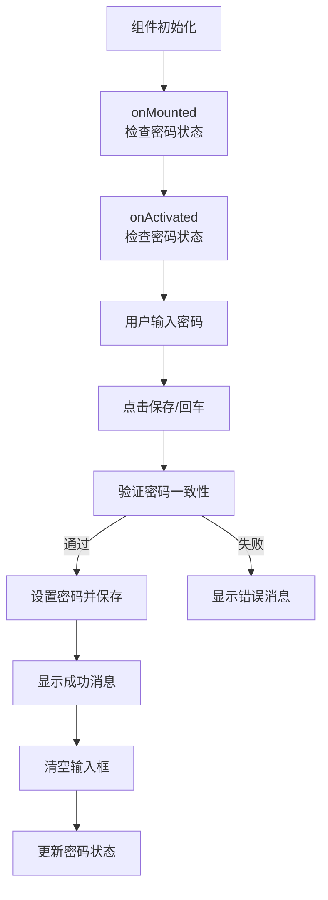

图表来源
- [EncryptionSettings.vue](file://src/features/generalSettings/components/EncryptionSettings.vue#L1-L229)

章节来源
- [EncryptionSettings.vue](file://src/features/generalSettings/components/EncryptionSettings.vue#L1-L229)

### 标题设置（HeadingSettings.vue）
- 模块化设计
  - 通过 props/i18n/plugin 透传国际化和插件实例
  - 通过 emit('change', settings) 上报变更
  - 暴露 loadSettings 方法
- 样式应用
  - 支持多种风格（默认、GitHub、Mac、卡通、彩虹、单色、暖色、冷色、渐变）
  - 通过 CSS 变量设置字体大小、颜色、层级显示
  - 支持标题居中和文档标题颜色设置
- 自动保存
  - watch 深度监听设置变化，自动保存至插件数据库
  - 使用 saveHeadingSettings API 保存设置

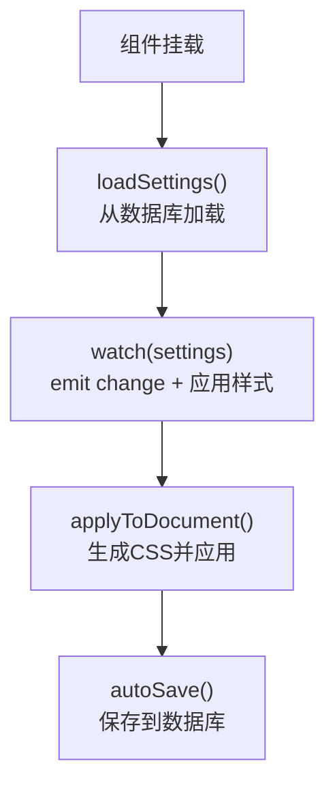

图表来源
- [HeadingSettings.vue](file://src/features/generalSettings/components/HeadingSettings.vue#L1-L800)

章节来源
- [HeadingSettings.vue](file://src/features/generalSettings/components/HeadingSettings.vue#L1-L800)

### 列表设置（ListSettings.vue）
- 模块化设计
  - 通过 props/i18n/plugin 透传国际化和插件实例
  - 通过 emit('change', settings) 上报变更
  - 暴露 generateCSS、resetToDefaults 方法
- 样式应用
  - 支持自定义无序列表符号（一级、二级、三级）
  - 支持自定义有序列表格式（数字、字母、罗马数字等）
  - 支持符号大小、左边距调整
- 自动保存
  - handleSettingsChange 生成 CSS 并保存至插件数据库
  - 使用 saveListSettingsToDB API 保存设置

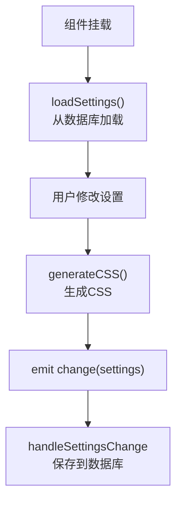

图表来源
- [ListSettings.vue](file://src/features/generalSettings/components/ListSettings.vue#L1-L701)

章节来源
- [ListSettings.vue](file://src/features/generalSettings/components/ListSettings.vue#L1-L701)

### 模块化设计与动态加载（AppearanceSettings.vue、ModuleManager.ts）
- AppearanceSettings.vue
  - 展示外观设置（主题模式、界面缩放、侧边栏显示）
  - 使用 watch 监听设置变化并 emit change
  - 提供 save/reset 与本地存储读写
- ModuleManager.ts
  - 定义 SettingsModule 接口，支持注册、排序、启用/禁用、查询、移除
  - 为未来扩展更多设置模块提供统一管理

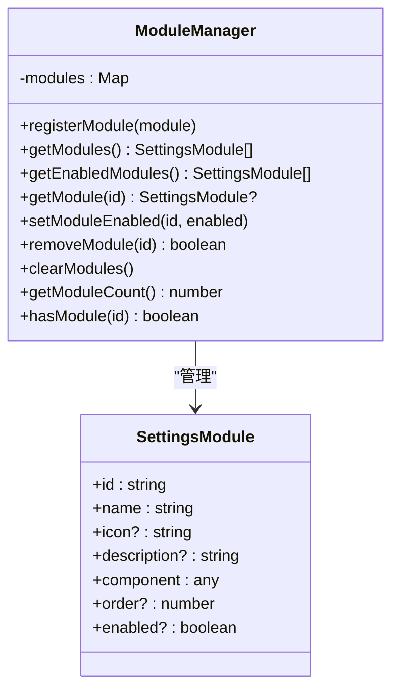

图表来源
- [ModuleManager.ts](file://src/features/generalSettings/modules/ModuleManager.ts#L1-L99)
- [AppearanceSettings.vue](file://src/features/generalSettings/modules/AppearanceSettings.vue#L1-L120)

章节来源
- [ModuleManager.ts](file://src/features/generalSettings/modules/ModuleManager.ts#L1-L99)
- [AppearanceSettings.vue](file://src/features/generalSettings/modules/AppearanceSettings.vue#L1-L120)

### 响应式系统与样式应用
- 字体设置
  - 通过 CSS 变量设置 --general-font-family、--general-font-size、--general-font-weight、--general-line-height
  - 应用到编辑器内容区域与阅读模式内容节点
- 代码块设置
  - 通过 body 的 class 切换风格
  - 通过 CSS 变量设置 --codeblock-font-size、--codeblock-padding
- 标题设置
  - 通过 style 标签动态生成 CSS
  - 支持颜色、字体大小、层级显示、居中对齐
- 列表设置
  - 通过 style 标签动态生成 CSS
  - 支持自定义符号、格式、大小、间距
- 事件与通知
  - 通用设置模块在处理完设置变更后，派发自定义事件 general-settings-changed，便于其他模块订阅

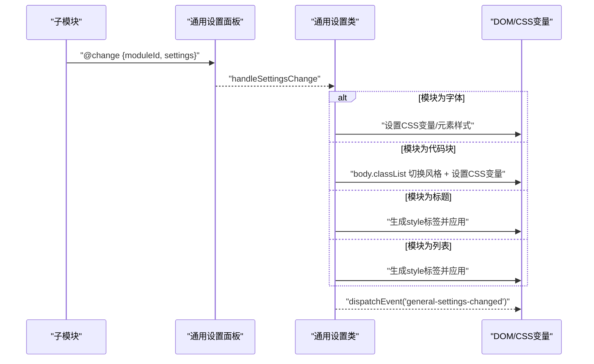

图表来源
- [GeneralSettingsPanel.vue](file://src/features/generalSettings/GeneralSettingsPanel.vue#L60-L95)
- [index.ts（通用设置）](file://src/features/generalSettings/index.ts#L70-L120)
- [index.ts（通用设置）](file://src/features/generalSettings/index.ts#L120-L220)

章节来源
- [GeneralSettingsPanel.vue](file://src/features/generalSettings/GeneralSettingsPanel.vue#L60-L95)
- [index.ts（通用设置）](file://src/features/generalSettings/index.ts#L70-L120)
- [index.ts（通用设置）](file://src/features/generalSettings/index.ts#L120-L220)

### 配置持久化流程（settings.ts）
- 插件配置
  - 插件配置接口与默认值
  - loadSettings：从插件数据存储加载，合并默认值
  - saveSettings：保存插件配置
- 字体设置
  - loadFontSettings：从 localStorage 读取，合并默认值
  - saveFontSettings/resetFontSettings：写入/重置 localStorage
- 代码块设置
  - loadCodeBlockSettings：从插件数据库读取，合并默认值
  - saveCodeBlockSettings：保存到插件数据库
- 标题设置
  - loadHeadingSettings：从插件数据库读取，合并默认值
  - saveHeadingSettings：保存到插件数据库
- 列表设置
  - loadListSettingsFromDB：从插件数据库读取，合并默认值
  - saveListSettingsToDB：保存到插件数据库

```mermaid
flowchart TD
LoadCfg["loadSettings(plugin)"] --> Merge["合并默认值"]
SaveCfg["saveSettings(plugin, settings)"] --> Done["保存完成"]
LoadFont["loadFontSettings()"] --> MergeFont["合并默认值"]
SaveFont["saveFontSettings(settings)"] --> DoneFont["保存完成"]
ResetFont["resetFontSettings()"] --> ClearFont["移除localStorage"]
LoadCode["loadCodeBlockSettings()"] --> MergeCode["合并默认值"]
SaveCode["saveCodeBlockSettings(settings)"] --> DoneCode["保存完成"]
LoadHead["loadHeadingSettings()"] --> MergeHead["合并默认值"]
SaveHead["saveHeadingSettings(settings)"] --> DoneHead["保存完成"]
LoadList["loadListSettingsFromDB()"] --> MergeList["合并默认值"]
SaveList["saveListSettingsToDB(settings)"] --> DoneList["保存完成"]
```

图表来源
- [settings.ts](file://src/config/settings.ts#L1-L141)

章节来源
- [settings.ts](file://src/config/settings.ts#L1-L141)

### 用户体验设计（分组与默认值）
- 分组与布局
  - 七个设置区块清晰分组，标题包含图标与文案，提升可读性
  - 预览区域可折叠，避免占用过多空间
- 默认值管理
  - 字体设置、外观设置、标题设置、列表设置均提供 DEFAULT_SETTINGS
  - 读取本地存储时与默认值合并，保证字段完整性
- 国际化
  - i18n 透传至各子模块，文案来自 zh_CN.json
  - 通用设置标题与各模块标题均来自 i18n

章节来源
- [GeneralSettingsPanel.vue](file://src/features/generalSettings/GeneralSettingsPanel.vue#L1-L120)
- [FontSettings.vue](file://src/features/generalSettings/components/FontSettings.vue#L1-L200)
- [AppearanceSettings.vue](file://src/features/generalSettings/modules/AppearanceSettings.vue#L1-L120)
- [HeadingSettings.vue](file://src/features/generalSettings/components/HeadingSettings.vue#L1-L200)
- [ListSettings.vue](file://src/features/generalSettings/components/ListSettings.vue#L1-L200)
- [zh_CN.json](file://src/i18n/zh_CN.json#L150-L220)

## 依赖关系分析
- 插件入口依赖
  - 插件入口在 onload 中加载插件配置并按开关注册通用设置模块
- 通用设置模块依赖
  - 通用设置类负责创建 Dock、挂载 Vue 应用、处理设置变更与样式应用
- 子模块依赖
  - 子模块各自依赖 i18n 与本地存储
  - 通用设置面板依赖子模块组件并通过事件收集设置
- 配置与持久化
  - settings.ts 提供插件配置与字体/代码块/标题/列表设置的读写接口

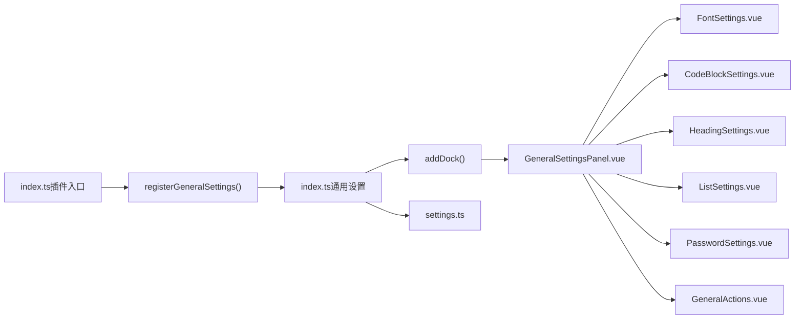

图表来源
- [index.ts（插件入口）](file://src/index.ts#L1-L139)
- [index.ts（通用设置）](file://src/features/generalSettings/index.ts#L1-L120)
- [GeneralSettingsPanel.vue](file://src/features/generalSettings/GeneralSettingsPanel.vue#L1-L120)
- [settings.ts](file://src/config/settings.ts#L1-L141)

章节来源
- [index.ts（插件入口）](file://src/index.ts#L1-L139)
- [index.ts（通用设置）](file://src/features/generalSettings/index.ts#L1-L120)
- [GeneralSettingsPanel.vue](file://src/features/generalSettings/GeneralSettingsPanel.vue#L1-L120)
- [settings.ts](file://src/config/settings.ts#L1-L141)

## 性能考量
- 按需加载与轻量组件
  - 子模块均为独立组件，避免不必要的渲染
- 本地存储与事件驱动
  - 设置变更通过事件传播，减少跨组件耦合
- CSS 变量与选择器
  - 通过 CSS 变量与少量选择器应用样式，避免频繁 DOM 操作
- 预览与滑块
  - 预览区域可折叠，滑块进度通过 nextTick 更新，降低重排压力

[本节为通用指导，无需特定文件引用]

## 故障排查指南
- 设置更改后未生效
  - 检查通用设置面板是否正确接收子模块的 change 事件
  - 确认通用设置类已处理字体/代码块/标题/列表变更并应用样式
  - 若为外观设置（AppearanceSettings.vue），确认其 watch 与 emit 是否触发
- 配置重置无效
  - 字体设置重置：调用 resetFontSettings，移除 CSS 变量与思源元素样式
  - 代码块设置重置：移除 localStorage 中的代码块设置
  - 标题设置重置：调用 resetHeadingSettings，恢复默认设置
  - 列表设置重置：调用 resetListSettings，恢复默认设置
  - 插件配置重置：通过插件配置接口的保存/加载逻辑
- 本地存储异常
  - 检查 localStorage 是否被清理或超出容量
  - 子模块保存/重置逻辑会在 try/catch 中捕获错误并输出日志
- 密码设置无反应
  - 确认 window.dispatchEvent('open-password-dialog') 已触发
  - 确认 pageLock 模块监听了 'password-updated' 事件并更新状态

章节来源
- [index.ts（通用设置）](file://src/features/generalSettings/index.ts#L180-L272)
- [FontSettings.vue](file://src/features/generalSettings/components/FontSettings.vue#L200-L299)
- [CodeBlockSettings.vue](file://src/features/generalSettings/components/CodeBlockSettings.vue#L200-L274)
- [HeadingSettings.vue](file://src/features/generalSettings/components/HeadingSettings.vue#L200-L274)
- [ListSettings.vue](file://src/features/generalSettings/components/ListSettings.vue#L200-L274)
- [PasswordSettings.vue](file://src/features/generalSettings/components/PasswordSettings.vue#L1-L120)

## 结论
通用设置以模块化为核心，通过主面板聚合子模块、通过事件驱动设置变更、通过 CSS 变量与 DOM 选择器应用样式，实现了对 UI 主题与编辑器样式的实时更新。配合 settings.ts 的持久化与插件入口的开关控制，形成完整的配置中心闭环。模块管理器与外观设置示例为后续扩展提供了清晰的范式。

[本节为总结，无需特定文件引用]

## 附录
- 国际化键值参考
  - 通用设置标题与各模块标题来自 zh_CN.json
- 未来扩展建议
  - 参考 README.md 中的扩展指南，新增模块时遵循统一接口与事件约定
  - 使用 ModuleManager 进行模块注册与排序，保持可维护性

章节来源
- [README.md（通用设置）](file://src/features/generalSettings/README.md#L96-L160)
- [zh_CN.json](file://src/i18n/zh_CN.json#L150-L220)