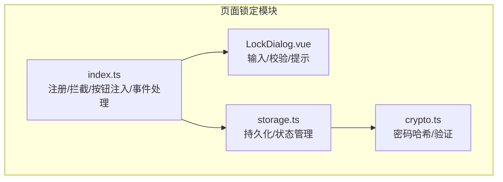
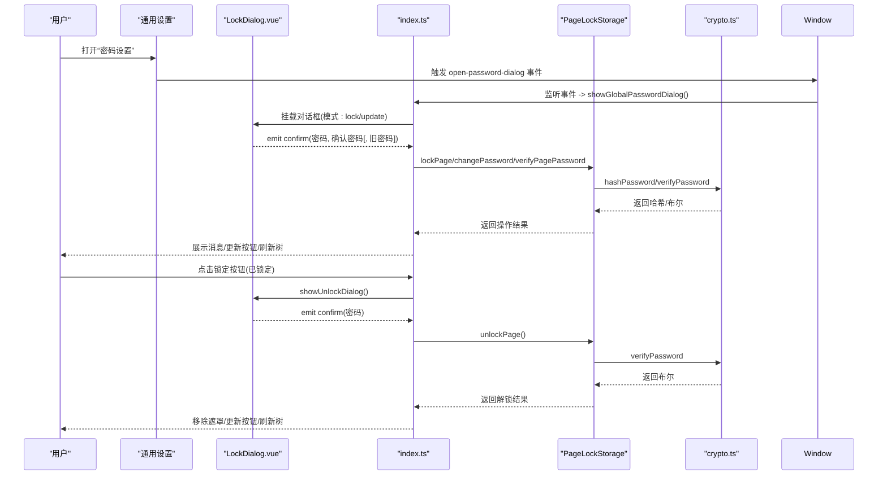
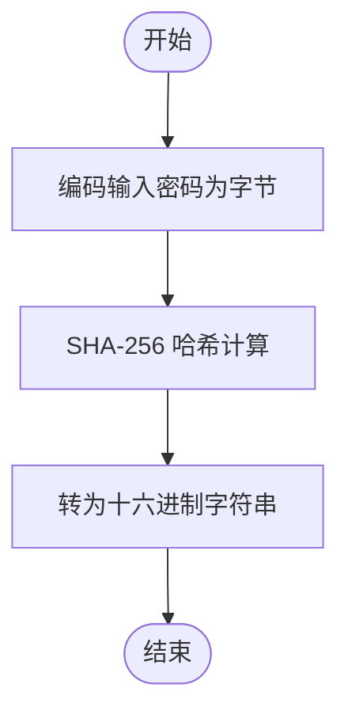
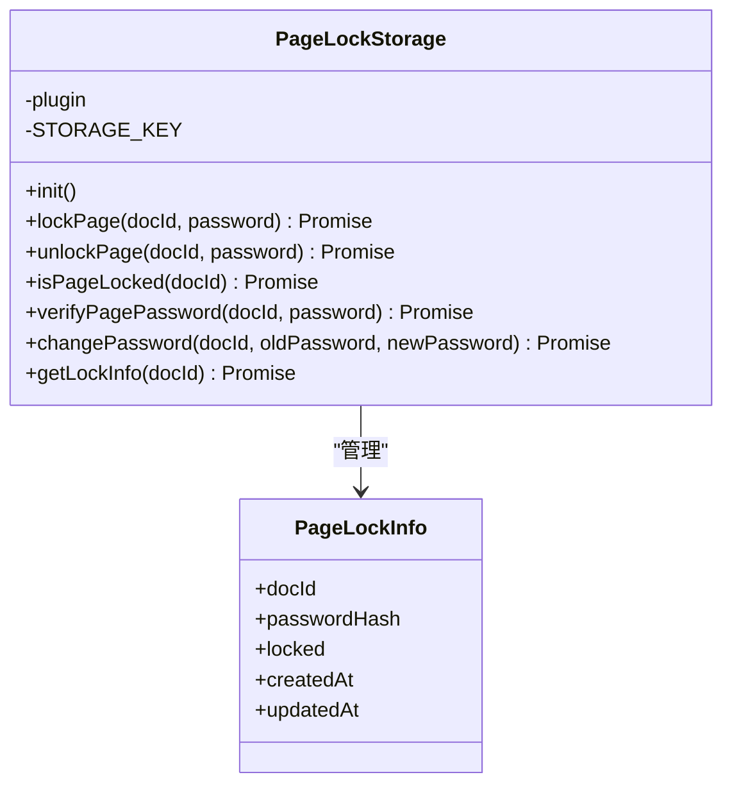
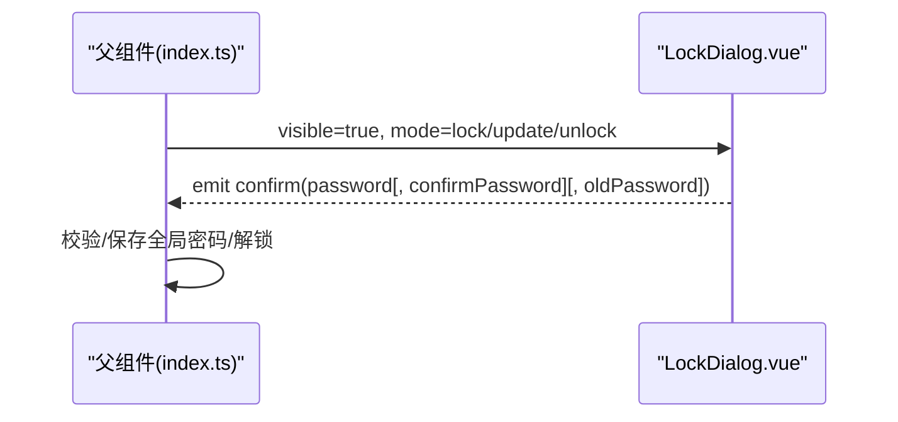
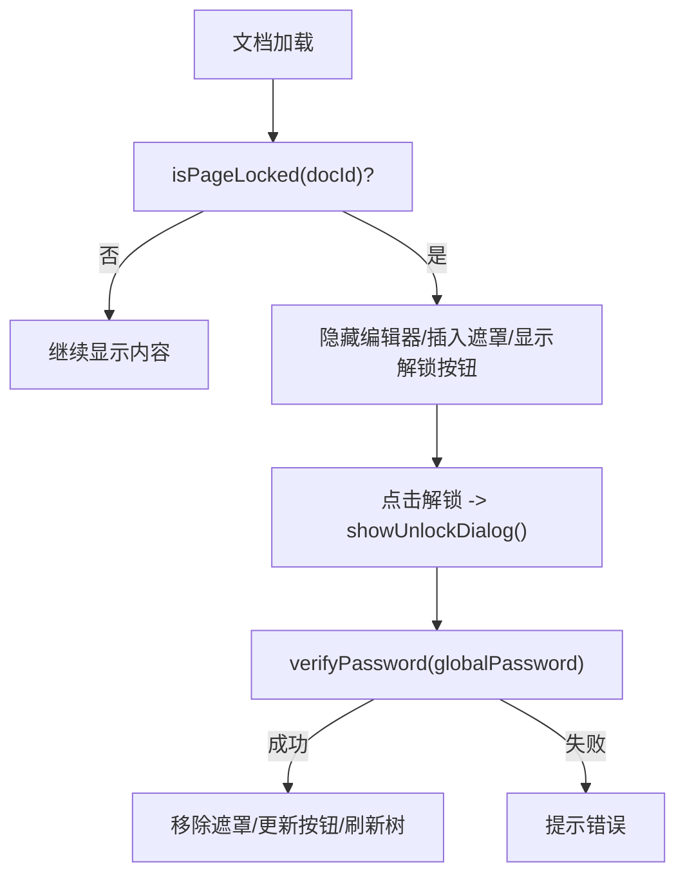
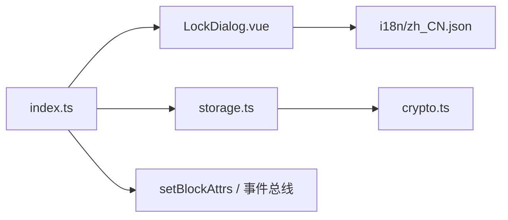

# 页面锁定

<cite>
**本文引用的文件**
- [crypto.ts](file://src/features/pageLock/crypto.ts)
- [storage.ts](file://src/features/pageLock/storage.ts)
- [LockDialog.vue](file://src/features/pageLock/LockDialog.vue)
- [index.ts](file://src/features/pageLock/index.ts)
- [settings.ts](file://src/config/settings.ts)
- [PasswordSettings.vue](file://src/features/generalSettings/components/PasswordSettings.vue)
- [zh_CN.json](file://src/i18n/zh_CN.json)
</cite>

## 目录
1. [简介](#简介)
2. [项目结构](#项目结构)
3. [核心组件](#核心组件)
4. [架构总览](#架构总览)
5. [详细组件分析](#详细组件分析)
6. [依赖关系分析](#依赖关系分析)
7. [性能与安全考量](#性能与安全考量)
8. [故障排查指南](#故障排查指南)
9. [结论](#结论)

## 简介
本文件面向“页面锁定”功能的技术文档，围绕端到端加密机制、数据存储与用户交互流程展开，重点解释以下方面：
- 加密算法与密钥派生：当前实现采用 SHA-256 对密码进行哈希存储，而非对文档内容进行对称加密。
- 存储模型：基于插件数据持久化，以文档 ID 为键的安全状态与哈希存储。
- 用户交互：通过 LockDialog.vue 提供设置/更新/解锁三种模式的输入与校验。
- 完整调用链：从用户触发到内容拦截与解锁的端到端流程。
- 安全性与恢复：防暴力破解策略建议、内存安全注意事项，以及常见问题的恢复方法。

## 项目结构
页面锁定功能位于 features/pageLock 目录，包含三个核心文件：
- crypto.ts：密码哈希与验证逻辑
- storage.ts：页面锁定信息的持久化与状态管理
- LockDialog.vue：锁定/解锁/更新密码的用户交互界面
- index.ts：页面拦截、按钮注入、全局密码与事件处理

图表来源
- [index.ts](file://src/features/pageLock/index.ts#L1-L120)
- [LockDialog.vue](file://src/features/pageLock/LockDialog.vue#L1-L120)
- [storage.ts](file://src/features/pageLock/storage.ts#L1-L60)
- [crypto.ts](file://src/features/pageLock/crypto.ts#L1-L24)

章节来源
- [index.ts](file://src/features/pageLock/index.ts#L1-L120)
- [LockDialog.vue](file://src/features/pageLock/LockDialog.vue#L1-L120)
- [storage.ts](file://src/features/pageLock/storage.ts#L1-L60)
- [crypto.ts](file://src/features/pageLock/crypto.ts#L1-L24)

## 核心组件
- 加密与验证
  - 使用 WebCrypto 的 SHA-256 对密码进行哈希，返回十六进制字符串；验证时对输入密码再次哈希并比较。
- 存储与状态
  - PageLockStorage 负责初始化存储、读取/写入锁定记录、判断锁定状态、验证密码、修改密码。
- 用户交互
  - LockDialog.vue 支持三种模式：lock（设置全局密码）、unlock（输入密码解锁）、update（更新全局密码），并提供提示文案与输入校验。
- 页面拦截与按钮注入
  - index.ts 在文档加载时检测锁定状态，若锁定则遮罩编辑器并提供解锁入口；同时在标题栏注入“锁定/解锁”按钮，并维护当前会话已解锁集合。

章节来源
- [crypto.ts](file://src/features/pageLock/crypto.ts#L1-L24)
- [storage.ts](file://src/features/pageLock/storage.ts#L1-L171)
- [LockDialog.vue](file://src/features/pageLock/LockDialog.vue#L1-L180)
- [index.ts](file://src/features/pageLock/index.ts#L1-L220)

## 架构总览
页面锁定的整体架构如下：用户通过通用设置打开全局密码对话框，设置/更新/解锁时通过 LockDialog.vue 输入密码；index.ts 负责拦截与 UI 注入；storage.ts 将锁定状态与密码哈希持久化；crypto.ts 提供哈希与验证。

图表来源
- [index.ts](file://src/features/pageLock/index.ts#L114-L213)
- [LockDialog.vue](file://src/features/pageLock/LockDialog.vue#L100-L183)
- [storage.ts](file://src/features/pageLock/storage.ts#L55-L171)
- [crypto.ts](file://src/features/pageLock/crypto.ts#L1-L24)

## 详细组件分析

### 加密与验证：crypto.ts
- 算法与流程
  - hashPassword：使用 TextEncoder 编码输入字符串，调用 SubtleCrypto.digest('SHA-256') 计算哈希，再转为十六进制字符串。
  - verifyPassword：对输入密码执行相同哈希流程，与存储的哈希字符串比较。
- 复杂度
  - 时间复杂度 O(n)，n 为密码字节数；空间复杂度 O(n)。
- 安全性说明
  - 该实现为密码哈希存储，非对文档内容进行对称加密；因此“端到端加密”在此处指“密码强度与哈希存储”，而非对文档内容的加密。

图表来源
- [crypto.ts](file://src/features/pageLock/crypto.ts#L1-L24)

章节来源
- [crypto.ts](file://src/features/pageLock/crypto.ts#L1-L24)

### 数据存储与状态：storage.ts
- 数据模型
  - PageLockInfo：包含文档 ID、密码哈希、锁定状态、创建与更新时间戳。
- 关键方法
  - init：首次加载时确保存储键存在。
  - lockPage：计算哈希并写入记录。
  - unlockPage：读取记录并验证哈希，匹配则删除记录。
  - isPageLocked：根据记录字段判断。
  - verifyPagePassword：按文档 ID 查询记录并验证。
  - changePassword：先验证旧密码哈希，再更新为新密码哈希。
- 存储介质
  - 通过插件数据 API 进行读写，键为固定字符串，值为以 docId 为键的对象映射。

图表来源
- [storage.ts](file://src/features/pageLock/storage.ts#L1-L171)

章节来源
- [storage.ts](file://src/features/pageLock/storage.ts#L1-L171)

### 用户交互：LockDialog.vue
- 模式与输入
  - lock/update：输入新密码与确认密码；update 模式额外要求输入旧密码。
  - unlock：仅输入当前密码。
- 行为
  - visible 控制对话框显隐；emit confirm 将密码参数回传给父组件。
  - enter 键支持提交；自动聚焦首个输入框。
- 国际化
  - 标题、占位符、提示文案均来自 i18n。

图表来源
- [LockDialog.vue](file://src/features/pageLock/LockDialog.vue#L1-L183)

章节来源
- [LockDialog.vue](file://src/features/pageLock/LockDialog.vue#L1-L183)

### 页面拦截与按钮注入：index.ts
- 注册与监听
  - 注册事件：switch-protyle、loaded-protyle-dynamic、loaded-protyle-static。
  - 在 loaded-静态事件中检测 isPageLocked，若锁定则隐藏编辑器内容并插入遮罩层，提供解锁按钮。
- 按钮注入
  - 在文档标题栏右侧工具区插入“锁定/解锁”按钮，点击后弹出对应对话框。
- 全局密码与会话状态
  - 通过插件数据读取/保存全局密码；维护 currentUnlockedDocs 集合避免重复拦截。
- 文档树刷新
  - 通过自定义事件触发文档树更新，以显示锁定图标。

图表来源
- [index.ts](file://src/features/pageLock/index.ts#L92-L111)
- [index.ts](file://src/features/pageLock/index.ts#L370-L417)

章节来源
- [index.ts](file://src/features/pageLock/index.ts#L1-L220)
- [index.ts](file://src/features/pageLock/index.ts#L220-L368)
- [index.ts](file://src/features/pageLock/index.ts#L370-L497)

### 全局密码设置与通用设置集成
- 通用设置组件 PasswordSettings.vue
  - 打开“密码设置”区域，点击后向 window 派发 open-password-dialog 事件，由 pageLock 模块处理。
- 国际化
  - zh_CN.json 提供页面锁定相关的多语言文案，包括“设置密码”“更新密码”“解锁页面”等。

章节来源
- [PasswordSettings.vue](file://src/features/generalSettings/components/PasswordSettings.vue#L1-L120)
- [zh_CN.json](file://src/i18n/zh_CN.json#L1-L40)

## 依赖关系分析
- 模块内依赖
  - index.ts 依赖 LockDialog.vue、PageLockStorage、setBlockAttrs（API）。
  - storage.ts 依赖 crypto.ts 与插件数据 API。
  - LockDialog.vue 依赖 i18n。
- 外部依赖
  - WebCrypto（SHA-256）。
  - 思源插件 API（事件总线、数据读写、DOM 操作）。

图表来源
- [index.ts](file://src/features/pageLock/index.ts#L1-L120)
- [storage.ts](file://src/features/pageLock/storage.ts#L1-L60)
- [crypto.ts](file://src/features/pageLock/crypto.ts#L1-L24)
- [LockDialog.vue](file://src/features/pageLock/LockDialog.vue#L1-L120)
- [zh_CN.json](file://src/i18n/zh_CN.json#L1-L40)

章节来源
- [index.ts](file://src/features/pageLock/index.ts#L1-L120)
- [storage.ts](file://src/features/pageLock/storage.ts#L1-L60)
- [crypto.ts](file://src/features/pageLock/crypto.ts#L1-L24)
- [LockDialog.vue](file://src/features/pageLock/LockDialog.vue#L1-L120)
- [zh_CN.json](file://src/i18n/zh_CN.json#L1-L40)

## 性能与安全考量
- 性能
  - SHA-256 哈希计算为常数时间复杂度，对短密码开销极低；长密码时 CPU 开销与输入长度线性相关。
  - 存储为单键对象映射，读写均为 O(1)。
- 安全性
  - 当前实现为“密码哈希存储”，并非对文档内容进行对称加密；因此不存在“端到端加密”的内容层面保护。
  - 建议的增强策略（概念性说明）：
    - 防暴力破解：在 index.ts 中引入失败计数与冷却窗口，超过阈值延迟响应或提示；或在前端增加输入速率限制。
    - 内存安全：在对话框关闭后清空输入框内容；避免在 DOM 中长期保留明文密码；使用一次性令牌或临时密钥（概念性）。
    - 更强哈希：若需更强抗碰撞能力，可考虑 PBKDF2/Argon2（概念性）。
- 配置开关
  - 插件配置中包含 enablePageLock，默认启用，可在通用设置中控制。

章节来源
- [settings.ts](file://src/config/settings.ts#L1-L60)
- [index.ts](file://src/features/pageLock/index.ts#L1-L120)

## 故障排查指南
- 症状：密码正确但无法解锁
  - 排查要点：
    - 确认全局密码是否已设置且与锁定记录中的哈希一致。
    - 检查 storage.ts 的 verifyPagePassword 是否返回 true。
    - 确认 index.ts 的 unlockPage 流程是否执行成功并移除遮罩。
- 症状：加密后数据丢失
  - 说明：当前实现不涉及文档内容的加密存储，仅保存“锁定状态与密码哈希”。若出现数据异常，优先检查插件数据是否被意外清理或插件重装导致数据迁移问题。
  - 建议：
    - 在插件卸载/重装前备份插件数据（概念性）。
    - 若需恢复锁定状态，可重新设置全局密码并再次锁定文档。
- 症状：解锁后仍显示遮罩
  - 排查要点：
    - 确认 index.ts 的 DOM 操作是否成功移除遮罩层。
    - 检查 Protyle 实例是否存在，必要时刷新文档树事件是否触发。
- 症状：按钮未显示或点击无效
  - 排查要点：
    - 确认 loaded-protyle-static 事件是否触发并执行 isPageLocked。
    - 检查标题栏工具区是否存在，按钮是否成功插入。

章节来源
- [index.ts](file://src/features/pageLock/index.ts#L120-L220)
- [index.ts](file://src/features/pageLock/index.ts#L370-L497)
- [storage.ts](file://src/features/pageLock/storage.ts#L105-L171)

## 结论
- 页面锁定当前实现采用“密码哈希存储 + 文档内容拦截”的组合：通过 SHA-256 对密码进行不可逆哈希，结合 UI 层面的遮罩与按钮注入实现访问控制。
- 由于未对文档内容进行对称加密，严格意义上的“端到端加密”在此模块中并不适用；若需内容级加密，应在现有架构基础上扩展为“内容加密 + 密钥管理”的方案（概念性）。
- 建议在现有基础上引入防暴力破解与内存安全策略，以提升整体安全性与用户体验。