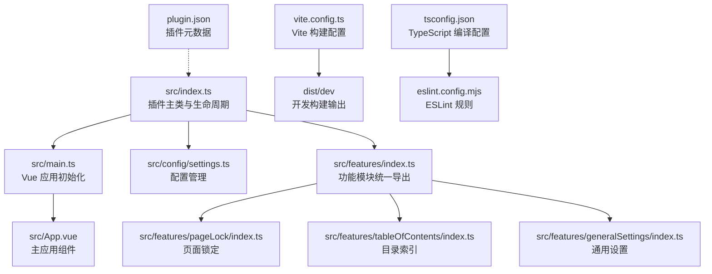
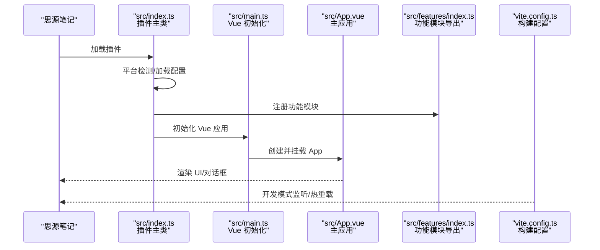
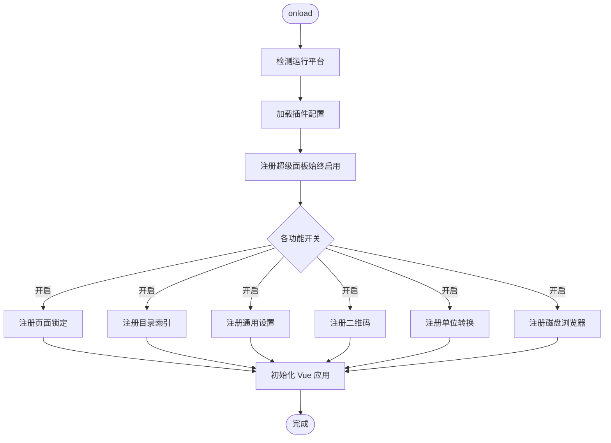
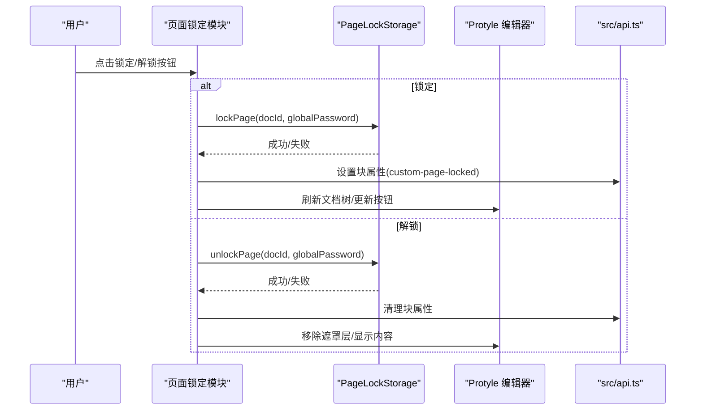
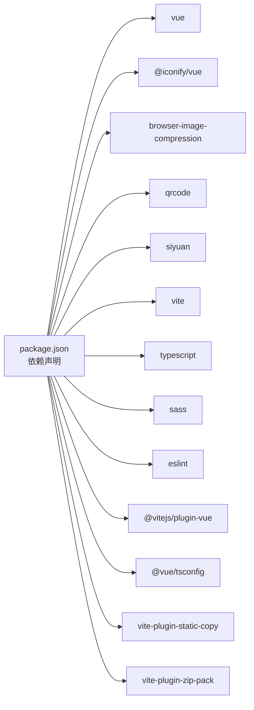

# 参考资源

<cite>
**本文引用的文件**
- [README.md](file://README.md)
- [package.json](file://package.json)
- [vite.config.ts](file://vite.config.ts)
- [tsconfig.json](file://tsconfig.json)
- [eslint.config.mjs](file://eslint.config.mjs)
- [plugin.json](file://plugin.json)
- [src/index.ts](file://src/index.ts)
- [src/main.ts](file://src/main.ts)
- [src/App.vue](file://src/App.vue)
- [src/config/settings.ts](file://src/config/settings.ts)
- [src/features/index.ts](file://src/features/index.ts)
- [src/features/pageLock/index.ts](file://src/features/pageLock/index.ts)
- [src/features/tableOfContents/index.ts](file://src/features/tableOfContents/index.ts)
- [src/features/generalSettings/index.ts](file://src/features/generalSettings/index.ts)
</cite>

## 目录
1. [简介](#简介)
2. [项目结构](#项目结构)
3. [核心组件](#核心组件)
4. [架构总览](#架构总览)
5. [详细组件分析](#详细组件分析)
6. [依赖分析](#依赖分析)
7. [性能考虑](#性能考虑)
8. [故障排查指南](#故障排查指南)
9. [结论](#结论)
10. [附录](#附录)

## 简介
本参考资源旨在为开发者提供系统性的学习路径，围绕思源笔记插件生态与现代前端技术栈展开：
- 思源笔记官方与插件开发基础：官网、API 文档与插件开发指南
- Vue 3 与 Vite 官方文档：掌握核心框架与构建工具
- 关键库文档：TypeScript、Sass、ESLint
- 从入门到精通的学习资源与实践建议，促进社区知识共享与技术提升

## 项目结构
该项目是一个基于 Vite + Vue 3 的思源笔记插件模板，提供模块化功能、国际化、配置管理、构建与发布流程等能力。核心目录与职责概览如下：
- src：源代码根目录
  - components：通用 Vue 组件（如设置面板）
  - config：配置管理（插件设置、默认值、持久化）
  - features：功能模块集合（页面锁定、目录索引、通用设置、二维码、单位转换、磁盘浏览器等）
  - i18n：多语言资源
  - types：类型声明
  - utils：工具函数
  - App.vue：主应用组件
  - api.ts：对思源 API 的封装
  - index.ts：插件主类与生命周期
  - main.ts：Vue 应用初始化与挂载
- 根目录：构建配置、类型配置、代码规范、插件元数据、发布脚本等

图表来源
- [src/index.ts](file://src/index.ts#L1-L140)
- [src/main.ts](file://src/main.ts#L1-L45)
- [src/App.vue](file://src/App.vue#L1-L216)
- [src/config/settings.ts](file://src/config/settings.ts#L1-L141)
- [src/features/index.ts](file://src/features/index.ts#L1-L15)
- [src/features/pageLock/index.ts](file://src/features/pageLock/index.ts#L1-L573)
- [src/features/tableOfContents/index.ts](file://src/features/tableOfContents/index.ts#L1-L410)
- [src/features/generalSettings/index.ts](file://src/features/generalSettings/index.ts#L1-L414)
- [vite.config.ts](file://vite.config.ts#L1-L157)
- [tsconfig.json](file://tsconfig.json#L1-L57)
- [eslint.config.mjs](file://eslint.config.mjs#L1-L129)
- [plugin.json](file://plugin.json#L1-L34)

章节来源
- [README.md](file://README.md#L1-L120)
- [README.md](file://README.md#L363-L429)

## 核心组件
- 插件主类与生命周期：负责平台检测、配置加载、功能模块注册、设置面板打开、卸载清理等
- Vue 应用初始化：创建并挂载主应用组件，绑定插件实例，注入紧凑模式样式
- 配置管理：定义插件设置接口、默认值、持久化读写与字体设置
- 功能模块：以模块化方式提供页面锁定、目录索引、通用设置等能力

章节来源
- [src/index.ts](file://src/index.ts#L1-L140)
- [src/main.ts](file://src/main.ts#L1-L45)
- [src/config/settings.ts](file://src/config/settings.ts#L1-L141)
- [src/features/index.ts](file://src/features/index.ts#L1-L15)

## 架构总览
下图展示插件从加载到运行的整体流程，以及与构建工具、类型与规范配置的关系。

图表来源
- [src/index.ts](file://src/index.ts#L1-L140)
- [src/main.ts](file://src/main.ts#L1-L45)
- [src/App.vue](file://src/App.vue#L1-L216)
- [src/features/index.ts](file://src/features/index.ts#L1-L15)
- [vite.config.ts](file://vite.config.ts#L1-L157)

## 详细组件分析

### 插件主类与生命周期（src/index.ts）
- 职责
  - 平台识别（移动端、浏览器、本地、Electron、窗口模式）
  - 加载插件配置并合并默认值
  - 条件注册功能模块（超级面板始终启用，其余按配置开关）
  - 提供设置面板打开入口与设置更新方法
- 关键点
  - 通过统一导出的功能模块注册器批量启用/禁用功能
  - 与配置管理模块协作完成设置持久化

图表来源
- [src/index.ts](file://src/index.ts#L1-L140)

章节来源
- [src/index.ts](file://src/index.ts#L1-L140)

### Vue 应用初始化（src/main.ts）
- 职责
  - 绑定插件实例，注入紧凑模式样式
  - 创建并挂载主应用组件到文档体
  - 提供销毁钩子，释放资源
- 关键点
  - 通过全局类名控制紧凑模式
  - 以容器元素挂载应用，便于后续扩展

章节来源
- [src/main.ts](file://src/main.ts#L1-L45)

### 配置管理（src/config/settings.ts）
- 职责
  - 定义插件设置接口与默认值
  - 提供设置加载/保存方法（插件数据存储）
  - 提供字体设置的本地持久化与重置
- 关键点
  - 合并默认值与已保存配置，保证新增字段的兼容性
  - 字体设置通过 localStorage 与 CSS 变量联动

章节来源
- [src/config/settings.ts](file://src/config/settings.ts#L1-L141)

### 功能模块：页面锁定（src/features/pageLock/index.ts）
- 职责
  - 在文档标题栏注入锁定/解锁按钮
  - 监听文档切换与加载事件，动态拦截/显示锁定内容
  - 支持全局密码设置、更新与重置（超级密码）
- 关键点
  - 通过事件总线与 DOM 查询定位编辑器实例
  - 动态注入遮罩层与按钮样式，适配思源原生 UI

图表来源
- [src/features/pageLock/index.ts](file://src/features/pageLock/index.ts#L1-L573)
- [src/api.ts](file://src/api.ts#L1-L200)

章节来源
- [src/features/pageLock/index.ts](file://src/features/pageLock/index.ts#L1-L573)

### 功能模块：目录索引（src/features/tableOfContents/index.ts）
- 职责
  - 注册快捷键命令（插入子文档列表、子文档引用、子文档大纲）
  - 基于当前光标位置与文档上下文，生成并插入索引内容
  - 通过 SQL 查询与属性标记，避免重复插入与高效更新
- 关键点
  - 多种策略获取当前文档 ID，确保跨场景可用
  - 使用自定义属性标记生成块，便于后续更新

章节来源
- [src/features/tableOfContents/index.ts](file://src/features/tableOfContents/index.ts#L1-L410)

### 功能模块：通用设置（src/features/generalSettings/index.ts）
- 职责
  - 在右侧边栏添加通用设置 Dock
  - 应用全局字体设置与代码块样式
  - 提供字体设置重置与事件分发
  - 监听工作区打开与关闭所有页签事件
- 关键点
  - 通过 CSS 变量与类名控制全局样式
  - 事件驱动模块间通信

章节来源
- [src/features/generalSettings/index.ts](file://src/features/generalSettings/index.ts#L1-L414)

### 主应用组件（src/App.vue）
- 职责
  - 管理设置面板、图片查看器、二维码对话框的可见性
  - 暴露窗口级方法（打开设置、打开二维码对话框）
  - 添加状态栏元素
- 关键点
  - 通过事件监听器响应外部触发
  - 与插件实例解耦，通过全局钩子暴露能力

章节来源
- [src/App.vue](file://src/App.vue#L1-L216)

## 依赖分析
- 运行时依赖
  - Vue 3：组件化 UI 开发
  - @iconify/vue：图标库集成
  - browser-image-compression：图片压缩
  - qrcode：二维码生成
  - siyuan：思源笔记 SDK
- 开发依赖
  - Vite：快速构建与热重载
  - TypeScript：类型安全
  - Sass：样式预处理
  - ESLint：代码规范与格式化
  - @vitejs/plugin-vue、@vue/tsconfig：框架与类型配置
  - vite-plugin-static-copy、vite-plugin-zip-pack：静态资源复制与打包

图表来源
- [package.json](file://package.json#L1-L46)

章节来源
- [package.json](file://package.json#L1-L46)

## 性能考虑
- 构建优化
  - 开发模式下禁用最小化与生成 source map，便于调试
  - 生产模式启用最小化与打包压缩，减小体积
- 资源监听
  - 开发模式监听 i18n、README、plugin.json 等静态资源变更，触发热重载
- 运行时优化
  - 按需注册功能模块，减少初始加载负担
  - 使用 CSS 变量与类名切换控制样式，避免频繁 DOM 操作

章节来源
- [vite.config.ts](file://vite.config.ts#L1-L157)
- [src/index.ts](file://src/index.ts#L1-L140)

## 故障排查指南
- 热重载不生效
  - 检查 .env 中 VITE_SIYUAN_WORKSPACE_PATH 是否正确指向思源工作区
  - 确认思源笔记客户端正在运行
- 插件加载失败
  - 检查 plugin.json 中 minAppVersion 与当前思源版本匹配
- 构建报错
  - 清理依赖后重装；确认 Node.js 版本满足要求；检查 TypeScript 类型定义
- 常见问题
  - 如何禁用某个功能模块：在设置面板关闭对应开关或直接修改配置
  - 如何查看日志：开启开发者工具，使用浏览器控制台与插件日志

章节来源
- [README.md](file://README.md#L396-L436)

## 结论
本项目提供了完整的思源笔记插件开发模板，涵盖现代前端技术栈与插件生态实践。通过模块化功能、配置管理、国际化与构建发布流程，开发者可以快速上手并扩展功能。建议结合官方文档与社区资源持续学习，逐步提升到插件架构设计与性能优化层面。

## 附录

### 学习资源清单（按层次递进）

- 入门阶段
  - 思源笔记官网与插件生态
    - 官网：https://b3log.org/siyuan/
    - API 文档：https://github.com/siyuan-note/siyuan/blob/master/API.md
    - 插件开发指南：https://github.com/siyuan-note/plugin-sample
  - Vue 3 官方文档
    - Vue 3 文档：https://vuejs.org/
  - Vite 官方文档
    - Vite 文档：https://vitejs.dev/

- 进阶阶段
  - TypeScript 官方文档
    - TypeScript 文档：https://www.typescriptlang.org/
  - Sass 官方文档
    - Sass 文档：https://sass-lang.com/documentation/
  - ESLint 官方文档
    - ESLint 文档：https://eslint.org/docs/latest/use/getting-started

- 实践与社区
  - 项目使用的关键库与版本
    - Vue 3.3.8、Vite 6.2.1、TypeScript 5.0.4、Sass 1.62.1、ESLint 9.22.0、siyuan 1.1.0
  - 项目脚本与发布
    - 开发：pnpm dev（监听构建并热重载）
    - 生产：pnpm build（构建 dist 并打包 package.zip）
    - 发布：pnpm release[:manual|:patch|:minor|:major]（自动化版本与打包）

章节来源
- [README.md](file://README.md#L417-L429)
- [package.json](file://package.json#L1-L46)
- [vite.config.ts](file://vite.config.ts#L1-L157)
- [tsconfig.json](file://tsconfig.json#L1-L57)
- [eslint.config.mjs](file://eslint.config.mjs#L1-L129)
- [plugin.json](file://plugin.json#L1-L34)