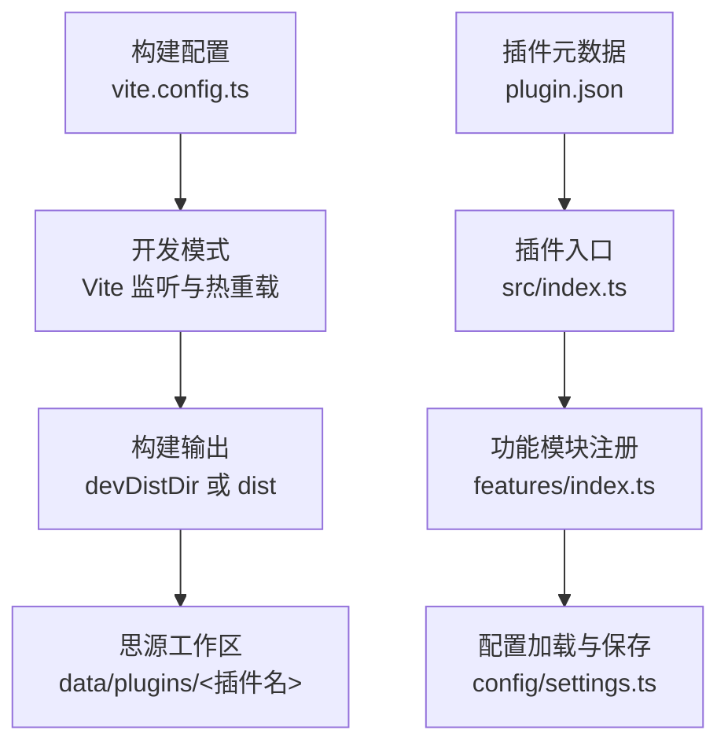
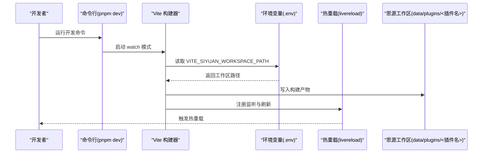
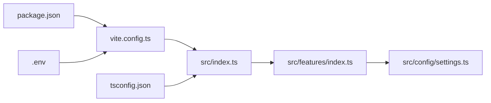

# 常见问题

<cite>
**本文引用的文件**
- [plugin.json](file://plugin.json)
- [package.json](file://package.json)
- [vite.config.ts](file://vite.config.ts)
- [README.md](file://README.md)
- [src/index.ts](file://src/index.ts)
- [src/config/settings.ts](file://src/config/settings.ts)
- [src/features/index.ts](file://src/features/index.ts)
- [src/features/generalSettings/modules/ModuleManager.ts](file://src/features/generalSettings/modules/ModuleManager.ts)
- [tsconfig.json](file://tsconfig.json)
- [tsconfig.node.json](file://tsconfig.node.json)
</cite>

## 目录
1. [简介](#简介)
2. [项目结构](#项目结构)
3. [核心组件](#核心组件)
4. [架构总览](#架构总览)
5. [详细组件分析](#详细组件分析)
6. [依赖关系分析](#依赖关系分析)
7. [性能注意事项](#性能注意事项)
8. [故障排除指南](#故障排除指南)
9. [结论](#结论)

## 简介
本指南聚焦于“热重载不生效”“插件加载失败”“禁用功能模块”“构建报错”等常见问题，结合仓库中的实际实现，给出可操作的排查步骤与修复建议，帮助用户与开发者快速定位并解决问题，降低支持成本。

## 项目结构
该插件基于 Vite + Vue3，采用模块化功能架构，通过统一入口加载配置与功能模块；开发模式下通过环境变量与 Vite 插件实现热重载；生产模式下进行打包并生成发布包。

图表来源
- [vite.config.ts](file://vite.config.ts#L1-L157)
- [src/index.ts](file://src/index.ts#L1-L140)
- [src/features/index.ts](file://src/features/index.ts#L1-L15)
- [src/config/settings.ts](file://src/config/settings.ts#L1-L141)
- [plugin.json](file://plugin.json#L1-L34)

章节来源
- [vite.config.ts](file://vite.config.ts#L1-L157)
- [README.md](file://README.md#L1-L120)

## 核心组件
- 插件入口与生命周期：负责加载配置、注册功能模块、初始化 UI。
- 功能模块注册：按配置开关选择性注册各功能模块。
- 配置管理：提供默认配置、加载与保存逻辑，支持设置面板可视化控制。
- 构建与热重载：通过 Vite 环境变量与插件实现监听与自动部署到思源工作区。

章节来源
- [src/index.ts](file://src/index.ts#L1-L140)
- [src/config/settings.ts](file://src/config/settings.ts#L1-L141)
- [src/features/index.ts](file://src/features/index.ts#L1-L15)
- [vite.config.ts](file://vite.config.ts#L1-L157)

## 架构总览
下面的序列图展示了开发模式下热重载的关键流程：启动开发命令、读取环境变量、启用监听与自动复制、构建到目标目录并触发热重载。

图表来源
- [vite.config.ts](file://vite.config.ts#L1-L157)
- [README.md](file://README.md#L29-L58)

章节来源
- [vite.config.ts](file://vite.config.ts#L1-L157)
- [README.md](file://README.md#L29-L58)

## 详细组件分析

### 热重载实现与环境变量
- 环境变量：开发模式需设置 VITE_SIYUAN_WORKSPACE_PATH 指向思源工作区目录，Vite 会据此决定构建输出目录与监听目标。
- 监听机制：开发模式启用 livereload 插件与外部文件监听，确保静态资源变更后自动刷新。
- 构建行为：watch 模式下输出到 devDistDir（即工作区插件目录），非 watch 模式输出到 dist 并生成发布包。

章节来源
- [vite.config.ts](file://vite.config.ts#L1-L157)
- [README.md](file://README.md#L29-L58)

### 插件加载与兼容性
- 元数据：plugin.json 中包含最小应用版本字段，用于限制插件在旧版本客户端上的加载。
- 入口：src/index.ts 作为插件主类，加载配置并按开关注册功能模块。

章节来源
- [plugin.json](file://plugin.json#L1-L34)
- [src/index.ts](file://src/index.ts#L1-L140)

### 功能模块禁用与配置持久化
- 配置接口：src/config/settings.ts 定义了多项功能开关与默认值。
- 注册逻辑：src/index.ts 根据 settings 中的开关逐项注册功能模块。
- 设置面板：README 提供了通过设置面板关闭功能开关的方法。

章节来源
- [src/config/settings.ts](file://src/config/settings.ts#L1-L141)
- [src/index.ts](file://src/index.ts#L1-L140)
- [README.md](file://README.md#L396-L409)

### 构建与类型定义
- 构建脚本：package.json 定义了 dev/build/release 等脚本。
- TypeScript 配置：tsconfig.json 指定类型与解析策略，确保类型检查与打包一致性。
- Node 版本：README 明确要求 Node.js >= 16。

章节来源
- [package.json](file://package.json#L1-L46)
- [tsconfig.json](file://tsconfig.json#L1-L57)
- [README.md](file://README.md#L17-L23)

## 依赖关系分析
- 构建链路：package.json -> vite.config.ts -> src/index.ts -> src/features/index.ts -> src/config/settings.ts
- 环境链路：.env -> vite.config.ts -> 思源工作区
- 类型链路：tsconfig.json -> src/index.ts 与各模块

图表来源
- [package.json](file://package.json#L1-L46)
- [vite.config.ts](file://vite.config.ts#L1-L157)
- [src/index.ts](file://src/index.ts#L1-L140)
- [src/features/index.ts](file://src/features/index.ts#L1-L15)
- [src/config/settings.ts](file://src/config/settings.ts#L1-L141)
- [tsconfig.json](file://tsconfig.json#L1-L57)

章节来源
- [package.json](file://package.json#L1-L46)
- [vite.config.ts](file://vite.config.ts#L1-L157)
- [src/index.ts](file://src/index.ts#L1-L140)
- [src/features/index.ts](file://src/features/index.ts#L1-L15)
- [src/config/settings.ts](file://src/config/settings.ts#L1-L141)
- [tsconfig.json](file://tsconfig.json#L1-L57)

## 性能注意事项
- 开发模式下关闭压缩与生成 source map，便于调试但体积较大；生产模式建议开启压缩与最小化。
- 监听外部文件（README、plugin.json、国际化文件）会增加监听开销，仅在开发模式启用。
- 热重载依赖 livereload 插件，确保网络与端口可用，避免跨设备访问导致刷新异常。

章节来源
- [vite.config.ts](file://vite.config.ts#L1-L157)

## 故障排除指南

### 症状：热重载不生效
可能原因与排查步骤：
- 确认已设置 VITE_SIYUAN_WORKSPACE_PATH 环境变量指向正确的思源工作区目录（参考 README 的环境配置示例）。
- 确认正在运行思源笔记客户端，且工作区目录可写。
- 确认开发命令已启动（例如 pnpm dev），并观察终端输出是否显示构建到 devDistDir。
- 确认浏览器已打开思源笔记并刷新页面，以触发热重载。
- 若仍不生效，检查是否有权限问题或路径包含特殊字符。

章节来源
- [README.md](file://README.md#L29-L58)
- [vite.config.ts](file://vite.config.ts#L1-L157)

### 症状：插件加载失败
可能原因与排查步骤：
- 检查 plugin.json 中的最小应用版本字段是否与当前思源笔记版本兼容。
- 确认插件入口 src/index.ts 能正常加载配置并注册功能模块。
- 若存在版本不兼容，升级或降级思源笔记至满足 minAppVersion 的范围。

章节来源
- [plugin.json](file://plugin.json#L1-L34)
- [src/index.ts](file://src/index.ts#L1-L140)

### 症状：无法禁用特定功能模块
可行方案：
- 在设置面板中关闭对应功能开关（README 提供了通过设置面板禁用模块的方法）。
- 或者直接修改配置文件：插件配置保存在插件数据存储中，可通过 loadSettings 与 saveSettings 进行读写；也可通过 ModuleManager 对设置模块进行启用/禁用管理（适用于通用设置模块管理器）。

章节来源
- [README.md](file://README.md#L396-L409)
- [src/config/settings.ts](file://src/config/settings.ts#L1-L141)
- [src/features/generalSettings/modules/ModuleManager.ts](file://src/features/generalSettings/modules/ModuleManager.ts#L1-L99)

### 症状：构建报错
系统性排查步骤：
- 清理并重新安装依赖：删除 node_modules 并重新安装依赖。
- 检查 Node.js 版本是否满足要求（README 要求 Node.js >= 16）。
- 确认 TypeScript 类型定义与编译配置正确（tsconfig.json 已包含必要的类型与解析选项）。
- 若涉及第三方依赖，确认其与当前 Node.js/Vite/TypeScript 版本兼容。

章节来源
- [README.md](file://README.md#L17-L23)
- [package.json](file://package.json#L1-L46)
- [tsconfig.json](file://tsconfig.json#L1-L57)
- [tsconfig.node.json](file://tsconfig.node.json#L1-L13)

### 症状：开发模式下构建产物未写入工作区
可能原因与排查步骤：
- 确认已传入 watch 参数（例如 pnpm dev），以便输出到 devDistDir。
- 确认 VITE_SIYUAN_WORKSPACE_PATH 已正确设置，且路径有效。
- 确认目标目录存在且有写入权限。

章节来源
- [vite.config.ts](file://vite.config.ts#L1-L157)

### 症状：功能模块未按预期启用/禁用
排查步骤：
- 检查 src/config/settings.ts 中的默认配置与已保存配置合并逻辑。
- 在 src/index.ts 中确认注册逻辑是否根据 settings 开关执行。
- 通过设置面板更新配置后，确认 saveSettings 成功并触发重新注册。

章节来源
- [src/config/settings.ts](file://src/config/settings.ts#L1-L141)
- [src/index.ts](file://src/index.ts#L1-L140)

## 结论
通过结合环境变量、构建配置、插件入口与配置管理等关键点，可以高效定位并解决热重载、插件加载、功能模块禁用与构建报错等问题。建议在日常开发中遵循 README 的环境与版本要求，配合本指南的排查步骤，显著降低问题处理成本。