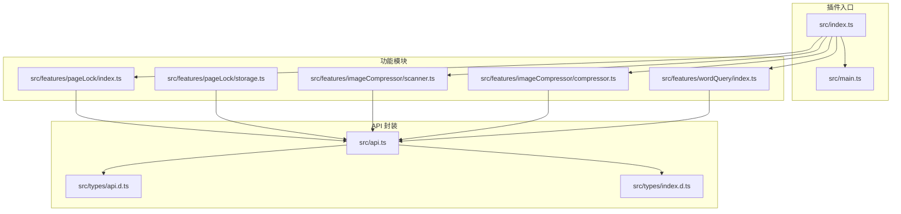
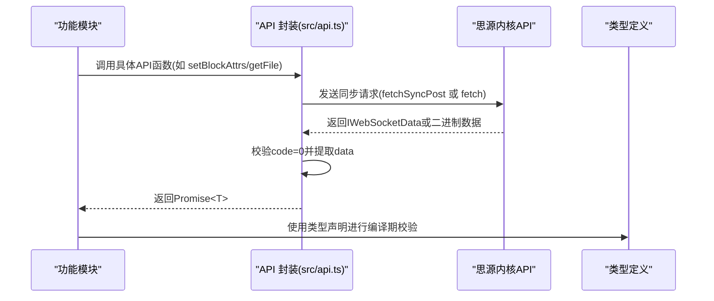
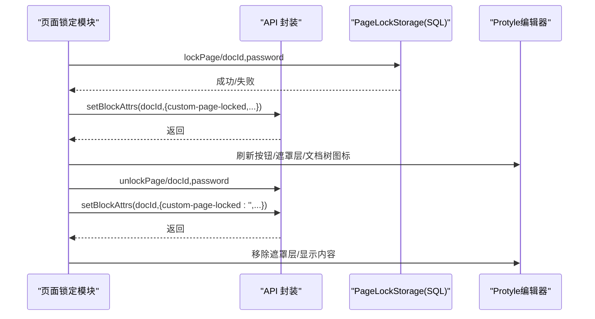
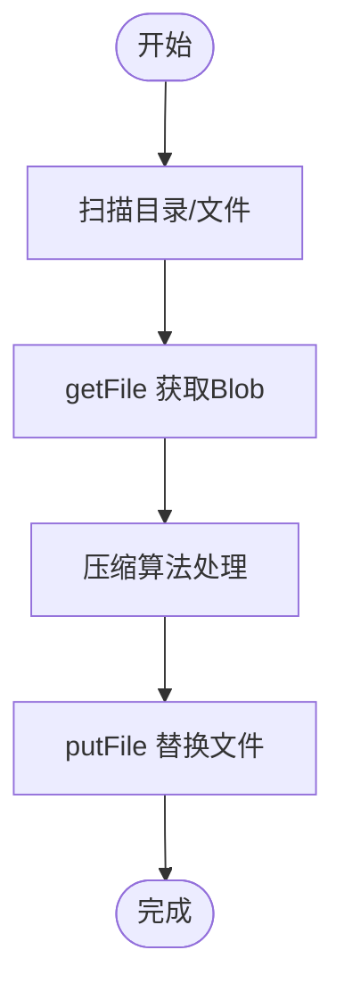
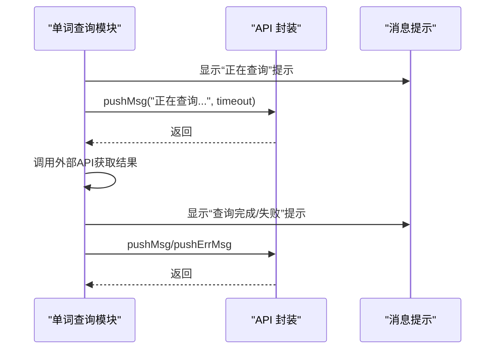
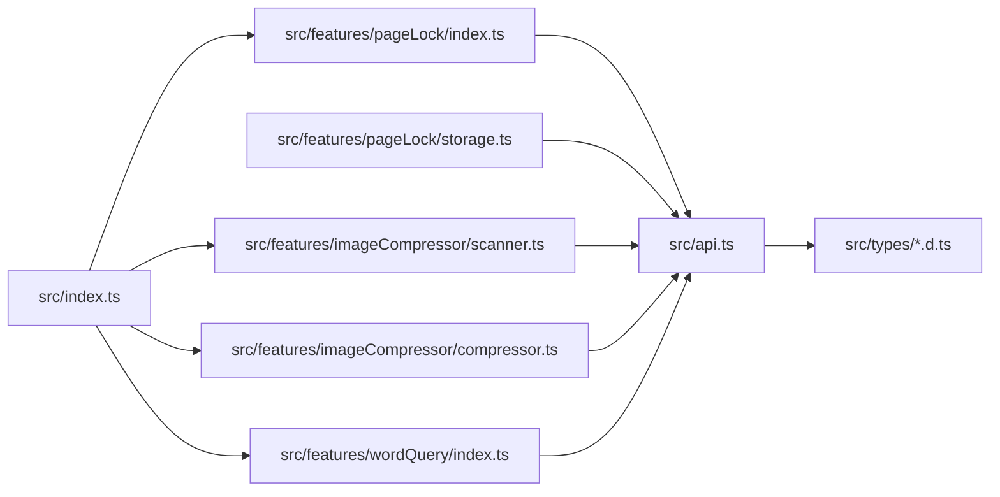

# 使用思源笔记API

<cite>
**本文引用的文件**
- [src/api.ts](file://src/api.ts)
- [src/types/api.d.ts](file://src/types/api.d.ts)
- [src/types/index.d.ts](file://src/types/index.d.ts)
- [src/features/pageLock/index.ts](file://src/features/pageLock/index.ts)
- [src/features/pageLock/storage.ts](file://src/features/pageLock/storage.ts)
- [src/features/imageCompressor/compressor.ts](file://src/features/imageCompressor/compressor.ts)
- [src/features/imageCompressor/scanner.ts](file://src/features/imageCompressor/scanner.ts)
- [src/features/wordQuery/index.ts](file://src/features/wordQuery/index.ts)
- [src/index.ts](file://src/index.ts)
- [src/main.ts](file://src/main.ts)
- [src/config/settings.ts](file://src/config/settings.ts)
</cite>

## 目录
1. [简介](#简介)
2. [项目结构](#项目结构)
3. [核心组件](#核心组件)
4. [架构总览](#架构总览)
5. [详细组件分析](#详细组件分析)
6. [依赖关系分析](#依赖关系分析)
7. [性能考虑](#性能考虑)
8. [故障排查指南](#故障排查指南)
9. [结论](#结论)
10. [附录](#附录)

## 简介
本指南围绕 src/api.ts 中封装的思源笔记 API，系统讲解笔记本、文件树、块、属性、SQL 查询、文件与资产、通知推送等能力，并结合页面锁定、图片压缩、单词查询等实际功能模块，演示如何在插件中安全、高效地调用这些 API。同时提供异步处理、错误处理、性能优化策略与调试技巧，帮助开发者快速上手并避免常见问题。

## 项目结构
该插件采用“功能模块 + API 封装”的分层组织：
- API 层：集中封装对思源内核 API 的调用，统一请求与响应处理。
- 功能模块：页面锁定、图片压缩、单词查询等业务功能，按需注册启用。
- 配置与类型：插件设置、通用类型定义、API 返回类型声明。

图表来源
- [src/index.ts](file://src/index.ts#L1-L140)
- [src/main.ts](file://src/main.ts#L1-L45)
- [src/api.ts](file://src/api.ts#L1-L496)
- [src/types/api.d.ts](file://src/types/api.d.ts#L1-L65)
- [src/types/index.d.ts](file://src/types/index.d.ts#L1-L142)
- [src/features/pageLock/index.ts](file://src/features/pageLock/index.ts#L1-L573)
- [src/features/pageLock/storage.ts](file://src/features/pageLock/storage.ts#L1-L172)
- [src/features/imageCompressor/scanner.ts](file://src/features/imageCompressor/scanner.ts#L1-L228)
- [src/features/imageCompressor/compressor.ts](file://src/features/imageCompressor/compressor.ts#L1-L227)
- [src/features/wordQuery/index.ts](file://src/features/wordQuery/index.ts#L1-L573)

章节来源
- [src/index.ts](file://src/index.ts#L1-L140)
- [src/main.ts](file://src/main.ts#L1-L45)

## 核心组件
本节聚焦 src/api.ts 中的关键 API 分类与职责：
- 笔记本操作：列出、打开、关闭、重命名、创建、删除、获取/设置配置。
- 文件树操作：创建文档、重命名文档、删除文档、移动文档、路径与层级路径互转。
- 块操作：插入、前置/追加、更新、删除、移动、获取 Kramdown、获取子块、转移引用。
- 属性操作：设置块属性、获取块属性。
- SQL 查询：执行 SQL、便捷查询块。
- 文件与资产：上传、读取目录、读取/写入/删除文件、导出 Markdown 内容与资源。
- 模板渲染：渲染文档模板与 Sprig 片段。
- 系统与网络：启动进度、版本、时间、转发代理。
- 通知推送：普通消息与错误消息推送。

章节来源
- [src/api.ts](file://src/api.ts#L1-L496)
- [src/types/api.d.ts](file://src/types/api.d.ts#L1-L65)
- [src/types/index.d.ts](file://src/types/index.d.ts#L1-L142)

## 架构总览
API 封装层通过统一的 request 函数处理 WebSocket 请求与响应，返回约定的数据结构。各功能模块按需调用相应 API，并在 UI 层进行交互反馈。

图表来源
- [src/api.ts](file://src/api.ts#L1-L496)
- [src/types/api.d.ts](file://src/types/api.d.ts#L1-L65)
- [src/types/index.d.ts](file://src/types/index.d.ts#L1-L142)

## 详细组件分析

### 笔记本操作
- lsNotebooks：列出笔记本列表。
- openNotebook/closeNotebook：打开/关闭笔记本。
- renameNotebook：重命名笔记本。
- createNotebook/removeNotebook：创建/删除笔记本。
- getNotebookConf/setNotebookConf：获取/设置笔记本配置。

使用建议
- 在插件加载时可通过 lsNotebooks 获取笔记本列表，结合 openNotebook 切换上下文。
- 重命名与删除需谨慎，建议在 UI 中二次确认。

章节来源
- [src/api.ts](file://src/api.ts#L19-L64)

### 文件树操作
- createDocWithMd：基于 Markdown 创建文档并返回文档 ID。
- renameDoc/removeDoc：重命名/删除文档。
- moveDocs：批量移动文档到目标笔记本与路径。
- getHPathByPath/getHPathByID：根据路径/块 ID 获取层级路径。
- getIDsByHPath：根据层级路径解析为块 ID 列表。

使用建议
- 创建文档后可立即使用 getHPathByID 获取层级路径，便于后续定位与导航。
- 批量移动文档时注意目标路径与笔记本的合法性。

章节来源
- [src/api.ts](file://src/api.ts#L67-L148)

### 块操作
- insertBlock/prependBlock/appendBlock：插入/前置/追加块。
- updateBlock/deleteBlock/moveBlock：更新/删除/移动块。
- getBlockKramdown：获取块的 Kramdown 内容。
- getChildBlocks：获取子块列表。
- transferBlockRef：转移块引用。

使用建议
- 插入/更新块时注意 dataType 与 data 的格式一致性。
- 移动块时合理设置 previousID 与 parentID，避免破坏层级关系。
- 获取 Kramdown 适合做内容对比或导出。

章节来源
- [src/api.ts](file://src/api.ts#L166-L281)

### 属性操作
- setBlockAttrs：设置块属性字典。
- getBlockAttrs：获取块属性字典。

使用建议
- 页面锁定功能通过 setBlockAttrs 添加自定义属性实现 UI 标识，解锁时清除属性。
- 属性键名应语义明确，避免冲突。

图表来源
- [src/features/pageLock/index.ts](file://src/features/pageLock/index.ts#L1-L573)
- [src/features/pageLock/storage.ts](file://src/features/pageLock/storage.ts#L1-L172)
- [src/api.ts](file://src/api.ts#L284-L304)

章节来源
- [src/api.ts](file://src/api.ts#L284-L304)
- [src/features/pageLock/index.ts](file://src/features/pageLock/index.ts#L1-L573)
- [src/features/pageLock/storage.ts](file://src/features/pageLock/storage.ts#L1-L172)

### SQL 查询
- sql(stmt)：执行任意 SQL 语句，返回二维数组。
- getBlockByID：便捷查询块信息。

使用建议
- 使用 getBlockByID 时注意 SQL 注入风险，建议对参数进行白名单校验或使用参数化查询。
- 结果集为空时需判空处理。

章节来源
- [src/api.ts](file://src/api.ts#L307-L321)

### 文件与资产
- 上传：upload(assetsDirPath, files)。
- 文件读取/写入/删除：getFile/putFile/removeFile。
- 目录读取：readDir(path)。
- 导出：exportMdContent/exportResources。

使用建议
- 图片压缩模块使用 getFile 获取 Blob，再用 putFile 替换压缩后的文件，注意文件类型与时间戳。
- 读取目录时注意权限与路径合法性，避免访问受限目录。

图表来源
- [src/features/imageCompressor/compressor.ts](file://src/features/imageCompressor/compressor.ts#L1-L227)
- [src/features/imageCompressor/scanner.ts](file://src/features/imageCompressor/scanner.ts#L1-L228)
- [src/api.ts](file://src/api.ts#L343-L392)

章节来源
- [src/api.ts](file://src/api.ts#L151-L163)
- [src/api.ts](file://src/api.ts#L343-L392)
- [src/features/imageCompressor/compressor.ts](file://src/features/imageCompressor/compressor.ts#L1-L227)
- [src/features/imageCompressor/scanner.ts](file://src/features/imageCompressor/scanner.ts#L1-L228)

### 模板渲染
- render(id, path)：渲染文档模板。
- renderSprig(template)：渲染 Sprig 片段。

使用建议
- 模板渲染常用于生成动态内容或报告，注意模板语法与变量绑定。

章节来源
- [src/api.ts](file://src/api.ts#L323-L339)

### 通知推送
- pushMsg：推送普通消息。
- pushErrMsg：推送错误消息。

使用建议
- 单词查询模块在查询前后使用 pushMsg 提示用户状态，提升交互体验。

图表来源
- [src/features/wordQuery/index.ts](file://src/features/wordQuery/index.ts#L1-L573)
- [src/api.ts](file://src/api.ts#L439-L460)

章节来源
- [src/api.ts](file://src/api.ts#L439-L460)
- [src/features/wordQuery/index.ts](file://src/features/wordQuery/index.ts#L1-L573)

### 系统与网络
- bootProgress/version/currentTime：系统状态查询。
- forwardProxy：网络代理转发。

使用建议
- 网络代理可用于跨域或受限环境下的数据获取，注意超时与错误处理。

章节来源
- [src/api.ts](file://src/api.ts#L463-L495)

## 依赖关系分析
- 功能模块依赖 API 封装：页面锁定依赖 setBlockAttrs/getBlockAttrs 与 SQL；图片压缩依赖 getFile/putFile；单词查询依赖外部网络 API。
- API 封装依赖类型定义：返回类型与数据结构由类型文件约束，保证编译期安全。
- 插件入口负责注册与初始化：根据配置开关按需启用功能模块。

图表来源
- [src/api.ts](file://src/api.ts#L1-L496)
- [src/types/api.d.ts](file://src/types/api.d.ts#L1-L65)
- [src/types/index.d.ts](file://src/types/index.d.ts#L1-L142)
- [src/features/pageLock/index.ts](file://src/features/pageLock/index.ts#L1-L573)
- [src/features/pageLock/storage.ts](file://src/features/pageLock/storage.ts#L1-L172)
- [src/features/imageCompressor/scanner.ts](file://src/features/imageCompressor/scanner.ts#L1-L228)
- [src/features/imageCompressor/compressor.ts](file://src/features/imageCompressor/compressor.ts#L1-L227)
- [src/features/wordQuery/index.ts](file://src/features/wordQuery/index.ts#L1-L573)
- [src/index.ts](file://src/index.ts#L1-L140)

章节来源
- [src/index.ts](file://src/index.ts#L1-L140)
- [src/api.ts](file://src/api.ts#L1-L496)

## 性能考虑
- 并发控制：图片压缩与扫描建议限制并发数量，避免阻塞主线程。
- 进度回调：为批量操作提供进度回调，改善用户体验。
- 缓存策略：对频繁读取的元数据（如层级路径）进行缓存，减少重复查询。
- 二进制处理：getFile 直接返回 Blob，避免不必要的 JSON 解析，提高吞吐。
- 网络代理：合理设置超时与重试，避免长时间阻塞。

[本节为通用指导，无需列出章节来源]

## 故障排查指南
- API 返回码与错误处理
  - request 函数仅在 code=0 时返回 data，否则返回 null。调用方需判空并处理错误。
  - getFile/putFile/removeFile/readDir 等 API 若返回 null 或异常，需检查路径、权限与网络状态。
- 常见错误码与定位
  - 路径非法：检查路径是否存在、是否在允许范围内。
  - 权限不足：确认插件运行环境与目标目录权限。
  - 网络异常：检查代理设置与超时配置。
- 日志与调试
  - 在调用 API 前后打印关键参数与返回值，定位问题范围。
  - 使用浏览器开发者工具 Network 面板查看请求与响应。
  - 对于外部网络 API（如单词查询），关注响应状态码与错误文本。
- 安全规范
  - 不在前端暴露敏感密钥，使用受控存储或后端代理。
  - 对用户输入进行白名单校验，避免 SQL 注入与路径遍历。
  - 上传/替换文件时校验文件类型与大小，防止恶意文件。

章节来源
- [src/api.ts](file://src/api.ts#L1-L16)
- [src/api.ts](file://src/api.ts#L343-L392)
- [src/features/wordQuery/index.ts](file://src/features/wordQuery/index.ts#L1-L573)

## 结论
通过统一的 API 封装，插件能够以一致的方式访问思源内核能力。结合页面锁定、图片压缩、单词查询等模块的实际用法，可以快速构建稳定、易维护的功能。建议在开发中重视异步与错误处理、性能优化与安全规范，持续完善日志与调试手段，以获得更好的用户体验。

[本节为总结性内容，无需列出章节来源]

## 附录

### API 使用示例与最佳实践
- 页面锁定
  - 获取块属性：使用 getBlockAttrs 判断是否已锁定，决定 UI 行为。
  - 设置块属性：使用 setBlockAttrs 添加/移除自定义属性，驱动 UI 标识。
  - SQL 查询：使用 getBlockByID 获取块信息，辅助逻辑判断。
  - 参考路径
    - [src/features/pageLock/index.ts](file://src/features/pageLock/index.ts#L1-L573)
    - [src/features/pageLock/storage.ts](file://src/features/pageLock/storage.ts#L1-L172)
    - [src/api.ts](file://src/api.ts#L284-L321)
- 图片压缩
  - 扫描资产目录：使用 readDir 递归扫描图片文件。
  - 读取文件：使用 getFile 获取 Blob，再进行压缩。
  - 替换文件：使用 putFile 以相同路径覆盖原文件。
  - 参考路径
    - [src/features/imageCompressor/scanner.ts](file://src/features/imageCompressor/scanner.ts#L1-L228)
    - [src/features/imageCompressor/compressor.ts](file://src/features/imageCompressor/compressor.ts#L1-L227)
    - [src/api.ts](file://src/api.ts#L343-L392)
- 单词查询
  - 推送提示：使用 pushMsg/pushErrMsg 提示查询状态与结果。
  - 外部 API：根据提供商调用不同接口，解析响应文本。
  - 参考路径
    - [src/features/wordQuery/index.ts](file://src/features/wordQuery/index.ts#L1-L573)
    - [src/api.ts](file://src/api.ts#L439-L460)

### 类型与返回值参考
- 常用类型
  - DocumentId/BlockId/NotebookId：文档、块、笔记本 ID 类型别名。
  - Notebook/NotebookConf：笔记本与配置结构。
  - BlockType/BlockSubType：块类型与子类型枚举。
  - Block/doOperation：块与操作结构。
- API 返回类型
  - IReslsNotebooks/IResUpload/IResdoOperations/IResGetBlockKramdown/IResReadDir/IResExportMdContent/IResForwardProxy 等。

章节来源
- [src/types/index.d.ts](file://src/types/index.d.ts#L1-L142)
- [src/types/api.d.ts](file://src/types/api.d.ts#L1-L65)