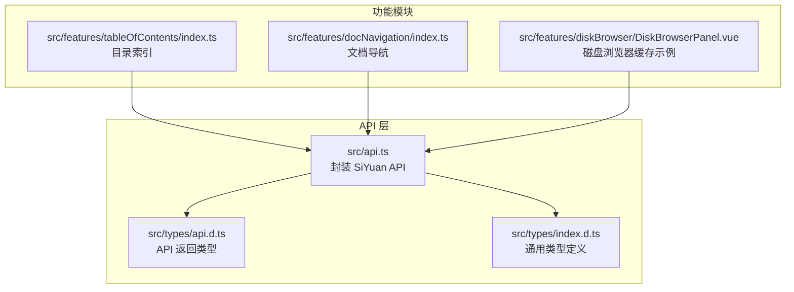
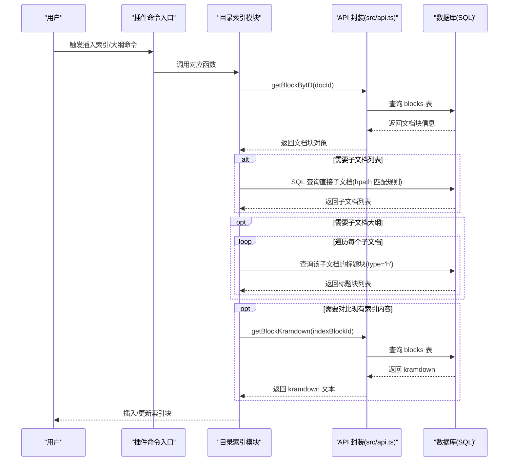
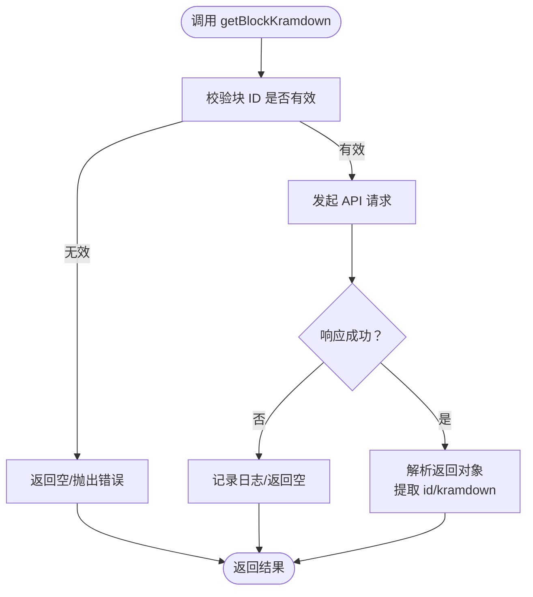
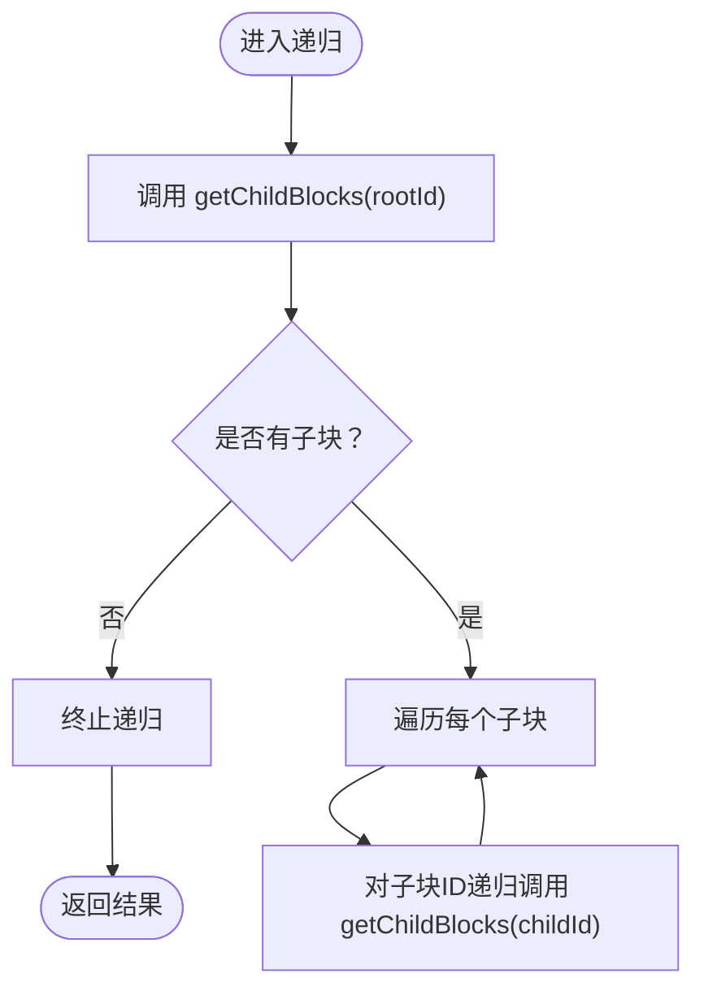
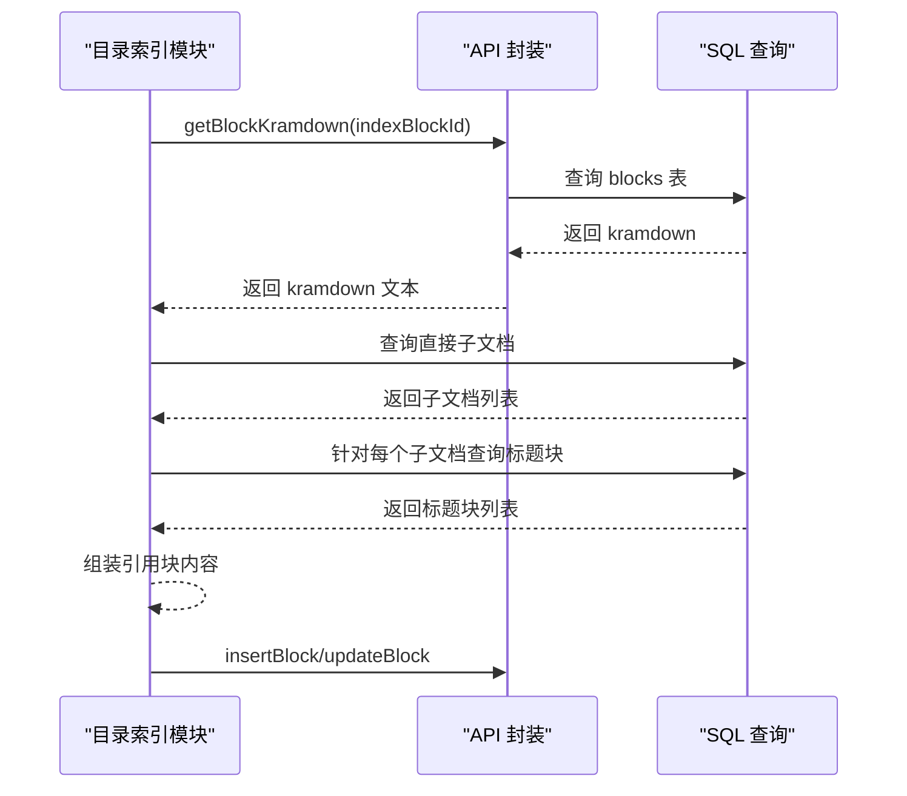
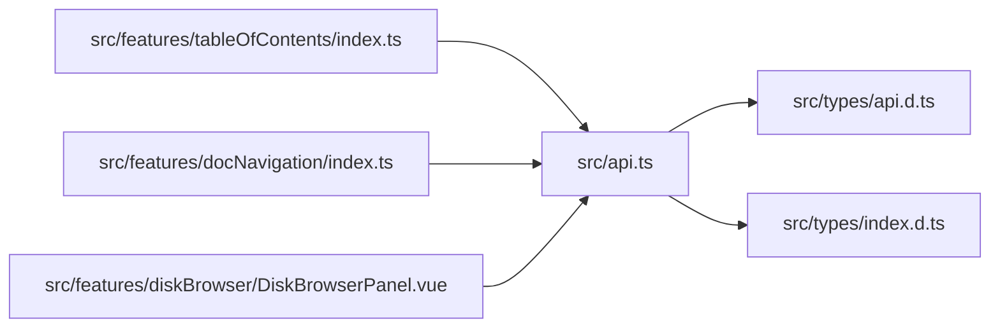

# 内容获取操作

<cite>
**本文引用的文件**
- [src/api.ts](file://src/api.ts)
- [src/types/api.d.ts](file://src/types/api.d.ts)
- [src/types/index.d.ts](file://src/types/index.d.ts)
- [src/features/tableOfContents/index.ts](file://src/features/tableOfContents/index.ts)
- [src/features/docNavigation/index.ts](file://src/features/docNavigation/index.ts)
- [src/features/diskBrowser/DiskBrowserPanel.vue](file://src/features/diskBrowser/DiskBrowserPanel.vue)
</cite>

## 目录
1. [简介](#简介)
2. [项目结构](#项目结构)
3. [核心组件](#核心组件)
4. [架构总览](#架构总览)
5. [详细组件分析](#详细组件分析)
6. [依赖关系分析](#依赖关系分析)
7. [性能考量](#性能考量)
8. [故障排查指南](#故障排查指南)
9. [结论](#结论)
10. [附录](#附录)

## 简介
本章节围绕两个关键 API 展开：getBlockKramdown 与 getChildBlocks。前者用于获取指定块的 Kramdown 内容，后者用于获取某块的直接子块列表。我们将系统性说明：
- 返回结构与元数据
- 在目录树、内容提纲、嵌套结构遍历中的应用
- 递归处理子块的编程模式
- 缓存与分页/懒加载策略
- 错误处理与空数据应对

## 项目结构
本仓库采用按功能模块划分的组织方式，API 封装集中在 src/api.ts，类型定义位于 src/types 下，具体业务功能（如目录索引、文档导航）分别位于 src/features 下的独立模块中。



图表来源
- [src/api.ts](file://src/api.ts#L1-L496)
- [src/types/api.d.ts](file://src/types/api.d.ts#L1-L65)
- [src/types/index.d.ts](file://src/types/index.d.ts#L1-L86)
- [src/features/tableOfContents/index.ts](file://src/features/tableOfContents/index.ts#L1-L410)
- [src/features/docNavigation/index.ts](file://src/features/docNavigation/index.ts#L1-L470)
- [src/features/diskBrowser/DiskBrowserPanel.vue](file://src/features/diskBrowser/DiskBrowserPanel.vue#L199-L867)

章节来源
- [src/api.ts](file://src/api.ts#L1-L496)
- [src/types/api.d.ts](file://src/types/api.d.ts#L1-L65)
- [src/types/index.d.ts](file://src/types/index.d.ts#L1-L86)
- [src/features/tableOfContents/index.ts](file://src/features/tableOfContents/index.ts#L1-L410)
- [src/features/docNavigation/index.ts](file://src/features/docNavigation/index.ts#L1-L470)
- [src/features/diskBrowser/DiskBrowserPanel.vue](file://src/features/diskBrowser/DiskBrowserPanel.vue#L199-L867)

## 核心组件
- getBlockKramdown：获取块的 Kramdown 文本内容，返回包含块 ID 与 Kramdown 字符串的对象。
- getChildBlocks：获取某块的直接子块列表，返回包含子块 ID、类型与可选子类型的数据数组。

章节来源
- [src/api.ts](file://src/api.ts#L249-L267)
- [src/types/api.d.ts](file://src/types/api.d.ts#L21-L31)

## 架构总览
以下序列图展示了目录索引功能如何使用 getBlockKramdown 与 getChildBlocks 实现“内容提纲”与“嵌套结构遍历”的典型流程。



图表来源
- [src/features/tableOfContents/index.ts](file://src/features/tableOfContents/index.ts#L132-L191)
- [src/features/tableOfContents/index.ts](file://src/features/tableOfContents/index.ts#L232-L279)
- [src/features/tableOfContents/index.ts](file://src/features/tableOfContents/index.ts#L285-L333)
- [src/features/tableOfContents/index.ts](file://src/features/tableOfContents/index.ts#L339-L409)
- [src/api.ts](file://src/api.ts#L308-L321)
- [src/api.ts](file://src/api.ts#L249-L267)

## 详细组件分析

### getBlockKramdown API
- 接口职责
  - 以块 ID 为参数，返回该块的 Kramdown 文本内容，以及对应的块 ID。
- 返回结构
  - 对象字段：id（块 ID）、kramdown（Kramdown 文本）。
- 典型应用场景
  - 内容对比与去重：在插入或更新索引块前，先拉取现有块的 Kramdown，规范化后与新内容比较，避免重复写入。
  - 内容解析与二次加工：拿到 Kramdown 后，可进一步解析为 HTML 或 Markdown AST，再进行样式转换、索引生成、引用块构建等。
- 数据流与处理要点
  - 与 SQL 查询配合：当需要基于文档根 ID 或标题块进行批量处理时，先通过 getBlockByID 获取文档元信息，再结合 SQL 查询实现高效检索。
  - 错误与空数据：若块不存在或查询失败，返回值可能为空或异常，需在调用方进行判空与兜底处理。



图表来源
- [src/api.ts](file://src/api.ts#L249-L267)
- [src/types/api.d.ts](file://src/types/api.d.ts#L21-L25)
- [src/features/tableOfContents/index.ts](file://src/features/tableOfContents/index.ts#L152-L169)

章节来源
- [src/api.ts](file://src/api.ts#L249-L267)
- [src/types/api.d.ts](file://src/types/api.d.ts#L21-L25)
- [src/features/tableOfContents/index.ts](file://src/features/tableOfContents/index.ts#L152-L169)

### getChildBlocks API
- 接口职责
  - 以块 ID 为参数，返回该块的直接子块列表。
- 返回结构
  - 数组项包含：id（子块 ID）、type（块类型）、subtype（可选子类型）。
- 核心作用
  - 目录树与内容提纲：通过直接子块列表，构建“当前块”的子节点集合，作为目录树的起点。
  - 嵌套结构遍历：结合递归模式，对子块继续调用 getChildBlocks，实现深度遍历，生成完整的嵌套结构视图。
- 典型场景
  - 文档导航：在文档标题下方展示父文档与直接子文档的快速跳转链接。
  - 大纲生成：对子文档的标题块进行筛选与排序，形成可点击的引用块大纲。

```mermaid
sequenceDiagram
participant C as "调用方"
participant API as "API 封装"
participant DB as "数据库(SQL)"
C->>API : getChildBlocks(parentId)
API->>DB : 查询 blocks 表(父ID匹配)
DB-->>API : 返回子块列表
API-->>C : 返回子块数组
C->>C : 递归处理每个子块
C->>API : getChildBlocks(childId)
API->>DB-->>C : 返回子块数组(递归)
```

图表来源
- [src/api.ts](file://src/api.ts#L259-L267)
- [src/types/api.d.ts](file://src/types/api.d.ts#L26-L31)
- [src/features/docNavigation/index.ts](file://src/features/docNavigation/index.ts#L46-L94)

章节来源
- [src/api.ts](file://src/api.ts#L259-L267)
- [src/types/api.d.ts](file://src/types/api.d.ts#L26-L31)
- [src/features/docNavigation/index.ts](file://src/features/docNavigation/index.ts#L46-L94)

### 递归处理子块的编程模式
- 模式概述
  - 以某块 ID 为根，调用 getChildBlocks 获取直接子块；
  - 对每个子块再次调用 getChildBlocks，直至达到目标层级或满足停止条件；
  - 在遍历过程中收集节点信息（如 ID、类型、内容摘要），用于渲染目录树或生成大纲。
- 示例参考
  - 文档导航模块通过一次性 SQL 查询父文档与直接子文档，减少多次 API 调用；同样思路可迁移到递归遍历中，先批量获取当前层级的所有子块，再逐层深入。



图表来源
- [src/features/docNavigation/index.ts](file://src/features/docNavigation/index.ts#L46-L94)
- [src/api.ts](file://src/api.ts#L259-L267)

章节来源
- [src/features/docNavigation/index.ts](file://src/features/docNavigation/index.ts#L46-L94)
- [src/api.ts](file://src/api.ts#L259-L267)

### 内容解析与二次加工示例
- 目录索引模块在插入/更新索引块前，会先调用 getBlockKramdown 获取现有内容，规范化后与新内容比较，避免重复写入。
- 对于子文档引用与大纲生成，模块会先查询直接子文档，再对每个子文档查询标题块，最终拼装为引用块形式的内容。



图表来源
- [src/features/tableOfContents/index.ts](file://src/features/tableOfContents/index.ts#L132-L191)
- [src/features/tableOfContents/index.ts](file://src/features/tableOfContents/index.ts#L232-L279)
- [src/features/tableOfContents/index.ts](file://src/features/tableOfContents/index.ts#L285-L333)
- [src/features/tableOfContents/index.ts](file://src/features/tableOfContents/index.ts#L339-L409)
- [src/api.ts](file://src/api.ts#L249-L267)
- [src/api.ts](file://src/api.ts#L308-L321)

章节来源
- [src/features/tableOfContents/index.ts](file://src/features/tableOfContents/index.ts#L132-L191)
- [src/features/tableOfContents/index.ts](file://src/features/tableOfContents/index.ts#L232-L279)
- [src/features/tableOfContents/index.ts](file://src/features/tableOfContents/index.ts#L285-L333)
- [src/features/tableOfContents/index.ts](file://src/features/tableOfContents/index.ts#L339-L409)
- [src/api.ts](file://src/api.ts#L249-L267)
- [src/api.ts](file://src/api.ts#L308-L321)

## 依赖关系分析
- API 封装层
  - 统一的请求包装函数负责发送请求并处理返回值，屏蔽底层差异。
  - getBlockKramdown 与 getChildBlocks 作为块级内容获取的核心入口，被多个功能模块复用。
- 类型定义
  - IResGetBlockKramdown 与 IResGetChildBlock 定义了上述两个 API 的返回结构，保证调用方对返回值有明确预期。
- 业务模块
  - 目录索引模块与文档导航模块均依赖 API 层提供的块级查询能力，并结合 SQL 查询实现更高效的批量检索。



图表来源
- [src/api.ts](file://src/api.ts#L1-L496)
- [src/types/api.d.ts](file://src/types/api.d.ts#L1-L65)
- [src/types/index.d.ts](file://src/types/index.d.ts#L1-L86)
- [src/features/tableOfContents/index.ts](file://src/features/tableOfContents/index.ts#L1-L410)
- [src/features/docNavigation/index.ts](file://src/features/docNavigation/index.ts#L1-L470)
- [src/features/diskBrowser/DiskBrowserPanel.vue](file://src/features/diskBrowser/DiskBrowserPanel.vue#L199-L867)

章节来源
- [src/api.ts](file://src/api.ts#L1-L496)
- [src/types/api.d.ts](file://src/types/api.d.ts#L1-L65)
- [src/types/index.d.ts](file://src/types/index.d.ts#L1-L86)
- [src/features/tableOfContents/index.ts](file://src/features/tableOfContents/index.ts#L1-L410)
- [src/features/docNavigation/index.ts](file://src/features/docNavigation/index.ts#L1-L470)
- [src/features/diskBrowser/DiskBrowserPanel.vue](file://src/features/diskBrowser/DiskBrowserPanel.vue#L199-L867)

## 性能考量
- 减少 API 调用次数
  - 目录索引模块在获取文档层级时，使用 SQL 一次性查询父文档与直接子文档，避免多次 API 调用。
  - 递归遍历时，建议先批量获取当前层级的所有子块，再逐层深入，降低网络往返。
- 缓存机制
  - 磁盘浏览器模块展示了通用的缓存策略：设置缓存有效期、检查缓存是否过期、提供刷新按钮与缓存状态提示。该模式可借鉴到块级数据缓存中，例如对频繁访问的块内容或子块列表设置短期缓存，减少重复请求。
- 分页与懒加载
  - 对于超大文档或深层嵌套结构，建议采用“懒加载”：仅在用户展开某一层级时再请求该层的子块列表，避免一次性加载全部数据。
- 防抖与去重
  - 文档导航模块对 UI 更新进行了防抖处理，避免短时间内多次触发导致的性能问题；同时通过集合记录已处理文档，避免重复渲染。

章节来源
- [src/features/tableOfContents/index.ts](file://src/features/tableOfContents/index.ts#L232-L279)
- [src/features/tableOfContents/index.ts](file://src/features/tableOfContents/index.ts#L285-L333)
- [src/features/docNavigation/index.ts](file://src/features/docNavigation/index.ts#L96-L113)
- [src/features/diskBrowser/DiskBrowserPanel.vue](file://src/features/diskBrowser/DiskBrowserPanel.vue#L199-L260)
- [src/features/diskBrowser/DiskBrowserPanel.vue](file://src/features/diskBrowser/DiskBrowserPanel.vue#L487-L530)

## 故障排查指南
- getBlockKramdown 返回空或异常
  - 确认传入的块 ID 是否有效；若无效，应提前拦截并提示用户。
  - 若块存在但返回空，检查网络与权限配置；必要时增加重试逻辑与错误提示。
- getChildBlocks 返回空
  - 确认父块确实存在子块；若为叶子节点或层级较深，考虑调整递归深度或启用懒加载。
- SQL 查询失败
  - 目录索引模块对 SQL 查询做了异常捕获与降级处理，调用方应遵循相同模式，记录错误日志并提供友好的用户提示。
- 缓存失效与刷新
  - 当缓存过期时，提供刷新按钮并提示用户；在刷新过程中禁用交互，避免并发问题。

章节来源
- [src/features/tableOfContents/index.ts](file://src/features/tableOfContents/index.ts#L132-L191)
- [src/features/tableOfContents/index.ts](file://src/features/tableOfContents/index.ts#L232-L279)
- [src/features/tableOfContents/index.ts](file://src/features/tableOfContents/index.ts#L285-L333)
- [src/features/tableOfContents/index.ts](file://src/features/tableOfContents/index.ts#L339-L409)
- [src/features/docNavigation/index.ts](file://src/features/docNavigation/index.ts#L96-L113)
- [src/features/diskBrowser/DiskBrowserPanel.vue](file://src/features/diskBrowser/DiskBrowserPanel.vue#L487-L530)

## 结论
- getBlockKramdown 与 getChildBlocks 是构建目录树、内容提纲与嵌套结构遍历的基础能力。
- 通过合理的缓存、分页/懒加载与防抖策略，可在保证用户体验的同时显著提升性能。
- 在错误处理与空数据情况下，应提供清晰的提示与降级逻辑，确保插件稳定性。

## 附录
- 关键类型定义
  - IResGetBlockKramdown：包含 id 与 kramdown 字段。
  - IResGetChildBlock：包含 id、type、subtype 字段。
  - Block、BlockType、BlockSubType 等基础类型定义。

章节来源
- [src/types/api.d.ts](file://src/types/api.d.ts#L21-L31)
- [src/types/index.d.ts](file://src/types/index.d.ts#L78-L86)