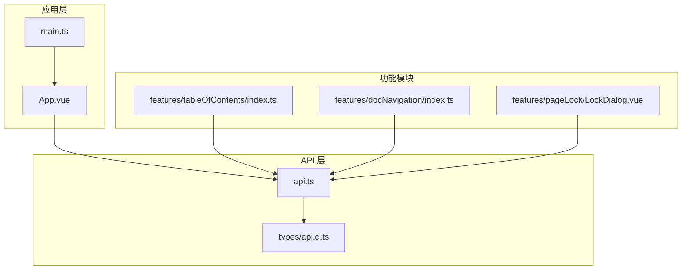
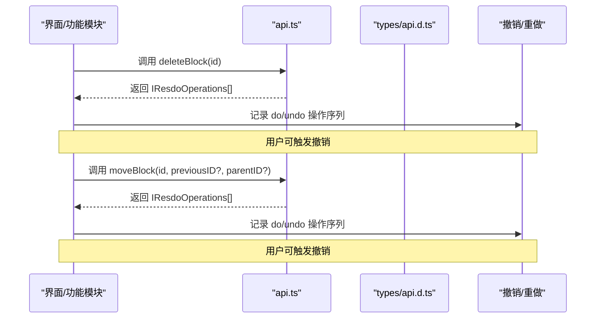
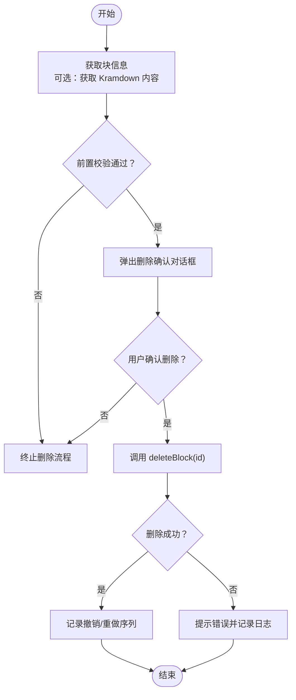
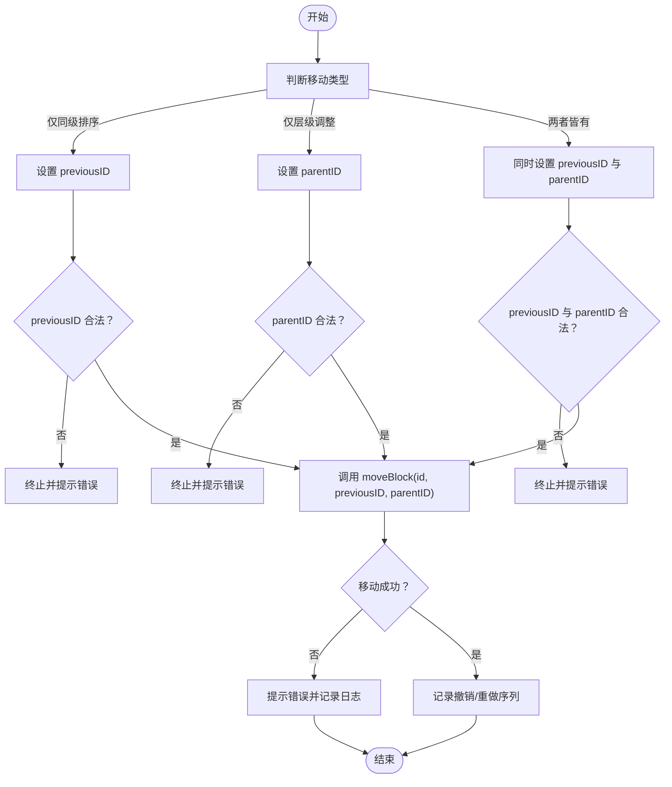
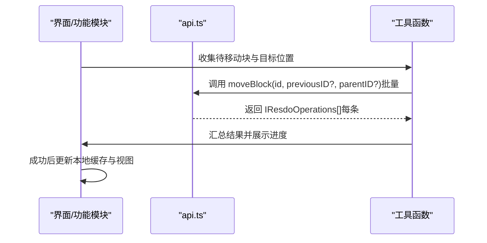
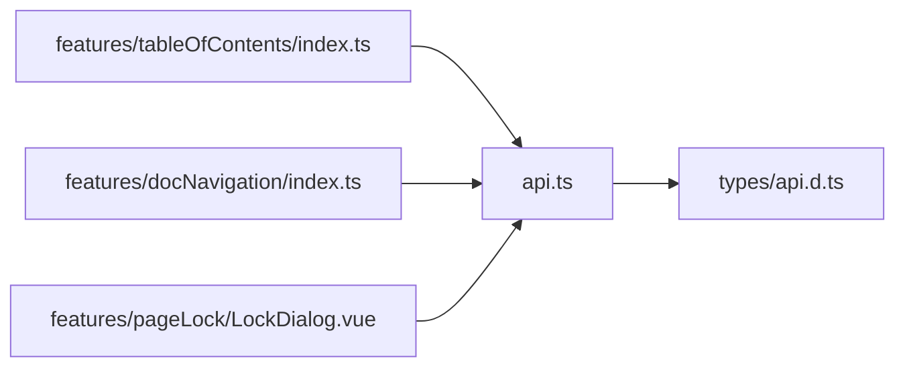

# 删除与移动块操作

<cite>
**本文引用的文件**
- [src/api.ts](file://src/api.ts)
- [src/types/api.d.ts](file://src/types/api.d.ts)
- [src/App.vue](file://src/App.vue)
- [src/main.ts](file://src/main.ts)
- [README.md](file://README.md)
- [src/features/tableOfContents/index.ts](file://src/features/tableOfContents/index.ts)
- [src/features/docNavigation/index.ts](file://src/features/docNavigation/index.ts)
- [src/features/pageLock/LockDialog.vue](file://src/features/pageLock/LockDialog.vue)
</cite>

## 目录
1. [简介](#简介)
2. [项目结构](#项目结构)
3. [核心组件](#核心组件)
4. [架构总览](#架构总览)
5. [详细组件分析](#详细组件分析)
6. [依赖关系分析](#依赖关系分析)
7. [性能考量](#性能考量)
8. [故障排查指南](#故障排查指南)
9. [结论](#结论)
10. [附录](#附录)

## 简介
本篇文档围绕“删除块”和“移动块”两大核心能力展开，结合仓库中的 API 封装与现有功能模块，系统讲解：
- 删除操作的不可逆特性与前置校验的重要性，并给出删除前确认对话框的实现思路；
- 移动操作中 previousID 与 parentID 参数的协同工作机制，演示如何实现块的同级排序与层级结构调整；
- 高级用例：重构文档结构、整理笔记顺序等；
- 强调操作的原子性特征，指导开发者设计事务回滚方案；
- 批量删除/移动的性能优化策略，以及处理跨文档移动时的边界情况。

## 项目结构
本项目采用 Vue3 + Vite 的插件模板，核心 API 封装位于 src/api.ts，类型定义位于 src/types/api.d.ts；应用入口与挂载逻辑位于 src/main.ts 与 src/App.vue。功能模块按领域拆分，例如目录与导航、页面锁定等，便于扩展与复用。

图表来源
- [src/App.vue](file://src/App.vue#L1-L216)
- [src/main.ts](file://src/main.ts#L1-L45)
- [src/api.ts](file://src/api.ts#L1-L496)
- [src/types/api.d.ts](file://src/types/api.d.ts#L1-L65)
- [src/features/tableOfContents/index.ts](file://src/features/tableOfContents/index.ts#L54-L170)
- [src/features/docNavigation/index.ts](file://src/features/docNavigation/index.ts#L45-L89)
- [src/features/pageLock/LockDialog.vue](file://src/features/pageLock/LockDialog.vue#L1-L200)

章节来源
- [README.md](file://README.md#L1-L120)
- [src/main.ts](file://src/main.ts#L1-L45)
- [src/App.vue](file://src/App.vue#L1-L216)
- [src/api.ts](file://src/api.ts#L1-L496)
- [src/types/api.d.ts](file://src/types/api.d.ts#L1-L65)

## 核心组件
- 删除块 API：deleteBlock(id)
- 移动块 API：moveBlock(id, previousID?, parentID?)
- 块信息与子块查询：getBlockKramdown(id)、getChildBlocks(id)
- 块属性读写：getBlockAttrs(id)、setBlockAttrs(id, attrs)
- SQL 查询：sql(sql)、getBlockByID(blockId)

这些 API 返回 IResdoOperations[]，表示一次操作的 do/undo 操作序列，可用于实现撤销/重做与事务回滚。

章节来源
- [src/api.ts](file://src/api.ts#L226-L247)
- [src/api.ts](file://src/api.ts#L249-L267)
- [src/api.ts](file://src/api.ts#L283-L304)
- [src/api.ts](file://src/api.ts#L307-L321)
- [src/types/api.d.ts](file://src/types/api.d.ts#L16-L20)

## 架构总览
下面的序列图展示了删除与移动操作从 UI 到 API 的典型调用链路，以及与撤销/重做机制的关系。

图表来源
- [src/api.ts](file://src/api.ts#L226-L247)
- [src/types/api.d.ts](file://src/types/api.d.ts#L16-L20)

## 详细组件分析

### 删除块 deleteBlock
- 作用：删除指定块，返回一次操作的 do/undo 序列，体现操作的原子性与可回滚能力。
- 不可逆性：删除操作一旦提交，将永久移除块及其子树（若存在），需在 UI 层进行强提示与二次确认。
- 前置校验建议：
  - 检查目标块是否为根文档块（避免误删根）；
  - 检查是否有重要引用或依赖；
  - 检查是否处于只读状态或受保护的文档；
  - 获取块的 Markdown 内容用于确认（可选）。
- 删除前确认对话框实现思路：
  - 在 UI 中弹出确认对话框，展示块标题/内容片段与风险提示；
  - 用户点击“确认删除”后才调用 deleteBlock；
  - 若用户取消，则终止流程。
- 与撤销/重做的关系：
  - 由于 API 返回 IResdoOperations[]，可在删除后将该序列加入撤销队列，以便用户撤销删除。

图表来源
- [src/api.ts](file://src/api.ts#L226-L233)
- [src/api.ts](file://src/api.ts#L249-L257)
- [src/types/api.d.ts](file://src/types/api.d.ts#L16-L20)

章节来源
- [src/api.ts](file://src/api.ts#L226-L233)
- [src/api.ts](file://src/api.ts#L249-L257)
- [src/types/api.d.ts](file://src/types/api.d.ts#L16-L20)

### 移动块 moveBlock
- 作用：将块移动到指定位置，支持同级排序与层级调整。
- 参数协同：
  - previousID：指定移动到该块之前的位置（同级排序）；
  - parentID：指定移动到的目标父节点（层级调整）。
- 业务场景：
  - 同级排序：仅设置 previousID，不改变父节点；
  - 层级调整：仅设置 parentID，不改变同级顺序；
  - 同时调整：同时设置 previousID 与 parentID，实现“移动到某父节点下的某位置”。
- 边界与约束：
  - previousID 与 parentID 不能同时指向与当前块不在同一文档的块；
  - previousID 与 parentID 不能同时指向当前块自身；
  - previousID 与 parentID 不能同时指向当前块的子节点（避免循环引用）。
- 建议的 UI 交互：
  - 拖拽排序时，计算目标 previousID；
  - 拖拽到不同父节点时，计算新的 parentID；
  - 对于跨文档移动，需额外校验权限与文档归属。

图表来源
- [src/api.ts](file://src/api.ts#L235-L247)
- [src/types/api.d.ts](file://src/types/api.d.ts#L16-L20)

章节来源
- [src/api.ts](file://src/api.ts#L235-L247)
- [src/types/api.d.ts](file://src/types/api.d.ts#L16-L20)

### 高级用例：重构文档结构与整理笔记顺序
- 重构文档结构：
  - 通过多次调用 moveBlock，将多个块从一个父节点移动到另一个父节点，形成新的层级关系；
  - 结合 getChildBlocks 获取子块列表，辅助定位移动目标；
  - 对于复杂结构调整，建议先收集一批移动指令，再统一执行，减少往返次数。
- 整理笔记顺序：
  - 使用 previousID 实现块的同级排序；
  - 可以按标题、时间戳或其他规则对块进行排序，然后批量调用 moveBlock；
  - 对于长列表，建议分批执行并提供进度反馈。

图表来源
- [src/api.ts](file://src/api.ts#L235-L247)
- [src/api.ts](file://src/api.ts#L259-L267)

章节来源
- [src/api.ts](file://src/api.ts#L235-L247)
- [src/api.ts](file://src/api.ts#L259-L267)

### 原子性与事务回滚
- 原子性：deleteBlock 与 moveBlock 返回 IResdoOperations[]，表示一次操作的 do/undo 序列，具备原子性特征；
- 事务回滚建议：
  - 对于批量操作，先在内存中收集所有 do/undo 序列；
  - 逐条执行，若中途失败，立即按逆序执行 undo；
  - 对于跨文档移动，建议在执行前预检目标文档的可写权限与容量限制；
  - 对于删除操作，可在执行前备份关键块的 Kramdown 内容，以便快速恢复。

章节来源
- [src/types/api.d.ts](file://src/types/api.d.ts#L16-L20)
- [src/api.ts](file://src/api.ts#L226-L247)
- [src/api.ts](file://src/api.ts#L249-L257)

### 删除前确认对话框实现示例（思路）
- 参考页面锁定对话框的实现思路，可复用类似的弹窗组件与事件机制：
  - 弹窗组件：参考 LockDialog.vue 的结构与交互；
  - 事件通信：通过 emit('confirm', ...) 触发确认回调；
  - 状态管理：在父组件中维护 visible、loading、错误提示等状态；
  - 业务绑定：在确认后调用 deleteBlock 并处理结果与回滚。
- 该思路可直接迁移到删除确认场景，提升用户体验与安全性。

章节来源
- [src/features/pageLock/LockDialog.vue](file://src/features/pageLock/LockDialog.vue#L1-L200)
- [src/App.vue](file://src/App.vue#L1-L216)

## 依赖关系分析
- API 层依赖：
  - fetchSyncPost 用于同步请求（在 api.ts 中封装）；
  - IResdoOperations 类型定义来自 types/api.d.ts；
- 功能模块依赖：
  - 目录与导航模块通过 sql 与 getBlockByID 获取块信息；
  - 页面锁定模块提供对话框组件，可作为删除确认对话框的参考实现。

图表来源
- [src/api.ts](file://src/api.ts#L1-L496)
- [src/types/api.d.ts](file://src/types/api.d.ts#L1-L65)
- [src/features/tableOfContents/index.ts](file://src/features/tableOfContents/index.ts#L54-L170)
- [src/features/docNavigation/index.ts](file://src/features/docNavigation/index.ts#L45-L89)
- [src/features/pageLock/LockDialog.vue](file://src/features/pageLock/LockDialog.vue#L1-L200)

章节来源
- [src/api.ts](file://src/api.ts#L1-L496)
- [src/types/api.d.ts](file://src/types/api.d.ts#L1-L65)
- [src/features/tableOfContents/index.ts](file://src/features/tableOfContents/index.ts#L54-L170)
- [src/features/docNavigation/index.ts](file://src/features/docNavigation/index.ts#L45-L89)
- [src/features/pageLock/LockDialog.vue](file://src/features/pageLock/LockDialog.vue#L1-L200)

## 性能考量
- 批量操作：
  - 合并移动指令：先在内存中收集所有移动指令，再统一执行，减少网络往返；
  - 分批提交：对大量块的移动/删除，采用分批策略并提供进度反馈；
  - 预检与去重：在执行前对 previousID 与 parentID 进行合法性预检，避免无效请求。
- 跨文档移动：
  - 仅允许在同一工作区内的文档间移动，避免跨工作区或跨笔记本的复杂边界；
  - 对于大文档，建议在移动前获取子树信息，避免不必要的重排。
- 原子性与回滚：
  - 通过 IResdoOperations[] 实现局部回滚，失败即回滚，保证数据一致性；
  - 对于不可逆操作（如删除），建议在 UI 层增加强确认与二次确认。

[本节为通用性能建议，不直接分析具体文件]

## 故障排查指南
- 删除失败：
  - 检查目标块是否为根文档块或受保护；
  - 确认网络请求是否成功，查看返回的 IResdoOperations[]；
  - 若失败，优先执行对应的 undo 操作。
- 移动失败：
  - 检查 previousID 与 parentID 的合法性与文档归属；
  - 确认目标父节点是否存在、是否可写；
  - 对于跨文档移动，检查权限与文档归属。
- 事务回滚：
  - 若批量操作部分失败，按逆序执行 undo；
  - 对于删除操作，可利用 getBlockKramdown 备份内容，必要时进行恢复。

章节来源
- [src/api.ts](file://src/api.ts#L226-L247)
- [src/api.ts](file://src/api.ts#L249-L257)
- [src/types/api.d.ts](file://src/types/api.d.ts#L16-L20)

## 结论
- 删除与移动是块级编辑的核心能力，具有不可逆性与原子性特征；
- 建议在 UI 层引入强确认与二次确认机制，配合撤销/重做能力提升安全性；
- 通过合理使用 previousID 与 parentID，可灵活实现同级排序与层级调整；
- 批量操作应注重性能与一致性，采用分批、预检与回滚策略；
- 跨文档移动需严格校验权限与文档归属，避免产生非法状态。

[本节为总结性内容，不直接分析具体文件]

## 附录
- 相关 API 一览（路径引用）
  - 删除块：[deleteBlock](file://src/api.ts#L226-L233)
  - 移动块：[moveBlock](file://src/api.ts#L235-L247)
  - 获取块 Kramdown：[getBlockKramdown](file://src/api.ts#L249-L257)
  - 获取子块：[getChildBlocks](file://src/api.ts#L259-L267)
  - 设置/获取块属性：[setBlockAttrs](file://src/api.ts#L283-L294)、[getBlockAttrs](file://src/api.ts#L296-L304)
  - SQL 查询与块查询：[sql](file://src/api.ts#L307-L314)、[getBlockByID](file://src/api.ts#L316-L321)
  - 类型定义：[IResdoOperations](file://src/types/api.d.ts#L16-L20)