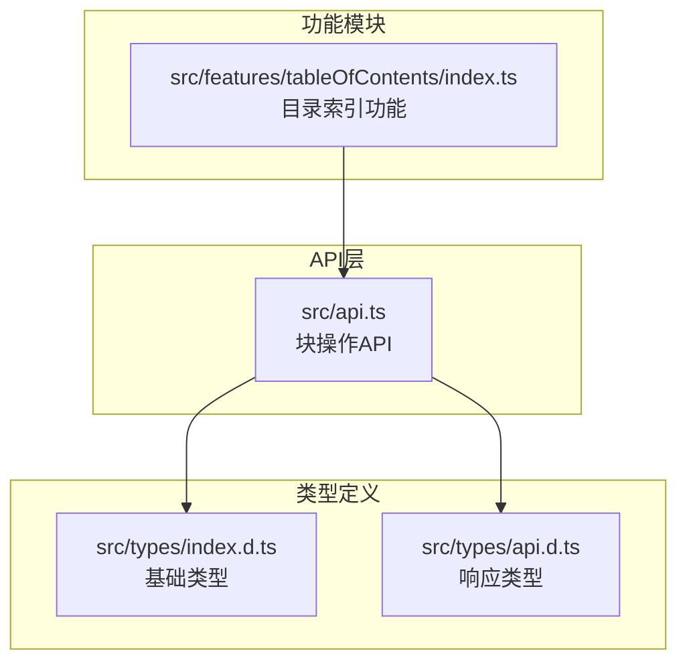
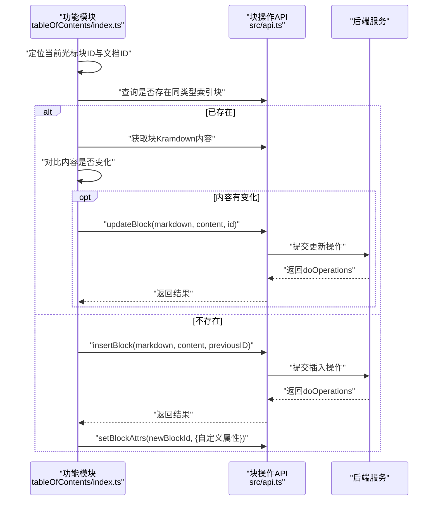
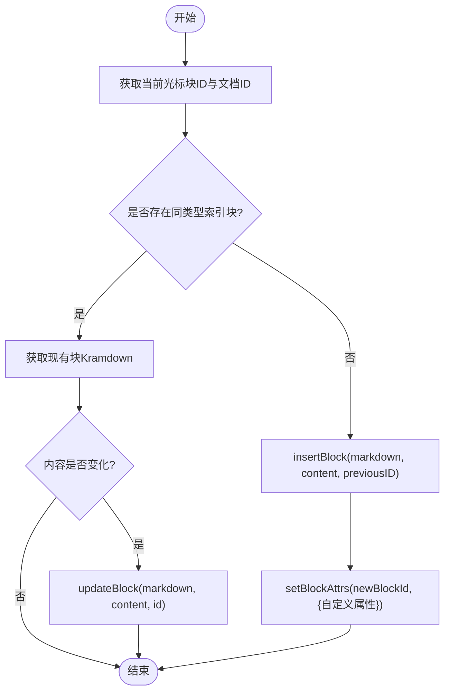
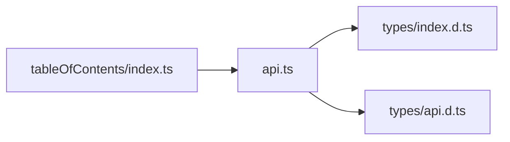

# 块操作

<cite>
**本文引用的文件**
- [src/api.ts](file://src/api.ts)
- [src/types/api.d.ts](file://src/types/api.d.ts)
- [src/types/index.d.ts](file://src/types/index.d.ts)
- [src/features/tableOfContents/index.ts](file://src/features/tableOfContents/index.ts)
</cite>

## 目录
1. [简介](#简介)
2. [项目结构](#项目结构)
3. [核心组件](#核心组件)
4. [架构总览](#架构总览)
5. [详细组件分析](#详细组件分析)
6. [依赖关系分析](#依赖关系分析)
7. [性能考虑](#性能考虑)
8. [故障排查指南](#故障排查指南)
9. [结论](#结论)
10. [附录](#附录)

## 简介
本指南围绕 src/api.ts 中封装的“块操作”API，系统讲解插入、更新、删除、移动、获取块内容与子块等能力，并结合仓库内的实际使用案例，给出数据类型（dataType）选择、批量操作最佳实践、失败处理与事务回滚策略建议。目标是帮助开发者在实际功能模块中高效、安全地组织与维护文档结构，例如在文档中插入内容、更新代码块、构建目录索引等。

## 项目结构
- 块操作API集中在 src/api.ts 的“Block”区域，提供 insertBlock、prependBlock、appendBlock、updateBlock、deleteBlock、moveBlock、getBlockKramdown、getChildBlocks、transferBlockRef 等方法。
- 类型定义位于 src/types/index.d.ts 与 src/types/api.d.ts，明确 BlockId、DocumentId、BlockType、BlockSubType、DataType、doOperation 等关键类型。
- 实际使用示例可见 src/features/tableOfContents/index.ts，展示了如何在功能模块中调用 insertBlock、updateBlock、getBlockKramdown、setBlockAttrs 等API完成“目录索引”自动化。

**图表来源**
- [src/api.ts](file://src/api.ts#L165-L282)
- [src/types/index.d.ts](file://src/types/index.d.ts#L1-L142)
- [src/types/api.d.ts](file://src/types/api.d.ts#L1-L65)
- [src/features/tableOfContents/index.ts](file://src/features/tableOfContents/index.ts#L1-L410)

**章节来源**
- [src/api.ts](file://src/api.ts#L165-L282)
- [src/types/index.d.ts](file://src/types/index.d.ts#L1-L142)
- [src/types/api.d.ts](file://src/types/api.d.ts#L1-L65)
- [src/features/tableOfContents/index.ts](file://src/features/tableOfContents/index.ts#L1-L410)

## 核心组件
- 数据类型（DataType）
  - "markdown"：以 Markdown 字符串形式写入或更新块内容，适合富文本、列表、标题、代码块等。
  - "dom"：以 DOM 字符串形式写入或更新块内容，适合需要保留特定HTML结构的场景。
- 响应类型（IResdoOperations）
  - 包含 doOperations 数组，记录本次操作产生的具体变更；undoOperations 可能为空，表示不可回滚或未提供。
- 关键类型
  - BlockId、DocumentId、ParentID、PreviousID：用于定位父块、前驱块、目标块。
  - BlockType、BlockSubType：块类型与子类型，用于区分标题、段落、代码、图片等。

**章节来源**
- [src/api.ts](file://src/api.ts#L166-L166)
- [src/types/api.d.ts](file://src/types/api.d.ts#L16-L20)
- [src/types/index.d.ts](file://src/types/index.d.ts#L1-L142)

## 架构总览
块操作API通过统一的请求封装函数向后端发起同步请求，返回标准化的 doOperations 结果，便于上层模块进行后续处理（如设置块属性、查询子块、获取Kramdown等）。功能模块通过组合多个API实现复杂业务，例如目录索引模块会先查询现有索引块，若存在则更新，否则插入新块并打上自定义属性标记。

**图表来源**
- [src/features/tableOfContents/index.ts](file://src/features/tableOfContents/index.ts#L132-L191)
- [src/api.ts](file://src/api.ts#L166-L282)

**章节来源**
- [src/features/tableOfContents/index.ts](file://src/features/tableOfContents/index.ts#L132-L191)
- [src/api.ts](file://src/api.ts#L166-L282)

## 详细组件分析

### insertBlock（在指定位置插入块）
- 参数要点
  - dataType：选择 "markdown" 或 "dom"
  - data：要插入的内容字符串
  - nextID/previousID：相对位置参考，用于控制插入顺序
  - parentID：父块或文档ID，决定层级归属
- 使用场景
  - 在当前光标块之后插入新内容（如目录索引）
  - 在某段落末尾追加说明
- 注意事项
  - 若仅提供 previousID，则插入为兄弟节点；若提供 parentID，则插入为子节点
  - 当同时提供 parentID 与 previousID 时，通常以 parentID 为准确定层级
- 实际示例路径
  - [插入新块并打上自定义属性](file://src/features/tableOfContents/index.ts#L168-L185)

**图表来源**
- [src/features/tableOfContents/index.ts](file://src/features/tableOfContents/index.ts#L132-L191)
- [src/api.ts](file://src/api.ts#L166-L211)

**章节来源**
- [src/api.ts](file://src/api.ts#L166-L211)
- [src/features/tableOfContents/index.ts](file://src/features/tableOfContents/index.ts#L168-L185)

### prependBlock（作为父块的第一个子块插入）
- 参数要点
  - dataType：选择 "markdown" 或 "dom"
  - data：要插入的内容字符串
  - parentID：父块或文档ID
- 使用场景
  - 在文档开头插入引导内容
  - 在容器块内部最前位置插入提示或说明
- 注意事项
  - 仅影响层级关系，不涉及兄弟顺序
  - 适合需要“置顶”的内容

**章节来源**
- [src/api.ts](file://src/api.ts#L185-L197)

### appendBlock（作为父块的最后一个子块插入）
- 参数要点
  - dataType：选择 "markdown" 或 "dom"
  - data：要插入的内容字符串
  - parentID：父块或文档ID
- 使用场景
  - 在章节末尾追加补充说明
  - 在列表末尾追加备注
- 注意事项
  - 仅影响层级关系，不涉及兄弟顺序
  - 适合需要“收尾”的内容

**章节来源**
- [src/api.ts](file://src/api.ts#L199-L211)

### updateBlock（更新指定块内容）
- 参数要点
  - dataType：选择 "markdown" 或 "dom"
  - data：新的内容字符串
  - id：目标块ID
- 使用场景
  - 更新目录索引内容
  - 修改代码块语言或代码
- 注意事项
  - 建议先获取 Kramdown 进行内容对比，避免不必要的更新
  - 对于“dom”类型，确保传入合法DOM字符串

**章节来源**
- [src/api.ts](file://src/api.ts#L213-L225)
- [src/features/tableOfContents/index.ts](file://src/features/tableOfContents/index.ts#L161-L169)

### deleteBlock（删除指定块）
- 参数要点
  - id：目标块ID
- 使用场景
  - 清理过期的索引块
  - 删除无效的占位内容
- 注意事项
  - 删除操作不可逆，建议在执行前确认目标块与上下文
  - 若存在子块，通常会一并删除

**章节来源**
- [src/api.ts](file://src/api.ts#L227-L233)

### moveBlock（移动块）
- 参数要点
  - id：目标块ID
  - previousID：移动到该兄弟块之前
  - parentID：移动到该父块内部
- 使用场景
  - 调整目录结构顺序
  - 将段落移动到另一个章节下
- 注意事项
  - 同时提供 previousID 与 parentID 时，通常以 parentID 为准确定层级
  - 移动可能影响多处引用，需谨慎

**章节来源**
- [src/api.ts](file://src/api.ts#L235-L247)

### getBlockKramdown（获取块Kramdown）
- 参数要点
  - id：目标块ID
- 使用场景
  - 对比内容是否变化，避免重复更新
  - 生成导出内容或预览
- 注意事项
  - 返回包含 id 与 kramdown 字段的对象

**章节来源**
- [src/api.ts](file://src/api.ts#L249-L257)
- [src/features/tableOfContents/index.ts](file://src/features/tableOfContents/index.ts#L150-L169)

### getChildBlocks（获取子块）
- 参数要点
  - id：父块ID
- 使用场景
  - 构建目录树
  - 统计子文档数量
- 注意事项
  - 返回数组包含子块的 id、type、subtype 等信息

**章节来源**
- [src/api.ts](file://src/api.ts#L259-L267)

### transferBlockRef（转移块引用）
- 参数要点
  - fromID：源块ID
  - toID：目标块ID
  - refIDs：要转移的引用块ID数组
- 使用场景
  - 批量迁移引用关系
- 注意事项
  - 适用于跨块引用的场景

**章节来源**
- [src/api.ts](file://src/api.ts#L269-L281)

### setBlockAttrs / getBlockAttrs（设置/获取块属性）
- 参数要点
  - id：块ID
  - attrs：键值对属性对象
- 使用场景
  - 为新插入的索引块打上自定义标记，便于后续识别与更新
- 注意事项
  - 属性键名需语义清晰，避免冲突

**章节来源**
- [src/api.ts](file://src/api.ts#L284-L304)
- [src/features/tableOfContents/index.ts](file://src/features/tableOfContents/index.ts#L171-L185)

## 依赖关系分析
- 模块耦合
  - 功能模块（如目录索引）依赖 API 层提供的 insertBlock、updateBlock、getBlockKramdown、setBlockAttrs 等方法
  - API 层依赖类型定义（index.d.ts）中的 BlockId、DocumentId、DataType 等类型
- 直接依赖
  - tableOfContents/index.ts 直接导入 api.ts 并调用其中的块操作API
- 外部接口
  - API 层通过统一请求封装向后端发送同步请求，返回标准化的 doOperations 结果

**图表来源**
- [src/features/tableOfContents/index.ts](file://src/features/tableOfContents/index.ts#L1-L410)
- [src/api.ts](file://src/api.ts#L165-L282)
- [src/types/index.d.ts](file://src/types/index.d.ts#L1-L142)
- [src/types/api.d.ts](file://src/types/api.d.ts#L1-L65)

**章节来源**
- [src/features/tableOfContents/index.ts](file://src/features/tableOfContents/index.ts#L1-L410)
- [src/api.ts](file://src/api.ts#L165-L282)
- [src/types/index.d.ts](file://src/types/index.d.ts#L1-L142)
- [src/types/api.d.ts](file://src/types/api.d.ts#L1-L65)

## 性能考虑
- 批量操作建议
  - 合并多次 insert/update 为一次操作，减少往返次数
  - 对于大量子块的场景，优先使用 getChildBlocks 获取列表后再做批量处理
- 内容对比
  - 在 updateBlock 前先调用 getBlockKramdown 获取当前内容，进行规范化对比，避免无谓更新
- 异步与并发
  - 避免在短时间内连续发起大量API请求，必要时使用节流/防抖
- 类型选择
  - 优先使用 "markdown"，除非确实需要保留特定DOM结构才使用 "dom"

[本节为通用建议，不直接分析具体文件]

## 故障排查指南
- 常见问题
  - 无法获取当前光标块ID：检查编辑器上下文与选择状态
  - 插入失败或返回空结果：确认 dataType 与 data 格式正确，以及 parentID/previousID 是否有效
  - 更新无效：确认对比逻辑是否正确，避免因换行符或空白字符差异导致误判
- 错误处理
  - 对每个API调用进行 try/catch 包裹，并在失败时提示用户或记录日志
  - 对于 insertBlock/appendBlock/prependBlock，若需要后续属性设置，需检查 doOperations 中的 id 是否可用
- 事务回滚策略
  - 后端返回的 doOperations/undoOperations 可用于部分回滚；若未提供 undoOperations，建议在前端维护轻量级本地回滚栈（如记录插入/更新前的Kramdown），以便手动恢复

**章节来源**
- [src/features/tableOfContents/index.ts](file://src/features/tableOfContents/index.ts#L132-L191)
- [src/api.ts](file://src/api.ts#L166-L282)

## 结论
通过统一的块操作API，开发者可以在功能模块中灵活地插入、更新、删除、移动与查询块，配合属性标记与Kramdown对比，能够实现诸如“目录索引”等复杂业务。建议在实际开发中遵循“先查询/对比，再操作”的流程，合理选择 dataType，并在批量场景中尽量合并请求，以获得更好的性能与用户体验。

[本节为总结性内容，不直接分析具体文件]

## 附录
- 数据类型（DataType）选择建议
  - "markdown"：通用富文本、标题、列表、代码块等
  - "dom"：需要保留特定HTML结构或复杂DOM时使用
- 关键类型速览
  - BlockId、DocumentId、ParentID、PreviousID、BlockType、BlockSubType、DataType、doOperation

**章节来源**
- [src/types/index.d.ts](file://src/types/index.d.ts#L1-L142)
- [src/types/api.d.ts](file://src/types/api.d.ts#L1-L65)