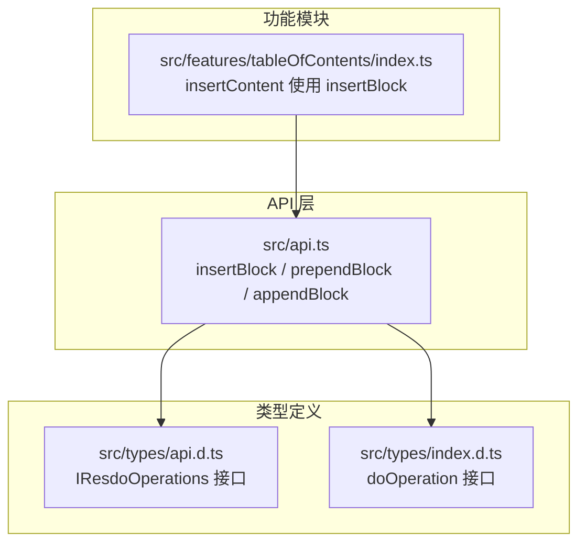
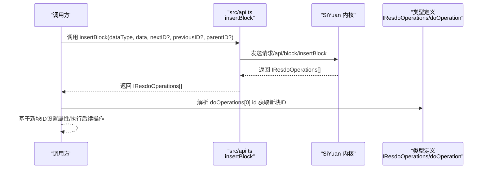
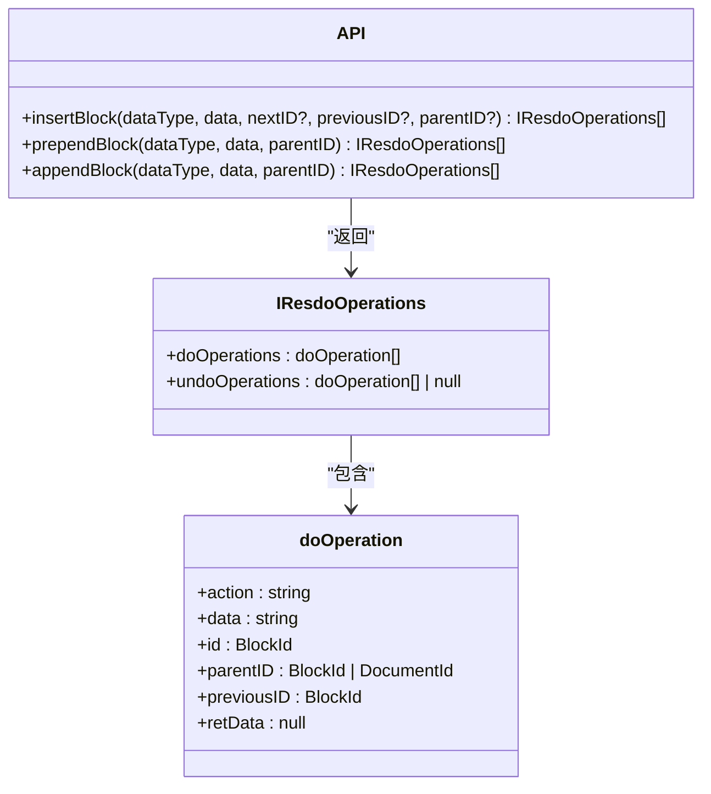

# 插入块操作

<cite>
**本文引用的文件**
- [src/api.ts](file://src/api.ts)
- [src/types/api.d.ts](file://src/types/api.d.ts)
- [src/types/index.d.ts](file://src/types/index.d.ts)
- [src/features/tableOfContents/index.ts](file://src/features/tableOfContents/index.ts)
</cite>

## 目录
1. [简介](#简介)
2. [项目结构](#项目结构)
3. [核心组件](#核心组件)
4. [架构总览](#架构总览)
5. [详细组件分析](#详细组件分析)
6. [依赖关系分析](#依赖关系分析)
7. [性能考量](#性能考量)
8. [故障排查指南](#故障排查指南)
9. [结论](#结论)
10. [附录](#附录)

## 简介
本指南围绕 SiYuan 插件中“插入块”相关 API 展开，重点讲解 insertBlock、prependBlock、appendBlock 三个方法的使用方式与最佳实践。内容涵盖：
- 参数详解与 dataType（markdown 与 dom）的选择策略
- 在文档开头、结尾与中间位置插入内容的实战思路
- 如何构建合法的 Kramdown 语法
- 操作成功后的 IResdoOperations 数组结构与用途（获取新生成块 ID）
- 结合功能模块的实际用例（快捷插入模板、批量内容生成）
- 事务性操作特性与组合多步操作实现复杂布局
- 错误处理机制与常见问题定位

## 项目结构
与插入块操作直接相关的代码主要分布在以下位置：
- API 封装层：提供 insertBlock、prependBlock、appendBlock 等方法
- 类型定义：描述 IResdoOperations、doOperation 等返回结构
- 功能模块：以“目录索引”为例，演示 insertBlock 的实际用法与返回值解析

图表来源
- [src/api.ts](file://src/api.ts#L166-L211)
- [src/types/api.d.ts](file://src/types/api.d.ts#L16-L24)
- [src/types/index.d.ts](file://src/types/index.d.ts#L105-L112)
- [src/features/tableOfContents/index.ts](file://src/features/tableOfContents/index.ts#L132-L185)

章节来源
- [src/api.ts](file://src/api.ts#L166-L211)
- [src/types/api.d.ts](file://src/types/api.d.ts#L16-L24)
- [src/types/index.d.ts](file://src/types/index.d.ts#L105-L112)
- [src/features/tableOfContents/index.ts](file://src/features/tableOfContents/index.ts#L132-L185)

## 核心组件
- insertBlock(dataType, data, nextID?, previousID?, parentID?)
  - 作用：在指定块的前后或父容器中插入新块
  - 关键参数：
    - dataType：选择 "markdown" 或 "dom"
    - data：要插入的内容（Kramdown 字符串或 DOM 片段）
    - nextID/previousID：相对位置控制（插入到某块之后/之前）
    - parentID：父容器（块或文档）
  - 返回：IResdoOperations[]，包含 doOperations（含新块 ID 等）

- prependBlock(dataType, data, parentID)
  - 作用：向父容器头部追加子块
  - 返回：IResdoOperations[]

- appendBlock(dataType, data, parentID)
  - 作用：向父容器尾部追加子块
  - 返回：IResdoOperations[]

- IResdoOperations/doOperation
  - IResdoOperations.doOperations：本次操作产生的具体变更项数组
  - doOperation：包含 action、data、id、parentID、previousID、retData 等字段
  - 典型用途：从 doOperations[0].id 获取新生成块的 ID

章节来源
- [src/api.ts](file://src/api.ts#L166-L211)
- [src/types/api.d.ts](file://src/types/api.d.ts#L16-L24)
- [src/types/index.d.ts](file://src/types/index.d.ts#L105-L112)

## 架构总览
下面的序列图展示了 insertBlock 的典型调用流程与返回结构解析：

图表来源
- [src/api.ts](file://src/api.ts#L166-L211)
- [src/types/api.d.ts](file://src/types/api.d.ts#L16-L24)
- [src/types/index.d.ts](file://src/types/index.d.ts#L105-L112)

## 详细组件分析

### insertBlock 参数与行为
- 参数说明
  - dataType：选择 "markdown" 或 "dom"
    - markdown：传入 Kramdown 文本，适合结构化内容（标题、列表、表格、引用等）
    - dom：传入 DOM 片段，适合富文本或 HTML 片段
  - data：插入内容主体
  - nextID/previousID：控制相对位置
    - 若仅提供 previousID，则插入到该块之后
    - 若仅提供 nextID，则插入到该块之前
    - 两者都提供时，优先遵循 nextID/previousID 的相对顺序约束
  - parentID：父容器（块或文档），决定插入层级
- 返回结构
  - IResdoOperations[].doOperations[0].id 即为新生成块的 ID
  - 可据此对新块设置自定义属性或执行进一步操作

章节来源
- [src/api.ts](file://src/api.ts#L166-L183)
- [src/types/api.d.ts](file://src/types/api.d.ts#L16-L24)
- [src/types/index.d.ts](file://src/types/index.d.ts#L105-L112)

### prependBlock 与 appendBlock
- prependBlock
  - 作用：向父容器头部追加子块
  - 适用场景：在容器最前插入内容（如在文档开头插入引导块）
- appendBlock
  - 作用：向父容器尾部追加子块
  - 适用场景：在容器最后插入内容（如在文档末尾追加总结块）

章节来源
- [src/api.ts](file://src/api.ts#L185-L211)

### dataType 选择策略
- 选择 "markdown"
  - 优点：语义清晰、便于渲染与导出；适合标题、段落、列表、表格、引用等结构化内容
  - 注意：需遵循 Kramdown 语法规范，避免非法嵌套
- 选择 "dom"
  - 优点：可直接插入 HTML 片段，适合富文本或复杂 DOM 结构
  - 注意：需要确保 DOM 结构与编辑器兼容，避免破坏文档一致性

章节来源
- [src/api.ts](file://src/api.ts#L166-L183)

### 在文档开头、结尾与中间插入内容的实践

- 文档开头插入
  - 思路：使用 prependBlock(parentID) 在文档根节点头部插入
  - 示例参考：功能模块中对 prependBlock 的使用模式（可类比）
  - 注意：parentID 应为目标文档 ID

- 文档结尾插入
  - 思路：使用 appendBlock(parentID) 在文档根节点尾部插入
  - 示例参考：功能模块中对 appendBlock 的使用模式（可类比）
  - 注意：parentID 应为目标文档 ID

- 中间位置插入
  - 思路：使用 insertBlock(dataType, data, nextID?, previousID?, parentID?)
  - 场景一：插入到某块之后（仅提供 previousID）
  - 场景二：插入到某块之前（仅提供 nextID）
  - 场景三：同时提供 nextID 与 previousID，精确控制相对顺序
  - 示例参考：功能模块中 insertBlock 的实际调用与返回值解析

章节来源
- [src/api.ts](file://src/api.ts#L166-L211)
- [src/features/tableOfContents/index.ts](file://src/features/tableOfContents/index.ts#L132-L185)

### 构建合法的 Kramdown 语法
- 基本原则
  - 遵循 Kramdown 语法规范，避免非法嵌套与未闭合标签
  - 列表、表格、引用等块级元素需正确缩进与分隔
  - 引用块语法（如 ((id "锚文本"))）可用于跨块链接
- 实战建议
  - 先在编辑器中预览效果，再通过 API 插入
  - 对于复杂结构，建议分步插入并逐步验证
  - 使用 getBlockKramdown 获取现有块的 Kramdown，作为模板参考

章节来源
- [src/api.ts](file://src/api.ts#L249-L257)
- [src/features/tableOfContents/index.ts](file://src/features/tableOfContents/index.ts#L150-L168)

### IResdoOperations 数组结构与用途
- 结构说明
  - IResdoOperations.doOperations：本次操作产生的具体变更项数组
  - doOperation.action/data/id/parentID/previousID/retData：描述一次具体变更
- 常见用途
  - 从 doOperations[0].id 获取新生成块的 ID，以便后续设置属性或联动操作
  - 通过 undoOperations 进行撤销（若存在）

章节来源
- [src/types/api.d.ts](file://src/types/api.d.ts#L16-L24)
- [src/types/index.d.ts](file://src/types/index.d.ts#L105-L112)
- [src/features/tableOfContents/index.ts](file://src/features/tableOfContents/index.ts#L170-L185)

### 事务性操作与复杂布局组合
- 事务性
  - insertBlock/prependBlock/appendBlock 返回的 IResdoOperations[] 表示一次原子操作的结果
  - 若需要多步操作（如插入多个块并设置属性），应按顺序调用并在每一步检查返回值
- 组合策略
  - 先插入主内容，再插入辅助块（如说明、提示）
  - 使用新块 ID 设置自定义属性，便于后续检索与管理
  - 对于批量内容生成，建议分批插入并记录每批的起始/结束块 ID，便于后续维护

章节来源
- [src/api.ts](file://src/api.ts#L166-L211)
- [src/features/tableOfContents/index.ts](file://src/features/tableOfContents/index.ts#L170-L185)

### 实际用例：快捷插入模板与批量内容生成
- 快捷插入模板
  - 通过命令绑定触发，根据当前光标位置调用 insertBlock/prependBlock/appendBlock
  - 成功后解析 doOperations[0].id 并设置自定义属性，便于后续识别与更新
- 批量内容生成
  - 分步骤插入多个块，记录每步返回的新块 ID
  - 对每个新块设置属性或执行进一步操作（如更新、移动、删除）

章节来源
- [src/features/tableOfContents/index.ts](file://src/features/tableOfContents/index.ts#L132-L185)

## 依赖关系分析
- API 层依赖类型定义
  - insertBlock/prependBlock/appendBlock 返回 IResdoOperations[]
  - IResdoOperations 由 doOperation 组成
- 功能模块依赖 API 层
  - 通过 insertBlock 插入内容，并解析返回值获取新块 ID
  - 基于新块 ID 设置自定义属性

图表来源
- [src/api.ts](file://src/api.ts#L166-L211)
- [src/types/api.d.ts](file://src/types/api.d.ts#L16-L24)
- [src/types/index.d.ts](file://src/types/index.d.ts#L105-L112)

章节来源
- [src/api.ts](file://src/api.ts#L166-L211)
- [src/types/api.d.ts](file://src/types/api.d.ts#L16-L24)
- [src/types/index.d.ts](file://src/types/index.d.ts#L105-L112)

## 性能考量
- 合理选择 dataType
  - 大量结构化内容优先使用 "markdown"，减少 DOM 解析成本
- 批量插入
  - 将多个小块合并为一个大块插入，减少往返次数
- 返回值解析
  - 仅在必要时解析 doOperations，避免重复计算
- 事务性组合
  - 将多个操作组合为一次调用链，减少中间状态的可见性与重绘

## 故障排查指南
- 目标块不存在
  - 现象：insertBlock/prependBlock/appendBlock 抛出异常或返回空结果
  - 处理：在调用前校验 parentID/nextID/previousID 是否有效；必要时回退到文档根节点
- Kramdown 语法不合法
  - 现象：插入后渲染异常或报错
  - 处理：先在编辑器中验证语法；对复杂结构分步插入
- 返回值为空或 ID 不存在
  - 现象：doOperations 为空或 id 为空
  - 处理：检查请求参数与权限；确认返回结构是否符合预期
- 错误处理示例
  - 功能模块中对 insertBlock 的调用进行了 try/catch 包裹，并通过消息提示反馈错误

章节来源
- [src/features/tableOfContents/index.ts](file://src/features/tableOfContents/index.ts#L132-L191)

## 结论
- insertBlock/prependBlock/appendBlock 是实现“插入块”的三大核心 API
- 正确选择 dataType（markdown/dom）与合理设置 nextID/previousID/parentID 是关键
- 通过解析 IResdoOperations.doOperations[0].id 可获取新块 ID，实现后续属性设置与联动
- 结合事务性与组合策略，可实现复杂的批量布局与模板化插入
- 建议在生产环境中加入完善的错误处理与日志记录，提升稳定性与可观测性

## 附录
- 相关 API 与类型定义路径
  - [insertBlock/insertBlock/appendBlock 定义](file://src/api.ts#L166-L211)
  - [IResdoOperations 接口定义](file://src/types/api.d.ts#L16-L24)
  - [doOperation 接口定义](file://src/types/index.d.ts#L105-L112)
  - [功能模块中 insertBlock 的实际用法](file://src/features/tableOfContents/index.ts#L132-L185)