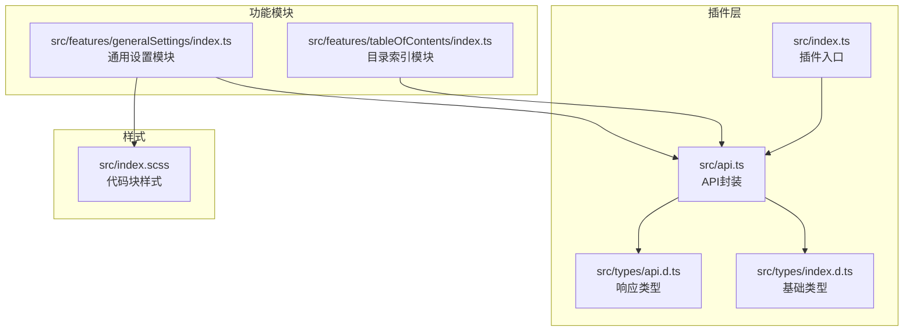
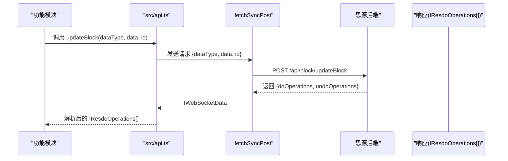
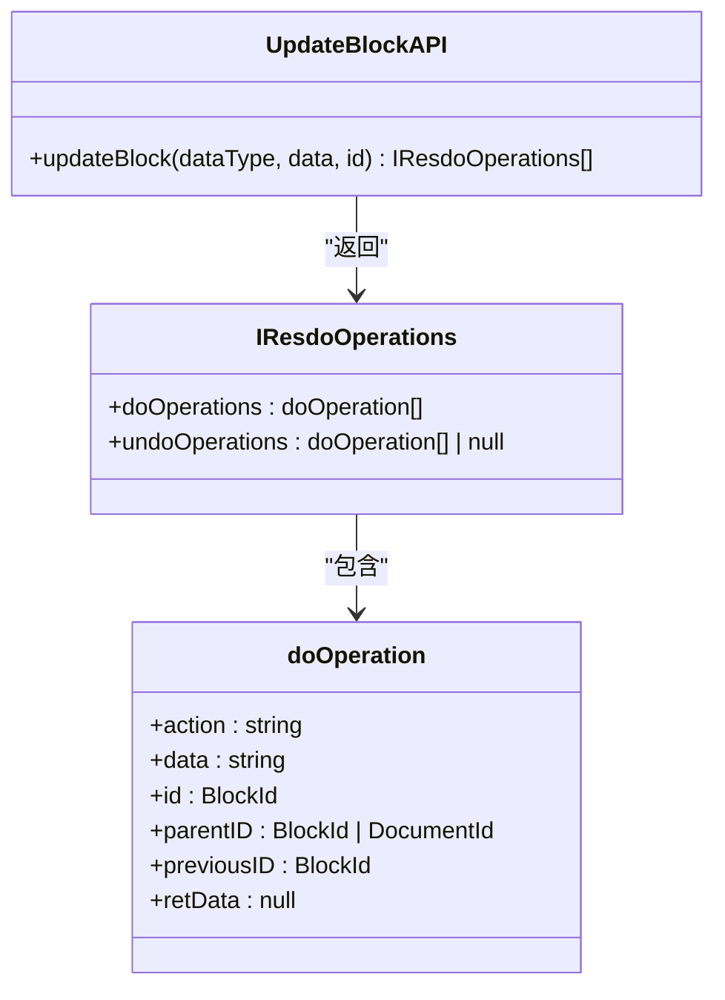
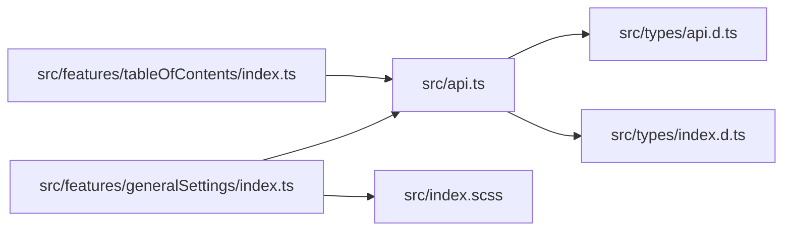

# 更新块操作

<cite>
**本文引用的文件**
- [README.md](file://README.md)
- [src/api.ts](file://src/api.ts)
- [src/types/api.d.ts](file://src/types/api.d.ts)
- [src/types/index.d.ts](file://src/types/index.d.ts)
- [src/features/tableOfContents/index.ts](file://src/features/tableOfContents/index.ts)
- [src/features/generalSettings/index.ts](file://src/features/generalSettings/index.ts)
- [src/index.scss](file://src/index.scss)
</cite>

## 目录
1. [简介](#简介)
2. [项目结构](#项目结构)
3. [核心组件](#核心组件)
4. [架构总览](#架构总览)
5. [详细组件分析](#详细组件分析)
6. [依赖分析](#依赖分析)
7. [性能考虑](#性能考虑)
8. [故障排查指南](#故障排查指南)
9. [结论](#结论)
10. [附录](#附录)

## 简介
本文件围绕 updateBlock API 的实现机制与最佳实践展开，重点说明：
- 使用 markdown 与 dom 两种数据类型更新块内容的差异与注意事项；
- HTML 结构更新的关键点与风险规避；
- 更新代码块、修改标题、替换段落等典型场景的使用路径；
- IResdoOperations 数据结构在版本控制与撤销机制中的作用；
- 如何安全地进行内容替换，避免破坏块之间的引用关系；
- 性能优化建议（避免频繁小更新）；
- 常见失败原因与调试方法（权限、数据格式等）。

## 项目结构
该项目为一个基于 Vite + Vue3 的思源笔记插件模板，updateBlock API 的封装位于 src/api.ts，类型定义位于 src/types 目录。功能模块示例（如目录索引）展示了 updateBlock 的实际使用路径。

图表来源
- [src/api.ts](file://src/api.ts#L166-L250)
- [src/types/api.d.ts](file://src/types/api.d.ts#L16-L20)
- [src/types/index.d.ts](file://src/types/index.d.ts#L105-L112)
- [src/features/tableOfContents/index.ts](file://src/features/tableOfContents/index.ts#L132-L191)
- [src/features/generalSettings/index.ts](file://src/features/generalSettings/index.ts#L198-L212)
- [src/index.scss](file://src/index.scss#L319-L367)

章节来源
- [README.md](file://README.md#L260-L315)
- [src/api.ts](file://src/api.ts#L166-L250)

## 核心组件
- updateBlock 封装：位于 src/api.ts，负责调用 /api/block/updateBlock，支持 dataType 为 "markdown" 或 "dom"，返回 IResdoOperations[]。
- IResdoOperations 类型：包含 doOperations 与 undoOperations，用于版本控制与撤销。
- doOperation 类型：包含操作动作、数据、块ID、父ID、前驱ID等字段，构成一次操作的最小单元。
- 目录索引模块：演示了 updateBlock 的典型使用路径（先查询现有索引块，再按需更新）。

章节来源
- [src/api.ts](file://src/api.ts#L166-L250)
- [src/types/api.d.ts](file://src/types/api.d.ts#L16-L20)
- [src/types/index.d.ts](file://src/types/index.d.ts#L105-L112)
- [src/features/tableOfContents/index.ts](file://src/features/tableOfContents/index.ts#L132-L191)

## 架构总览
updateBlock 的调用链路如下：插件功能模块 -> API 封装 -> 思源后端 /api/block/updateBlock -> 返回 IResdoOperations[]。

图表来源
- [src/api.ts](file://src/api.ts#L166-L250)

## 详细组件分析

### updateBlock 的实现与数据类型差异
- 接口签名与参数
  - 参数：dataType（"markdown" | "dom"）、data（字符串）、id（块ID）
  - 返回：Promise<IResdoOperations[]>
- 数据类型选择
  - markdown：适合纯文本/结构化内容（如标题、段落、列表、引用块等），由后端解析为块树。
  - dom：适合 HTML 结构内容，后端会将其转换为块树；若 HTML 结构不符合块语义，可能导致渲染异常或引用关系错乱。
- HTML 结构更新注意事项
  - 避免直接写入不被支持的标签或属性，以免破坏块的 subtype 与层级关系。
  - 若需保留引用关系，应使用引用块语法或保持块 ID 的一致性，避免删除/重建导致引用失效。
  - 对于代码块，建议使用 markdown 方式更新，或在 dom 中严格遵循代码块的语义结构，避免混入非代码节点。

章节来源
- [src/api.ts](file://src/api.ts#L166-L250)
- [src/types/api.d.ts](file://src/types/api.d.ts#L16-L20)
- [src/types/index.d.ts](file://src/types/index.d.ts#L105-L112)

### IResdoOperations 与撤销机制
- 结构说明
  - doOperations：本次操作产生的块变更集合，通常包含受影响的块ID、父ID、前驱ID等。
  - undoOperations：可选的撤销操作集合，用于恢复到操作前的状态。
- 版本控制与撤销
  - 插件可利用 undoOperations 进行撤销操作；若为空，则表示不可撤销或后端未提供。
  - 在批量更新时，建议合并多次小更新为一次大更新，减少 doOperations/undoOperations 的碎片化，提升撤销体验。

章节来源
- [src/types/api.d.ts](file://src/types/api.d.ts#L16-L20)
- [src/types/index.d.ts](file://src/types/index.d.ts#L105-L112)

### 典型场景与使用路径

#### 场景一：更新代码块
- 使用路径
  - 通过查询或定位目标代码块的块ID；
  - 使用 updateBlock('markdown', 新代码内容, 块ID) 进行更新；
  - 若需保留语言标识，可在 markdown 中包含语言信息。
- 注意事项
  - 避免在 dom 中直接写入非代码节点，以免破坏代码块语义；
  - 更新后可通过样式模块应用代码块美化（参考通用设置模块）。

章节来源
- [src/features/tableOfContents/index.ts](file://src/features/tableOfContents/index.ts#L132-L191)
- [src/features/generalSettings/index.ts](file://src/features/generalSettings/index.ts#L198-L212)
- [src/index.scss](file://src/index.scss#L319-L367)

#### 场景二：修改标题
- 使用路径
  - 定位标题块（subtype 为 h1-h6）；
  - 使用 updateBlock('markdown', 新标题内容, 块ID) 更新；
  - 若标题块存在引用，更新后需确认引用是否仍指向同一块。
- 注意事项
  - 标题层级不要随意改变，避免影响文档大纲；
  - 若标题内容包含特殊字符，建议先做转义或清洗。

章节来源
- [src/api.ts](file://src/api.ts#L249-L257)
- [src/types/index.d.ts](file://src/types/index.d.ts#L31-L77)

#### 场景三：替换段落
- 使用路径
  - 定位段落块（subtype 为 p）；
  - 使用 updateBlock('markdown' 或 'dom'，视内容而定）进行替换；
  - 若段落中包含引用块或链接，替换后需验证引用关系是否仍然有效。
- 注意事项
  - dom 替换时，确保根节点为段落语义，避免混入非段落节点；
  - 大段落替换建议分批进行，避免一次性更新过多块导致性能问题。

章节来源
- [src/api.ts](file://src/api.ts#L166-L250)

### 安全替换与引用关系保护
- 识别与保护
  - 在替换前，先查询目标块的引用关系（如通过 SQL 查询引用该块的其他块）；
  - 对于引用块，尽量使用引用语法而非直接替换其内容，以保持引用关系稳定。
- 替换策略
  - 优先使用 updateBlock('markdown')，由后端解析为块树，降低结构错配风险；
  - 若必须使用 dom，确保 HTML 结构与块语义一致，避免引入未知节点。
- 参考实现
  - 目录索引模块在更新前会比较现有内容与新内容，避免重复更新，减少对引用关系的扰动。

章节来源
- [src/features/tableOfContents/index.ts](file://src/features/tableOfContents/index.ts#L132-L191)

### 代码级关系图

图表来源
- [src/api.ts](file://src/api.ts#L166-L250)
- [src/types/api.d.ts](file://src/types/api.d.ts#L16-L20)
- [src/types/index.d.ts](file://src/types/index.d.ts#L105-L112)

## 依赖分析
- updateBlock 依赖
  - fetchSyncPost：统一的网络请求封装；
  - IResdoOperations/IWebSocketData：响应结构定义；
  - doOperation：操作单元定义。
- 功能模块依赖
  - 目录索引模块依赖 updateBlock 与 SQL 查询能力；
  - 通用设置模块依赖样式应用逻辑，间接影响代码块渲染。

图表来源
- [src/api.ts](file://src/api.ts#L166-L250)
- [src/types/api.d.ts](file://src/types/api.d.ts#L16-L20)
- [src/types/index.d.ts](file://src/types/index.d.ts#L105-L112)
- [src/features/tableOfContents/index.ts](file://src/features/tableOfContents/index.ts#L132-L191)
- [src/features/generalSettings/index.ts](file://src/features/generalSettings/index.ts#L198-L212)
- [src/index.scss](file://src/index.scss#L319-L367)

章节来源
- [src/api.ts](file://src/api.ts#L166-L250)
- [src/types/api.d.ts](file://src/types/api.d.ts#L16-L20)
- [src/types/index.d.ts](file://src/types/index.d.ts#L105-L112)
- [src/features/tableOfContents/index.ts](file://src/features/tableOfContents/index.ts#L132-L191)
- [src/features/generalSettings/index.ts](file://src/features/generalSettings/index.ts#L198-L212)
- [src/index.scss](file://src/index.scss#L319-L367)

## 性能考虑
- 避免频繁小更新
  - 将多次小更新合并为一次大更新，减少 doOperations/undoOperations 的碎片化；
  - 对于批量替换，建议先收集变更，再一次性提交。
- DOM 更新的代价
  - dom 类型更新可能带来更大的解析与渲染成本，建议仅在必要时使用；
  - 大段 HTML 替换时，优先考虑 markdown，由后端解析为块树，减少前端负担。
- 引用关系维护
  - 频繁删除/重建块会破坏引用关系，建议通过更新而非重建的方式维护引用。

[本节为通用性能建议，不直接分析具体文件]

## 故障排查指南
- 权限问题
  - 确认插件具备对目标文档/块的操作权限；
  - 检查工作区路径与插件配置是否正确（参考 README 中的开发与调试说明）。
- 数据格式错误
  - markdown：确保内容符合块语义，避免混入不被支持的标签；
  - dom：确保 HTML 结构与块语义一致，避免引入未知节点。
- 常见症状与定位
  - 更新后引用失效：检查是否通过删除/重建块导致引用丢失；
  - 更新后渲染异常：检查 HTML 结构是否符合块语义，或改用 markdown；
  - 撤销无效：检查响应中的 undoOperations 是否为空。
- 调试方法
  - 使用 showMessage 输出错误信息；
  - 在功能模块中增加 try/catch 并记录堆栈；
  - 参考 README 中的调试技巧（开启开发者工具、使用 Vue DevTools、热重载等）。

章节来源
- [README.md](file://README.md#L315-L335)
- [src/features/tableOfContents/index.ts](file://src/features/tableOfContents/index.ts#L132-L191)

## 结论
- updateBlock 是插件更新块内容的核心接口，支持 markdown 与 dom 两种数据类型；
- 在 HTML 结构更新时，务必遵循块语义，避免破坏引用关系；
- IResdoOperations 为版本控制与撤销提供了基础能力，建议合理使用；
- 通过合并小更新、优先使用 markdown、谨慎处理引用关系，可显著提升稳定性与性能；
- 遇到问题时，结合 showMessage 与开发者工具进行定位，优先检查权限与数据格式。

[本节为总结性内容，不直接分析具体文件]

## 附录
- 相关实现路径
  - updateBlock 定义与调用：[src/api.ts](file://src/api.ts#L166-L250)
  - IResdoOperations 类型：[src/types/api.d.ts](file://src/types/api.d.ts#L16-L20)
  - doOperation 类型：[src/types/index.d.ts](file://src/types/index.d.ts#L105-L112)
  - 目录索引模块使用示例：[src/features/tableOfContents/index.ts](file://src/features/tableOfContents/index.ts#L132-L191)
  - 通用设置模块样式应用：[src/features/generalSettings/index.ts](file://src/features/generalSettings/index.ts#L198-L212)
  - 代码块样式定义：[src/index.scss](file://src/index.scss#L319-L367)