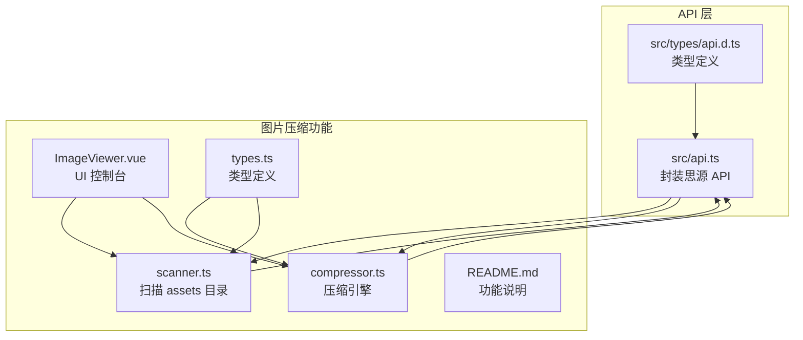
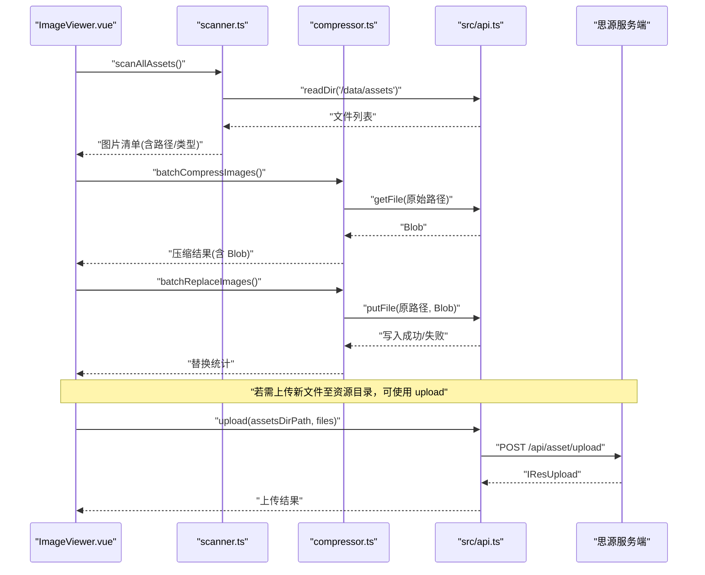
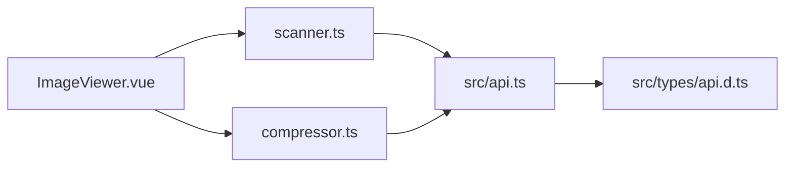

# 文件上传与资产管理

<cite>
**本文引用的文件**
- [src/api.ts](file://src/api.ts)
- [src/features/imageCompressor/compressor.ts](file://src/features/imageCompressor/compressor.ts)
- [src/features/imageCompressor/scanner.ts](file://src/features/imageCompressor/scanner.ts)
- [src/features/imageCompressor/ImageViewer.vue](file://src/features/imageCompressor/ImageViewer.vue)
- [src/features/imageCompressor/README.md](file://src/features/imageCompressor/README.md)
- [src/features/imageCompressor/types.ts](file://src/features/imageCompressor/types.ts)
- [src/types/api.d.ts](file://src/types/api.d.ts)
- [README.md](file://README.md)
</cite>

## 目录
1. [简介](#简介)
2. [项目结构](#项目结构)
3. [核心组件](#核心组件)
4. [架构总览](#架构总览)
5. [详细组件分析](#详细组件分析)
6. [依赖关系分析](#依赖关系分析)
7. [性能考量](#性能考量)
8. [故障排查指南](#故障排查指南)
9. [结论](#结论)
10. [附录](#附录)

## 简介
本文件围绕“upload API 在资产文件管理中的作用”展开，重点说明：
- upload 接口如何将多个文件批量上传至指定资源目录（assetsDirPath）；
- FormData 中 file[] 数组的构建方式；
- 服务器端存储路径的解析逻辑；
- 结合图片压缩功能，展示压缩完成后如何通过 upload 将优化后的图片重新上传至思源笔记的资源目录，并更新文档引用；
- 与 getFile、putFile 的协同使用模式，形成完整的文件生命周期管理闭环；
- 大文件上传的进度监控、错误重试机制和网络异常处理的最佳实践。

## 项目结构
本仓库采用模块化架构，图片压缩功能位于 features/imageCompressor 目录，API 封装位于 src/api.ts，类型定义位于 src/types/api.d.ts。整体结构如下图所示：

图表来源
- [src/api.ts](file://src/api.ts#L150-L164)
- [src/features/imageCompressor/scanner.ts](file://src/features/imageCompressor/scanner.ts#L1-L120)
- [src/features/imageCompressor/compressor.ts](file://src/features/imageCompressor/compressor.ts#L1-L120)
- [src/features/imageCompressor/ImageViewer.vue](file://src/features/imageCompressor/ImageViewer.vue#L1-L120)
- [src/features/imageCompressor/README.md](file://src/features/imageCompressor/README.md#L1-L60)
- [src/features/imageCompressor/types.ts](file://src/features/imageCompressor/types.ts#L1-L40)
- [src/types/api.d.ts](file://src/types/api.d.ts#L1-L20)

章节来源
- [README.md](file://README.md#L99-L140)
- [src/api.ts](file://src/api.ts#L150-L164)
- [src/features/imageCompressor/README.md](file://src/features/imageCompressor/README.md#L1-L40)

## 核心组件
- upload API：用于将多个文件批量上传至指定资源目录，表单字段包含 assetsDirPath 与 file[]。
- getFile API：用于获取二进制文件内容，返回 Blob，支持进度与错误处理。
- putFile API：用于替换或写入文件，支持 modTime 等元数据。
- 图片扫描器（scanner.ts）：递归扫描 data/assets 目录，识别图片并补充尺寸、MIME 等信息。
- 图片压缩引擎（compressor.ts）：基于 browser-image-compression 实现压缩、统计与替换原图。
- 图片查看器（ImageViewer.vue）：提供 UI 交互，驱动扫描、压缩、替换流程。

章节来源
- [src/api.ts](file://src/api.ts#L150-L164)
- [src/api.ts](file://src/api.ts#L343-L384)
- [src/features/imageCompressor/scanner.ts](file://src/features/imageCompressor/scanner.ts#L1-L120)
- [src/features/imageCompressor/compressor.ts](file://src/features/imageCompressor/compressor.ts#L1-L120)
- [src/features/imageCompressor/ImageViewer.vue](file://src/features/imageCompressor/ImageViewer.vue#L345-L508)

## 架构总览
下图展示了 upload 与图片压缩功能的协作流程，以及与 getFile/putFile 的配合：

图表来源
- [src/features/imageCompressor/ImageViewer.vue](file://src/features/imageCompressor/ImageViewer.vue#L345-L508)
- [src/features/imageCompressor/scanner.ts](file://src/features/imageCompressor/scanner.ts#L95-L120)
- [src/features/imageCompressor/compressor.ts](file://src/features/imageCompressor/compressor.ts#L1-L120)
- [src/api.ts](file://src/api.ts#L150-L164)
- [src/api.ts](file://src/api.ts#L343-L384)

## 详细组件分析

### upload 接口与资产目录上传
- 参数与表单构建
  - assetsDirPath：目标资源目录路径（如 /data/assets/子目录）。
  - files：File 对象数组，通过 FormData.append("file[]", file) 追加。
- 服务器端存储路径解析
  - 思源服务端接收 assetsDirPath 与 file[]，将其写入 data/assets 下对应路径。
  - 返回 IResUpload，包含 errFiles 与 succMap（文件名到资源 URL 的映射）。
- 适用场景
  - 将本地或外部生成的优化图片批量上传至资源目录，便于文档引用。

章节来源
- [src/api.ts](file://src/api.ts#L150-L164)
- [src/types/api.d.ts](file://src/types/api.d.ts#L11-L14)

### FormData 中 file[] 数组的构建方式
- 构建步骤
  - 新建 FormData 实例；
  - 追加 assetsDirPath；
  - 循环追加每个 File 对象为 "file[]" 字段；
  - 通过 fetch 发送至 /api/asset/upload。
- 注意事项
  - 服务器端期望的字段名为 "file[]"，前端必须严格一致；
  - assetsDirPath 必须指向 data/assets 下的合法目录。

章节来源
- [src/api.ts](file://src/api.ts#L150-L164)

### 服务器端存储路径解析逻辑
- 思源服务端将 assetsDirPath 解析为 data/assets 下的相对路径；
- 上传后的资源可通过 /assets/... 访问；
- succMap 提供文件名到资源 URL 的映射，便于后续文档引用更新。

章节来源
- [src/api.ts](file://src/api.ts#L150-L164)
- [src/types/api.d.ts](file://src/types/api.d.ts#L11-L14)

### 与图片压缩的集成：替换原图与资源更新
- 流程概览
  - 使用 scanner 扫描 data/assets，获取图片清单；
  - 使用 compressor 压缩图片，得到 Blob；
  - 使用 putFile 将压缩后的 Blob 写回原路径，保持文件名不变；
  - 若需上传新文件至资源目录，使用 upload 并更新文档引用。
- 与 ImageViewer 的联动
  - ImageViewer.vue 提供扫描、压缩、替换的 UI 与进度反馈；
  - 替换完成后，可提示用户刷新扫描结果以确认最新状态。

章节来源
- [src/features/imageCompressor/scanner.ts](file://src/features/imageCompressor/scanner.ts#L95-L120)
- [src/features/imageCompressor/compressor.ts](file://src/features/imageCompressor/compressor.ts#L107-L162)
- [src/features/imageCompressor/ImageViewer.vue](file://src/features/imageCompressor/ImageViewer.vue#L417-L508)

### 与 getFile、putFile 的协同使用模式
- getFile
  - 用途：按路径获取二进制内容，返回 Blob；
  - 适用：压缩前读取原始文件、图片详情获取（尺寸、MIME）。
- putFile
  - 用途：替换或写入文件，支持 modTime 等元数据；
  - 适用：压缩后将优化后的 Blob 写回原路径，保持引用稳定。
- 生命周期闭环
  - 扫描 → 读取 → 压缩 → 写回 → 统计 → UI 反馈。

章节来源
- [src/api.ts](file://src/api.ts#L343-L384)
- [src/features/imageCompressor/compressor.ts](file://src/features/imageCompressor/compressor.ts#L1-L120)
- [src/features/imageCompressor/ImageViewer.vue](file://src/features/imageCompressor/ImageViewer.vue#L345-L508)

### 大文件上传的进度监控、错误重试与网络异常处理
- 进度监控
  - upload 本身不提供进度回调；可在上层 UI 中通过分片或分批上传策略模拟进度。
- 错误重试
  - 建议对 getFile/putFile/upload 的调用增加指数退避重试；
  - 对于网络异常，先降级为本地 Blob 缓存，再在网络恢复后重试。
- 网络异常处理
  - getFile 使用 fetch 直接获取 Blob，遇到 HTTP 错误时返回 null 并记录错误；
  - putFile/upload 使用 fetchSyncPost 或 FormData，建议在外层包裹 try/catch 并记录状态码与错误信息。

章节来源
- [src/api.ts](file://src/api.ts#L343-L384)
- [src/api.ts](file://src/api.ts#L150-L164)

## 依赖关系分析
- 模块耦合
  - ImageViewer.vue 依赖 scanner 与 compressor，二者均依赖 src/api.ts；
  - compressor 依赖 browser-image-compression（库）与 src/api.ts；
  - scanner 依赖 src/api.ts 的 readDir 与 getFile。
- 数据流
  - 从 scanner 获取 ImageInfo → compressor 产出 CompressResult → putFile 写回 → UI 展示统计。

图表来源
- [src/features/imageCompressor/ImageViewer.vue](file://src/features/imageCompressor/ImageViewer.vue#L260-L270)
- [src/features/imageCompressor/scanner.ts](file://src/features/imageCompressor/scanner.ts#L1-L40)
- [src/features/imageCompressor/compressor.ts](file://src/features/imageCompressor/compressor.ts#L1-L20)
- [src/api.ts](file://src/api.ts#L1-L20)
- [src/types/api.d.ts](file://src/types/api.d.ts#L1-L20)

章节来源
- [src/features/imageCompressor/ImageViewer.vue](file://src/features/imageCompressor/ImageViewer.vue#L260-L270)
- [src/features/imageCompressor/scanner.ts](file://src/features/imageCompressor/scanner.ts#L1-L40)
- [src/features/imageCompressor/compressor.ts](file://src/features/imageCompressor/compressor.ts#L1-L20)
- [src/api.ts](file://src/api.ts#L1-L20)

## 性能考量
- 压缩性能
  - 使用 Web Worker 降低主线程阻塞；
  - 批量处理时提供进度回调，避免长时间无反馈。
- 上传性能
  - 对于大文件，建议分片上传或分批上传，结合进度条；
  - 上传前进行文件大小与类型校验，减少无效请求。
- 存储与引用
  - 替换原图时保持文件名不变，避免文档引用失效；
  - 上传后及时更新文档中的图片引用，确保渲染一致性。

[本节为通用指导，不涉及具体文件分析]

## 故障排查指南
- getFile 返回 null
  - 检查路径是否正确（/data/assets/...）；
  - 检查 HTTP 状态码与网络连接；
  - 可尝试直接访问 /assets/... URL 作为备选方案。
- putFile 失败
  - 确认目标路径存在且可写；
  - 检查 modTime 是否为整秒；
  - 确认文件类型与 MIME 一致。
- upload 返回 errFiles
  - 检查 assetsDirPath 是否有效；
  - 确认 file[] 中每个 File 对象有效；
  - 查看 succMap 中成功映射，定位失败文件名。

章节来源
- [src/api.ts](file://src/api.ts#L343-L384)
- [src/api.ts](file://src/api.ts#L150-L164)
- [src/types/api.d.ts](file://src/types/api.d.ts#L11-L14)

## 结论
- upload API 为批量上传提供了简洁的表单接口，结合 assetsDirPath 与 file[] 字段，可将文件写入思源资源目录；
- 图片压缩功能通过 getFile/putFile 形成“读取 → 压缩 → 写回”的闭环，保证引用稳定；
- ImageViewer.vue 将扫描、压缩、替换流程可视化，提升用户体验；
- 对于大文件与网络不稳定场景，建议引入分批/分片策略、进度回调与重试机制，保障可靠性。

[本节为总结性内容，不涉及具体文件分析]

## 附录
- 相关类型定义
  - IResUpload：包含 errFiles 与 succMap；
  - ImageInfo/CompressOptions/CompressResult：压缩功能类型定义。

章节来源
- [src/types/api.d.ts](file://src/types/api.d.ts#L11-L14)
- [src/features/imageCompressor/types.ts](file://src/features/imageCompressor/types.ts#L1-L75)