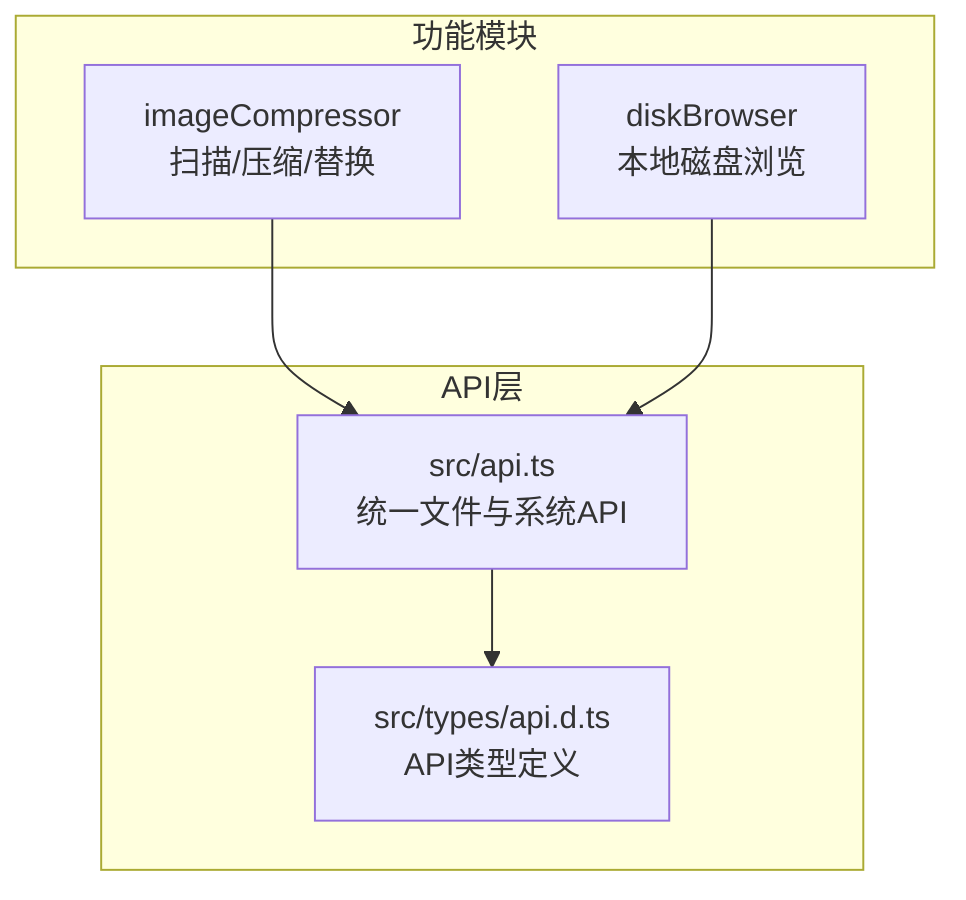
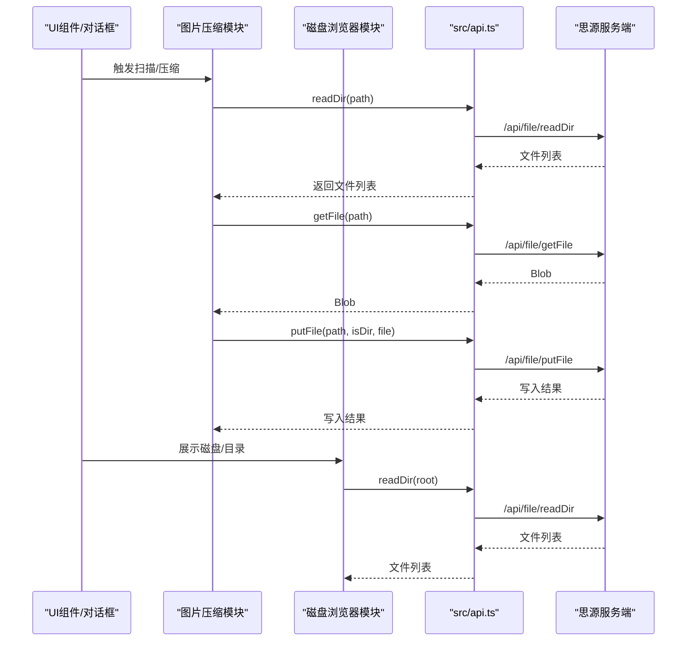
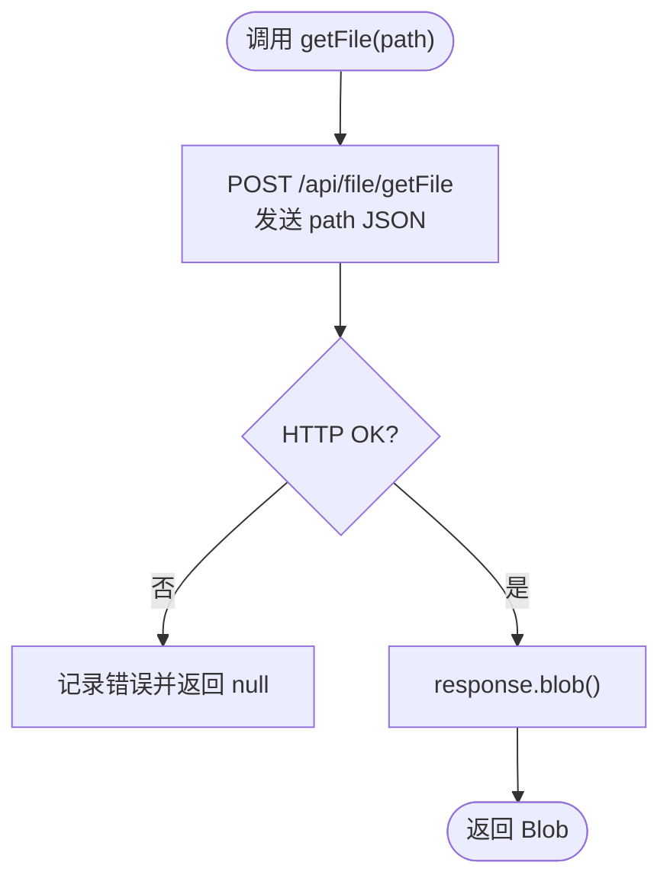
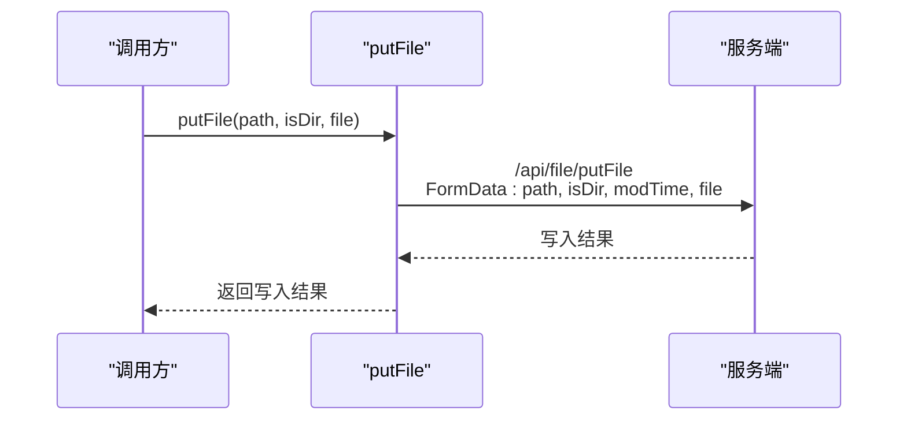
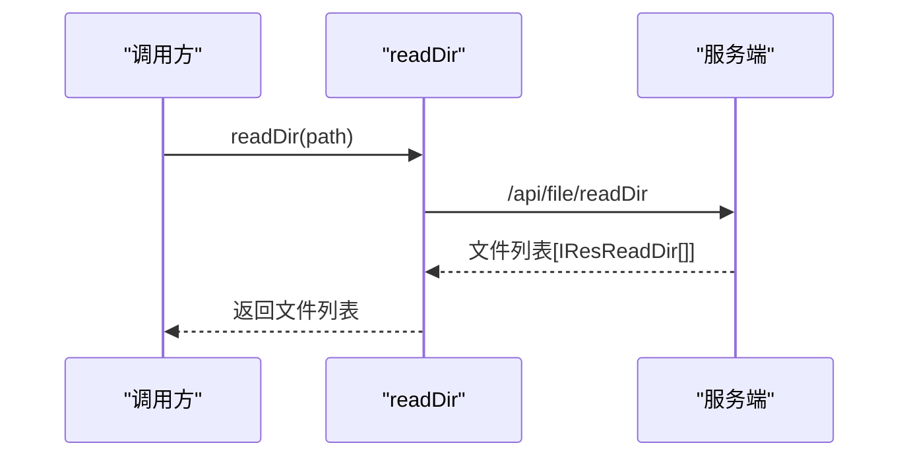
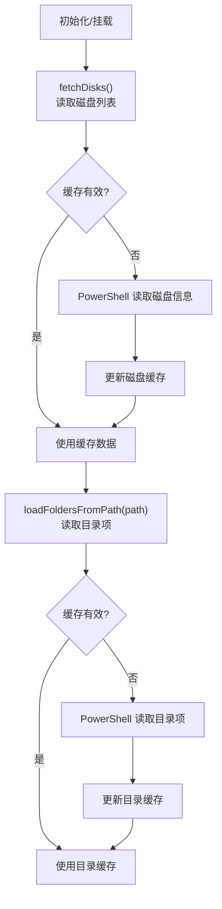
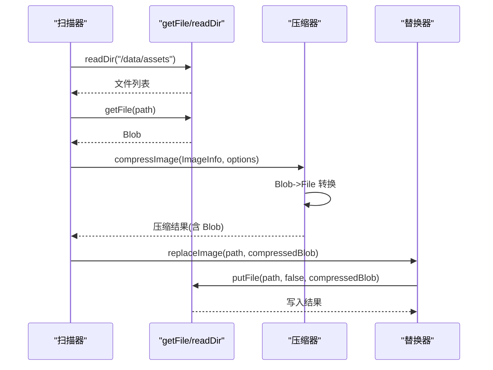
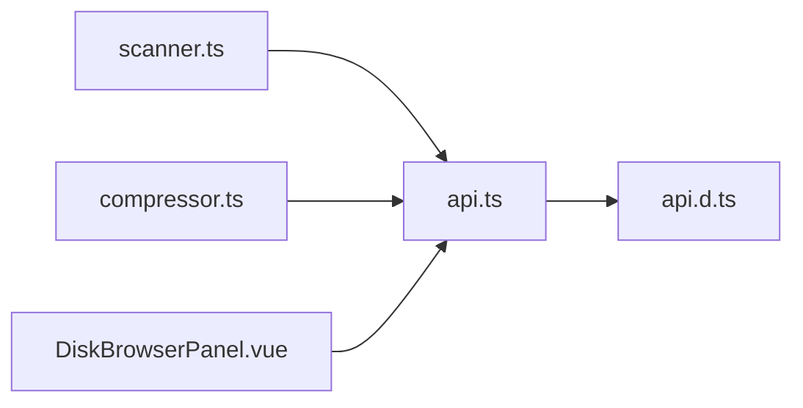

# 文件操作

<cite>
**本文引用的文件**
- [src/api.ts](file://src/api.ts)
- [src/types/api.d.ts](file://src/types/api.d.ts)
- [src/features/imageCompressor/scanner.ts](file://src/features/imageCompressor/scanner.ts)
- [src/features/imageCompressor/compressor.ts](file://src/features/imageCompressor/compressor.ts)
- [src/features/imageCompressor/types.ts](file://src/features/imageCompressor/types.ts)
- [src/features/imageCompressor/ImageViewer.vue](file://src/features/imageCompressor/ImageViewer.vue)
- [src/features/diskBrowser/DiskBrowserPanel.vue](file://src/features/diskBrowser/DiskBrowserPanel.vue)
- [src/features/diskBrowser/index.ts](file://src/features/diskBrowser/index.ts)
- [src/features/imageCompressor/README.md](file://src/features/imageCompressor/README.md)
</cite>

## 目录
1. [简介](#简介)
2. [项目结构](#项目结构)
3. [核心组件](#核心组件)
4. [架构总览](#架构总览)
5. [详细组件分析](#详细组件分析)
6. [依赖关系分析](#依赖关系分析)
7. [性能与内存优化](#性能与内存优化)
8. [故障排查指南](#故障排查指南)
9. [结论](#结论)
10. [附录：API参考](#附录api参考)

## 简介
本指南围绕 src/api.ts 中封装的文件操作 API 进行系统性讲解，覆盖文件读写(getFile、putFile)、目录操作(readDir)、文件上传(upload)、文件删除(removeFile)以及资产文件管理等。文档同时结合图片压缩功能与磁盘浏览器功能的实际调用场景，深入剖析二进制文件处理的注意事项（Blob、文件流、内存管理），并给出大文件处理的最佳实践与性能优化策略。

## 项目结构
本仓库采用按功能模块划分的组织方式：
- src/api.ts：统一封装思源笔记底层 API，包含文件、块、属性、SQL、模板、导出、转换、通知、网络、系统等接口。
- src/types/api.d.ts：定义 API 返回类型与响应结构。
- src/features/imageCompressor：图片压缩功能，演示了 getFile、putFile、readDir 的典型用法。
- src/features/diskBrowser：磁盘浏览器功能，演示了 readDir 的使用与缓存策略。
- 其他模块：通用工具、图标、设置面板等。

图表来源
- [src/api.ts](file://src/api.ts#L343-L400)
- [src/types/api.d.ts](file://src/types/api.d.ts#L37-L41)
- [src/features/imageCompressor/scanner.ts](file://src/features/imageCompressor/scanner.ts#L1-L109)
- [src/features/diskBrowser/DiskBrowserPanel.vue](file://src/features/diskBrowser/DiskBrowserPanel.vue#L1-L120)

章节来源
- [src/api.ts](file://src/api.ts#L343-L400)
- [src/types/api.d.ts](file://src/types/api.d.ts#L37-L41)

## 核心组件
本节聚焦文件操作相关的核心 API 及其职责边界：
- 文件读取：getFile
- 文件写入：putFile
- 目录读取：readDir
- 文件上传：upload
- 文件删除：removeFile

章节来源
- [src/api.ts](file://src/api.ts#L343-L400)
- [src/types/api.d.ts](file://src/types/api.d.ts#L37-L41)

## 架构总览
下图展示了文件操作在各模块中的调用关系与数据流向。

图表来源
- [src/api.ts](file://src/api.ts#L343-L400)
- [src/features/imageCompressor/scanner.ts](file://src/features/imageCompressor/scanner.ts#L39-L109)
- [src/features/imageCompressor/compressor.ts](file://src/features/imageCompressor/compressor.ts#L110-L162)
- [src/features/diskBrowser/DiskBrowserPanel.vue](file://src/features/diskBrowser/DiskBrowserPanel.vue#L514-L577)

## 详细组件分析

### 组件A：文件读取 getFile
- 作用：以二进制形式读取任意路径文件，返回 Blob。
- 特殊处理：绕过统一的 JSON 解析封装，直接使用 fetch 获取二进制数据，确保 Blob 安全返回。
- 错误处理：对 HTTP 状态与异常进行日志记录，返回 null 以避免上层崩溃。
- 典型用途：图片预览、下载、压缩前的数据获取。

图表来源
- [src/api.ts](file://src/api.ts#L343-L372)

章节来源
- [src/api.ts](file://src/api.ts#L343-L372)
- [src/features/imageCompressor/scanner.ts](file://src/features/imageCompressor/scanner.ts#L114-L145)
- [src/features/imageCompressor/compressor.ts](file://src/features/imageCompressor/compressor.ts#L22-L79)

### 组件B：文件写入 putFile
- 作用：将 Blob/文件写入指定路径，支持普通文件与目录标记。
- 特殊处理：使用 FormData 传输二进制；附加 modTime 字段用于更新时间戳。
- 典型用途：压缩完成后替换原图、批量写入新文件。

图表来源
- [src/api.ts](file://src/api.ts#L374-L384)
- [src/features/imageCompressor/compressor.ts](file://src/features/imageCompressor/compressor.ts#L110-L162)

章节来源
- [src/api.ts](file://src/api.ts#L374-L384)
- [src/features/imageCompressor/compressor.ts](file://src/features/imageCompressor/compressor.ts#L110-L162)

### 组件C：目录读取 readDir
- 作用：读取指定路径的目录内容，返回文件/目录条目数组。
- 数据结构：IResReadDir，包含 isDir、isSymlink、name 等字段。
- 典型用途：磁盘浏览器展示目录树、图片扫描器递归遍历。

图表来源
- [src/api.ts](file://src/api.ts#L394-L400)
- [src/types/api.d.ts](file://src/types/api.d.ts#L37-L41)
- [src/features/imageCompressor/scanner.ts](file://src/features/imageCompressor/scanner.ts#L39-L109)
- [src/features/diskBrowser/DiskBrowserPanel.vue](file://src/features/diskBrowser/DiskBrowserPanel.vue#L514-L577)

章节来源
- [src/api.ts](file://src/api.ts#L394-L400)
- [src/types/api.d.ts](file://src/types/api.d.ts#L37-L41)
- [src/features/imageCompressor/scanner.ts](file://src/features/imageCompressor/scanner.ts#L39-L109)
- [src/features/diskBrowser/DiskBrowserPanel.vue](file://src/features/diskBrowser/DiskBrowserPanel.vue#L514-L577)

### 组件D：文件上传 upload
- 作用：将本地文件上传至资产目录，返回上传结果映射。
- 典型用途：批量导入资源、素材库管理。
- 注意事项：表单字段 assetsDirPath 与 file[] 的拼接逻辑由 API 内部处理。

章节来源
- [src/api.ts](file://src/api.ts#L152-L163)
- [src/types/api.d.ts](file://src/types/api.d.ts#L11-L14)

### 组件E：文件删除 removeFile
- 作用：删除指定路径的文件或目录。
- 典型用途：清理临时文件、批量删除无用资源。

章节来源
- [src/api.ts](file://src/api.ts#L386-L392)

### 组件F：磁盘浏览器功能（readDir 实战）
- 读取磁盘与目录：通过 readDir 获取文件/目录列表，按文件夹优先、文件次序排序。
- 缓存策略：对磁盘列表与目录列表分别缓存，提升交互流畅度。
- 跨平台：在 Electron 环境下使用 child_process 执行 PowerShell 命令获取磁盘信息与目录项。

图表来源
- [src/features/diskBrowser/DiskBrowserPanel.vue](file://src/features/diskBrowser/DiskBrowserPanel.vue#L226-L377)
- [src/features/diskBrowser/DiskBrowserPanel.vue](file://src/features/diskBrowser/DiskBrowserPanel.vue#L514-L577)

章节来源
- [src/features/diskBrowser/DiskBrowserPanel.vue](file://src/features/diskBrowser/DiskBrowserPanel.vue#L226-L377)
- [src/features/diskBrowser/DiskBrowserPanel.vue](file://src/features/diskBrowser/DiskBrowserPanel.vue#L514-L577)
- [src/features/diskBrowser/index.ts](file://src/features/diskBrowser/index.ts#L1-L51)

### 组件G：图片压缩功能（getFile/putFile 实战）
- 扫描：使用 readDir 递归扫描 /data/assets 下的图片文件，构建 ImageInfo 列表。
- 读取：getFile 获取 Blob，转 File 后交由压缩库处理。
- 压缩：计算压缩率、耗时，生成压缩结果。
- 替换：putFile 将压缩后的 Blob 写回原路径，实现“原地替换”。

图表来源
- [src/features/imageCompressor/scanner.ts](file://src/features/imageCompressor/scanner.ts#L39-L109)
- [src/features/imageCompressor/compressor.ts](file://src/features/imageCompressor/compressor.ts#L22-L162)
- [src/features/imageCompressor/types.ts](file://src/features/imageCompressor/types.ts#L1-L75)

章节来源
- [src/features/imageCompressor/scanner.ts](file://src/features/imageCompressor/scanner.ts#L39-L109)
- [src/features/imageCompressor/compressor.ts](file://src/features/imageCompressor/compressor.ts#L22-L162)
- [src/features/imageCompressor/types.ts](file://src/features/imageCompressor/types.ts#L1-L75)
- [src/features/imageCompressor/README.md](file://src/features/imageCompressor/README.md#L1-L75)

## 依赖关系分析
- 模块耦合
  - 图片压缩模块依赖 API 的 readDir、getFile、putFile。
  - 磁盘浏览器模块依赖 API 的 readDir。
  - API 层对思源服务端接口进行统一封装，降低上层对底层协议的感知。
- 外部依赖
  - browser-image-compression：图片压缩库。
  - Electron child_process/shell：跨平台读取磁盘与打开路径。
- 循环依赖
  - 未发现循环依赖迹象，模块间通过 API 层解耦。

图表来源
- [src/features/imageCompressor/scanner.ts](file://src/features/imageCompressor/scanner.ts#L1-L10)
- [src/features/imageCompressor/compressor.ts](file://src/features/imageCompressor/compressor.ts#L1-L10)
- [src/features/diskBrowser/DiskBrowserPanel.vue](file://src/features/diskBrowser/DiskBrowserPanel.vue#L1-L20)
- [src/api.ts](file://src/api.ts#L1-L20)
- [src/types/api.d.ts](file://src/types/api.d.ts#L1-L20)

章节来源
- [src/features/imageCompressor/scanner.ts](file://src/features/imageCompressor/scanner.ts#L1-L10)
- [src/features/imageCompressor/compressor.ts](file://src/features/imageCompressor/compressor.ts#L1-L10)
- [src/features/diskBrowser/DiskBrowserPanel.vue](file://src/features/diskBrowser/DiskBrowserPanel.vue#L1-L20)
- [src/api.ts](file://src/api.ts#L1-L20)
- [src/types/api.d.ts](file://src/types/api.d.ts#L1-L20)

## 性能与内存优化
- 二进制处理
  - 使用 Blob 接收与传递二进制数据，避免中间字符串编码开销。
  - 在需要预览时，优先使用对象 URL，结束后及时释放，防止内存泄漏。
- 并发与批处理
  - 批量压缩时采用顺序处理，避免过度并发导致主线程阻塞；如需加速，可在 Worker 中执行压缩。
  - 批量替换时使用进度回调，避免长时间无反馈。
- 缓存策略
  - 磁盘浏览器对磁盘列表与目录列表分别缓存，减少重复请求。
  - 缓存周期建议根据用户行为动态调整，例如在用户频繁切换目录时缩短缓存时间。
- 大文件与流式处理
  - 对超大文件，优先考虑分块上传或服务端支持的断点续传（若 API 支持）。
  - 避免一次性将超大 Blob 转换为 DataURL，改用对象 URL 或直接以 Blob 作为传输载体。
- 错误与重试
  - 对网络不稳定场景，增加指数退避重试与超时控制。
  - 对读取失败的图片，提供备用方案（如直接 URL 访问）。

[本节为通用指导，无需列出具体文件来源]

## 故障排查指南
- getFile 返回 null
  - 检查路径是否存在与权限是否正确。
  - 查看网络层日志与 HTTP 状态码。
  - 章节来源
    - [src/api.ts](file://src/api.ts#L343-L372)
- putFile 写入失败
  - 确认 isDir 参数与目标路径类型一致。
  - 检查 modTime 与文件权限。
  - 章节来源
    - [src/api.ts](file://src/api.ts#L374-L384)
- readDir 返回空或报错
  - 确认路径正确且服务端可访问。
  - 在磁盘浏览器中检查缓存是否过期，必要时强制刷新。
  - 章节来源
    - [src/api.ts](file://src/api.ts#L394-L400)
    - [src/features/diskBrowser/DiskBrowserPanel.vue](file://src/features/diskBrowser/DiskBrowserPanel.vue#L514-L577)
- 图片预览失败
  - 确保 getObjectURL 后未提前 revoke，且图片尺寸获取逻辑正确。
  - 章节来源
    - [src/features/imageCompressor/scanner.ts](file://src/features/imageCompressor/scanner.ts#L114-L178)

## 结论
通过对 src/api.ts 中文件操作 API 的系统梳理，结合图片压缩与磁盘浏览器两个典型功能模块，我们总结了二进制文件处理的关键要点：正确的 Blob 获取与释放、合理的缓存与并发策略、清晰的错误处理与回退方案。遵循本文建议，可以在保证用户体验的同时，最大化发挥 API 的能力。

## 附录：API参考
- 文件读取
  - 函数：getFile(path)
  - 返回：Blob 或 null
  - 适用场景：读取任意二进制文件
  - 章节来源
    - [src/api.ts](file://src/api.ts#L343-L372)
- 文件写入
  - 函数：putFile(path, isDir, file)
  - 返回：写入结果
  - 适用场景：替换原图、写入新文件
  - 章节来源
    - [src/api.ts](file://src/api.ts#L374-L384)
- 目录读取
  - 函数：readDir(path)
  - 返回：IResReadDir[]
  - 适用场景：磁盘浏览、扫描资源
  - 章节来源
    - [src/api.ts](file://src/api.ts#L394-L400)
    - [src/types/api.d.ts](file://src/types/api.d.ts#L37-L41)
- 文件上传
  - 函数：upload(assetsDirPath, files[])
  - 返回：IResUpload
  - 适用场景：批量导入资源
  - 章节来源
    - [src/api.ts](file://src/api.ts#L152-L163)
    - [src/types/api.d.ts](file://src/types/api.d.ts#L11-L14)
- 文件删除
  - 函数：removeFile(path)
  - 返回：删除结果
  - 适用场景：清理资源
  - 章节来源
    - [src/api.ts](file://src/api.ts#L386-L392)