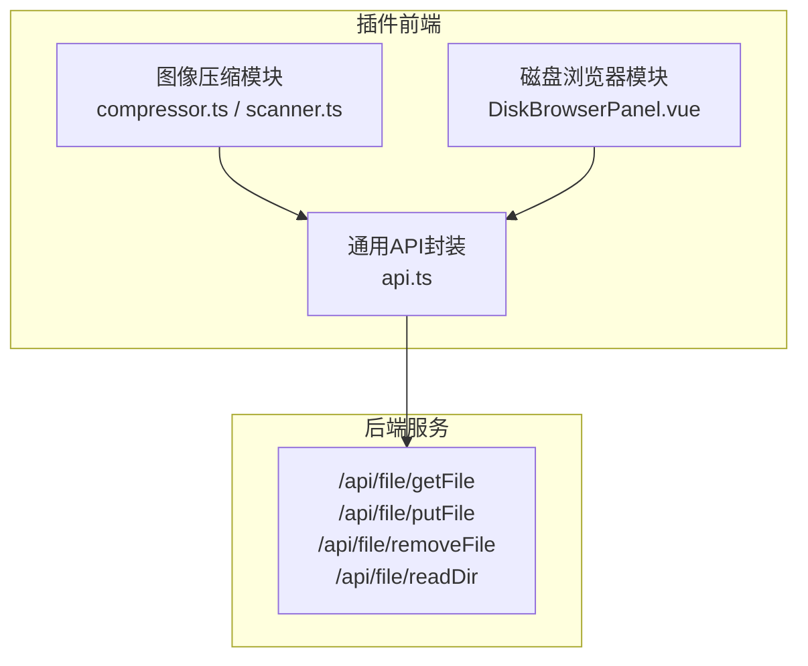
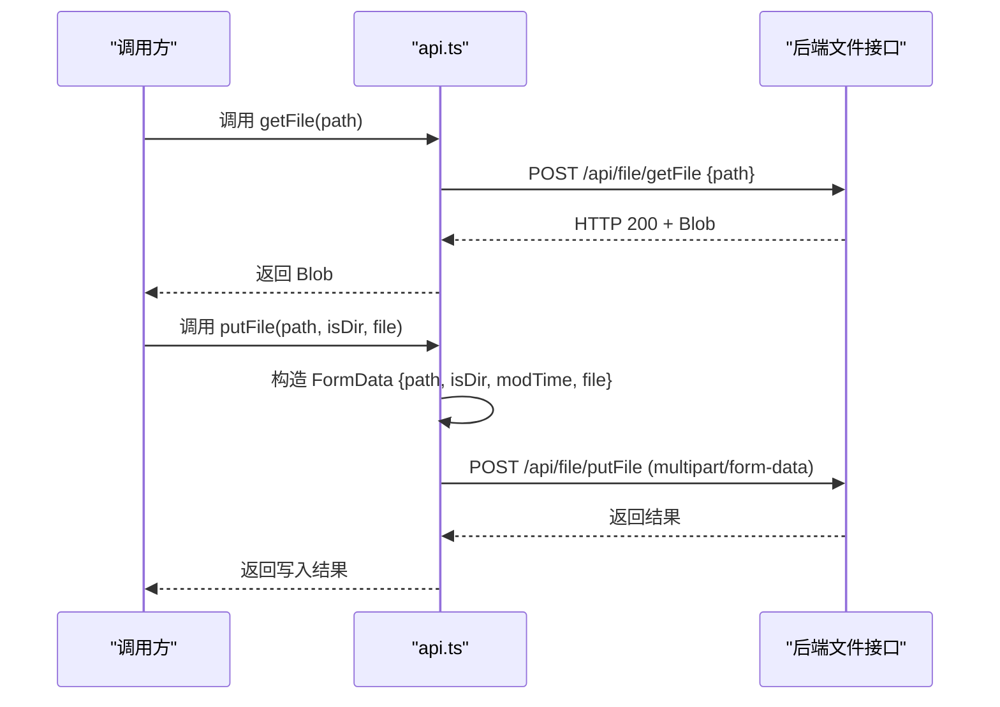
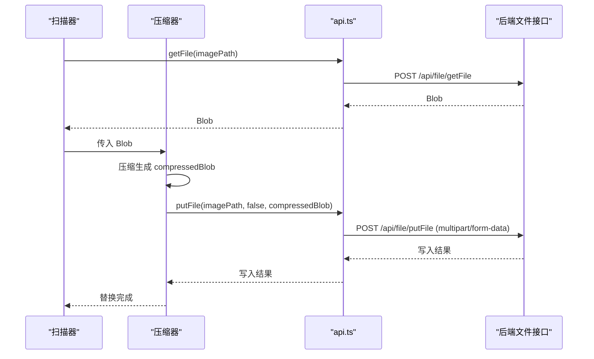
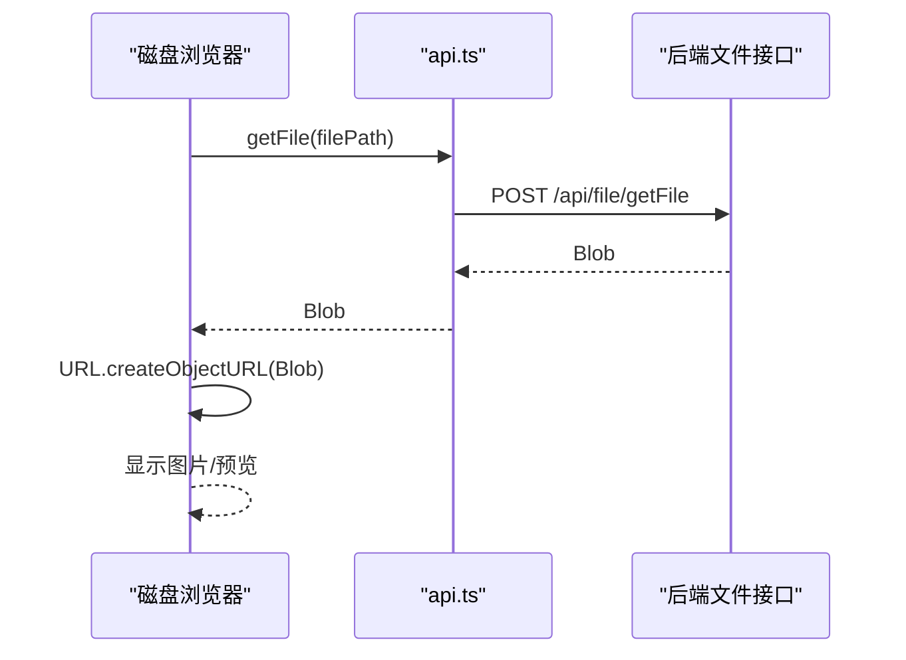
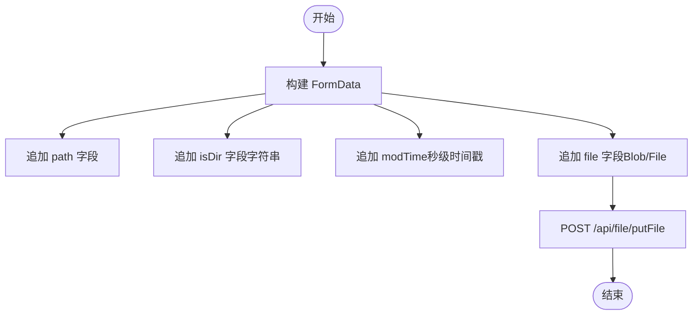
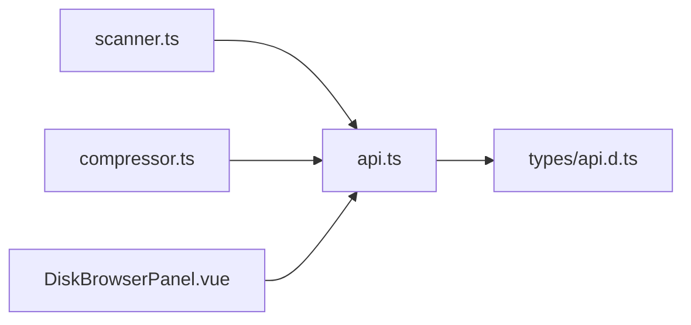

# 文件读写操作

<cite>
**本文引用的文件**
- [src/api.ts](file://src/api.ts)
- [src/features/imageCompressor/compressor.ts](file://src/features/imageCompressor/compressor.ts)
- [src/features/imageCompressor/scanner.ts](file://src/features/imageCompressor/scanner.ts)
- [src/features/diskBrowser/DiskBrowserPanel.vue](file://src/features/diskBrowser/DiskBrowserPanel.vue)
- [src/types/api.d.ts](file://src/types/api.d.ts)
</cite>

## 目录
1. [简介](#简介)
2. [项目结构与定位](#项目结构与定位)
3. [核心组件：文件读写API](#核心组件文件读写api)
4. [架构总览](#架构总览)
5. [详细组件分析](#详细组件分析)
6. [依赖关系分析](#依赖关系分析)
7. [性能与内存优化](#性能与内存优化)
8. [故障排查指南](#故障排查指南)
9. [结论](#结论)

## 简介
本指南聚焦于插件中的文件读写能力，围绕 src/api.ts 提供的 getFile 和 putFile 两大核心接口进行系统性讲解。内容涵盖：
- getFile 的二进制数据获取流程、绕过 fetchSyncPost 的原因、Blob 处理机制与最佳实践
- putFile 的 FormData 构造、modTime 时间戳设置、isDir 参数的使用场景与注意事项
- 结合图片压缩功能（压缩后文件保存）与磁盘浏览器（文件读取）的实际案例，演示如何正确调用这些接口
- 错误处理策略、二进制数据流管理建议与内存优化技巧

## 项目结构与定位
- 文件读写 API 定义于 src/api.ts，统一封装了与后端交互的请求层，并暴露 getFile、putFile、removeFile、readDir 等方法
- 图片压缩功能通过 src/features/imageCompressor/compressor.ts 与 scanner.ts 使用 getFile/putFile 实现“读取—压缩—替换”的完整链路
- 磁盘浏览器功能通过 src/features/diskBrowser/DiskBrowserPanel.vue 展示本地文件系统，配合 API 进行文件读取与展示

图表来源
- [src/api.ts](file://src/api.ts#L341-L401)
- [src/features/imageCompressor/compressor.ts](file://src/features/imageCompressor/compressor.ts#L1-L227)
- [src/features/imageCompressor/scanner.ts](file://src/features/imageCompressor/scanner.ts#L1-L228)
- [src/features/diskBrowser/DiskBrowserPanel.vue](file://src/features/diskBrowser/DiskBrowserPanel.vue#L1-L800)

章节来源
- [src/api.ts](file://src/api.ts#L341-L401)
- [src/features/imageCompressor/compressor.ts](file://src/features/imageCompressor/compressor.ts#L1-L227)
- [src/features/imageCompressor/scanner.ts](file://src/features/imageCompressor/scanner.ts#L1-L228)
- [src/features/diskBrowser/DiskBrowserPanel.vue](file://src/features/diskBrowser/DiskBrowserPanel.vue#L1-L800)

## 核心组件：文件读写API
本节对 getFile 与 putFile 的实现细节、调用方式与注意事项进行深入解析。

- getFile(path: string): Promise<Blob|null>
  - 功能：异步读取任意文件并返回 Blob 对象，适用于图片、文档等二进制资源
  - 关键点：
    - 绕过 fetchSyncPost，直接使用 fetch 发起 POST 请求，避免 fetchSyncPost 尝试解析 JSON 的限制
    - 直接响应 response.blob()，返回 Blob；若 HTTP 非 OK 或异常，则记录错误并返回 null
    - 适合与浏览器图片解码、Canvas 渲染、下载链接生成等场景配合使用
  - 典型调用场景：
    - 图片压缩：读取原始图片 Blob，转换为 File 后交给压缩库处理
    - 磁盘浏览器：读取文件内容以计算尺寸、预览等

- putFile(path: string, isDir: boolean, file: Blob|File): Promise<any>
  - 功能：将文件写入指定路径，支持目录创建与文件更新
  - 关键点：
    - 使用 FormData 构造请求体，包含 path、isDir、modTime、file 四个字段
    - isDir 为布尔值，true 表示创建目录，false 表示写入文件
    - modTime 设置为当前秒级时间戳，确保文件元数据一致性
    - file 可为 Blob 或 File，满足不同来源的数据写入需求
  - 典型调用场景：
    - 图片压缩：将压缩后的 Blob 写回原路径，实现“替换原图”
    - 备份：将原始文件写入同名 .backup 后缀路径，保留原始版本

章节来源
- [src/api.ts](file://src/api.ts#L343-L372)
- [src/api.ts](file://src/api.ts#L374-L384)

## 架构总览
下图展示了从调用方到 API 封装再到后端接口的调用链路与数据流向。

图表来源
- [src/api.ts](file://src/api.ts#L343-L384)

## 详细组件分析

### 组件A：图像压缩模块（压缩后文件保存）
该模块通过 getFile 读取原始图片，借助压缩库生成压缩后的 Blob，再通过 putFile 写回原路径，完成“读取—压缩—替换”的闭环。

图表来源
- [src/features/imageCompressor/compressor.ts](file://src/features/imageCompressor/compressor.ts#L1-L227)
- [src/features/imageCompressor/scanner.ts](file://src/features/imageCompressor/scanner.ts#L1-L228)
- [src/api.ts](file://src/api.ts#L343-L384)

章节来源
- [src/features/imageCompressor/compressor.ts](file://src/features/imageCompressor/compressor.ts#L1-L227)
- [src/features/imageCompressor/scanner.ts](file://src/features/imageCompressor/scanner.ts#L1-L228)

### 组件B：磁盘浏览器（文件读取）
磁盘浏览器模块负责展示本地文件系统，当用户需要查看文件详情时，可通过 getFile 获取文件内容，结合 URL.createObjectURL 生成可预览的 URL。

图表来源
- [src/features/diskBrowser/DiskBrowserPanel.vue](file://src/features/diskBrowser/DiskBrowserPanel.vue#L1-L800)
- [src/api.ts](file://src/api.ts#L343-L372)

章节来源
- [src/features/diskBrowser/DiskBrowserPanel.vue](file://src/features/diskBrowser/DiskBrowserPanel.vue#L1-L800)
- [src/api.ts](file://src/api.ts#L343-L372)

### 组件C：putFile 的 FormData 构造与时间戳
putFile 的关键在于 FormData 的构造顺序与字段含义，以及 modTime 的设置逻辑。

图表来源
- [src/api.ts](file://src/api.ts#L374-L384)

章节来源
- [src/api.ts](file://src/api.ts#L374-L384)

## 依赖关系分析
- 调用方依赖
  - 图像压缩模块依赖 api.ts 中的 getFile 与 putFile
  - 磁盘浏览器模块依赖 api.ts 中的 getFile
- API 封装依赖
  - api.ts 通过 fetchSyncPost 统一发起请求，但 getFile 与 putFile 采用 fetch 直接处理二进制数据
- 类型与接口
  - 读取目录返回 IResReadDir，用于磁盘浏览器展示文件列表
  - 文件写入返回任意结构，由调用方根据业务判断

图表来源
- [src/features/imageCompressor/scanner.ts](file://src/features/imageCompressor/scanner.ts#L1-L228)
- [src/features/imageCompressor/compressor.ts](file://src/features/imageCompressor/compressor.ts#L1-L227)
- [src/features/diskBrowser/DiskBrowserPanel.vue](file://src/features/diskBrowser/DiskBrowserPanel.vue#L1-L800)
- [src/api.ts](file://src/api.ts#L341-L401)
- [src/types/api.d.ts](file://src/types/api.d.ts#L1-L65)

章节来源
- [src/features/imageCompressor/scanner.ts](file://src/features/imageCompressor/scanner.ts#L1-L228)
- [src/features/imageCompressor/compressor.ts](file://src/features/imageCompressor/compressor.ts#L1-L227)
- [src/features/diskBrowser/DiskBrowserPanel.vue](file://src/features/diskBrowser/DiskBrowserPanel.vue#L1-L800)
- [src/api.ts](file://src/api.ts#L341-L401)
- [src/types/api.d.ts](file://src/types/api.d.ts#L1-L65)

## 性能与内存优化
- Blob 与 URL 对象管理
  - 使用 URL.createObjectURL 生成临时 URL 时，务必在不再需要时及时调用 URL.revokeObjectURL 释放内存，避免内存泄漏
  - 在图片压缩流程中，建议仅在需要解码/渲染时持有 URL，完成后立即释放
- 数据流与并发控制
  - 批量读取/写入时，建议采用限流策略，避免短时间内大量并发请求导致内存抖动
  - 对于超大文件，优先考虑分块读取与渐进式处理，减少一次性内存占用
- 时间戳与一致性
  - putFile 的 modTime 采用秒级时间戳，确保与后端文件元数据一致，避免因时间偏差导致的覆盖问题
- 错误与降级
  - getFile 失败时，可回退到直接 URL 方案（如 /assets/...），以保证用户体验
  - 对于网络不稳定场景，建议增加重试与超时控制

[本节为通用指导，无需特定文件引用]

## 故障排查指南
- getFile 返回 null
  - 检查 HTTP 状态码与响应体，确认路径是否存在、权限是否足够
  - 若后端返回非 2xx，前端会记录错误日志，便于定位
- putFile 写入失败
  - 确认 isDir 与 path 是否匹配：创建目录时应传入 true，写入文件时应传入 false
  - 确认 file 字段为 Blob 或 File，且大小合理
  - 检查 modTime 是否为合法的秒级时间戳
- 磁盘浏览器无法预览图片
  - 若 getFile 失败，尝试直接访问 /assets/... URL，作为降级方案
  - 确保 URL.createObjectURL 生成的 URL 在使用后被正确释放

章节来源
- [src/api.ts](file://src/api.ts#L343-L384)
- [src/features/imageCompressor/scanner.ts](file://src/features/imageCompressor/scanner.ts#L110-L178)
- [src/features/diskBrowser/DiskBrowserPanel.vue](file://src/features/diskBrowser/DiskBrowserPanel.vue#L1-L800)

## 结论
- getFile 与 putFile 是插件中二进制文件读写的核心抽象，前者专注于二进制数据获取，后者专注于文件写入与元数据维护
- 在图像压缩与磁盘浏览等场景中，二者配合可实现完整的“读取—处理—写回”闭环
- 正确理解 Blob 生命周期、FormData 构造与 modTime 设置，是保障稳定性的关键
- 建议在生产环境中加入重试、限流与内存回收策略，提升整体性能与稳定性