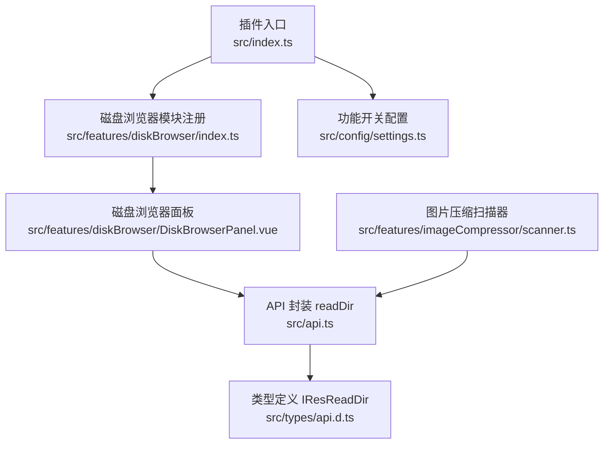
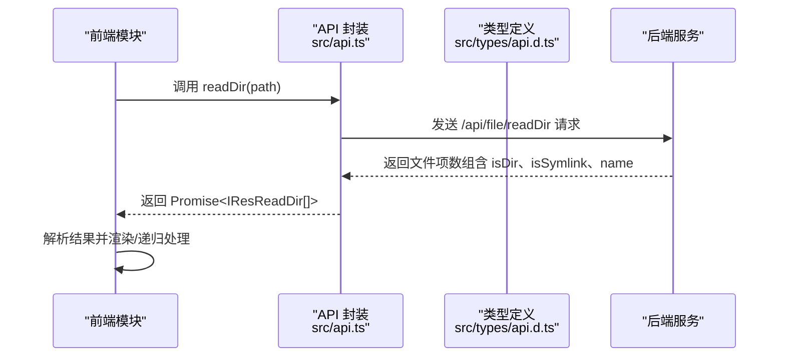
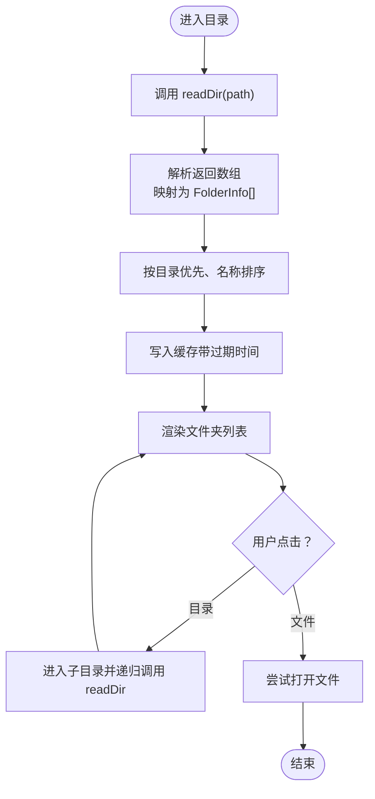
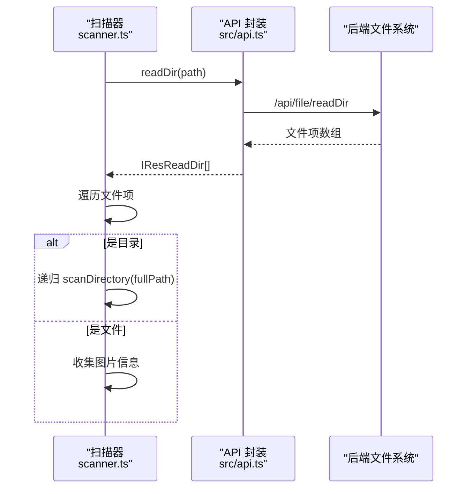
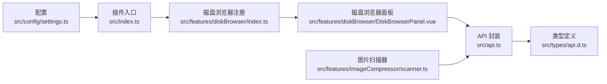

# 目录操作

<cite>
**本文引用的文件**
- [README.md](file://README.md)
- [src/index.ts](file://src/index.ts)
- [src/features/diskBrowser/index.ts](file://src/features/diskBrowser/index.ts)
- [src/features/diskBrowser/DiskBrowserPanel.vue](file://src/features/diskBrowser/DiskBrowserPanel.vue)
- [src/api.ts](file://src/api.ts)
- [src/types/api.d.ts](file://src/types/api.d.ts)
- [src/features/imageCompressor/scanner.ts](file://src/features/imageCompressor/scanner.ts)
- [src/config/settings.ts](file://src/config/settings.ts)
</cite>

## 目录
1. [简介](#简介)
2. [项目结构](#项目结构)
3. [核心组件](#核心组件)
4. [架构总览](#架构总览)
5. [详细组件分析](#详细组件分析)
6. [依赖关系分析](#依赖关系分析)
7. [性能考量](#性能考量)
8. [故障排查指南](#故障排查指南)
9. [结论](#结论)

## 简介
本文件围绕“readDir”目录读取 API 的使用方法及其在“磁盘浏览器”功能中的实际应用进行深入讲解。readDir 接口用于列出指定路径下的所有文件和子目录，返回包含 isDir、isSymlink、name 等属性的文件项数组。本文将结合磁盘浏览器模块的实现，分析如何通过该 API 构建本地文件树结构、处理符号链接与递归遍历目录，并给出性能优化建议与常见错误场景的处理方式。

## 项目结构
该项目采用模块化架构，功能模块集中于 features 目录，磁盘浏览器作为其中一个功能模块被统一注册与管理。readDir API 由封装层提供，供各功能模块按需调用；磁盘浏览器模块负责 UI 展示与交互，内部通过 readDir 实现目录浏览与文件树渲染。

图示来源
- [src/index.ts](file://src/index.ts#L80-L126)
- [src/features/diskBrowser/index.ts](file://src/features/diskBrowser/index.ts#L1-L51)
- [src/features/diskBrowser/DiskBrowserPanel.vue](file://src/features/diskBrowser/DiskBrowserPanel.vue#L511-L577)
- [src/api.ts](file://src/api.ts#L393-L401)
- [src/types/api.d.ts](file://src/types/api.d.ts#L37-L41)
- [src/features/imageCompressor/scanner.ts](file://src/features/imageCompressor/scanner.ts#L1-L228)

章节来源
- [README.md](file://README.md#L99-L165)
- [src/index.ts](file://src/index.ts#L80-L126)
- [src/config/settings.ts](file://src/config/settings.ts#L1-L50)

## 核心组件
- readDir API：用于读取指定路径的目录内容，返回文件项数组，每项包含 isDir、isSymlink、name 等字段。
- 磁盘浏览器模块：提供右侧边栏 Dock，展示磁盘列表与文件夹树，支持刷新、面包屑导航、打开路径等。
- 图片扫描器：演示 readDir 的典型用法，递归扫描目录并识别图片文件。

章节来源
- [src/api.ts](file://src/api.ts#L393-L401)
- [src/types/api.d.ts](file://src/types/api.d.ts#L37-L41)
- [src/features/diskBrowser/index.ts](file://src/features/diskBrowser/index.ts#L1-L51)
- [src/features/diskBrowser/DiskBrowserPanel.vue](file://src/features/diskBrowser/DiskBrowserPanel.vue#L511-L577)
- [src/features/imageCompressor/scanner.ts](file://src/features/imageCompressor/scanner.ts#L1-L102)

## 架构总览
readDir 的调用链路如下：
- 功能模块通过 API 封装调用 readDir；
- API 封装将请求发送至后端服务；
- 后端返回包含 isDir、isSymlink、name 等字段的文件项数组；
- 前端模块根据返回结果渲染 UI 或进行递归遍历。

图示来源
- [src/api.ts](file://src/api.ts#L393-L401)
- [src/types/api.d.ts](file://src/types/api.d.ts#L37-L41)

## 详细组件分析

### readDir 响应结构 IResReadDir
- 字段说明
  - isDir：布尔值，表示该项是否为目录。
  - isSymlink：布尔值，表示该项是否为符号链接。
  - name：字符串，表示该项名称。
- 用途
  - 用于判断文件项类型，控制 UI 渲染与交互行为（例如目录可进入、文件可打开）。
  - 用于递归遍历目录，构建本地文件树。

章节来源
- [src/types/api.d.ts](file://src/types/api.d.ts#L37-L41)

### 磁盘浏览器模块中的 readDir 使用
- 触发时机
  - 切换磁盘或进入子目录时，调用 readDir 获取当前路径下的文件项数组。
- 数据处理
  - 将返回的文件项数组映射为 UI 所需的 FolderInfo 结构（包含 name、path、isFile、size、modifiedTime 等），并进行排序与缓存。
- 递归遍历
  - 当用户双击某一项时，若为目录则进入该目录并再次调用 readDir；若为文件则尝试打开。
- 缓存策略
  - 使用内存缓存记录每个路径的读取结果，设定缓存有效期，减少重复请求与性能损耗。

图示来源
- [src/features/diskBrowser/DiskBrowserPanel.vue](file://src/features/diskBrowser/DiskBrowserPanel.vue#L511-L577)
- [src/features/diskBrowser/DiskBrowserPanel.vue](file://src/features/diskBrowser/DiskBrowserPanel.vue#L589-L606)

章节来源
- [src/features/diskBrowser/DiskBrowserPanel.vue](file://src/features/diskBrowser/DiskBrowserPanel.vue#L511-L577)
- [src/features/diskBrowser/DiskBrowserPanel.vue](file://src/features/diskBrowser/DiskBrowserPanel.vue#L589-L606)

### 图片扫描器中的 readDir 使用
- 递归扫描
  - 传入目标路径，调用 readDir 获取该路径下的文件项；
  - 若某项为目录，则递归调用自身继续扫描；
  - 若某项为图片文件，则收集其基本信息（路径、名称、类型等）。
- 进度反馈
  - 通过回调函数上报扫描进度，便于 UI 呈现。

图示来源
- [src/features/imageCompressor/scanner.ts](file://src/features/imageCompressor/scanner.ts#L1-L102)
- [src/api.ts](file://src/api.ts#L393-L401)

章节来源
- [src/features/imageCompressor/scanner.ts](file://src/features/imageCompressor/scanner.ts#L1-L102)

### API 封装与类型定义
- readDir 封装
  - 提供 readDir(path) 方法，内部构造请求并返回 Promise。
- 类型定义
  - IResReadDir 明确了 readDir 的响应结构，确保前后端契约一致。

章节来源
- [src/api.ts](file://src/api.ts#L393-L401)
- [src/types/api.d.ts](file://src/types/api.d.ts#L37-L41)

### 模块注册与启用
- 插件入口根据配置决定是否注册磁盘浏览器模块。
- 配置项 enableDiskBrowser 控制功能开关。

章节来源
- [src/index.ts](file://src/index.ts#L80-L126)
- [src/config/settings.ts](file://src/config/settings.ts#L1-L50)

## 依赖关系分析
- 磁盘浏览器模块依赖 API 封装与类型定义，用于读取目录与渲染 UI。
- 图片扫描器同样依赖 API 封装，用于递归扫描与识别图片。
- 插件入口根据配置动态注册磁盘浏览器模块。

图示来源
- [src/config/settings.ts](file://src/config/settings.ts#L1-L50)
- [src/index.ts](file://src/index.ts#L80-L126)
- [src/features/diskBrowser/index.ts](file://src/features/diskBrowser/index.ts#L1-L51)
- [src/features/diskBrowser/DiskBrowserPanel.vue](file://src/features/diskBrowser/DiskBrowserPanel.vue#L511-L577)
- [src/api.ts](file://src/api.ts#L393-L401)
- [src/types/api.d.ts](file://src/types/api.d.ts#L37-L41)
- [src/features/imageCompressor/scanner.ts](file://src/features/imageCompressor/scanner.ts#L1-L102)

章节来源
- [src/index.ts](file://src/index.ts#L80-L126)
- [src/features/diskBrowser/index.ts](file://src/features/diskBrowser/index.ts#L1-L51)
- [src/features/diskBrowser/DiskBrowserPanel.vue](file://src/features/diskBrowser/DiskBrowserPanel.vue#L511-L577)
- [src/api.ts](file://src/api.ts#L393-L401)
- [src/types/api.d.ts](file://src/types/api.d.ts#L37-L41)
- [src/features/imageCompressor/scanner.ts](file://src/features/imageCompressor/scanner.ts#L1-L102)

## 性能考量
- 避免在大型目录上频繁调用
  - 使用缓存：磁盘浏览器模块对每个路径的结果进行缓存，并设置固定有效期，减少重复请求。
  - 分页/懒加载：对于超大目录，可考虑仅加载可见范围内的条目，按需触发后续加载。
- 合理使用缓存机制
  - 磁盘浏览器模块维护磁盘级与路径级缓存，分别用于磁盘列表与文件夹列表，提升交互流畅度。
  - 缓存失效时间可按需调整，平衡实时性与性能。
- 递归遍历优化
  - 对于深层目录，建议限制递归深度或采用异步分批处理，避免阻塞 UI。
  - 在 UI 层面提供“加载中”状态与取消机制，改善用户体验。
- I/O 与网络
  - 读取文件元信息（如大小、修改时间）时尽量合并请求，减少往返次数。
  - 对于图片等资源，可采用懒加载策略，仅在需要时获取详细信息。

章节来源
- [src/features/diskBrowser/DiskBrowserPanel.vue](file://src/features/diskBrowser/DiskBrowserPanel.vue#L210-L224)
- [src/features/diskBrowser/DiskBrowserPanel.vue](file://src/features/diskBrowser/DiskBrowserPanel.vue#L323-L378)
- [src/features/diskBrowser/DiskBrowserPanel.vue](file://src/features/diskBrowser/DiskBrowserPanel.vue#L511-L577)

## 故障排查指南
- 权限不足
  - 现象：readDir 返回空数组或抛出异常。
  - 处理：检查目标路径的访问权限；在 UI 中提示用户授权或切换到可访问的目录。
- 路径不存在
  - 现象：请求失败或返回空结果。
  - 处理：捕获异常并在 UI 中提示“路径不存在”，引导用户检查路径拼接与盘符。
- 大型目录卡顿
  - 现象：首次加载耗时较长。
  - 处理：启用缓存、限制一次性加载数量、提供“加载中”状态与进度反馈。
- 符号链接处理
  - 现象：isSymlink 字段可用于识别符号链接，但具体行为取决于后端实现。
  - 处理：在 UI 中对符号链接进行特殊标识；必要时提供跳转或警告提示。
- Electron 环境差异
  - 现象：非 Electron 环境下某些能力受限。
  - 处理：在 UI 中提示当前环境不支持的功能，并提供替代方案。

章节来源
- [src/api.ts](file://src/api.ts#L393-L401)
- [src/types/api.d.ts](file://src/types/api.d.ts#L37-L41)
- [src/features/diskBrowser/DiskBrowserPanel.vue](file://src/features/diskBrowser/DiskBrowserPanel.vue#L380-L396)
- [src/features/diskBrowser/DiskBrowserPanel.vue](file://src/features/diskBrowser/DiskBrowserPanel.vue#L511-L577)

## 结论
readDir API 为本地文件浏览提供了基础能力，结合磁盘浏览器模块与图片扫描器的实际应用，展示了如何通过该 API 构建文件树、处理符号链接与递归遍历，并通过缓存与异步策略提升性能与体验。在实际开发中，应重视权限与路径校验、合理设计缓存策略，并针对大型目录采取分批加载与进度反馈等优化手段，以获得稳定高效的用户体验。