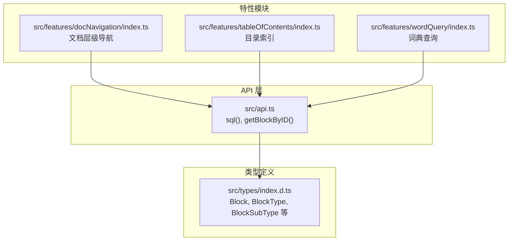
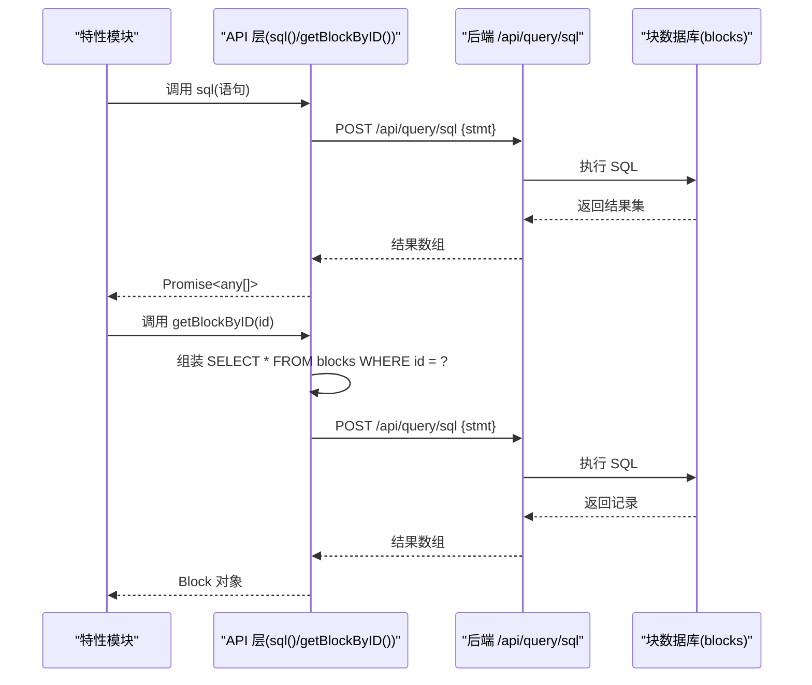
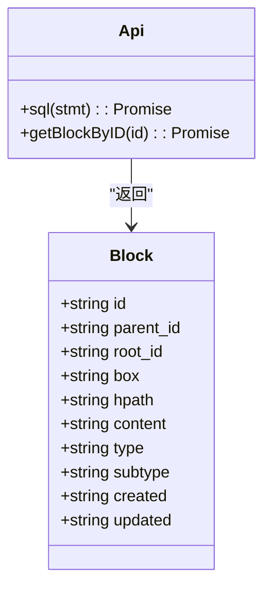
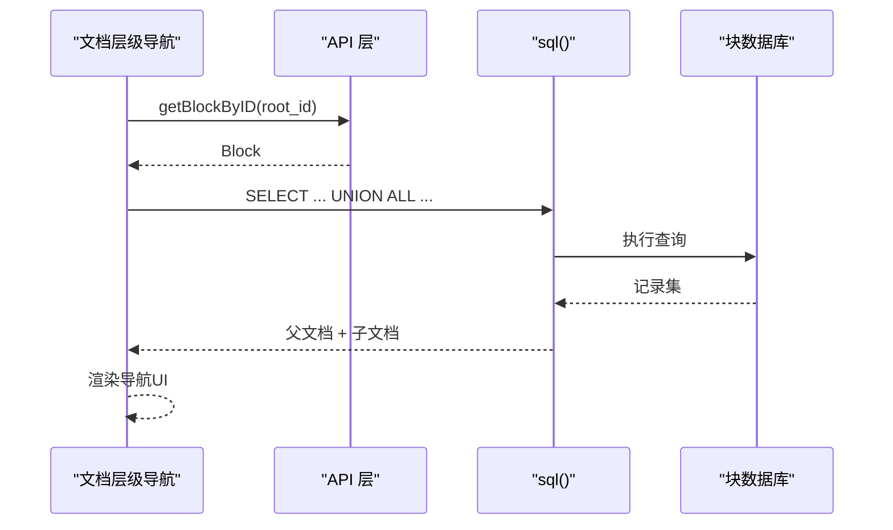
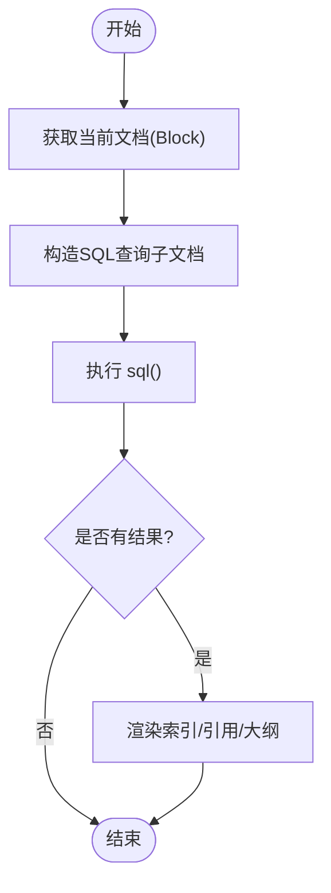
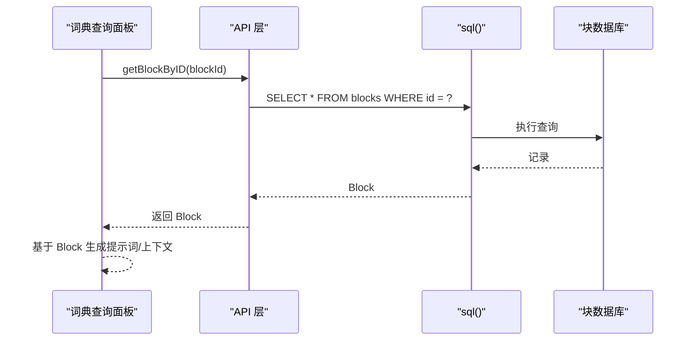
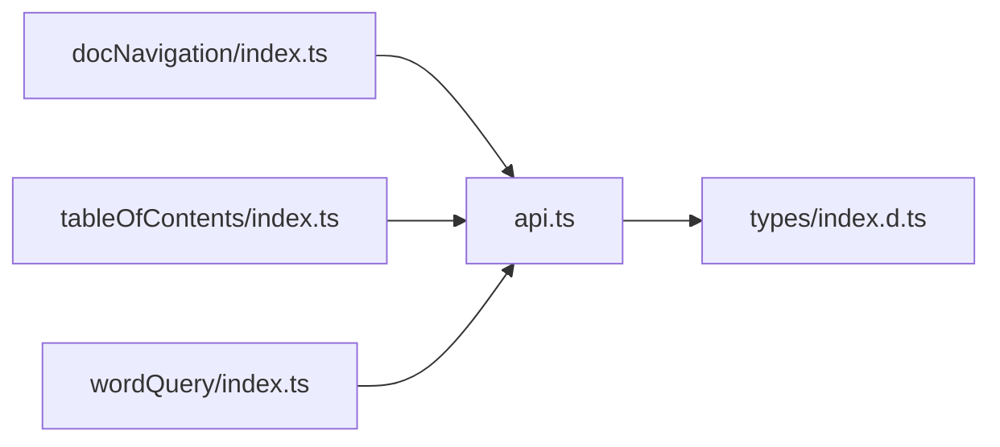

# SQL查询

<cite>
**本文引用的文件**
- [src/api.ts](file://src/api.ts)
- [src/types/index.d.ts](file://src/types/index.d.ts)
- [src/features/docNavigation/index.ts](file://src/features/docNavigation/index.ts)
- [src/features/tableOfContents/index.ts](file://src/features/tableOfContents/index.ts)
- [src/features/wordQuery/index.ts](file://src/features/wordQuery/index.ts)
- [src/features/tableOfContents/README.md](file://src/features/tableOfContents/README.md)
</cite>

## 目录
1. [简介](#简介)
2. [项目结构](#项目结构)
3. [核心组件](#核心组件)
4. [架构总览](#架构总览)
5. [详细组件分析](#详细组件分析)
6. [依赖关系分析](#依赖关系分析)
7. [性能考虑](#性能考虑)
8. [故障排查指南](#故障排查指南)
9. [结论](#结论)
10. [附录](#附录)

## 简介
本指南围绕 src/api.ts 中封装的 sql() 函数与 getBlockByID() 函数，系统讲解如何通过 SQL 与思源笔记的块数据库进行交互。文档覆盖：
- SQL 语法支持与最佳实践（含 SELECT/INSERT/UPDATE/DELETE 的使用场景与注意事项）
- 如何安全地构造查询语句以防范 SQL 注入
- 在实际功能模块（如文档层级导航、目录索引、词典查询）中如何使用 SQL 获取块信息、文档层级结构与属性数据
- 查询性能优化策略（索引使用建议、查询结果分页处理）
- 常见错误排查与调试技巧

## 项目结构
本项目采用按功能模块划分的组织方式，SQL 查询能力由统一的 API 层提供，并在多个特性模块中被复用：
- API 层：集中封装与思源笔记后端交互的接口，包括 sql() 与 getBlockByID()
- 类型层：定义 Block、BlockType、BlockSubType 等核心类型
- 特性模块：文档层级导航、目录索引、词典查询等，均通过 API 层访问数据库

图表来源
- [src/api.ts](file://src/api.ts#L306-L321)
- [src/types/index.d.ts](file://src/types/index.d.ts#L78-L103)
- [src/features/docNavigation/index.ts](file://src/features/docNavigation/index.ts#L1-L40)
- [src/features/tableOfContents/index.ts](file://src/features/tableOfContents/index.ts#L1-L40)
- [src/features/wordQuery/index.ts](file://src/features/wordQuery/index.ts#L1-L40)

章节来源
- [src/api.ts](file://src/api.ts#L306-L321)
- [src/types/index.d.ts](file://src/types/index.d.ts#L78-L103)
- [src/features/docNavigation/index.ts](file://src/features/docNavigation/index.ts#L1-L40)
- [src/features/tableOfContents/index.ts](file://src/features/tableOfContents/index.ts#L1-L40)
- [src/features/wordQuery/index.ts](file://src/features/wordQuery/index.ts#L1-L40)

## 核心组件
- sql(stmt: string): Promise<any[]>
  - 通过 /api/query/sql 接口执行传入的 SQL 语句，返回查询结果数组
  - 适用于 SELECT/INSERT/UPDATE/DELETE 等语句（具体行为取决于后端实现）
- getBlockByID(blockId: string): Promise<Block>
  - 通过 SELECT * FROM blocks WHERE id = ? 获取指定块信息
  - 返回 Block 类型对象，包含 id、content、hpath、type、subtype、created、updated 等字段

章节来源
- [src/api.ts](file://src/api.ts#L306-L321)

## 架构总览
下图展示了 SQL 查询在系统中的调用链路与数据流：

图表来源
- [src/api.ts](file://src/api.ts#L306-L321)

## 详细组件分析

### SQL 语法支持与使用示例
- SELECT
  - 示例：查询某笔记本下所有文档块
    - 语句：SELECT id, content, hpath FROM blocks WHERE box = ? AND type = 'd' ORDER BY hpath ASC
    - 用途：文档层级导航、目录索引等
  - 示例：按根文档查询标题块
    - 语句：SELECT * FROM blocks WHERE root_id = ? AND type = 'h' ORDER BY sort ASC
    - 用途：生成子文档大纲
- INSERT/UPDATE/DELETE
  - 说明：sql() 支持执行 INSERT/UPDATE/DELETE 等语句（具体行为取决于后端实现）。在本仓库中，写操作通常通过专用 API（如 insertBlock、updateBlock、deleteBlock）完成；若需直接使用 SQL，应谨慎构造并做好参数化与校验
- 参数化与安全
  - 当前实现中，文档层级导航与目录索引模块通过 escapeSqlString() 对字符串进行转义，以降低 SQL 注入风险
  - 建议：尽量使用参数化查询（如后端支持），或对所有外部输入进行严格的转义与白名单校验

章节来源
- [src/features/docNavigation/index.ts](file://src/features/docNavigation/index.ts#L35-L94)
- [src/features/tableOfContents/index.ts](file://src/features/tableOfContents/index.ts#L200-L210)
- [src/features/tableOfContents/index.ts](file://src/features/tableOfContents/index.ts#L248-L256)
- [src/features/tableOfContents/index.ts](file://src/features/tableOfContents/index.ts#L354-L363)

### getBlockByID() 实现与数据模型
- 实现要点
  - 通过 sql() 执行 SELECT * FROM blocks WHERE id = ? 获取块记录
  - 返回第一条记录作为 Block 对象
- 数据模型（Block）
  - 字段概览：id、parent_id、root_id、box、hpath、content、type、subtype、created、updated 等
  - 用途：在文档层级导航中，通过 getBlockByID() 获取当前文档的上下文信息（如 hpath、box）

图表来源
- [src/types/index.d.ts](file://src/types/index.d.ts#L78-L103)
- [src/api.ts](file://src/api.ts#L306-L321)

章节来源
- [src/api.ts](file://src/api.ts#L306-L321)
- [src/types/index.d.ts](file://src/types/index.d.ts#L78-L103)

### 文档层级导航中的 SQL 使用
- 功能概述
  - 通过 hpath 与 box 精确识别父文档与直接子文档
  - 使用 UNION 一次性查询父文档与子文档，减少往返次数
- 关键 SQL
  - 查询父文档：WHERE box = ? AND type = 'd' AND hpath = ?
  - 查询直接子文档：WHERE box = ? AND type = 'd' AND hpath LIKE ? AND hpath NOT LIKE ?/%/%
- 安全措施
  - 使用 escapeSqlString() 对用户输入进行转义

图表来源
- [src/features/docNavigation/index.ts](file://src/features/docNavigation/index.ts#L45-L94)

章节来源
- [src/features/docNavigation/index.ts](file://src/features/docNavigation/index.ts#L35-L94)

### 目录索引中的 SQL 使用
- 功能概述
  - 通过 hpath 查询当前文档的直接子文档，生成“子文档索引”“子文档引用”“子文档大纲”
  - 使用 attributes 表配合 JOIN，定位自定义属性标记的索引块
- 关键 SQL
  - 子文档查询：WHERE box = ? AND type = 'd' AND hpath LIKE ? AND hpath NOT LIKE ?/%/%
  - 自定义属性查询：JOIN attributes a1/a2 ON b.id = a1.block_id/name/value = ? WHERE b.root_id = ?

图表来源
- [src/features/tableOfContents/index.ts](file://src/features/tableOfContents/index.ts#L248-L256)
- [src/features/tableOfContents/index.ts](file://src/features/tableOfContents/index.ts#L200-L210)

章节来源
- [src/features/tableOfContents/index.ts](file://src/features/tableOfContents/index.ts#L200-L210)
- [src/features/tableOfContents/index.ts](file://src/features/tableOfContents/index.ts#L248-L256)
- [src/features/tableOfContents/index.ts](file://src/features/tableOfContents/index.ts#L354-L363)

### 词典查询中的数据检索
- 功能概述
  - 词典查询模块通过大模型 API 获取单词释义、音标、谐音、例句等内容
  - 该模块不直接使用 SQL 查询块数据库，但可结合 getBlockByID() 获取当前块信息，辅助定位查询上下文
- 相关流程
  - 获取当前块 ID -> 通过 getBlockByID() 获取 Block -> 基于 Block 的 hpath/root_id 等信息进行上下文处理

图表来源
- [src/features/wordQuery/index.ts](file://src/features/wordQuery/index.ts#L90-L100)
- [src/api.ts](file://src/api.ts#L306-L321)

章节来源
- [src/features/wordQuery/index.ts](file://src/features/wordQuery/index.ts#L90-L100)
- [src/api.ts](file://src/api.ts#L306-L321)

## 依赖关系分析
- API 层依赖
  - Block 类型定义：用于 getBlockByID() 返回值的类型约束
  - 后端接口：/api/query/sql 与 /api/block/* 等
- 特性模块依赖
  - 文档层级导航：依赖 sql() 与 getBlockByID()，并使用 escapeSqlString() 进行安全处理
  - 目录索引：依赖 sql() 与 getBlockByID()，并使用 escapeSqlString() 与 JOIN attributes
  - 词典查询：依赖 getBlockByID() 获取上下文，不直接使用 SQL

图表来源
- [src/api.ts](file://src/api.ts#L306-L321)
- [src/types/index.d.ts](file://src/types/index.d.ts#L78-L103)
- [src/features/docNavigation/index.ts](file://src/features/docNavigation/index.ts#L1-L40)
- [src/features/tableOfContents/index.ts](file://src/features/tableOfContents/index.ts#L1-L40)
- [src/features/wordQuery/index.ts](file://src/features/wordQuery/index.ts#L1-L40)

章节来源
- [src/api.ts](file://src/api.ts#L306-L321)
- [src/types/index.d.ts](file://src/types/index.d.ts#L78-L103)
- [src/features/docNavigation/index.ts](file://src/features/docNavigation/index.ts#L1-L40)
- [src/features/tableOfContents/index.ts](file://src/features/tableOfContents/index.ts#L1-L40)
- [src/features/wordQuery/index.ts](file://src/features/wordQuery/index.ts#L1-L40)

## 性能考虑
- 索引使用建议
  - hpath：用于路径匹配（如 LIKE ? AND NOT LIKE ?/%/%），建议在 blocks.hpath 上建立索引
  - box：用于笔记本隔离，建议在 blocks.box 上建立索引
  - type/subtype：用于筛选块类型，建议在 blocks.type 与 blocks.subtype 上建立索引
  - root_id：用于文档内查询（如标题块），建议在 blocks.root_id 上建立索引
- 查询优化
  - 使用 LIMIT 与 ORDER BY 限制结果规模与排序成本
  - 使用 UNION/UNION ALL 一次性查询父子文档，减少往返次数
  - JOIN attributes 时，先通过 name/value 精简再关联，避免全表扫描
- 分页处理
  - 目录索引模块展示了基于前端分页的思路（页码、每页条数、切片），可借鉴到大规模查询结果的展示中
  - 建议：后端支持 OFFSET/LIMIT 或游标分页时，优先使用后端分页

章节来源
- [src/features/tableOfContents/index.ts](file://src/features/tableOfContents/index.ts#L248-L256)
- [src/features/tableOfContents/index.ts](file://src/features/tableOfContents/index.ts#L354-L363)

## 故障排查指南
- SQL 注入与安全
  - 现象：查询异常、返回空结果或报错
  - 排查：确认输入是否经过 escapeSqlString() 转义；避免拼接未转义的用户输入
  - 参考：文档层级导航与目录索引模块的安全处理方式
- 查询结果为空
  - 现象：getDocHierarchy()/子文档查询返回空
  - 排查：检查 hpath 是否正确、box 是否匹配、type/subtype 是否符合预期
- 性能问题
  - 现象：查询缓慢、UI 卡顿
  - 排查：确认是否缺少索引；是否使用了不必要的 JOIN 或 LIKE；是否可以分页或限制结果数量
- 错误日志
  - 建议：在特性模块中捕获异常并打印错误信息，便于定位问题

章节来源
- [src/features/docNavigation/index.ts](file://src/features/docNavigation/index.ts#L35-L94)
- [src/features/tableOfContents/index.ts](file://src/features/tableOfContents/index.ts#L200-L210)
- [src/features/tableOfContents/index.ts](file://src/features/tableOfContents/index.ts#L248-L256)

## 结论
- 通过 sql() 与 getBlockByID()，特性模块能够高效、灵活地访问块数据库
- 安全方面，应坚持对用户输入进行转义或参数化处理
- 性能方面，应结合索引与分页策略，避免全表扫描与过多往返
- 本指南提供了在文档层级导航、目录索引与词典查询中的实践参考，便于扩展更多基于 SQL 的功能

## 附录
- SQL 语法速查
  - SELECT：用于检索块信息、文档层级、属性数据
  - INSERT/UPDATE/DELETE：谨慎使用，建议通过专用 API 或严格参数化
- 最佳实践清单
  - 输入转义：escapeSqlString() 或参数化查询
  - 索引设计：hpath、box、type、subtype、root_id
  - 分页策略：LIMIT/OFFSET 或游标分页
  - 错误处理：捕获异常并记录日志