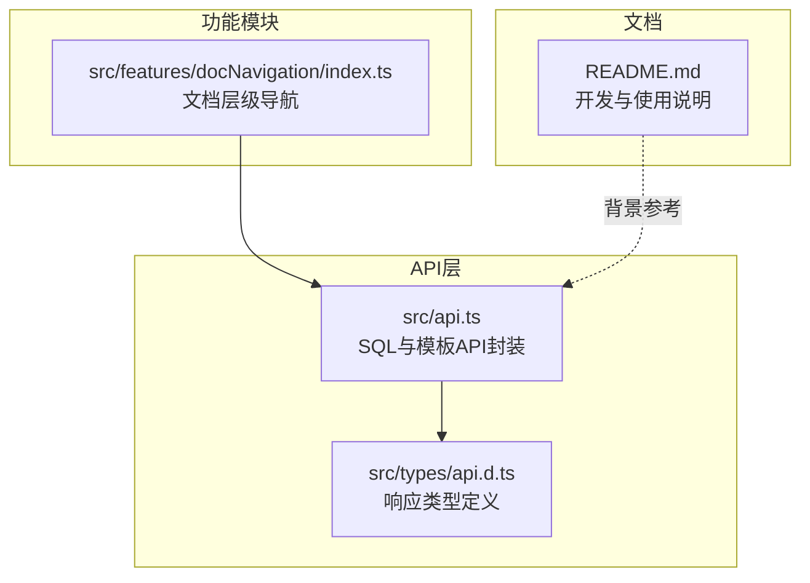
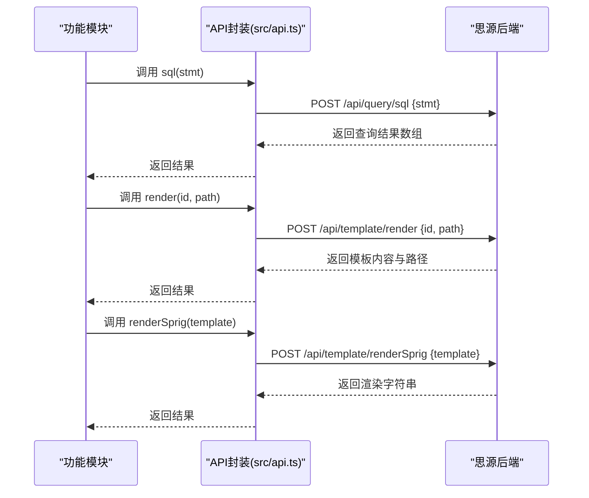
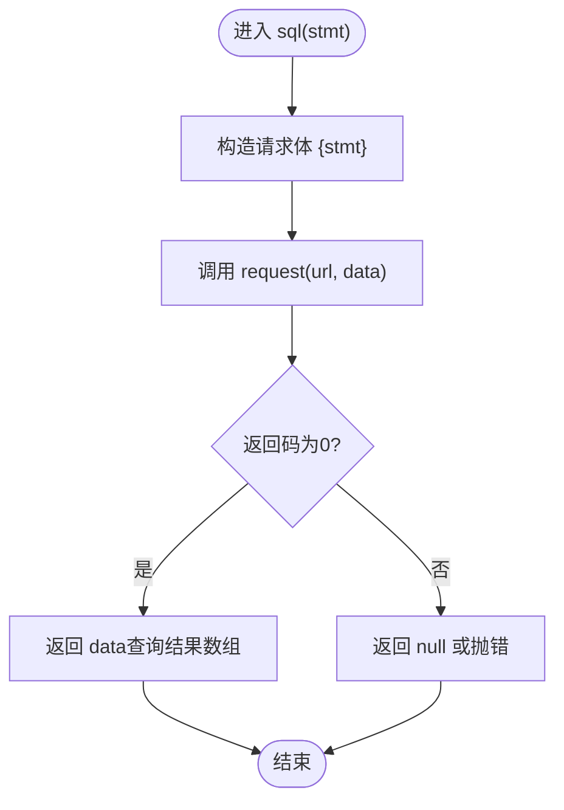
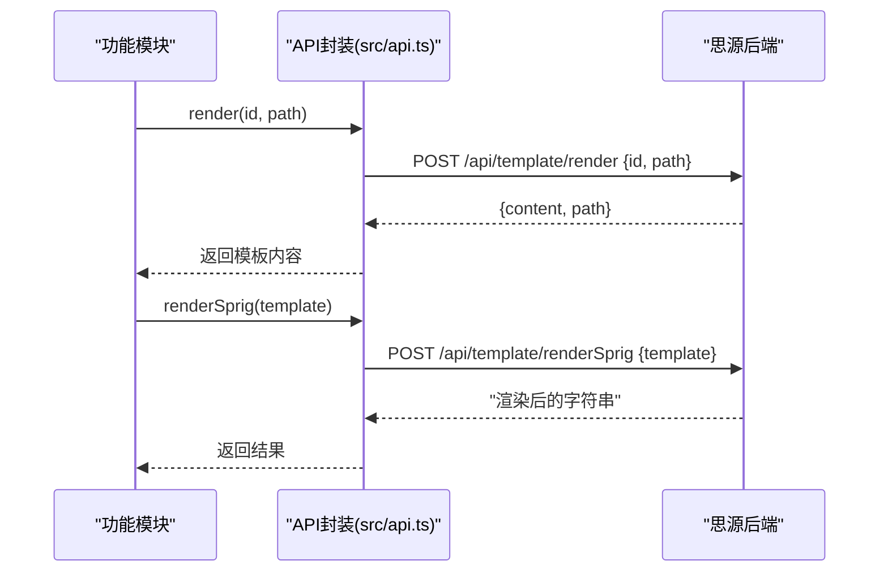
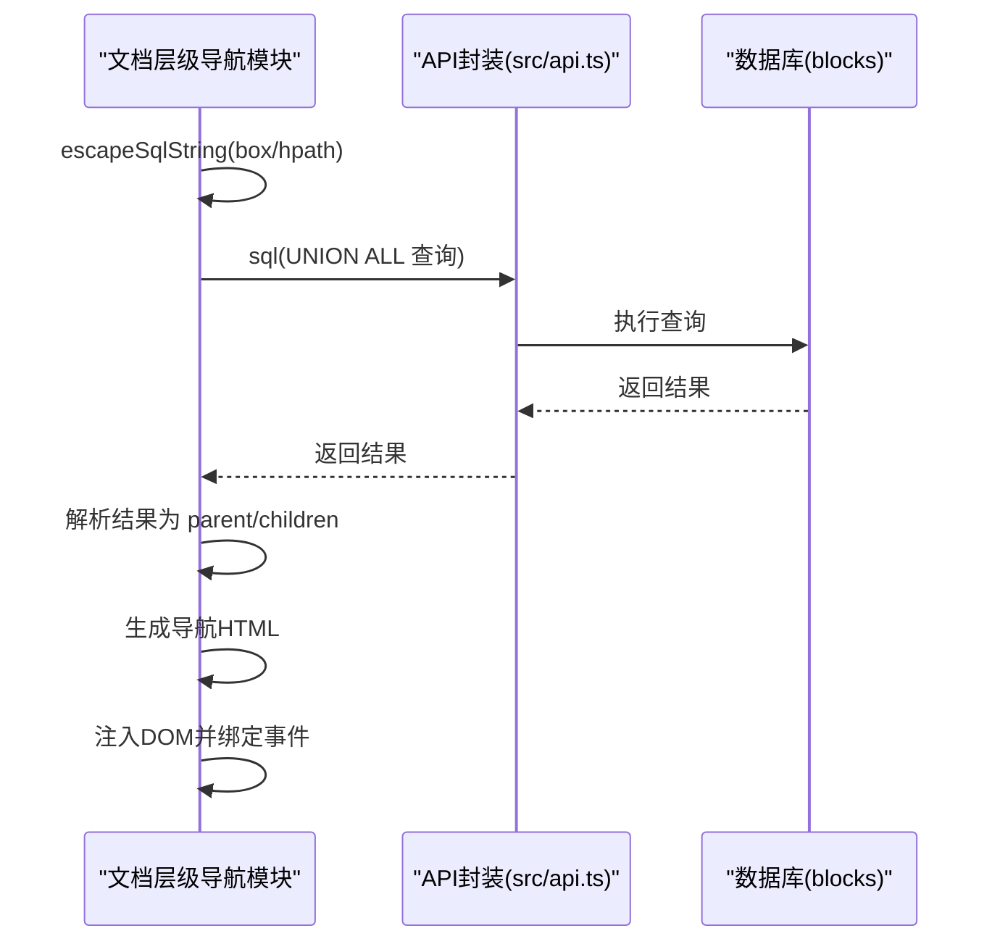
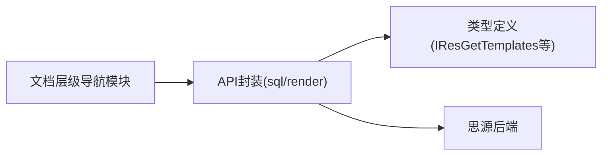

# 查询与模板

<cite>
**本文引用的文件列表**
- [src/api.ts](file://src/api.ts)
- [src/features/docNavigation/index.ts](file://src/features/docNavigation/index.ts)
- [src/types/api.d.ts](file://src/types/api.d.ts)
- [README.md](file://README.md)
</cite>

## 目录
1. [简介](#简介)
2. [项目结构](#项目结构)
3. [核心组件](#核心组件)
4. [架构总览](#架构总览)
5. [详细组件分析](#详细组件分析)
6. [依赖关系分析](#依赖关系分析)
7. [性能考量](#性能考量)
8. [故障排查指南](#故障排查指南)
9. [结论](#结论)

## 简介
本指南聚焦于 src/api.ts 中封装的 SQL 查询与模板渲染两类能力：
- SQL 查询：提供 sql(stmt) 与便捷查询 getBlockByID 的封装，用于直接执行数据库查询语句并返回结果。
- 模板渲染：提供 render(id, path) 与 renderSprig(template) 两种模板渲染方式，分别用于渲染文档模板与 Sprig 模板片段。

文档将从系统架构、数据流、处理逻辑、安全与性能等方面进行深入剖析，并给出在实际功能模块（如文档层级导航）中的使用示例与最佳实践。

## 项目结构
围绕“查询与模板”的相关文件主要集中在 src/api.ts 与功能模块 src/features/docNavigation/index.ts 中；类型定义位于 src/types/api.d.ts；README.md 提供了整体开发背景与 API 使用说明。

图表来源
- [src/api.ts](file://src/api.ts#L306-L340)
- [src/features/docNavigation/index.ts](file://src/features/docNavigation/index.ts#L1-L120)
- [src/types/api.d.ts](file://src/types/api.d.ts#L1-L65)
- [README.md](file://README.md#L260-L281)

章节来源
- [src/api.ts](file://src/api.ts#L306-L340)
- [src/features/docNavigation/index.ts](file://src/features/docNavigation/index.ts#L1-L120)
- [src/types/api.d.ts](file://src/types/api.d.ts#L1-L65)
- [README.md](file://README.md#L260-L281)

## 核心组件
- SQL 查询封装
  - sql(stmt): 向 /api/query/sql 发送请求，传入 stmt 作为 SQL 语句，返回查询结果数组。
  - getBlockByID(blockId): 基于 sql 的便捷查询，按 id 查询 blocks 表，返回单条块记录。
- 模板渲染封装
  - render(id, path): 向 /api/template/render 发送请求，传入文档 id 与模板路径，返回模板内容与路径。
  - renderSprig(template): 向 /api/template/renderSprig 发送请求，传入模板字符串，返回渲染后的字符串。

章节来源
- [src/api.ts](file://src/api.ts#L306-L340)

## 架构总览
下图展示了“查询与模板”在系统中的位置与交互关系：功能模块通过 api.ts 的封装发起请求，API 层负责与思源后端通信，返回结构化的响应类型。

图表来源
- [src/api.ts](file://src/api.ts#L306-L340)

## 详细组件分析

### SQL 查询组件分析
- 设计要点
  - 统一封装：统一通过 request(url, data) 发起同步 POST 请求，对返回码进行判断，仅在 code=0 时返回 data。
  - 语句传递：sql(stmt) 将 stmt 作为键传入，后端据此执行 SQL。
  - 便捷查询：getBlockByID 基于 sql(stmt) 实现，直接返回第一条记录。
- 数据结构与复杂度
  - 返回类型：any[]，由后端查询结果决定；通常包含多行记录，每行对应一个对象。
  - 复杂度：取决于 SQL 执行计划与索引，典型场景为 O(log n) 到 O(n) 不等。
- 依赖链
  - 功能模块依赖 api.ts 的 sql 与 getBlockByID。
  - getBlockByID 依赖 sql(stmt)。
- 安全与性能
  - 安全：需严格控制输入，避免 SQL 注入；建议使用参数化查询或严格的转义与白名单校验。
  - 性能：优先使用索引字段过滤，减少全表扫描；合并查询以降低往返次数。

图表来源
- [src/api.ts](file://src/api.ts#L306-L314)

章节来源
- [src/api.ts](file://src/api.ts#L306-L320)

### 模板渲染组件分析
- 设计要点
  - render(id, path)：面向文档模板，传入文档 id 与模板相对路径，返回模板内容与路径。
  - renderSprig(template)：面向 Sprig 模板片段，直接传入模板字符串，返回渲染后的字符串。
- 数据结构与复杂度
  - render 返回 IResGetTemplates，包含 content 与 path 字段。
  - renderSprig 返回字符串，复杂度取决于模板大小与变量绑定数量。
- 依赖链
  - 功能模块直接依赖 api.ts 的 render 与 renderSprig。
- 使用场景
  - 文档级模板：用于生成动态内容、报表、索引等。
  - 片段级模板：用于在块内嵌入动态片段，如统计、时间戳、变量替换等。

图表来源
- [src/api.ts](file://src/api.ts#L322-L340)

章节来源
- [src/api.ts](file://src/api.ts#L322-L340)

### 实战示例：文档层级导航中的查询与模板
- 查询示例
  - 在文档层级导航模块中，使用 sql(stmt) 一次性查询父文档与子文档，通过 UNION ALL 合并结果，减少往返次数。
  - 使用 escapeSqlString 对用户输入进行转义，降低 SQL 注入风险。
- 模板示例
  - 该模块未直接使用模板渲染 API，但其渲染逻辑与模板渲染 API 的思路一致：先获取数据，再拼装 HTML 结果。
  - 若需要在导航中嵌入动态内容，可考虑使用 render 或 renderSprig 生成片段，再注入 DOM。

图表来源
- [src/features/docNavigation/index.ts](file://src/features/docNavigation/index.ts#L35-L94)
- [src/api.ts](file://src/api.ts#L306-L314)

章节来源
- [src/features/docNavigation/index.ts](file://src/features/docNavigation/index.ts#L35-L94)
- [src/api.ts](file://src/api.ts#L306-L314)

## 依赖关系分析
- 组件耦合
  - 功能模块对 API 层存在强依赖，API 层对后端接口存在强依赖。
  - getBlockByID 与 sql 形成内部依赖关系，便于上层模块复用。
- 类型契约
  - IResGetTemplates 作为模板渲染的返回类型，约束 content 与 path 字段。
  - IResdoOperations 等类型用于块操作等其他 API 的返回结构。

图表来源
- [src/features/docNavigation/index.ts](file://src/features/docNavigation/index.ts#L1-L120)
- [src/api.ts](file://src/api.ts#L306-L340)
- [src/types/api.d.ts](file://src/types/api.d.ts#L1-L65)

章节来源
- [src/features/docNavigation/index.ts](file://src/features/docNavigation/index.ts#L1-L120)
- [src/api.ts](file://src/api.ts#L306-L340)
- [src/types/api.d.ts](file://src/types/api.d.ts#L1-L65)

## 性能考量
- SQL 查询
  - 合并查询：如文档层级导航中使用 UNION ALL 一次性获取父与子文档，减少往返次数。
  - 索引优化：确保过滤条件命中索引（如 box、type、hpath），避免全表扫描。
  - 防抖与缓存：对频繁触发的查询使用防抖与内存缓存，避免重复计算。
- 模板渲染
  - 模板大小与变量数量影响渲染时间，尽量保持模板简洁。
  - 对高频片段可缓存渲染结果，减少重复渲染。

## 故障排查指南
- SQL 注入与安全
  - 现象：查询异常、数据泄露、SQL 报错。
  - 排查：确认输入是否经过 escapeSqlString 转义；避免拼接不受控字符串；必要时改用参数化查询。
  - 参考实现：文档层级导航模块中 escapeSqlString 的使用。
- 查询性能
  - 现象：查询耗时长、界面卡顿。
  - 排查：检查 WHERE 条件是否命中索引；减少不必要的列选择；合并查询。
- 模板渲染
  - 现象：模板未渲染、内容为空。
  - 排查：确认文档 id 与模板路径有效；检查模板语法与变量绑定；确认后端模板服务可用。
- API 返回码
  - 现象：返回 null 或异常。
  - 排查：检查请求体与 URL；确认后端返回码为 0；查看网络与权限配置。

章节来源
- [src/features/docNavigation/index.ts](file://src/features/docNavigation/index.ts#L35-L94)
- [src/api.ts](file://src/api.ts#L306-L340)

## 结论
- SQL 查询与模板渲染是思源插件开发中的两大基础能力。通过 api.ts 的统一封装，功能模块可以以较低成本获取数据并生成动态内容。
- 在实践中应重视安全性（转义与参数化）、性能（索引与合并查询）、以及可维护性（清晰的类型契约与错误处理）。
- 文档层级导航模块提供了“查询+渲染”的完整范式：先查询数据，再组装 UI，可作为模板渲染的参考实现思路。