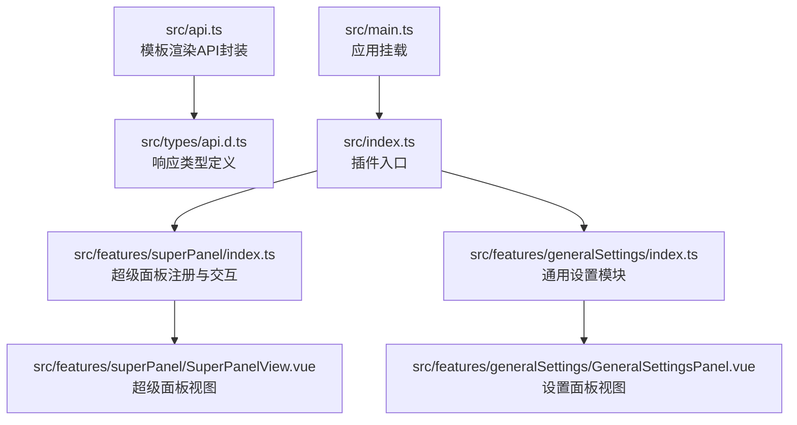
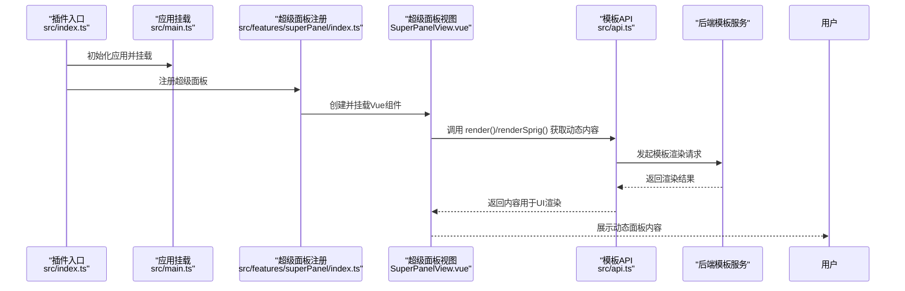
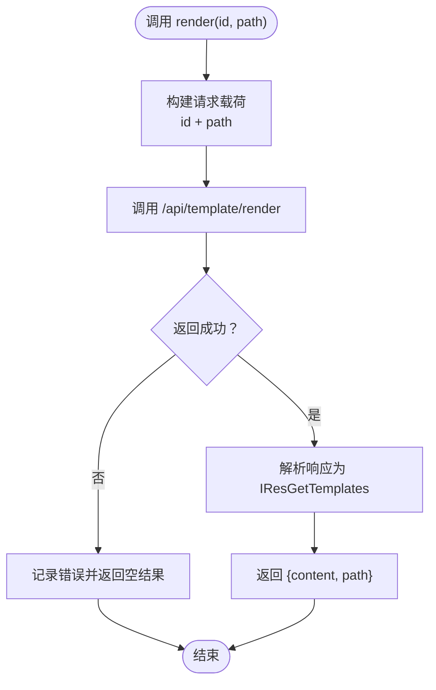
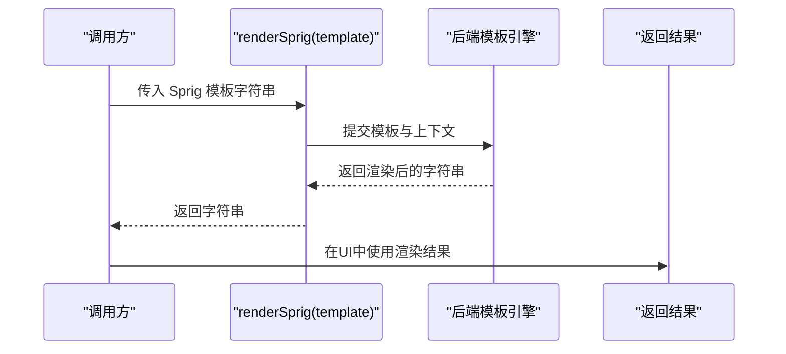
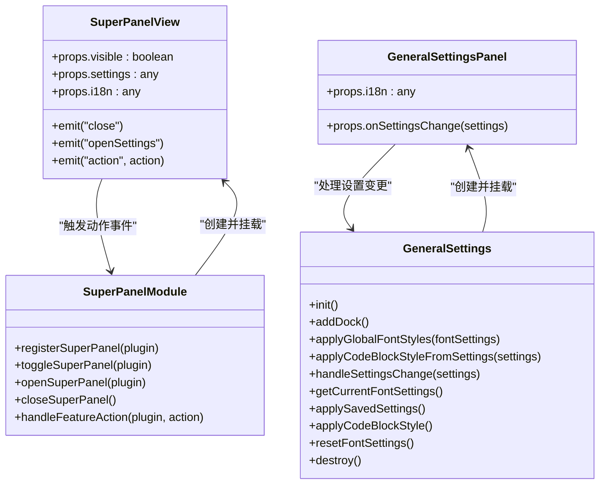
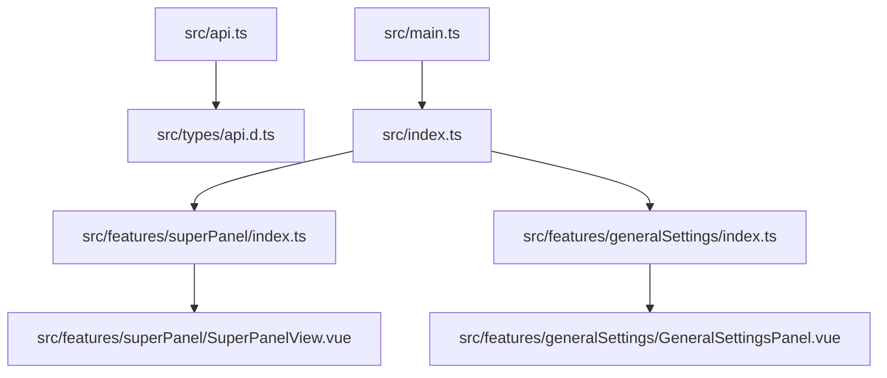

# 模板渲染

<cite>
**本文引用的文件**
- [src/api.ts](file://src/api.ts)
- [src/types/api.d.ts](file://src/types/api.d.ts)
- [src/features/superPanel/SuperPanelView.vue](file://src/features/superPanel/SuperPanelView.vue)
- [src/features/superPanel/index.ts](file://src/features/superPanel/index.ts)
- [src/features/generalSettings/GeneralSettingsPanel.vue](file://src/features/generalSettings/GeneralSettingsPanel.vue)
- [src/features/generalSettings/index.ts](file://src/features/generalSettings/index.ts)
- [src/main.ts](file://src/main.ts)
- [src/index.ts](file://src/index.ts)
</cite>

## 目录
1. [简介](#简介)
2. [项目结构](#项目结构)
3. [核心组件](#核心组件)
4. [架构总览](#架构总览)
5. [详细组件分析](#详细组件分析)
6. [依赖关系分析](#依赖关系分析)
7. [性能考虑](#性能考虑)
8. [故障排查指南](#故障排查指南)
9. [结论](#结论)
10. [附录](#附录)

## 简介
本指南围绕 src/api.ts 中封装的两个模板渲染 API 进行深入讲解：render() 与 renderSprig()。前者基于文档 ID 与模板路径生成动态内容，适用于文档批量处理与报告生成；后者基于 Sprig 模板语法，支持变量插值、条件判断、循环控制、字符串处理等内置函数，适合在插件中进行内容自动化生成。文档还解释了模板沙箱安全机制与上下文变量绑定规则，并结合超级面板与设置面板等实际功能说明模板在 UI 动态渲染中的应用模式，最后给出性能优化建议。

## 项目结构
本项目采用模块化组织，模板渲染能力由 src/api.ts 提供，UI 展示由功能模块负责，如超级面板与通用设置面板。下图展示了与模板渲染相关的关键文件与交互关系：

图表来源
- [src/api.ts](file://src/api.ts#L322-L340)
- [src/types/api.d.ts](file://src/types/api.d.ts#L32-L41)
- [src/features/superPanel/index.ts](file://src/features/superPanel/index.ts#L17-L42)
- [src/features/superPanel/SuperPanelView.vue](file://src/features/superPanel/SuperPanelView.vue#L1-L45)
- [src/features/generalSettings/index.ts](file://src/features/generalSettings/index.ts#L17-L41)
- [src/features/generalSettings/GeneralSettingsPanel.vue](file://src/features/generalSettings/GeneralSettingsPanel.vue#L1-L20)
- [src/index.ts](file://src/index.ts#L64-L86)
- [src/main.ts](file://src/main.ts#L21-L38)

章节来源
- [src/api.ts](file://src/api.ts#L322-L340)
- [src/types/api.d.ts](file://src/types/api.d.ts#L32-L41)
- [src/features/superPanel/index.ts](file://src/features/superPanel/index.ts#L17-L42)
- [src/features/superPanel/SuperPanelView.vue](file://src/features/superPanel/SuperPanelView.vue#L1-L45)
- [src/features/generalSettings/index.ts](file://src/features/generalSettings/index.ts#L17-L41)
- [src/features/generalSettings/GeneralSettingsPanel.vue](file://src/features/generalSettings/GeneralSettingsPanel.vue#L1-L20)
- [src/index.ts](file://src/index.ts#L64-L86)
- [src/main.ts](file://src/main.ts#L21-L38)

## 核心组件
- render(id, path)
  - 作用：根据文档 ID 与模板路径请求后端模板渲染接口，返回包含渲染内容与路径的响应对象。
  - 返回类型：IResGetTemplates（content、path）。
  - 适用场景：文档批量处理、报告生成、按模板输出内容。
- renderSprig(template)
  - 作用：将传入的 Sprig 模板字符串提交至后端模板引擎进行渲染，返回最终字符串。
  - 适用场景：在插件中进行内容自动化生成，如动态标题、列表、表格等。
- 请求封装 request(url, data)
  - 作用：统一发起同步 POST 请求，处理返回数据与错误分支，便于 render/renderSprig 统一调用。

章节来源
- [src/api.ts](file://src/api.ts#L322-L340)
- [src/types/api.d.ts](file://src/types/api.d.ts#L32-L41)

## 架构总览
模板渲染在插件中的调用链路如下：
- 插件入口加载后，功能模块通过 API 封装调用模板渲染接口。
- 渲染结果用于 UI 动态更新，例如超级面板的卡片标题、描述与状态，或设置面板的动态内容。
- 通用设置模块通过监听设置变更事件，将样式与内容应用到编辑器与阅读模式区域。

图表来源
- [src/index.ts](file://src/index.ts#L64-L86)
- [src/main.ts](file://src/main.ts#L21-L38)
- [src/features/superPanel/index.ts](file://src/features/superPanel/index.ts#L17-L42)
- [src/features/superPanel/SuperPanelView.vue](file://src/features/superPanel/SuperPanelView.vue#L1-L45)
- [src/api.ts](file://src/api.ts#L322-L340)

## 详细组件分析

### render() 函数分析
- 功能定位
  - 基于文档 ID 与模板路径生成动态内容，常用于文档批量处理与报告生成。
- 数据流
  - 输入：文档 ID、模板路径。
  - 输出：渲染后的字符串内容与模板路径。
- 错误处理
  - 通过统一请求封装处理返回码与数据分支，保证调用方获得稳定的结果结构。
- 性能特性
  - 作为一次性的模板渲染调用，建议在批量场景中合并请求或缓存结果，减少网络往返。

图表来源
- [src/api.ts](file://src/api.ts#L322-L334)
- [src/types/api.d.ts](file://src/types/api.d.ts#L32-L41)

章节来源
- [src/api.ts](file://src/api.ts#L322-L334)
- [src/types/api.d.ts](file://src/types/api.d.ts#L32-L41)

### renderSprig() 函数分析
- 功能定位
  - 支持 Sprig 模板语法，适用于在插件中进行内容自动化生成。
- 语法要点（基于仓库 API 行为与常见 Sprig 语义）
  - 变量插值：{{ var }} 或 {{ obj.field }}。
  - 条件判断：if/else 分支。
  - 循环控制：for/in 遍历数组或对象。
  - 字符串处理：内置函数如 trim、upper、lower、split、join 等。
  - 上下文绑定：模板运行时可访问传入的上下文对象（如 settings、i18n、当前文档元数据等）。
  - 沙箱安全：模板在受控环境中执行，禁止访问宿主全局对象与敏感 API。
- 使用建议
  - 将复杂逻辑拆分为多个小模板，便于维护与调试。
  - 对外部输入进行校验与转义，避免注入风险。
  - 在 UI 中使用渲染结果前进行必要的 HTML 安全处理。

图表来源
- [src/api.ts](file://src/api.ts#L336-L339)

章节来源
- [src/api.ts](file://src/api.ts#L336-L339)

### UI 动态渲染应用：超级面板与设置面板
- 超级面板
  - 通过注册函数在右上角添加入口图标，点击后创建并挂载 Vue 应用，展示功能卡片列表。
  - 卡片标题、描述与状态来源于 i18n 与 settings，可通过模板生成动态文案。
- 通用设置面板
  - 通过 Dock 在右侧边栏展示设置区域，支持字体、代码块样式等动态应用。
  - 设置变更事件可用于触发模板渲染，以动态更新 UI 或导出配置。

图表来源
- [src/features/superPanel/SuperPanelView.vue](file://src/features/superPanel/SuperPanelView.vue#L1-L45)
- [src/features/superPanel/index.ts](file://src/features/superPanel/index.ts#L17-L42)
- [src/features/generalSettings/GeneralSettingsPanel.vue](file://src/features/generalSettings/GeneralSettingsPanel.vue#L1-L20)
- [src/features/generalSettings/index.ts](file://src/features/generalSettings/index.ts#L17-L41)

章节来源
- [src/features/superPanel/SuperPanelView.vue](file://src/features/superPanel/SuperPanelView.vue#L1-L45)
- [src/features/superPanel/index.ts](file://src/features/superPanel/index.ts#L17-L42)
- [src/features/generalSettings/GeneralSettingsPanel.vue](file://src/features/generalSettings/GeneralSettingsPanel.vue#L1-L20)
- [src/features/generalSettings/index.ts](file://src/features/generalSettings/index.ts#L17-L41)

### 模板沙箱与上下文绑定规则
- 沙箱安全
  - 模板在受控环境中执行，禁止访问宿主全局对象与敏感 API，防止恶意脚本注入。
- 上下文变量绑定
  - 模板可访问传入的上下文对象字段（如 settings、i18n、当前文档元数据等），用于动态生成内容。
  - 建议在调用前对上下文进行严格校验与最小权限暴露，避免泄露敏感信息。

[本节为概念性说明，不直接分析具体文件，故不附“章节来源”]

## 依赖关系分析
- 模块耦合
  - 模板渲染 API 与功能模块解耦，通过统一接口调用，降低耦合度。
- 直接依赖
  - 超级面板与通用设置面板依赖插件实例提供的 i18n、settings 等上下文。
- 外部依赖
  - 模板渲染依赖后端模板服务，前端仅负责请求与结果消费。

图表来源
- [src/api.ts](file://src/api.ts#L322-L340)
- [src/types/api.d.ts](file://src/types/api.d.ts#L32-L41)
- [src/features/superPanel/index.ts](file://src/features/superPanel/index.ts#L17-L42)
- [src/features/superPanel/SuperPanelView.vue](file://src/features/superPanel/SuperPanelView.vue#L1-L45)
- [src/features/generalSettings/index.ts](file://src/features/generalSettings/index.ts#L17-L41)
- [src/features/generalSettings/GeneralSettingsPanel.vue](file://src/features/generalSettings/GeneralSettingsPanel.vue#L1-L20)
- [src/main.ts](file://src/main.ts#L21-L38)
- [src/index.ts](file://src/index.ts#L64-L86)

章节来源
- [src/api.ts](file://src/api.ts#L322-L340)
- [src/types/api.d.ts](file://src/types/api.d.ts#L32-L41)
- [src/features/superPanel/index.ts](file://src/features/superPanel/index.ts#L17-L42)
- [src/features/superPanel/SuperPanelView.vue](file://src/features/superPanel/SuperPanelView.vue#L1-L45)
- [src/features/generalSettings/index.ts](file://src/features/generalSettings/index.ts#L17-L41)
- [src/features/generalSettings/GeneralSettingsPanel.vue](file://src/features/generalSettings/GeneralSettingsPanel.vue#L1-L20)
- [src/main.ts](file://src/main.ts#L21-L38)
- [src/index.ts](file://src/index.ts#L64-L86)

## 性能考虑
- 批量渲染
  - 在需要对大量文档进行模板渲染时，建议合并请求或使用缓存，减少网络往返与重复计算。
- 模板复杂度
  - 控制模板复杂度，避免深层嵌套与过多循环，必要时拆分模板。
- UI 更新策略
  - 在 UI 中使用虚拟滚动或分页展示大量渲染结果，避免一次性渲染造成卡顿。
- 资源管理
  - 对渲染结果进行必要的 HTML 安全处理，避免在 UI 中直接注入不受控内容。

[本节为通用指导，不直接分析具体文件，故不附“章节来源”]

## 故障排查指南
- 渲染结果为空
  - 检查文档 ID 与模板路径是否正确，确认后端模板服务可用。
  - 参考请求封装的错误分支处理逻辑，定位问题来源。
- 模板语法错误
  - 校验 Sprig 模板语法，确保变量、条件与循环语法正确。
  - 对外部输入进行校验与转义，避免注入风险。
- UI 不更新
  - 确认调用方在收到渲染结果后正确更新组件状态。
  - 检查 i18n 与 settings 是否正确传递到组件。

章节来源
- [src/api.ts](file://src/api.ts#L322-L340)

## 结论
本指南系统梳理了模板渲染 API 的使用场景与技术实现，明确了 render() 与 renderSprig() 的职责边界与适用范围，并结合超级面板与设置面板展示了模板在 UI 动态渲染中的应用模式。通过合理的上下文绑定与沙箱安全机制，可以在保证安全性的同时实现灵活的内容自动化生成。建议在批量场景中优化请求与缓存策略，在 UI 层面采用分页与虚拟滚动提升性能。

[本节为总结性内容，不直接分析具体文件，故不附“章节来源”]

## 附录
- 实际代码示例路径（不展示具体代码内容）
  - render() 使用示例路径：[src/api.ts](file://src/api.ts#L322-L334)
  - renderSprig() 使用示例路径：[src/api.ts](file://src/api.ts#L336-L339)
  - 超级面板注册与交互路径：[src/features/superPanel/index.ts](file://src/features/superPanel/index.ts#L17-L42)
  - 超级面板视图路径：[src/features/superPanel/SuperPanelView.vue](file://src/features/superPanel/SuperPanelView.vue#L1-L45)
  - 通用设置模块与面板路径：[src/features/generalSettings/index.ts](file://src/features/generalSettings/index.ts#L17-L41)、[src/features/generalSettings/GeneralSettingsPanel.vue](file://src/features/generalSettings/GeneralSettingsPanel.vue#L1-L20)
  - 插件入口与应用挂载路径：[src/index.ts](file://src/index.ts#L64-L86)、[src/main.ts](file://src/main.ts#L21-L38)