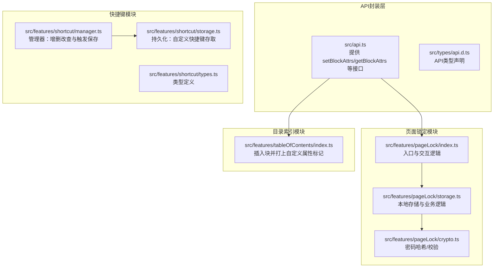
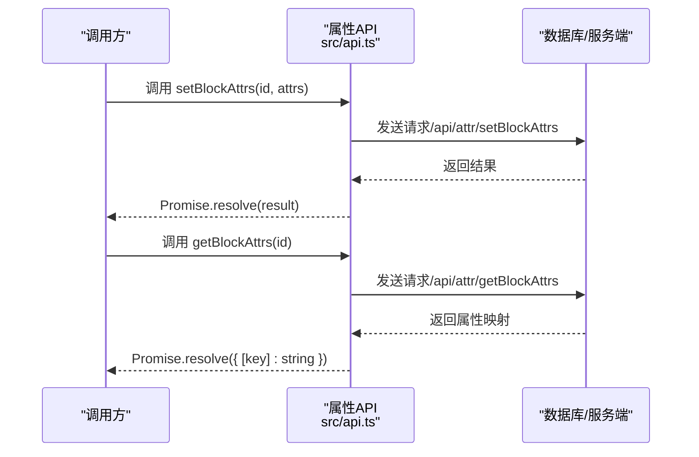
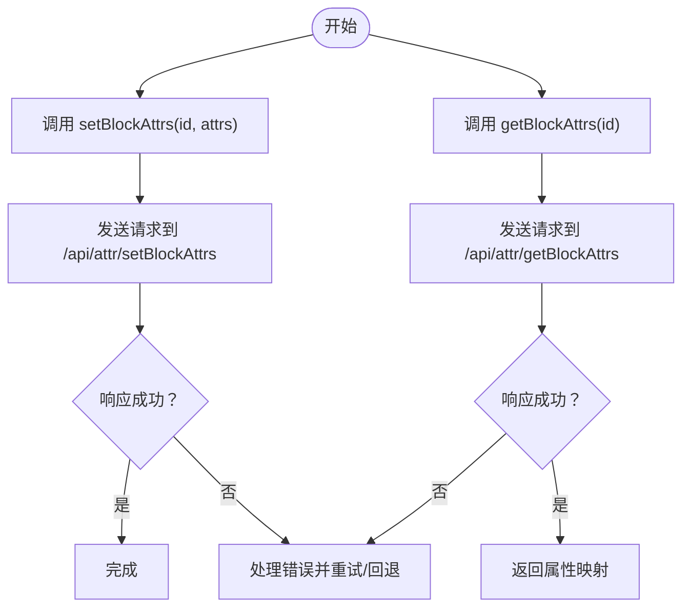
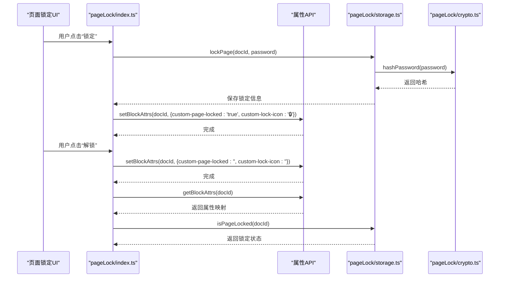
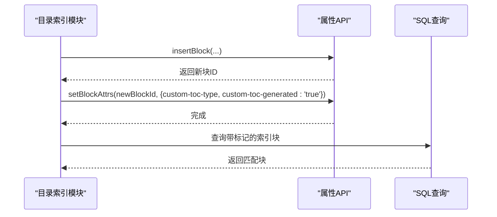
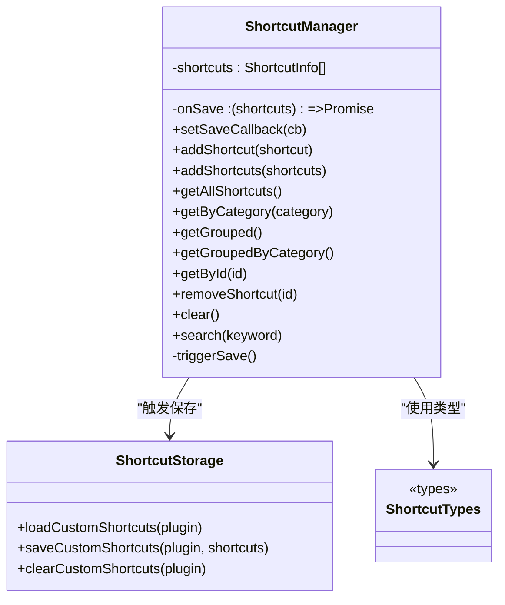
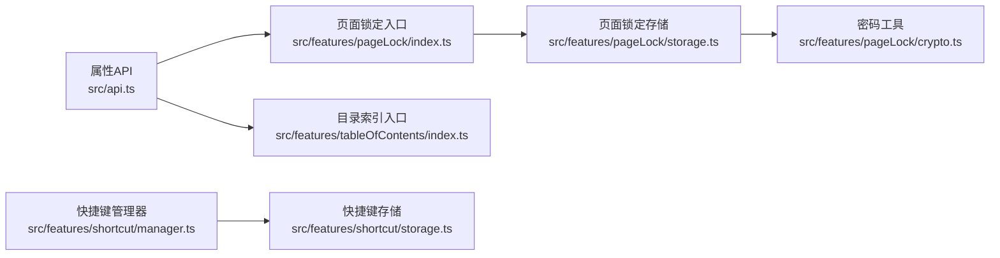

# 属性操作API

<cite>
**本文引用的文件**
- [src/api.ts](file://src/api.ts)
- [src/types/api.d.ts](file://src/types/api.d.ts)
- [src/features/pageLock/index.ts](file://src/features/pageLock/index.ts)
- [src/features/pageLock/storage.ts](file://src/features/pageLock/storage.ts)
- [src/features/pageLock/crypto.ts](file://src/features/pageLock/crypto.ts)
- [src/features/tableOfContents/index.ts](file://src/features/tableOfContents/index.ts)
- [src/features/shortcut/manager.ts](file://src/features/shortcut/manager.ts)
- [src/features/shortcut/storage.ts](file://src/features/shortcut/storage.ts)
- [src/features/shortcut/types.ts](file://src/features/shortcut/types.ts)
</cite>

## 目录
1. [简介](#简介)
2. [项目结构](#项目结构)
3. [核心组件](#核心组件)
4. [架构总览](#架构总览)
5. [详细组件分析](#详细组件分析)
6. [依赖关系分析](#依赖关系分析)
7. [性能考量](#性能考量)
8. [故障排查指南](#故障排查指南)
9. [结论](#结论)
10. [附录](#附录)

## 简介
本文件围绕“块属性管理API”展开，重点聚焦于两个核心方法：读取块属性 getBlockAttrs 与写入块属性 setBlockAttrs。文档将系统阐述：
- 如何读取与修改任意块的自定义属性，包括属性命名规范与数据类型限制
- 在页面锁定功能中使用 getBlockAttrs 验证加密状态的实际案例
- 在快捷键管理中持久化用户配置的应用示例
- 属性存储的底层机制与同步策略
- 敏感数据加密存储的最佳实践（避免明文存储密码等）
- 批量设置属性时的性能优化建议

## 项目结构
本仓库采用按功能域划分的目录结构，与属性操作相关的实现主要分布在以下模块：
- API封装层：统一对外暴露属性读写接口
- 页面锁定模块：演示属性读写与加密存储的完整流程
- 目录索引模块：展示属性标记与后续查询的配合使用
- 快捷键模块：演示属性持久化与管理器的协作

图表来源
- [src/api.ts](file://src/api.ts#L283-L305)
- [src/features/pageLock/index.ts](file://src/features/pageLock/index.ts#L1-L120)
- [src/features/pageLock/storage.ts](file://src/features/pageLock/storage.ts#L1-L80)
- [src/features/pageLock/crypto.ts](file://src/features/pageLock/crypto.ts#L1-L24)
- [src/features/tableOfContents/index.ts](file://src/features/tableOfContents/index.ts#L170-L185)
- [src/features/shortcut/manager.ts](file://src/features/shortcut/manager.ts#L1-L60)
- [src/features/shortcut/storage.ts](file://src/features/shortcut/storage.ts#L1-L40)
- [src/features/shortcut/types.ts](file://src/features/shortcut/types.ts#L1-L44)

章节来源
- [src/api.ts](file://src/api.ts#L283-L305)
- [src/features/pageLock/index.ts](file://src/features/pageLock/index.ts#L1-L120)
- [src/features/tableOfContents/index.ts](file://src/features/tableOfContents/index.ts#L170-L185)
- [src/features/shortcut/manager.ts](file://src/features/shortcut/manager.ts#L1-L60)
- [src/features/shortcut/storage.ts](file://src/features/shortcut/storage.ts#L1-L40)

## 核心组件
- 属性读写API
  - getBlockAttrs(id: BlockId): Promise<{ [key: string]: string }>
  - setBlockAttrs(id: BlockId, attrs: { [key: string]: string }): Promise<any>
- 页面锁定模块
  - 使用 setBlockAttrs 在文档根块上打上“锁定标识”与“锁图标”属性
  - 使用 getBlockAttrs 验证加密状态
- 目录索引模块
  - 在生成的索引块上打上“类型”与“已生成”标记，便于后续检索
- 快捷键模块
  - 使用管理器与存储模块实现用户配置的持久化

章节来源
- [src/api.ts](file://src/api.ts#L283-L305)
- [src/features/pageLock/index.ts](file://src/features/pageLock/index.ts#L180-L210)
- [src/features/tableOfContents/index.ts](file://src/features/tableOfContents/index.ts#L170-L185)
- [src/features/shortcut/manager.ts](file://src/features/shortcut/manager.ts#L1-L60)
- [src/features/shortcut/storage.ts](file://src/features/shortcut/storage.ts#L1-L40)

## 架构总览
属性操作API位于应用层与数据库之间，提供统一的属性读写能力；页面锁定与目录索引模块通过该能力实现业务目标；快捷键模块通过管理器与存储实现用户配置持久化。

图表来源
- [src/api.ts](file://src/api.ts#L283-L305)

## 详细组件分析

### 组件A：属性读写API（getBlockAttrs / setBlockAttrs）
- 方法签名与行为
  - setBlockAttrs(id, attrs)：向指定块写入一组键值对属性，值类型限定为字符串
  - getBlockAttrs(id)：读取指定块的所有属性，返回键到字符串的映射
- 数据类型与约束
  - 值类型：字符串
  - 键命名：建议使用自定义前缀（如 custom-*），避免与系统保留键冲突
  - 建议长度：遵循实际业务需求，避免过大键值影响存储与查询性能
- 底层机制与同步策略
  - 通过统一的请求封装函数发送到对应REST端点
  - 返回值为Promise，调用方应处理异步与错误
- 性能与可靠性
  - 单次调用只做一次网络往返
  - 建议在批量写入时合并为一次调用，减少往返次数

图表来源
- [src/api.ts](file://src/api.ts#L283-L305)

章节来源
- [src/api.ts](file://src/api.ts#L283-L305)
- [src/types/api.d.ts](file://src/types/api.d.ts#L1-L65)

### 组件B：页面锁定功能中的属性验证
- 场景目标
  - 在文档根块上打上“锁定标识”与“锁图标”属性，用于前端识别与渲染
  - 解锁时移除这些属性
  - 通过 getBlockAttrs 验证当前文档是否处于锁定状态
- 关键流程
  - 锁定：调用 setBlockAttrs 写入标识属性
  - 解锁：调用 setBlockAttrs 清空标识属性
  - 验证：调用 getBlockAttrs 读取属性并判断是否锁定
- 安全性
  - 实际密码存储采用哈希，不直接存储明文
  - 属性中仅存放可视化标识，不包含敏感信息

图表来源
- [src/features/pageLock/index.ts](file://src/features/pageLock/index.ts#L180-L210)
- [src/features/pageLock/index.ts](file://src/features/pageLock/index.ts#L310-L350)
- [src/features/pageLock/storage.ts](file://src/features/pageLock/storage.ts#L105-L130)
- [src/features/pageLock/crypto.ts](file://src/features/pageLock/crypto.ts#L1-L24)
- [src/api.ts](file://src/api.ts#L283-L305)

章节来源
- [src/features/pageLock/index.ts](file://src/features/pageLock/index.ts#L180-L210)
- [src/features/pageLock/index.ts](file://src/features/pageLock/index.ts#L310-L350)
- [src/features/pageLock/storage.ts](file://src/features/pageLock/storage.ts#L105-L130)
- [src/features/pageLock/crypto.ts](file://src/features/pageLock/crypto.ts#L1-L24)
- [src/api.ts](file://src/api.ts#L283-L305)

### 组件C：目录索引模块中的属性标记与查询
- 场景目标
  - 在生成的索引块上打上“类型”与“已生成”标记
  - 后续通过SQL查询定位该类型索引块，避免重复生成
- 关键流程
  - 插入块后，调用 setBlockAttrs 写入标记
  - 查询时通过SQL JOIN attributes表进行条件匹配

图表来源
- [src/features/tableOfContents/index.ts](file://src/features/tableOfContents/index.ts#L170-L185)

章节来源
- [src/features/tableOfContents/index.ts](file://src/features/tableOfContents/index.ts#L170-L185)

### 组件D：快捷键管理中的属性持久化
- 场景目标
  - 使用管理器维护用户自定义快捷键集合
  - 通过存储模块将“自定义分类”的快捷键持久化到插件数据
- 关键流程
  - 管理器变更后触发保存回调
  - 存储模块仅保存 category 为 custom 的条目

图表来源
- [src/features/shortcut/manager.ts](file://src/features/shortcut/manager.ts#L1-L198)
- [src/features/shortcut/storage.ts](file://src/features/shortcut/storage.ts#L1-L67)
- [src/features/shortcut/types.ts](file://src/features/shortcut/types.ts#L1-L44)

章节来源
- [src/features/shortcut/manager.ts](file://src/features/shortcut/manager.ts#L1-L198)
- [src/features/shortcut/storage.ts](file://src/features/shortcut/storage.ts#L1-L67)
- [src/features/shortcut/types.ts](file://src/features/shortcut/types.ts#L1-L44)

## 依赖关系分析
- 属性API依赖统一请求封装与服务端端点
- 页面锁定模块依赖属性API与本地存储，同时使用密码哈希保障安全
- 目录索引模块依赖属性API与SQL查询能力
- 快捷键模块依赖管理器与存储模块，实现用户配置持久化

图表来源
- [src/api.ts](file://src/api.ts#L283-L305)
- [src/features/pageLock/index.ts](file://src/features/pageLock/index.ts#L1-L120)
- [src/features/pageLock/storage.ts](file://src/features/pageLock/storage.ts#L1-L80)
- [src/features/pageLock/crypto.ts](file://src/features/pageLock/crypto.ts#L1-L24)
- [src/features/tableOfContents/index.ts](file://src/features/tableOfContents/index.ts#L170-L185)
- [src/features/shortcut/manager.ts](file://src/features/shortcut/manager.ts#L1-L60)
- [src/features/shortcut/storage.ts](file://src/features/shortcut/storage.ts#L1-L40)

章节来源
- [src/api.ts](file://src/api.ts#L283-L305)
- [src/features/pageLock/index.ts](file://src/features/pageLock/index.ts#L1-L120)
- [src/features/pageLock/storage.ts](file://src/features/pageLock/storage.ts#L1-L80)
- [src/features/pageLock/crypto.ts](file://src/features/pageLock/crypto.ts#L1-L24)
- [src/features/tableOfContents/index.ts](file://src/features/tableOfContents/index.ts#L170-L185)
- [src/features/shortcut/manager.ts](file://src/features/shortcut/manager.ts#L1-L60)
- [src/features/shortcut/storage.ts](file://src/features/shortcut/storage.ts#L1-L40)

## 性能考量
- 单次写入优化
  - 将多个属性合并为一次 setBlockAttrs 调用，减少网络往返
- 批量写入建议
  - 在需要同时设置多个块属性时，尽量在业务层聚合后再调用API，避免多次往返
- 读取策略
  - getBlockAttrs 适合在需要确认状态时使用，避免频繁轮询
- 查询优化
  - 目录索引模块展示了通过SQL直接查询带属性标记的块，避免逐块遍历带来的性能损耗

章节来源
- [src/features/tableOfContents/index.ts](file://src/features/tableOfContents/index.ts#L198-L217)

## 故障排查指南
- setBlockAttrs 返回null或异常
  - 检查块ID是否有效
  - 检查attrs参数是否为键到字符串的映射
  - 确认网络与权限正常
- getBlockAttrs 读取不到预期属性
  - 确认属性是否已在同一次调用中写入（浏览器端可能缓存视图）
  - 确认属性键是否使用了正确的自定义前缀
- 页面锁定状态异常
  - 使用 getBlockAttrs 读取“锁定标识”属性核对状态
  - 确认密码哈希存储与验证流程正常

章节来源
- [src/api.ts](file://src/api.ts#L283-L305)
- [src/features/pageLock/index.ts](file://src/features/pageLock/index.ts#L180-L210)
- [src/features/pageLock/index.ts](file://src/features/pageLock/index.ts#L310-L350)

## 结论
- getBlockAttrs 与 setBlockAttrs 提供了统一、简洁的块属性读写能力
- 页面锁定模块展示了属性驱动的状态管理与安全存储的最佳实践
- 目录索引模块体现了属性标记与SQL查询结合的高效检索思路
- 快捷键模块演示了用户配置的持久化与管理器协作
- 建议在实际开发中遵循属性命名规范、避免明文存储敏感信息，并在批量场景下合并调用以提升性能

## 附录

### 属性命名规范与数据类型
- 命名规范
  - 建议使用自定义前缀（如 custom-*）以避免与系统保留键冲突
  - 键名应语义明确，便于团队协作与维护
- 数据类型
  - 值类型限定为字符串
  - 若需表达布尔值，建议使用字符串形式（如 "true"/"false"）

章节来源
- [src/api.ts](file://src/api.ts#L283-L305)
- [src/features/pageLock/index.ts](file://src/features/pageLock/index.ts#L180-L210)
- [src/features/tableOfContents/index.ts](file://src/features/tableOfContents/index.ts#L170-L185)

### 敏感数据加密存储最佳实践
- 不在属性中存储明文密码
- 使用密码哈希（如SHA-256）进行存储与验证
- 仅在必要时临时解密，且在内存中尽快清理

章节来源
- [src/features/pageLock/crypto.ts](file://src/features/pageLock/crypto.ts#L1-L24)
- [src/features/pageLock/storage.ts](file://src/features/pageLock/storage.ts#L55-L130)

### 批量设置属性的性能优化建议
- 合并调用：将多个属性写入合并为一次 setBlockAttrs 调用
- 分批处理：若属性数量较多，考虑分批提交并设置合理的重试与回退策略
- 读写分离：在写入后短期内避免立即读取，减少不必要的网络往返

章节来源
- [src/features/pageLock/index.ts](file://src/features/pageLock/index.ts#L180-L210)
- [src/features/tableOfContents/index.ts](file://src/features/tableOfContents/index.ts#L170-L185)