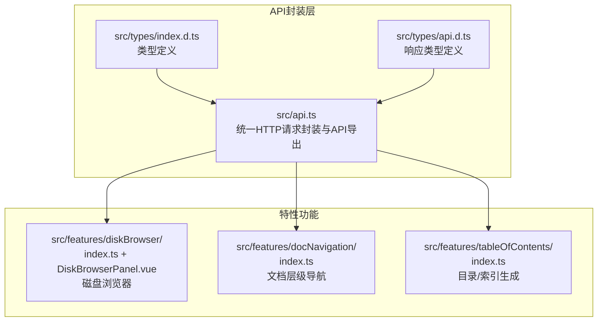
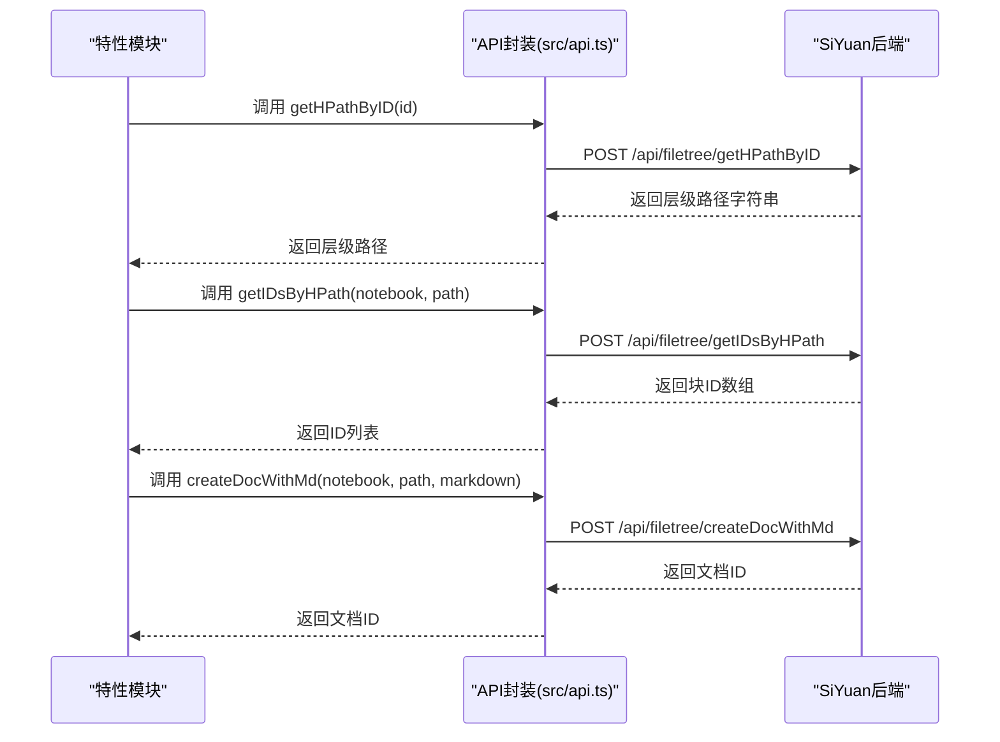
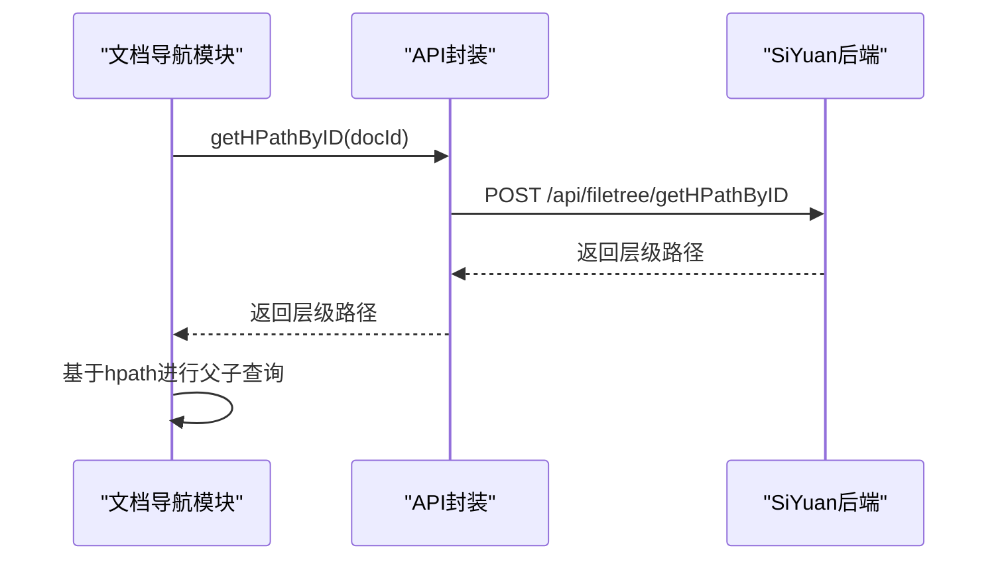
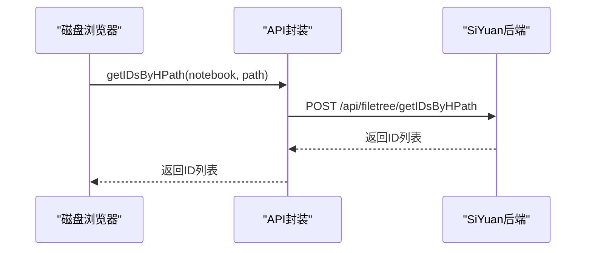
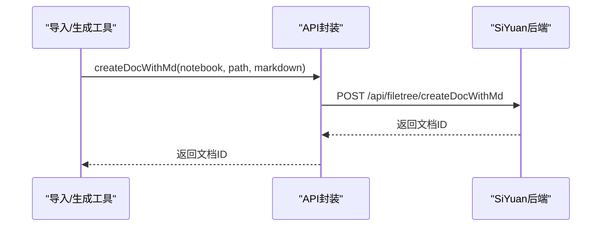
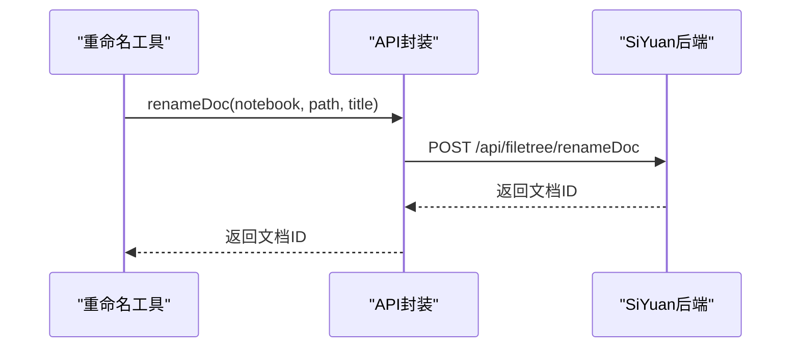
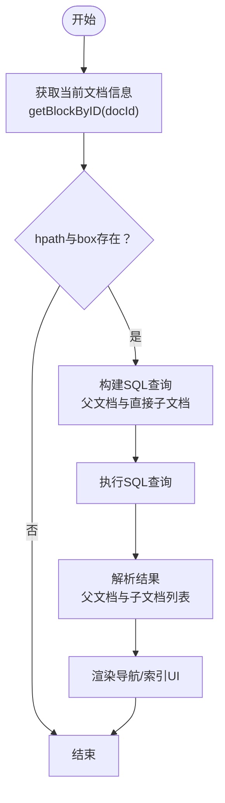
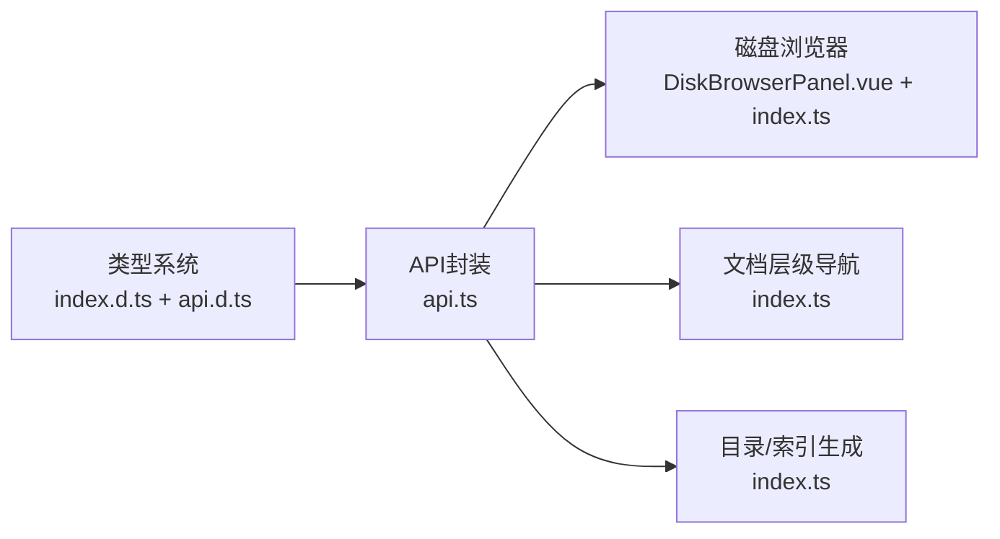

# 文件树操作API

<cite>
**本文引用的文件**
- [src/api.ts](file://src/api.ts)
- [src/types/index.d.ts](file://src/types/index.d.ts)
- [src/features/diskBrowser/DiskBrowserPanel.vue](file://src/features/diskBrowser/DiskBrowserPanel.vue)
- [src/features/diskBrowser/index.ts](file://src/features/diskBrowser/index.ts)
- [src/features/docNavigation/index.ts](file://src/features/docNavigation/index.ts)
- [src/features/tableOfContents/index.ts](file://src/features/tableOfContents/index.ts)
- [src/types/api.d.ts](file://src/types/api.d.ts)
</cite>

## 目录
1. [简介](#简介)
2. [项目结构](#项目结构)
3. [核心组件](#核心组件)
4. [架构总览](#架构总览)
5. [详细组件分析](#详细组件分析)
6. [依赖分析](#依赖分析)
7. [性能考量](#性能考量)
8. [故障排查指南](#故障排查指南)
9. [结论](#结论)
10. [附录](#附录)

## 简介
本指南聚焦于SiYuan插件中的文件树操作API，围绕以下关键方法进行深入解析：
- getHPathByID：通过块ID获取文档层级路径（human-readable path）。
- getIDsByHPath：根据层级路径反向解析出对应的块ID列表。
- createDocWithMd：在指定笔记本内按路径创建文档并写入Markdown内容。
- renameDoc：重命名文档标题（注意：参数与接口名称存在差异）。

同时，文档将说明：
- 路径参数的格式要求与特殊字符处理建议。
- 文件操作的原子性与并发访问下的锁机制现状与最佳实践。
- 结合getBlockByID的SQL查询实现，展示文件系统与块存储的关联关系。
- 在磁盘浏览器与文档导航功能中的实际应用示例与调用流程。

## 项目结构
本项目采用特性驱动的组织方式，文件树API位于统一的API封装层，具体业务功能（如磁盘浏览器、文档导航）通过API层与SiYuan后端交互。

图表来源
- [src/api.ts](file://src/api.ts#L1-L160)
- [src/types/index.d.ts](file://src/types/index.d.ts#L1-L142)
- [src/types/api.d.ts](file://src/types/api.d.ts#L1-L65)
- [src/features/diskBrowser/index.ts](file://src/features/diskBrowser/index.ts#L1-L51)
- [src/features/diskBrowser/DiskBrowserPanel.vue](file://src/features/diskBrowser/DiskBrowserPanel.vue#L1-L120)
- [src/features/docNavigation/index.ts](file://src/features/docNavigation/index.ts#L1-L120)
- [src/features/tableOfContents/index.ts](file://src/features/tableOfContents/index.ts#L1-L120)

章节来源
- [src/api.ts](file://src/api.ts#L1-L160)
- [src/types/index.d.ts](file://src/types/index.d.ts#L1-L142)
- [src/types/api.d.ts](file://src/types/api.d.ts#L1-L65)
- [src/features/diskBrowser/index.ts](file://src/features/diskBrowser/index.ts#L1-L51)
- [src/features/diskBrowser/DiskBrowserPanel.vue](file://src/features/diskBrowser/DiskBrowserPanel.vue#L1-L120)
- [src/features/docNavigation/index.ts](file://src/features/docNavigation/index.ts#L1-L120)
- [src/features/tableOfContents/index.ts](file://src/features/tableOfContents/index.ts#L1-L120)

## 核心组件
- API封装层：集中提供HTTP请求封装与各API导出，统一错误处理与响应格式。
- 类型系统：明确文档ID、块ID、笔记本ID等核心类型，以及块对象字段与SQL查询结果类型。
- 特性模块：
  - 磁盘浏览器：基于Electron能力读取本地磁盘与目录，提供面包屑导航与路径复制。
  - 文档层级导航：利用hpath与SQL查询构建父子文档导航。
  - 目录/索引生成：基于hpath查询子文档并生成索引或大纲。

章节来源
- [src/api.ts](file://src/api.ts#L66-L160)
- [src/types/index.d.ts](file://src/types/index.d.ts#L1-L142)
- [src/features/diskBrowser/index.ts](file://src/features/diskBrowser/index.ts#L1-L51)
- [src/features/docNavigation/index.ts](file://src/features/docNavigation/index.ts#L1-L120)
- [src/features/tableOfContents/index.ts](file://src/features/tableOfContents/index.ts#L1-L120)

## 架构总览
文件树API通过统一的请求封装与后端接口通信，特性模块通过API层完成对SiYuan后端的读写操作。文档层级导航与目录生成模块直接使用SQL查询以高效获取hpath上下文。

图表来源
- [src/api.ts](file://src/api.ts#L118-L148)
- [src/api.ts](file://src/api.ts#L66-L93)

章节来源
- [src/api.ts](file://src/api.ts#L66-L160)

## 详细组件分析

### getHPathByID：通过块ID获取层级路径
- 功能概述：接收块ID，返回该块所在文档的层级路径字符串（人类可读）。
- 请求路径：/api/filetree/getHPathByID
- 参数与返回：
  - 参数：id（块ID）
  - 返回：层级路径字符串
- 典型应用场景：
  - 文档导航：当点击某块时，先通过getHPathByID获取hpath，再用于构建父子导航。
  - 日志与调试：定位块所属文档的完整路径。
- 实现要点：
  - 该方法由API封装层统一发起HTTP请求，并对响应进行标准化处理。
  - 与SQL查询结合：文档导航模块在需要时会使用hpath进行父子文档查询。

图表来源
- [src/api.ts](file://src/api.ts#L130-L136)
- [src/features/docNavigation/index.ts](file://src/features/docNavigation/index.ts#L140-L170)

章节来源
- [src/api.ts](file://src/api.ts#L130-L136)
- [src/features/docNavigation/index.ts](file://src/features/docNavigation/index.ts#L140-L170)

### getIDsByHPath：反向解析层级路径获取块ID列表
- 功能概述：给定笔记本ID与层级路径，返回对应块ID列表（通常为文档块ID）。
- 请求路径：/api/filetree/getIDsByHPath
- 参数与返回：
  - 参数：notebook（笔记本ID）、path（层级路径）
  - 返回：块ID数组
- 典型应用场景：
  - 批量操作：根据路径批量定位文档块。
  - 路径校验：确认路径是否存在且能映射到具体块。
- 实现要点：
  - API封装层负责构造请求体并统一处理响应。
  - 与磁盘浏览器：磁盘浏览器在用户选择路径时，可结合该方法进行路径有效性检查或后续操作。

图表来源
- [src/api.ts](file://src/api.ts#L138-L148)
- [src/features/diskBrowser/DiskBrowserPanel.vue](file://src/features/diskBrowser/DiskBrowserPanel.vue#L600-L660)

章节来源
- [src/api.ts](file://src/api.ts#L138-L148)
- [src/features/diskBrowser/DiskBrowserPanel.vue](file://src/features/diskBrowser/DiskBrowserPanel.vue#L600-L660)

### createDocWithMd：按路径创建文档并写入Markdown
- 功能概述：在指定笔记本内，按给定路径创建文档，并写入Markdown内容。
- 请求路径：/api/filetree/createDocWithMd
- 参数与返回：
  - 参数：notebook（笔记本ID）、path（层级路径）、markdown（Markdown内容）
  - 返回：文档ID
- 典型应用场景：
  - 自动化生成文档：根据模板路径批量创建文档。
  - 导入工具：将外部Markdown导入为SiYuan文档。
- 实现要点：
  - API封装层负责构造请求体并统一处理响应。
  - 路径格式要求：应遵循层级路径规范；特殊字符需按后端约定处理。

图表来源
- [src/api.ts](file://src/api.ts#L66-L79)

章节来源
- [src/api.ts](file://src/api.ts#L66-L79)

### renameDoc：重命名文档标题
- 功能概述：重命名文档标题（注意：参数与接口名称存在差异）。
- 请求路径：/api/filetree/renameDoc
- 参数与返回：
  - 参数：doc（笔记本ID）、path（层级路径）、title（新标题）
  - 返回：文档ID
- 典型应用场景：
  - 文档整理：批量重命名文档标题。
  - 同步工具：与外部系统同步时更新文档标题。
- 实现要点：
  - API封装层负责构造请求体并统一处理响应。
  - 路径格式要求：应遵循层级路径规范；特殊字符需按后端约定处理。

图表来源
- [src/api.ts](file://src/api.ts#L81-L93)

章节来源
- [src/api.ts](file://src/api.ts#L81-L93)

### 路径参数格式要求与特殊字符处理
- 层级路径格式：
  - 采用“/”分隔的层级结构，例如“笔记本/目录/子目录/文档”。
  - 路径应以笔记本ID或根节点开始，确保唯一性与可解析性。
- 特殊字符处理建议：
  - 避免使用保留字符或可能被转义的字符。
  - 如需包含空格或特殊字符，建议在上层逻辑中进行安全编码后再传入。
- 实际应用参考：
  - 文档导航模块在处理hpath时，使用“/”作为分隔符进行父子路径推导。
  - 目录/索引模块在生成引用时，使用hpath进行精确匹配与排序。

章节来源
- [src/features/docNavigation/index.ts](file://src/features/docNavigation/index.ts#L45-L89)
- [src/features/tableOfContents/index.ts](file://src/features/tableOfContents/index.ts#L240-L320)

### 文件操作的原子性与并发访问锁机制
- 原子性保证：
  - API封装层采用统一的请求封装函数，确保每个API调用在后端完成原子性处理。
  - 对于批量操作（如moveDocs），建议在前端进行幂等性控制，避免重复提交。
- 并发访问与锁机制：
  - 当前API封装未显式暴露锁机制；并发场景下建议：
    - 使用防抖/节流策略减少高频请求。
    - 对同一路径或文档ID的操作进行队列化处理。
    - 在业务层引入幂等键（如请求ID）避免重复执行。
- 最佳实践：
  - 对重要操作（创建、重命名、移动）增加前置校验（路径存在性、权限校验）。
  - 对批量操作进行分批处理，避免超时与阻塞。

章节来源
- [src/api.ts](file://src/api.ts#L1-L20)
- [src/features/docNavigation/index.ts](file://src/features/docNavigation/index.ts#L96-L120)

### 结合getBlockByID的SQL查询实现：文件系统与块存储关联
- 关联关系：
  - 块对象包含hpath字段，表示文档在文件树中的层级路径。
  - 通过hpath可进行父子文档查询，从而建立文件系统与块存储的映射。
- 查询模式：
  - 父文档查询：基于当前文档hpath截断最后一段得到父hpath，再按hpath精确匹配。
  - 子文档查询：使用hpath前缀匹配与层级限制，确保仅获取直接子文档。
- 实现参考：
  - 文档导航模块使用UNION一次性查询父与直接子文档，提升性能。
  - 目录/索引模块使用hpath前缀匹配获取直接子文档，并进一步查询标题块生成大纲。

图表来源
- [src/api.ts](file://src/api.ts#L316-L320)
- [src/features/docNavigation/index.ts](file://src/features/docNavigation/index.ts#L45-L89)
- [src/features/tableOfContents/index.ts](file://src/features/tableOfContents/index.ts#L240-L320)

章节来源
- [src/api.ts](file://src/api.ts#L316-L320)
- [src/features/docNavigation/index.ts](file://src/features/docNavigation/index.ts#L45-L89)
- [src/features/tableOfContents/index.ts](file://src/features/tableOfContents/index.ts#L240-L320)

## 依赖分析
- API封装层依赖：
  - fetchSyncPost：统一HTTP请求封装。
  - 类型系统：确保参数与返回值类型一致。
- 特性模块依赖：
  - 磁盘浏览器：依赖Electron能力读取本地磁盘与目录，同时复用API层进行路径有效性检查。
  - 文档层级导航：依赖SQL查询与hpath字段，构建父子导航。
  - 目录/索引生成：依赖SQL查询与hpath字段，生成索引与大纲。

图表来源
- [src/types/index.d.ts](file://src/types/index.d.ts#L1-L142)
- [src/types/api.d.ts](file://src/types/api.d.ts#L1-L65)
- [src/api.ts](file://src/api.ts#L1-L160)
- [src/features/diskBrowser/index.ts](file://src/features/diskBrowser/index.ts#L1-L51)
- [src/features/diskBrowser/DiskBrowserPanel.vue](file://src/features/diskBrowser/DiskBrowserPanel.vue#L1-L120)
- [src/features/docNavigation/index.ts](file://src/features/docNavigation/index.ts#L1-L120)
- [src/features/tableOfContents/index.ts](file://src/features/tableOfContents/index.ts#L1-L120)

章节来源
- [src/types/index.d.ts](file://src/types/index.d.ts#L1-L142)
- [src/types/api.d.ts](file://src/types/api.d.ts#L1-L65)
- [src/api.ts](file://src/api.ts#L1-L160)
- [src/features/diskBrowser/index.ts](file://src/features/diskBrowser/index.ts#L1-L51)
- [src/features/diskBrowser/DiskBrowserPanel.vue](file://src/features/diskBrowser/DiskBrowserPanel.vue#L1-L120)
- [src/features/docNavigation/index.ts](file://src/features/docNavigation/index.ts#L1-L120)
- [src/features/tableOfContents/index.ts](file://src/features/tableOfContents/index.ts#L1-L120)

## 性能考量
- SQL查询优化：
  - 使用UNION一次性查询父与直接子文档，减少往返次数。
  - 使用hpath前缀匹配与层级限制，避免全表扫描。
- 前端缓存：
  - 磁盘浏览器对磁盘列表与目录列表设置缓存，降低频繁请求带来的性能损耗。
- 防抖与节流：
  - 文档层级导航对UI更新进行防抖，避免短时间内多次触发。
- 批量操作：
  - 对批量移动/重命名等操作进行分批处理，避免超时与阻塞。

章节来源
- [src/features/docNavigation/index.ts](file://src/features/docNavigation/index.ts#L96-L120)
- [src/features/diskBrowser/DiskBrowserPanel.vue](file://src/features/diskBrowser/DiskBrowserPanel.vue#L210-L240)

## 故障排查指南
- 常见问题与定位：
  - 路径无效：使用getIDsByHPath进行路径有效性检查，确认返回ID列表非空。
  - 权限不足：确认笔记本ID与路径归属正确，必要时重新登录或切换笔记本。
  - 并发冲突：对同一文档ID的操作进行队列化，避免重复提交。
- 错误处理建议：
  - 统一捕获API调用异常，记录错误日志并提示用户。
  - 对关键操作增加重试机制（指数退避），避免瞬时网络波动导致失败。
- 调试技巧：
  - 使用getBlockByID获取当前文档的hpath与box，核对SQL查询条件。
  - 在磁盘浏览器中复制路径，确认路径格式符合预期。

章节来源
- [src/api.ts](file://src/api.ts#L1-L20)
- [src/features/diskBrowser/DiskBrowserPanel.vue](file://src/features/diskBrowser/DiskBrowserPanel.vue#L680-L720)
- [src/features/docNavigation/index.ts](file://src/features/docNavigation/index.ts#L114-L140)

## 结论
- getHPathByID与getIDsByHPath构成文件树导航的核心能力，前者用于从块ID定位层级路径，后者用于从层级路径反向解析块ID。
- createDocWithMd与renameDoc提供基础的文档创建与重命名能力，配合路径参数与特殊字符处理，可满足大多数自动化与导入场景。
- 文档层级导航与目录/索引生成模块展示了如何结合hpath与SQL查询，高效构建父子关系与索引结构。
- 在并发与原子性方面，建议在业务层引入幂等与队列化策略，确保操作稳定可靠。

## 附录
- API清单与调用路径：
  - getHPathByID：/api/filetree/getHPathByID
  - getIDsByHPath：/api/filetree/getIDsByHPath
  - createDocWithMd：/api/filetree/createDocWithMd
  - renameDoc：/api/filetree/renameDoc
- 类型定义参考：
  - 文档ID、块ID、笔记本ID等核心类型定义。
  - 块对象字段（含hpath、box等）与SQL查询结果类型。

章节来源
- [src/api.ts](file://src/api.ts#L66-L148)
- [src/types/index.d.ts](file://src/types/index.d.ts#L1-L142)
- [src/types/api.d.ts](file://src/types/api.d.ts#L1-L65)