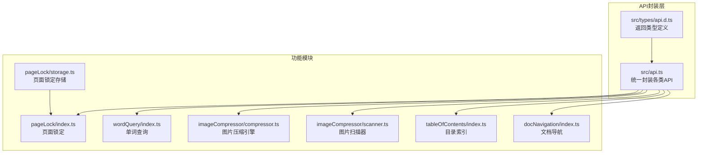
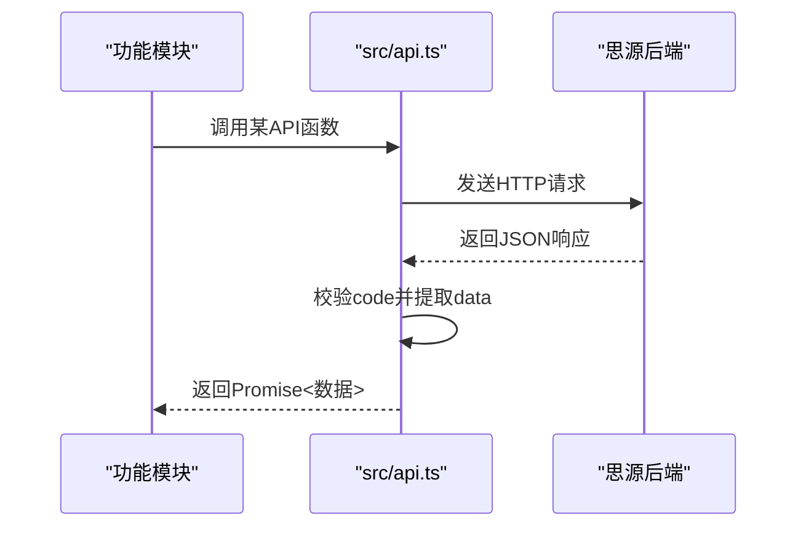
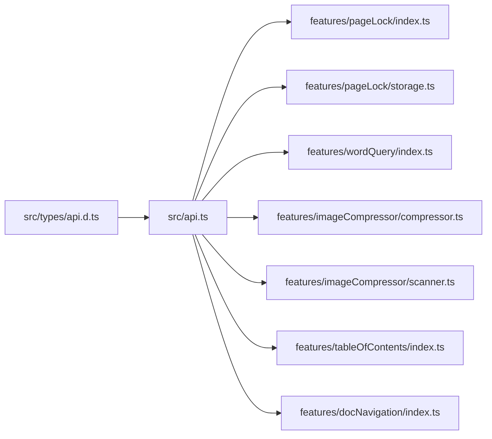

# 核心API

<cite>
**本文引用的文件**
- [api.ts](file://src/api.ts)
- [api.d.ts](file://src/types/api.d.ts)
- [index.ts](file://src/features/pageLock/index.ts)
- [storage.ts](file://src/features/pageLock/storage.ts)
- [index.ts](file://src/features/wordQuery/index.ts)
- [compressor.ts](file://src/features/imageCompressor/compressor.ts)
- [scanner.ts](file://src/features/imageCompressor/scanner.ts)
- [index.ts](file://src/features/tableOfContents/index.ts)
- [index.ts](file://src/features/docNavigation/index.ts)
</cite>

## 目录
1. [简介](#简介)
2. [项目结构与API组织](#项目结构与api组织)
3. [核心API总览](#核心api总览)
4. [架构概览](#架构概览)
5. [详细API分类与使用指南](#详细api分类与使用指南)
6. [依赖关系分析](#依赖关系分析)
7. [性能与异步处理策略](#性能与异步处理策略)
8. [调试与排错指南](#调试与排错指南)
9. [安全与合规建议](#安全与合规建议)
10. [结论](#结论)

## 简介
本指南围绕 src/api.ts 中封装的思源笔记核心API，系统讲解笔记本操作、文件树操作、属性操作、通知推送、系统信息等能力，并结合仓库中的实际功能模块（页面锁定、单词查询、图片压缩、目录索引、文档导航）演示如何在真实场景中调用这些API。文档还覆盖异步处理、错误处理、性能优化、调试技巧以及安全合规实践，帮助开发者快速、稳定地集成与扩展功能。

## 项目结构与API组织
- 核心API集中于 src/api.ts，提供对思源笔记后端接口的统一封装，统一返回结构与错误处理策略。
- 类型定义位于 src/types/api.d.ts，明确各API返回结构，便于在功能模块中进行类型约束与IDE提示。
- 功能模块通过 import 从 '@/api' 引入所需API，形成“类型定义 + API封装 + 功能实现”的清晰分层。

图表来源
- [api.ts](file://src/api.ts#L1-L496)
- [api.d.ts](file://src/types/api.d.ts#L1-L65)
- [index.ts](file://src/features/pageLock/index.ts#L1-L573)
- [storage.ts](file://src/features/pageLock/storage.ts#L1-L172)
- [index.ts](file://src/features/wordQuery/index.ts#L1-L573)
- [compressor.ts](file://src/features/imageCompressor/compressor.ts#L1-L227)
- [scanner.ts](file://src/features/imageCompressor/scanner.ts#L1-L228)
- [index.ts](file://src/features/tableOfContents/index.ts#L1-L410)
- [index.ts](file://src/features/docNavigation/index.ts#L1-L470)

章节来源
- [api.ts](file://src/api.ts#L1-L496)
- [api.d.ts](file://src/types/api.d.ts#L1-L65)

## 核心API总览
- 笔记本操作：列出、打开、关闭、重命名、创建、删除、获取/设置笔记本配置
- 文件树操作：创建文档、重命名文档、删除文档、移动文档、根据路径/ID获取人类可读路径、根据人类路径解析ID列表
- 资产文件：上传资源
- 块操作：插入、前置追加、更新、删除、移动、获取块Kramdown、获取子块、转移引用
- 属性操作：设置/获取块属性
- SQL查询：执行SQL、按ID查询块
- 模板：渲染模板、渲染Sprig
- 文件：获取/写入/删除文件、读取目录
- 导出：导出Markdown内容、导出资源
- 转换：Pandoc转换
- 通知：推送消息、推送错误消息
- 网络：转发代理
- 系统：启动进度、版本、当前时间

章节来源
- [api.ts](file://src/api.ts#L1-L496)

## 架构概览
API封装采用统一的 request 函数，内部通过 fetchSyncPost 或 fetch 发送请求，统一处理响应码与数据提取，保证各API返回一致性。功能模块通过 import '@/api' 使用这些封装函数，实现业务逻辑与底层API解耦。

图表来源
- [api.ts](file://src/api.ts#L1-L496)

## 详细API分类与使用指南

### 笔记本操作
- 列出笔记本：用于获取工作空间内的笔记本列表，常用于面板选择或批量处理。
- 打开/关闭笔记本：切换当前活动笔记本，影响后续文件树与块操作的作用域。
- 重命名/创建/删除笔记本：管理笔记本生命周期。
- 获取/设置笔记本配置：读取或调整笔记本的配置项，如同步策略、加密等。

使用示例（来自功能模块）
- 页面锁定：在切换文档时检查锁定状态，必要时通过打开笔记本确保文档可见性。
- 目录索引：在生成索引前，先获取当前文档的box与hpath，确保在正确的笔记本中查询。

章节来源
- [api.ts](file://src/api.ts#L19-L64)
- [index.ts](file://src/features/tableOfContents/index.ts#L232-L279)
- [index.ts](file://src/features/docNavigation/index.ts#L148-L164)

### 文件树操作
- 创建文档：在指定笔记本下创建Markdown文档。
- 重命名文档：修改文档标题与路径。
- 删除文档：移除文档。
- 移动文档：跨笔记本/路径批量移动。
- 路径解析：
  - 根据相对路径获取人类可读路径
  - 根据块ID获取人类可读路径
  - 根据人类可读路径解析出所有匹配的块ID列表

使用示例（来自功能模块）
- 目录索引：使用人类可读路径查询直接子文档，生成索引与引用。
- 文档导航：基于当前文档hpath推导父文档与直接子文档，一次性SQL查询提升性能。
- 图片扫描：遍历/data/assets目录，递归扫描图片文件，配合文件读取API获取文件信息。

章节来源
- [api.ts](file://src/api.ts#L66-L148)
- [index.ts](file://src/features/tableOfContents/index.ts#L247-L274)
- [index.ts](file://src/features/docNavigation/index.ts#L46-L94)
- [scanner.ts](file://src/features/imageCompressor/scanner.ts#L36-L109)

### 属性操作
- 设置块属性：为块写入自定义键值对，常用于标记块类型、状态、来源等。
- 获取块属性：读取块的自定义属性，用于条件判断与UI呈现。

使用示例（来自功能模块）
- 页面锁定：在锁定/解锁时，通过设置/清除自定义属性标记块的锁定状态，并在文档树中刷新图标。
- 目录索引：插入索引块后，为块设置自定义属性，便于后续识别与更新。

章节来源
- [api.ts](file://src/api.ts#L283-L305)
- [index.ts](file://src/features/pageLock/index.ts#L191-L209)
- [index.ts](file://src/features/pageLock/index.ts#L325-L333)
- [index.ts](file://src/features/tableOfContents/index.ts#L167-L185)

### 通知推送
- 推送消息：向用户展示普通提示，支持超时控制。
- 推送错误消息：向用户展示错误提示，支持超时控制。

使用示例（来自功能模块）
- 单词查询：在查询开始与结束时，使用消息推送反馈状态。
- 目录索引：在插入/更新失败或无内容时，使用消息推送提示用户。

章节来源
- [api.ts](file://src/api.ts#L438-L461)
- [index.ts](file://src/features/wordQuery/index.ts#L167-L193)
- [index.ts](file://src/features/tableOfContents/index.ts#L132-L191)

### 系统信息
- 版本：获取思源版本号，可用于兼容性判断与功能开关。
- 当前时间：获取服务器时间戳，用于日志、统计与定时任务。

使用示例（来自功能模块）
- 图片压缩：在压缩流程前后记录时间，计算耗时与压缩率；在替换文件时记录时间戳。

章节来源
- [api.ts](file://src/api.ts#L483-L496)
- [compressor.ts](file://src/features/imageCompressor/compressor.ts#L22-L79)

### SQL与块查询
- SQL：执行任意查询语句，返回二维数组。
- 按ID查询块：通过SQL封装便捷获取块信息。

使用示例（来自功能模块）
- 目录索引：使用SQL查询子文档、标题块，以及带自定义属性的块，实现索引生成与更新。
- 文档导航：使用UNION一次性查询父文档与直接子文档，减少往返次数。

章节来源
- [api.ts](file://src/api.ts#L307-L321)
- [index.ts](file://src/features/tableOfContents/index.ts#L201-L217)
- [index.ts](file://src/features/tableOfContents/index.ts#L247-L274)
- [index.ts](file://src/features/tableOfContents/index.ts#L354-L401)
- [index.ts](file://src/features/docNavigation/index.ts#L46-L94)

### 文件与资产
- 文件读取：获取二进制文件内容，返回Blob，适合图片、PDF等。
- 文件写入：替换或新增文件，支持设置修改时间。
- 文件删除：移除文件。
- 目录读取：遍历目录结构，支持递归扫描。
- 资产上传：批量上传文件至资产目录。

使用示例（来自功能模块）
- 图片压缩：读取原始图片Blob，压缩后通过写入API替换原文件；扫描器读取目录并批量获取图片详情。
- 单词查询：使用fetch调用外部大模型API（非src/api.ts），但展示了消息推送与错误处理模式。

章节来源
- [api.ts](file://src/api.ts#L341-L401)
- [compressor.ts](file://src/features/imageCompressor/compressor.ts#L22-L79)
- [compressor.ts](file://src/features/imageCompressor/compressor.ts#L110-L163)
- [scanner.ts](file://src/features/imageCompressor/scanner.ts#L36-L109)
- [scanner.ts](file://src/features/imageCompressor/scanner.ts#L111-L178)

### 块操作
- 插入/前置追加/更新/删除/移动：对块进行增删改查与位置调整。
- 获取块Kramdown：获取块的Kramdown内容，便于对比与更新。
- 获取子块：获取块的直接子块列表。
- 转移引用：将引用从一个块转移到另一个块。

使用示例（来自功能模块）
- 目录索引：在光标位置插入索引块，并更新已有块内容；为新块设置自定义属性。

章节来源
- [api.ts](file://src/api.ts#L166-L282)
- [index.ts](file://src/features/tableOfContents/index.ts#L132-L191)

### 网络与模板
- 转发代理：对外部网络请求进行转发，支持超时、头与负载。
- 模板渲染：渲染文档模板与Sprig表达式。

使用示例（来自功能模块）
- 单词查询：调用外部大模型API（非src/api.ts），但展示了消息推送与错误处理模式。

章节来源
- [api.ts](file://src/api.ts#L462-L482)
- [index.ts](file://src/features/wordQuery/index.ts#L330-L558)

## 依赖关系分析

图表来源
- [api.ts](file://src/api.ts#L1-L496)
- [api.d.ts](file://src/types/api.d.ts#L1-L65)
- [index.ts](file://src/features/pageLock/index.ts#L1-L573)
- [storage.ts](file://src/features/pageLock/storage.ts#L1-L172)
- [index.ts](file://src/features/wordQuery/index.ts#L1-L573)
- [compressor.ts](file://src/features/imageCompressor/compressor.ts#L1-L227)
- [scanner.ts](file://src/features/imageCompressor/scanner.ts#L1-L228)
- [index.ts](file://src/features/tableOfContents/index.ts#L1-L410)
- [index.ts](file://src/features/docNavigation/index.ts#L1-L470)

章节来源
- [api.ts](file://src/api.ts#L1-L496)
- [index.ts](file://src/features/pageLock/index.ts#L1-L573)
- [index.ts](file://src/features/tableOfContents/index.ts#L1-L410)
- [index.ts](file://src/features/docNavigation/index.ts#L1-L470)
- [compressor.ts](file://src/features/imageCompressor/compressor.ts#L1-L227)
- [scanner.ts](file://src/features/imageCompressor/scanner.ts#L1-L228)
- [index.ts](file://src/features/wordQuery/index.ts#L1-L573)

## 性能与异步处理策略

- 统一请求封装
  - request 函数统一处理响应码与数据提取，避免各模块重复判断。
  - 对于二进制文件读取，直接使用 fetch 并返回 Blob，避免 JSON 解析带来的额外开销。

- 防抖与去重
  - 文档导航模块对更新逻辑进行防抖，降低频繁触发导致的性能损耗。
  - 使用 Set 记录已处理文档，避免重复渲染。

- 一次性查询
  - 文档导航模块使用 UNION 一次性查询父文档与直接子文档，减少往返次数。
  - 目录索引模块通过JOIN attributes表一次性查询带自定义属性的块，避免多次API调用。

- 进度回调
  - 图片扫描与压缩模块提供进度回调，便于UI实时反馈，避免长时间阻塞。

- 错误处理
  - API封装层在请求失败时返回空值或抛出异常，调用方需进行空值检查与错误提示。
  - 功能模块普遍采用 try/catch + showMessage 的模式，确保用户体验与可观测性。

章节来源
- [api.ts](file://src/api.ts#L1-L496)
- [index.ts](file://src/features/docNavigation/index.ts#L96-L113)
- [index.ts](file://src/features/docNavigation/index.ts#L114-L134)
- [index.ts](file://src/features/docNavigation/index.ts#L46-L94)
- [index.ts](file://src/features/tableOfContents/index.ts#L201-L217)
- [compressor.ts](file://src/features/imageCompressor/compressor.ts#L80-L105)
- [scanner.ts](file://src/features/imageCompressor/scanner.ts#L36-L109)

## 调试与排错指南

- 日志与错误提示
  - API封装层在 getFile 等二进制读取场景打印错误与状态，便于定位HTTP错误与异常。
  - 功能模块广泛使用 showMessage 展示用户可感知的错误信息，建议保留或复用。

- 常见问题与对策
  - 无法获取文件数据：检查路径是否正确、是否为二进制文件、是否具有权限。
  - SQL查询失败：注意转义单引号，避免注入；确认当前文档的box与hpath有效。
  - API返回空值：在调用方进行空值检查，必要时回退到其他方案或提示用户。
  - 性能问题：合并查询、使用防抖、限制并发、提供进度回调。

- 常用调试步骤
  - 在浏览器开发者工具 Network 面板观察API请求与响应。
  - 在 Console 面板查看 API封装层的日志输出。
  - 在功能模块中增加本地日志，定位具体调用链路。

章节来源
- [api.ts](file://src/api.ts#L341-L372)
- [index.ts](file://src/features/tableOfContents/index.ts#L132-L191)
- [index.ts](file://src/features/docNavigation/index.ts#L286-L290)

## 安全与合规建议

- 数据最小化
  - 仅在必要时读取与写入文件，避免暴露敏感路径。
  - 对用户输入进行校验与转义，防止SQL注入与XSS。

- 权限与隔离
  - 严格区分笔记本作用域，避免跨笔记本操作。
  - 对外部网络请求使用转发代理，避免泄露内部网络信息。

- 用户隐私
  - 避免在日志中记录敏感信息（如API密钥、用户密码）。
  - 对外部API调用的凭据进行安全存储与传输。

- 合规性
  - 遵循思源笔记的插件规范与API使用约定，避免滥用权限。
  - 在涉及用户数据的操作中，提供明确的用户授权与撤销机制。

[本节为通用指导，不直接分析具体代码文件]

## 结论
通过对 src/api.ts 的系统梳理与功能模块的实际应用案例分析，可以发现该API封装具备良好的一致性、可维护性与扩展性。结合仓库中的页面锁定、单词查询、图片压缩、目录索引与文档导航等模块，读者可以在实际开发中高效、安全地使用这些API，构建稳定可靠的插件功能。建议在新功能开发中遵循本文的异步处理、错误处理、性能优化与安全合规建议，持续提升用户体验与系统稳定性。