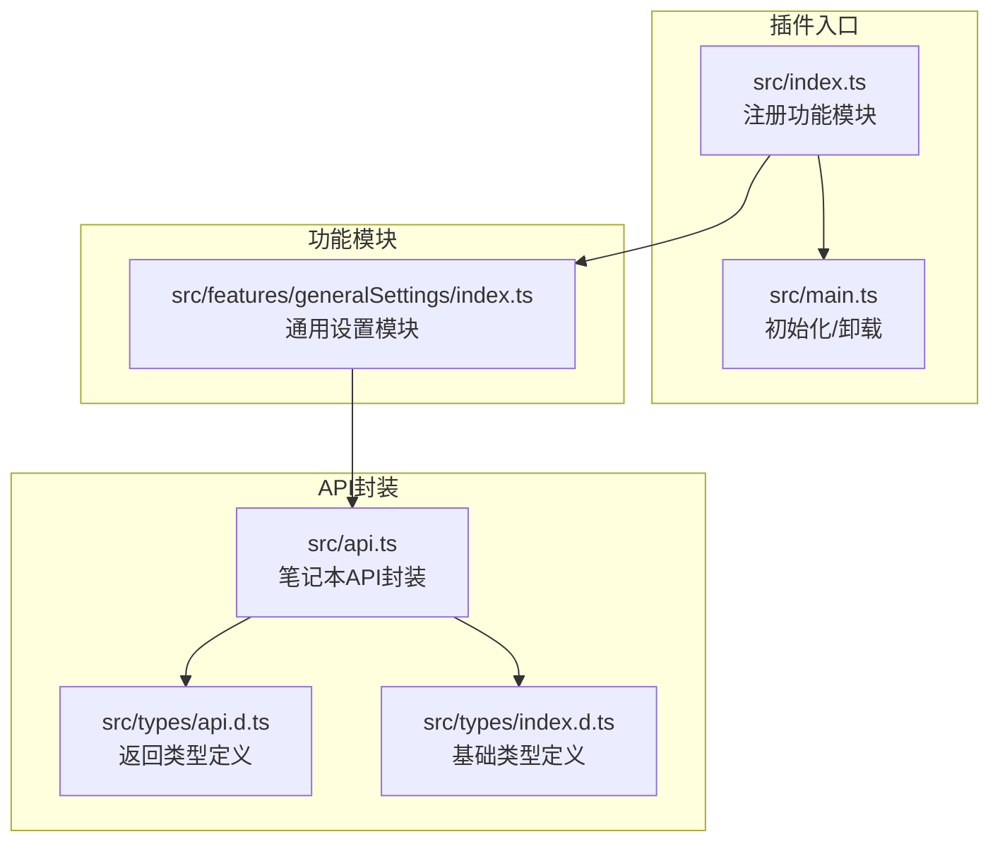
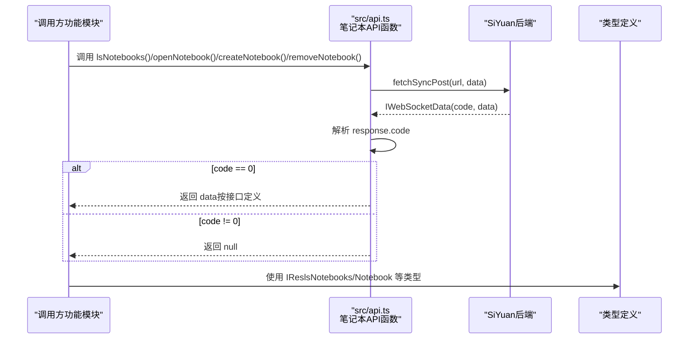
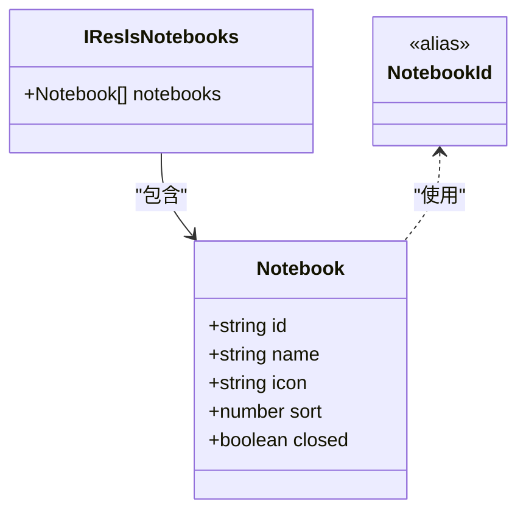
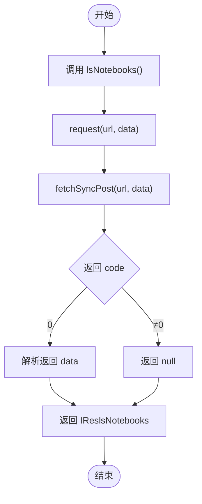
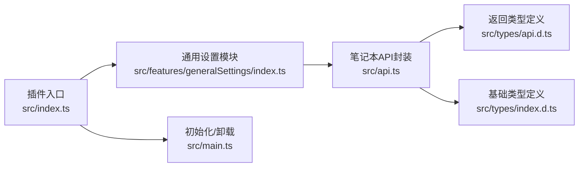

# 笔记本操作API

<cite>
**本文引用的文件**
- [src/api.ts](file://src/api.ts)
- [src/types/api.d.ts](file://src/types/api.d.ts)
- [src/types/index.d.ts](file://src/types/index.d.ts)
- [src/features/generalSettings/index.ts](file://src/features/generalSettings/index.ts)
- [src/index.ts](file://src/index.ts)
- [src/main.ts](file://src/main.ts)
</cite>

## 目录
1. [简介](#简介)
2. [项目结构](#项目结构)
3. [核心组件](#核心组件)
4. [架构总览](#架构总览)
5. [详细组件分析](#详细组件分析)
6. [依赖分析](#依赖分析)
7. [性能考虑](#性能考虑)
8. [故障排查指南](#故障排查指南)
9. [结论](#结论)
10. [附录](#附录)

## 简介
本文件面向SiYuan笔记插件开发者，系统化梳理笔记本管理相关API，重点覆盖以下函数：
- lsNotebooks：列出笔记本
- openNotebook：打开指定笔记本
- createNotebook：创建笔记本
- removeNotebook：删除笔记本

文档将从接口定义、参数与返回值、调用场景、错误处理、异步与Promise链式调用最佳实践等方面进行深入说明，并结合仓库中的类型定义与现有功能模块，给出在插件中调用这些API的实际参考路径。

## 项目结构
围绕笔记本API的关键文件组织如下：
- API封装层：src/api.ts
- 类型定义：src/types/api.d.ts、src/types/index.d.ts
- 插件入口与功能注册：src/index.ts、src/main.ts
- 示例功能模块（通用设置）：src/features/generalSettings/index.ts

图表来源
- [src/index.ts](file://src/index.ts#L1-L140)
- [src/main.ts](file://src/main.ts#L1-L45)
- [src/api.ts](file://src/api.ts#L1-L120)
- [src/types/api.d.ts](file://src/types/api.d.ts#L1-L65)
- [src/types/index.d.ts](file://src/types/index.d.ts#L1-L142)
- [src/features/generalSettings/index.ts](file://src/features/generalSettings/index.ts#L1-L120)

章节来源
- [src/index.ts](file://src/index.ts#L1-L140)
- [src/main.ts](file://src/main.ts#L1-L45)
- [src/api.ts](file://src/api.ts#L1-L120)
- [src/types/api.d.ts](file://src/types/api.d.ts#L1-L65)
- [src/types/index.d.ts](file://src/types/index.d.ts#L1-L142)
- [src/features/generalSettings/index.ts](file://src/features/generalSettings/index.ts#L1-L120)

## 核心组件
- 笔记本API封装：位于src/api.ts，提供lsNotebooks、openNotebook、createNotebook、removeNotebook等方法，统一通过内部request函数发起请求并处理返回。
- 返回类型定义：位于src/types/api.d.ts，包含IReslsNotebooks等接口，明确lsNotebooks返回结构。
- 基础类型定义：位于src/types/index.d.ts，包含Notebook、NotebookId等类型，支撑API签名。
- 插件入口与功能注册：src/index.ts负责加载配置、注册功能模块；src/main.ts负责挂载Vue应用。
- 示例调用位置：通用设置模块在插件生命周期中可作为调用笔记本API的参考位置（例如监听工作区事件时可能需要读取笔记本列表）。

章节来源
- [src/api.ts](file://src/api.ts#L1-L120)
- [src/types/api.d.ts](file://src/types/api.d.ts#L1-L65)
- [src/types/index.d.ts](file://src/types/index.d.ts#L1-L142)
- [src/index.ts](file://src/index.ts#L1-L140)
- [src/main.ts](file://src/main.ts#L1-L45)

## 架构总览
笔记本API的调用链路如下：
- 插件功能模块（如通用设置）通过导入src/api.ts中的笔记本API函数进行调用。
- API函数内部通过request(url, data)封装，使用SiYuan提供的fetchSyncPost进行同步请求。
- request对服务端返回的IWebSocketData进行解析，仅当code为0时返回data，否则返回null。
- 返回值类型由src/types/api.d.ts与src/types/index.d.ts定义。

图表来源
- [src/api.ts](file://src/api.ts#L1-L120)
- [src/types/api.d.ts](file://src/types/api.d.ts#L1-L65)
- [src/types/index.d.ts](file://src/types/index.d.ts#L1-L142)

## 详细组件分析

### lsNotebooks：获取笔记本列表
- 函数签名与行为
  - 函数：lsNotebooks()
  - 返回：Promise<IReslsNotebooks>
  - 请求路径：/api/notebook/lsNotebooks
  - 参数：无
- 返回值结构（IReslsNotebooks）
  - notebooks: Notebook[]，数组元素包含id、name、icon、sort、closed等字段
- 调用场景
  - 在通用设置模块初始化或刷新时，读取笔记本列表以构建UI或进行后续操作
  - 在插件侧需要根据笔记本状态进行条件判断时使用
- 实际调用参考路径
  - 可在通用设置模块的初始化流程中调用，参考：[src/features/generalSettings/index.ts](file://src/features/generalSettings/index.ts#L1-L120)
- 异步与Promise链式调用建议
  - 使用await等待结果；若需要链式处理，可在then中继续处理返回的Notebook[]，注意对null的兜底
- 错误处理
  - 当后端返回非0 code时，request返回null；调用方应判空并进行相应提示或重试

章节来源
- [src/api.ts](file://src/api.ts#L1-L120)
- [src/types/api.d.ts](file://src/types/api.d.ts#L1-L65)
- [src/types/index.d.ts](file://src/types/index.d.ts#L1-L142)
- [src/features/generalSettings/index.ts](file://src/features/generalSettings/index.ts#L1-L120)

### openNotebook：打开指定笔记本
- 函数签名与行为
  - 函数：openNotebook(notebook: NotebookId)
  - 返回：Promise<IResOpenNotebook | null>
  - 请求路径：/api/notebook/openNotebook
  - 参数：{ notebook: NotebookId }
- 调用场景
  - 用户选择某个笔记本后，调用该API打开对应笔记本
  - 与lsNotebooks配合，先获取列表再打开目标笔记本
- 实际调用参考路径
  - 可在通用设置模块的交互逻辑中调用，参考：[src/features/generalSettings/index.ts](file://src/features/generalSettings/index.ts#L1-L120)
- 异步与Promise链式调用建议
  - 使用await等待打开结果；若需链式处理，可在then中继续执行后续逻辑
- 错误处理
  - 后端返回非0 code时，request返回null；调用方可记录日志并提示用户

章节来源
- [src/api.ts](file://src/api.ts#L1-L120)
- [src/types/index.d.ts](file://src/types/index.d.ts#L1-L142)
- [src/features/generalSettings/index.ts](file://src/features/generalSettings/index.ts#L1-L120)

### createNotebook：创建笔记本
- 函数签名与行为
  - 函数：createNotebook(name: string)
  - 返回：Promise<Notebook>
  - 请求路径：/api/notebook/createNotebook
  - 参数：{ name: string }
- 调用场景
  - 用户在插件界面输入笔记本名称后触发创建
  - 与lsNotebooks配合，创建完成后刷新列表
- 实际调用参考路径
  - 可在通用设置模块的交互逻辑中调用，参考：[src/features/generalSettings/index.ts](file://src/features/generalSettings/index.ts#L1-L120)
- 异步与Promise链式调用建议
  - 使用await等待创建结果；then中可继续刷新UI或执行下一步逻辑
- 错误处理
  - 后端返回非0 code时，request返回null；调用方可记录日志并提示用户

章节来源
- [src/api.ts](file://src/api.ts#L1-L120)
- [src/types/index.d.ts](file://src/types/index.d.ts#L1-L142)
- [src/features/generalSettings/index.ts](file://src/features/generalSettings/index.ts#L1-L120)

### removeNotebook：删除笔记本
- 函数签名与行为
  - 函数：removeNotebook(notebook: NotebookId)
  - 返回：Promise<IResRemoveNotebook | null>
  - 请求路径：/api/notebook/removeNotebook
  - 参数：{ notebook: NotebookId }
- 调用场景
  - 用户确认删除某个笔记本后触发删除
  - 删除前建议二次确认，避免误删
- 实际调用参考路径
  - 可在通用设置模块的交互逻辑中调用，参考：[src/features/generalSettings/index.ts](file://src/features/generalSettings/index.ts#L1-L120)
- 异步与Promise链式调用建议
  - 使用await等待删除结果；then中可刷新列表或提示用户
- 错误处理
  - 后端返回非0 code时，request返回null；调用方可记录日志并提示用户

章节来源
- [src/api.ts](file://src/api.ts#L1-L120)
- [src/types/index.d.ts](file://src/types/index.d.ts#L1-L142)
- [src/features/generalSettings/index.ts](file://src/features/generalSettings/index.ts#L1-L120)

### 数据模型与类型关系
- Notebook类型
  - 字段：id、name、icon、sort、closed
- IReslsNotebooks
  - 字段：notebooks: Notebook[]
- NotebookId
  - 类型别名：string

图表来源
- [src/types/index.d.ts](file://src/types/index.d.ts#L1-L142)
- [src/types/api.d.ts](file://src/types/api.d.ts#L1-L65)

章节来源
- [src/types/index.d.ts](file://src/types/index.d.ts#L1-L142)
- [src/types/api.d.ts](file://src/types/api.d.ts#L1-L65)

### API调用流程图（以lsNotebooks为例）

图表来源
- [src/api.ts](file://src/api.ts#L1-L120)
- [src/types/api.d.ts](file://src/types/api.d.ts#L1-L65)

## 依赖分析
- 模块耦合
  - 功能模块（如通用设置）依赖src/api.ts中的笔记本API函数
  - API函数依赖src/types/api.d.ts与src/types/index.d.ts中的类型定义
  - 插件入口src/index.ts负责注册功能模块，通用设置模块在插件生命周期中被调用
- 外部依赖
  - 使用SiYuan提供的fetchSyncPost进行请求
  - 返回类型IWebSocketData由框架提供

图表来源
- [src/features/generalSettings/index.ts](file://src/features/generalSettings/index.ts#L1-L120)
- [src/api.ts](file://src/api.ts#L1-L120)
- [src/types/api.d.ts](file://src/types/api.d.ts#L1-L65)
- [src/types/index.d.ts](file://src/types/index.d.ts#L1-L142)
- [src/index.ts](file://src/index.ts#L1-L140)
- [src/main.ts](file://src/main.ts#L1-L45)

章节来源
- [src/features/generalSettings/index.ts](file://src/features/generalSettings/index.ts#L1-L120)
- [src/api.ts](file://src/api.ts#L1-L120)
- [src/types/api.d.ts](file://src/types/api.d.ts#L1-L65)
- [src/types/index.d.ts](file://src/types/index.d.ts#L1-L142)
- [src/index.ts](file://src/index.ts#L1-L140)
- [src/main.ts](file://src/main.ts#L1-L45)

## 性能考虑
- 并发控制：批量操作（如多次打开/关闭笔记本）建议串行或节流，避免频繁切换导致UI卡顿
- 缓存策略：对笔记本列表可做短期缓存，减少重复请求
- UI反馈：在异步请求期间显示加载状态，请求结束后根据返回结果更新UI
- 错误重试：对于网络波动导致的失败，可在上层增加有限次重试

## 故障排查指南
- 网络异常
  - 现象：请求超时或连接失败
  - 排查：检查网络连通性；确认SiYuan服务正常运行
- 权限不足
  - 现象：后端返回非0 code，request返回null
  - 排查：确认插件具备相应权限；检查笔记本访问策略
- 参数错误
  - 现象：入参格式不正确导致后端拒绝
  - 排查：核对NotebookId格式；确保传入的name符合要求
- 异步处理不当
  - 现象：未await导致UI未更新
  - 排查：确保在异步函数中使用await；必要时使用Promise链式调用并在then中处理结果

章节来源
- [src/api.ts](file://src/api.ts#L1-L120)

## 结论
本文件基于仓库现有实现，系统化梳理了笔记本管理API的接口定义、参数与返回值、调用场景与错误处理，并给出了在插件中调用这些API的参考路径。建议在实际开发中：
- 严格遵循类型定义，确保参数与返回值的正确性
- 在调用前进行必要的参数校验与权限检查
- 使用await或Promise链式调用保证异步流程可控
- 对网络异常与权限问题做好兜底与用户提示

## 附录
- 插件入口与功能注册参考
  - [src/index.ts](file://src/index.ts#L1-L140)
  - [src/main.ts](file://src/main.ts#L1-L45)
- 通用设置模块参考
  - [src/features/generalSettings/index.ts](file://src/features/generalSettings/index.ts#L1-L120)