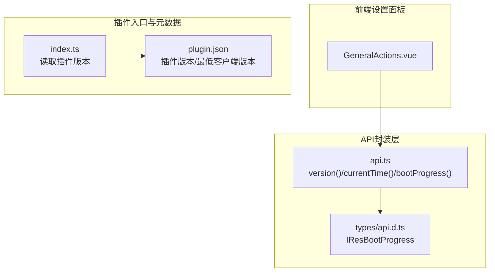
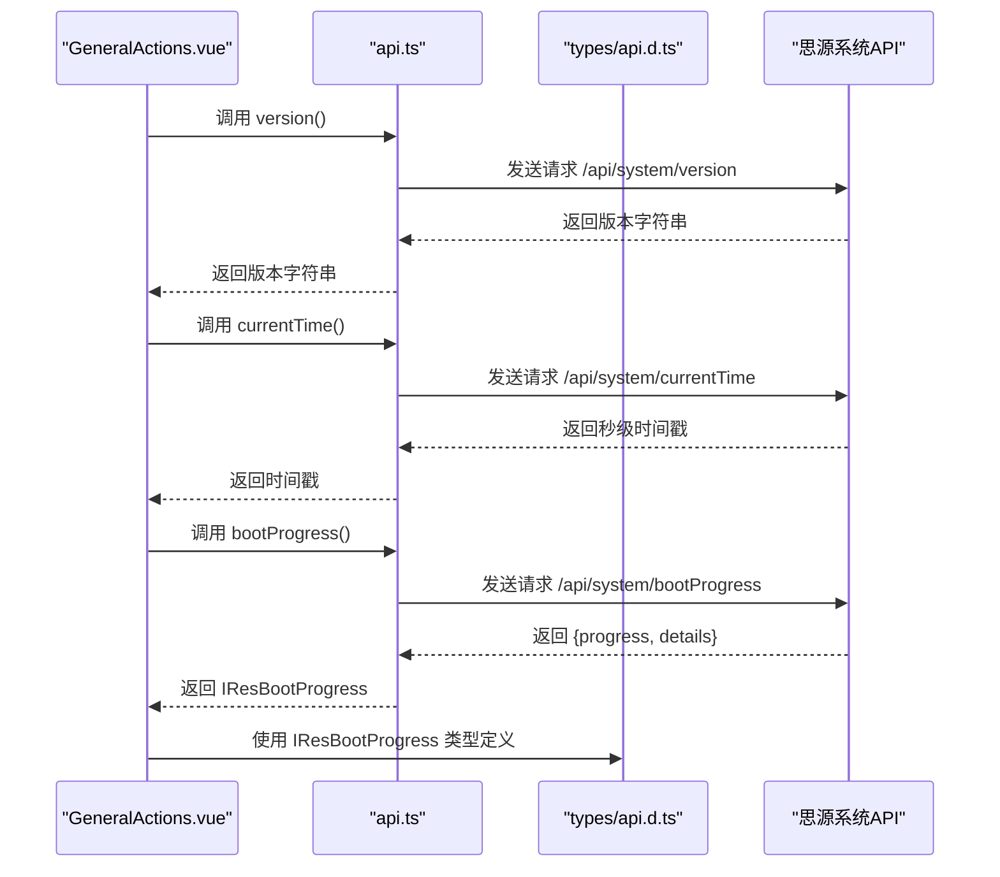
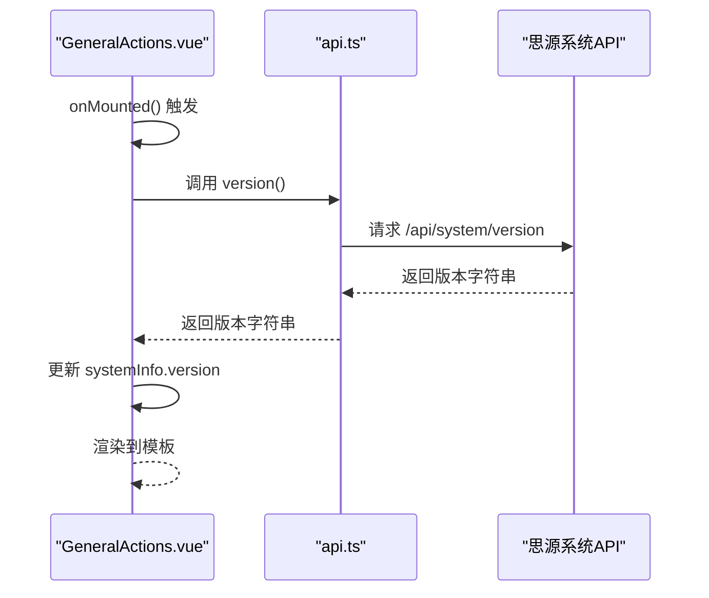
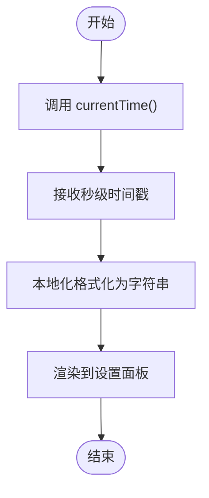
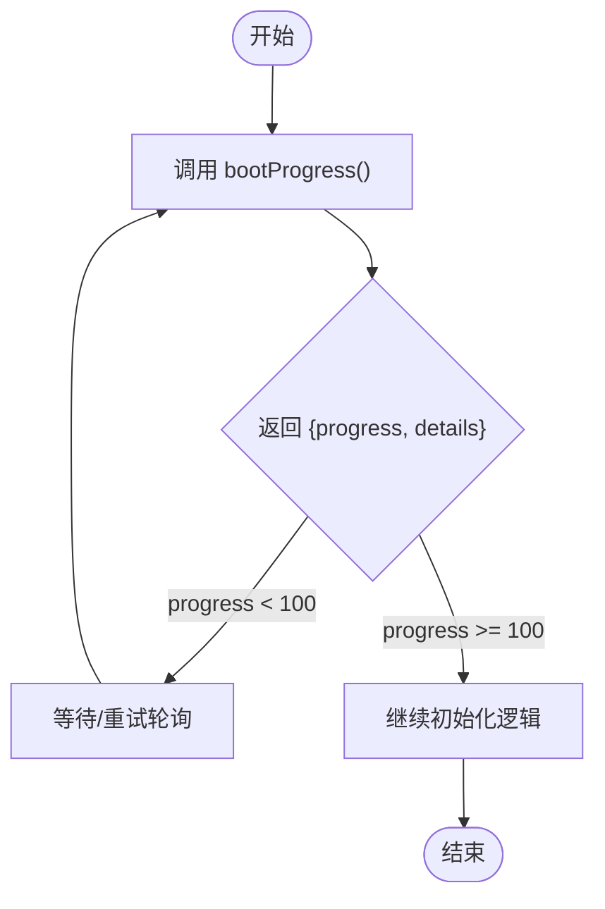
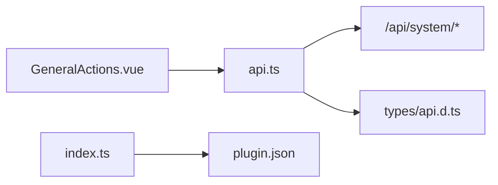

# 系统信息API

<cite>
**本文引用的文件**
- [src/api.ts](file://src/api.ts)
- [src/features/generalSettings/components/GeneralActions.vue](file://src/features/generalSettings/components/GeneralActions.vue)
- [src/types/api.d.ts](file://src/types/api.d.ts)
- [src/index.ts](file://src/index.ts)
- [plugin.json](file://plugin.json)
- [README.md](file://README.md)
</cite>

## 目录
1. [简介](#简介)
2. [项目结构](#项目结构)
3. [核心组件](#核心组件)
4. [架构总览](#架构总览)
5. [详细组件分析](#详细组件分析)
6. [依赖分析](#依赖分析)
7. [性能考虑](#性能考虑)
8. [故障排查指南](#故障排查指南)
9. [结论](#结论)

## 简介
本文件聚焦于系统级API参考，围绕以下三个接口进行系统化说明：
- version：返回思源笔记客户端版本号，用于插件兼容性检查与通用设置中的系统信息展示。
- currentTime：返回服务器侧时间戳（秒），适用于日志记录与时间敏感操作。
- bootProgress：返回系统启动进度与阶段详情，可用于插件初始化时机判断。

同时，本文提供在 GeneralActions.vue 中调用 version 接口并在设置面板中集成系统信息的实践示例与流程图解。

## 项目结构
该仓库采用模块化组织，系统API封装在统一的 API 层，前端设置面板组件负责调用与展示。关键位置如下：
- API 封装层：src/api.ts 提供 version、currentTime、bootProgress 等系统接口的封装。
- 类型定义：src/types/api.d.ts 定义了 bootProgress 返回类型 IResBootProgress。
- 设置面板组件：src/features/generalSettings/components/GeneralActions.vue 调用 version 并渲染系统信息。
- 插件入口：src/index.ts 读取 plugin.json 中的版本信息，作为插件自身版本来源之一。
- 插件元数据：plugin.json 描述插件版本与最低客户端版本等信息。

图表来源
- [src/features/generalSettings/components/GeneralActions.vue](file://src/features/generalSettings/components/GeneralActions.vue#L93-L114)
- [src/api.ts](file://src/api.ts#L483-L495)
- [src/types/api.d.ts](file://src/types/api.d.ts#L48-L51)
- [src/index.ts](file://src/index.ts#L11-L35)
- [plugin.json](file://plugin.json#L1-L34)

章节来源
- [src/api.ts](file://src/api.ts#L483-L495)
- [src/types/api.d.ts](file://src/types/api.d.ts#L48-L51)
- [src/features/generalSettings/components/GeneralActions.vue](file://src/features/generalSettings/components/GeneralActions.vue#L93-L114)
- [src/index.ts](file://src/index.ts#L11-L35)
- [plugin.json](file://plugin.json#L1-L34)

## 核心组件
本节对三个系统API进行逐项说明，包括返回值结构、精度与时区处理、典型使用场景与注意事项。

- version
  - 作用：返回当前思源笔记客户端的版本字符串，便于插件进行兼容性检查与在通用设置中显示系统信息。
  - 返回类型：string
  - 典型用途：在设置面板中展示“版本”字段；结合插件自身的版本（来自 plugin.json）进行对比，判断是否需要提示升级或降级兼容策略。
  - 调用示例路径：[调用位置](file://src/features/generalSettings/components/GeneralActions.vue#L99-L114)

- currentTime
  - 作用：返回服务器侧时间戳（秒），可用于日志记录、时间敏感操作的时间锚点。
  - 返回类型：number（秒）
  - 精度与时区：返回值为秒级 Unix 时间戳；前端展示时通常通过本地化格式化显示，具体时区遵循浏览器环境。
  - 注意事项：若需跨端一致的时间基准，建议统一使用 UTC 秒级时间戳并在展示时按需转换。

- bootProgress
  - 作用：返回系统启动进度与阶段详情，可用于插件在不同启动阶段执行初始化逻辑。
  - 返回类型：IResBootProgress
  - 结构字段：
    - progress：number，范围通常为 0~100，表示启动进度百分比。
    - details：string，描述当前启动阶段的文本说明。
  - 典型用途：在插件初始化时轮询或监听该接口，当 progress 达到特定阈值或出现目标阶段时再执行依赖系统完全就绪的功能。

章节来源
- [src/api.ts](file://src/api.ts#L483-L495)
- [src/types/api.d.ts](file://src/types/api.d.ts#L48-L51)
- [src/features/generalSettings/components/GeneralActions.vue](file://src/features/generalSettings/components/GeneralActions.vue#L99-L114)

## 架构总览
下图展示了从设置面板到系统API的调用链路，以及与类型定义的关系。

图表来源
- [src/features/generalSettings/components/GeneralActions.vue](file://src/features/generalSettings/components/GeneralActions.vue#L99-L114)
- [src/api.ts](file://src/api.ts#L483-L495)
- [src/types/api.d.ts](file://src/types/api.d.ts#L48-L51)

## 详细组件分析

### version 接口
- 调用位置与流程
  - 在 GeneralActions.vue 中，组件挂载后异步加载系统信息，其中包含 version 的调用。
  - 调用路径：[加载系统信息函数](file://src/features/generalSettings/components/GeneralActions.vue#L99-L114)
  - 实际封装：[version 封装](file://src/api.ts#L489-L491)
- 在设置面板中的展示
  - 模板中通过 systemInfo.version 渲染版本号，便于用户在通用设置中查看。
  - 展示位置：[系统信息区域](file://src/features/generalSettings/components/GeneralActions.vue#L43-L63)
- 与插件自身版本的配合
  - 插件自身版本来源于 plugin.json，可在设置面板中同时展示插件版本与客户端版本，辅助兼容性判断。
  - 插件版本读取：[插件入口读取版本](file://src/index.ts#L11-L35)
  - 插件元数据：[plugin.json](file://plugin.json#L1-L34)

图表来源
- [src/features/generalSettings/components/GeneralActions.vue](file://src/features/generalSettings/components/GeneralActions.vue#L93-L114)
- [src/api.ts](file://src/api.ts#L489-L491)

章节来源
- [src/features/generalSettings/components/GeneralActions.vue](file://src/features/generalSettings/components/GeneralActions.vue#L43-L63)
- [src/features/generalSettings/components/GeneralActions.vue](file://src/features/generalSettings/components/GeneralActions.vue#L93-L114)
- [src/api.ts](file://src/api.ts#L489-L491)
- [src/index.ts](file://src/index.ts#L11-L35)
- [plugin.json](file://plugin.json#L1-L34)

### currentTime 接口
- 调用位置与流程
  - 在 GeneralActions.vue 中，组件加载时同步获取 currentTime，并将其格式化为本地时间字符串展示。
  - 调用路径：[加载系统信息函数](file://src/features/generalSettings/components/GeneralActions.vue#L99-L114)
  - 实际封装：[currentTime 封装](file://src/api.ts#L493-L495)
- 精度与时区
  - 返回值为秒级 Unix 时间戳；前端展示时通过本地化转换，时区取决于浏览器环境。
  - 展示位置：[当前时间渲染](file://src/features/generalSettings/components/GeneralActions.vue#L58-L61)

图表来源
- [src/features/generalSettings/components/GeneralActions.vue](file://src/features/generalSettings/components/GeneralActions.vue#L99-L114)
- [src/api.ts](file://src/api.ts#L493-L495)

章节来源
- [src/features/generalSettings/components/GeneralActions.vue](file://src/features/generalSettings/components/GeneralActions.vue#L58-L61)
- [src/features/generalSettings/components/GeneralActions.vue](file://src/features/generalSettings/components/GeneralActions.vue#L99-L114)
- [src/api.ts](file://src/api.ts#L493-L495)

### bootProgress 接口
- 调用位置与流程
  - 在插件初始化或需要等待系统就绪时，可通过 bootProgress 判断启动阶段与进度。
  - 实际封装：[bootProgress 封装](file://src/api.ts#L485-L487)
  - 类型定义：[IResBootProgress](file://src/types/api.d.ts#L48-L51)
- 返回值结构
  - progress：number，范围通常为 0~100，表示启动进度百分比。
  - details：string，描述当前启动阶段的文本说明。
- 使用建议
  - 在插件初始化早期轮询该接口，当 progress 达到目标值或出现特定阶段时再执行依赖系统完全就绪的功能。
  - 若需要更细粒度的状态监控，可结合 details 文本进行条件分支。

图表来源
- [src/api.ts](file://src/api.ts#L485-L487)
- [src/types/api.d.ts](file://src/types/api.d.ts#L48-L51)

章节来源
- [src/api.ts](file://src/api.ts#L485-L487)
- [src/types/api.d.ts](file://src/types/api.d.ts#L48-L51)

## 依赖分析
- 组件耦合关系
  - GeneralActions.vue 依赖 api.ts 中的 version、currentTime、bootProgress 封装。
  - api.ts 依赖思源系统提供的 /api/system/* 接口。
  - types/api.d.ts 为 bootProgress 返回类型提供类型约束。
  - 插件入口 index.ts 读取 plugin.json 的版本信息，与系统 API 形成互补（插件版本 vs 客户端版本）。
- 外部依赖与集成点
  - fetchSyncPost 用于同步请求（在 api.ts 的 request 封装中使用）。
  - 浏览器端的本地化时间格式化（在 GeneralActions.vue 中使用）。

图表来源
- [src/features/generalSettings/components/GeneralActions.vue](file://src/features/generalSettings/components/GeneralActions.vue#L93-L114)
- [src/api.ts](file://src/api.ts#L483-L495)
- [src/types/api.d.ts](file://src/types/api.d.ts#L48-L51)
- [src/index.ts](file://src/index.ts#L11-L35)
- [plugin.json](file://plugin.json#L1-L34)

章节来源
- [src/features/generalSettings/components/GeneralActions.vue](file://src/features/generalSettings/components/GeneralActions.vue#L93-L114)
- [src/api.ts](file://src/api.ts#L483-L495)
- [src/types/api.d.ts](file://src/types/api.d.ts#L48-L51)
- [src/index.ts](file://src/index.ts#L11-L35)
- [plugin.json](file://plugin.json#L1-L34)

## 性能考虑
- API 调用频率
  - version 与 currentTime 通常只需在组件挂载时调用一次，避免频繁轮询。
  - bootProgress 若用于轮询，建议设置合理的间隔（例如 1~2 秒），并在达到目标状态后停止轮询。
- 前端展示优化
  - 对 currentTime 的本地化格式化仅在首次渲染时执行，避免重复计算。
- 错误处理
  - 在调用系统 API 时应捕获异常并提供降级方案（例如显示占位符或默认值），保证设置面板可用性。

## 故障排查指南
- 版本显示为空或异常
  - 检查 version 调用是否成功返回字符串；确认网络与客户端状态正常。
  - 同时核对插件版本（plugin.json）与客户端版本（version 接口）是否一致或满足兼容要求。
  - 参考路径：[version 调用](file://src/features/generalSettings/components/GeneralActions.vue#L99-L114)，[插件版本读取](file://src/index.ts#L11-L35)，[plugin.json](file://plugin.json#L1-L34)
- 时间显示异常
  - 确认 currentTime 返回值为秒级时间戳；检查前端本地化格式化逻辑是否正确。
  - 参考路径：[currentTime 调用](file://src/features/generalSettings/components/GeneralActions.vue#L99-L114)，[api 封装](file://src/api.ts#L493-L495)
- 启动进度未达预期
  - 检查 bootProgress 返回的 progress 与 details；根据阶段调整插件初始化时机。
  - 参考路径：[bootProgress 调用](file://src/api.ts#L485-L487)，[类型定义](file://src/types/api.d.ts#L48-L51)
- 兼容性问题
  - 结合 README 中的最低客户端版本要求，确保客户端版本满足插件需求。
  - 参考路径：[README 最低版本说明](file://README.md#L398-L405)，[plugin.json 最低版本](file://plugin.json#L6-L6)

章节来源
- [src/features/generalSettings/components/GeneralActions.vue](file://src/features/generalSettings/components/GeneralActions.vue#L99-L114)
- [src/api.ts](file://src/api.ts#L485-L495)
- [src/types/api.d.ts](file://src/types/api.d.ts#L48-L51)
- [src/index.ts](file://src/index.ts#L11-L35)
- [plugin.json](file://plugin.json#L1-L34)
- [README.md](file://README.md#L398-L405)

## 结论
- version、currentTime、bootProgress 三者分别承担“版本识别”、“时间锚点”、“启动阶段感知”的职责，是插件在通用设置与初始化阶段的重要支撑。
- 在设置面板中，version 与 currentTime 的组合可直观呈现系统信息，辅助用户与开发者进行兼容性与排障判断。
- bootProgress 为插件提供了可控的初始化时机依据，建议在关键功能初始化前进行阶段性等待，提升稳定性与一致性。