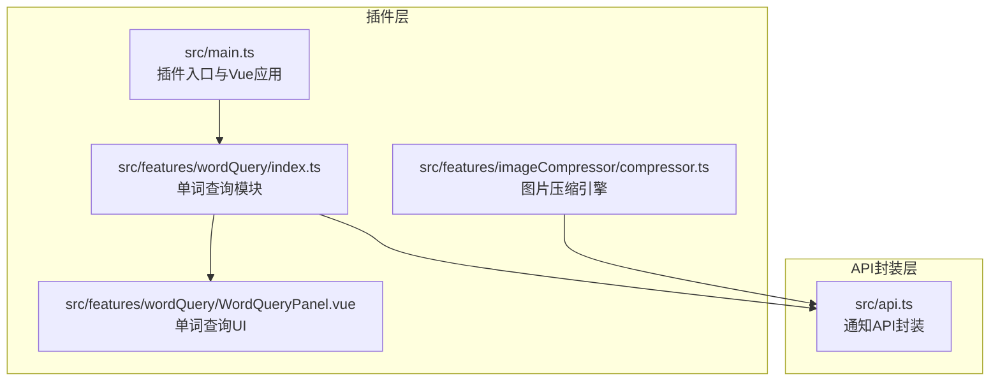
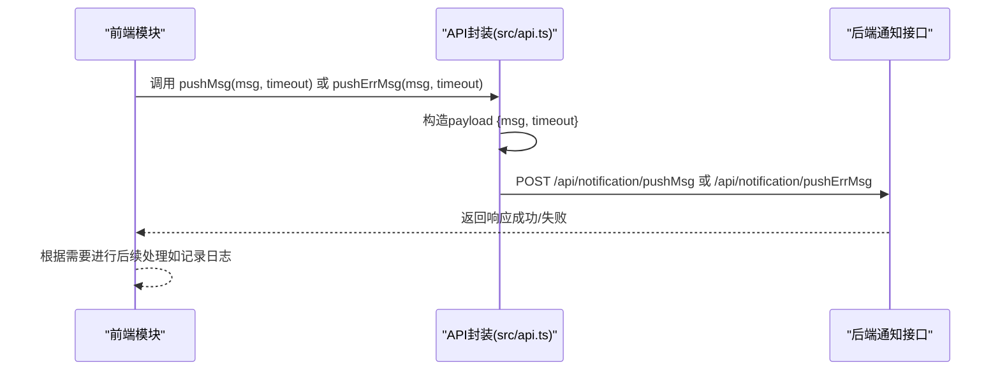
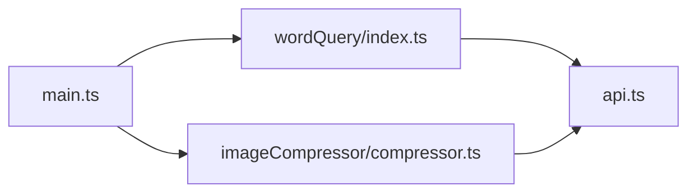

# 通知系统API

<cite>
**本文引用的文件列表**
- [src/api.ts](file://src/api.ts)
- [src/features/wordQuery/index.ts](file://src/features/wordQuery/index.ts)
- [src/features/wordQuery/WordQueryPanel.vue](file://src/features/wordQuery/WordQueryPanel.vue)
- [src/features/imageCompressor/compressor.ts](file://src/features/imageCompressor/compressor.ts)
- [src/main.ts](file://src/main.ts)
- [README.md](file://README.md)
</cite>

## 目录
1. [简介](#简介)
2. [项目结构](#项目结构)
3. [核心组件](#核心组件)
4. [架构总览](#架构总览)
5. [详细组件分析](#详细组件分析)
6. [依赖关系分析](#依赖关系分析)
7. [性能考量](#性能考量)
8. [故障排查指南](#故障排查指南)
9. [结论](#结论)
10. [附录](#附录)

## 简介
本文件面向插件开发者，系统化梳理并说明通知推送API，重点覆盖两个核心函数：
- pushMsg：用于展示普通信息类通知
- pushErrMsg：用于展示错误类通知

文档将详细解释消息内容、超时时间等参数配置方法，说明不同类型消息的视觉呈现差异，并给出在单词查询功能中使用pushMsg显示查询结果、在图片压缩出错时使用pushErrMsg提示用户的参考路径。同时，文档还解释消息队列处理机制与重复消息去重策略、长时间运行任务的进度反馈最佳实践（建议结合timeout参数实现阶段性提示），以及调试技巧（如何捕获通知发送失败的异常）。

## 项目结构
围绕通知系统，本仓库的关键位置如下：
- 通知API封装：src/api.ts
- 单词查询功能：src/features/wordQuery/index.ts、WordQueryPanel.vue
- 图片压缩功能：src/features/imageCompressor/compressor.ts
- 插件入口与Vue应用：src/main.ts
- 项目说明与开发指南：README.md

图表来源
- [src/main.ts](file://src/main.ts#L1-L45)
- [src/features/wordQuery/index.ts](file://src/features/wordQuery/index.ts#L1-L573)
- [src/features/wordQuery/WordQueryPanel.vue](file://src/features/wordQuery/WordQueryPanel.vue#L1-L548)
- [src/features/imageCompressor/compressor.ts](file://src/features/imageCompressor/compressor.ts#L1-L227)
- [src/api.ts](file://src/api.ts#L437-L461)

章节来源
- [src/api.ts](file://src/api.ts#L437-L461)
- [src/features/wordQuery/index.ts](file://src/features/wordQuery/index.ts#L1-L573)
- [src/features/wordQuery/WordQueryPanel.vue](file://src/features/wordQuery/WordQueryPanel.vue#L1-L548)
- [src/features/imageCompressor/compressor.ts](file://src/features/imageCompressor/compressor.ts#L1-L227)
- [src/main.ts](file://src/main.ts#L1-L45)

## 核心组件
- 通知API封装（src/api.ts）
  - pushMsg(msg, timeout=7000)
  - pushErrMsg(msg, timeout=7000)
  - 二者均通过统一的request封装向后端发送请求，payload包含msg与timeout两个字段。

- 单词查询功能（src/features/wordQuery/index.ts）
  - 使用 showMessage 展示查询过程中的信息/错误提示（非pushMsg/pushErrMsg）
  - 该模块展示了“查询开始”“查询完成”“查询失败”的典型交互流程，可作为使用pushMsg/pushErrMsg的参考场景

- 图片压缩功能（src/features/imageCompressor/compressor.ts）
  - 包含批量压缩、进度回调、替换文件等流程
  - 可作为“长时间运行任务+阶段性提示”的实践范例，结合timeout参数实现阶段性通知

- 插件入口（src/main.ts）
  - 初始化Vue应用并挂载到DOM，承载各功能模块

章节来源
- [src/api.ts](file://src/api.ts#L437-L461)
- [src/features/wordQuery/index.ts](file://src/features/wordQuery/index.ts#L167-L193)
- [src/features/imageCompressor/compressor.ts](file://src/features/imageCompressor/compressor.ts#L84-L105)
- [src/main.ts](file://src/main.ts#L1-L45)

## 架构总览
通知系统在插件内的调用链路如下：
- 前端模块（如单词查询、图片压缩）调用API封装中的pushMsg/pushErrMsg
- API封装通过request函数向后端发送请求
- 后端根据timeout参数控制通知显示时长
- 用户界面接收并渲染通知

图表来源
- [src/api.ts](file://src/api.ts#L437-L461)

## 详细组件分析

### 通知API封装（pushMsg/pushErrMsg）
- 参数
  - msg: string，通知文本内容
  - timeout: number，默认7000毫秒，控制通知显示时长
- 行为
  - 通过request函数封装HTTP请求，向后端发送payload
  - 返回后端响应数据（由request内部处理）

- 视觉呈现差异
  - pushMsg：用于普通信息类通知
  - pushErrMsg：用于错误类通知
  - 具体样式由后端/前端UI决定，本仓库未直接暴露样式配置，但可通过timeout控制显示时长

- 代码片段路径
  - pushMsg定义：[src/api.ts](file://src/api.ts#L444-L451)
  - pushErrMsg定义：[src/api.ts](file://src/api.ts#L453-L460)

章节来源
- [src/api.ts](file://src/api.ts#L437-L461)

### 单词查询功能中的消息提示
- 使用场景
  - 查询开始：使用 showMessage 展示“正在查询单词...”
  - 查询完成：使用 showMessage 展示“查询完成”
  - 查询失败：使用 showMessage 展示错误信息
- 代码片段路径
  - 查询开始提示：[src/features/wordQuery/index.ts](file://src/features/wordQuery/index.ts#L173-L173)
  - 查询完成提示：[src/features/wordQuery/index.ts](file://src/features/wordQuery/index.ts#L181-L181)
  - 查询失败提示：[src/features/wordQuery/index.ts](file://src/features/wordQuery/index.ts#L184-L191)
  - showMessage导入位置：[src/features/wordQuery/WordQueryPanel.vue](file://src/features/wordQuery/WordQueryPanel.vue#L163-L163)

- 结合pushMsg/pushErrMsg的建议
  - 将“正在查询单词...”改为pushMsg，使用较短timeout（例如2000毫秒）
  - 将“查询完成”改为pushMsg，使用中等timeout（例如2000-3000毫秒）
  - 将“查询失败，请重试”改为pushErrMsg，使用较长timeout（例如3000-5000毫秒），确保用户有足够时间阅读错误信息

章节来源
- [src/features/wordQuery/index.ts](file://src/features/wordQuery/index.ts#L167-L193)
- [src/features/wordQuery/WordQueryPanel.vue](file://src/features/wordQuery/WordQueryPanel.vue#L163-L163)

### 图片压缩功能中的进度反馈
- 批量压缩流程
  - batchCompressImages：遍历图片数组，逐张压缩并触发onProgress回调
  - replaceImage/batchReplaceImages：替换压缩后的文件并统计成功/失败数量
- 进度回调签名
  - onProgress(current, total, currentImage?)
- 代码片段路径
  - 批量压缩与进度回调：[src/features/imageCompressor/compressor.ts](file://src/features/imageCompressor/compressor.ts#L84-L105)
  - 单图压缩与错误处理：[src/features/imageCompressor/compressor.ts](file://src/features/imageCompressor/compressor.ts#L22-L79)
  - 替换文件与错误处理：[src/features/imageCompressor/compressor.ts](file://src/features/imageCompressor/compressor.ts#L110-L123)

- 结合pushMsg/pushErrMsg的最佳实践
  - 在每次压缩完成后，使用pushMsg展示阶段性结果（如“已完成第X张，剩余Y张”）
  - 当出现错误时，使用pushErrMsg展示具体错误信息，并提供重试/跳过等操作建议
  - 使用timeout参数为不同阶段设置合适的显示时长，避免频繁弹窗干扰

章节来源
- [src/features/imageCompressor/compressor.ts](file://src/features/imageCompressor/compressor.ts#L84-L123)

### 消息队列与去重策略
- 消息队列处理机制
  - 通知API封装未显式实现消息队列，通常由后端统一调度
  - 若需保证顺序与去重，可在调用侧自行维护一个轻量队列，避免短时间内重复触发相同消息

- 去重策略建议
  - 以msg内容为键，记录最近一次发送的时间戳
  - 在发送前检查：若相同msg在最近N秒内已发送，则忽略本次调用
  - 对pushErrMsg与pushMsg分别维护独立的去重表，避免互相影响

[本小节为通用设计建议，不直接映射到具体源码文件]

### 超时时间与阶段性提示
- timeout参数的作用
  - 控制通知在界面上停留的时间长度
  - 对于长时间运行任务，建议分阶段发送pushMsg，每个阶段使用不同的timeout，形成“阶段性提示”

- 实践建议
  - 开始阶段：timeout较小，快速告知用户任务已启动
  - 中间阶段：timeout适中，展示进度与剩余数量
  - 结束阶段：timeout稍长，便于用户确认结果或查看错误详情

[本小节为通用实践建议，不直接映射到具体源码文件]

## 依赖关系分析
- 模块耦合
  - 单词查询模块与API封装存在直接依赖（调用pushMsg/pushErrMsg）
  - 图片压缩模块与API封装存在直接依赖（调用pushMsg/pushErrMsg）
  - 插件入口负责初始化Vue应用，承载上述模块

图表来源
- [src/features/wordQuery/index.ts](file://src/features/wordQuery/index.ts#L1-L573)
- [src/features/imageCompressor/compressor.ts](file://src/features/imageCompressor/compressor.ts#L1-L227)
- [src/api.ts](file://src/api.ts#L437-L461)
- [src/main.ts](file://src/main.ts#L1-L45)

章节来源
- [src/features/wordQuery/index.ts](file://src/features/wordQuery/index.ts#L1-L573)
- [src/features/imageCompressor/compressor.ts](file://src/features/imageCompressor/compressor.ts#L1-L227)
- [src/api.ts](file://src/api.ts#L437-L461)
- [src/main.ts](file://src/main.ts#L1-L45)

## 性能考量
- 通知频率控制
  - 避免在高频循环中连续发送通知，建议合并或节流
- timeout设置
  - 过短可能导致用户来不及阅读，过长可能造成界面阻塞感
- UI渲染压力
  - 大量通知可能增加DOM节点数量，建议在批量任务中采用“阶段性汇总”而非“每步都弹窗”

[本小节为通用性能建议，不直接映射到具体源码文件]

## 故障排查指南
- 通知发送失败的常见原因
  - 网络异常或后端不可达
  - 请求参数缺失或格式不正确
  - 权限不足或插件未正确初始化

- 调试步骤
  - 在调用pushMsg/pushErrMsg前后打印日志，确认参数传递正确
  - 捕获异常并记录错误堆栈，定位具体失败环节
  - 使用浏览器开发者工具查看网络请求与响应
  - 参考README中的调试技巧章节，开启Vue DevTools与控制台日志

- 代码片段路径
  - 调试技巧说明：[README.md](file://README.md#L315-L335)

章节来源
- [README.md](file://README.md#L315-L335)

## 结论
- pushMsg与pushErrMsg是插件中进行用户反馈的重要手段，应结合timeout参数合理设置显示时长
- 在单词查询与图片压缩等场景中，建议采用“阶段性提示”的方式，提升用户体验
- 通过去重策略与节流控制，可有效避免通知风暴
- 调试时关注网络请求、参数校验与异常捕获，有助于快速定位问题

[本节为总结性内容，不直接映射到具体源码文件]

## 附录

### API定义与调用参考
- pushMsg(msg, timeout=7000)
  - 代码片段路径：[src/api.ts](file://src/api.ts#L444-L451)
- pushErrMsg(msg, timeout=7000)
  - 代码片段路径：[src/api.ts](file://src/api.ts#L453-L460)

### 场景化示例（代码片段路径）
- 单词查询开始/完成/失败提示（使用 showMessage）
  - 开始提示：[src/features/wordQuery/index.ts](file://src/features/wordQuery/index.ts#L173-L173)
  - 完成提示：[src/features/wordQuery/index.ts](file://src/features/wordQuery/index.ts#L181-L181)
  - 失败提示：[src/features/wordQuery/index.ts](file://src/features/wordQuery/index.ts#L184-L191)
- 图片批量压缩与进度回调
  - 批量压缩与进度回调：[src/features/imageCompressor/compressor.ts](file://src/features/imageCompressor/compressor.ts#L84-L105)
  - 单图压缩与错误处理：[src/features/imageCompressor/compressor.ts](file://src/features/imageCompressor/compressor.ts#L22-L79)
  - 替换文件与错误处理：[src/features/imageCompressor/compressor.ts](file://src/features/imageCompressor/compressor.ts#L110-L123)