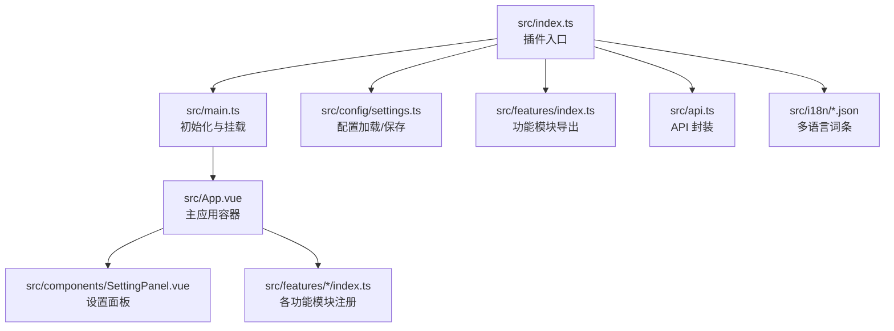
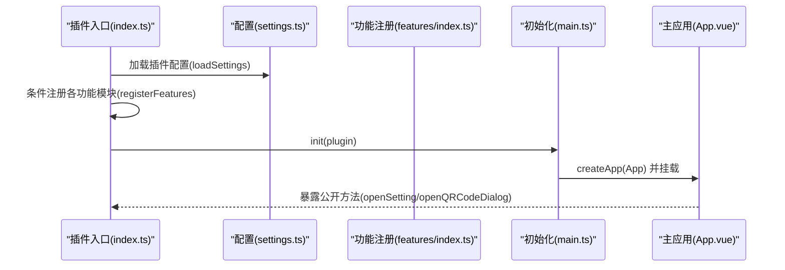
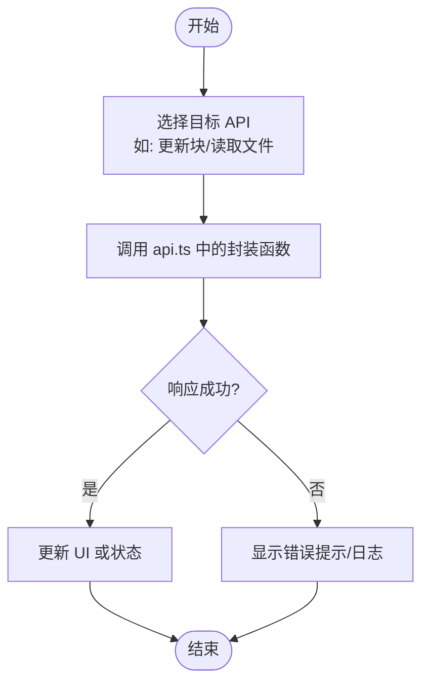
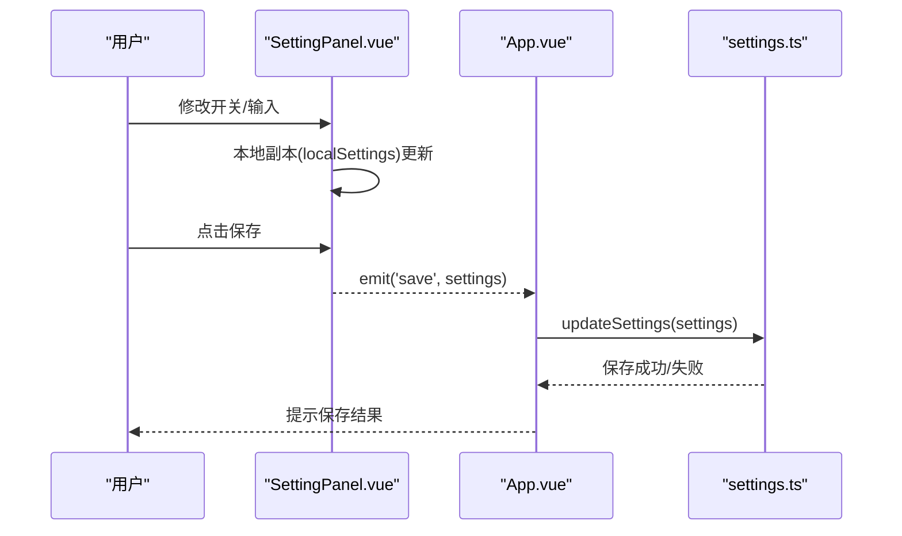
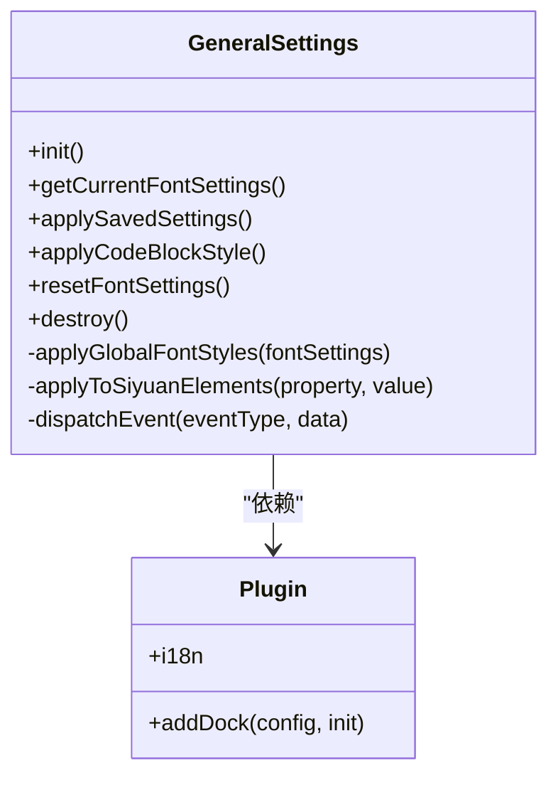
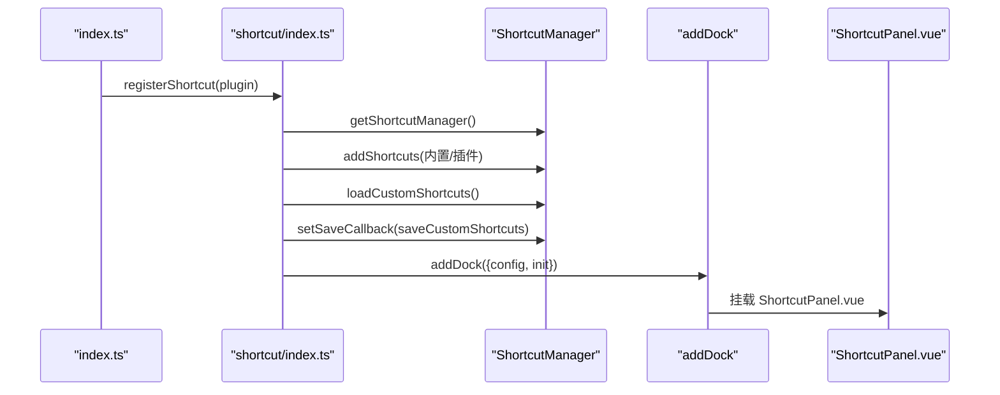
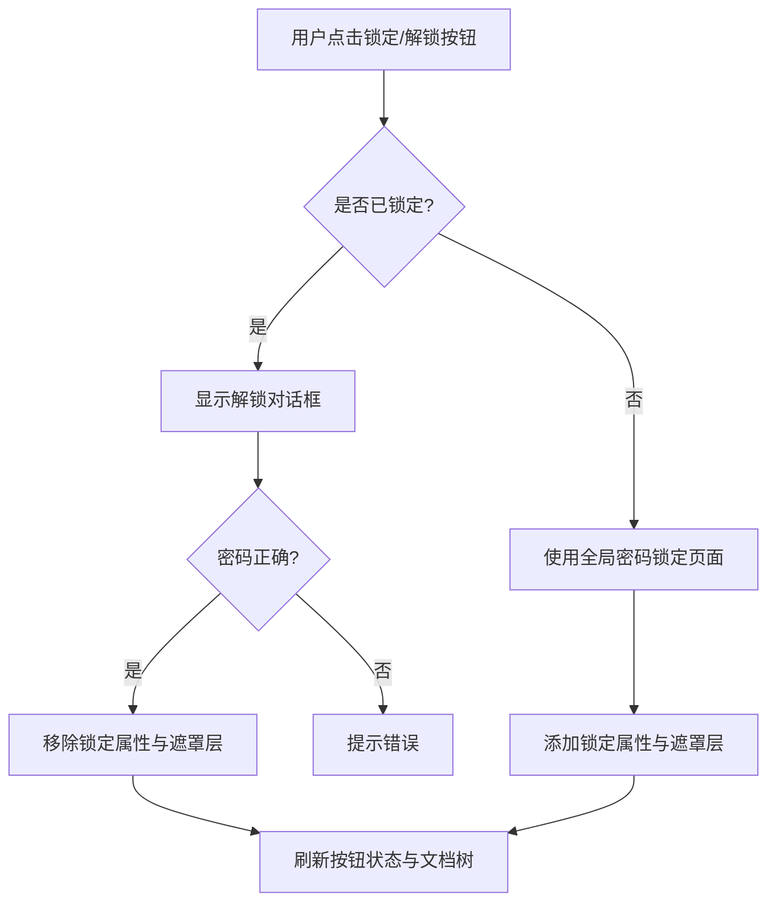
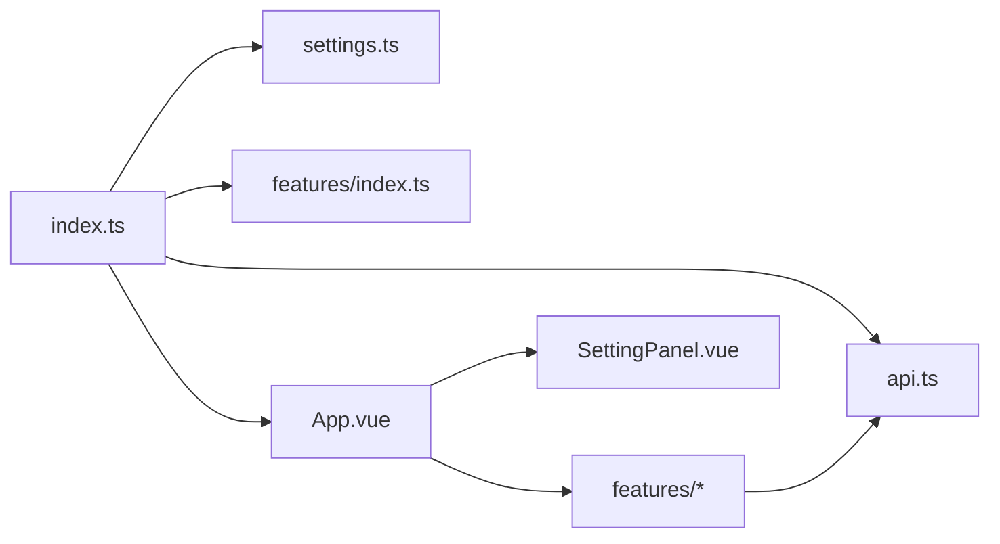

# 开发指南

<cite>
**本文引用的文件**
- [src/api.ts](file://src/api.ts)
- [src/config/settings.ts](file://src/config/settings.ts)
- [src/features/index.ts](file://src/features/index.ts)
- [src/main.ts](file://src/main.ts)
- [src/App.vue](file://src/App.vue)
- [src/components/SettingPanel.vue](file://src/components/SettingPanel.vue)
- [src/features/generalSettings/index.ts](file://src/features/generalSettings/index.ts)
- [src/features/generalSettings/GeneralSettingsPanel.vue](file://src/features/generalSettings/GeneralSettingsPanel.vue)
- [src/features/shortcut/index.ts](file://src/features/shortcut/index.ts)
- [src/features/shortcut/ShortcutPanel.vue](file://src/features/shortcut/ShortcutPanel.vue)
- [src/features/unitConverter/index.ts](file://src/features/unitConverter/index.ts)
- [src/features/pageLock/index.ts](file://src/features/pageLock/index.ts)
- [src/utils/index.ts](file://src/utils/index.ts)
- [src/i18n/zh_CN.json](file://src/i18n/zh_CN.json)
- [src/i18n/en_US.json](file://src/i18n/en_US.json)
- [src/index.ts](file://src/index.ts)
- [src/types/api.d.ts](file://src/types/api.d.ts)
</cite>

## 目录
1. [简介](#简介)
2. [项目结构](#项目结构)
3. [核心组件](#核心组件)
4. [架构总览](#架构总览)
5. [详细组件分析](#详细组件分析)
6. [依赖关系分析](#依赖关系分析)
7. [性能考量](#性能考量)
8. [故障排查指南](#故障排查指南)
9. [结论](#结论)
10. [附录](#附录)

## 简介
本开发指南面向贡献者，提供从零开始创建新功能模块的完整路径，涵盖以下方面：
- 在 src/features/ 下新增功能模块的步骤：创建文件夹、实现功能逻辑、在 features/index.ts 中导出、在 settings.ts 中添加配置项、在 registerFeatures() 中注册、以及多语言支持。
- 深入讲解如何使用思源 API，重点分析 api.ts 中的常用 API 函数（如获取块信息、更新块等），并给出实际使用示例的路径指引。
- 设置面板的开发要点：SettingPanel.vue 的结构、数据绑定与保存机制。
- 调试技巧：使用开发者工具、查看日志、利用 Vue DevTools。
- 从零开始创建新功能的分步指导，帮助你快速落地。

## 项目结构
该项目采用“按功能模块划分”的组织方式，核心目录如下：
- src/api.ts：封装思源笔记 API，统一请求与响应处理。
- src/config/settings.ts：插件配置与默认值、加载/保存逻辑。
- src/features/：各功能模块的集合，每个模块独立文件夹，包含组件与入口注册函数。
- src/components/：通用组件，如设置面板。
- src/i18n/：国际化词条（中/英）。
- src/main.ts：插件初始化与挂载主应用。
- src/index.ts：插件入口类，负责加载配置、注册功能模块、暴露公开方法。
- src/types/api.d.ts：API 返回类型声明。

图表来源
- [src/index.ts](file://src/index.ts#L1-L140)
- [src/main.ts](file://src/main.ts#L1-L45)
- [src/config/settings.ts](file://src/config/settings.ts#L1-L141)
- [src/features/index.ts](file://src/features/index.ts#L1-L15)
- [src/api.ts](file://src/api.ts#L1-L496)
- [src/i18n/zh_CN.json](file://src/i18n/zh_CN.json#L1-L317)
- [src/App.vue](file://src/App.vue#L1-L216)

章节来源
- [src/index.ts](file://src/index.ts#L1-L140)
- [src/main.ts](file://src/main.ts#L1-L45)
- [src/config/settings.ts](file://src/config/settings.ts#L1-L141)
- [src/features/index.ts](file://src/features/index.ts#L1-L15)
- [src/api.ts](file://src/api.ts#L1-L496)
- [src/i18n/zh_CN.json](file://src/i18n/zh_CN.json#L1-L317)
- [src/App.vue](file://src/App.vue#L1-L216)

## 核心组件
- 插件入口类：负责加载配置、根据配置注册功能模块、提供更新配置的方法。
- 主应用容器：承载设置面板、图片查看器、二维码对话框等 UI。
- 设置面板：提供插件功能开关、保存与重置、国际化文案展示。
- 通用设置模块：提供字体、代码块样式、通用操作等设置入口。
- 快捷键模块：右侧边栏展示快捷键，支持搜索、分组、复制、删除与自定义添加。
- API 封装：统一请求与响应处理，提供笔记本、文件树、块、属性、SQL、模板、文件、导出、转换、通知、网络、系统等 API。

章节来源
- [src/index.ts](file://src/index.ts#L1-L140)
- [src/App.vue](file://src/App.vue#L1-L216)
- [src/components/SettingPanel.vue](file://src/components/SettingPanel.vue#L1-L427)
- [src/features/generalSettings/index.ts](file://src/features/generalSettings/index.ts#L1-L414)
- [src/features/shortcut/index.ts](file://src/features/shortcut/index.ts#L1-L326)
- [src/api.ts](file://src/api.ts#L1-L496)

## 架构总览
插件启动流程概览：
- 插件入口加载前端类型、判断运行环境，加载配置。
- 注册功能模块：根据配置逐个调用对应模块的注册函数。
- 初始化主应用：创建并挂载 Vue 应用，注入设置面板、图片查看器、二维码对话框等。
- 运行时通过事件与 API 与思源交互，实现功能。

图表来源
- [src/index.ts](file://src/index.ts#L1-L140)
- [src/config/settings.ts](file://src/config/settings.ts#L1-L141)
- [src/features/index.ts](file://src/features/index.ts#L1-L15)
- [src/main.ts](file://src/main.ts#L1-L45)
- [src/App.vue](file://src/App.vue#L1-L216)

## 详细组件分析

### 新功能模块开发全流程
以下为从零开始创建一个新功能模块的完整步骤，结合现有模块的实现模式进行说明。

- 步骤一：在 src/features/ 下创建新文件夹，命名与功能相关，如 src/features/myFeature/
- 步骤二：在该文件夹中实现功能逻辑与 UI 组件，提供一个注册函数（如 registerMyFeature），用于向插件注册 Dock 或事件监听。
- 步骤三：在 src/features/index.ts 中导出该注册函数，便于插件入口统一导入。
- 步骤四：在 src/config/settings.ts 中为该功能添加配置项（布尔开关、参数等），并在 DEFAULT_SETTINGS 中设置默认值。
- 步骤五：在 src/index.ts 的 registerFeatures() 中根据配置条件调用 registerMyFeature。
- 步骤六：在 src/i18n/zh_CN.json 与 en_US.json 中添加对应的多语言词条，确保 UI 文案正确显示。
- 步骤七：如需在设置面板中提供开关，可在 SettingPanel.vue 中增加对应项；若为右侧边栏功能，参考通用设置模块或快捷键模块的 Dock 注册方式。

章节来源
- [src/features/index.ts](file://src/features/index.ts#L1-L15)
- [src/config/settings.ts](file://src/config/settings.ts#L1-L141)
- [src/index.ts](file://src/index.ts#L1-L140)
- [src/i18n/zh_CN.json](file://src/i18n/zh_CN.json#L1-L317)
- [src/i18n/en_US.json](file://src/i18n/en_US.json#L1-L312)

### 思源 API 使用指南（以 api.ts 为例）
api.ts 对思源 API 进行了统一封装，提供笔记本、文件树、块、属性、SQL、模板、文件、导出、转换、通知、网络、系统等常用接口。以下为典型使用场景与示例路径：

- 获取块信息与更新块
  - 示例路径：[getBlockInfo 与 updateBlock 的封装](file://src/api.ts#L249-L281)
  - 实际使用建议：先通过 getBlockKramdown 获取块的 Kramdown 内容，再通过 updateBlock 更新块内容。注意 dataType 与 data 的格式要求。
  - 类型声明参考：[IResGetBlockKramdown 与 IResdoOperations](file://src/types/api.d.ts#L21-L35)

- 插入/追加/移动/删除块
  - 示例路径：[insertBlock、prependBlock、appendBlock、moveBlock、deleteBlock](file://src/api.ts#L166-L247)
  - 使用建议：insertBlock 适合在指定位置插入新块；prependBlock/appendBlock 适合在父块内部首尾添加；moveBlock 支持调整兄弟顺序与父子关系。

- 文件与资产
  - 示例路径：[upload、getFile、putFile、removeFile、readDir](file://src/api.ts#L150-L400)
  - 使用建议：上传图片等资源时，使用 upload 接口；读取二进制文件使用 getFile；写入文件使用 putFile；列出目录使用 readDir。

- 数据库与查询
  - 示例路径：[sql、getBlockByID](file://src/api.ts#L307-L321)
  - 使用建议：通过 sql 执行自定义查询；getBlockByID 基于 SQL 查询单个块信息。

- 模板渲染
  - 示例路径：[render、renderSprig](file://src/api.ts#L323-L339)
  - 使用建议：render 用于文档模板渲染；renderSprig 用于片段渲染。

- 通知与网络代理
  - 示例路径：[pushMsg、pushErrMsg、forwardProxy](file://src/api.ts#L438-L481)
  - 使用建议：pushMsg/pushErrMsg 用于向用户推送提示；forwardProxy 用于转发网络请求。

- 系统信息
  - 示例路径：[bootProgress、version、currentTime](file://src/api.ts#L483-L496)
  - 使用建议：version 用于版本判断；currentTime 用于时间戳获取。

图表来源
- [src/api.ts](file://src/api.ts#L1-L496)
- [src/types/api.d.ts](file://src/types/api.d.ts#L1-L65)

章节来源
- [src/api.ts](file://src/api.ts#L1-L496)
- [src/types/api.d.ts](file://src/types/api.d.ts#L1-L65)

### 设置面板开发（SettingPanel.vue）
SettingPanel.vue 是插件的全局设置面板，负责：
- 展示与编辑插件功能开关（enableXXX）。
- 本地副本与保存机制：本地 ref 与父组件通信，保存时触发父组件的 updateSettings。
- 国际化：通过 i18n 传入，展示中文/英文文案。
- 焦点管理：确保设置面板在最上层并保持焦点。

关键点：
- 数据绑定：v-model 绑定 localSettings，保证与 props 同步。
- 保存与取消：emit('save') 与 emit('cancel')，由父组件 App.vue 处理。
- 重置：恢复 DEFAULT_SETTINGS，并提示用户。

图表来源
- [src/components/SettingPanel.vue](file://src/components/SettingPanel.vue#L1-L427)
- [src/App.vue](file://src/App.vue#L1-L216)
- [src/config/settings.ts](file://src/config/settings.ts#L1-L141)

章节来源
- [src/components/SettingPanel.vue](file://src/components/SettingPanel.vue#L1-L427)
- [src/App.vue](file://src/App.vue#L1-L216)
- [src/config/settings.ts](file://src/config/settings.ts#L1-L141)

### 通用设置模块（字体、代码块样式、通用操作）
通用设置模块提供右侧边栏的统一入口，支持：
- 字体设置：全局字体家族、字号、字重、行高，应用到编辑器与阅读模式。
- 代码块样式：从本地存储读取并应用到 body 的样式类。
- 通用操作：刷新页面、重启应用、清除缓存、打开开发者工具等。

实现要点：
- addDock 注册右侧边栏容器，挂载 Vue 组件。
- 通过事件派发与监听，实现设置变更后的全局应用。
- 重置逻辑：移除 CSS 变量与元素样式，恢复默认。

图表来源
- [src/features/generalSettings/index.ts](file://src/features/generalSettings/index.ts#L1-L414)

章节来源
- [src/features/generalSettings/index.ts](file://src/features/generalSettings/index.ts#L1-L414)
- [src/features/generalSettings/GeneralSettingsPanel.vue](file://src/features/generalSettings/GeneralSettingsPanel.vue#L1-L200)

### 快捷键模块（右侧边栏与自定义）
快捷键模块在右侧边栏展示思源与插件的快捷键，支持：
- 分类标签：全部、思源笔记、插件快捷键、自定义。
- 搜索过滤：按名称/描述/按键组合筛选。
- 自定义添加：表单收集名称、描述、按键、分组，保存到数据库。
- 复制与删除：一键复制快捷键信息，删除自定义条目。

注册流程：
- 初始化快捷键管理器，添加内置快捷键与插件快捷键。
- 从数据库加载自定义快捷键并设置保存回调。
- addDock 注册右侧边栏容器，挂载 ShortcutPanel.vue。

图表来源
- [src/features/shortcut/index.ts](file://src/features/shortcut/index.ts#L1-L326)
- [src/features/shortcut/ShortcutPanel.vue](file://src/features/shortcut/ShortcutPanel.vue#L1-L200)

章节来源
- [src/features/shortcut/index.ts](file://src/features/shortcut/index.ts#L1-L326)
- [src/features/shortcut/ShortcutPanel.vue](file://src/features/shortcut/ShortcutPanel.vue#L1-L200)

### 页面锁定模块（示例：演示如何与 API 结合）
页面锁定模块展示了如何与 API 结合实现业务逻辑：
- 通过 setBlockAttrs 为文档块添加自定义属性，标记锁定状态。
- 通过事件与 DOM 交互，拦截锁定页面内容并显示遮罩层。
- 通过 Protyle 对象与编辑器交互，动态更新按钮与文档树图标。

图表来源
- [src/features/pageLock/index.ts](file://src/features/pageLock/index.ts#L1-L573)
- [src/api.ts](file://src/api.ts#L283-L304)

章节来源
- [src/features/pageLock/index.ts](file://src/features/pageLock/index.ts#L1-L573)
- [src/api.ts](file://src/api.ts#L283-L304)

### 单位转换模块（示例：右侧边栏 Dock）
单位转换模块展示了如何以 Dock 形式集成到右侧边栏：
- registerUnitConverter 接收插件实例，调用 addDock 注册容器。
- 在 init 中创建 Vue 应用并挂载 UnitConverter 组件。
- 通过 i18n 传递多语言文案。

章节来源
- [src/features/unitConverter/index.ts](file://src/features/unitConverter/index.ts#L1-L43)

### 从零开始创建新功能的分步指导
- 第一步：设计功能与 UI
  - 明确功能边界与交互，决定是否需要右侧边栏 Dock、模态弹窗或工具栏按钮。
  - 参考现有模块：通用设置、快捷键、单位转换等。
- 第二步：创建模块目录与入口
  - 在 src/features/ 下新建目录，如 myFeature，创建 index.ts 作为注册入口。
  - 在 src/features/index.ts 中导出 registerMyFeature。
- 第三步：实现配置与注册
  - 在 src/config/settings.ts 中添加开关与默认值。
  - 在 src/index.ts 的 registerFeatures() 中按配置调用 registerMyFeature。
- 第四步：实现 UI 与交互
  - 如需右侧边栏，参考通用设置或快捷键模块的 addDock 方式。
  - 如需设置面板开关，参考 SettingPanel.vue 的结构与数据绑定。
- 第五步：多语言支持
  - 在 src/i18n/zh_CN.json 与 en_US.json 中添加词条，确保 UI 文案正确。
- 第六步：使用 API
  - 在功能中调用 api.ts 的封装函数，遵循 dataType、id、parentID 等参数约定。
  - 注意错误处理与用户提示。
- 第七步：调试与测试
  - 使用浏览器开发者工具查看网络请求与日志。
  - 利用 Vue DevTools 观察组件状态与事件流。
  - 通过 showMessage 输出提示，便于用户反馈。

章节来源
- [src/features/index.ts](file://src/features/index.ts#L1-L15)
- [src/config/settings.ts](file://src/config/settings.ts#L1-L141)
- [src/index.ts](file://src/index.ts#L1-L140)
- [src/i18n/zh_CN.json](file://src/i18n/zh_CN.json#L1-L317)
- [src/i18n/en_US.json](file://src/i18n/en_US.json#L1-L312)
- [src/api.ts](file://src/api.ts#L1-L496)

## 依赖关系分析
- 插件入口依赖配置加载与功能注册导出。
- 主应用依赖设置面板与各功能模块的 UI 组件。
- 功能模块之间低耦合，通过统一的注册入口集中管理。
- API 封装为所有模块提供统一的底层能力。

图表来源
- [src/index.ts](file://src/index.ts#L1-L140)
- [src/config/settings.ts](file://src/config/settings.ts#L1-L141)
- [src/features/index.ts](file://src/features/index.ts#L1-L15)
- [src/api.ts](file://src/api.ts#L1-L496)
- [src/App.vue](file://src/App.vue#L1-L216)

章节来源
- [src/index.ts](file://src/index.ts#L1-L140)
- [src/config/settings.ts](file://src/config/settings.ts#L1-L141)
- [src/features/index.ts](file://src/features/index.ts#L1-L15)
- [src/api.ts](file://src/api.ts#L1-L496)
- [src/App.vue](file://src/App.vue#L1-L216)

## 性能考量
- 按需注册：仅在配置开启时注册功能模块，避免不必要的 DOM 与事件开销。
- 事件节流：在高频事件（如滚动、搜索）中使用防抖/节流，减少重绘。
- 懒加载：右侧边栏的组件在首次打开时再挂载，降低初始渲染压力。
- 本地存储：字体与代码块样式等设置使用 localStorage，避免每次计算。
- 日志输出：仅在开发阶段输出详细日志，生产环境减少冗余日志。

## 故障排查指南
- 开发者工具
  - 打开浏览器开发者工具，查看 Console 中的日志与错误堆栈。
  - 在 Network 面板观察 API 请求与响应，确认 URL、参数与返回值。
- Vue DevTools
  - 安装 Vue DevTools，查看组件树、状态与事件流，定位数据绑定与生命周期问题。
- 常见问题
  - 设置保存失败：检查 saveSettings 的返回值与错误日志。
  - 右侧边栏不显示：确认 addDock 的配置与 init 回调是否执行。
  - API 调用异常：核对请求 URL、参数格式与权限，查看响应状态。
  - 国际化缺失：检查 i18n 词条是否存在，组件是否正确传入 i18n。

章节来源
- [src/App.vue](file://src/App.vue#L1-L216)
- [src/components/SettingPanel.vue](file://src/components/SettingPanel.vue#L1-L427)
- [src/api.ts](file://src/api.ts#L1-L496)

## 结论
本指南提供了从零开始创建新功能模块的完整路径，覆盖了模块组织、配置与注册、UI 开发、API 使用与多语言支持，并给出了调试技巧与最佳实践。按照上述流程，你可以快速、稳定地扩展插件功能，同时保持良好的可维护性与用户体验。

## 附录
- 快速参考
  - 新增功能模块：在 src/features/ 下创建目录与注册函数，在 features/index.ts 导出，在 settings.ts 添加配置，在 registerFeatures() 中注册。
  - 使用 API：优先使用 api.ts 的封装函数，关注 dataType、id、parentID 等参数，处理错误与提示。
  - 设置面板：使用 SettingPanel.vue 的结构与数据绑定，通过 emit 与父组件通信。
  - 多语言：在 zh_CN.json 与 en_US.json 中添加词条，确保 UI 文案一致。