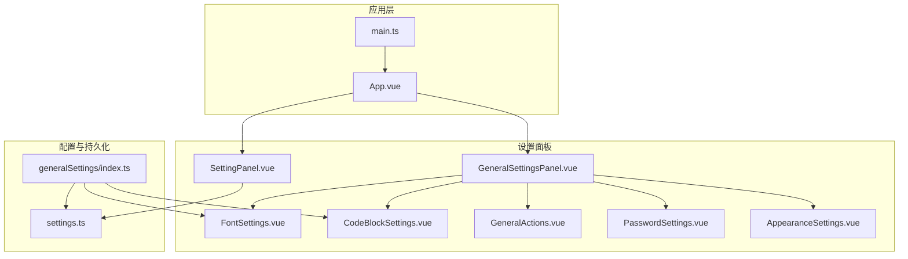
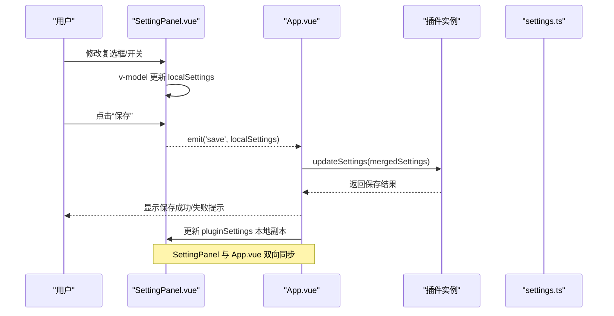
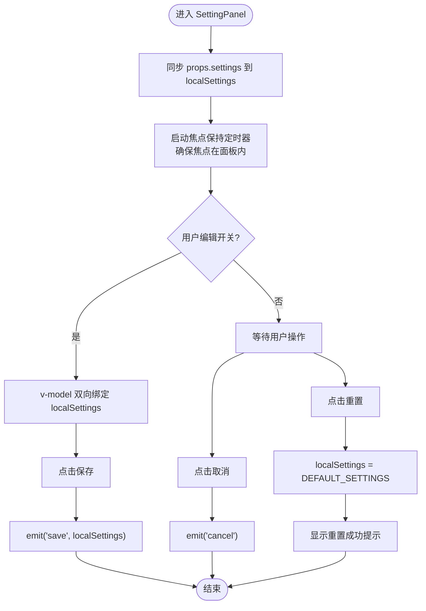
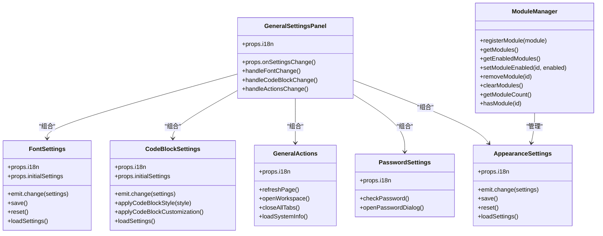
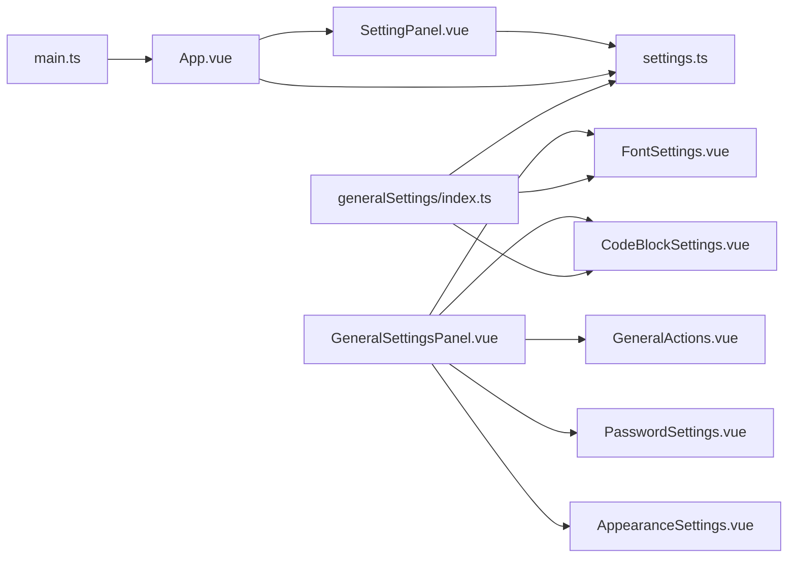

# 开发设置面板

<cite>
**本文引用的文件**
- [SettingPanel.vue](file://src/components/SettingPanel.vue)
- [settings.ts](file://src/config/settings.ts)
- [App.vue](file://src/App.vue)
- [main.ts](file://src/main.ts)
- [GeneralSettingsPanel.vue](file://src/features/generalSettings/GeneralSettingsPanel.vue)
- [FontSettings.vue](file://src/features/generalSettings/components/FontSettings.vue)
- [CodeBlockSettings.vue](file://src/features/generalSettings/components/CodeBlockSettings.vue)
- [GeneralActions.vue](file://src/features/generalSettings/components/GeneralActions.vue)
- [PasswordSettings.vue](file://src/features/generalSettings/components/PasswordSettings.vue)
- [AppearanceSettings.vue](file://src/features/generalSettings/modules/AppearanceSettings.vue)
- [ModuleManager.ts](file://src/features/generalSettings/modules/ModuleManager.ts)
- [generalSettings/index.ts](file://src/features/generalSettings/index.ts)
</cite>

## 目录
1. [引言](#引言)
2. [项目结构](#项目结构)
3. [核心组件](#核心组件)
4. [架构总览](#架构总览)
5. [详细组件分析](#详细组件分析)
6. [依赖关系分析](#依赖关系分析)
7. [性能考量](#性能考量)
8. [故障排查指南](#故障排查指南)
9. [结论](#结论)
10. [附录](#附录)

## 引言
本指南围绕设置面板的开发与集成，系统讲解 SettingPanel.vue 的组件结构、响应式数据绑定、表单校验与状态管理；说明如何将 src/config/settings.ts 中的配置接口与 UI 进行双向绑定，实现配置的实时预览与保存；剖析通用设置模块化设计（如 AppearanceSettings.vue 等子组件）的集成方式；给出自定义设置项的开发示例与类型安全实践；阐述配置持久化机制（loadSettings/saveSettings）的实现原理与异常处理；最后讨论用户体验优化（重置、默认值管理、错误提示）与性能优化建议。

## 项目结构
设置面板相关的核心文件分布如下：
- 组件层：SettingPanel.vue（主设置面板）、通用设置模块（GeneralSettingsPanel.vue 及其子组件）
- 配置层：settings.ts（插件配置接口与默认值、加载/保存函数）
- 应用入口：App.vue（挂载 SettingPanel 并处理保存/取消）、main.ts（插件生命周期与紧凑模式）

图表来源
- [SettingPanel.vue](file://src/components/SettingPanel.vue#L1-L188)
- [GeneralSettingsPanel.vue](file://src/features/generalSettings/GeneralSettingsPanel.vue#L1-L46)
- [FontSettings.vue](file://src/features/generalSettings/components/FontSettings.vue#L1-L158)
- [CodeBlockSettings.vue](file://src/features/generalSettings/components/CodeBlockSettings.vue#L1-L165)
- [GeneralActions.vue](file://src/features/generalSettings/components/GeneralActions.vue#L1-L66)
- [PasswordSettings.vue](file://src/features/generalSettings/components/PasswordSettings.vue#L1-L47)
- [AppearanceSettings.vue](file://src/features/generalSettings/modules/AppearanceSettings.vue#L1-L45)
- [settings.ts](file://src/config/settings.ts#L1-L141)
- [generalSettings/index.ts](file://src/features/generalSettings/index.ts#L1-L90)
- [main.ts](file://src/main.ts#L1-L45)

章节来源
- [SettingPanel.vue](file://src/components/SettingPanel.vue#L1-L188)
- [settings.ts](file://src/config/settings.ts#L1-L141)
- [App.vue](file://src/App.vue#L1-L150)
- [main.ts](file://src/main.ts#L1-L45)
- [GeneralSettingsPanel.vue](file://src/features/generalSettings/GeneralSettingsPanel.vue#L1-L46)
- [generalSettings/index.ts](file://src/features/generalSettings/index.ts#L1-L90)

## 核心组件
- SettingPanel.vue：插件主设置面板，负责插件功能开关的双向绑定、保存/取消/重置逻辑，并通过事件向上抛出保存请求。
- settings.ts：定义插件配置接口、默认值以及 loadSettings/saveSettings 等持久化函数。
- App.vue：承载 SettingPanel，接收保存事件并调用插件 updateSettings 完成实际持久化。
- GeneralSettingsPanel.vue 及其子组件：通用设置模块集合，包含字体、代码块、通用操作、密码等子模块，支持实时预览与独立保存/重置。
- generalSettings/index.ts：通用设置模块的 Dock 注册、事件分发与样式应用。

章节来源
- [SettingPanel.vue](file://src/components/SettingPanel.vue#L190-L274)
- [settings.ts](file://src/config/settings.ts#L1-L141)
- [App.vue](file://src/App.vue#L30-L99)
- [GeneralSettingsPanel.vue](file://src/features/generalSettings/GeneralSettingsPanel.vue#L1-L46)
- [generalSettings/index.ts](file://src/features/generalSettings/index.ts#L1-L90)

## 架构总览
SettingPanel 作为顶层设置面板，内部通过 v-model 将本地副本 localSettings 与插件配置进行双向绑定。用户点击“保存”后，SettingPanel 通过 emit('save', settings) 将变更传递给 App.vue，App.vue 再调用插件 updateSettings 完成持久化。通用设置模块（GeneralSettingsPanel 及子组件）通过独立的本地状态与 localStorage 实现实时预览与持久化，同时通过事件向通用设置模块管理器广播变更，由管理器统一应用到页面样式。

图表来源
- [SettingPanel.vue](file://src/components/SettingPanel.vue#L212-L236)
- [App.vue](file://src/App.vue#L55-L65)
- [settings.ts](file://src/config/settings.ts#L70-L96)

## 详细组件分析

### SettingPanel.vue：主设置面板
- 数据绑定
  - 通过 props 接收插件配置 settings，并在组件内部创建本地副本 localSettings，使用 v-model 绑定到各个开关控件，实现双向绑定与实时预览。
- 事件处理
  - onSave：清理可能存在的焦点定时器，emit('save', localSettings)。
  - onCancel：清理定时器，emit('cancel')。
  - onReset：将 localSettings 重置为 DEFAULT_SETTINGS，并通过 showMessage 提示。
- 生命周期
  - onMounted：确保 localSettings 与传入的 settings 同步；设置 overlay 的 z-index；启动焦点保持定时器，保证焦点始终在面板内。
  - onBeforeUnmount：清理定时器，防止内存泄漏。
- 用户体验
  - 顶部标题与描述、底部操作区、提示信息区，整体布局清晰，便于用户理解与操作。

图表来源
- [SettingPanel.vue](file://src/components/SettingPanel.vue#L212-L274)

章节来源
- [SettingPanel.vue](file://src/components/SettingPanel.vue#L190-L274)
- [settings.ts](file://src/config/settings.ts#L37-L50)

### App.vue：设置面板宿主与保存流程
- 打开设置：openSetting 将 showSettings 置为 true，并同步 plugin.settings 到本地副本 pluginSettings。
- 保存设置：onSaveSettings 调用 plugin.updateSettings(settings)，根据返回结果显示成功/失败提示，并更新本地副本。
- 取消设置：onCancelSettings 关闭面板。
- 事件监听：监听窗口事件以打开二维码对话框与图片压缩器。

章节来源
- [App.vue](file://src/App.vue#L30-L99)
- [main.ts](file://src/main.ts#L21-L38)

### settings.ts：配置接口与持久化
- 插件配置接口 PluginSettings：包含多个功能开关与字符串/布尔字段。
- 默认配置 DEFAULT_SETTINGS：提供完整默认值，用于首次加载与重置。
- 加载/保存函数：
  - loadSettings：从插件数据存储加载配置，若无数据则返回默认值；合并默认值与已保存值，保证字段完整性。
  - saveSettings：保存配置到插件数据存储，返回布尔结果；包含 try/catch 异常处理。
  - 字体设置：loadFontSettings/saveFontSettings/resetFontSettings 通过 localStorage 管理字体偏好。

章节来源
- [settings.ts](file://src/config/settings.ts#L1-L141)

### 通用设置模块：模块化设计与实时预览
- GeneralSettingsPanel.vue：聚合字体、代码块、通用操作、密码等模块，通过 onSettingsChange 回调统一处理。
- FontSettings.vue：双向绑定字体家族、字号、行高、字重，提供预览区域与滑块联动，支持保存/重置至 localStorage。
- CodeBlockSettings.vue：选择代码块风格（默认/GitHub/Mac/卡通），提供字体大小与内边距滑块，自动保存至 localStorage，并在 mounted 时应用已保存样式。
- GeneralActions.vue：提供刷新页面、打开工作区、关闭所有页签等操作，内置系统信息展示。
- PasswordSettings.vue：检测全局密码状态，触发自定义事件以打开密码对话框。
- AppearanceSettings.vue：外观设置模块（主题模式、界面缩放、显示侧边栏），支持保存/重置与本地持久化。
- ModuleManager.ts：通用设置模块管理器，提供注册、启用/禁用、排序、移除等能力，支持按 order 排序与 enabled 控制。

图表来源
- [GeneralSettingsPanel.vue](file://src/features/generalSettings/GeneralSettingsPanel.vue#L1-L95)
- [FontSettings.vue](file://src/features/generalSettings/components/FontSettings.vue#L160-L299)
- [CodeBlockSettings.vue](file://src/features/generalSettings/components/CodeBlockSettings.vue#L167-L274)
- [GeneralActions.vue](file://src/features/generalSettings/components/GeneralActions.vue#L68-L202)
- [PasswordSettings.vue](file://src/features/generalSettings/components/PasswordSettings.vue#L48-L98)
- [AppearanceSettings.vue](file://src/features/generalSettings/modules/AppearanceSettings.vue#L47-L126)
- [ModuleManager.ts](file://src/features/generalSettings/modules/ModuleManager.ts#L1-L99)

章节来源
- [GeneralSettingsPanel.vue](file://src/features/generalSettings/GeneralSettingsPanel.vue#L1-L95)
- [FontSettings.vue](file://src/features/generalSettings/components/FontSettings.vue#L160-L299)
- [CodeBlockSettings.vue](file://src/features/generalSettings/components/CodeBlockSettings.vue#L167-L274)
- [GeneralActions.vue](file://src/features/generalSettings/components/GeneralActions.vue#L68-L202)
- [PasswordSettings.vue](file://src/features/generalSettings/components/PasswordSettings.vue#L48-L98)
- [AppearanceSettings.vue](file://src/features/generalSettings/modules/AppearanceSettings.vue#L47-L126)
- [ModuleManager.ts](file://src/features/generalSettings/modules/ModuleManager.ts#L1-L99)

### 通用设置模块的持久化与样式应用
- 通用设置模块通过 localStorage 独立持久化自身设置，如字体设置、代码块设置、外观设置等。
- generalSettings/index.ts：
  - init：注册 Dock，挂载 GeneralSettingsPanel，并应用已保存设置与代码块样式。
  - handleSettingsChange：根据 moduleId 分发处理，应用全局字体样式与代码块样式，并派发自定义事件。
  - applyGlobalFontStyles：将字体设置写入 CSS 变量并应用到思源笔记主要元素。
  - applyCodeBlockStyle/applyCodeBlockStyleFromSettings：根据样式类型切换 body 类名，实现代码块风格即时生效。
  - resetFontSettings/resetSiyuanElementStyles：重置字体设置与元素样式。

章节来源
- [generalSettings/index.ts](file://src/features/generalSettings/index.ts#L1-L273)

## 依赖关系分析
- SettingPanel 依赖 settings.ts 的 DEFAULT_SETTINGS 与类型定义，用于重置与类型约束。
- App.vue 依赖 SettingPanel 并通过插件 updateSettings 完成保存。
- 通用设置模块依赖 localStorage 与 DOM 操作，通过事件与通用设置模块管理器协同。
- main.ts 提供 usePlugin 与插件初始化，影响紧凑模式等全局行为。

图表来源
- [SettingPanel.vue](file://src/components/SettingPanel.vue#L190-L274)
- [settings.ts](file://src/config/settings.ts#L1-L141)
- [App.vue](file://src/App.vue#L30-L99)
- [GeneralSettingsPanel.vue](file://src/features/generalSettings/GeneralSettingsPanel.vue#L1-L46)
- [generalSettings/index.ts](file://src/features/generalSettings/index.ts#L1-L90)
- [main.ts](file://src/main.ts#L1-L45)

章节来源
- [SettingPanel.vue](file://src/components/SettingPanel.vue#L190-L274)
- [settings.ts](file://src/config/settings.ts#L1-L141)
- [App.vue](file://src/App.vue#L30-L99)
- [GeneralSettingsPanel.vue](file://src/features/generalSettings/GeneralSettingsPanel.vue#L1-L46)
- [generalSettings/index.ts](file://src/features/generalSettings/index.ts#L1-L90)
- [main.ts](file://src/main.ts#L1-L45)

## 性能考量
- 频繁读写优化
  - SettingPanel 的保存仅触发一次 emit('save')，App.vue 再统一调用插件 updateSettings，避免重复持久化。
  - 通用设置模块采用 localStorage 独立存储，减少对主配置的频繁写入。
- DOM 操作与样式应用
  - 通用设置模块通过 CSS 变量与 body 类名切换实现样式应用，避免大量节点遍历。
  - 代码块样式在 mounted 时一次性应用，后续通过 watch 仅在变更时保存并应用，降低重排重绘。
- 事件与定时器
  - SettingPanel 在 onMounted/onBeforeUnmount 中正确清理焦点定时器，避免内存泄漏。
- 建议
  - 对于高频变更的设置（如滑块），可在通用设置模块中增加节流/防抖，减少 localStorage 写入频率。
  - 对于复杂样式应用，优先使用 CSS 变量与类名切换，避免直接操作大量内联样式。

[本节为通用指导，无需列出具体文件来源]

## 故障排查指南
- 保存失败
  - SettingPanel：onSave 仅触发 emit('save')，实际保存由 App.vue 调用插件 updateSettings 完成。若失败，App.vue 会显示错误提示。
  - settings.ts：saveSettings 返回布尔值并在异常时记录错误日志。
- 重置无效
  - SettingPanel：onReset 将 localSettings 重置为 DEFAULT_SETTINGS，并提示用户。
  - 通用设置模块：AppearanceSettings/FontSettings/CodeBlockSettings/PasswordSettings 均提供 reset 方法，分别重置对应设置并移除 localStorage。
- 焦点丢失
  - SettingPanel：onMounted 启动焦点保持定时器，若焦点不在面板内则强制聚焦到第一个输入框；onBeforeUnmount 清理定时器。
- 通用设置未生效
  - generalSettings/index.ts：handleSettingsChange 会根据 moduleId 应用字体与代码块样式；若未生效，检查 localStorage 中对应键是否存在，或确认事件是否被正确派发。

章节来源
- [SettingPanel.vue](file://src/components/SettingPanel.vue#L212-L274)
- [App.vue](file://src/App.vue#L55-L65)
- [settings.ts](file://src/config/settings.ts#L70-L96)
- [generalSettings/index.ts](file://src/features/generalSettings/index.ts#L70-L114)

## 结论
SettingPanel 与通用设置模块共同构成了插件的配置体系：前者负责插件级功能开关的双向绑定与保存，后者提供模块化的外观与内容配置，支持实时预览与独立持久化。通过 settings.ts 的类型约束与默认值保障，配合 App.vue 的统一保存流程与通用设置模块的样式应用，实现了良好的用户体验与可维护性。建议在高频变更场景引入节流/防抖与 CSS 变量优先策略，进一步提升性能与稳定性。

[本节为总结性内容，无需列出具体文件来源]

## 附录

### 自定义设置项开发示例（类型安全）
- 步骤
  - 在 settings.ts 中扩展 PluginSettings 接口，新增字段并提供 DEFAULT_SETTINGS 默认值。
  - 在 SettingPanel.vue 中添加对应的 UI 控件，并通过 v-model 绑定到 localSettings 对应字段。
  - 在 App.vue 的 onSaveSettings 中确保传入的 settings 已包含新字段，调用插件 updateSettings 完成保存。
  - 如需通用设置模块中展示该设置，参考 FontSettings/CodeBlockSettings 的模式，使用 localStorage 独立持久化并在通用设置模块中应用。
- 类型安全要点
  - 所有新增字段必须在 PluginSettings 中声明，避免运行时类型不匹配。
  - DEFAULT_SETTINGS 必须覆盖新增字段，保证 loadSettings 合并时不会缺失。
  - 通用设置模块中使用 localStorage 的键名需与约定一致，避免冲突。

章节来源
- [settings.ts](file://src/config/settings.ts#L1-L50)
- [SettingPanel.vue](file://src/components/SettingPanel.vue#L1-L188)
- [App.vue](file://src/App.vue#L55-L65)
- [FontSettings.vue](file://src/features/generalSettings/components/FontSettings.vue#L160-L299)
- [CodeBlockSettings.vue](file://src/features/generalSettings/components/CodeBlockSettings.vue#L167-L274)