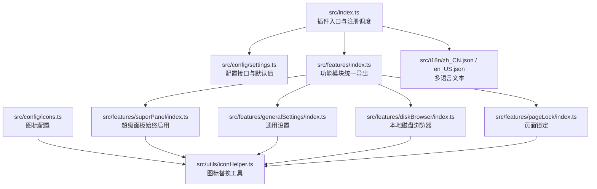
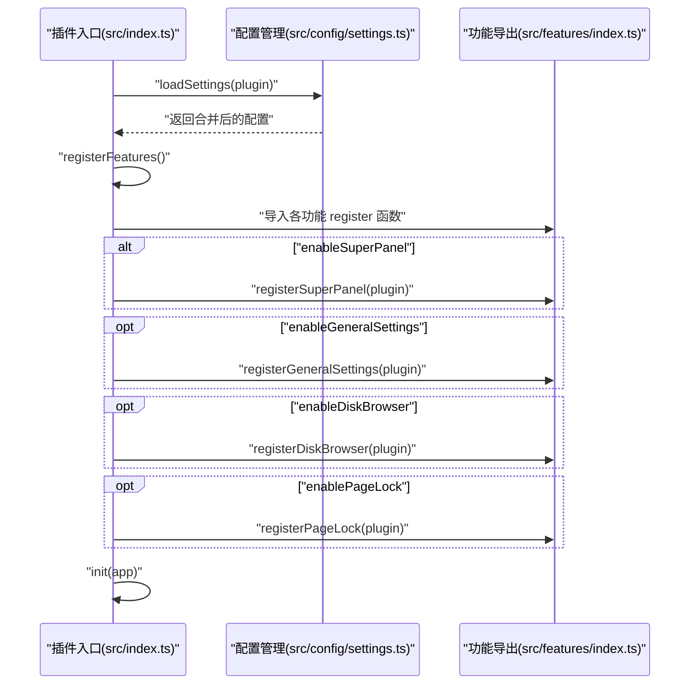
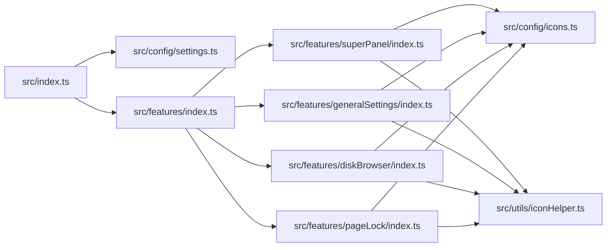

# 添加新功能模块

<cite>
**本文引用的文件**
- [src/index.ts](file://src/index.ts)
- [src/features/index.ts](file://src/features/index.ts)
- [src/config/settings.ts](file://src/config/settings.ts)
- [src/i18n/zh_CN.json](file://src/i18n/zh_CN.json)
- [src/i18n/en_US.json](file://src/i18n/en_US.json)
- [src/features/superPanel/index.ts](file://src/features/superPanel/index.ts)
- [src/features/generalSettings/index.ts](file://src/features/generalSettings/index.ts)
- [src/features/diskBrowser/index.ts](file://src/features/diskBrowser/index.ts)
- [src/features/pageLock/index.ts](file://src/features/pageLock/index.ts)
- [src/config/icons.ts](file://src/config/icons.ts)
- [src/utils/iconHelper.ts](file://src/utils/iconHelper.ts)
</cite>

## 目录
1. [简介](#简介)
2. [项目结构](#项目结构)
3. [核心组件](#核心组件)
4. [架构总览](#架构总览)
5. [详细组件分析](#详细组件分析)
6. [依赖关系分析](#依赖关系分析)
7. [性能考量](#性能考量)
8. [故障排查指南](#故障排查指南)
9. [结论](#结论)
10. [附录：从零开始创建 myFeature 的完整流程](#附录从零开始创建-myfeature-的完整流程)

## 简介
本指南面向希望在现有插件中添加新功能模块的开发者，提供从零到一的完整流程与最佳实践。你将学会：
- 在 src/features/ 下创建新功能目录与主入口文件
- 编写功能主文件 index.ts，实现 register 函数与思源笔记插件 API 的调用规范
- 在 src/features/index.ts 中正确导出新功能
- 在 src/config/settings.ts 中定义配置接口与默认值
- 在 src/index.ts 的 registerFeatures() 方法中按配置条件注册功能
- 在 src/i18n/ 多语言文件中添加翻译文本
- 验证新功能是否正确注册与加载，以及常见问题的排查方法

## 项目结构
该项目采用“功能模块化 + 配置驱动 + 国际化”的组织方式：
- 功能模块集中于 src/features/，每个功能一个子目录，包含 index.ts 主入口与相关组件/工具
- 插件入口位于 src/index.ts，负责加载配置、按配置条件注册各功能模块
- 配置管理位于 src/config/settings.ts，提供配置接口、默认值与持久化读写
- 国际化文本位于 src/i18n/，包含中英文翻译键值
- 图标与 UI 辅助工具位于 src/config/icons.ts 与 src/utils/iconHelper.ts

图表来源
- [src/index.ts](file://src/index.ts#L1-L140)
- [src/features/index.ts](file://src/features/index.ts#L1-L15)
- [src/config/settings.ts](file://src/config/settings.ts#L1-L141)
- [src/i18n/zh_CN.json](file://src/i18n/zh_CN.json#L1-L317)
- [src/i18n/en_US.json](file://src/i18n/en_US.json#L1-L312)
- [src/config/icons.ts](file://src/config/icons.ts#L1-L194)
- [src/utils/iconHelper.ts](file://src/utils/iconHelper.ts#L1-L147)

章节来源
- [src/index.ts](file://src/index.ts#L1-L140)
- [src/features/index.ts](file://src/features/index.ts#L1-L15)
- [src/config/settings.ts](file://src/config/settings.ts#L1-L141)

## 核心组件
- 插件入口与注册调度：src/index.ts
  - 负责加载配置、调用 registerFeatures()、初始化 UI 并暴露 openSetting() 等能力
  - registerFeatures() 根据配置逐项注册功能，且超级面板始终启用
- 功能模块统一导出：src/features/index.ts
  - 将各功能的 register 函数导出，供插件入口按需导入
- 配置管理：src/config/settings.ts
  - 定义 PluginSettings 接口与 DEFAULT_SETTINGS 默认值
  - 提供 loadSettings/saveSettings 等持久化读写函数
- 国际化：src/i18n/zh_CN.json 与 src/i18n/en_US.json
  - 通过键名统一管理文案，插件通过 plugin.i18n 访问
- 图标与 UI 工具：src/config/icons.ts 与 src/utils/iconHelper.ts
  - 统一图标配置与替换，提升视觉一致性

章节来源
- [src/index.ts](file://src/index.ts#L1-L140)
- [src/features/index.ts](file://src/features/index.ts#L1-L15)
- [src/config/settings.ts](file://src/config/settings.ts#L1-L141)
- [src/i18n/zh_CN.json](file://src/i18n/zh_CN.json#L1-L317)
- [src/i18n/en_US.json](file://src/i18n/en_US.json#L1-L312)
- [src/config/icons.ts](file://src/config/icons.ts#L1-L194)
- [src/utils/iconHelper.ts](file://src/utils/iconHelper.ts#L1-L147)

## 架构总览
插件启动时的注册流程如下：
- 插件入口加载配置
- 调用 registerFeatures()，按配置条件逐一注册功能
- 超级面板（统一入口）始终注册
- 各功能模块通过 register 函数接入插件生命周期与 UI

图表来源
- [src/index.ts](file://src/index.ts#L1-L140)
- [src/features/index.ts](file://src/features/index.ts#L1-L15)
- [src/config/settings.ts](file://src/config/settings.ts#L1-L141)

## 详细组件分析

### 超级面板（始终启用）
- 作用：在右侧边栏提供统一入口，快速访问各功能
- 实现要点：
  - 通过 plugin.addTopBar 添加顶部图标按钮
  - 通过 replaceTopBarIcon 使用 Iconify 图标替换
  - 通过 plugin.addCommand 添加快捷键
  - 通过 createApp 挂载 Vue 组件，支持打开设置与触发功能动作

章节来源
- [src/features/superPanel/index.ts](file://src/features/superPanel/index.ts#L1-L138)
- [src/config/icons.ts](file://src/config/icons.ts#L1-L194)
- [src/utils/iconHelper.ts](file://src/utils/iconHelper.ts#L1-L147)

### 通用设置（示例：右侧边栏 Dock）
- 作用：提供字体、代码块样式等通用配置
- 实现要点：
  - 通过 plugin.addDock 在右侧边栏添加 Dock
  - 通过 createApp 挂载 Vue 组件，接收 i18n 与回调
  - 通过 localStorage 保存用户偏好，应用到页面样式

章节来源
- [src/features/generalSettings/index.ts](file://src/features/generalSettings/index.ts#L1-L414)

### 本地磁盘浏览器（示例：右侧边栏 Dock）
- 作用：在右侧边栏显示本地磁盘，支持打开文件夹
- 实现要点：
  - 通过 plugin.addDock 添加 Dock
  - 通过 createApp 挂载 Vue 组件，传入 i18n

章节来源
- [src/features/diskBrowser/index.ts](file://src/features/diskBrowser/index.ts#L1-L51)

### 页面锁定（示例：事件监听与 DOM 操作）
- 作用：对文档进行加密锁定，拦截内容显示，提供解锁流程
- 实现要点：
  - 监听文档切换/加载事件，动态注入锁定按钮
  - 通过 setBlockAttrs 为文档添加自定义属性
  - 通过 createApp 挂载 Vue 对话框，处理密码校验与状态更新
  - 通过注入样式与图标增强 UI 体验

章节来源
- [src/features/pageLock/index.ts](file://src/features/pageLock/index.ts#L1-L573)

### 功能主文件 index.ts 的实现规范
- 必须导出一个 register 函数，参数为 Plugin 实例
- 在 register 中：
  - 初始化必要的状态与存储
  - 订阅插件事件（如 switch-protyle、loaded-protyle-*）
  - 通过插件 API 注册 UI（如 addTopBar、addDock、addCommand）
  - 通过 plugin.i18n 访问国际化文案
  - 如需与 DOM 交互，注意清理与卸载逻辑
- 可选：提供工具函数（如清理、状态重置），便于外部调用

章节来源
- [src/features/superPanel/index.ts](file://src/features/superPanel/index.ts#L1-L138)
- [src/features/generalSettings/index.ts](file://src/features/generalSettings/index.ts#L1-L414)
- [src/features/diskBrowser/index.ts](file://src/features/diskBrowser/index.ts#L1-L51)
- [src/features/pageLock/index.ts](file://src/features/pageLock/index.ts#L1-L573)

## 依赖关系分析
- 插件入口依赖配置模块与功能导出模块
- 功能模块之间低耦合，通过 register 函数与插件 API 交互
- 图标与 UI 工具为跨功能复用的基础设施

图表来源
- [src/index.ts](file://src/index.ts#L1-L140)
- [src/features/index.ts](file://src/features/index.ts#L1-L15)
- [src/config/settings.ts](file://src/config/settings.ts#L1-L141)
- [src/config/icons.ts](file://src/config/icons.ts#L1-L194)
- [src/utils/iconHelper.ts](file://src/utils/iconHelper.ts#L1-L147)

章节来源
- [src/index.ts](file://src/index.ts#L1-L140)
- [src/features/index.ts](file://src/features/index.ts#L1-L15)
- [src/config/icons.ts](file://src/config/icons.ts#L1-L194)
- [src/utils/iconHelper.ts](file://src/utils/iconHelper.ts#L1-L147)

## 性能考量
- 事件订阅与清理
  - 在 register 中订阅事件时，应确保在功能卸载时清理监听器，避免内存泄漏
  - 对 DOM 注入的元素与样式，应在卸载时移除
- 异步与并发
  - 配置读写与网络请求（如图标加载）应使用异步处理，并在失败时降级
- UI 渲染
  - 优先使用 Vue 组件挂载，减少直接 DOM 操作
  - 对频繁触发的事件（如滚动、键盘），建议节流/防抖
- 资源占用
  - 避免在循环中进行昂贵的 DOM 查询，尽量缓存选择器结果
  - 图标加载建议延迟执行，避免阻塞首屏渲染

## 故障排查指南
- 功能未显示
  - 检查 src/index.ts 的 registerFeatures() 是否按配置条件注册
  - 确认 src/features/index.ts 是否导出了新功能的 register 函数
  - 检查 src/config/settings.ts 中对应开关是否为 true
- 文案缺失
  - 在 src/i18n/zh_CN.json 与 src/i18n/en_US.json 中添加对应键值
  - 在功能主文件中通过 plugin.i18n 访问
- 图标不显示
  - 确认 src/config/icons.ts 中已配置图标
  - 确认 src/utils/iconHelper.ts 的 replaceTopBarIcon 调用正确
- 事件未触发
  - 检查事件名称与订阅方式是否匹配
  - 确认 DOM 结构是否存在（如标题栏、工具栏）
- 配置不生效
  - 确认 saveSettings 成功返回
  - 重启插件或重新加载页面以使配置生效

章节来源
- [src/index.ts](file://src/index.ts#L1-L140)
- [src/features/index.ts](file://src/features/index.ts#L1-L15)
- [src/config/settings.ts](file://src/config/settings.ts#L1-L141)
- [src/i18n/zh_CN.json](file://src/i18n/zh_CN.json#L1-L317)
- [src/i18n/en_US.json](file://src/i18n/en_US.json#L1-L312)
- [src/utils/iconHelper.ts](file://src/utils/iconHelper.ts#L1-L147)

## 结论
通过遵循本文提供的流程与规范，你可以稳定地在插件中添加新功能模块。关键在于：
- 以 register 函数为核心，严格对接插件 API
- 以配置驱动注册，保证功能可开关
- 以国际化与图标工具提升用户体验
- 注重事件与 DOM 的清理，确保性能与稳定性

## 附录：从零开始创建 myFeature 的完整流程
以下为创建名为 “myFeature” 的完整步骤与注意事项，帮助你从零到一完成新功能模块的集成。

步骤 1：在 src/features/ 下创建新功能目录与主入口
- 新建目录：src/features/myFeature/
- 在目录内创建 index.ts 作为功能主入口
- 在 index.ts 中导出 register 函数，参数为 Plugin 实例
- 在 register 中：
  - 初始化必要状态与存储
  - 订阅插件事件（如需要）
  - 通过插件 API 注册 UI（如 addTopBar、addDock、addCommand）
  - 通过 plugin.i18n 访问国际化文案
  - 如需与 DOM 交互，注意清理与卸载逻辑

步骤 2：在 src/features/index.ts 中导出新功能
- 在导出列表中新增：export { registerMyFeature } from './myFeature'
- 保持导出命名与功能目录一致，便于入口导入

步骤 3：在 src/config/settings.ts 中定义配置接口与默认值
- 在 PluginSettings 接口中新增布尔字段，如 enableMyFeature
- 在 DEFAULT_SETTINGS 中为 enableMyFeature 设置默认值（通常为 true 或 false）
- 如需额外配置项，新增相应字段与默认值

步骤 4：在 src/index.ts 的 registerFeatures() 方法中注册功能
- 在 if 分支中增加对 enableMyFeature 的判断
- 若功能需要异步等待（如某些初始化），使用 await
- 保持与现有功能一致的注册顺序与日志输出

步骤 5：在 src/i18n/ 多语言文件中添加翻译文本
- 在 zh_CN.json 与 en_US.json 中添加键值对，如：
  - "enableMyFeature": "启用我的功能"
  - "enableMyFeatureDesc": "描述我的功能"
- 在功能主文件中通过 plugin.i18n 访问这些键值

步骤 6：验证新功能是否正确注册与加载
- 重启插件或重新加载页面
- 检查是否出现新 UI（如顶部图标、右侧边栏 Dock、快捷键等）
- 在设置中切换 enableMyFeature 开关，观察功能是否按预期启用/禁用
- 打开浏览器控制台，确认无错误日志

步骤 7：常见问题排查
- 功能未显示：检查 register 函数是否被导入与调用；检查配置开关；检查 UI 注册 API 是否正确
- 文案缺失：确认 i18n 键值存在；确认功能主文件使用 plugin.i18n 正确访问
- 图标不显示：确认图标配置与替换工具调用正确
- 事件未触发：核对事件名称与订阅方式；确认 DOM 结构存在
- 配置不生效：确认 saveSettings 成功；重启插件或重新加载页面

章节来源
- [src/features/index.ts](file://src/features/index.ts#L1-L15)
- [src/config/settings.ts](file://src/config/settings.ts#L1-L141)
- [src/index.ts](file://src/index.ts#L1-L140)
- [src/i18n/zh_CN.json](file://src/i18n/zh_CN.json#L1-L317)
- [src/i18n/en_US.json](file://src/i18n/en_US.json#L1-L312)