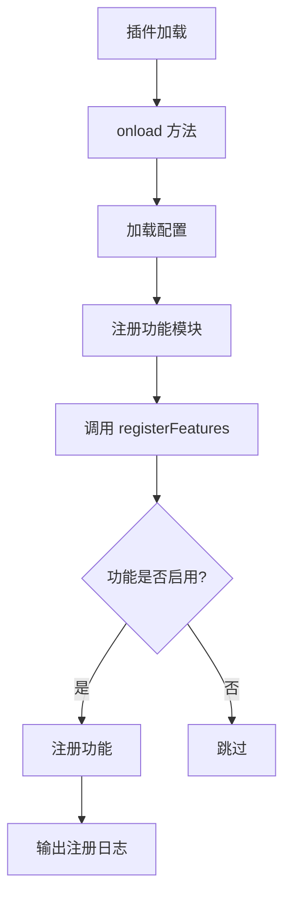

# 调试技巧

<cite>
**本文档引用的文件**   
- [README.md](file://README.md)
- [vite.config.ts](file://vite.config.ts)
- [package.json](file://package.json)
- [src/index.ts](file://src/index.ts)
- [src/main.ts](file://src/main.ts)
- [src/config/settings.ts](file://src/config/settings.ts)
- [src/features/pageLock/index.ts](file://src/features/pageLock/index.ts)
- [src/features/generalSettings/index.ts](file://src/features/generalSettings/index.ts)
- [src/features/shortcut/index.ts](file://src/features/shortcut/index.ts)
- [src/App.vue](file://src/App.vue)
- [src/components/SettingPanel.vue](file://src/components/SettingPanel.vue)
- [src/api.ts](file://src/api.ts)
- [plugin.json](file://plugin.json)
</cite>

## 目录
1. [开发环境调试配置](#开发环境调试配置)
2. [浏览器开发者工具使用](#浏览器开发者工具使用)
3. [Vue DevTools 使用](#vue-devtools-使用)
4. [插件特定调试方法](#插件特定调试方法)
5. [构建错误分析](#构建错误分析)
6. [常见问题解决方案](#常见问题解决方案)
7. [生产环境问题追踪](#生产环境问题追踪)

## 开发环境调试配置

本项目基于 Vite + Vue3 构建，提供了完整的开发工作流支持。开发模式下通过 `pnpm dev` 命令启动 Vite 开发服务器，该命令会执行 `vite build --watch`，实现监听构建模式。

Vite 开发服务器的启动配置在 `vite.config.ts` 文件中定义。通过 `loadEnv` 方法加载环境变量，其中 `VITE_SIYUAN_WORKSPACE_PATH` 环境变量用于指定思源笔记工作区路径。当该变量存在时，构建产物会自动输出到思源工作区的 `data/plugins/siyuan-plugin-vite-vue-sn` 目录，实现热重载功能。

热重载机制通过 Vite 的 `--watch` 模式和 `rollup-plugin-livereload` 插件实现。当代码发生变化时，Vite 会自动重新构建，并通过 livereload 插件通知浏览器刷新页面。同时，`vite-plugin-static-copy` 插件确保静态资源文件（如 README.md、plugin.json 等）在构建过程中被正确复制到输出目录。

源码映射设置在 `vite.config.ts` 的 `build.sourcemap` 配置项中控制。当前配置为 `sourcemap: false`，在开发模式下可以将其设置为 `true` 以启用源码映射，便于调试原始源代码。

**Section sources**
- [vite.config.ts](file://vite.config.ts#L1-L157)
- [package.json](file://package.json#L1-L46)
- [README.md](file://README.md#L1-L436)

## 浏览器开发者工具使用

浏览器开发者工具是调试 Vue 组件、检查状态变化和监听事件的重要手段。在思源笔记中，可以通过快捷键 `Ctrl + Shift + I`（Windows/Linux）或 `Cmd + Option + I`（macOS）打开开发者工具。

在开发者工具的 Console 面板中，可以查看插件输出的调试信息。本项目在多个关键位置使用了 `console.log` 语句进行调试输出，例如在 `src/index.ts` 的 `onload` 方法中输出 "Plugin loaded, the plugin is" 信息，在 `src/config/settings.ts` 中输出配置保存和加载的状态。

通过 Elements 面板可以检查 Vue 组件的 DOM 结构和 CSS 样式。例如，页面锁定功能在文档标题栏右侧添加了一个锁定按钮，其 DOM 结构可以通过开发者工具进行检查。该按钮的类名为 `page-lock-button`，并包含一个 SVG 图标，通过 CSS 类 `icon-lock--locked` 表示锁定状态。

Network 面板可用于监控 API 请求。当插件调用思源笔记的 API 时，可以在 Network 面板中查看请求的详细信息，包括请求方法、URL、请求头、请求体和响应数据。这对于调试 API 调用问题非常有帮助。

**Section sources**
- [src/index.ts](file://src/index.ts#L1-L140)
- [src/config/settings.ts](file://src/config/settings.ts#L1-L141)
- [src/features/pageLock/index.ts](file://src/features/pageLock/index.ts#L1-L573)

## Vue DevTools 使用

Vue DevTools 是调试 Vue 组件的强大工具，可以用于组件树分析、状态追踪和性能检测。安装 Vue DevTools 浏览器插件后，可以在开发者工具中看到 Vue 选项卡。

在 Vue DevTools 的 Components 面板中，可以查看应用的组件树结构。本插件的主应用组件是 `App.vue`，它包含了多个子组件，如 `SettingPanel`、`ImageViewer` 和 `QRCodeDialog`。通过组件树可以清晰地了解组件之间的层级关系。

State 面板显示了组件的响应式状态。例如，在 `SettingPanel.vue` 组件中，`localSettings` 响应式对象存储了插件的本地配置副本。通过 Vue DevTools 可以实时查看和修改这个状态，观察界面的变化。

Events 面板记录了组件触发的事件。当用户在设置面板中点击保存按钮时，会触发 `save` 事件，该事件会被父组件捕获并处理。通过 Events 面板可以验证事件是否正确触发和处理。

Performance 面板可用于检测组件的渲染性能。通过录制功能可以分析组件的渲染时间，识别性能瓶颈。例如，可以检查 `GeneralSettingsPanel` 组件在应用大量字体设置时的渲染性能。

**Section sources**
- [src/App.vue](file://src/App.vue#L1-L216)
- [src/components/SettingPanel.vue](file://src/components/SettingPanel.vue#L1-L427)
- [src/features/generalSettings/index.ts](file://src/features/generalSettings/index.ts#L1-L414)

## 插件特定调试方法

### onload 和 registerFeatures 中的日志输出

插件的生命周期方法 `onload` 和 `registerFeatures` 是调试的重要切入点。在 `src/index.ts` 的 `onload` 方法中，通过 `console.log('Plugin loaded, the plugin is ', this)` 输出插件实例信息，便于确认插件是否正确加载。

`registerFeatures` 方法中为每个功能模块的注册添加了日志输出。例如，当注册页面锁定功能时，输出 "注册页面锁定功能" 日志；当注册目录插件功能时，输出 "注册目录插件功能" 日志。这些日志有助于跟踪功能模块的加载顺序和状态。



**Diagram sources**
- [src/index.ts](file://src/index.ts#L39-L126)

### 使用 console.log 和 debugger 语句

本项目在多个关键位置使用了 `console.log` 语句进行调试。例如，在 `src/features/pageLock/index.ts` 中，当加载全局密码时输出 "全局密码已加载" 日志；在 `src/features/generalSettings/index.ts` 中，当初始化通用设置模块时输出 "通用设置模块已初始化" 日志。

除了 `console.log`，还可以使用 `debugger` 语句设置断点。当代码执行到 `debugger` 语句时，如果开发者工具已打开，执行会暂停，允许检查当前的调用栈、作用域变量和执行上下文。

在异步操作中，`console.log` 特别有用。例如，在 `src/api.ts` 的 `getFile` 方法中，成功获取文件后会输出 "getFile success:" 日志，包含文件路径、大小和类型信息。这有助于验证文件读取操作是否成功。

**Section sources**
- [src/features/pageLock/index.ts](file://src/features/pageLock/index.ts#L1-L573)
- [src/features/generalSettings/index.ts](file://src/features/generalSettings/index.ts#L1-L414)
- [src/api.ts](file://src/api.ts#L1-L496)

## 构建错误分析

### TypeScript 类型错误

TypeScript 类型错误是常见的构建问题。本项目使用 TypeScript 5.0.4，通过 `tsconfig.json` 配置类型检查。常见的类型错误包括：

1. 模块导入错误：确保导入的模块路径正确，例如 `import { Plugin } from 'siyuan'`。
2. 类型不匹配：检查函数参数和返回值的类型是否匹配，例如 `loadSettings` 方法返回 `Promise<PluginSettings>`。
3. 可选属性访问：在访问可能为 `undefined` 的对象属性时，使用可选链操作符 `?.`。

在 `src/features/shortcut/index.ts` 中，通过 `@ts-ignore` 注释暂时忽略了一个类型检查错误，这表明在某些情况下可能需要权衡类型安全和代码灵活性。

### Vite 打包问题

Vite 打包问题可能由多种原因引起。在 `vite.config.ts` 中，通过 `external: ["siyuan", "process"]` 配置将 `siyuan` 和 `process` 模块外部化，避免将它们打包到最终产物中。

构建产物的输出路径由 `build.outDir` 配置。在开发模式下，输出到 `devDistDir`；在生产模式下，输出到 `./dist` 目录。确保输出路径正确配置，避免构建产物无法找到。

如果构建失败，可以尝试以下解决方案：
1. 清除依赖重新安装：`rm -rf node_modules && pnpm install`
2. 检查 Node.js 版本是否 >= 16
3. 确保 TypeScript 类型定义正确

**Section sources**
- [vite.config.ts](file://vite.config.ts#L1-L157)
- [tsconfig.json](file://tsconfig.json)
- [package.json](file://package.json#L1-L46)

## 常见问题解决方案

### 插件加载失败

插件加载失败的常见原因是 `plugin.json` 中的 `minAppVersion` 与思源笔记版本不匹配。检查 `plugin.json` 文件，确保 `minAppVersion` 设置正确。

另一个可能原因是环境变量配置错误。确保 `.env` 文件中的 `VITE_SIYUAN_WORKSPACE_PATH` 配置正确，并且思源笔记正在运行。

### 功能模块未注册

功能模块未注册通常是由于配置开关未启用。在 `src/config/settings.ts` 中，每个功能模块都有一个对应的启用配置项，如 `enablePageLock`、`enableTableOfContents` 等。确保在设置面板中启用了相应功能。

如果功能模块代码存在问题，`registerFeatures` 方法中的 `try-catch` 块可能会捕获错误但不中断其他功能的注册。检查控制台日志，查看是否有相关错误信息。

### 配置不生效

配置不生效可能是由于配置保存失败。在 `src/config/settings.ts` 中，`saveSettings` 方法负责保存配置。如果保存失败，会输出 "保存配置失败" 日志。

另一个可能原因是配置未正确合并。`loadSettings` 方法将默认配置和已保存的配置合并，确保新配置项不会丢失。

**Section sources**
- [plugin.json](file://plugin.json#L1-L34)
- [src/config/settings.ts](file://src/config/settings.ts#L1-L141)
- [src/index.ts](file://src/index.ts#L1-L140)

## 生产环境问题追踪

生产环境问题追踪依赖于 Sourcemap。虽然当前配置中 `build.sourcemap` 设置为 `false`，但在需要调试生产环境问题时，可以临时将其设置为 `true`。

启用 Sourcemap 后，当出现 JavaScript 错误时，浏览器开发者工具可以将压缩后的代码映射回原始源代码，显示错误发生的具体文件和行号。这对于定位生产环境中的问题至关重要。

在 `vite.config.ts` 中，Sourcemap 配置位于 `build` 选项下：
```typescript
build: {
  sourcemap: false,
  // 其他配置...
}
```

要启用 Sourcemap，只需将 `sourcemap` 设置为 `true`。构建后，会在输出目录中生成 `.map` 文件，这些文件包含了源代码映射信息。

**Section sources**
- [vite.config.ts](file://vite.config.ts#L1-L157)