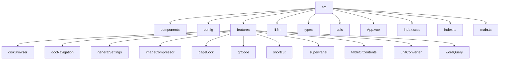
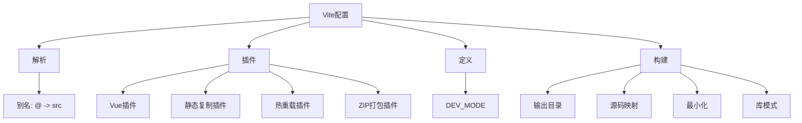
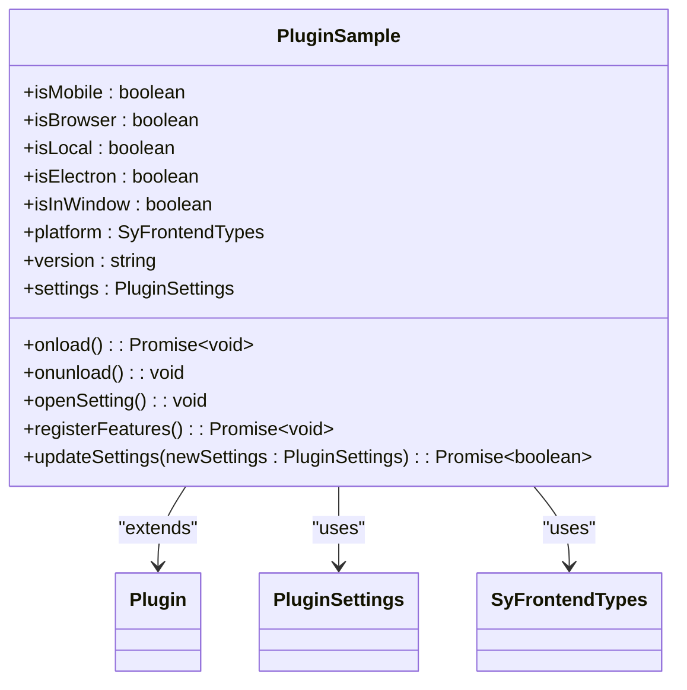
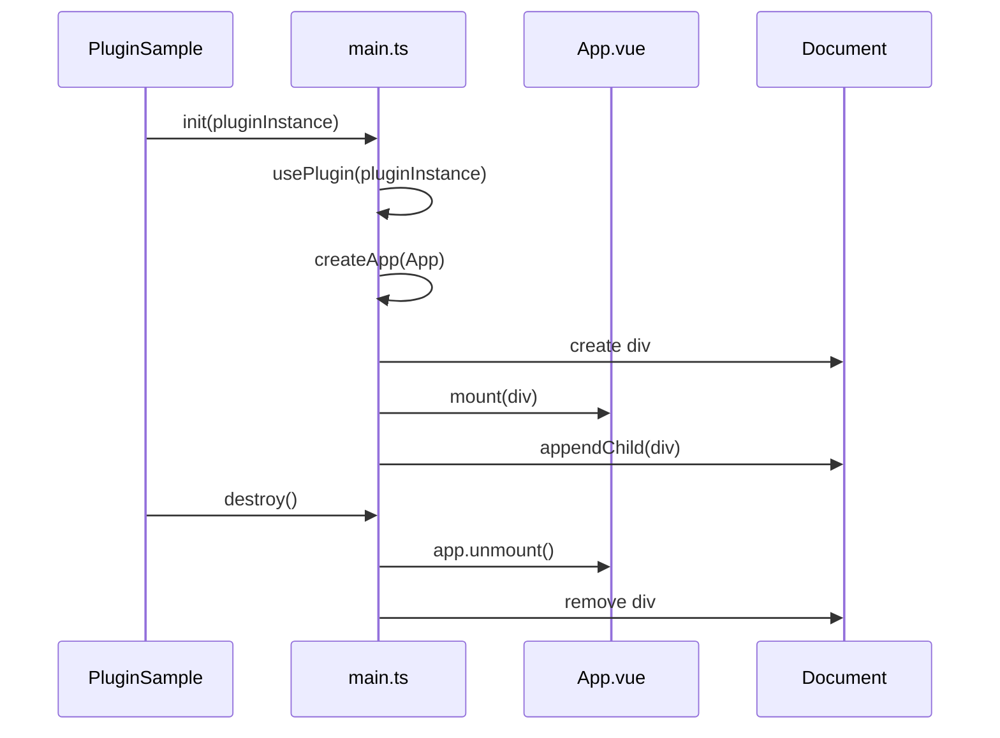
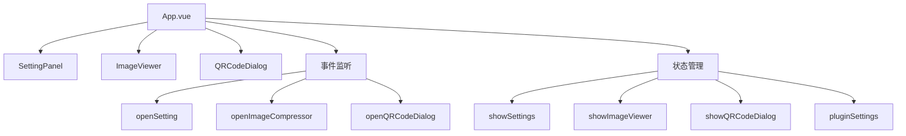
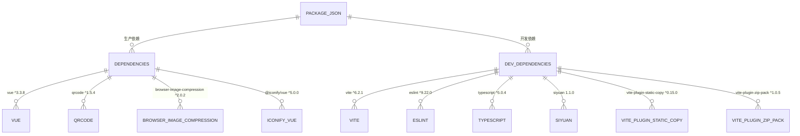

# 开发规范

<cite>
**本文档引用的文件**
- [eslint.config.mjs](file://eslint.config.mjs)
- [tsconfig.json](file://tsconfig.json)
- [vite.config.ts](file://vite.config.ts)
- [package.json](file://package.json)
- [src/index.ts](file://src/index.ts)
- [src/main.ts](file://src/main.ts)
- [src/App.vue](file://src/App.vue)
- [src/features/index.ts](file://src/features/index.ts)
- [src/config/settings.ts](file://src/config/settings.ts)
- [src/types/index.d.ts](file://src/types/index.d.ts)
- [src/utils/index.ts](file://src/utils/index.ts)
- [src/components/SettingPanel.vue](file://src/components/SettingPanel.vue)
- [src/features/generalSettings/index.ts](file://src/features/generalSettings/index.ts)
- [src/features/superPanel/index.ts](file://src/features/superPanel/index.ts)
- [src/features/unitConverter/index.ts](file://src/features/unitConverter/index.ts)
- [src/features/imageCompressor/index.ts](file://src/features/imageCompressor/index.ts)
</cite>

## 目录
1. [介绍](#介绍)
2. [项目结构](#项目结构)
3. [命名约定](#命名约定)
4. [目录组织原则](#目录组织原则)
5. [代码风格与ESLint配置](#代码风格与eslint配置)
6. [TypeScript配置](#typescript配置)
7. [Vite构建配置](#vite构建配置)
8. [核心组件分析](#核心组件分析)
9. [依赖分析](#依赖分析)
10. [性能考虑](#性能考虑)
11. [故障排除指南](#故障排除指南)
12. [结论](#结论)

## 介绍
本开发规范文档旨在为思源笔记插件项目建立统一的开发标准，确保代码质量和一致性。文档详细说明了命名约定、目录组织、代码风格、TypeScript和Vite配置等关键方面，为团队提供清晰的指导，降低维护成本并提高开发效率。

## 项目结构
该项目采用功能模块化的目录结构，将相关功能组织在独立的目录中，便于管理和维护。核心源码位于`src`目录下，包含组件、配置、功能模块、国际化、类型定义和工具函数等。



**图示来源**
- [src](file://src)
- [src/features](file://src/features)

**本节来源**
- [src](file://src)

## 命名约定
项目遵循一致的命名约定，以提高代码的可读性和可维护性。

- **文件名**：使用camelCase命名法，例如`main.ts`、`index.scss`。
- **Vue组件**：使用PascalCase命名法，例如`SettingPanel.vue`、`SuperPanelView.vue`。
- **函数和变量**：使用camelCase命名法，例如`loadSettings`、`pluginSettings`。
- **常量**：使用UPPER_CASE命名法，例如`DEFAULT_SETTINGS`、`SETTINGS_KEY`。

这些约定在项目中得到一致应用，如`src/config/settings.ts`中的`DEFAULT_SETTINGS`常量和`src/components/SettingPanel.vue`中的组件命名所示。

**本节来源**
- [src/config/settings.ts](file://src/config/settings.ts#L37-L50)
- [src/components/SettingPanel.vue](file://src/components/SettingPanel.vue)

## 目录组织原则
项目采用清晰的目录组织原则，将不同类型的代码分离到相应的目录中。

- **src/components**：存放可复用的通用Vue组件，如`IconWrapper.vue`和`SettingPanel.vue`。
- **src/config**：存放插件配置相关的代码，包括`icons.ts`和`settings.ts`。
- **src/features**：按功能模块组织，每个功能（如`imageCompressor`、`generalSettings`）有独立的子目录，包含其所有相关文件。
- **src/utils**：存放工具函数，如`iconHelper.ts`和通用的`index.ts`。
- **src/types**：存放TypeScript类型定义，包括`api.d.ts`、`index.d.ts`和`vue.d.ts`。

这种组织方式使得代码结构清晰，便于定位和维护特定功能。

**本节来源**
- [src](file://src)
- [src/components](file://src/components)
- [src/config](file://src/config)
- [src/features](file://src/features)
- [src/utils](file://src/utils)
- [src/types](file://src/types)

## 代码风格与ESLint配置
项目使用ESLint强制执行代码规范，确保代码风格的一致性。ESLint配置文件`eslint.config.mjs`基于`@antfu/eslint-config`，并进行了自定义调整。

```mermaid
graph TD
A[ESLint配置] --> B[基础配置]
A --> C[Vue规则]
A --> D[TypeScript规则]
A --> E[自定义规则]
B --> F[type: 'lib']
B --> G[stylistic: {indent: 2, quotes: 'single'}]
C --> H[vue: true]
D --> I[typescript: true]
E --> J[object-curly-newline: error]
E --> K[vue/max-attributes-per-line: error]
E --> L[no-console: off]
```

**图示来源**
- [eslint.config.mjs](file://eslint.config.mjs)

**本节来源**
- [eslint.config.mjs](file://eslint.config.mjs)

### ESLint规则详解
- **缩进**：使用2个空格进行缩进。
- **引号**：优先使用单引号。
- **对象换行**：多属性对象必须换行，如`object-curly-newline`规则所定义。
- **属性每行**：Vue模板中每行最多一个属性，由`vue/max-attributes-per-line`规则强制执行。
- **控制台输出**：`no-console`规则被关闭，允许在开发过程中使用`console.log`。
- **Vue块顺序**：强制`<template>`、`<script>`、`<style>`的顺序，由`vue/block-order`规则定义。

通过运行`pnpm lint`命令可以检查代码是否符合这些规范。

**本节来源**
- [eslint.config.mjs](file://eslint.config.mjs)

## TypeScript配置
项目的TypeScript配置在`tsconfig.json`文件中定义，为开发提供了类型安全和良好的开发体验。

```mermaid
classDiagram
class TsConfig {
+target : "ESNext"
+jsx : "preserve"
+lib : string[]
+module : "ESNext"
+moduleResolution : "Node"
+baseUrl : "."
+paths : Map~string,string[]~
+types : string[]
+strict : false
+noFallthroughCasesInSwitch : true
+noUnusedLocals : true
+noUnusedParameters : true
+isolatedModules : true
}
TsConfig : +include : string[]
TsConfig : +exclude : string[]
```

**图示来源**
- [tsconfig.json](file://tsconfig.json)

**本节来源**
- [tsconfig.json](file://tsconfig.json)

### 关键TypeScript选项
- **target**：设置为`ESNext`，允许使用最新的JavaScript特性。
- **module**：设置为`ESNext`，支持ES模块语法。
- **moduleResolution**：设置为`Node`，遵循Node.js的模块解析规则。
- **baseUrl** 和 **paths**：配置了`@/*`路径别名，指向`src/*`，简化了模块导入。
- **types**：包含了`node`、`vite/client`和`siyuan`，确保了对这些环境的类型支持。
- **严格模式**：`strict`选项被关闭，但启用了`noFallthroughCasesInSwitch`、`noUnusedLocals`和`noUnusedParameters`等严格的子选项。
- **isolatedModules**：设置为`true`，确保每个文件都可以被独立编译，与Vite的ES模块构建兼容。

这些配置共同提供了强大的类型检查，同时保持了开发的灵活性。

**本节来源**
- [tsconfig.json](file://tsconfig.json)

## Vite构建配置
Vite构建配置在`vite.config.ts`文件中定义，负责项目的开发服务器和生产构建。



**图示来源**
- [vite.config.ts](file://vite.config.ts)

**本节来源**
- [vite.config.ts](file://vite.config.ts)

### Vite配置详解
- **别名**：配置了`@`别名指向`src`目录，简化了导入路径。
- **插件**：
  - `@vitejs/plugin-vue`：支持Vue单文件组件。
  - `vite-plugin-static-copy`：在构建时复制静态文件，如`README.md`、`plugin.json`等。
  - `rollup-plugin-livereload`：在开发模式下提供热重载功能。
  - `vite-plugin-zip-pack`：在发布模式下将构建结果打包为`package.zip`。
- **定义**：通过`define`选项注入环境变量，如`process.env.DEV_MODE`。
- **构建**：
  - `outDir`：根据`--watch`参数决定输出到`dev`目录或`dist`目录。
  - `minify`：在非开发模式下启用最小化。
  - `lib`：配置为库模式，入口为`src/index.ts`，输出格式为`cjs`。
  - `external`：将`siyuan`和`process`标记为外部依赖，不打包进最终产物。

这些配置确保了开发的高效性和生产的可靠性。

**本节来源**
- [vite.config.ts](file://vite.config.ts)

## 核心组件分析
项目的核心组件构成了插件的骨架，负责初始化、功能注册和全局状态管理。

### 主入口分析
`src/index.ts`是插件的主入口文件，定义了`PluginSample`类，继承自`siyuan.Plugin`。



**图示来源**
- [src/index.ts](file://src/index.ts)

**本节来源**
- [src/index.ts](file://src/index.ts)

`onload`方法在插件加载时执行，负责：
1. 检测运行环境（移动端、浏览器、Electron等）。
2. 加载插件配置。
3. 注册所有功能模块。

`registerFeatures`方法根据配置启用相应的功能模块，实现了功能的按需加载。

### 主应用分析
`src/main.ts`文件负责Vue应用的初始化和销毁。



**图示来源**
- [src/main.ts](file://src/main.ts)
- [src/App.vue](file://src/App.vue)

**本节来源**
- [src/main.ts](file://src/main.ts)
- [src/App.vue](file://src/App.vue)

`init`函数创建Vue应用并挂载到页面上，`destroy`函数负责清理。`usePlugin`函数提供了一个全局的插件实例访问点。

### 应用根组件分析
`src/App.vue`是Vue应用的根组件，负责管理全局状态和子组件的显示。



**图示来源**
- [src/App.vue](file://src/App.vue)

**本节来源**
- [src/App.vue](file://src/App.vue)

该组件通过`v-model`和事件处理来控制子组件的显示，并通过`window`对象暴露公共方法，供外部调用。

## 依赖分析
项目依赖关系清晰，分为开发依赖和生产依赖。



**图示来源**
- [package.json](file://package.json)

**本节来源**
- [package.json](file://package.json)

### 核心依赖说明
- **Vue**：作为前端框架，版本为`^3.3.8`。
- **Vite**：作为构建工具，版本为`^6.2.1`。
- **TypeScript**：作为开发语言，版本为`^5.0.4`。
- **ESLint**：作为代码检查工具，版本为`^9.22.0`。
- **siyuan**：思源笔记的SDK，版本为`1.1.0`，是开发插件的关键依赖。
- **vite-plugin-static-copy** 和 **vite-plugin-zip-pack**：Vite插件，用于静态文件复制和发布包打包。

这些依赖共同构成了项目的开发和运行环境。

**本节来源**
- [package.json](file://package.json)

## 性能考虑
项目在性能方面进行了以下考虑：

- **按需加载**：功能模块在`registerFeatures`中根据配置动态注册，避免了不必要的代码加载。
- **库模式构建**：Vite配置为库模式，输出为`cjs`格式，优化了与思源笔记主应用的集成。
- **开发与生产分离**：通过`isWatch`标志区分开发和生产构建，开发模式下禁用最小化以方便调试。
- **静态资源优化**：使用`vite-plugin-static-copy`精确控制静态资源的复制，避免冗余。

这些措施确保了插件在运行时的高效性。

## 故障排除指南
### 常见问题
- **插件未加载**：检查`plugin.json`中的配置是否正确，确保`name`与目录名一致。
- **热重载失效**：确认`VITE_SIYUAN_WORKSPACE_PATH`环境变量已正确设置。
- **类型错误**：确保`tsconfig.json`中的`types`包含了所有必要的类型定义。

### 调试技巧
- 使用`console.log`输出调试信息，`no-console`规则已关闭。
- 利用Vue Devtools检查组件状态和事件。
- 通过`pnpm dev`命令启动开发服务器，享受热重载带来的便利。

**本节来源**
- [src/index.ts](file://src/index.ts)
- [vite.config.ts](file://vite.config.ts)
- [eslint.config.mjs](file://eslint.config.mjs)

## 结论
本开发规范文档全面阐述了项目的命名约定、目录结构、代码风格、TypeScript和Vite配置。通过遵循这些规范，团队成员可以编写出高质量、一致且易于维护的代码。建议所有开发者在开始编码前仔细阅读本文档，并在开发过程中持续参考。